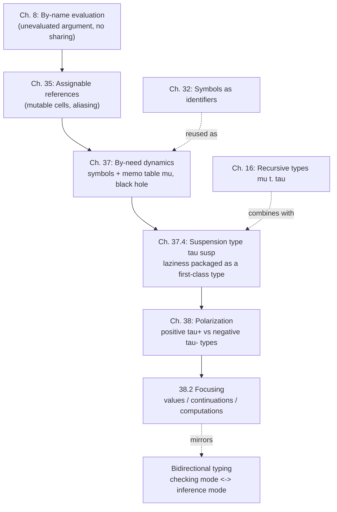

# Laziness and Polarization

[[book-guidelines|↩ Back to guidelines]]

## The problem: laziness done naively is wasteful, and language design shouldn't force a global choice

Start from something you already know from Chapter 8's by-name evaluation: pass an argument to a function unevaluated, and only evaluate it if the body actually uses it. That's already an improvement over eager (by-value) evaluation when the argument is never used — you skip work you didn't need. But by-name has a serious flaw: because passing an argument by name means *substituting the unevaluated expression itself* everywhere the parameter occurs, if the body uses the parameter more than once, you evaluate the same expression more than once. `let x = expensive_computation() in x + x` under naive by-name semantics computes `expensive_computation()` twice.

The fix seems obvious in hindsight: evaluate at most once, and *share* the result among every place that would otherwise trigger a redundant re-evaluation. This is **by-need evaluation** — laziness plus memoization plus sharing, and it is genuinely three ideas glued together, not one:

1. **Laziness** — don't evaluate until the value is demanded.
2. **Memoization** — once evaluated, remember the result so you never redo the work.
3. **Sharing** — every reference to "the same" deferred computation must resolve to the same memoized slot, not to independent copies.

Harper's insight for how to formalize this is sharp: naive substitution-based semantics *can't* express sharing, because substitution literally duplicates the syntax tree. If two occurrences of `x` are each replaced by a textual copy of the argument expression, you now have two syntactically distinct expressions that happen to look alike — nothing ties their evaluation together. What you need instead is a single, mutable, addressable location that all the copies point to. That is: you need something like the assignable references of Chapter 35, not more substitution.

**[[Control-Stacks-and-Abstract-Machines#What breaks without this|What breaks without this]]:** if you tried to implement a "lazy" language purely with substitution-based by-name semantics, every re-use of a bound deferred value would silently redo the work. In an infinite lazy list `fibs = 0 : 1 : zipWith (+) fibs (tail fibs)`, each self-reference to `fibs` would trigger its own independent unfolding — a program that should run in linear time explodes exponentially, or diverges outright.

## 37.1 By-need dynamics — naming deferred computations with symbols

Harper's mechanism: give each deferred computation a *name* — a symbol, in the sense of Chapter 32 (parameters/symbols as identifiers distinct from variables) — and store the association between symbol and computation in a **memo table** $\mu$. Every place that "shares" a computation refers to it by the same symbol, so demanding the value through any one reference updates the table, and every other reference to that symbol sees the update. Naming implements sharing; the memo table implements memoization (irredundancy).

The transition system for $L\{\mathtt{nat}\ {*}\}$ operates on states of the form

$$\nu\,\Sigma\,\{\, e \parallel \mu \,\}$$

where:

- $\Sigma$ is a finite set of hypotheses $a_1 \sim \tau_1, \dots, a_n \sim \tau_n$, associating a type to each active symbol (this grows monotonically — once a symbol is declared, it stays declared, and its type never changes),
- $e$ is the expression under evaluation, possibly mentioning symbols in $\Sigma$,
- $\mu$ maps each symbol in $\Sigma$ to *either* an unevaluated expression, *or* the value it has already computed, *or* a special marker $\bullet$ called the **black hole** (more on this below).

The notation $@a$ (borrowed, as Harper notes, from the assignable-reference syntax of Chapter 35) is shorthand for $\mathtt{get}[a]$: "fetch the current contents of symbol $a$ from the memo table."

Values are defined relative to $\Sigma$ by:

$$
\dfrac{}{z\ \mathsf{val}_\Sigma} \qquad
\dfrac{}{\mathtt{s}(a)\ \mathsf{val}_{\Sigma,a\sim\mathtt{nat}}} \qquad
\dfrac{}{\lambda(x{:}\tau)\,e\ \mathsf{val}_\Sigma}
$$

Note carefully: a bare symbol $a$ is *not* itself a value — it stands for whatever the memo table currently says it stands for. But $\mathtt{s}(a)$ *is* a value even though $a$ might point to an unevaluated computation: the successor is lazy in its predecessor.

The core [[Control-Stacks-and-Abstract-Machines#Transition rules|transition rules]] (37.3a–37.3i) are worth reading as a small state machine:

- **(37.3a)** If $\mu(a)$ has already been evaluated to a value $e$, then querying $a$ just returns that value — this is memoized lookup, no work redone.
- **(37.3b)** If $\mu(a)$ is *not yet* a value, evaluation switches focus onto $a$'s associated expression — **and simultaneously sets $\mu(a) := \bullet$ (the black hole)** while that sub-evaluation is in progress.
- **(37.3c)** Evaluating $\mathtt{s}(e)$ doesn't evaluate $e$ — it allocates a *fresh* symbol $a$, points $\mu(a) := e$, and returns $\mathtt{s}(a)$ immediately. The predecessor stays suspended until something actually asks for it.
- **(37.3f)** Case-splitting on $\mathtt{s}(a)$ substitutes the *symbol* $a$ (not a fresh copy of its expression) for the bound variable — this is exactly the step that guarantees sharing: every occurrence of the pattern-bound variable in the branch refers to the *same* memo slot.
- **(37.3h)** Function application allocates a fresh symbol for the argument and substitutes that symbol into the body — by-need call, By-name's laziness plus shared evaluation.
- **(37.3i)** General recursion, $\mathtt{fix}\ x{:}\tau\ \mathtt{is}\ e$, allocates a fresh symbol $a$ and sets $\mu(a) := [a/x]e$ — literally substituting the symbol for its own defining variable, so the deferred computation can refer to itself by name.

### The black hole: catching self-reference as it happens

Here is the payoff for tagging a symbol under active evaluation with $\bullet$. Suppose $\mathtt{fix}\ x{:}\tau\ \mathtt{is}\ x$ is evaluated: Rule (37.3i) allocates $a$ and sets $\mu(a) := a$ (substituting $a$ for $x$ in the trivial body $x$), then returns $a$. Now if something demands $a$'s value, Rule (37.3b) fires: focus shifts onto evaluating $\mu(a) = a$, and — crucially — $\mu(a)$ is set to $\bullet$ *before* that sub-evaluation proceeds. But evaluating $a$ again immediately re-queries $\mu(a)$, which is now $\bullet$. There is no rule that makes progress on a symbol bound to $\bullet$: the state is *stuck*, deliberately.

This is the difference between a genuinely nonterminating computation and a *directly circular* one — a definition that depends on its own not-yet-computed value with no productive step in between (as opposed to `fix f is λ(x) e`, where the self-reference is hidden inside a lambda and never gets forced merely to *have* the function value). The book is explicit about the diagnosis: "the black hole represents the absence of a value for that symbol, so that any attempt to access it during evaluation of its associated expression cannot make progress. This signals a circular dependency that, if not caught using a black hole, would initiate an infinite regress." Without the black hole, `fix x is x` wouldn't get stuck — it would spin forever, re-triggering rule (37.3b) on the same symbol, over and over, an infinite loop dressed up as progress. The black hole turns silent infinite regress into a *checkable, detectable* stuck state.

**[[Plotkins-PCF-and-Partial-Computation#Grounding|Grounding]] — this is exactly Haskell's `<<loop>>`.** GHC's runtime literally implements this: a thunk under evaluation is overwritten with a black-hole indicator, and if evaluation re-enters that same thunk, GHC raises `<<loop>>` at runtime rather than spinning. Harper's formalism *is* the specification of that runtime behavior.

Since Rust and Lean have no native laziness, the honest way to ground this is to build the mechanism explicitly — a thunk cell with three states (unevaluated, black hole, evaluated), mirroring $\mu$'s codomain exactly:

```rust
use std::cell::RefCell;

enum ThunkState<T> {
    Suspended(Box<dyn FnOnce() -> T>),
    BlackHole,                 // Rule (37.3b): marks "evaluation in progress"
    Forced(T),                 // Rule (37.3a): memoized result
}

struct Thunk<T>(RefCell<Option<ThunkState<T>>>);

impl<T: Clone> Thunk<T> {
    fn new(f: impl FnOnce() -> T + 'static) -> Self {
        Thunk(RefCell::new(Some(ThunkState::Suspended(Box::new(f)))))
    }

    fn force(&self) -> T {
        // Take ownership of the current state, replacing it with BlackHole —
        // this is exactly rule (37.3b): "switch focus, mark the symbol as a black hole."
        let state = self.0.replace(Some(ThunkState::BlackHole)).unwrap();
        match state {
            ThunkState::Forced(v) => {
                self.0.replace(Some(ThunkState::Forced(v.clone())));
                v
            }
            ThunkState::BlackHole => {
                // Rule (37.3b) applied to a symbol already bound to `•`: stuck.
                panic!("<<loop>>: self-referential thunk forced during its own evaluation");
            }
            ThunkState::Suspended(f) => {
                let v = f(); // may recursively call force() on itself -> hits BlackHole above
                self.0.replace(Some(ThunkState::Forced(v.clone())));
                v
            }
        }
    }
}
```

`self.0.replace(Some(BlackHole))` before running `f()` is the memo-table update in Rule (37.3b) — and a thunk that recursively demands its own value while `f` is running finds `BlackHole` sitting where its result should be, and panics with exactly the diagnostic GHC gives you. This is the mechanism, not an analogy.

## 37.2 Safety — self-reference through the memo table is legitimate, non-termination is checkable

[[Statics-And-Dynamics#The typing judgment|The typing judgment]] $\Gamma \vdash_\Sigma e : \tau$ extends Chapter 10's rules with one addition for symbols:

$$\dfrac{}{\Gamma \vdash_{\Sigma,a\sim\tau} a : \tau} \tag{37.4}$$

— a symbol is typed exactly as its declared type in $\Sigma$; using it in an expression is an implicit coercion that tacitly performs the memo-table lookup.

Well-formedness of a state, $\nu\,\Sigma\,\{e \parallel \mu\}\ \mathsf{ok}$, requires $\vdash_\Sigma e : \tau$ and $\vdash_\Sigma \mu : \Sigma$, where the memory-typing judgment (37.5b) is the interesting part:

$$\forall\, a\sim\tau \in \Sigma.\ \mu(a) = e \ne \bullet \implies {\vdash_{\Sigma'} e : \tau}$$

This *permits* a symbol's associated expression to mention itself (directly, or through a finite chain of other symbols) — which is exactly what makes recursive definitions typeable through the memo table. And it stipulates that a symbol currently bound to $\bullet$ is deemed to have *any* type — a technical convenience needed because at the moment a black hole is in place, we genuinely don't know (and can't ask) what its eventual type-correct value would look like; we only need typing not to break down mid-computation.

**Preservation (Theorem 37.1)** goes through by induction on the transition rules, showing $\Sigma' \supseteq \Sigma$, $\vdash_{\Sigma'}\mu':\Sigma'$, $\vdash_{\Sigma'} e' : \tau$ are maintained across every step — nothing surprising given the setup, but notice it's really a theorem about the *memo table's invariants*, not just about $e$.

**Progress (Theorem 37.2)** is the theorem that has to accommodate the black hole honestly. Its statement has *three* outcomes rather than the usual two:

$$\text{If } \nu\,\Sigma\,\{e\parallel\mu\}\ \mathsf{ok}, \text{ then either } \mathsf{final}, \text{ or } \mathsf{loops}, \text{ or steps to some } \nu\,\Sigma'\,\{e'\parallel\mu'\}.$$

The $\mathsf{loops}$ judgment is defined structurally — the base case (37.6a) is precisely "a symbol bound to $\bullet$ is being demanded":

$$\dfrac{}{\nu\,\Sigma,a{\sim}\tau\,\{\,a \parallel \mu \otimes a{\mapsto}\bullet\,\}\ \mathsf{loops}}$$

with compositional closure rules (37.6b–d) propagating "loops" outward through nested contexts (e.g. if the scrutinee of an `ifz` loops, the whole conditional loops). This is the theorem's honest admission: by-need evaluation of a genuinely circular definition is *not* a bug the type system rules out — it's a *detectable*, structurally-characterized stuck state, distinct from getting actually stuck due to an ill-typed program. [[Type-Safety|Type safety]] here doesn't promise termination; it promises that if you don't terminate productively, you'll either diverge productively (keep stepping forever on genuinely unbounded recursion) or hit a checkable black hole, never an ill-defined machine state.

## 37.3 Lazy data structures — sharing generalizes past functions

The by-need treatment extends straightforwardly to products (and, the text notes, sums and [[Recursive-Types|recursive types]] by similar means). Lazy pairs are values *only when both components are symbols*:

$$\dfrac{}{\langle a_1, a_2\rangle\ \mathsf{val}_{\Sigma,a_1\sim\tau_1,a_2\sim\tau_2}}\tag{37.7a}$$

Constructing a pair $\langle e_1,e_2\rangle$ allocates fresh symbols for *both* components immediately and defers their evaluation (37.7b); the projections `·l` and `·r` simply hand back the corresponding symbol (37.7e, 37.7h), which triggers the underlying by-need machinery only once that symbol is subsequently demanded. This is the mechanism behind, e.g., `let p = (expensive1(), expensive2()) in fst p + fst p` doing `expensive1()`'s work exactly once, however many times `fst p` occurs.

## 37.4 Suspensions — packaging by-need machinery as a first-class type

Rather than baking laziness into every type constructor, Harper isolates the entire by-need mechanism into a single type: the **suspension type** $\tau\ \mathtt{susp}$.

- **Introduction (delay):** $\mathtt{susp}\ x{:}\tau\ \mathtt{is}\ e$ — a suspended, possibly *self-referential* computation of type $\tau$ (the bound variable $x$ stands for the suspension itself, enabling recursive definitions through it).
- **Elimination (force):** $\mathtt{force}(e)$ — evaluates the suspended computation named by $e$, records the result in the memo table, and returns it.

[[Symbols-and-Dynamic-Binding#Statics|Statics]]:

$$
\dfrac{\Gamma, x{:}\mathtt{susp}(\tau) \vdash_\Sigma e : \tau}{\Gamma \vdash_\Sigma \mathtt{susp}[\tau](x.e) : \mathtt{susp}(\tau)} \qquad
\dfrac{\Gamma \vdash_\Sigma e : \mathtt{susp}(\tau)}{\Gamma \vdash_\Sigma \mathtt{force}(e) : \tau} \qquad
\dfrac{}{\Gamma \vdash_{\Sigma,a\sim\tau} \mathtt{susp}[a] : \mathtt{susp}(\tau)}
$$

[[Exceptions#Dynamics|Dynamics]] (37.9a–e) is the by-need machinery specialized to this one type: allocating a symbol on delay, forcing evaluates via a black hole exactly as before, and a repeated `force` on an already-resolved suspension is memoized lookup, no different from Rule (37.3a).

Once laziness is a *type*, rather than a global evaluation-order policy, you compose eager and lazy pieces freely by mixing $\mathtt{susp}$ into ordinary type constructors:

- Lazy pairs: $\tau_1\ \mathtt{susp} \times \tau_2\ \mathtt{susp}$
- By-need functions: $\tau_1\ \mathtt{susp} \to \tau_2$
- **Two distinct notions of "lazy list,"** contrasted deliberately by the book:
  - $\mu t.\ (\mathtt{unit} + (\mathtt{nat}\times t))\ \mathtt{susp}$ — the *entire* list-unfolding is one suspended computation; forcing it reveals either empty or a pair of a number and another such suspended list.
  - $\mu t.\ (\mathtt{unit} + (\mathtt{nat}\times t\ \mathtt{susp}))$ — the outer shape (`nil` vs. `cons`) is eager/immediate, but the *tail* is separately suspended.

These are genuinely different laziness profiles — the first suspends even discovering whether the list is empty; the second tells you immediately, deferring only what comes after. That distinction is invisible in a language with a single global laziness policy; it becomes expressible, and choosable per-definition, once laziness is a type.

**[[Recursive-Types#Grounding|Grounding]] (Python sketch, since Rust's ownership makes ad hoc self-referential thunks painful without `Rc<RefCell<_>>` boilerplate that would obscure the point):**

```python
class Susp:
    def __init__(self, thunk):
        self._thunk = thunk       # unevaluated: mu(a) = e
        self._state = "suspended" # "suspended" | "blackhole" | "forced"
        self._value = None

    def force(self):
        if self._state == "forced":
            return self._value                 # Rule (37.9d)/(37.3a): memoized
        if self._state == "blackhole":
            raise RuntimeError("black hole: circular suspension")  # Rule (37.6a)
        self._state = "blackhole"               # Rule (37.9b)/(37.3b)
        v = self._thunk(self)                   # self passed so `e` can self-reference
        self._state, self._value = "forced", v
        return v

# lazy_list susp = unit + (nat * lazy_list susp), the *first* encoding above
def lazy_range(n):
    return Susp(lambda self: ("nil",) if n == 0
                else ("cons", n, lazy_range(n - 1)))
```

## Chapter 38: Polarization — dissolving the eager/lazy choice into type structure

### The problem the book is actually solving

Step back and notice something uncomfortable about everything so far: whether pairs are eager or lazy, whether sums are eager or lazy, whether function application is by-value or by-name — these have all, up to Chapter 37, been treated as *global, arbitrary* choices baked into the language design. Haskell decrees products/sums/recursive-types lazy and functions by-name; ML decrees the exact opposite. Nothing forces these choices to travel together — you could sensibly want lazy pairs with call-by-value functions, or eager sums with call-by-name functions — yet a monolithic language design typically doesn't let you pick per-construct, let alone per-definition.

Chapter 37's suspension type already hinted at the way out: if laziness is a *type*, the choice moves from "the language designer decided" to "the programmer chose, at the type." Chapter 38 makes that idea total and principled by classifying *every* type by **polarity**.

### 38.1 Positive and negative types — defined by values vs. defined by observations

The organizing principle, stated as two symmetric definitions:

1. **A positive type is defined by its introduction rules** — its values, built up from other values. Elimination is pattern-matching (inversion) on those values. Positive types are *eager* and *inductive*.
2. **A negative type is defined by its elimination rules** — the observations you can perform on its elements. Introduction specifies values by how they *respond* to those observations. Negative types are *lazy* and *coinductive*.

This immediately re-classifies familiar types: $\mathtt{nat}$ is positive (built from $\mathtt{z}$/$\mathtt{s}$, defined by what its values *are*). Function types are negative (defined by what happens when you *apply* them — the observation is application, and a function "is" whatever it does under that observation, not some internal structure you could pattern-match). This crisply explains *why* eager data / lazy functions (ML-ish) and lazy data / eager-in-spirit functions (Haskell, sort of) both feel natural for their respective constructs even while they disagree about everything else: positive constructs (data) want eager/inductive treatment; negative constructs (functions, and, coinductively, infinite behavior) want lazy/coinductive treatment. Polarity is the axis language designers were implicitly fighting over the whole time.

The polarized language $L^\pm\{\mathtt{nat}{*}\}$ has two disjoint syntactic classes of type:

$$
\begin{aligned}
\text{PTyp}\quad \tau^+ &::= \mathtt{dn}(\tau^-) \mid \mathtt{nat} && (\downarrow\tau^- \text{ suspension}) \\
\text{NTyp}\quad \tau^- &::= \mathtt{up}(\tau^+) \mid \mathtt{parr}(\tau_1^+;\tau_2^-) && (\uparrow\tau^+ \text{ inclusion};\ \tau_1^+ \rightharpoonup \tau_2^- \text{ partial function})
\end{aligned}
$$

$\downarrow\tau^-$ and $\uparrow\tau^+$ are **polarity shifts** — the only way to cross between the two worlds:

- $\downarrow\tau^-$ ("suspension"): a *positive* type whose values are suspended computations of negative type — exactly Chapter 37's $\mathtt{susp}$, now recognized as a shift operator, not a standalone type constructor.
- $\uparrow\tau^+$ ("inclusion"): a *negative* type that simply includes positive values as (trivial, already-a-value) negative values.

Function types are constrained to have a *positive* domain but a *negative* range, so right-nested function types $\tau_1^+ \rightharpoonup (\tau_2^+ \rightharpoonup (\cdots \rightharpoonup \tau_n^-))$ compose freely — but a left-nested (higher-order-in-argument-position) function type needs an explicit shift, $\downarrow(\tau_1^+ \rightharpoonup \tau_2^-) \rightharpoonup \tau^-$, to first turn a negative function type into something positive enough to serve as an argument. Symmetrically, defining a function whose result is *itself* meant to be treated positively needs $\tau_1^+ \rightharpoonup \uparrow\tau_2^+$. The shifts aren't decoration — they're the load-bearing joints where the eager and lazy worlds interface.

### 38.2–38.3 Focusing — separating values, continuations, and computations

**Focusing** is the syntactic discipline that makes polarity *evident by construction* — every syntactic form is tagged with its polarity, so you never have to ask "is this a value?" by cases; the grammar already tells you. It splits expressions into three families, each polarity-indexed:

$$
\begin{aligned}
\text{PVal } v^+ &::= z \mid \mathtt{s}(v^+) \mid \mathtt{del}^-(e) && \text{zero, successor, delay} \\
\text{PCont } k^+ &::= \mathtt{ifz}(e_0;x.e_1) \mid \mathtt{force}^-(k^-) && \text{conditional, evaluate} \\
\text{NVal } v^- &::= \lambda(x{:}\tau^+)\,e \mid \mathtt{del}^+(v^+) \mid \mathtt{fix}(x.v^-) && \text{abstraction, inclusion, recursion} \\
\text{NCont } k^- &::= \mathtt{ap}(v^+;k^-) \mid \mathtt{force}^+(x.e) && \text{application, evaluate} \\
\text{Comp } e &::= \mathtt{ret}(v^-) \mid v^+ \cdot k^+ \mid v^- \cdot k^- && \text{return, cut, cut}
\end{aligned}
$$

Read this as: **values** are the two kinds of "already-there" data (positive values like numerals, negative values like functions/fixpoints); **[[Continuations|continuations]]** are the two kinds of pending observation (positive continuations pattern-match on a positive value — e.g. `ifz`; negative continuations apply an observation to a negative value — e.g. function application, `ap`); and **computations** (`Comp`) are what you get when a value meets a continuation of matching polarity — Harper calls this a **cut**, deliberately using proof-theoretic vocabulary (a cut is where a proof of something meets a use of that something). $\mathtt{ret}(v^-)$ is the *only* final-state form — a computation is done exactly when it has produced a negative value with nothing left observing it.

The genuinely elegant part: `general recursion appears as a form of negative value` ($\mathtt{fix}(x.v^-)$), not as a special evaluation rule bolted onto an otherwise-orthogonal system. Recursion belongs with negative types because unrolling only ever happens *in response to an observation* — which is exactly what "negative" means.

**Statics** (38.3) assigns each syntactic class its own judgment form — $\Gamma \vdash v^+:\tau^+$, $\Gamma \vdash k^+:\tau^+ \gt \gamma^-$ (continuation: takes a $\tau^+$, ultimately yields a computation of $\gamma^-$), $\Gamma \vdash v^-:\tau^-$, $\Gamma \vdash k^-:\tau^- \gt \gamma^-$, $\Gamma \vdash e:\gamma^-$ — mirroring the five-way split exactly. Every context $\Gamma$ only ever binds *positive* types, which is not a limitation but a design decision the shifts make harmless: anything negative you need bound gets $\uparrow$-included first.

### 38.4–38.5 Dynamics and safety — interaction, not substitution-heavy stepping

Because the grammar already carries so much information via polarity tags, the dynamics of $L^\pm\{\mathtt{nat}{*}\}$ is unusually simple: six axioms (38.6a–f), all of them stating how a *value interacts with a matching continuation* — no side conditions, no premises, because a continuation manages exactly the pending computation. E.g.:

$$\mathtt{del}^-(e)\cdot\mathtt{force}^-(k^-) \mapsto e\,;\,k^- \tag{38.6c}$$

— forcing a delayed computation just resumes evaluating $e$ with $k^-$ attached to the end, via an explicit **composition** operation $e\,;\,k^-$ (defined mutually with $k^+;k^-$ and $k^-;k^-$, essentially stack concatenation, Rules 38.7a–g) rather than via substitution or an implicit continuation stack the way a CEK machine might hide it.

[[Dynamic-Classification#Safety|Safety]] (38.5) correspondingly reduces to substitution lemmas (Lemma 38.1) plus analogous composition lemmas for $e;k^-$ — the theorem-proving obligations shrink because the syntax has already done the work of keeping every well-typed configuration well-classified.

### Why this matters: focusing makes proof search and elaboration deterministic

For the reader's stated goals (a Rust verifier over judgment forms, and a Lean-style elaborator doing bidirectional inference/checking), focusing is directly load-bearing, not just elegant. The whole reason proof-theorists invented focusing (Andreoli) is to eliminate *don't-care* nondeterminism in proof search: without polarity discipline, a sequent calculus proof search has to guess, at each step, which rule to apply among many that are all locally valid — an enormous, largely redundant search space. Focusing groups rule applications into two deterministic phases — an *inversion* phase (apply all invertible rules eagerly, no choices) and a *focus* phase (commit to one formula and drive it to completion) — collapsing most of that nondeterminism. This is precisely the same shape as **bidirectional typing**: positive values are exactly the *checking*-mode data (you know what you're building, verify it fits), negative continuations/observations are exactly the *inference*-mode probes (you don't know the type up front, you ask what happens when you use it). A judgment-form-driven verifier or elaborator that wants proof search to terminate predictably, rather than backtrack combinatorially, is implicitly reinventing focusing whether or not it names it that. Recognizing $\downarrow$/$\uparrow$ shifts as the *only* legal crossing points between "have a value" and "await an observation" is a direct, reusable discipline for keeping a custom prover's search space small.

## Synthesis: where this sits in the book, and what it feeds



Laziness (Ch. 37) and polarization (Ch. 38) are the book's payoff for two mechanisms introduced much earlier and separately: **assignable references** (Ch. 35 — mutation is precisely what a memo table needs, and Harper is explicit that by-need cells are assignables, *not* variables, because a variable by definition gets its meaning by substitution, and substitution is the very thing by-need evaluation is trying to avoid), and **symbols/parameters** (Ch. 32 — a symbol is an identifier that admits disequality but no substitution semantics, exactly what "a name for a shared, mutable, possibly-self-referential slot" requires). The suspension type of §37.4 then packages the whole memo-table-plus-black-hole machinery into a single reusable type constructor, which Chapter 38 immediately reveals to be nothing more than one leg of a *general* polarity-shift operator ($\downarrow$). What looked in Chapter 37 like a special-purpose feature for controlling laziness turns out, one chapter later, to be a special case of the deeper positive/negative type distinction that was implicitly present in every eager-vs-lazy design decision the book made about pairs, sums, and functions since Part II.

**Bearing on the stated learning goals:** focusing is the direct formal ancestor of the phase separation between checking mode and inference mode in bidirectional type checkers, and of the discipline that keeps a sequent-calculus-style prover's search deterministic rather than combinatorially backtracking — both squarely relevant to a Hoare-triple verifier's proof search and to a unification-driven elaborator's mode discipline. The black hole mechanism (§37.1) is also a small, self-contained worked example of *cycle detection through a mutable store*, a pattern that recurs anywhere a checker or elaborator must guard against a metavariable or definition depending circularly on its own not-yet-resolved value.
