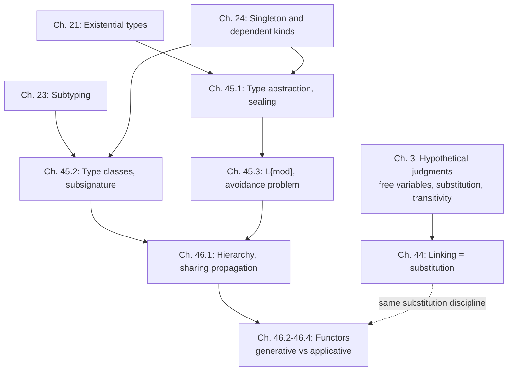

# Modularity and Linking

[[book-guidelines|↩ Back to guidelines]]

## The problem: modularity is not a feature bolted onto a language, it's a structural property already present

Harper opens with a claim worth taking completely literally, not as a metaphor: **modularity arises from the structural properties of the hypothetical and general judgments** you already learned in [[Hypothetical-and-General-Judgments|Chapter 3]]. A dependency between components is nothing but a free variable and its typing hypothesis; linking is nothing but substitution discharging that hypothesis. This is the same move the book makes constantly — recognize that a seemingly-new feature is a specific instance of machinery already built — and it's the thread that ties this whole chapter-trio together: modules are not a new kind of thing bolted onto the type theory, they're the hypothetical judgment applied to a new purpose (organizing large programs), then elaborated with existential types, subtyping, and singleton kinds to control exactly how much information crosses a module boundary.

**What breaks without recognizing this:** if modularity were treated as sui generis — its own primitive concept requiring its own foundational story — every module-system design decision would have to be re-justified from scratch. By [[Plotkins-PCF-and-Partial-Computation#Grounding|grounding]] it in substitution and hypothetical judgments, the book gets linking's correctness properties (associativity of composition, separate development) as *consequences* of properties already proven, not as new axioms to defend.

## Chapter 44: Components and linking — the client/implementor/interface triangle

### 44.1 Simple units and linking

The whole mechanism is a two-premise rule you've seen the shape of before — it's just substitution:

$$\dfrac{\Gamma \vdash e_{\mathrm{impl}}:\tau_{\mathrm{intf}} \quad \Gamma, x{:}\tau_{\mathrm{intf}} \vdash e_{\mathrm{client}}:\tau_{\mathrm{client}}}{\Gamma \vdash [e_{\mathrm{impl}}/x]e_{\mathrm{client}} : \tau_{\mathrm{client}}} \tag{44.1}$$

Three roles, precisely defined: the **interface** $\tau_{\mathrm{intf}}$ is a *type* — the contract; the **client** $e_{\mathrm{client}}$ depends on an unknown implementation via the free variable $x$; the **implementor** $e_{\mathrm{impl}}$ discharges that dependency by substitution. **Linking is literally the cut rule** (transitivity of hypothetical judgment) with a name.

The simplest interfaces are labeled-tuple ("API") types $\langle f_1\hookrightarrow\tau_1,\ldots,f_n\hookrightarrow\tau_n\rangle$ — think a struct of function pointers, a plain instruction set. A richer interface hides internal state behind an existential, $\exists(t.\langle f_1\hookrightarrow\tau_1,\ldots\rangle)$ — this is [[Data-Abstraction-and-Existential-Types|Chapter 21]]'s package type, now recast explicitly as "an interface with a hidden abstract type," which is exactly what Chapter 45 develops in full.

The chapter is careful to separate the *principle* (linking is substitution) from its *implementations* — separate compilation (translate client/implementor to object code, link at that level), separate checking (typecheck separately, translate together, often faster code), and **dynamic linking**, which the book takes pains to reconcile with the closed-program discipline used everywhere else: dynamic linking is not linking-without-substitution, it's substitution *deferred* — the client is compiled against a *stub* that forwards to a not-yet-provided implementation, and the actual substitution happens lazily, "on the fly," the first time the client actually touches the dependency (if ever). This is a genuinely satisfying reconciliation: it shows that dynamic linking doesn't require abandoning the closed-expression discipline the book has maintained since Chapter 1 — it requires only recognizing that a stub *is* a legitimate closed implementation, one whose behavior happens to be "go fetch the real one."

**[[Control-Stacks-and-Abstract-Machines#What breaks without this|What breaks without this]] reconciliation:** without recognizing dynamic linking as *deferred, stub-mediated substitution*, you'd have to treat it as an entirely separate, less-principled mechanism sitting outside the book's substitution-based semantics — undermining the claim that "linking is just substitution" covers real-world linking strategies, not merely a toy academic case.

### 44.2 Initialization and effects — why linking needs the command/expression split

Pure substitution-as-linking works cleanly only when components are pure. The moment an implementation's construction has an *effect* (Chapter 35's assignables), two problems appear: **replication of a component (via multiple substitution sites) silently replicates its effects**, and **effects introduce dependencies invisible in the types** — if two components each mutate a shared assignable, linking order now matters even though nothing in either component's *type* says so.

The fix reuses machinery the reader already has, rather than inventing new machinery: a component that may have effects gets type $\tau_{\mathrm{intf}}\ \mathtt{cmd}$ (an *encapsulated command*, Chapter 35) rather than bare $\tau_{\mathrm{intf}}$. The client, if it also depends on this encapsulated value, must explicitly *sequence* through it:

$$\mathtt{bnd}\ x \leftarrow x\,;\ \mathtt{do}\ e_{\mathrm{client}}$$

which forces the implementor's effects to occur strictly before the client's — the implicit ordering dependency the naive substitution model glossed over is made syntactically explicit by the modal command/expression distinction. Scaling this to $n$ components yields the **initialization procedure** pattern: $\{x_1\leftarrow x_1;\ldots;x_n\leftarrow x_n;m_{\mathrm{main}}\}$, which after linking becomes $\{x_1\leftarrow e_1;\ldots;x_n\leftarrow e_n;m_{\mathrm{main}}\}$ — exactly the "run all your component initializers, in a fixed declared order, then run main" pattern every real module system (ELF constructors, ML's `let`-bound top-level structure, `__init__` chains) implements, here derived rather than assumed.

**Grounding — this is precisely why Rust's `OnceCell`/lazy [[Symbols-and-Dynamic-Binding#Statics|statics]] and Python's import-time side effects are order-sensitive.** A component whose "construction" mutates global state (a logger registering itself, a metrics counter initializing) is, in Harper's terms, of type $\tau\ \mathtt{cmd}$, not $\tau$ — and the entire class of "why did changing my import order break things" bugs is exactly what happens when a language *doesn't* force this distinction to be explicit in the type, letting effectful initialization masquerade as pure value construction.

## Chapter 45: Type abstractions and type classes — how much of the static part should a client see?

### The organizing question

An interface is a type, but *what kind* of type should it be? The chapter frames this as one axis with two extremes, both grounded in machinery from earlier chapters:

- **Type abstraction** — the representation type is completely hidden. Grounded in [[Data-Abstraction-and-Existential-Types|existential types]] (Ch. 21).
- **Type class** — the representation type is exposed (transparent), but constrained to support certain operations. Grounded in [[Singleton-and-Dependent-Kinds|singleton kinds]] (Ch. 24) plus [[Subtyping|subtyping]] (Ch. 23).

Both are instances of a single general concept — **translucency**, the controlled revelation of type information across a module boundary — and the chapter's real achievement is showing these aren't two unrelated mechanisms but two points on a continuum, connected by the subsignature relation.

### 45.1 Type abstraction — sealing, and why you can't project a sealed module's static part

A dictionary signature $\sigma_{\mathrm{dict}} = [t{::}\mathtt{T};\langle \mathtt{emp}\hookrightarrow t, \mathtt{ins}\hookrightarrow\cdots, \mathtt{fnd}\hookrightarrow\cdots\rangle]$ names an abstract type $t$ of kind $\mathtt{T}$ (the kind of all types) with operations on it — clients know *what they can do* with a dictionary, never *how* it's represented. A **module** is genuinely a two-phase object: a **static part** (a constructor/type, extracted by $M\cdot s$) and a **dynamic part** (a value, extracted by $M\cdot d$). **Sealing**, $M\upharpoonright\sigma$, is the operation that enforces abstraction: it packages $M$ so that only the information in $\sigma$ is visible to a client.

Here's the subtle, load-bearing design decision: **the static part of a sealed module is deliberately undefined** — $(M\upharpoonright\sigma)\cdot s$ is ill-formed, full stop, not merely opaque. Harper walks through exactly why this has to be a hard restriction, not a soft one: if $(M_{\mathrm{dict}}\upharpoonright\sigma_{\mathrm{dict}})\cdot s$ *were* well-formed, reflexivity of type equivalence would force it to equal $(M'_{\mathrm{dict}}\upharpoonright\sigma_{\mathrm{dict}})\cdot s$ whenever $M_{\mathrm{dict}} \equiv M'_{\mathrm{dict}}$ — which silently makes type-level equivalence *depend on implementation equivalence*, directly violating **representation independence**: the whole point of hiding a representation is that two different implementations of the same interface should be interchangeable, indistinguishable to any client. The fix is a clean, structural one: only *module values* (structures, or variables bound by-value) have well-defined static parts. This has a genuinely elegant consequence — **sealing behaves like a computational effect that "occurs" at the binding site**, exactly mirroring how `bnd` in Chapter 35 pins down when an encapsulated command's effects happen. Two separate bindings of "the same" sealed module are treated as introducing *two distinct* abstract types — the type system deliberately forgets their shared origin, precisely so client code can never accidentally rely on it.

**What breaks without this restriction:** allow $M\cdot s$ for a sealed $M$, and a client could write code that behaves differently depending on the *specific implementation* chosen for an abstract type — defeating the entire reason to seal in the first place. This is the module-level analogue of the [[Data-Abstraction-and-Existential-Types|Chapter 21]] bisimulation argument: abstraction is only real if it's *enforced*, not merely suggested by naming convention.

### 45.2 Type classes — the "opposite" move: expose the identity, constrain the capabilities

A type class inverts the abstraction move. Consider ordering keys for the dictionary: $\sigma_{\mathrm{ord}} = [t{::}\mathtt{T};\langle\mathtt{leq}\hookrightarrow(t\times t)\to\mathtt{bool}\rangle]$ says "give me *some* type with a comparison" — but sealing an instance of this signature would be actively useless, because then the client would have `leq` but no way to *produce* values of the key type to compare! The book states this crisply: **a type class is a categorization of a pre-existing type, not a means of introducing a new one.**

The mechanism that makes this precise reuses [[Singleton-and-Dependent-Kinds|singleton kinds]] directly: the **principal signature** of a structure $M_{\mathrm{natord}}$ (an ordering on $\mathtt{nat}$) is $[t{::}S(\mathtt{nat});\langle\mathtt{leq}\hookrightarrow\cdots\rangle]$ — the singleton kind $S(\mathtt{nat})$ *pins* $t$'s identity to $\mathtt{nat}$ exactly, rather than hiding it. Because $S(\mathtt{nat}) <: \mathtt{T}$ (subkinding, Ch. 24) and signature formation is covariant (45.1c), we get $\sigma_{\mathrm{natord}} <: \sigma_{\mathrm{ord}}$ — so by subsumption, $M_{\mathrm{natord}}$ may be linked wherever $\sigma_{\mathrm{ord}}$ is required. **The dictionary implementation, generic over an abstract $X{:}\sigma_{\mathrm{ord}}$, gets linked with the concrete $M_{\mathrm{natord}}$, and — via sharing propagation — the resulting composite signature reveals that keys really are $\mathtt{nat}$**, not an opaque abstract type. Subkinding and subtyping do all the work: no new primitive is needed to move continuously between "fully abstract" and "fully transparent."

**Grounding (Rust) — this is the trait/associated-type distinction almost exactly.** A Rust trait with an associated type plays the role of $\sigma_{\mathrm{ord}}$; whether a caller can see the concrete type depends on whether it's exposed (`impl Ord for MyType` with `MyType` public — a type class, transparent) or hidden behind `impl Trait` / a newtype with private fields (a type abstraction, opaque):

```rust
trait Ordered {
    type T;                              // sigma_ord's abstract t :: T
    fn leq(a: &Self::T, b: &Self::T) -> bool;
}

struct NatOrder;
impl Ordered for NatOrder {
    type T = u64;                        // singleton kind S(nat): T is PINNED to u64
    fn leq(a: &u64, b: &u64) -> bool { a <= b }
}
// NatOrder::T is publicly known to be u64 -- exactly sigma_natord's principal signature
```

```rust
// Type abstraction: sealing. The concrete representation is unreachable from outside.
mod dict {
    pub struct Dict(Vec<(u64, String)>); // representation hidden -- (M |> sigma)'s static part is inaccessible
    impl Dict {
        pub fn empty() -> Self { Dict(vec![]) }
        pub fn insert(&mut self, k: u64, v: String) { self.0.push((k, v)); }
    }
}
```

`Dict`'s private field is the Rust-level enforcement of "no client code can reference the static part of a sealed module" — the compiler, not convention, prevents `dict::Dict.0` from being touched outside the module.

### 45.3 A module language ($L\{\mathtt{mod}\}$) — five levels, and the avoidance problem

The formal calculus has five syntactic levels — expressions/types (ordinary), constructors/kinds (Ch. 22, 24), and now modules/signatures. The three interesting statics rules:

$$
\dfrac{\Gamma\vdash c::\kappa \quad \Gamma\vdash e :: [c/u]\tau}{\Gamma\vdash [c;e]:[u{::}\kappa;\tau]} \qquad
\dfrac{\Gamma\vdash\sigma\ \mathsf{sig}\quad\Gamma\vdash M:\sigma}{\Gamma\vdash M\upharpoonright\sigma:\sigma} \qquad
\dfrac{\Gamma\vdash\sigma\ \mathsf{sig}\quad\Gamma\vdash M_1:\sigma_1\quad\Gamma,X{:}\sigma_1\vdash M_2:\sigma}{\Gamma\vdash(\mathtt{let}\ X\ \mathtt{be}\ M_1\ \mathtt{in}\ M_2){:}\sigma:\sigma}
$$

That last rule requires an *explicit* signature annotation on `let`, and this is where the chapter surfaces a genuinely deep obstruction: the **avoidance problem**. Naively, you'd want the type checker to *infer* the most precise (principal) signature for a `let`-bound module that doesn't mention the newly-bound variable $X$ — but Harper shows by direct construction that **modules do not, in general, have principal signatures**: a single signature can have two incomparable minimal supersignatures that both avoid $X$, with no least one among them. (This traces back to a fact stated earlier in the chapter: $[u{::}S(c);\tau]$ has two incomparable supersignatures, $[u{::}S(c);\tau]<:[u{::}\mathtt{T};\tau]$ via a different route than $[u{::}S(c);\tau]\equiv[\_{::}S(c);[c/u]\tau]<:[\_{::}\mathtt{T};[c/u]\tau]$ — sharing propagation and plain subkinding disagree about which supersignature is "more precise.") **The pragmatic resolution is to require the programmer to supply the signature explicitly**, sidestepping a genuinely hard (sometimes unsolvable) inference problem rather than pretending it away.

**What breaks without the explicit annotation:** an elaborator that tried to always infer the tightest module signature would sometimes have no unique answer to converge on — not a performance problem, a *well-definedness* problem. This is a sharp, concrete illustration that "just infer it" is not always available even in principle, a fact worth internalizing before assuming any inference algorithm terminates with a canonical answer.

A companion **self-recognition rule** (45.5) closes a related gap: if $M$ is a module *value* of non-principal signature $[u{::}\kappa;\tau]$, it can always be re-typed at the *more precise* $[u{::}S(M{\cdot}s{::}\kappa);\tau]$ — propagating a module value's own known identity into its own signature. This is what lets sharing propagation (§46.1) actually fire in practice: without self-recognition, a value's identity would be "forgotten" the moment it's given an abstract signature, even though — being a *value* — its static part is, in principle, always knowable.

### 45.4 First- and second-class modules — the counterintuitive resolution

The chapter closes with a deliberately provocative reframing: "first-class" (signatures are ordinary types, modules can be passed/stored/returned freely) sounds strictly more powerful than "second-class" (modules live in their own restricted syntactic category) — but Harper argues the *opposite* is true, for a sharp technical reason. A first-class module could be the result of an arbitrary run-time computation — "branch on the phase of the moon, return a module with a different static part in each branch" — and if the static part can vary at run time, **there is no single static component left to track in the type system**, which is exactly the information sharing propagation (§46.1) and generative-functor tracking (§46.4) depend on. So first-class-only module systems are *structurally incompatible* with exactly the machinery this chapter and the next spent most of their effort building.

The resolution is not "pick one" but **support both, with second-class as the default and first-class recoverable on demand**: a second-class module value $M$ of signature $[t{::}\kappa;\tau]$ converts to an ordinary existential-type value via $\mathtt{pack}\ M{\cdot}s\ \mathtt{with}\ M{\cdot}d\ \mathtt{as}\ \exists t{::}\kappa.\tau$ — literally the same package construct from Chapter 21 — and conversely, `open e` turns an arbitrary existential-typed expression back into a (non-value, must-be-bound-first) module. This mirrors the book's earlier resolution of the eager/lazy tension in [[Laziness-and-Polarization|Chapters 37–38]]: rather than force a global choice, expose *both* disciplines and let a single explicit operation (there, `susp`/`force`; here, `pack`/`open`) mediate between them.

## Chapter 46: Hierarchy and parameterization — modules that depend on modules

### 46.1 Hierarchy and sharing propagation

Real systems layer abstractions: an ordered-type class extends an equality-type class. Rather than hand-write the extended signature, Harper introduces the **hierarchical (dependent-pair) signature** $\sum X{:}\sigma_1.\sigma_2$ — a signature for a *pair* of modules where the second's signature $\sigma_2$ may mention the first via $X$. A **sharing specification** is exactly the singleton-kind constraint doing the connecting work, e.g. $\sigma_{\mathrm{ord}}^X = [t{::}S(X{\cdot}s);\langle\mathtt{lt}\hookrightarrow\cdots\rangle]$ ties the ordering's carrier type to *whatever type $X$ turns out to provide*. **Sharing propagation** — repeatedly applying subkinding/subtyping to simplify away occurrences of $X\cdot s$ once $X$'s own signature is known precisely enough — is how a general hierarchical signature $\sigma_{\mathrm{eqord}}$ specializes down to a fully closed one like $[\_{::}S(\mathtt{nat});\langle\mathtt{lt}\hookrightarrow(\mathtt{nat}\times\mathtt{nat})\to\mathtt{bool}\rangle]$ once you know the first component is $M_{\mathrm{natord}}$.

The chapter draws a sharp, useful distinction here: the **first** component of a hierarchy is always a well-formed **submodule** on its own (its signature $\sigma_1$ never depends on anything else), but the **second** component is a submodule *only when* its dependency on the first is *eliminable* — i.e., only when sharing propagation can fully resolve $X{\cdot}s$ to something closed. If the first component is sealed (its static part inaccessible, per §45.1), the dependency is *stuck*, and the second projection is simply ill-formed — you cannot separate an inseparably-dependent piece from its context, and the type system says so rather than pretending otherwise.

This gives a genuinely useful alternate reading: a hierarchical signature $\sum X{:}\sigma_1.\sigma_2$ describes a **family of modules indexed by $\sigma_1$**, with $\sigma_2$ as the **fibre** over each choice — module hierarchies are, quite literally, dependent pairs read as an indexed family, the module-level incarnation of $\Sigma$-types.

### 46.2 Parameterization — functors as $\Pi$-types over modules

If the *same code* implements the dictionary regardless of which ordered key type you plug in, you want a **functor**: $\lambda Z{:}\sigma_{\mathrm{eqord}}.\ M_{\mathrm{keydict}}$, a module-level function, classified by a **functor signature** $\prod Z{:}\sigma_{\mathrm{eqord}}.\rho_{\mathrm{keydict}}^Z$ — the module-level $\Pi$-type, exactly mirroring the hierarchy's $\Sigma$-type. **Signature modification**, written $Y{:}\sigma\ /\ Y{\cdot}1{\cdot}s = Z{\cdot}1{\cdot}s$, is introduced purely as notational relief — it says "take signature $\sigma$, but constrain this component to share with that one" — avoiding having to spell out a bespoke, heavily-repeated signature by hand every time a sharing constraint needs stating.

Instantiating a functor, $M(M_{\mathrm{key}})$, faces the exact same resolution problem the hierarchy's second projection faced: the naive result signature *depends* on the argument $M_{\mathrm{key}}$ itself (not merely its signature), so it isn't meaningful independent of the specific argument supplied. The fix reuses the same tool twice more: **contravariant subtyping strengthens the functor's domain** signature to something specific enough (e.g. $\sigma_{\mathrm{natord}}$ instead of general $\sigma_{\mathrm{eqord}}$), which by sharing propagation collapses the *range* to something closed and argument-independent — at which point application is well-typed with a genuinely static result signature.

### 46.3–46.4 Generative vs. applicative functors — the projectibility judgment decides representation independence

The formal extension hinges on a single new judgment, $M\ \mathtt{projectible}$ — can you form projections/static-part references through $M$ without breaking abstraction? Module variables: always projectible. Hierarchies/projections of projectible things: projectible. **Sealed modules: never projectible** (that's the whole point of sealing). **Functor instances: never projectible by default** (46.1). This last rule is what makes functors **generative**: two distinct instances $F(M_1)$ and $F(M_2)$ — even of *the same functor* — are treated as producing *unrelated* abstract types, because neither instance's static part can be projected and compared without first binding it to a variable, and distinct bindings are, per §45.1's sealing-as-effect discipline, automatically distinct.

The book is explicit and persuasive about *why* generativity is the right default: it's exactly representation independence, extended from ordinary abstract types to functor *results* — a client of a functor can never depend on the functor's implementation, full stop, even indirectly through type equality between two of its instances. This is what makes the module language compatible with genuinely dynamic functors — e.g. one that branches on a runtime condition — because generativity never has to ask "are these two instances' static parts equal," a question that would be ill-posed for a functor whose behavior isn't statically fixed.

**Applicative functors** (46.4) relax this — instances applied to *module values* (not arbitrary expressions) are deemed projectible, which is what lets OCaml-style code write `F(M).t` directly. But Harper is upfront about the price: projectibility of instances forces you to *define* when $(F(M_1))\cdot s \equiv (F(M_2))\cdot s$, and the only coherent answer requires comparing $M_1$ and $M_2$ themselves for equivalence — which in turn forces relaxing the "sealed modules are never projectible" rule too (46.8), since otherwise you couldn't even ask the question for sealed arguments. **The compromise is real, not cosmetic**: type-checking now depends on comparing executable code for equivalence, and changing a sealed module's implementation can change which client code type-checks — precisely the representation-independence guarantee generative functors preserved for free. This is presented not as "applicative is worse," but as an honest, quantified trade-off between expressiveness (direct type-level access to functor results) and the strength of the abstraction guarantee — exactly the kind of design tension the book has surfaced repeatedly (eager vs. lazy, first- vs. second-class, static vs. dynamic typing).

**Grounding (Lean) — this is the difference between a definitionally-transparent `def` and an opaque module boundary.** Lean's elaborator constantly faces exactly this "how much do I let unify through" question: a `def foo := ...` unfolds transparently during unification (roughly, applicative-functor-like — its identity is visible and comparable), while something behind an `opaque` marker or a sealed structure boundary does not (generative-functor-like — no unfolding, no comparing internals, only the stated interface is available to `isDefEq`). The generative/applicative tension is, structurally, the same tension an elaborator author navigates when deciding what a metavariable is allowed to unify against versus what must stay behind an opaque interface — transparency buys convenience at the cost of leaking implementation into the type-checking surface.

## Synthesis: where this sits in the book, and what it feeds



The three chapters trace one continuous arc: linking is substitution (44), interfaces are types whose *precision* is tunable between fully abstract and fully transparent via existing subtyping/singleton machinery (45), and that same machinery scales to *families* of modules and functions between them (46) — with every hard design question (avoidance, first/second-class, generative/applicative) resolved by asking "which existing structural principle — representation independence, subsumption, sharing propagation — does this choice honor or compromise?" rather than by inventing new primitives. The next pair of chapters (47–48, [[Equational-Reasoning|Equational Reasoning]]) picks up representation independence again, this time proving it rigorously via logical relations rather than assuming it structurally — the formal justification for exactly the sealing/generativity arguments made informally throughout this chapter.

**Bearing on the stated learning goals:** the avoidance problem (§45.3) is directly load-bearing for the Lean-style elaborator project — it's a sharp, concrete demonstration that principal-type inference *isn't always well-posed*, a fact any elaborator design has to reckon with explicitly (Lean's own elaborator sidesteps analogous issues via explicit signature ascription and bidirectional propagation, not unrestricted inference — exactly Harper's resolution). The generative/applicative functor distinction (§46.3–46.4) is a compact, precise vocabulary for a question a metavariable-unification engine faces constantly: when are two instances of "the same" parameterized construction allowed to be treated as definitionally equal, and what do you give up by allowing it? Recognizing sealing as "an effect that occurs at the binding site" (§45.1) is also a useful lens for a verifier: it's a clean example of how a *purely static* mechanism (no run-time state at all) can still behave effect-like with respect to identity and equality — worth remembering when reasoning about where a Hoare-triple verifier's notion of "fresh" abstract resource should come from.
