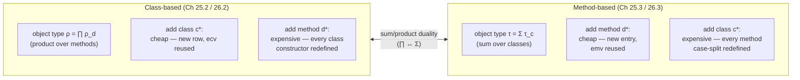

# Objects and Inheritance

[[book-guidelines|↩ Back to guidelines]]

## The problem: values with a common interface but different internal shape

Suppose you're representing points in the plane. Some points arrive as cartesian coordinates $(x, y)$; others arrive as polar coordinates $(r, \theta)$. Both are "points," and you want to write functions like *squared distance from the origin* and *quadrant* that work uniformly over either representation — but the actual computation differs depending on which representation you're holding. For a cartesian point the squared distance is $x^2 + y^2$; for a polar point it's just $r^2$.

This is the seed of object-oriented programming, and Harper's treatment strips it down to what it actually is at the type-theoretic level, with none of the folklore. A value that has been **classified** this way is called an *object* or *instance* of its *class*. The class determines the type of the classified data — the *instance type* — and the classified value itself is the *instance data*. Functions that act on classified values are *methods*, and a method's behavior is determined by the class of its argument: it *dispatches* on the class. Because this happens at run time (the class isn't known until the object is inspected), it's called **dynamic dispatch**.

What breaks without dynamic dispatch? You'd need the caller of `dist` to already know whether it's holding a cartesian or polar point and to call a differently-named function accordingly (`dist_cart`, `dist_pol`) — which defeats the point of having a uniform `Point` abstraction at all. Dynamic dispatch is precisely the mechanism that lets the *callee* — not the caller — decide which code runs, based on the run-time class of the value.

Harper's key observation, and the organizing idea of the whole chapter, is this: **dynamic dispatch has no privileged implementation.** The two schools of thought you'll recognize from real languages — "objects are bundles of methods" (Smalltalk/Java-style classes) versus "methods are big case statements over a tag" (ML-style [[Pattern-Matching|pattern matching]], the "expression problem" framing) — are not different *ideas*. They are the same underlying structure, viewed from two dual directions related by the symmetry between [[Product-Types|product types]] and [[Sum-Types|sum types]].

## 25.1 — The dispatch matrix: the one true source of truth

Before choosing an implementation strategy, Harper factors out what dynamic dispatch *is*, independent of how it's organized. Picture a grid: rows are classes, columns are methods, and the entry at $(c, d)$ is the code implementing method $d$ for class $c$, as a function of $c$'s instance data. This grid is the **dispatch matrix**, $e_{\mathrm{dm}}$, and it has the type

$$
\prod_{c \in C} \prod_{d \in D} (\tau_c \to \rho_d),
$$

where $C$ is the set of class names, $D$ is the set of method names, $\tau_c$ is the instance type of class $c$, and $\rho_d$ is the result type of method $d$ (the same result type for every class the method acts on).

For the running example, $C = \{\mathsf{cart}, \mathsf{pol}\}$ and $D = \{\mathsf{dist}, \mathsf{quad}\}$, with instance types

$$
\tau_{\mathsf{cart}} = \langle x \hookrightarrow \mathsf{real}, y \hookrightarrow \mathsf{real}\rangle, \qquad \tau_{\mathsf{pol}} = \langle r \hookrightarrow \mathsf{real}, th \hookrightarrow \mathsf{real}\rangle,
$$

and the matrix entries (writing $e^c_d$ for the $(c,d)$ entry) are, e.g.,

$$
e^{\mathsf{cart}}_{\mathsf{dist}} = \lambda(u{:}\tau_{\mathsf{cart}}) (u \cdot x)^2 + (u \cdot y)^2, \qquad e^{\mathsf{pol}}_{\mathsf{dist}} = \lambda(v{:}\tau_{\mathsf{pol}}) (v \cdot r)^2.
$$

Given the dispatch matrix, dynamic dispatch as an *abstraction* is exactly three things:

- A type $\mathsf{obj}$ of objects.
- An operation $\mathsf{new}[c](e)$ of type $\mathsf{obj}$, creating an object of class $c$ from instance data $e : \tau_c$.
- An operation $e \Leftarrow d$ of type $\rho_d$, sending message $d$ to object $e$.

These are pinned down by exactly one defining equation, the thing every implementation must satisfy:

$$
(\mathsf{new}[c](e)) \Leftarrow d \mapsto^* e^c_d(e).
$$

In words: creating an object of class $c$ and immediately invoking method $d$ on it is definitionally the same as running the dispatch-matrix entry for $(c,d)$ on the instance data. Everything else in the chapter is just two different (but isomorphic) ways of building $\mathsf{obj}$, $\mathsf{new}$, and $\Leftarrow$ so that this equation holds.

```rust
// The dispatch matrix, made concrete: a literal table of function pointers,
// indexed by class and method — before we commit to *how* it's represented.
struct DispatchMatrix {
    cart_dist: fn(CartData) -> f64,
    cart_quad: fn(CartData) -> Quadrant,
    pol_dist:  fn(PolData) -> f64,
    pol_quad:  fn(PolData) -> Quadrant,
}
```

## 25.2 — Class-based organization: objects as tuples of methods

The class-based organization "factors" the matrix by class: for each class $c$, bundle together the specialized behavior of *every* method acting on $c$'s instance data. This gives the **class vector**, $e_{\mathrm{cv}}$, of type

$$
\tau_{\mathrm{cv}} \triangleq \prod_{c \in C}\Big(\tau_c \to \big(\prod_{d \in D} \rho_d\big)\Big).
$$

Each row of the class vector is a *constructor*: given instance data, it produces a tuple recording the result of running every method against that data. The object type itself is $\rho = \prod_{d \in D}\rho_d$ — for points, $\rho = \langle \mathsf{dist} \hookrightarrow \rho_{\mathsf{dist}}, \mathsf{quad} \hookrightarrow \rho_{\mathsf{quad}}\rangle$. **An object literally is a tuple of (already-computed, or rather already-specialized) method results.**

Message send is then nothing but projection: $e \Leftarrow d \triangleq e \cdot d$. There is no dispatch logic left to run at send-time — all the dispatching happened once, at construction, when the right constructor from $e_{\mathrm{cv}}$ was chosen and applied.

Concretely, the class vector is $e_{\mathrm{cv}} = \langle e^c \rangle_{c \in C}$ where

$$
e^c = \lambda(u{:}\tau_c)\ \langle e_{\mathrm{dm}} \cdot c \cdot d(u)\rangle_{d \in D},
$$

and object creation is $\mathsf{new}[c](e) \triangleq e_{\mathrm{cv}} \cdot c(e)$. You can verify the defining equation holds: $(\mathsf{new}[c](e)) \Leftarrow d \mapsto^* (e_{\mathrm{cv}} \cdot c(e)) \cdot d \mapsto^* e_{\mathrm{dm}} \cdot c \cdot d(e)$.

This is exactly the mental model of Java/C++/Smalltalk-style objects: a `new Cart(x, y)` call runs a constructor that eagerly computes/binds all the method slots (conceptually — real implementations use vtables to defer this, but the *type-theoretic* content is a tuple of results), and calling `.dist()` is just reading a field.

```rust
// Class-based: an object is a "tuple of methods" — here, a struct implementing
// a trait, where each class supplies its own trait impl (its row of the matrix).
trait Point {
    fn dist(&self) -> f64;
    fn quad(&self) -> Quadrant;
}

struct Cart { x: f64, y: f64 }
impl Point for Cart {
    fn dist(&self) -> f64 { self.x * self.x + self.y * self.y }
    fn quad(&self) -> Quadrant { /* ... */ Quadrant::I }
}

struct Pol { r: f64, th: f64 }
impl Point for Pol {
    fn dist(&self) -> f64 { self.r * self.r }
    fn quad(&self) -> Quadrant { /* ... */ Quadrant::I }
}
// `dyn Point` erases the class, keeping only the bundle of method behavior —
// exactly ρ = ⟨dist ↪ ρ_dist, quad ↪ ρ_quad⟩. Sending a message is a vtable
// projection, i.e. e · d, dispatched once at the trait-object boundary.
```

## 25.3 — Method-based organization: methods as case analysis on sums

The dual move: instead of factoring by class, factor by method — take the **transpose** of the dispatch matrix, $\prod_{d\in D}\prod_{c\in C}(\tau_c \to \rho_d)$, and read off, for each method, a function that branches on the class. This gives the **method vector**, $e_{\mathrm{mv}}$, of type

$$
\tau_{\mathrm{mv}} \triangleq \prod_{d \in D}\Big(\big(\sum_{c \in C}\tau_c\big) \to \rho_d\Big).
$$

Now the object type is $\tau = \sum_{c \in C}\tau_c$ — a **sum type** (tagged union) over the classes. An object is instance data labeled with its class: $\mathsf{new}[c](e) \triangleq c \cdot e$. Where the class-based organization makes objects tuples, the method-based organization makes objects *tagged values*, and pushes all the dispatch logic into the methods themselves, which case-analyze the tag:

$$
e_d = \lambda(\mathrm{this}{:}\tau)\ \mathsf{case}\ \mathrm{this}\ \{c \cdot u \Rightarrow e_{\mathrm{dm}}\cdot c \cdot d(u)\}_{c \in C}.
$$

Message send applies the relevant entry of the method vector to the object: $e \Leftarrow d \triangleq e_{\mathrm{mv}} \cdot d(e)$. You can check the defining equation again holds via $\mapsto^*$: $(\mathsf{new}[c](e)) \Leftarrow d \mapsto^* e_{\mathrm{mv}} \cdot d(c\cdot e) \mapsto^* e_{\mathrm{dm}}\cdot c \cdot d(e)$ — same final answer as the class-based route, as it must be, since both are just different re-associations of the same matrix.

This is precisely what pattern matching over an `enum` gives you in Rust, or what a `match` over a sealed sum type gives you anywhere: a "method" is one function per operation, each doing its own case split over every class.

```rust
// Method-based: an object is a tagged sum (an enum). A method is a *single*
// function performing dispatch via `match` — the case analysis IS the method.
enum PointObj { Cart { x: f64, y: f64 }, Pol { r: f64, th: f64 } }

fn dist(this: &PointObj) -> f64 {
    match this {
        PointObj::Cart { x, y } => x * x + y * y,
        PointObj::Pol  { r, .. } => r * r,
    }
}

fn quad(this: &PointObj) -> Quadrant {
    match this {
        PointObj::Cart { .. } => /* ... */ Quadrant::I,
        PointObj::Pol  { .. } => /* ... */ Quadrant::I,
    }
}
```

In Lean, the same duality is even more visible in the kernel: a `structure` bundling fields-as-functions (products) versus an `inductive` type eliminated by its recursor (sums, dispatch-by-cases) are literally the two sides Harper is describing — his class vector is a record of "constructors," his method vector is (up to currying) exactly a recursor/eliminator for a sum type.

```lean
-- Method-based organization, Lean-style: `PointObj` is a sum, and `dist`/`quad`
-- are eliminators — this IS the dispatch matrix transposed and read by rows.
inductive PointObj where
  | cart (x y : Float)
  | pol  (r th : Float)

def dist : PointObj → Float
  | .cart x y => x * x + y * y
  | .pol  r _ => r * r
```

### The duality, stated plainly

| | Class-based | Method-based |
|---|---|---|
| Object type | $\rho = \prod_{d} \rho_d$ (product) | $\tau = \sum_{c} \tau_c$ (sum) |
| Object *is* | a tuple of method results | a class-tagged value |
| Method *is* | a field projection $e \cdot d$ | a case-analysis function |
| Dispatch happens | once, at $\mathsf{new}$ | every time, at $\Leftarrow$ |

The two are **isomorphic**, both implementing the same dispatch matrix and satisfying the same defining equation — a direct instance of the general duality between $\prod$ and $\sum$ types (currying/uncurrying a two-argument function of the matrix's indices in one order versus the other). Neither is "more correct"; languages just pick a bias (classes in Java, sums-with-matching in ML) and Harper's point is that this bias is inessential to the underlying phenomenon.

## 25.4 — Self-reference: letting methods create objects and send messages

The plain dispatch matrix has a hole: an entry $e^c_d$ has no way to refer to *other* objects — it can't create a new object (not even of its own class) or invoke a method, because those operations ($\mathsf{new}$, $\Leftarrow$) aren't in scope inside $e^c_d$'s own definition. What breaks without self-reference: you couldn't write a `translate` method that builds and returns a new point, or a `combine` method that calls another method on `self`.

The fix is to abstract each matrix entry over an unknown, abstract object type $t$, and over the class and method vectors themselves — passed in as arguments so the entry can use them to build objects and send messages recursively. The dispatch matrix's type becomes

$$
\prod_{c \in C}\prod_{d\in D} \forall (t.\, \tau_{\mathrm{cv}} \to \tau_{\mathrm{mv}} \to \tau_c \to \rho_d),
$$

where now, relative to the abstract type $t$,

$$
\tau_{\mathrm{cv}} \triangleq \prod_{c\in C}(\tau_c \to t), \qquad \tau_{\mathrm{mv}} \triangleq \prod_{d \in D}(t \to \rho_d).
$$

A matrix entry now has the shape $\Lambda(t.\,\lambda(\mathrm{cv}{:}\tau_{\mathrm{cv}})\lambda(\mathrm{mv}{:}\tau_{\mathrm{mv}})\lambda(u{:}\tau_c)\, e^c_d)$. Inside $e^c_d$, creating a new object of class $c'$ (possibly $c$ itself — self-reference!) is $\mathrm{cv}\cdot c'(e')$, and sending message $d'$ (possibly $d$ itself) to object $e'$ is $\mathrm{mv}\cdot d'(e')$.

To actually tie the knot, the method vector gets the recursive type $\mathsf{self}([\tau/t]\tau_{\mathrm{mv}})$ from [[recursive types|Chapter 16's self-referential/recursive types]] — the abstract $t$ is instantiated with the concrete sum type $\tau = \sum_{c}\tau_c$, and `unroll` is used to "open up" the self-referential structure at the point of use:

$$
\mathsf{self}\ \mathrm{mv}\ \text{is}\ \big\langle d \hookrightarrow \lambda(\mathrm{this}{:}\tau)\ \mathsf{case}\ \mathrm{this}\ \{c\cdot u \Rightarrow e^c_d[\tau](e'_{\mathrm{cv}})(e'_{\mathrm{mv}})(u)\}_{c\in C}\big\rangle_{d\in D},
$$

with $e'_{\mathrm{cv}} \triangleq \langle c \hookrightarrow \lambda(u{:}\tau_c)\ c\cdot u\rangle_{c\in C}$ (the trivial "tag and wrap" constructors) and $e'_{\mathrm{mv}} \triangleq \mathsf{unroll}(\mathrm{mv})$ (unroll the self-type to get at the actual dispatch functions). The class-based side is exactly dual, using $\mathsf{self}([\rho/t]\tau_{\mathrm{cv}})$ instead. This is the same "tie the recursive knot with `unroll`/`rfl`-style unfolding" move you'd use to implement `self` in an interpreter for a class-based OO language, or to model `Self` types in Lean via a fixpoint.

```rust
// Self-reference, Rust flavor: methods that can build new objects of the SAME
// enum and recurse into other methods — the abstract type `t` is just `Self`
// (or, without real self-types, the concrete recursive enum itself).
enum PointObj { Cart { x: f64, y: f64 }, Pol { r: f64, th: f64 } }

impl PointObj {
    // `translate` needs to construct a new PointObj of its OWN class — this is
    // the self-reference the plain dispatch matrix couldn't express.
    fn translate(&self, dx: f64, dy: f64) -> PointObj {
        match self {
            PointObj::Cart { x, y } => PointObj::Cart { x: x + dx, y: y + dy },
            PointObj::Pol  { r, th } => {
                // convert, translate, convert back — calls another "method" too
                let (x, y) = (r * th.cos(), r * th.sin());
                PointObj::Cart { x: x + dx, y: y + dy }
            }
        }
    }
}
```

## Chapter 26 — Inheritance: extending the dispatch matrix

Chapter 25 assumed the dispatch matrix is handed to you whole. Chapter 26 asks: how do you *build* one incrementally? A common strategy: start from a matrix $e_{\mathrm{dm}}$ and extend it with a new class or a new method, reusing old behavior where possible and overriding it where not. (Harper restricts to the non-self-referential case and to single, not multiple, inheritance, for simplicity.)

### 26.1 — Adding a class or a method

To extend $e_{\mathrm{dm}} : \prod_{c\in C}\prod_{d \in D}(\tau_c \to \rho_d)$ with a **new class** $c^* \notin C$, you must supply:

1. The instance type $\tau_{c^*}$.
2. For every existing method $d \in D$, a behavior $e^{c^*}_d : \tau_{c^*}\to \rho_d$.

This determines the extended matrix $e_{\mathrm{dm}}^*$ over $C^* = C \cup \{c^*\}$, agreeing with the old matrix on all old $(c,d)$ pairs. To make $c^*$ a **subclass** of some existing $c \in C$ means simply setting $e^{c^*}_d \triangleq e^c_d$ for some (possibly all) methods $d$ — i.e., *inheriting* is definitionally reusing an old matrix entry verbatim. This is only sound if the types line up:

$$
\tau_{c^*} \to \rho_d \mathrel{<:} \tau_c \to \rho_d,
$$

which holds precisely when $\tau_{c^*} \mathrel{<:} \tau_c$ (function types are contravariant in the domain) — the inherited code, written to consume $\tau_c$-shaped data, must still work when fed $\tau_{c^*}$-shaped data.

Symmetrically, to add a **new method** $d^* \notin D$, supply a result type $\rho_{d^*}$ and, for every existing class $c \in C$, a behavior $e^c_{d^*} : \tau_c \to \rho_{d^*}$. Making $d^*$ a **submethod** of an existing $d \in D$ means reusing $e^c_{d^*} \triangleq e^c_d$, sound exactly when

$$
\tau_c \to \rho_d \mathrel{<:} \tau_c \to \rho_{d^*},
$$

which holds when $\rho_d \mathrel{<:} \rho_{d^*}$ (covariant in the codomain) — the old result must be usable wherever the new result is expected.

These two [[Subtyping|subtyping]] conditions are the entire technical content of "inheritance is sound here." Nothing about virtual dispatch, MRO, or diamond problems is needed at this level of abstraction — it is ordinary function subtyping, applied entry-by-entry to the matrix.

### 26.2 — Class-based inheritance: a record of history, not a semantic fact

In the class-based organization, adding class $c^*$ extends the class vector $e_{\mathrm{cv}}$ (type $\tau_{\mathrm{cv}} = \prod_{c\in C}(\tau_c \to \rho)$) to $e_{\mathrm{cv}}^*$ over $C^*$, via an isomorphism $(-)^\dagger$ between $\tau_{\mathrm{cv}}^*$ and $\tau_{\mathrm{cv}} \times (\tau_{c^*}\to\rho)$:

$$
\big\langle e_{\mathrm{cv}},\ \lambda(u{:}\tau_{c^*})\ \langle d \hookrightarrow e^{c^*}_d(u)\rangle_{d\in D}\big\rangle^\dagger.
$$

The old class vector is reused **completely intact**; only a new constructor is tacked on. And here is Harper's sharpest observation in the chapter: the object type $\rho$ doesn't change at all when a class is added — so knowing "$c^*$ inherits from $c$" tells you *nothing whatsoever* about the run-time behavior of $c^*$'s objects (they could behave in a completely unrelated way). **Inheritance, in the class-based organization, carries no semantic significance — it is purely a record of how a class happened to be defined**, i.e., of definitional convenience, not of any guaranteed behavioral relationship. This directly answers Harper's own Key Question for the chapter and is worth sitting with, since much OO folklore ("subclass implies is-a, implies behavioral compatibility") is a *methodological convention* layered on top of a mechanism that itself promises nothing.

Adding a new method $d^*$ instead is more invasive: the object type changes from $\rho$ to $\rho^* \cong \rho \times \rho_{d^*}$, so *every* class's constructor must be redefined (though each redefinition reuses the old constructor's results via $(e_{\mathrm{cv}}\cdot c)(u)$, just packaging them alongside the new method's result). The payoff: $\rho^* \mathrel{<:} \rho$, so any object with the new method can be used wherever an object lacking it is expected — ordinary width subtyping on the tuple/record type. To avoid rewriting every existing class, a common restriction is to add new methods only to *new* subclasses, so old classes never need touching.

### 26.3 — Method-based inheritance: the exact dual

In the method-based organization, adding a new method $d^*$ is now the *cheap* case — dual to adding a class in the class-based world: the method vector $e_{\mathrm{mv}}$ extends via an isomorphism between $\tau_{\mathrm{mv}}^*$ and $\tau_{\mathrm{mv}} \times (\tau \to \rho_{d^*})$:

$$
\big\langle e_{\mathrm{mv}},\ \lambda(\mathrm{this}{:}\tau)\ \mathsf{case}\ \mathrm{this}\ \{c\cdot u \Rightarrow e^c_{d^*}(u)\}_{c\in C}\big\rangle^\ddagger,
$$

reusing the old method vector intact. Because $\rho^* \mathrel{<:}\rho$, a new object works fine where an old one is expected — the extra method is simply ignored, exactly the "extension by unused capability" pattern that width subtyping gives on the class-based side too, just mirrored across the duality.

Adding a new class $c^*$ is now the expensive case: the object (sum) type widens from $\tau$ to $\tau^* = \tau + \tau_{c^*}$ (a supertype of $\tau$ via the sum-type analogue of width subtyping), and — because every method must handle every tag in a `case` — **every single method in the vector must be redefined** to add a branch for $c^*$:

$$
\Big\langle d \hookrightarrow \lambda(\mathrm{this}{:}\tau^*)\ \mathsf{case}\ \mathrm{this}^\dagger\ \{l\cdot u \Rightarrow (e_{\mathrm{mv}}\cdot d)(u) \mid r \cdot u \Rightarrow e^{c^*}_d(u)\}\Big\rangle_{d\in D}.
$$

This is exactly the **expression problem**: in the method-based (sum-type/pattern-matching) organization, adding a *method* is free but adding a *class* touches every method; in the class-based (product-type/record) organization it's the mirror image — adding a *class* is free but adding a *method* touches every class. The two organizations aren't just isomorphic in the abstract — this asymmetry in "what's cheap to extend" is the concrete, practically-felt shadow of the sum/product duality, and it's the precise reason real languages and libraries have spent decades on techniques (visitors, typeclasses, open unions) to try to get both extension directions cheap at once.



## Where this leads

This chapter is a payoff chapter: it shows that dynamic dispatch and inheritance — usually presented as *sui generis* OO machinery with their own vocabulary and their own reasoning principles — are nothing more than sum types, product types, function subtyping, and (for self-reference) [[Recursive-Types|recursive types]] from earlier chapters, reassembled. Nothing new had to be added to the type theory; the "object system" is a *derived* pattern, not a primitive one. That is itself a methodological lesson worth carrying forward: when a language feature seems irreducibly complicated, it's often two or three orthogonal mechanisms (here: classification via sums/products, dispatch via case/projection, self-reference via recursive types, extension via subtyping) tangled together, and untangling them is most of the work of understanding the feature.

Concretely, this connects to:
- **Subtyping** (product width subtyping, sum-type subtyping, function contravariance/covariance), used throughout §26 to justify when inheriting or overriding is sound — the same subtyping machinery that governs record and variant subtyping generally.
- **Recursive/self-referential types** ([[recursive types|Ch. 16]]), needed the moment methods must construct objects or invoke other methods on themselves (§25.4).
- **The expression problem**, made precise here as the asymmetric extension cost between the two dual organizations — directly relevant if you're ever designing an internal representation for an AST or a term language in the compiler/verifier project: choosing "cases as an enum with matching" versus "cases as trait objects" is exactly this same class-based/method-based choice, and the chapter tells you in advance which extension direction (new node kinds vs. new passes/operations) will be cheap under each choice.
