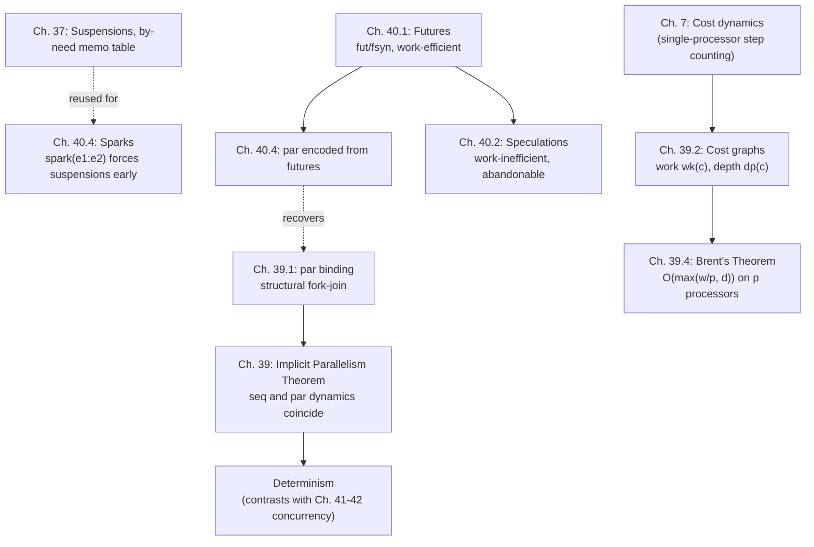

# Parallelism

[[book-guidelines|↩ Back to guidelines]]

## The problem: parallelism is not concurrency, and conflating them is a category error

Before any formalism, Harper draws a line that the rest of the chapter refuses to blur: **parallelism is about efficiency, not semantics.** A parallel program means exactly what its sequential counterpart means — parallel execution only changes *how fast* you get the answer, never *which* answer you get. **Concurrency**, covered two chapters later, is the opposite kind of thing: it's about composing independent, interacting processes whose meaning is deliberately under-specified so that the composition itself makes sense, and nondeterminism is part of the *semantics*, not an artifact you're trying to hide. Conflating the two is a common and costly confusion — "concurrent" and "parallel" get used interchangeably in casual conversation, but this chapter is precisely about building a language where parallel execution is a scheduling decision layered *on top of* an otherwise fully deterministic, sequential meaning.

**[[Control-Stacks-and-Abstract-Machines#What breaks without this|What breaks without this]] distinction:** if you let parallelism leak into semantics, every optimization pass, every choice of "run these two things at once," becomes a potential source of a differently-behaving program — you'd need to re-verify correctness for every scheduling decision. Harper's approach instead proves, once and for all, that scheduling never changes the answer, so verification and performance tuning become fully separable concerns.

## 39.1 Binary fork-join — parallelism as a construct with two dynamics, not one

The vehicle for this chapter is deliberately minimal: a single new construct, **parallel binding**,

$$\mathtt{par}\ x_1 = e_1\ \mathtt{and}\ x_2 = e_2\ \mathtt{in}\ e$$

with abstract syntax $\mathtt{par}(e_1; e_2; x_1.x_2.e)$ — note that $x_1, x_2$ are bound *only* in $e$, not in $e_1$ or $e_2$, which is what guarantees $e_1$ and $e_2$ have no way to depend on each other. This is "fork-join": fork two independent computations $e_1, e_2$, then join their results by binding them into $e$. A parallel pair is just $\mathtt{par}\ x_1=e_1\ \mathtt{and}\ x_2=e_2\ \mathtt{in}\ \langle x_1,x_2\rangle$; larger fan-out is built by cascading binary splits.

The typing rule is exactly what you'd expect from a let-binding with two premises evaluated independently:

$$\dfrac{\Gamma \vdash e_1 : \tau_1 \quad \Gamma \vdash e_2 : \tau_2 \quad \Gamma, x_1{:}\tau_1, x_2{:}\tau_2 \vdash e : \tau}{\Gamma \vdash \mathtt{par}(e_1; e_2; x_1.x_2.e) : \tau} \tag{39.1}$$

What's genuinely new is that this one construct gets *two* [[Exceptions#Dynamics|dynamics]], side by side, and the whole point of the chapter is to prove they agree.

**Sequential dynamics** $e \mapsto_{\mathsf{seq}} e'$ — ordinary left-to-right stepping, no surprises:

$$
\dfrac{e_1 \mapsto e_1'}{\mathtt{par}(e_1;e_2;x_1.x_2.e) \mapsto_{\mathsf{seq}} \mathtt{par}(e_1';e_2;x_1.x_2.e)} \quad
\dfrac{e_1\,\mathsf{val} \quad e_2 \mapsto e_2'}{\mathtt{par}(e_1;e_2;x_1.x_2.e) \mapsto_{\mathsf{seq}} \mathtt{par}(e_1;e_2';x_1.x_2.e)} \quad
\dfrac{e_1\,\mathsf{val} \quad e_2\,\mathsf{val}}{\mathtt{par}(e_1;e_2;x_1.x_2.e) \mapsto_{\mathsf{seq}} [e_1,e_2/x_1,x_2]e}
$$

**Parallel dynamics** $e \mapsto_{\mathsf{par}} e'$ — the only difference is a rule (39.3a) allowing $e_1$ *and* $e_2$ to step *simultaneously*, in a single transition, alongside the rules that let either one step alone while the other is already a value:

$$\dfrac{e_1 \mapsto_{\mathsf{par}} e_1' \quad e_2 \mapsto_{\mathsf{par}} e_2'}{\mathtt{par}(e_1;e_2;x_1.x_2.e) \mapsto_{\mathsf{par}} \mathtt{par}(e_1';e_2';x_1.x_2.e)}$$

This parallel dynamics is *idealized* — it assumes unlimited processors, abstracting completely away from real scheduling constraints. That abstraction is deliberate: it lets the semantic question ("do these two dynamics compute the same value?") be settled independently of any question about hardware.

### The implicit parallelism theorem

**Theorem 39.3 (Implicit Parallelism).** For every value $v$, $e \mapsto_{\mathsf{seq}}^{*} v$ iff $e \mapsto_{\mathsf{par}}^{*} v$.

This is proved by threading both dynamics through a shared evaluation dynamics $e \Downarrow v$ (Chapter 7 style) and showing each of $\mapsto_{\mathsf{seq}}^*$ and $\mapsto_{\mathsf{par}}^*$ agrees with it (Lemmas 39.1, 39.2) — so they must agree with each other. The payoff is enormous and entirely practical: **you can develop and debug a parallel program on a sequential machine**, because the two dynamics are provably interchangeable — parallelism never changes the observable result, only the number of processors it takes to get there. And because sequential evaluation is deterministic (every expression has at most one value), the theorem forces parallel evaluation to be deterministic too — hence its other name, the **deterministic parallelism theorem**. This determinism is exactly what separates *this* chapter's nested parallelism from the nondeterministic concurrency of Chapters 41–42; the book is explicit about drawing that line here, not later.

**What breaks without determinism:** a nondeterministic parallel dynamics would mean re-running the same program on the same input could yield different answers depending on scheduling — you'd be debugging race conditions instead of reasoning about a fixed mathematical function. Fork-join parallelism as formalized here structurally rules that out by construction, not by discipline or convention.

**[[Plotkins-PCF-and-Partial-Computation#Grounding|Grounding]] (Rust) — the type system enforces exactly this independence.** The absence of any way for $e_1$ to see $x_2$ (and vice versa) is precisely what `rayon::join` gives you via ownership: two closures that cannot alias mutable state, so the compiler statically guarantees the "no dependency between branches" precondition that Harper's binding structure encodes syntactically.

```rust
fn par_pair<A: Send, B: Send>(
    f1: impl FnOnce() -> A + Send,
    f2: impl FnOnce() -> B + Send,
) -> (A, B) {
    rayon::join(f1, f2) // structurally cannot share mutable state -> matches Rule (39.1)'s independence
}

// par x1 = expensive1() and x2 = expensive2() in (x1, x2)
let (x1, x2) = par_pair(expensive1, expensive2);
```

The `Send` bounds and closure-capture rules are Rust's static enforcement of exactly the syntactic guarantee $\mathtt{par}(e_1;e_2;x_1.x_2.e)$ gets "for free" from its binding structure: $e_1$ and $e_2$ cannot reference each other's bound results.

## 39.2 Cost dynamics — separating *what* from *how fast*, formally

Having settled meaning, the chapter turns to cost, via a **cost graph** grammar reused from Chapter 7:

$$c ::= 0 \mid 1 \mid c_1 \otimes c_2 \mid c_1 \oplus c_2$$

Read this as a **series-parallel DAG**: $0$ is a single node (no work), $1$ is one edge (unit work), $\otimes$ is *parallel* combination (independent, side-by-side subgraphs sharing a common fork/join point), $\oplus$ is *sequential* combination (chained end-to-end). Two numeric measures extract the two complexity notions you actually care about:

$$
\mathrm{wk}(c) = \begin{cases} 0 & c=0 \\ 1 & c=1 \\ \mathrm{wk}(c_1)+\mathrm{wk}(c_2) & c = c_1\otimes c_2 \text{ or } c_1 \oplus c_2 \end{cases}
\qquad
\mathrm{dp}(c) = \begin{cases} 0 & c=0 \\ 1 & c=1 \\ \max(\mathrm{dp}(c_1),\mathrm{dp}(c_2)) & c = c_1 \otimes c_2 \\ \mathrm{dp}(c_1)+\mathrm{dp}(c_2) & c = c_1 \oplus c_2 \end{cases}
$$

**Work** $\mathrm{wk}(c)$ sums unconditionally — it's the total number of computation steps, i.e. the *sequential* time complexity, regardless of how many processors you have. **Depth** $\mathrm{dp}(c)$ takes a *max* across parallel branches — it's the length of the longest chain of dependencies, the **critical path**, and it's a hard lower bound on running time no matter how many processors you throw at the problem: some things must happen after other things, full stop.

The cost-assignment rule for parallel binding makes the connection to the structural dynamics explicit:

$$\dfrac{e_1 \Downarrow_{c_1} v_1 \quad e_2 \Downarrow_{c_2} v_2 \quad [v_1,v_2/x_1,x_2]e \Downarrow_c v}{\mathtt{par}(e_1;e_2;x_1.x_2.e) \Downarrow_{(c_1\otimes c_2)\oplus 1 \oplus c} v} \tag{39.7}$$

— the two branches combine *in parallel* ($\otimes$), with unit cost for the fork/join overhead, then the continuation $e$ runs *sequentially* after ($\oplus$) — the $\otimes$ only ever shows up at the one place actual parallelism was introduced.

**Theorem 39.6** cashes this out precisely: if $e \Downarrow_c v$ with $w = \mathrm{wk}(c)$, $d = \mathrm{dp}(c)$, then $e \mapsto_{\mathsf{seq}}^{w} v$ *and* $e \mapsto_{\mathsf{par}}^{d} v$ — work is exactly the sequential step count, depth is exactly the parallel step count under unlimited processors. Cost dynamics isn't a heuristic approximation of complexity; it's provably *identical* to the two structural dynamics' step counts.

## 39.3 Multiple fork-join — from binary trees to data parallelism

Binary fork-join is technically sufficient (you can cascade it to get $n$-way splits for *static* $n$), but real programs usually want parallelism whose *degree* is a runtime quantity — "map this function over every element of a sequence of unknown length." Harper introduces a small sequence calculus for this: $\mathtt{tab}(x.e_1;e_2)$ (tabulate — build a sequence of the length given by $e_2$, with $i$-th element $[i/x]e_1$) and $\mathtt{map}(x.e_1;e_2)$ (apply $e_1$ pointwise across an existing sequence), each with a cost rule that combines the $n$ per-element cost graphs with $\otimes$ across the board:

$$\dfrac{e_2 \Downarrow_c \mathtt{num}[n] \quad [\mathtt{num}[0]/x]e_1 \Downarrow_{c_0} v_0 \ \cdots\ [\mathtt{num}[n{-}1]/x]e_1 \Downarrow_{c_{n-1}} v_{n-1}}{\mathtt{tab}(x.e_1;e_2) \Downarrow_{c \oplus \bigotimes_{i=0}^{n-1}c_i} \mathtt{seq}(v_0,\ldots,v_{n-1})}$$

This is exactly the shape of `iter().collect()` with unbounded work-parallelism across every element, rather than a fixed binary tree of forks — data parallelism ties the *source* of parallelism to the size of a data structure, which is how essentially every real parallel language (Rust's `rayon` iterators, array languages, MapReduce) actually schedules work in practice.

## 39.4 Provably efficient implementations — Brent's theorem

Cost graphs validate the idealized cost model, but a real machine has finitely many processors, $p$. Harper's abstract target is the **SMP** (shared-memory multiprocessor): $p$ sequential processors, constant-time shared-memory access, one atomic synchronization primitive. The central result relating idealized cost to realizable time is:

**Theorem 39.8 (Brent's Theorem).** If $e \Downarrow_c v$ with $\mathrm{wk}(c)=w$ and $\mathrm{dp}(c)=d$, then $e$ can be evaluated on a $p$-processor SMP in time $O(\max(w/p, d))$.

Read this as the honest floor and ceiling on parallel speedup: you can never beat the critical path $d$ no matter how many processors you add, and at best you divide the total work $w$ evenly across $p$ processors. This motivates the **parallelizability ratio** $w/d$: if $w/d \gg p$, adding processors genuinely helps (you're work-bound, not depth-bound); if $w/d$ is close to a constant, the critical path dominates and more processors buy you almost nothing. Whether a given problem *admits* an algorithm with a high parallelizability ratio is, in general, an open question in complexity theory — some problems (like the sequence operations above) parallelize beautifully; others are inherently sequential (e.g. algorithms whose every step genuinely depends on the previous one).

The proof sketch is a *greedy scheduler*: at every round, run as many ready tasks as you have processors for, up to $p$. If $p$ ready tasks are always available, you finish in $w/p$ rounds; the only way you fall short of that bound is when dependency structure — captured exactly by $d$ — forces you to wait, and that can never cost you more than $d$ extra rounds beyond the work-bound. Harper makes this concrete with a two-level dynamics: **local transitions** model individual processor steps — including the new fork/join local steps (39.10b–c) that spawn or retire named tasks — and **global transitions** (39.11) execute up to $p$ local steps simultaneously, one per active processor.

**Grounding (Lean) — work/depth as an explicit cost witness alongside a value.** Because $\Downarrow_c$ is itself a derivable judgment (an actual proof term, not a side calculation), the natural Lean-side rendering isn't an analogy — it's a literal transcription of the judgment into an inductive relation carrying a cost graph as data:

```lean
inductive Cost where
  | zero : Cost
  | unit : Cost
  | par  : Cost → Cost → Cost   -- ⊗
  | seq  : Cost → Cost → Cost   -- ⊕

def Cost.work : Cost → Nat
  | .zero => 0
  | .unit => 1
  | .par c1 c2 => c1.work + c2.work
  | .seq c1 c2 => c1.work + c2.work

def Cost.depth : Cost → Nat
  | .zero => 0
  | .unit => 1
  | .par c1 c2 => max c1.depth c2.depth
  | .seq c1 c2 => c1.depth + c2.depth

-- e ⇓c v, mirroring Rule (39.7): a proof-carrying evaluation judgment
inductive Evals : Expr → Cost → Value → Prop
  | par {e1 e2 e c1 c2 c v1 v2 v}
      (h1 : Evals e1 c1 v1) (h2 : Evals e2 c2 v2)
      (hbody : Evals (subst v1 v2 e) c v) :
      Evals (.par e1 e2 e) (.seq (.par c1 c2) (.seq .unit c)) v
```

Theorem 39.6 is then literally a statement that this `Evals` judgment's cost, when erased of its `Cost` index, coincides with counting steps of the corresponding sequential/parallel small-step relations — the same discipline a bidirectional elaborator's proof-search cost analysis would want if it needed to reason about *how much work* an inference derivation entails, not merely that a derivation exists.

## Chapter 40: Futures and speculations — a different lever, "start now, use later"

Fork-join is *structured*: a `par` binding forks and joins in one syntactic unit. Chapter 40 introduces a complementary, more unstructured tool: a computation you launch now and synchronize with whenever — possibly far later, possibly not at all.

### 40.1 Futures — eager, work-efficient, always fully evaluated

$$\tau\ \mathtt{fut} \qquad \mathtt{fut}(e) : \tau\ \mathtt{fut} \qquad \mathtt{fsyn}(e) : \tau$$

$\mathtt{fut}(e)$ *schedules* $e$ for evaluation immediately and hands back a reference; $\mathtt{fsyn}(e)$ *synchronizes* — blocks until the referenced future has a value, then returns it. [[Symbols-and-Dynamic-Binding#Statics|Statics]] is unsurprising ((40.1a)–(40.1b)); sequential dynamics ((40.2a)–(40.2d)) just evaluates eagerly and unwraps on sync — in a purely sequential setting a future adds nothing (a future of $\tau$ behaves just like an expression of $\tau$). The entire point of a future only shows up under the **parallel dynamics** (40.3): states now carry a task pool $\mu$ mapping active task names to their (possibly still-unevaluated) expressions, alongside the local/global two-level structure from §39.4. Rule (40.7b) activates a future as a new named task; Rule (40.7d) synchronizes once that task's slot holds a value.

Crucially, futures are **work-efficient**: the total work performed with futures never exceeds the work of the purely sequential program, because every future's value is eventually needed to reach a final state — final states for futures (Rule 40.10) require *both* the main focus *and every allocated future* to have reached a value. Nothing computed is wasted.

### 40.2 Speculations — eager, work-*inefficient*, possibly abandoned

$$\tau\ \mathtt{spec} \qquad \mathtt{spec}(e):\tau\ \mathtt{spec} \qquad \mathtt{ssyn}(e):\tau$$

The statics is essentially identical to futures. What differs is the *final-state condition* (Rule 40.11): a speculation-bearing program is done as soon as the *focus* reaches a value — outstanding speculations may simply be abandoned, whether or not they've finished. This is the entire tradeoff in one sentence: **futures guarantee no wasted work but must wait for everything; speculations may finish faster by racing ahead on work that might turn out to be unnecessary — and that work is genuinely wasted if it's never needed.**

**What breaks without this distinction:** conflating the two would either force unnecessary synchronization (treating every speculative guess as a mandatory future, killing the benefit of speculating in the first place) or silently discard work that was actually required (treating a future as abandonable, which would break work-efficiency and potentially drop a needed result). The type-level distinction — `fut` vs `spec` — makes the commitment explicit and checkable rather than an unstated convention about which "background tasks" are safe to cancel.

### 40.4 Applications — pipelining, sparks, and futures as an encoding target for fork-join

Three worked applications show futures are not a toy:

1. **Pipelining.** A recursive `produce` function builds a lazy-future-tailed list (`flist = μt. unit + (nat × t fut)`), spawning a future for each successive tail; a `consume` function folds over it, synchronizing on the tail only when the recursion actually needs it. Production and consumption overlap automatically — the producer's next-element computation runs concurrently with the consumer processing the current element, minimizing the "pipeline stall" of one stage waiting idle on another.

2. **Sparks.** A **spark**, $\mathtt{spark}(e_1;e_2)$, runs $e_1$ purely for its *side effect* on the memo table of Chapter 37's by-need suspensions — forcing values that `e_2` will likely need soon, in the hope they're already computed by the time `e_2` demands them. It's defined directly in terms of futures: $\mathtt{spark}(e_1;e_2) \triangleq \mathtt{let}\ \_ = \mathtt{fut}(e_1)\ \mathtt{in}\ e_2$ — evaluation of $e_1$ starts immediately, its *result* is discarded, only its effect on shared suspensions matters. This is a precise, formal account of what "prefetching" or "speculative forcing" means as a language feature rather than a runtime folk trick.

3. **Encoding binary nested parallelism from futures.** The chapter closes by showing fork-join itself is *definable* from futures:

$$\mathtt{par}(e_1;e_2;x_1.x_2.e) \triangleq \mathtt{let}\ x_1' = \mathtt{fut}(e_1)\ \mathtt{in}\ \mathtt{let}\ x_2 = e_2\ \mathtt{in}\ \mathtt{let}\ x_1 = \mathtt{fsyn}(x_1')\ \mathtt{in}\ e$$

The binding order matters — $e_1$'s future launches first, then $e_2$ runs (genuinely in parallel with $e_1$'s task), and only *then* does the code synchronize on $x_1$. This is a clean illustration of futures being the more *primitive*, unstructured mechanism, with fork-join recoverable as a structured discipline on top — not two unrelated features, but one general mechanism (futures) with a special, more tractable case (fork-join) carved out of it.

**Grounding (Rust) — `std::thread::spawn` + `JoinHandle` is a future/fsyn pair almost verbatim.**

```rust
use std::thread;

// fut(e): spawn immediately, return a reference to the eventual result
let handle: thread::JoinHandle<i32> = thread::spawn(|| expensive_computation());

// ... other work overlaps here, exactly like e2 in the par-from-futures encoding ...
let other = other_expensive_computation();

// fsyn(e): block until the future's value is available
let result = handle.join().unwrap();
```

`thread::spawn` is `fut(e)` — evaluation begins immediately, unconditionally (work-efficient by construction, since `join` is mandatory if you want the value — Rust makes *not* joining a `JoinHandle` a silent leak rather than a checked "speculation," which is precisely the futures/speculations distinction Harper is drawing: Rust's default here is the futures discipline, not the speculation discipline). `handle.join()` is `fsyn(e)`.

## Synthesis: where this sits in the book, and what it feeds



This chapter's central discipline — separate *meaning* (the implicit parallelism theorem) from *cost* (cost graphs, Brent's theorem) — is the same move the book makes throughout: statics from dynamics, definitional equality from observational equivalence, and here, semantics from performance. The chapter that follows (41, Process Calculus) deliberately breaks the determinism this chapter just proved, and the book wants that contrast felt sharply: nested parallelism is what you get when you *don't* need nondeterministic interaction, and concurrency is what you reach for when you *do*.

**Bearing on the stated learning goals:** this chapter doesn't bear directly on the Rust verifier or the Lean-style elaborator — proof search and unification aren't inherently parallel problems the way sequence-map or fork-join workloads are, so there's no strained connection to manufacture here. What *is* worth carrying forward is the methodological pattern itself: cost dynamics as a provably-faithful *auxiliary judgment* layered on top of an evaluation judgment (§39.2's $\Downarrow_c$) is exactly the technique you'd reach for if a Hoare-triple verifier or elaborator ever needed to reason formally about the *cost* of a derivation — e.g., bounding proof-search depth or unification steps — rather than merely its existence. The work/depth split (total steps vs. critical-path length) is also a useful lens if a prover's search strategy is ever parallelized: the same $\mathrm{wk}/\mathrm{dp}$ accounting would tell you whether parallelizing proof search is worth doing for a given problem shape.
