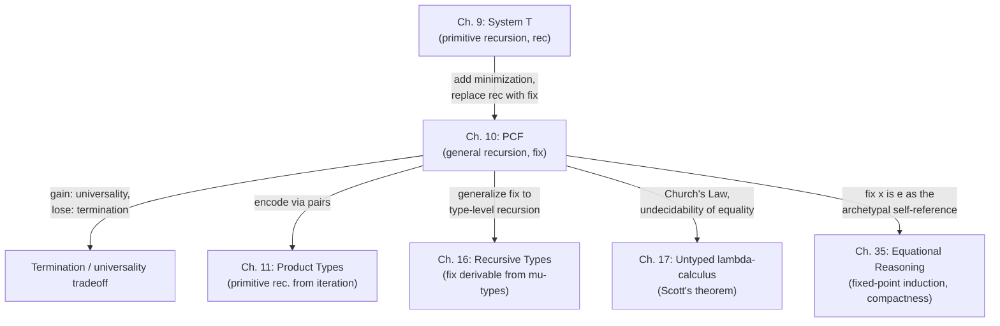

# Plotkin's PCF and Partial Computation

[[book-guidelines|↩ Back to guidelines]]

## What breaks without this: the problem System T can't solve

The previous chapter's language, $\mathcal{L}\{\text{nat}\to\}$ (Gödel's System T), gets you primitive recursion: you can consume a natural number by peeling off successors one at a time, and the recursor guarantees the process bottoms out. This buys you a very strong theorem — the *termination theorem* — every well-typed program reduces to a value. No infinite loops, ever, by construction.

But that guarantee has a price, and Harper proves the price is exact, not just "steep." Chapter 9 shows by diagonalization that System T cannot define its own *universal function* — no expression $e_{\text{univ}}$ can take the code of any T-program and simulate it, because if it could, you could build a self-referential diagonal expression that produces a number equal to its own successor. Contradiction. So System T, despite being able to define genuinely enormous functions like Ackermann's, is provably not universal. You cannot write an interpreter for System T *in* System T.

This matters because almost every real programming language *is* expected to be universal — and even before you get to "can this language run an interpreter for itself," ordinary features like `while` loops, recursive functions over arbitrary data, and general recursive algorithms don't fit the primitive-recursion mold at all. Primitive recursion only lets you recurse on one designated argument, structurally, with a fixed shape. Try to write, say, the Ackermann function's cousin that recurses in a genuinely open-ended way, or a fixed-point combinator, and you hit the wall: System T's `rec` doesn't give you unrestricted self-reference.

Plotkin's PCF — $\mathcal{L}\{\text{nat}\rightharpoonup\}$ in Harper's notation — removes exactly this restriction, and accepts exactly this cost: programs might not terminate. What you get back is universality itself.

## General recursion as the least fixed point operator

### The motivating idea, before any syntax

Start from ordinary mathematics, the way Harper does. Suppose you want to define the factorial function by the usual two equations:

$$
f(0) \doteq 1 \qquad f(n+1) \doteq (n+1) \times f(n).
$$

Read literally, this is a pair of *simultaneous equations* in the unknown $f$, ranging over functions $\mathbb{N} \to \mathbb{N}$. You are asserting that whichever function $f$ turns out to be, it satisfies these two constraints. To make that precise, collapse the two equations into a single one by case-splitting on the shape of the argument:

$$
f(n) \doteq \begin{cases} 1 & \text{if } n = 0 \\ n \times f(n') & \text{if } n = n' + 1. \end{cases}
$$

Now define an operator — Harper calls it a *functional*, an operator mapping functions to functions — $F$ by

$$
F(f) = f' \quad\text{where}\quad f'(n) = \begin{cases} 1 & \text{if } n = 0 \\ n \times f(n') & \text{if } n = n'+1. \end{cases}
$$

Notice carefully: the right-hand side is expressed in terms of the *argument* $f$ to $F$, not in terms of $f'$ itself. $F$ is an ordinary, well-defined higher-order function — feed it any function on naturals, it hands back another function on naturals. There's nothing circular about $F$.

The circularity we actually wanted — "$f$ calls itself" — now shows up as a single, clean condition on $f$: we want $f$ such that $f = F(f)$. That is, $f$ is a **fixed point** of $F$. The entire mystery of "how do I define something in terms of itself" reduces to "does this particular operator have a fixed point, and if there are several, which one is the function we mean?"

**[[Control-Stacks-and-Abstract-Machines#What breaks without this|What breaks without this]] framing.** If you don't factor recursion through a fixed point, you're stuck trying to define $f$ by literally invoking $f$ inside its own definition — which is either circular nonsense or requires you to already have $f$ in hand. The fixed-point move is what turns "self-reference" from a paradox into a well-posed question about an ordinary (non-self-referential) higher-order function $F$.

### Why a fixed point exists: the approximation chain

Harper doesn't just assert $F$ has a fixed point; he shows *why*, using an idea that will recur throughout denotational semantics: build the fixed point as a limit of successively better approximations.

Say a **partial function** $\varphi$ *approximates* a total function $f$ if $\varphi(m) = n$ implies $f(m) = n$ — $\varphi$ agrees with $f$ wherever $\varphi$ is defined, but may simply be undefined (know nothing) elsewhere. Let $\bot : \mathbb{N} \rightharpoonup \mathbb{N}$ be the totally undefined partial function — defined nowhere. This is the worst possible approximation to $f$: total ignorance.

Now iterate $F$ starting from $\bot$:

$$
\bot,\quad F(\bot),\quad F(F(\bot)),\quad F(F(F(\bot))),\ \ldots
$$

Each application of $F$ improves the approximation: $F(\bot)$ already knows $f(0) = 1$ (since the "then" branch of the case split doesn't need to consult its argument), $F(F(\bot))$ additionally knows $f(1)$, and so on — each iterate is defined on one more input than the last. Passing to the limit,

$$
\lim_{i \ge 0} F^{(i)}(\bot),
$$

you obtain a partial function defined on *every* natural number — i.e., a total function — and it is exactly $f$. This is the **least fixed point** of $F$: least, because it's built by starting from the least-informative approximation and adding only what each equation forces, never guessing extra behavior.

This is the conceptual payload PCF takes as a *primitive*: rather than deriving fixed points from some more basic recursion mechanism (there isn't one, in a language with no recursion at all), PCF simply gives you an operator `fix` that computes the least fixed point of any definable functional, directly.

**Why "least" matters, and why the result may be partial.** The least-fixed-point construction never fabricates behavior the equations didn't demand. If the approximation chain never reaches totality — if some input never gets a defined value at any finite stage — the least fixed point is simply undefined there. This is the formal reason PCF's `fix` can produce partial functions: it's not a bug in the construction, it's the construction being honest about what the recursion equations actually pin down.

### Grounding: `fix` as `Y`/`loop` you already know

- **Rust.** Rust has no built-in general recursion *combinator* the way PCF does — a plain recursive `fn` in Rust is really closer to primitive recursion at the meta-level (the compiler just permits self-reference by name). But you can make the fixed-point structure explicit with a `Fix`-style combinator over closures:

  ```rust
  // A functional F : (N -> N) -> (N -> N), expressed as "take the
  // recursive callback as an explicit argument."
  fn fact_step(rec: &dyn Fn(u64) -> u64, n: u64) -> u64 {
      if n == 0 { 1 } else { n * rec(n - 1) }
  }

  // fix(F) obtained the direct way: define f in terms of itself by name.
  // This *is* PCF's `fix x:tau is e`, just with Rust's own self-reference
  // standing in for the `fix` operator.
  fn fact(n: u64) -> u64 {
      fact_step(&fact, n)
  }
  ```

  The `fact_step` function plays the role of $F$: it takes "the function so far" as an explicit parameter and produces "one more layer" of the answer. `fact` is the fixed point — the thing PCF's `fix` constructs for you as a primitive, rather than relying on the host language's own recursion.

- **Python**, quick sketch of the same idea, without ceremony:

  ```python
  def F(rec):
      return lambda n: 1 if n == 0 else n * rec(n - 1)

  # Y-combinator-flavored fixed point, computed directly via self-application
  def fix(F):
      def f(n):
          return F(fix(F))(n)
      return f

  fact = fix(F)
  ```

- **Lean.** Lean's own `partial def` is the closest kernel-level analogue: it opts a definition *out* of the termination checker, exactly as PCF's `fix` opts the whole language out of System T's termination guarantee. A structurally-recursive Lean `def` corresponds to System T's `rec`; a `partial def` corresponds to PCF's `fix` — Lean even has to trust it (or wrap it via `WellFoundedRecursion`/`Acc` machinery) rather than type-check its termination the way it does ordinary recursion. This is the same trade Harper describes in words: demanding a termination *proof* baked into the term (System T) versus allowing arbitrary self-reference and pushing the termination argument into the programmer's head (PCF).

## Unwinding the recursion by self-substitution

### From equations to syntax

PCF, $\mathcal{L}\{\text{nat}\rightharpoonup\}$, packages the fixed-point idea as a syntactic construct. The grammar (types and expressions) is:

$$
\begin{array}{lll}
\text{Typ}\ \tau &::=& \text{nat} \mid \text{parr}(\tau_1;\tau_2)\quad (\tau_1 \rightharpoonup \tau_2)\\
\text{Exp}\ e &::=& x \mid z \mid s(e) \mid \text{ifz}(e;e_0;x.e_1) \mid \text{lam}[\tau](x.e) \mid \text{ap}(e_1;e_2) \mid \text{fix}[\tau](x.e)
\end{array}
$$

Everything except the last production is familiar from earlier chapters (numerals, a zero test replacing the recursor, $\lambda$-abstraction, application over the new *partial function type* $\tau_1 \rightharpoonup \tau_2$, written `parr`). The new piece is $\text{fix}[\tau](x.e)$, concrete syntax $\texttt{fix}\ x{:}\tau\ \texttt{is}\ e$ — this is the syntactic incarnation of "the least fixed point of the functional described by $x.e$."

Its typing rule is deliberately self-referential:

$$
\frac{\Gamma, x:\tau \vdash e : \tau}{\Gamma \vdash \text{fix}[\tau](x.e) : \tau} \tag{10.1g}
$$

To show $\text{fix}[\tau](x.e)$ has type $\tau$, you *assume* it — you bind $x$ at type $\tau$ (standing for the recursive expression itself) and check the body $e$ has type $\tau$ under that assumption. Compare this against System T's `rec`, whose typing rule never lets the recursive call refer to something of the *same type as the whole expression* without going through a structural decrease; here there's no such restriction at all. That absence is exactly what buys generality and loses the termination guarantee simultaneously.

### The dynamics: unwinding

The operational content of `fix` is one rule:

$$
\text{fix}[\tau](x.e) \mapsto [\text{fix}[\tau](x.e)/x]e \tag{10.3h}
$$

Harper names this step precisely: **unwinding the recursion**. To take a step, substitute the *entire recursive expression itself* for $x$ in its own body. This is self-substitution in the most literal sense — the term being reduced appears, verbatim, inside the term it reduces to. Compare this to $\beta$-reduction ($\text{ap}(\text{lam}[\tau](x.e);e_2) \mapsto [e_2/x]e$, Rule 10.3g), which substitutes a *value* for a bound variable; unwinding substitutes the *whole fixed-point expression*, unreduced, for its own bound variable. Each unwinding step reproduces another copy of `fix ... is ...` inside the result, ready to unwind again the next time it's needed.

This is precisely the syntactic mirror of the semantic story above: each unwind is one more application of the functional $F$ to the "current approximation" — except now the "approximation" is a piece of syntax containing a suspended, not-yet-unwound copy of the recursive definition, rather than a mathematical partial function. Definitional equality reflects the same equation directly as an axiom:

$$
\Gamma \vdash \text{fix}[\tau](x.e) \equiv [\text{fix}[\tau](x.e)/x]e : \tau \tag{10.4c}
$$

— i.e., $\texttt{fix}\ x{:}\tau\ \texttt{is}\ e$ is *definitionally equal to* one unwinding of itself, which is the syntactic expression of "$f = F(f)$."

**What breaks without unwinding as a primitive step.** Without a rule that lets the term reduce by reproducing itself, there is no way for a self-referential definition to make progress at all — you'd need the recursive call already evaluated before you could take a step, which is circular in the bad, non-well-founded sense. Unwinding sidesteps this by making the self-reference *syntactic and lazy*: the copy of `fix ... is ...` sits inert inside the reduct until (and unless) control actually reaches it.

[[Dynamic-Classification#Safety|Safety]] still holds — preservation and progress both go through (Theorem 10.2), proved by straightforward induction, with the `fix` case of preservation resolved by the substitution lemma (10.1) and the `fix` case of progress resolved by observing you can always take the unwinding step. What [[State-and-Assignables#Safety|safety]] does *not* give you anymore is termination: `fix x:tau is x` type-checks (self-reference at the same type, trivially) and unwinds forever, one copy of itself at a time, producing nothing. Progress promises "[[Type-Safety#Stuck states|stuck states]] don't happen," not "evaluation halts."

### Recursive functions as sugar over `fix` and `lam`

Harper shows named recursive functions are just a derived form. Write $\texttt{fun}\ x(y{:}\tau_1){:}\tau_2\ \texttt{is}\ e$ for a function whose body $e:\tau_2$ has both $y:\tau_1$ (the argument) and $x:\tau_1\rightharpoonup\tau_2$ (the function itself, for recursive calls) in scope. Its [[Exceptions#Dynamics|dynamics]],

$$
(\texttt{fun}\ x(y{:}\tau_1){:}\tau_2\ \texttt{is}\ e)(e_1) \mapsto [\texttt{fun}\ x(y{:}\tau_1){:}\tau_2\ \texttt{is}\ e,\, e_1 / x, y]\, e,
$$

is derivable purely from `fix` plus `lam`:

$$
\texttt{fix}\ x{:}\tau_1\rightharpoonup\tau_2\ \texttt{is}\ \lambda(y{:}\tau_1)\,e.
$$

This is worth pausing on: the "recursive function" primitive that feels foundational in every mainstream language is not primitive in PCF at all — it's `fix` wrapping a `lam`. Even primitive recursion itself, System T's `rec`, is *recoverable* inside PCF this way (encoding `rec e {z ⇒ e0 | s(x) with y ⇒ e1}` as an application of a general recursive function that case-splits on its argument) — PCF strictly subsumes System T's expressiveness, at the cost of subsuming its risk of divergence too.

### Grounding

- **Rust.** The derived-form move — "a recursive function is `fix` applied to a lambda whose body ignores nothing" — matches how Rust functions desugar informally: a `fn factorial` really is a value bound to its own name in a way that lets the body refer back to it. There's no explicit `fix` in the surface language because Rust's item-level `fn` declarations get self-reference for free from the binder scoping (the function's name is in scope inside its own body), which is exactly what `fix x:tau is lam(y:tau1) e` sets up by hand.
- **Lean.** `partial def loop (n : Nat) : Nat := loop (n + 1)` is the `fix`-unwinding rule made operational: each call to `loop` produces another call to `loop`, forever — a direct analogue of unwinding `fix x:nat->nat is lam(y:nat) x(y+1)` one copy of itself at a time. Lean's kernel *cannot* accept `partial def`s into its trusted definitional-equality checker the way it accepts structurally-recursive ones, precisely because rule (10.3h) has no termination guarantee to exploit — this is the operational reason `partial def`s are compiled but not usable for `rfl`-style proof by unfolding.
- **Python**, the unwinding rule made completely literal:

  ```python
  # fix x is e, represented as a thunk that regenerates itself on demand
  def fix(make_body):
      def x():
          return make_body(x)   # exactly: [fix(make_body)/x] e
      return x
  ```

## Partial functions and definability via minimization

### What "definable" means once functions can fail to terminate

A (mathematical) partial function $\varphi : \mathbb{N} \rightharpoonup \mathbb{N}$ is **definable** in PCF iff there is an expression $e_\varphi : \texttt{nat} \rightharpoonup \texttt{nat}$ such that

$$
\varphi(m) = n \iff e_\varphi(\bar m) \equiv \bar n : \texttt{nat}.
$$

Note the biconditional is doing real work on both sides now: if $\varphi(m)$ is *undefined*, the corresponding expression $e_\varphi(\bar m)$ must simply fail to reduce to any numeral — it loops. Divergence in the language is not a defect to be excluded; it's the operational meaning of "undefined" in the mathematics.

### Which partial functions are definable: partial recursive functions

Harper classifies exactly the definable partial functions. Start from the **primitive recursive** functions (everything System T could define — build up from zero, successor, projections, closed under composition and primitive recursion) and add one new closure operation, **minimization**:

Given a (possibly partial) function $\varphi(m,n)$, define $\psi(n)$ to be the *least* $m \ge 0$ such that:

1. for every $m' < m$, $\varphi(m',n)$ is defined and non-zero, and
2. $\varphi(m,n) = 0$.

If no such $m$ exists — either because the search runs forever finding non-zero values, or because some $\varphi(m',n)$ along the way is itself undefined — then $\psi(n)$ is undefined.

This is exactly "search upward for the first zero, and if you never find one (or get stuck), you never return." The primitive recursive functions closed under minimization are the **partial recursive functions**, and:

> **Theorem 10.3.** A partial function $\varphi$ on the natural numbers is definable in $\mathcal{L}\{\text{nat}\rightharpoonup\}$ iff it is partial recursive.

Harper's proof sketch runs both directions economically: minimization is straightforwardly definable in PCF using `fix` (loop $m$ upward, testing $\varphi(m,n)$ at each step, stop at the first zero — the loop simply never terminates if no such $m$ exists, which is the correct behavior for an undefined $\psi$). Conversely, one can — "with considerable tedium" — write an evaluator for PCF expressions themselves as a partial recursive function over Gödel-numbered syntax, showing PCF doesn't *exceed* the partial recursive functions either. The two directions sandwich PCF's definable functions exactly at "partial recursive," no more, no less.

**Why minimization is the crucial new ingredient.** Primitive recursion, no matter how cleverly iterated (recall Ackermann's function from Chapter 9 — enormous, yet still primitive recursive in the generalized higher-order sense System T supports), always terminates, because the recursion is structurally bounded by the shape of its argument. Minimization is an *unbounded search* — "count up until you find what you're looking for" — with no a priori bound on how long the search takes, or whether it ever ends. That open-endedness is precisely what a total language like System T cannot express and PCF can, and it is precisely what makes some PCF programs diverge.

### Grounding

- **Rust**, minimization as an honest unbounded loop — notice there is no way to write this such that Rust's compiler can promise it halts:

  ```rust
  // psi(n) = least m such that phi(m, n) == 0, given phi total on the
  // relevant range (a *partial* phi would need Option<u64> here).
  fn minimize(phi: impl Fn(u64, u64) -> u64, n: u64) -> u64 {
      let mut m = 0;
      loop {
          if phi(m, n) == 0 { return m; }
          m += 1;
      }
  }
  ```

  This is exactly `fix`: `minimize` is the least fixed point of "check `m`, else recurse on `m+1`," and Rust — like PCF, unlike System T — offers no static proof that the loop terminates.

- **Python**, same shape, useful as the shortest possible illustration of "search that might never stop":

  ```python
  def minimize(phi, n):
      m = 0
      while phi(m, n) != 0:
          m += 1
      return m
  ```

- **Lean.** This is the sharpest place to see why Lean's *kernel* fragment (the part that must be total) cannot express minimization directly the way `partial def` can: a `Nat`-indexed unbounded search has no structural decrease Lean's termination checker can certify without extra well-founded-recursion evidence (a proof that the search *does* terminate, supplied separately, e.g. via `Nat.findGreatest`-style API backed by decidability + boundedness lemmas, or accepted unchecked via `partial def`). Minimization is the textbook example of "a partial recursive function with no obvious total-language encoding" — which is exactly Harper's point.

## Church's Law identifying effective computability

Having pinned down PCF's definable functions as exactly the partial recursive functions, Harper states the payoff as a scientific claim, not a theorem:

> **Church's Law** states that the partial recursive functions coincide with the set of effectively computable functions on the natural numbers — those that can be carried out by a program written in any programming language currently available or that will ever be available.

Two things are worth separating carefully here, because Harper is precise about the distinction and it matters for how you should read the claim:

1. **"Partial recursive = definable in PCF"** (Theorem 10.3) is a *theorem*, proved from the formal definitions of both sides.
2. **"Partial recursive = effectively computable"** (Church's Law / the Church–Turing thesis) is *not* a theorem — "effectively computable" isn't a formal mathematical object with its own independent definition to prove equality against. It's an empirical/conceptual claim about the informal, pre-theoretic notion of "what a human or machine could in principle compute by mechanical procedure," backed by the fact that every formalization anyone has proposed (recursive functions, Turing machines, the untyped $\lambda$-calculus, register machines, PCF itself…) has turned out to define exactly the same class of functions. That convergence from wildly different starting points is the evidence; it's "law" the way physical laws are — a claim about the world (here, about the range of possible computing devices) confirmed by never having been falsified, not a derivation from axioms.

Putting the two together: because PCF's definable functions coincide with the partial recursive functions (proved), and the partial recursive functions coincide with effective computability (asserted, on strong evidence), PCF is — as far as anyone has ever been able to tell — exactly as expressive as any programming language that has existed or ever will exist, with respect to functions on the naturals. That's a remarkably strong claim to be able to make about a language with seven syntactic forms.

**Where this connects to unification and elaboration work (learning-goals note).** Church's Law is the reason "is this problem decidable" questions in type-theory metatheory (e.g. deciding definitional equality, deciding higher-order unification in general) get answered by exhibiting an *encoding* of a known-undecidable problem (like the halting problem, or Post correspondence) into the problem at hand, rather than by direct argument. The undecidability results you'll meet later in the book (Scott's theorem on definitional equality for the untyped $\lambda$-calculus, Chapter 17) and results you'll want to reason about for your own elaborator's unifier both lean on exactly this Church's-Law-backed equivalence: "encodable as/from a partial recursive function" is treated as interchangeable with "computable at all," which licenses reduction-based undecidability arguments.

## Definability of the universal function as an interpreter

### Setting up the payoff

Recall from Chapter 9 the shape of the argument that stalled System T: define $f_{\text{univ}}(\ulcorner e \urcorner)(m) = n$ iff $e(\bar m) \equiv \bar n$, i.e., "run the program encoded by $\ulcorner e \urcorner$ on input $m$." Diagonalization then built a self-referential expression $e_D$ with $e_D(\ulcorner e_D \urcorner) \equiv s(e_D(\ulcorner e_D \urcorner))$, and the *termination theorem* (every T-expression reduces to a value) forced this to a genuine equation between numerals $n \equiv s(n)$ — a contradiction. That contradiction is what proved $f_{\text{univ}}$ can't be defined in System T at all.

PCF defines the analogous function, $\varphi_{\text{univ}}$:

$$
\varphi_{\text{univ}}(\ulcorner e \urcorner)(m) = n \iff e(\bar m) \equiv \bar n : \texttt{nat}.
$$

By Church's Law (partial recursive = effectively computable, and PCF's evaluator for its own syntax is itself a partial recursive function per Theorem 10.3's proof sketch), $\varphi_{\text{univ}}$ **is** definable in PCF. This is a genuine interpreter: given the Gödel-numbered code $\ulcorner e \urcorner$ of a closed expression of type $\texttt{nat} \rightharpoonup \texttt{nat}$, $\varphi_{\text{univ}}$ simulates the dynamics of PCF itself to compute the result of applying $e$ to $m$. PCF is **universal**: it can host an interpreter for itself, in itself.

### Why the diagonal argument doesn't blow up here

Now rerun the System T diagonal construction verbatim inside PCF. You still get

$$
e_D(\ulcorner e_D \urcorner) \equiv s(e_D(\ulcorner e_D \urcorner))
$$

— the derivation of this equation only used definitional equality and the existence of $\varphi_{\text{univ}}$, both of which PCF has. This looks like the same contradiction as before. But Harper's key observation is exactly *where* the earlier argument used a fact PCF doesn't have:

> The difference, however, is that this equation is not inconsistent! Rather than being contradictory, it is merely a proof that the expression $e_D(\ulcorner e_D \urcorner)$ does not terminate when evaluated, for if it did, the result would be a number equal to its own successor, which is impossible.

System T's proof-by-contradiction needed the *termination theorem* as a hidden premise: "every expression evaluates to *some* numeral $n$, therefore $n \equiv s(n)$ is a genuine numeral equation, therefore contradiction." PCF has no termination theorem — evaluation might simply not produce a numeral at all. So the equation $e_D(\ulcorner e_D\urcorner) \equiv s(e_D(\ulcorner e_D\urcorner))$ is perfectly consistent as a *definitional equality between open-ended, possibly-divergent expressions*; it just can't ever be witnessed by both sides reducing to actual, distinct numerals, because that specific witnessing would be the contradiction. The resolution is that $e_D(\ulcorner e_D\urcorner)$ diverges — it must, on pain of contradiction — and divergence is a perfectly legal outcome in PCF, whereas it was outlawed by fiat in System T.

This is the precise sense in which "losing termination" and "gaining universality" are the same trade viewed from two sides: the very theorem (termination) that made System T safe from self-reference is the theorem PCF had to give up to allow self-reference to succeed.

### Grounding: writing an interpreter for your own language

- **Rust.** This is the shape of every `match`-on-`Expr` evaluator you'll write for a toy language — and Harper's point is that writing PCF's own evaluator *in PCF* is not qualitatively different from writing it in Rust; PCF simply has all the ingredients (recursion via `fix`, naturals, a way to encode syntax as data via Gödel numbering, though a real implementation would use an inductive `Expr` type instead — see Chapter 15's coverage of inductive types).

  ```rust
  enum Expr {
      Zero,
      Succ(Box<Expr>),
      Ifz(Box<Expr>, Box<Expr>, /* x. */ Box<Expr>),
      Var(String),
      Lam(String, Box<Expr>),
      Ap(Box<Expr>, Box<Expr>),
      Fix(String, Box<Expr>),
  }

  // eval : Expr -> Option<Value>, using Rust's own (unrestricted) recursion
  // to simulate PCF's fix -- an interpreter, at the meta-level, for exactly
  // the language phi_univ interprets at the object level.
  fn eval(e: &Expr) -> Option<Value> { /* structural recursion over Expr,
      with the Fix case calling eval on a self-substituted copy --
      the Rust-level mirror of unwinding (10.3h) */ todo!() }
  ```

  The parallel is exact: writing `eval` for `Expr::Fix` requires Rust's own unrestricted recursion (Rust functions are not primitive-recursive-checked), just as $\varphi_{\text{univ}}$ requires PCF's `fix` to interpret PCF's own `fix`.

- **Lean.** Any tree-walking interpreter you write for a toy language in Lean, if it needs `partial def` to typecheck (because the object language has unbounded recursion), is doing precisely what $\varphi_{\text{univ}}$ does for PCF: interpreting a language whose halting behavior the host's own termination checker cannot certify, using a host-level escape hatch (`partial def`) that mirrors the object language's `fix`.

## Where this leads



PCF is the book's working model of a *partial* language for the rest of Part II and beyond — most later languages (products, sums, [[Pattern-Matching|pattern matching]], polymorphism) are built as extensions or variants of PCF rather than of the terminating System T, precisely because real programming needs general recursion. Chapter 16 later shows that `fix` isn't even primitive in the deepest sense: once you have general recursive *types* ($\mu t.\tau$), self-reference at the level of values is *derivable* from self-reference at the level of types, and Harper traces the origin of mutable state itself to this same feedback/self-reference mechanism. Chapter 35's [[Equational-Reasoning|equational reasoning]] about PCF programs (fixed-point induction, the compactness of PCF's approximation order) is the formal payoff of the least-fixed-point story told informally here — it's how you *prove* things about programs whose termination you can no longer take for granted.

**For the compiler/elaborator project:** the fixed-point construction here — build a functional with no self-reference, take its least fixed point as a primitive, implement it operationally via unwind-by-self-substitution — is the same mechanism a checker or elaborator needs whenever it processes recursive definitions in the *object* language it's checking. If your Rust verifier is going to accept user-written recursive functions annotated with Hoare-style contracts, it needs to either (a) demand a System-T-style structural justification for termination (and thus prove total correctness), or (b) accept PCF-style general recursion and settle for partial correctness (verify "if it terminates, the postcondition holds," which is exactly what Hoare logic over a partial language gives you for free, without needing a termination proof at all). Recognizing which of these two regimes a given contract language commits you to — because Harper has just shown you there is no third option — is a design decision worth making explicitly rather than backing into.
