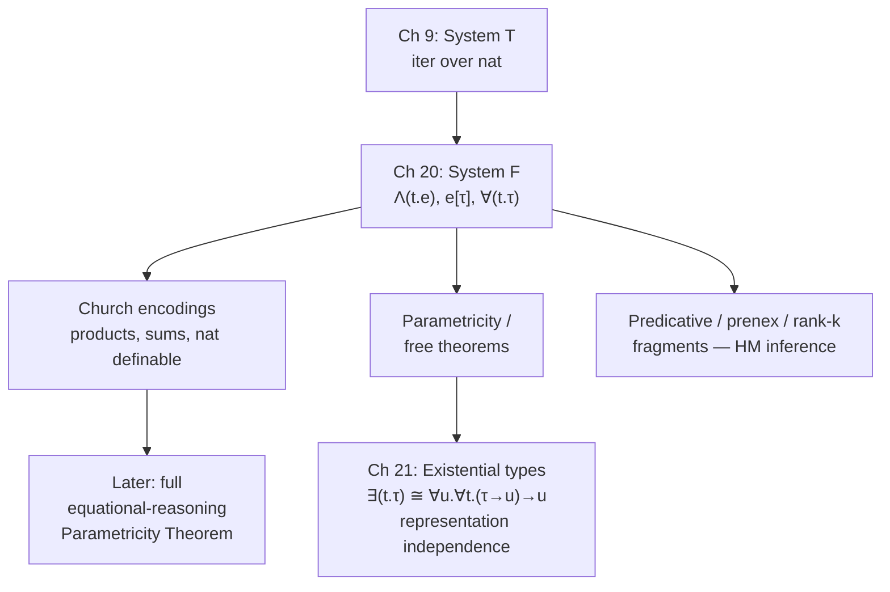

[[book-guidelines|↩ Back to guidelines]]

## The problem: one behavior, many types

In every language studied so far in the book — $\mathcal{L}\{\text{nat}\to\}$, PCF, the language with products and sums — every well-typed expression has exactly one type. Harper calls these languages *monomorphic*. That sounds abstract, but it produces a very concrete annoyance: you end up writing the same code over and over.

Take the identity function. In a monomorphic language, `identity : nat -> nat` and `identity : str -> str` are two genuinely different programs, even though they're textually identical modulo the type annotation — $\lambda(x{:}\tau)\, x$ for whichever $\tau$ you need. Same for function composition: for every triple of types $\tau_1, \tau_2, \tau_3$ you need a fresh copy of
$$
\circ_{\tau_1,\tau_2,\tau_3} = \lambda(f{:}\tau_2\to\tau_3)\,\lambda(g{:}\tau_1\to\tau_2)\,\lambda(x{:}\tau_1)\; f(g(x)).
$$
The *behavior* is identical across all instances; only the type changes. What breaks without polymorphism is exactly this: you cannot write the pattern once and reuse it — you must either duplicate code per type, or drop out of the typed world entirely (write it once, untyped, and lose the [[Dynamic-Classification#Safety|safety]] guarantees). This is the generic-programming problem restated at the level of functions themselves, and it's the reason $\mathcal{L}\{\to\forall\}$, a.k.a. **System F**, exists.

If this smells like Rust generics or Python's duck typing, that instinct is right and worth following precisely — the rest of this article is largely about nailing down exactly what kind of generics System F gives you, because it is a much more powerful (and more dangerous) kind than Rust's monomorphized generics.

System F was introduced twice, independently: by Girard (1972) in proof theory, and by Reynolds (1974) in programming language theory, where it's also called the *polymorphic $\lambda$-calculus*. Both routes lead to the same system.

## Type abstraction and type application

The fix is to add a new binding form at the type level, mirroring what $\lambda$ already does at the value level. Just as $\lambda(x{:}\tau)\,e$ abstracts a value out of an expression, System F adds an operator that abstracts a *type* out of an expression:

- **Type abstraction**, $\Lambda(t.e)$ — defines a generic (polymorphic) function with type parameter $t$ standing for an unspecified type inside $e$.
- **Type application**, $e[\tau]$ — instantiates a polymorphic function by plugging a concrete type $\tau$ in for $t$.

The polymorphic identity function is written
$$
I \triangleq \Lambda(t.\lambda(x{:}t)\, x),
$$
and an instance at a specific type is $I[\tau]$, which has type $\tau \to \tau$. Polymorphic composition is
$$
C \triangleq \Lambda(t_1.\Lambda(t_2.\Lambda(t_3.\lambda(f{:}t_2\to t_3)\,\lambda(g{:}t_1\to t_2)\,\lambda(x{:}t_1)\, f(g(x))))),
$$
instantiated as $C[\tau_1][\tau_2][\tau_3]$. One definition, infinitely many uses — exactly the thing monomorphic languages couldn't give you.

**[[Plotkins-PCF-and-Partial-Computation#Grounding|Grounding]] (Rust).** $\Lambda(t.e)$ is a generic function; $e[\tau]$ is turning the crank on monomorphization:

```rust
fn identity<T>(x: T) -> T { x }

fn compose<A, B, C>(f: impl Fn(B) -> C, g: impl Fn(A) -> B) -> impl Fn(A) -> C {
    move |x| f(g(x))
}

// e[tau] corresponds to instantiating the generic at a call site —
// Rust does this implicitly via inference, but you can force it explicitly:
let id_nat = identity::<i32>;
```
The crucial disanalogy, developed below, is that Rust's `<T>` is compiled away by monomorphization — `T` can never itself be instantiated with a generic function type, because by the time you *use* `identity`, `T` has already been resolved to a concrete, non-generic type. System F's $t$ has no such restriction. That gap is precisely what "impredicativity" (Section 20.4.1 below) is about.

## The universal type $\forall(t.\tau)$

What is the type of $\Lambda(t.e)$? It can't be a single ordinary type $\tau$, because $e$'s type depends on which $t$ you plug in. Harper's answer is the **universal type**,
$$
\forall(t.\tau),
$$
read "for all types $t$, an element of $\tau$" — it *determines* the result type $\tau$ as a function of the type argument $t$. The polymorphic identity has type $\forall(t. t\to t)$; polymorphic composition has type $\forall(t_1.\forall(t_2.\forall(t_3.(t_2\to t_3)\to(t_1\to t_2)\to(t_1\to t_3))))$.

Full grammar of $\mathcal{L}\{\to\forall\}$ (Harper's syntax chart, 20.1):

$$
\begin{aligned}
\text{Types } \tau &::= t \mid \tau_1\to\tau_2 \mid \forall(t.\tau)\\
\text{Exps } e &::= x \mid \lambda(x{:}\tau)\,e \mid e_1(e_2) \mid \Lambda(t.e) \mid e[\tau]
\end{aligned}
$$

The [[Symbols-and-Dynamic-Binding#Statics|statics]] needs *two* judgments now, because types themselves need to be checked for well-formedness once type variables are in scope: a **type formation judgment** $\Delta \vdash \tau\ \text{type}$ (where $\Delta$ collects hypotheses $t\ \text{type}$) alongside the familiar **typing judgment** $\Delta\mid\Gamma \vdash e:\tau$.

Type formation rules (20.1):
$$
\frac{}{\Delta, t\ \text{type} \vdash t\ \text{type}} \qquad
\frac{\Delta\vdash\tau_1\ \text{type} \quad \Delta\vdash\tau_2\ \text{type}}{\Delta\vdash\tau_1\to\tau_2\ \text{type}} \qquad
\frac{\Delta, t\ \text{type}\vdash\tau\ \text{type}}{\Delta\vdash\forall(t.\tau)\ \text{type}}
$$

Typing rules (20.2), with the two new ones being the load-bearing part:
$$
\frac{\Delta,t\ \text{type}\mid\Gamma \vdash e:\tau}{\Delta\mid\Gamma \vdash \Lambda(t.e):\forall(t.\tau)} \qquad\qquad
\frac{\Delta\mid\Gamma \vdash e:\forall(t.\tau') \quad \Delta\vdash\tau\ \text{type}}{\Delta\mid\Gamma \vdash e[\tau]:[\tau/t]\tau'}
$$

Type abstraction introduces $\forall$ by *generalizing* over a fresh type variable in the same way $\lambda$ generalizes over a fresh term variable; type application *eliminates* $\forall$ by substitution, exactly as ordinary application eliminates $\to$ by substitution. This is the same introduction/elimination discipline the whole book has used since Chapter 4 — polymorphism doesn't need a new methodology, just a new sort of variable to range over.

Two structural results carry over unchanged in spirit from the monomorphic case:

- **Regularity** (Lemma 20.1): if $\Delta\mid\Gamma\vdash e:\tau$ and every hypothesis in $\Gamma$ is well-formed, then $\tau$ itself is well-formed. Types produced by typing derivations are never garbage.
- **Substitution** (Lemma 20.2): substituting a well-formed type for a type variable preserves type formation and typing, and — this is the new wrinkle — substituting into a term whose context $\Gamma$ mentions the type variable requires substituting into $\Gamma$ too, since $t$ may occur free in the types of other bound variables.

**[[Exceptions#Dynamics|Dynamics]]** (20.3) is call-by-value or call-by-name depending on whether you keep the bracketed value-premise, same as everywhere else in the book:
$$
\frac{}{\lambda(x{:}\tau)\,e\ \mathsf{val}} \qquad \frac{}{\Lambda(t.e)\ \mathsf{val}} \qquad
\frac{[e_2\ \mathsf{val}]}{\mathsf{ap}(\mathsf{lam}[\tau_1](x.e);e_2)\mapsto[e_2/x]e} \qquad
\frac{}{\mathsf{App}[\tau](\Lambda(t.e))\mapsto[\tau/t]e}
$$
Type application always steps eagerly regardless of CBV/CBN — there is no "value restriction" analogue at the type level here, since types carry no runtime cost to substitute. Canonical Forms (Lemma 20.3) extends cleanly: a value of type $\forall(t.\tau')$ is always $\Lambda(t.e')$ for some $e'$, which gives Preservation and Progress (Theorems 20.4–20.5) by the usual rule-induction recipe from Chapter 6.

**Grounding (Lean).** Lean's `∀` for Prop and its dependent function type `Π` are the proof-theoretic cousins of this exact mechanism — a term of type `∀ (t : Type), P t` is checked by extending the context with a fresh `t : Type` and checking the body, then eliminated by `.app` supplying a specific type, substituting via the kernel's `instantiate`. This is the same "extend context, check body, substitute back" shape your elaborator's implicit-argument resolution needs: an implicit `{α : Type}` argument in Lean is a $\forall$-bound type variable whose instantiation is inferred rather than written explicitly — but the underlying judgment ($\Delta,t{:}\text{Type}\vdash e:\tau$, then substitute) is exactly Rule 20.2d/20.2e.

## Impredicative instantiation

Here is where System F stops looking like Rust generics. Nothing in the type-application rule (20.2e) restricts what $\tau$ can be instantiated to — in particular, $\tau$ is allowed to *itself* be a $\forall$-type. Let $\tau = \forall(t.t\to t)$ and suppose $e:\tau$. Then you may apply $e$ to its *own type*:
$$
e[\tau] : \tau \to \tau, \quad\text{i.e.}\quad \forall(t.t\to t)\to\forall(t.t\to t).
$$
And that result type is now *larger* (more occurrences of $\forall$, more textual size) than the type of $e$ itself — so large that you can apply $e[\tau]$ to $e$ again, getting $e[\tau](e) : \tau$, right back to the type you started with. This is **impredicativity**: the meaning of a quantified type $\forall(t.\tau)$ is given in terms of *all* its instances, including instantiations by $\forall(t.\tau)$ itself — a self-referential, quasi-circular definition.

Contrast the simply-typed case: if $e:\tau_1\to\tau_2$ and $e_1:\tau_1$, the application $e(e_1):\tau_2$ is always *smaller* than the type of $e$. Ordinary function application shrinks types; impredicative type application does not have to. This quasi-circularity is exactly what makes System F's expressive power (Church encodings, below) possible, and exactly what makes its metatheory (e.g. the termination proof, not given in this chapter) hard — you cannot induct naively on type structure the way you can for $\mathcal{L}\{\to\}$.

**What breaks without impredicativity:** this is precisely the wall Rust's monomorphizing generics hit. `fn f<T>(x: T) -> T` can never be instantiated at `T = (impl FnOnce(U) -> U for all U)` in the System-F sense, because Rust has no impredicative universal type to instantiate *with* — `dyn Trait` and `impl Trait` are existentials/opaque types, not first-class $\forall$. This is a real expressiveness ceiling, not a syntax quirk: it's the reason Church-encoded data (next section) is awkward to write directly in Rust generics, but falls out naturally once you have impredicative $\forall$.

## Church encodings: products, sums, naturals — for free

The chapter's headline result: $\mathcal{L}\{\to\forall\}$ is "astonishingly expressive" — every type constructor built in earlier chapters (products, sums, and, as later chapters show, inductive/coinductive types) is *definable* rather than primitive. The mechanism in every case is the same idea: **represent a value of type $\tau$ as the polymorphic function that knows how to eliminate it** — i.e., as its own eliminator, universally quantified over the result type of the elimination.

This needs one more piece of infrastructure: **definitional equality**, the least congruence generated by $\beta$-rules for both application forms:
$$
\frac{\Delta\mid\Gamma,x{:}\tau_1\vdash e_2:\tau_2 \quad \Delta\mid\Gamma\vdash e_1:\tau_1}{\Delta\mid\Gamma\vdash(\lambda(x{:}\tau)\,e_2)(e_1) \equiv [e_1/x]e_2 : \tau_2}
\qquad
\frac{\Delta,t\ \text{type}\mid\Gamma\vdash e:\tau \quad \Delta\vdash\rho\ \text{type}}{\Delta\mid\Gamma\vdash \Lambda(t.e)[\rho] \equiv [\rho/t]e : [\rho/t]\tau}
$$

**Nullary product (unit)** — the type with exactly one element becomes: "for any result type $r$, given an $r$, return that same $r$" — i.e. the polymorphic identity itself:
$$
\mathsf{unit} \triangleq \forall(r.\,r\to r), \qquad \langle\rangle \triangleq \Lambda(r.\lambda(x{:}r)\,x).
$$
It works because $\Lambda(r.\lambda(x{:}r)\,x)$ is (up to definitional equality) the *only* closed value of this type — there's nothing else parametricity (next section) lets you build.

**Binary products** — a pair is represented as "the function that, given a combiner for its two components, applies it":
$$
\tau_1\times\tau_2 \triangleq \forall(r.(\tau_1\to\tau_2\to r)\to r), \qquad
\langle e_1,e_2\rangle \triangleq \Lambda(r.\lambda(x{:}\tau_1\to\tau_2\to r)\,x(e_1)(e_2)),
$$
$$
e\cdot l \triangleq e[\tau_1](\lambda(x{:}\tau_1)\lambda(y{:}\tau_2)\,x), \qquad e\cdot r \triangleq e[\tau_2](\lambda(x{:}\tau_1)\lambda(y{:}\tau_2)\,y).
$$
You can check $\langle e_1,e_2\rangle\cdot l \equiv e_1:\tau_1$ and symmetrically for $\cdot r$ purely by unfolding the two $\beta$-rules above — the projections aren't primitive, they're *derived* by instantiating $r$ to the target type and supplying the right selector function.

**Void and sums** follow the dual pattern — void is "for any $r$, give me an $r$" (uninhabitable, since nothing can produce an arbitrary $r$ out of nothing):
$$
\mathsf{void} \triangleq \forall(r.r), \qquad \mathsf{abort}[\rho](e) \triangleq e[\rho],
$$
$$
\tau_1+\tau_2 \triangleq \forall(r.(\tau_1\to r)\to(\tau_2\to r)\to r),
$$
$$
l\cdot e \triangleq \Lambda(r.\lambda(x{:}\tau_1\to r)\lambda(y{:}\tau_2\to r)\,x(e)), \qquad r\cdot e \triangleq \Lambda(r.\lambda(x{:}\tau_1\to r)\lambda(y{:}\tau_2\to r)\,y(e)),
$$
with `case` defined as $e[\rho](\lambda(x_1{:}\tau_1)\,e_1)(\lambda(x_2{:}\tau_2)\,e_2)$ — again a sum value *is* its own case-analysis function, waiting to be handed the two branches.

**Natural numbers** are the most striking case, and the one the book dwells on. Recall the iterator's typing rule from System T: $e_0:\mathsf{nat}$, $e_1:\tau$, $x{:}\tau\vdash e_2:\tau$ gives $\mathsf{iter}(e_0;e_1;x.e_2):\tau$ — for an *arbitrary* result type $\tau$. That "arbitrary $\tau$" is exactly what $\forall$ was built to express, so a natural number just *is* the polymorphic iterate-$n$-times function:
$$
\mathsf{nat} \triangleq \forall(t.\,t\to(t\to t)\to t),
$$
$$
z \triangleq \Lambda(t.\lambda(z{:}t)\lambda(s{:}t\to t)\,z), \qquad
s(e) \triangleq \Lambda(t.\lambda(z{:}t)\lambda(s{:}t\to t)\,s(e[t](z)(s))),
$$
$$
\mathsf{iter}(e_0;e_1;x.e_2) \triangleq e_0[\tau](e_1)(\lambda(x{:}\tau)\,e_2).
$$
This is why the encoding *forces* the iterator specifically, not general recursion: the only thing you can ever do with a Church numeral is apply it — i.e., iterate — because that's the entire content of its type. It follows that $\mathcal{L}\{\to\forall\}$ is at least as expressive as $\mathcal{L}\{\text{nat}\to\}$ (System T); in fact it's *strictly* more expressive — the evaluator for System T is definable inside System F (though not inside System T itself, by Chapter 9's diagonal argument) — while the same diagonal argument shows System F's own evaluator is not definable in System F. Enrich the language to define that evaluator, and — so long as the enriched language still terminates — you get a new undefinable function all over again. Expressive power and universality remain in tension even here.

**Grounding (Python).** The "a value is its own eliminator" idea is cleanest as closures — this is literally how you'd Church-encode a pair in an untyped host language, dropping the type annotations:
```python
def pair(a, b):
    return lambda select: select(a, b)

def fst(p): return p(lambda a, b: a)
def snd(p): return p(lambda a, b: b)

def church_zero():
    return lambda z, s: z
def church_succ(n):
    return lambda z, s: s(n(z, s))
```
Python's dynamic typing means you lose the actual $\forall$-quantification and the safety it buys you, but the shape — "eliminate by supplying the case-handlers as arguments" — is identical to what the typed encoding does.

## Parametricity and free theorems

Impredicativity gave System F its power; **parametricity** is the payoff for the reader — polymorphic types are so constraining that you can prove facts about a program's *behavior* from its *type alone*, without inspecting the code.

Take $i : \forall(t.t\to t)$. Instantiate $i$ at any type $\tau$ and apply it to an argument of type $\tau$; the result must have type $\tau$. But $\tau$ wasn't fixed until the call site — $i$'s code cannot "look inside" $\tau$ to decide what to do, because at the point $i$ is defined, $\tau$ is an abstract, opaque variable. The only value of type $\tau$ that $i[\tau]$ has access to is the argument itself, so $i$ has no choice but to return it: **$i$ must be the identity function.** Similarly, any $b:\forall(t.t\to t\to t)$ must be either $\Lambda(t.\lambda(x{:}t)\lambda(y{:}t)\,x)$ or $\Lambda(t.\lambda(x{:}t)\lambda(y{:}t)\,y)$ — given two values of an unknown type, returning anything else isn't an option.

Harper calls these **free theorems**: they come for free from typing, with zero program analysis. This is the formal reason well-typed polymorphic programs "tend to behave as expected" — the type signature itself rules out large classes of wrong implementations, because a function that can't inspect its argument's type can't do type-specific mischief with it. (The theory that proves this in general — via logical relations indexed by types — is only sketched here; Harper develops it fully as the Parametricity Theorem in the book's later equational-reasoning chapter.) Parametricity is also the mechanism behind **representation independence** for abstract data types, taken up in the very next chapter on existentials.

**Why this matters for the elaborator/verifier project:** parametricity is the formal justification for treating a polymorphic type signature as a *specification*, not just a shape-check — this is the same intuition a Hoare-triple-style verifier leans on when it infers non-trivial pre/postconditions purely from `fn f<T>(x: T) -> T` without reading `f`'s body. It's also the theoretical backbone of "free theorems"-style reasoning that shows up directly in dependently-typed unification: a metavariable that must unify against an opaque bound type variable behaves exactly like the $t$ above — the unifier can't project into it, only pass it through.

## Predicative, prenex, and rank-restricted fragments

Impredicativity is powerful but costly — it's the reason reasoning about System F termination is hard, and (not covered here, but foreshadowed) the reason full type inference for System F is undecidable. Harper closes the chapter by peeling impredicativity back in stages, in two independent directions:

1. Restrict *what* a quantifier can be instantiated with (predicativity).
2. Restrict *where* quantifiers may occur inside a type (prenex / rank restriction).

**Predicative fragment.** Simply forbid instantiating $\forall(t.\tau)$ with another quantified type — $\tau$ must be unquantified. Under this restriction, passing from $\forall(t.\tau)$ to $[\rho/t]\tau$ strictly *decreases* the quantifier count (even though the type may grow textually), mirroring how ordinary function application in $\mathcal{L}\{\to\}$ always produces a smaller type. This regains a clean induction principle — but at a real cost: **the natural numbers are no longer definable** in the predicative fragment, because the Church-numeral encoding above needs to instantiate $t$ at genuinely polymorphic result types in some uses. Predicativity is exactly the line Rust's generics sit on, permanently, by construction (Section "Impredicative instantiation," above).

**Prenex fragment**, $\mathcal{L}_1\{\to\forall\}$. A further, more aggressive restriction, motivated by type *inference*: quantifiers may occur only at the very outermost level of a type, never nested inside a function argument or result position. Types stratify into **monotypes** ($\Delta\vdash\tau\ \mathsf{mono}$, no quantification, eligible to instantiate $\forall$) and **polytypes** ($\Delta\vdash\tau\ \mathsf{poly}$, monotypes plus outermost quantification):
$$
\frac{\Delta\vdash\tau\ \mathsf{mono}}{\Delta\vdash\tau\ \mathsf{poly}} \qquad \frac{\Delta,t\ \mathsf{mono}\vdash\tau\ \mathsf{poly}}{\Delta\vdash\forall(t.\tau)\ \mathsf{poly}}
$$
$\lambda$-abstraction's argument type is now restricted to a monotype (Rule 20.6b), and type-application instantiates only at monotypes (20.6e). This is recognizably the **Hindley–Milner** discipline — the fragment where full type inference (`let`-polymorphism, no annotations needed) is decidable, which is exactly why Harper flags it as practically important. The cost: a fully general `let` is no longer *definable* the way it was derivable from $\lambda$ and application in full System F, because you can no longer bind a polymorphic-typed expression to a $\lambda$-bound variable. So $\mathcal{L}_1\{\to\forall\}$ needs `let` added as a **primitive**:
$$
\frac{\Delta\vdash\tau_1\ \mathsf{poly} \quad \Delta\mid\Gamma\vdash e_1:\tau_1 \quad \Delta\mid\Gamma,x{:}\tau_1\vdash e_2:\tau_2}{\Delta\mid\Gamma\vdash \mathsf{let}[\tau_1](e_1;x.e_2):\tau_2}
$$

**Rank-restricted fragments**, $\mathcal{L}_k\{\to\forall\}$. The prenex/non-prenex distinction generalizes into a full hierarchy indexed by rank $k$: a type of rank $0$ has no quantification; a type of rank $k+1$ may quantify, but any function type nested inside it must keep its *domain* at rank $\le k$ (Rules 20.8). Monotypes are rank 0, prenex polytypes are rank 1. The payoff for climbing the hierarchy: `let` for rank-1 (Hindley–Milner-style) polymorphism, which had to be added as a primitive in $\mathcal{L}_1\{\to\forall\}$, becomes *derivable* again from ordinary $\lambda$ and application — but only once you're in $\mathcal{L}_2\{\to\forall\}$, because defining it requires abstracting over a rank-1 polymorphic type, which itself only exists at rank $\ge 2$. Each rank buys back a bit of derivability at the cost of a bit more quantifier nesting — a precise dial between expressiveness and the tractability of inference.

## Where this leads



System F is the chapter's proof that polymorphism isn't a bolt-on feature — it's a single, minimal extension (one new binder, one new eliminator, one new type former) that turns out to subsume products, sums, and inductive naturals as *definable* rather than primitive. The very next chapter ([[Data-Abstraction-and-Existential-Types|Data Abstraction and Existential Types]]) is where this pays off most directly for the standing project: existential types $\exists(t.\tau)$ — the type-theoretic account of information hiding / abstract data types — are shown to be *definable from* $\forall$ (Section 21.3's encoding $\exists(t.\tau)\cong\forall(u.\forall(t.\tau\to u)\to u)$), and representation independence for ADTs is proved as a direct corollary of parametricity. If you're building a verifier that needs to reason "this client works correctly regardless of which concrete implementation satisfies the interface," that guarantee's formal root is exactly the parametricity argument sketched here. And if you're building an elaborator, the statics of this chapter — extend context with a fresh type variable, check under it, substitute on elimination — is the literal shape of how a kernel handles `∀`/`Π`-bound implicit type arguments.
