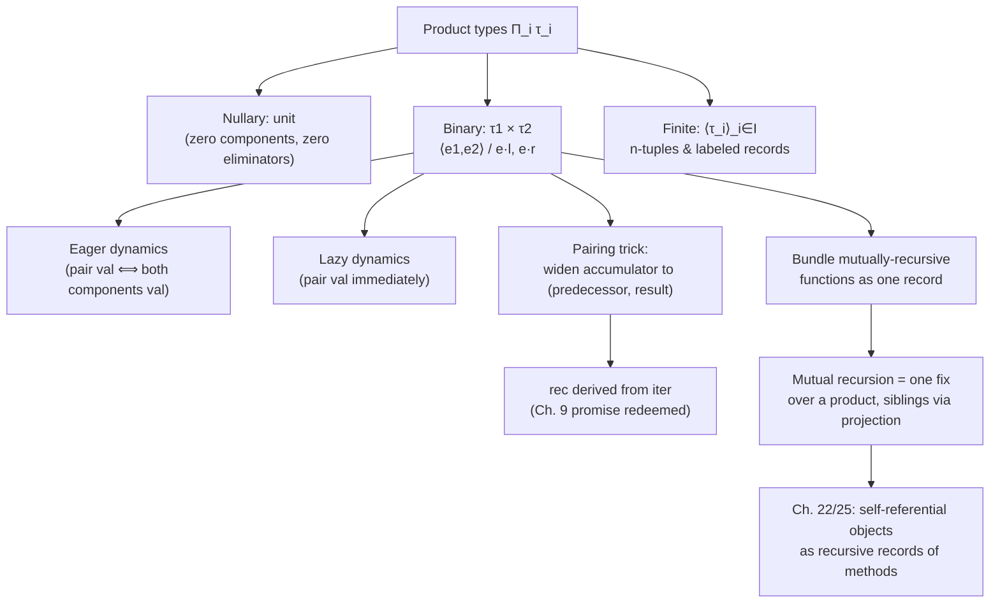

[[book-guidelines|↩ Back to guidelines]]

# Product Types

## The problem: data with more than one part

Every language up to this point in Harper's development has dealt in single, unstructured pieces of data — a natural number, a function. But real data is *structured*: a point has an $x$ and a $y$; a bank account record has a balance and an owner; a function that returns "quotient and remainder" needs to hand back two numbers at once, not one. None of the languages built so far — $\mathcal{L}\{\mathsf{nat}\to\}$, PCF — have any way to bundle several values into a single value. Chapter 11 fixes that with the **product type**: the type whose elements are, quite literally, tuples of elements of other types.

[[Exceptions#What breaks without it|What breaks without it]]: without a product type, "returning two things" has to be faked — usually by picking one of the two results as *the* return value and smuggling the other one out through a side channel (a mutable output parameter, a global variable, an exception carrying auxiliary data). Every one of those workarounds either breaks purity, breaks [[Type-Safety|type safety]], or breaks compositionality (you can no longer treat "a pair of things" as a first-class value you can pass around, store, or return from another function). The product type is the minimal, principled fix: make "bundle of values" itself a type, with its own introduction form (build the bundle) and its own elimination forms (take it apart).

Harper introduces products in three layers, from simplest to most general:

1. **Nullary product** — the type with exactly one value, carrying *no* information. This is the base case, and it turns out to be surprisingly important precisely because it's the type with nothing in it.
2. **Binary product** — ordered pairs, $\tau_1 \times \tau_2$.
3. **Finite product** — $I$-indexed tuples $\prod_{i \in I} \tau_i$, which specializes to $n$-tuples when $I = \{0, \ldots, n-1\}$ and to labeled records when $I$ is a set of symbolic field names.

All three share the same shape of [[Statics-And-Dynamics|statics and dynamics]], so the ideas developed for the binary case transfer directly.

## Binary products: pairs as ordered tuples

The syntax is small:

$$
\begin{aligned}
\tau &::= \tau_1 \times \tau_2 \\
e &::= \langle e_1, e_2 \rangle \mid e \cdot l \mid e \cdot r
\end{aligned}
$$

$\langle e_1, e_2 \rangle$ is the **introduction form** — build a pair from two expressions. $e \cdot l$ and $e \cdot r$ are the **elimination forms** — the left and right **projections**, which extract the first and second component of a pair, respectively. The [[Symbols-and-Dynamic-Binding#Statics|statics]] says exactly what you'd expect:

$$
\dfrac{\Gamma \vdash e_1 : \tau_1 \quad \Gamma \vdash e_2 : \tau_2}{\Gamma \vdash \langle e_1, e_2 \rangle : \tau_1 \times \tau_2} \qquad\qquad \dfrac{\Gamma \vdash e : \tau_1 \times \tau_2}{\Gamma \vdash e \cdot l : \tau_1} \qquad\qquad \dfrac{\Gamma \vdash e : \tau_1 \times \tau_2}{\Gamma \vdash e \cdot r : \tau_2}
$$

Notice the shape: one introduction rule that needs *both* components, and two separate elimination rules, one per projection. This "one constructor, several destructors" pattern is the template every later product-like construct (finite products, records, later even dependent $\Sigma$-kinds in Chapter 24) will reuse.

**Rust [[Plotkins-PCF-and-Partial-Computation#Grounding|grounding]].** This is exactly a struct, or a tuple:

```rust
struct Pair<A, B> {
    left: A,
    right: B,
}

// Introduction: build the pair.
let p: Pair<i32, bool> = Pair { left: 3, right: true };

// Elimination: the two projections.
let x: i32 = p.left;   // e · l
let y: bool = p.right; // e · r
```

Rust's `.left` / `.right` field access *is* $e \cdot l$ and $e \cdot r$ — field projection on a struct is definitionally the elimination form for a product type, and this correspondence is exact, not an analogy. The typing rules above are literally the rules the Rust compiler enforces when it checks a field access.

## Nullary product: the unit type, and why it has no elimination form

The nullary product — Harper writes it `unit` — is the product of *zero* types, indexed by the empty index set. Its syntax:

$$
\tau ::= \mathsf{unit} \qquad\qquad e ::= \langle\rangle
$$

with the single rule $\Gamma \vdash \langle\rangle : \mathsf{unit}$, and Harper is explicit about the striking asymmetry: **there is no elimination form for the unit type**, "there being nothing to extract from the null tuple." Once you see the binary case as "one introduction rule needing both components, plus one elimination rule per component," the nullary case follows immediately: zero components means zero elimination rules. It isn't an oversight or a simplification — it's forced by the pattern.

This matters more than it looks like it should, because `unit` is the type that carries *no information whatsoever* — every well-typed expression of type `unit` is definitionally equal to $\langle\rangle$, so knowing "this has type `unit`" tells you nothing you didn't already know. That's precisely the right type for "a computation that runs for its effect and returns nothing interesting" — Rust's `()`, or a function whose only job is a side effect.

**Rust grounding.**

```rust
fn log_message(msg: &str) -> () {   // or just `fn log_message(msg: &str)`
    println!("{msg}");
    // implicit return value: ()
}
```

Rust's `()` is exactly `unit`, and — matching Harper's rule — you cannot project anything out of a `()` value, because there's nothing there. Contrast this with `void`/`Empty` (Chapter 12's nullary *sum*): `unit` has exactly one value and every well-typed `unit`-producing computation returns it; `void` has *no* values, and a function returning `void` (in the sense of an uninhabited type, not C's `void`) can never actually return at all. Harper flags this exact confusion later, in the Chapter 12 material — "the void of many languages is actually unit."

## Finite products: generalizing to $n$-tuples and records

The binary and nullary cases are instances of one general construction, the **finite product** $\prod_{i \in I} \tau_i$, indexed by an arbitrary finite index set $I$:

$$
\begin{aligned}
\tau &::= \mathsf{prod}(\{i \hookrightarrow \tau_i\}_{i \in I}) \quad\text{written } \langle \tau_i \rangle_{i \in I} \\
e &::= \mathsf{tpl}(\{i \hookrightarrow e_i\}_{i \in I}) \quad\text{written } \langle e_i \rangle_{i \in I} \\
&\phantom{::=}\ \mathsf{pr}[i](e) \quad\text{written } e \cdot i
\end{aligned}
$$

$$
\dfrac{\Gamma \vdash e_1 : \tau_1 \ \cdots\ \Gamma \vdash e_n : \tau_n}{\Gamma \vdash \langle i_1 \hookrightarrow e_1, \ldots, i_n \hookrightarrow e_n \rangle : \langle i_1 \hookrightarrow \tau_1, \ldots, i_n \hookrightarrow \tau_n \rangle} \qquad\qquad \dfrac{\Gamma \vdash e : \langle i_1 \hookrightarrow \tau_1, \ldots, i_n \hookrightarrow \tau_n \rangle \quad (1 \le k \le n)}{\Gamma \vdash e \cdot i_k : \tau_k}
$$

Two specializations recover everything already discussed: taking $I = \{0, \ldots, n-1\}$ gives ordinary $n$-tuples; taking $I$ to be an empty set gives back `unit`; taking $I$ to be a two-element set $\{l, r\}$ gives back the binary case exactly. But the interesting new specialization is taking $I$ to be a set of **symbols** used as field labels — that's a **record**.

**Rust grounding.** Rust's named-field structs are finite products indexed by identifiers, and its tuples are finite products indexed by $\{0, \ldots, n-1\}$ — the same construct, two different index sets:

```rust
// I = { "name", "balance" } — a labeled record, i.e. a finite product
struct Account {
    name: String,
    balance: i64,
}

// I = { 0, 1, 2 } — the same construct, positional index set
let triple: (i32, bool, String) = (3, true, "hi".to_string());
let first = triple.0;   // e · 0
```

There is genuinely only one idea here, wearing two syntactic costumes. This is worth sitting with: "struct" and "tuple" are not two different features of Rust's type system, they're two presentations of $\prod_{i \in I}\tau_i$ for two choices of $I$.

## Eager versus lazy dynamics: when does a pair's contents get evaluated?

Here is the chapter's sharpest idea. The [[Exceptions#Dynamics|dynamics]] of pairs is given by these rules, with the bracketed material optional:

$$
\dfrac{}{\langle\rangle\ \mathsf{val}} \qquad\qquad \dfrac{[e_1\ \mathsf{val}]\ [e_2\ \mathsf{val}]}{\langle e_1, e_2 \rangle\ \mathsf{val}}
$$

$$
\dfrac{e_1 \mapsto e_1'}{\langle e_1, e_2 \rangle \mapsto \langle e_1', e_2 \rangle}\ [e_2\ \mathsf{val}\ \text{side condition absent}] \qquad\qquad \dfrac{e_1\ \mathsf{val}\quad e_2 \mapsto e_2'}{\langle e_1, e_2 \rangle \mapsto \langle e_1, e_2' \rangle}
$$

$$
\dfrac{[e_1\ \mathsf{val}]\ [e_2\ \mathsf{val}]}{\langle e_1, e_2 \rangle \cdot l \mapsto e_1} \qquad\qquad \dfrac{[e_1\ \mathsf{val}]\ [e_2\ \mathsf{val}]}{\langle e_1, e_2 \rangle \cdot r \mapsto e_2}
$$

*"The bracketed rules and premises are to be omitted for a lazy dynamics, and included for an eager dynamics of pairing."* Read that literally: it's a single set of rule schemas, and you get two genuinely different languages depending on whether you keep or drop three bracketed premises.

- **Eager (strict) pairing.** Keep the brackets. A pair $\langle e_1, e_2 \rangle$ is a value only once *both* components have already been reduced to values — building the pair itself forces evaluation of both components immediately, even if neither is ever projected out.
- **Lazy pairing.** Drop the brackets. A pair $\langle e_1, e_2 \rangle$ is *already* a value the moment it's formed, components unevaluated. A component is only reduced when — and if — it's actually projected with `· l` or `· r`.

What breaks without picking one consistently: if you evaluate eagerly, `⟨1/0, 42⟩` diverges (or errors) even if you only ever read the second component — you paid for computing something you never needed, and worse, an otherwise-fine program crashes because of a component nobody asked for. If you evaluate lazily, you risk building up a chain of unevaluated "thunks" that silently duplicate work if the same component is projected more than once (unless the language also adds memoization, which Harper treats separately as *laziness with sharing* in Chapter 30). Neither choice is free; the chapter's point is that the *type* $\tau_1 \times \tau_2$ doesn't force the choice — it's a separate dynamics decision layered on top of the same statics, and Theorem 11.1 ([[Dynamic-Classification#Safety|safety]]) holds *for either choice*, proved by the same induction in both cases.

**Rust grounding.** Rust pairing is eager by construction — building a tuple evaluates both sides immediately, left to right, exactly matching the bracketed rules:

```rust
fn expensive() -> i32 { println!("computing..."); 42 }

let pair = (expensive(), expensive()); // BOTH run immediately — eager
```

To get *lazy* pairing in Rust you have to build it explicitly, because the language doesn't offer it natively — which is itself a useful confirmation that laziness is a dynamics choice, not something forced by having a product type at all:

```rust
// A lazy pair: components are thunks, forced on projection.
struct LazyPair<A, B> {
    left: Box<dyn FnOnce() -> A>,
    right: Box<dyn FnOnce() -> B>,
}

impl<A, B> LazyPair<A, B> {
    fn proj_l(self) -> A { (self.left)() }  // forces only on projection
    fn proj_r(self) -> B { (self.right)() }
}
```

**[[Continuations#Python grounding|Python grounding]]**, for the same point in a five-line sketch: a Python tuple `(f(), g())` is eager (both calls happen when the tuple literal is built), whereas `(lambda: f(), lambda: g())` paired with the reader remembering to *call* the element it wants is a crude manual encoding of lazy pairing — nothing forces evaluation of the component you never call.

## Encoding primitive recursion from iteration via pairs

This is where products connect back to Gödel's System T (Chapter 9). Recall the distinction from that chapter: **iteration**, $\mathsf{iter}(e; e_0; x.e_1)$, only lets the step function see the *result so far*; **primitive recursion**, $\mathsf{rec}(e; e_0; x.y.e_1)$, additionally lets the step function see the *predecessor itself*. Chapter 9 flagged that these have the same expressive power but didn't prove it. Chapter 11 delivers the proof, and the mechanism is: **carry the predecessor and the result together, as a pair, through the iteration.**

Concretely, `rec(e; e0; x.y.e1)` is defined to be `e' · r`, where `e'` is

$$
\mathsf{iter}(e;\ \langle \mathsf{z}, e_0 \rangle;\ x.\ \langle \mathsf{s}(x \cdot l),\ [x \cdot r / x]\, e_1 \rangle)
$$

Read this as: iterate over `e`, carrying along a pair $\langle n, \mathrm{result} \rangle$ instead of just `result`. At each step, the new first component is $\mathsf{s}(x \cdot l)$ — the predecessor's count, plus one — and the new second component is $e_1$ with the predecessor variable substituted by $x \cdot r$, the *previous* result. When the iteration finishes, you project out `· r` to discard the bookkeeping count and keep only the actual answer. The base case is the pair $\langle \mathsf{z}, e_0 \rangle$: zero paired with the base result.

Why this works is worth stating precisely: primitive recursion's step function needs *two* pieces of information the plain iterator doesn't expose on its own — the predecessor $x$ and the recursive result $y$. Iteration only ever hands the step function the running result. The fix is to make the running result itself carry both pieces: instead of iterating over "just the answer," iterate over "the pair (how far along we are, the answer so far)." Once you have a type that can hold two things at once, you can smuggle exactly the extra piece of information primitive recursion needs through an interface that was only designed to carry one.

**Rust grounding**, deriving primitive recursion (`nat_rec`, needs the predecessor) from a plain iterator (`nat_iter`, doesn't) via exactly this pairing trick:

```rust
// Only sees the running result — this is `iter`.
fn nat_iter<T>(n: u64, base: T, step: impl Fn(T) -> T) -> T {
    let mut acc = base;
    for _ in 0..n { acc = step(acc); }
    acc
}

// Needs BOTH the predecessor and the running result — this is `rec`,
// derived from nat_iter by carrying (predecessor, result) as a pair.
fn nat_rec<T: Clone>(n: u64, base: T, step: impl Fn(u64, T) -> T) -> T {
    let (_, result) = nat_iter(n, (0u64, base), |(k, acc)| (k + 1, step(k, acc)));
    result
}
```

`nat_iter`'s step closure only ever sees `acc`; `nat_rec`'s step closure gets `k` (the predecessor) *and* `acc` (the prior result), exactly as `rec`'s typing rule promises — and it's built entirely out of `nat_iter` plus a pair. This is a genuinely reusable trick beyond this one example: **any time an interface only exposes an accumulator, and you need one more piece of running state, widen the accumulator to a tuple.** It's the same move as "threading extra state through a fold" in any functional-programming context.

**Lean grounding.** Lean's `Nat.rec` (the actual primitive eliminator generated by the inductive definition of `Nat`) already gives you the predecessor for free, so this derivation is usually invisible in practice — but the *converse* direction, deriving `Nat.rec`-shaped recursion from a plain `foldl`-style iterator, is exactly this pairing trick, and it's a useful sanity check for understanding why Lean's eliminators are stated the way they are: the eliminator's motive gets to depend on the constructor's argument precisely because that argument (the predecessor) is carried explicitly, not reconstructed after the fact.

## Mutual recursion as recursion over a product

The chapter's second application of products is mutual recursion. The motivating example is the even/odd pair of functions:

$$
E(0) = 1 \qquad O(0) = 0 \qquad E(n+1) = O(n) \qquad O(n+1) = E(n)
$$

The problem: $\mathcal{L}\{\mathsf{nat} \rightharpoonup\}$'s recursion construct (`fix`, from Chapter 10) only lets you define *one* self-referential value at a time. There's no primitive syntax for "define $E$ and $O$ simultaneously, each allowed to call the other." Harper's fix is the same move as before, one level up: **bundle the mutually recursive functions into a single record, and recurse once over the whole record.**

Define the labeled tuple type

$$
\tau_{EO} \triangleq \langle \mathsf{even} \hookrightarrow \mathsf{nat} \to \mathsf{nat},\ \mathsf{odd} \hookrightarrow \mathsf{nat} \to \mathsf{nat} \rangle
$$

and build a single self-referential value of that type,

$$
e_{EO} \triangleq \mathsf{fix}\ \mathit{this}{:}\tau_{EO}\ \mathsf{is}\ \langle \mathsf{even} \hookrightarrow e_E,\ \mathsf{odd} \hookrightarrow e_O \rangle,
$$

where $e_E$ and $e_O$ each refer to the *other* function not by name, but by projecting it out of the bound self-reference variable $\mathit{this}$:

$$
e_E \triangleq \lambda(x{:}\mathsf{nat}).\ \mathsf{ifz}\ x\ \{\mathsf{z} \Rightarrow \mathsf{s}(\mathsf{z}) \mid \mathsf{s}(y) \Rightarrow \mathit{this} \cdot \mathsf{odd}(y)\}
$$
$$
e_O \triangleq \lambda(x{:}\mathsf{nat}).\ \mathsf{ifz}\ x\ \{\mathsf{z} \Rightarrow \mathsf{z} \mid \mathsf{s}(y) \Rightarrow \mathit{this} \cdot \mathsf{even}(y)\}
$$

The two actual mutually recursive functions you use are then the projections $e_{EO} \cdot \mathsf{even}$ and $e_{EO} \cdot \mathsf{odd}$. There is exactly one `fix`, applied to exactly one recursive value — the product type is what makes that one value *behave like two*, because a single self-reference to a record gives every field simultaneous access to every other field.

This generalizes completely: $n$ mutually recursive functions become one recursive record of $n$ fields, each field's body referring to its siblings by projecting the shared self-reference variable. Harper notes this same pattern reappears, essentially unchanged, as the mechanism behind **self-referential objects** in later chapters — an object with several mutually-calling methods *is* a recursively-defined record of functions, exactly this construction, just relabeled.

**Rust grounding.** Rust doesn't need this trick for ordinary top-level mutual recursion (two `fn` items can call each other directly, resolved by the module's item namespace rather than value-level self-reference), so the construction is more visible where Rust *itself* needs value-level self-reference — closures that call each other:

```rust
use std::rc::Rc;
use std::cell::RefCell;

struct EvenOdd {
    even: Rc<dyn Fn(u64) -> u64>,
    odd: Rc<dyn Fn(u64) -> u64>,
}

// Tied together through a shared, doubly-referencing cell — this IS the
// "project the sibling out of the bundled self-reference" move, just
// implemented with Rc/RefCell instead of a language-level `fix`.
fn make_even_odd() -> EvenOdd {
    let cell: Rc<RefCell<Option<EvenOdd>>> = Rc::new(RefCell::new(None));
    let cell_e = cell.clone();
    let even: Rc<dyn Fn(u64) -> u64> = Rc::new(move |n| {
        if n == 0 { 1 } else { (cell_e.borrow().as_ref().unwrap().odd)(n - 1) }
    });
    let cell_o = cell.clone();
    let odd: Rc<dyn Fn(u64) -> u64> = Rc::new(move |n| {
        if n == 0 { 0 } else { (cell_o.borrow().as_ref().unwrap().even)(n - 1) }
    });
    let result = EvenOdd { even, odd };
    *cell.borrow_mut() = Some(EvenOdd { even: result.even.clone(), odd: result.odd.clone() });
    result
}
```

The awkwardness of this Rust encoding (needing `Rc<RefCell<...>>` to tie the knot) is itself informative: it's exactly the "origin of state from feedback and self-reference" theme Harper develops later (Chapter 16) — building a genuinely self-referential *value* (as opposed to two independently-named top-level functions) is where mutable/shared references start to become necessary in a language that doesn't have `fix` as a primitive.

**Lean grounding.** Lean's own `mutual ... end` blocks for defining several functions simultaneously are, under the hood, elaborated into exactly this shape: the mutually recursive definitions get packaged as one recursive value (conceptually a tuple of functions closed over each other) so that Lean's single termination checker can validate the whole bundle at once, rather than needing a bespoke multi-function recursion principle. Seeing Harper's $\tau_{EO}$ construction explicitly is a good way to demystify what a `mutual` block compiles down to — it isn't new machinery, it's the ordinary recursor applied to a product.

## Structural summary



## Where this leads

Product types are the first of the *finite data types* (Part IV of the book), and the pattern established here — one introduction rule needing all components, one elimination rule per component, a choice of eager vs. lazy dynamics layered on top of a fixed statics — is reused almost verbatim by [[Sum-Types|sum types]] next chapter (Chapter 12), just with introduction and elimination roles swapped (many introduction rules, one elimination rule doing case analysis). Chapter 13's [[Pattern-Matching|pattern matching]] then generalizes both products' and sums' elimination forms into a single unified pattern language. Much further out, the finite product reappears at the level of *kinds* in Chapter 24 as the dependent product kind $\Sigma u{::}\kappa_1.\kappa_2$ — the same "bundle of things, indexed" idea, one universe level up.

For the standing project: the eager/lazy dynamics choice is a direct, load-bearing precedent for anything in a verifier that has to decide *when* a compound value's fields get checked or evaluated — the same fork (force everything at construction vs. force on demand) reappears for evaluating proof terms and for elaborating structure literals. And the mutual-recursion-as-recursion-over-a-product construction is worth keeping in mind concretely for the elaborator project: it's the textbook explanation of what a `mutual`/`let rec ... and ...` block actually desugars to, which matters directly if the elaborator needs to type-check or unify across a block of mutually recursive definitions as one unit rather than function-by-function.
