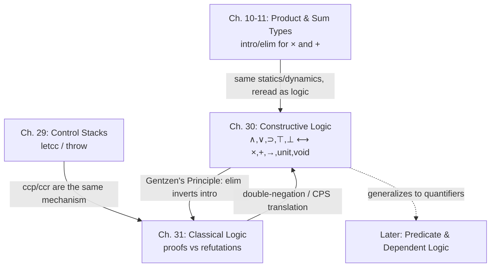

[[book-guidelines|↩ Back to guidelines]]

# Propositions as Types

## Why logic needs a computational reading

Take a proof of $P \Rightarrow Q$ in ordinary mathematics. What *is* it, mechanically? At minimum, it is a procedure: hand it a proof of $P$, and it hands back a proof of $Q$. Nobody normally cares about that operational reading — a proof is treated as a static certificate, a piece of paper. But Harper's whole point in Chapter 30 is that if you take seriously the idea that "$\varphi$ is true" *means* "$\varphi$ has a proof," then that operational reading isn't optional color commentary — it's the entire content of what a proof is. A proof of an implication is nothing but a transformation from proofs of the hypothesis to proofs of the conclusion. That transformation is a function. And a function, given an input, computes.

This is **constructive logic**: truth is not a free-floating semantic property assigned from outside (as classical two-valued semantics would have it), but is *identified with* the existence of a proof. Harper phrases this sharply: "constructive logic may be described as logic as if people matter, as distinct from classical logic, which may be described as the logic of the mind of god." A classical semantics assumes some cosmic arbiter has already decided, for every proposition, whether it's true or false — the Continuum Hypothesis is secretly either true or false, we just don't know which. Constructively, that's a category error. If nobody — not "the mind of god," nobody — has produced a proof or a refutation, then the proposition is neither true nor false. It's *open*. This isn't a defect to patch; it's a direct, unavoidable consequence of finitude: there are infinitely many propositions but, at any moment, only finitely many proofs that have actually been constructed, so undecided problems are guaranteed to exist forever.

**[[Control-Stacks-and-Abstract-Machines#What breaks without this|What breaks without this]] stance:** if you instead treat truth as an ambient property independent of evidence, you get a logic that is philosophically clean but computationally inert — proofs become inert certificates with no operational content, and you lose any hope of a language where "type-checks" and "is proved correct" are the same act. Constructive logic is what makes type checking *be* proof checking.

Once you accept that a proof is evidence, and evidence for a compound proposition is built from evidence for its parts in a way determined by the proposition's outermost connective, the forms that proofs can take are exactly the forms of expressions in a programming language. That identification — propositions with types, proofs with programs — is what Harper calls the **propositions as types** principle, "the central organizing principle of the theory of programming languages."

## Provability as a hypothetical judgment

Constructive logic works with two judgments: $\varphi\ \mathsf{prop}$ ("$\varphi$ is a well-formed proposition") and $\varphi\ \mathsf{true}$ ("$\varphi$ has a proof"). These are almost always used inside a hypothetical judgment,

$$\varphi_1\ \mathsf{true}, \ldots, \varphi_n\ \mathsf{true} \vdash \varphi\ \mathsf{true},$$

read as "$\varphi$ is true given that each $\varphi_i$ is true," with the usual structural rules: hypotheses can be used directly (reflexivity), substituted for one another (transitivity/cut), duplicated (contraction), and reordered (exchange) — nothing about a proof of $\varphi_2$ from $\varphi_1$ cares how many times you assumed $\varphi_1$, or in what order you listed your assumptions.

The syntax of propositions is fixed by a small grammar of connectives — truth $\top$, falsity $\bot$, conjunction $\varphi_1 \wedge \varphi_2$, disjunction $\varphi_1 \vee \varphi_2$, implication $\varphi_1 \supset \varphi_2$ — and **each connective is given meaning by a pair of rules**: an *introduction* rule specifying how to construct a direct proof of a proposition with that connective at the head, and an *elimination* rule specifying how to use such a proof indirectly, in the course of proving something else. This introduction/elimination discipline (due to Gentzen) is the backbone of the whole chapter.

- **Truth** has an introduction rule but no elimination rule — it carries no information, so nothing can be extracted from it: $\Gamma \vdash \top\ \mathsf{true}$, always.
- **Conjunction**: introduce by proving both conjuncts; eliminate by projecting either one out.
$$\frac{\Gamma \vdash \varphi_1\ \mathsf{true} \quad \Gamma \vdash \varphi_2\ \mathsf{true}}{\Gamma \vdash \varphi_1 \wedge \varphi_2\ \mathsf{true}} \qquad \frac{\Gamma \vdash \varphi_1 \wedge \varphi_2\ \mathsf{true}}{\Gamma \vdash \varphi_1\ \mathsf{true}} \qquad \frac{\Gamma \vdash \varphi_1 \wedge \varphi_2\ \mathsf{true}}{\Gamma \vdash \varphi_2\ \mathsf{true}}$$
- **Implication**: introduce by discharging the hypothesis — prove the conclusion assuming the antecedent; eliminate by modus ponens.
$$\frac{\Gamma, \varphi_1\ \mathsf{true} \vdash \varphi_2\ \mathsf{true}}{\Gamma \vdash \varphi_1 \supset \varphi_2\ \mathsf{true}} \qquad \frac{\Gamma \vdash \varphi_1 \supset \varphi_2\ \mathsf{true} \quad \Gamma \vdash \varphi_1\ \mathsf{true}}{\Gamma \vdash \varphi_2\ \mathsf{true}}$$
- **Falsehood** is the mirror image of truth: no introduction rule (you can never prove $\bot$ outright), but an elimination rule — *ex falso quodlibet* — letting any proposition whatsoever follow from a proof of $\bot$: $\Gamma \vdash \bot\ \mathsf{true}$ entails $\Gamma \vdash \varphi\ \mathsf{true}$ for any $\varphi$.
- **Disjunction**: introduce from either disjunct; eliminate by case analysis, proving the goal from *either* possibility.
$$\frac{\Gamma \vdash \varphi_1\ \mathsf{true}}{\Gamma \vdash \varphi_1 \vee \varphi_2\ \mathsf{true}} \qquad \frac{\Gamma \vdash \varphi_2\ \mathsf{true}}{\Gamma \vdash \varphi_1 \vee \varphi_2\ \mathsf{true}} \qquad \frac{\Gamma \vdash \varphi_1 \vee \varphi_2\ \mathsf{true} \quad \Gamma, \varphi_1\ \mathsf{true} \vdash \varphi\ \mathsf{true} \quad \Gamma, \varphi_2\ \mathsf{true} \vdash \varphi\ \mathsf{true}}{\Gamma \vdash \varphi\ \mathsf{true}}$$
- **Negation** is *defined*, not primitive: $\neg\varphi \triangleq \varphi \supset \bot$. To refute $\varphi$ is to show that assuming it leads to absurdity. This definition is quietly load-bearing for everything in Chapter 31.

## Proof terms: making the evidence explicit

Chapter 30's real move is to stop writing the bare judgment $\varphi\ \mathsf{true}$ and instead write $p : \varphi$ — "$p$ is a proof of $\varphi$" — with hypotheses now binding variables that stand for as-yet-unknown proofs: $x_1 : \varphi_1, \ldots, x_n : \varphi_n \vdash p : \varphi$. This is the crucial syntactic step, because now the proof rules are rules for building *terms*, and the term grammar is chosen (deliberately, notation and all) to look exactly like a programming language:

| Connective | Introduction (term) | Elimination (term) | Reading |
|---|---|---|---|
| $\top$ | $\langle\rangle$ | — | unit value |
| $\varphi_1 \wedge \varphi_2$ | $\langle p_1, p_2 \rangle$ | $p{\cdot}l$, $p{\cdot}r$ | pair, projections |
| $\varphi_1 \supset \varphi_2$ | $\lambda(x{:}\varphi_1)\,p_2$ | $p(p_1)$ | function, application |
| $\bot$ | — | $\mathsf{abort}(p)$ | no value, vacuous elimination |
| $\varphi_1 \vee \varphi_2$ | $l{\cdot}p$, $r{\cdot}p$ | $\mathsf{case}\ p\ \{l{\cdot}x_1 \Rightarrow p_1 \mid r{\cdot}x_2 \Rightarrow p_2\}$ | tagged value, case analysis |

For example, conjunction introduction and elimination become

$$\frac{\Gamma \vdash p_1 : \varphi_1 \quad \Gamma \vdash p_2 : \varphi_2}{\Gamma \vdash \langle p_1, p_2\rangle : \varphi_1 \wedge \varphi_2} \qquad \frac{\Gamma \vdash p : \varphi_1 \wedge \varphi_2}{\Gamma \vdash p{\cdot}l : \varphi_1} \qquad \frac{\Gamma \vdash p : \varphi_1 \wedge \varphi_2}{\Gamma \vdash p{\cdot}r : \varphi_2}$$

and implication introduction/elimination is exactly $\lambda$-abstraction and application:

$$\frac{\Gamma, x:\varphi_1 \vdash p_2 : \varphi_2}{\Gamma \vdash \lambda(x{:}\varphi_1)\,p_2 : \varphi_1 \supset \varphi_2} \qquad \frac{\Gamma \vdash p : \varphi_1 \supset \varphi_2 \quad \Gamma \vdash p_1 : \varphi_1}{\Gamma \vdash p(p_1) : \varphi_2}$$

This is not an analogy the book is drawing for pedagogical comfort — the syntax genuinely *is* the lambda calculus's, chosen so the correspondence is undeniable on the page.

## Gentzen's Principle: elimination inverts introduction

Having proof terms lets Harper state the deep structural fact precisely: **Gentzen's Principle** says the eliminatory forms are inverse to the introductory ones, in two directions at once.

1. **Conservation of proof** (post-inverse): eliminating something you just introduced gets you back exactly what you put in, no more, no less. For conjunction:
$$\Gamma \vdash \langle p_1, p_2\rangle \cdot l \equiv p_1 : \varphi_1 \qquad \Gamma \vdash \langle p_1, p_2\rangle \cdot r \equiv p_2 : \varphi_2$$
and for implication, this is exactly the beta rule of the lambda calculus:
$$\Gamma \vdash (\lambda(x{:}\varphi_1)\,p_2)(p_1) \equiv [p_1/x]p_2 : \varphi_2$$

2. **Reversibility of proof** (pre-inverse): any proof can be reconstructed from what elimination can extract from it — nothing is lost by decomposing and rebuilding. For conjunction:
$$\Gamma \vdash \langle p{\cdot}l,\, p{\cdot}r\rangle \equiv p : \varphi_1 \wedge \varphi_2$$
and for implication, this is exactly the eta rule:
$$\Gamma \vdash \lambda(x{:}\varphi_1)\,(p(x)) \equiv p : \varphi_1 \supset \varphi_2$$

If you've seen beta and eta laws presented as arbitrary equational conveniences in a typed lambda calculus course, this is where they actually come from: they are the proof-theoretic statement that introduction and elimination are mutually inverse, restated at the level of program equality. **[[Data-Abstraction-and-Existential-Types#What breaks without this|What breaks without this]] principle:** without conservation, elimination could "invent" information not present in the original proof — logically unsound, computationally equivalent to a function that returns something not derivable from its argument. Without reversibility, distinct proofs could be indistinguishable by any elimination test yet still be treated as different — a form of extensional incompleteness (exactly the failure eta-expansion prevents in a language without it).

## The correspondence chart

Putting [[Statics-And-Dynamics|statics and dynamics]] for proofs side by side with [[Symbols-and-Dynamic-Binding#Statics|statics]] and [[Exceptions#Dynamics|dynamics]] for expressions of the corresponding type, Harper arrives at the chart that gives Chapter 30 its title:

$$
\begin{array}{c|c}
\text{Prop} & \text{Type} \\\hline
\top & \mathsf{unit} \\
\bot & \mathsf{void} \\
\varphi_1 \wedge \varphi_2 & \tau_1 \times \tau_2 \\
\varphi_1 \supset \varphi_2 & \tau_1 \to \tau_2 \\
\varphi_1 \vee \varphi_2 & \tau_1 + \tau_2 \\
\end{array}
$$

Truth is the unit type (trivially inhabited, one canonical value, no way to extract information — precisely because there is none to extract). Falsity is the empty/void type (uninhabited; its "elimination rule" is vacuous case analysis over zero cases, i.e. `abort`). Conjunction is the product type. Implication is the function type. Disjunction is the sum (tagged union) type. This is the **Curry–Howard correspondence** (Harper is careful to note this name undersells the contributions of Brouwer, Heyting, de Bruijn, Gentzen, Girard, Kolmogorov, Martin-Löf, and Tait beyond just Curry and Howard) — and Harper adds a subtlety worth keeping: it is not, in general, an *isomorphism*, but rather an expression of "Brouwer's Dictum that the concept of proof is best explained by the more general concept of construction (program)."

**[[Plotkins-PCF-and-Partial-Computation#Grounding|Grounding]] — Lean, treated as primary here** since this chapter *is* type theory in its most literal form. In Lean, `And`, `Or`, `True`, `False`, and `→` (function types) genuinely are the propositions-as-types correspondence, not an analogy to it — `Prop` is a universe, and its inductive types carry exactly the introduction/elimination structure above:

```lean
-- Conjunction: exactly the ∧I / ∧E rules of §30.2.1
structure And (φ ψ : Prop) : Prop where
  intro ::
  left  : φ
  right : ψ

theorem and_elim_left {φ ψ : Prop} (p : And φ ψ) : φ := p.left

-- Implication is literally the function type φ → ψ.
-- ⊃I is lambda-abstraction, ⊃E is application — no new machinery needed.
theorem modus_ponens {φ ψ : Prop} (p : φ → ψ) (p1 : φ) : ψ := p p1

-- Falsehood: no constructors, so False.elim (⊥E / "abort") is
-- Lean's own recursor over zero cases.
theorem ex_falso {φ : Prop} (p : False) : φ := False.elim p

-- Disjunction, with its two introduction forms and case-based elimination:
theorem or_elim {φ ψ γ : Prop} (p : Or φ ψ)
    (f : φ → γ) (g : ψ → γ) : γ :=
  match p with
  | Or.inl x => f x
  | Or.inr y => g y
```

The beta rule from conservation of proof is exactly what `rfl`/definitional unfolding gives you for `(fun x => e) a ≡ e[a/x]` in Lean's kernel; eta for products/functions is likewise built into Lean's definitional equality. When you later build an elaborator that checks `isDefEq`, this is precisely the equational theory it must respect for logical soundness — a proof term that beta/eta-reduces to a different one must still type-check as a proof of the same proposition.

**[[Recursive-Types#Grounding|Grounding]] — Rust**, for the checker/verifier reading: [[Sum-Types|sum types]], [[Product-Types|product types]], and function types are exactly `enum`, `struct`/tuple, and `fn`/closure, and a hand-rolled proof checker for this fragment is close to a tiny typed interpreter:

```rust
// Prop ~ Rust types, under the correspondence table above.
enum Prop {
    Top,
    Bot,
    And(Box<Prop>, Box<Prop>),
    Or(Box<Prop>, Box<Prop>),
    Imp(Box<Prop>, Box<Prop>),
}

// Proof terms mirror the Prf grammar of §30.2.2 directly.
enum Proof {
    TrueIntro,                          // ⟨⟩
    AndIntro(Box<Proof>, Box<Proof>),   // ⟨p1, p2⟩
    AndElimL(Box<Proof>),               // p·l
    AndElimR(Box<Proof>),               // p·r
    ImpIntro(String, Box<Proof>),       // λ(x:φ) p   (x is a bound var name)
    ImpElim(Box<Proof>, Box<Proof>),    // p(p1)
    FalseElim(Box<Proof>),              // abort(p)
    OrIntroL(Box<Proof>),               // l·p
    OrIntroR(Box<Proof>),               // r·p
    // OrElim omitted for brevity — mirrors ∨E(p; x1.p1; x2.p2)
    Var(String),
}
```

A type-checker over `Proof` against `Prop`, threading a context `Γ : Vec<(String, Prop)>`, *is* a decision procedure for constructive propositional provability of a candidate derivation — this is the minimal skeleton your Hoare-triple-checking compiler will eventually extend with quantifiers and substitution.

## Classical logic: symmetric truth and falsity, mediated by contradiction

Chapter 31 turns to classical logic — "the one we learned in school," where every proposition is either true or false, full stop. Harper is blunt that this is a *weakening*, not a strengthening, of the connectives' meanings, purchased at the price of a beautiful symmetry: rather than defining a connective by introduction/elimination, classical logic defines it by giving **truth conditions and falsity conditions** together, and mediates between them through a third judgment, **contradiction**, written $\#$.

There are three basic judgments now: $\varphi\ \mathsf{true}$ (provable), $\varphi\ \mathsf{false}$ (refutable), and $\#$ (a contradiction has been derived). Hypotheses split into two zones — falsity assumptions $\Delta$ and truth assumptions $\Gamma$ — and a contradiction arises exactly when the *same* proposition is judged both true and false:
$$\frac{\Delta\ \Gamma \vdash \varphi\ \mathsf{false} \quad \Delta\ \Gamma \vdash \varphi\ \mathsf{true}}{\Delta\ \Gamma \vdash \#}$$
Then truth and falsity are each defined *in terms of* deriving a contradiction from the opposite assumption — this is the **principle of indirect proof**: to show $\varphi\ \mathsf{true}$, it suffices to show that assuming $\varphi\ \mathsf{false}$ leads to $\#$; symmetrically for $\varphi\ \mathsf{false}$. Harper flags that only the second direction (refuting from a truth assumption) is constructively valid — the first direction, proving from a falsity assumption, is the specifically *classical* move, since it lets you conjure truth purely by showing the alternative is untenable, with no direct evidence in hand.

The connective rules split symmetrically too — a conjunction is false if *either* conjunct is false; a disjunction is false if *both* disjuncts are false; negation just flips the judgment ($\varphi\ \mathsf{false}$ gives $\neg\varphi\ \mathsf{true}$, and vice versa). Compare this to constructive logic's asymmetry (where $\bot$ has no direct introduction rule, $\top$ has no elimination rule) — classical logic restores the symmetry by design.

## Proofs and refutations as programs and continuations

Here Harper makes the payoff explicit: classical proofs still have computational content, but a *weaker* kind. A classical proof is not positive evidence for $\varphi$; it is "a computation that cannot be refuted" — something that, handed any purported refutation of $\varphi$, derives an absurdity from it, thereby demonstrating the refutation was flawed.

Formally, there are now three judgments with explicit witnesses: $p : \varphi$ (proof), $k \div \varphi$ (refutation), and $k \# p$ ("$k$ and $p$ are contradictory" — a proof and refutation of the same proposition juxtaposed). Refutation terms extend the earlier proof grammar with elimination-shaped constructs turned into "falsity witnesses": $\mathsf{fst}; k$ and $\mathsf{snd}; k$ refute a conjunction by refuting one side; $\mathsf{case}(k_1; k_2)$ refutes a disjunction by refuting both sides; $\mathsf{ap}(p); k$ refutes an implication by supplying a proof of the antecedent and a refutation of the consequent; $\mathsf{not}(k)$ and $\mathsf{not}(p)$ flip proof/refutation across negation, exactly mirroring the truth/falsity symmetry above.

The crucial new proof and refutation forms are what encode indirect proof as executable terms:

$$\frac{\Delta, u \div \varphi\ \Gamma \vdash k \# p}{\Delta\ \Gamma \vdash \mathsf{ccr}(u \div \varphi.\,k \# p) : \varphi} \qquad \frac{\Delta\ \Gamma, x{:}\varphi \vdash k \# p}{\Delta\ \Gamma \vdash \mathsf{ccp}(x{:}\varphi.\,k \# p) \div \varphi}$$

**"ccr" is "call with current refutation"; "ccp" is "call with current proof"** — deliberately evocative of `call/cc`. A `ccr` term proves $\varphi$ by binding a name $u$ for "whatever refutation of $\varphi$ shows up," and promising to derive $\#$ from it; a `ccp` term dually refutes $\varphi$ by binding a name for "whatever proof shows up." Operationally these are literally continuation-capturing constructs: `ccr(u÷φ. k # p)` captures the ambient refutation into `u`, and when this proof is later confronted with an actual refutation `k'`, the transition
$$k_1 \# \mathsf{ccr}(u \div \varphi.\,k_2 \# p_2) \mapsto [k_1/u]k_2 \# [k_1/u]p_2$$
substitutes the real refutation for `u` throughout — exactly a continuation being invoked. `ccp` behaves dually, capturing the ambient proof. Harper notes the dynamics is genuinely non-deterministic where both a `ccp` and a `ccr` meet head-on (both transitions are simultaneously enabled), resolved only by imposing a priority — "lazy" if you let the refutation fire first, "eager" if you let the proof fire first. Preservation and progress hold for this transition system exactly as for any well-behaved abstract machine (Theorems 31.1–31.2), with computation seeded by a distinguished `halt` refutation.

**Grounding — Rust, for the mechanism.** `ccr`/`ccp` are exactly `call/cc`-style control capture, which in Rust you'd model with an explicit continuation/closure rather than real first-class [[Continuations|continuations]] (Rust has none natively), e.g. representing a refutation as `Box<dyn FnOnce(Proof) -> Contradiction>`:

```rust
// A refutation is "what to do when handed a proof" — a captured continuation.
type Refutation = Box<dyn FnOnce(Proof) -> Contradiction>;

// ccr(u÷φ. k # p): capture the current refutation as `u`, then produce
// a contradiction `k # p` that may itself use `u`.
fn ccr(build: impl FnOnce(Refutation) -> Contradiction) -> Proof {
    // Conceptually: Proof::Ccr(build) — evaluating it later feeds in
    // whichever refutation this proof is ultimately confronted with.
    Proof::Ccr(Box::new(build))
}
```

This is the same shape as `letcc`/`throw` from the book's earlier chapter on control (Ch. 29, `Control-Stacks-and-Abstract-Machines`) — classical proof search *is* programming with first-class control, not a metaphor for it.

## Deriving elimination forms: indirect proof, packaged

Classical logic as stated lacks the friendly elimination rules of constructive logic — there's no primitive "given a proof of $\varphi \wedge \psi$, extract a proof of $\varphi$." Harper shows these are all still *derivable*, via indirect proof, but at a real cost in directness. His worked example: $(\varphi \wedge (\psi \wedge \theta)) \supset (\theta \wedge \varphi)$ has a short constructive proof, $\lambda(w{:}\varphi\wedge(\psi\wedge\theta))\,\langle w{\cdot}r{\cdot}r, w{\cdot}l\rangle$, but its classical rendering must route through `ccr`/`ccp`:
$$\lambda(w{:}\varphi \wedge (\psi \wedge \theta))\ \mathsf{ccr}(u \div \theta \wedge \varphi.\, k \# w)$$
with $k$ a nested refutation built entirely from `fst`/`snd`/`ccp`. The derived conjunction-elimination rule itself packages this pattern once and for all:
$$\mathrm{p}{\cdot}l \;\triangleq\; \mathsf{ccr}(u \div \varphi.\, \mathsf{fst}; u \# p)$$
— "to extract the left conjunct of $p$, assume for contradiction that $\varphi$ is false (bind that refutation as $u$), refute $\varphi \wedge \psi$ by refuting its left half via $u$, and contradict $p$ with it." Once this and its siblings for `·r`, application, and `case` are established as *definitions*, the ordinary elimination rules become derivable theorems of classical logic rather than primitives — you get back the familiar constructive-looking notation while the underlying mechanism is genuinely indirect proof in disguise.

## Excluded middle as backtracking computation

The showpiece: $\varphi \vee \neg\varphi$ is a classical theorem (via indirect proof — assume it false, derive $\#$) but is *not* constructively valid, since it would assert every proposition is decided. Its explicit proof term is

$$p_0 : \varphi \vee \neg\varphi \;=\; \mathsf{ccr}\big(u \div \varphi \vee \neg\varphi.\ u \# r{\cdot}\mathsf{not}(\mathsf{ccp}(x{:}\varphi.\ u \# l{\cdot}x))\big).$$

Harper walks the reduction of $k \# p_0$ against an arbitrary refutation $k = \mathsf{case}(k_1; k_2)$ of the disjunction step by step (§31.4). The essential moment: $p_0$ first optimistically asserts the *right* disjunct — i.e., claims $\varphi$ is false — by handing $k$ a proof shaped $r{\cdot}(\ldots)$. But because $k$ got duplicated when `ccr` fired, that same $k$ also gets threaded into a nested `ccp` waiting to catch a proof of $\varphi$ if one shows up. If the surrounding context (via $k_2$, the part of $k$ refuting $\neg\varphi$) does supply an actual proof $p_2 : \varphi$, that proof gets captured by the `ccp`, and the whole computation **changes its mind**: it discards its earlier claim and instead feeds $l{\cdot}p_2$ — now asserting the *left* disjunct is true — back into $k_1$. In Harper's words, the proof of excluded middle "boldly asserts $\neg\varphi\ \mathsf{true}$, regardless of the form of $\varphi$. Then, if caught in its lie by the context providing a proof of $\varphi$, it 'changes its mind' and asserts $\varphi$ ... after all."

This is exactly the operational signature of `call/cc`-based backtracking: the proof captures its calling context (the refutation $k$), tries an answer, and if the context rejects that answer by producing counter-evidence, the proof re-invokes the captured context with a revised answer. **What this buys, and what it costs:** you get $\varphi \vee \neg\varphi$ for free, for every $\varphi$, including open problems — but a closed classical proof of a disjunction no longer commits, up front, to *which* disjunct holds. That's precisely the "weaker connectives" price Harper flagged at the top of the chapter: the classical $\vee$ doesn't carry the same information as the constructive $\vee$.

**Grounding — Python**, for a quick illustrative sketch of the same control-flow shape (not load-bearing, just showing that "changes its mind" is an ordinary escape-and-retry with first-class continuations, here faked with [[Exceptions|exceptions]] carrying a resumption closure):

```python
class Backtrack(Exception):
    def __init__(self, proof_of_phi):
        self.proof_of_phi = proof_of_phi

def excluded_middle(phi_refuter):
    # "Optimistically" claim not(phi) is true, i.e. that phi is false.
    try:
        return ("right", refute_by_asserting_false(phi_refuter))
    except Backtrack as caught:
        # The context produced a proof of phi after all — change our mind.
        return ("left", caught.proof_of_phi)
```

The `except Backtrack` clause is doing exactly what `ccp` does: catching whatever proof of $\varphi$ the context supplies, after the fact, and retrying with a different disjunct.

## The double-negation translation

If excluded middle is classically valid but constructively too strong, Harper's final move (§31.5) is to show classical logic is nonetheless *interpretable inside* constructive logic — and, remarkably, that this shows classical logic is the **weaker** of the two systems (not the stronger, contrary to the naive intuition that "more rules = more power"). The translation $\varphi^*$ maps classical propositions to constructive ones:

$$\top^* = \top \qquad \bot^* = \bot \qquad (\varphi_1 \wedge \varphi_2)^* = \varphi_1^* \wedge \varphi_2^* \qquad (\varphi_1 \vee \varphi_2)^* = \varphi_1^* \vee \varphi_2^* \qquad (\varphi_1 \supset \varphi_2)^* = \varphi_1^* \supset \neg\neg\varphi_2^* \qquad (\neg\varphi)^* = \neg\varphi^*$$

with the correspondence between the two systems' judgments given by:

$$
\begin{array}{ll}
\Delta\ \Gamma \vdash \varphi\ \mathsf{true} & \leadsto\ \ \neg\Delta^*\ \Gamma^* \vdash \neg\neg\varphi^*\ \mathsf{true} \\
\Delta\ \Gamma \vdash \varphi\ \mathsf{false} & \leadsto\ \ \neg\Delta^*\ \Gamma^* \vdash \neg\varphi^*\ \mathsf{true} \\
\Delta\ \Gamma \vdash \# & \leadsto\ \ \neg\Delta^*\ \Gamma^* \vdash \bot\ \mathsf{true}
\end{array}
$$

**Classical truth is not translated to constructive truth — it's weakened to constructive *irrefutability*** ($\neg\neg\varphi^*$, not $\varphi^*$ itself). Because $\neg\neg\varphi \Leftrightarrow \varphi$ classically (double negations cancel classically, but only constructively derive $\varphi \Rightarrow \neg\neg\varphi$, never the converse in general), the translation preserves classical meaning exactly while genuinely weakening what's asserted constructively. This is the precise sense in which "classical logic is weaker (less expressive) than constructive logic despite having more principles" (one of the guidelines' own Key Questions): every classical proof becomes a constructive proof, just of a constructively-weaker statement — so constructive logic can express a distinction (affirmation vs. mere irrefutability) that classical logic collapses, while nothing classical is lost. Harper closes by noting the computational content of this translation was first connected, by Murthy, to the continuation-passing-style transformation used in compilers — i.e., the double-negation translation *is*, computationally, CPS conversion.

## Synthesis: where this sits in the book



This chapter pair is where two threads the book has been pulling separately finally get named as the same thread. The introduction/elimination discipline for $\wedge, \vee, \supset, \top, \bot$ is *literally* the statics of product, sum, function, unit, and void types from Chapters 10–11 — not analogous to it, identical to it, down to the beta/eta laws matching Gentzen's conservation/reversibility principles term for term. And Chapter 31's `ccp`/`ccr` machinery is not a new control-flow primitive; it's the `letcc`/`throw` continuation machinery from Chapter 29 (`Control-Stacks-and-Abstract-Machines`), rediscovered as the operational meaning of indirect proof. Excluded middle turns out to be, computationally, nothing but a backtracking search over a captured continuation.

**For the standing project** (a Rust verifier with an embedded theorem prover, and a Lean-style elaborator): this chapter is the direct ancestor of "type-checking a proof term is running a type checker," which is exactly what your Hoare-triple checker needs to do for the *logical* side of a specification, once you go beyond pure code typing into embedded assertions. The `ccp`/`ccr` transition system is also a concrete, book-verified worked example of what a continuation-passing evaluator for a control-heavy language looks like, which is the same shape of machine your elaborator's backtracking search (for typeclass resolution or overload disambiguation, say) will eventually need. And the double-negation translation is worth remembering by name the next time you write a CPS transform — Harper's chapter is telling you they are, at bottom, the same construction viewed from two different disciplines.
