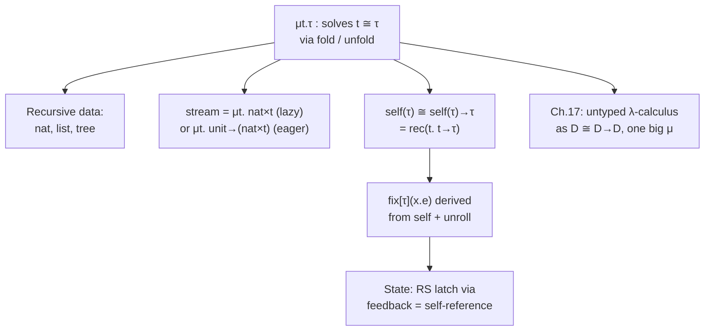

[[book-guidelines|↩ Back to guidelines]]

## The problem: types that refer to themselves

Every type we've built so far — products, sums, functions — is defined *out of* smaller types. But some things you want to type don't decompose that way. A natural number is either zero, or the successor of *another natural number*. A list is either empty, or an element consed onto *another list*. A stream never bottoms out at all: it's an element and *another stream*, forever.

In each case the type shows up inside its own definition. That's not decomposition, it's a fixed-point equation. Harper phrases it as an *isomorphism*:

$$\texttt{nat} \cong \texttt{unit} + \texttt{nat}$$

Read $\cong$ carefully — it does not mean "these are literally the same type," it means there exist two expressions, $e_1$ and $e_2$, one in each direction, that are mutually inverse. Concretely:

$$x : \texttt{unit} + \texttt{nat} \vdash \texttt{case}\ x\ \{l\cdot\Rightarrow z \mid r\cdot x_2 \Rightarrow s(x_2)\} : \texttt{nat}$$
$$x : \texttt{nat} \vdash \texttt{ifz}\ x\ \{z \Rightarrow l\cdot\langle\rangle \mid s(x_2) \Rightarrow r\cdot x_2\} : \texttt{unit} + \texttt{nat}$$

Harper names these two directions **fold** and **unfold**. That naming is the whole chapter in miniature: solving a type equation $t \cong \tau$ means manufacturing a type $\mu t.\tau$ together with a fold and an unfold that witness the isomorphism between $\mu t.\tau$ and $[\mu t.\tau/t]\tau$ (the equation with the recursive occurrence spelled out one level).

**[[Control-Stacks-and-Abstract-Machines#What breaks without this|What breaks without this]]:** without a primitive way to write "the type that equals its own unfolding," you cannot define `nat`, `List`, or any inductive/coinductive structure as a *type in the language* — you'd need to bake each one in as a language primitive (as many early calculi did with a hardwired `nat` type). Recursive types let the language define these once, generically, from a single mechanism.

## The formal move: $\mu t.\tau$ as introduction/elimination, not as unfolding-by-fiat

Harper's language $L\{+\times*\mu\}$ (products, sums, general recursive types, extending $L\{*\}$) adds:

$$\text{Typ}\ \tau ::= t \mid \texttt{rec}(t.\tau) \quad (\mu t.\tau)$$
$$\text{Exp}\ e ::= \texttt{fold}[t.\tau](e) \mid \texttt{unfold}(e)$$

Type formation is a hypothetical judgment over a context $\Delta$ of *type variables* (not term variables) currently in scope, tracking which $t$'s stand for "the recursive type itself":

$$\dfrac{}{\Delta, t\ \texttt{type} \vdash t\ \texttt{type}} \qquad \dfrac{\Delta, t\ \texttt{type} \vdash \tau\ \texttt{type}}{\Delta \vdash \texttt{rec}(t.\tau)\ \texttt{type}}$$

The typing rules make fold and unfold literally the introduction and elimination forms for $\mu t.\tau$ — this is the crucial conceptual point, not a side remark:

$$\dfrac{\Gamma \vdash e : [\texttt{rec}(t.\tau)/t]\tau}{\Gamma \vdash \texttt{fold}[t.\tau](e) : \texttt{rec}(t.\tau)} \qquad \dfrac{\Gamma \vdash e : \texttt{rec}(t.\tau)}{\Gamma \vdash \texttt{unfold}(e) : [\texttt{rec}(t.\tau)/t]\tau}$$

`fold` takes something of the *unrolled* type and wraps it as the recursive type; `unfold` takes something of the recursive type and reveals its unrolled shape. The [[Exceptions#Dynamics|dynamics]] says these are mutually inverse — unfolding a fold is a no-op that just returns the payload:

$$\dfrac{\texttt{fold}[t.\tau](e)\ \texttt{val}}{\texttt{unfold}(\texttt{fold}[t.\tau](e)) \mapsto e}$$

Whether `fold` is a value-forming (eager) or transparent (lazy) construct is a choice — the bracketed premise/rule in Harper's dynamics is included for eager fold, omitted for lazy fold. This choice matters a great deal, as we'll see with streams. [[Dynamic-Classification#Safety|Safety]] (preservation + progress) holds for $L\{+\times*\mu\}$ by the usual argument — nothing about adding $\mu$ breaks the standard proof technique.

**Naming the notation once, in words:** $\mu t.\tau$ — "the type $t$ that is a fixed point of $\tau$" — is Harper's `rec(t.τ)`; the ASCII form you'll see in code is closer to a recursive `enum`/`data` declaration, which is exactly the connection made below.

### Grounding: fold/unfold as constructor/destructor

In Rust, you cannot write `type Nat = Unit | Nat;` directly — an unboxed recursive enum has unbounded size. The heap indirection Rust forces you to add (`Box`) *is* the operational content of `fold`: it's the "roll up an unrolled value into the recursive type" operation, realized as a pointer.

```rust
enum Nat {
    Zero,             // corresponds to fold(z · <>)
    Succ(Box<Nat>),   // corresponds to fold(s · e)
}

// unfold is just pattern matching — "reveal the unrolled shape"
fn pred(n: Nat) -> Option<Nat> {
    match n {
        Nat::Zero => None,
        Nat::Succ(n) => Some(*n), // Box deref ~ unfold
    }
}
```

Rust's `enum` constructors *are* fold (they build the recursive type from an unrolled case), and `match` *is* unfold (it exposes the unrolled case again). The `Box` is required precisely because Rust, unlike $L\{+\times*\mu\}$, doesn't have a primitive recursive type former — it simulates $\mu t.\tau$ via heap allocation under the hood of every recursive `enum`.

In Lean, this correspondence is even more literal, because Lean's `inductive` really is built as (essentially) a positivity-checked fixed point:

```lean
inductive Nat' where
  | zero : Nat'
  | succ : Nat' → Nat'
```

Lean's kernel treats `Nat'.succ n` as already-folded — there is no separate `fold`/`unfold` pair visible to the user because Lean's inductive machinery performs the isomorphism internally and gives you `.rec`/pattern-matching as elimination directly. Harper's chapter is, in effect, showing you the machinery Lean's `inductive` command is quietly generating on your behalf.

## Recursive representations of lists and trees

Harper walks the same recipe across structures. For `nat`:

$$\texttt{nat} \cong [z \hookrightarrow \texttt{unit}, s \hookrightarrow \texttt{nat}], \qquad \texttt{nat} \triangleq \mu t.[z \hookrightarrow \texttt{unit}, s \hookrightarrow t]$$

with introduction forms defined *by translation*, not as new primitives:

$$z \triangleq \texttt{fold}(z\cdot\langle\rangle) \qquad s(e) \triangleq \texttt{fold}(s\cdot e)$$

and case analysis defined by unfolding first, then branching on the resulting sum:

$$\texttt{ifz}\ e\ \{z \Rightarrow e_0 \mid s(x) \Rightarrow e_1\} \triangleq \texttt{case}\ \texttt{unfold}(e)\ \{z\cdot\_ \Rightarrow e_0 \mid s\cdot x \Rightarrow e_1\}$$

Lists follow the identical shape, just with a product carried in the `cons` case:

$$\texttt{list} \triangleq \mu t.[n \hookrightarrow \texttt{unit}, c \hookrightarrow \texttt{nat}\times t]$$
$$\texttt{nil} \triangleq \texttt{fold}(n\cdot\langle\rangle) \qquad \texttt{cons}(e_1;e_2) \triangleq \texttt{fold}(c\cdot\langle e_1,e_2\rangle)$$

This is the recipe for trees too, even though the book's worked example is lists specifically: a binary tree of naturals is $\mu t.[\texttt{leaf}\hookrightarrow\texttt{unit}, \texttt{node}\hookrightarrow \texttt{nat}\times t\times t]$ — same pattern, one more recursive occurrence in the sum branch.

One thing Harper is emphatic about: **"blackboard notation" (the boxes-and-arrows linked-list diagram) is only faithful when sums and products are eager.** As soon as fold is lazy, a "cell" may contain a suspended computation rather than a value, and no picture accurately depicts that — you have to reason from the type itself. This is a recurring theme in the chapter: pictures are pedagogical scaffolding, the type is the actual semantics.

### Grounding

```python
# A tree in Python — the "unfold" step is implicit in how you pattern-match / isinstance-check
class Leaf: pass
class Node:
    def __init__(self, value, left, right):
        self.value, self.left, self.right = value, left, right

def sum_tree(t):
    match t:
        case Leaf():
            return 0
        case Node(v, l, r):          # this match IS unfold + case
            return v + sum_tree(l) + sum_tree(r)
```

```lean
inductive Tree where
  | leaf : Tree
  | node : Nat → Tree → Tree → Tree
```

## Streams: the payoff for making fold/unfold's strictness a choice

This is where the eager/lazy distinction earns its keep. A stream of naturals never terminates in a base case — there's no `z`-like tag, just an endless `nat × t`. Harper gives two encodings of `stream`, differing only in whether `fold` is lazy or eager:

- **Lazy fold:** $\texttt{stream} \triangleq \mu t.\ \texttt{nat}\times t$. Since `fold` doesn't force its argument, a stream value is a suspended pair — you get the head and the *promise* of a tail, evaluated only on demand via `unfold`.
- **Eager fold:** $\texttt{stream} \triangleq \mu t.\ \texttt{unit}\to(\texttt{nat}\times t)$. Since eager fold *would* force the pair immediately (diverging on an infinite stream), you instead wrap the pair behind a thunk (`unit → ⋯`) so that forcing is deferred to an explicit function application, not implicit in `fold`.

Both encode the same idea; the second is how you fake laziness in a call-by-value language using the one construct ($\lambda$) that's already lazy under the hood — its body doesn't run until applied. This mirrors how OCaml's or Rust's "lazy" libraries work: wrap in a closure to defer evaluation, force by calling it.

**[[Data-Abstraction-and-Existential-Types#What breaks without this|What breaks without this]]:** if you insist on eager fold *and* skip the thunk, `fold` would try to evaluate an infinite pair immediately and diverge before you ever get the head element. The thunk isn't cosmetic — it's the mechanism that makes "infinite data" coexist with "evaluate eagerly."

```rust
// Eager-language encoding of a stream: thunk the tail
struct Stream {
    force: Box<dyn Fn() -> (u64, Stream)>,
}

fn nats_from(n: u64) -> Stream {
    Stream { force: Box::new(move || (n, nats_from(n + 1))) }
}

fn take(s: Stream, k: usize) -> Vec<u64> {
    if k == 0 { return vec![]; }
    let (h, t) = (s.force)();
    let mut v = vec![h];
    v.extend(take(t, k - 1));
    v
}
```

```python
# Lazy-language-style stream via Python generators (deferred by construction)
def nats_from(n):
    while True:
        yield n
        n += 1
```

Lean, being based on a total, strict-by-default core, models this with `Thunk`/coinductive `Stream'` types rather than a bare `μ`, but the underlying idea — defer the tail behind something not yet forced — is the same trick.

## Self-reference: deriving `fix` from `μ`

Recall `fix[τ](x.e)`, general recursion from earlier in the book, whose defining behavior is unrolling:

$$\texttt{fix}[\tau](x.e) \mapsto [\texttt{fix}[\tau](x.e)/x]e$$

Read this as: $x$ stands for "the expression itself," substituted back in wherever it's used — languages that special-case this often name the implicit argument `this` or `self`. Harper's move in §16.3 is to show `fix` isn't a primitive you need to add to the language — it *falls out* of recursive types.

First isolate a minimal self-referential construct:

$$\text{Typ}\ \tau ::= \texttt{self}(\tau) \qquad \text{Exp}\ e ::= \texttt{self}[\tau](x.e) \mid \texttt{unroll}(e)$$

$$\dfrac{\Gamma, x:\texttt{self}(\tau) \vdash e : \tau}{\Gamma \vdash \texttt{self}[\tau](x.e) : \texttt{self}(\tau)} \qquad \dfrac{\Gamma \vdash e : \texttt{self}(\tau)}{\Gamma \vdash \texttt{unroll}(e) : \tau}$$

with dynamics $\texttt{unroll}(\texttt{self}[\tau](x.e)) \mapsto [\texttt{self}[\tau](x.e)/x]e$.

Now the key insight, and it's a genuinely elegant one: a self-referential expression of type $\tau$ is *a function from itself to $\tau$*. So we want $\texttt{self}(\tau)$ to satisfy

$$\texttt{self}(\tau) \cong \texttt{self}(\tau) \to \tau$$

— which is exactly a fixed point of the operator $t.\ t\to\tau$. And we already have a general mechanism for building fixed points of type operators: $\mu$. So:

$$\texttt{self}(\tau) \triangleq \texttt{rec}(t.\ t\to\tau)$$
$$\texttt{self}[\tau](x.e) \triangleq \texttt{fold}(\lambda(x{:}\texttt{self}(\tau))\ e) \qquad \texttt{unroll}(e) \triangleq \texttt{unfold}(e)(e)$$

`unroll` unfolds $e$ to get back the function-from-itself, then immediately applies it *to $e$ itself* — this application is the entire mechanism of self-reference, spelled out as ordinary function application once you have the recursive type to make "a function from itself" well-typed at all. And then `fix` itself is derivable from `self`/`unroll`:

$$\texttt{fix}[\tau](x.e) \triangleq \texttt{unroll}(\texttt{self}[\tau](y.[\texttt{unroll}(y)/x]e))$$

Harper walks the calculation showing this satisfies exactly the unrolling behavior expected of `fix`. The chain is: $\mu \Rightarrow \texttt{self} \Rightarrow \texttt{fix}$ — general recursion is not an independent language feature, it is a *derived form*, one specific application of recursive types.

**Non-conservativity, stated precisely:** because $\texttt{fix}[\tau](x.x)$ is well-typed at every $\tau$, recursive types let you build a non-terminating expression of *every* type — not just recursive ones. Adding $\mu$ therefore changes the meta-theory of the whole language (e.g. $L\{\texttt{nat}\to\}$ is normalizing without $\mu$, and stops being so the moment you add it). This is a genuinely different kind of extension than adding, say, products — $\mu$ perturbs everything, not just the new syntax it introduces.

### Grounding: this is `Y`/fixpoint machinery made type-safe

```rust
// The "self as a function from itself" pattern, made concrete:
// a recursive closure without a name, built via a wrapper type.
struct SelfRef<'a>(Box<dyn Fn(&SelfRef) -> u64 + 'a>);

fn fact_via_self() -> u64 {
    let sr = SelfRef(Box::new(|this: &SelfRef| -> u64 {
        // "call myself" — mirrors unfold(e)(e)
        fn go(this: &SelfRef, n: u64) -> u64 {
            if n == 0 { 1 } else { n * (this.0)(this) * 0 + n * fact_step(this, n) }
        }
        fact_step(this, 5)
    }));
    (sr.0)(&sr)
}
fn fact_step(this: &SelfRef, n: u64) -> u64 {
    if n == 0 { 1 } else { n * (this.0)(this) }
}
```

(Rust's ordinary named recursive functions don't need this — the point of the example is that *if* your language lacked named recursion, `self`-as-a-value is exactly how you'd rebuild it, which is precisely Harper's derivation.) In Lean, `fix`-style well-founded or structural recursion is handled by the elaborator generating the appropriate recursor calls automatically — but the untyped/general-recursion case (`partial def`) is the closest analogue to Harper's `fix[τ](x.e)`, and it is exactly this self-application trick, [[State-and-Assignables#Safety|safety]]-fenced by termination checking elsewhere in the kernel.

## The origin of state: feedback as self-reference

§16.4 is the payoff that ties everything together: **state itself — the notion of "current value that changes over time" — is a specific use of self-reference**, and hence of recursive types. Harper's example is a hardware RS latch, built from combinational logic (`nor` gates) with feedback: the output is wired back into the input, so the "current" output determines the "next" one.

He models this with a recursive type carrying explicit current/next structure:

$$\tau_{\texttt{rsl}} \triangleq \mu t.\langle X \hookrightarrow \texttt{bool}, Q \hookrightarrow \texttt{bool}, N \hookrightarrow t\rangle$$

$X$ and $Q$ are the latch's current outputs; $N$ is *another latch* — the next state, as a function of the current one. Given fixed inputs $r,s$, the recursive step function is:

$$\texttt{rsl} \triangleq \texttt{fix}\ \texttt{rsl}\ \texttt{is}\ \lambda(o{:}\tau_{\texttt{rsl}})\ \texttt{fix}\ \texttt{this}\ \texttt{is}\ e_{\texttt{rsl}}$$

where $e_{\texttt{rsl}} = \texttt{fold}(\langle X\hookrightarrow\texttt{nor}(\langle s, o@Q\rangle), Q\hookrightarrow\texttt{nor}(\langle r,o@X\rangle), N\hookrightarrow\texttt{rsl}(\texttt{this})\rangle)$, and $e@X$ abbreviates $\texttt{unfold}(e)\cdot X$ (similarly for $@Q, @N$). Reading $N$ recomputes the outputs from the current outputs — self-reference *is* the mechanism that keeps the state alive across "ticks," and initial state is seeded by

$$\texttt{fix}\ \texttt{this}\ \texttt{is}\ \texttt{fold}(\langle X\hookrightarrow\texttt{false}, Q\hookrightarrow\texttt{false}, N\hookrightarrow\texttt{rsl}(\texttt{this})\rangle).$$

Harper notes an alternative, more implicit formulation: model the latch as a *stream transformer* — a function from an input stream (signal) to an output stream — using the very stream encoding from §16.2. Same underlying mechanism (recursive types + self-reference), different surface presentation (explicit next-state field vs. implicit transducer over infinite signals, in the style of Kahn's dataflow networks). Either way: **mutable-feeling state, in a language with no primitive mutation, is recursion wearing a different hat.**

## Where this connects (synthesis)



Recursive types are the single mechanism underneath four things that look unrelated on the surface: inductive data (lists, trees), coinductive data (streams), general recursion (`fix`), and mutable state (latches, and later, references). Harper's chapter ordering is deliberate — by deriving `fix` from `μ` rather than assuming it, the book shows that *nothing about recursion is primitive*; it's all fixed points of type operators, differing only in which operator. The very next chapter (17) pushes this to its limit: the untyped $\lambda$-calculus turns out to be well-typed after all, in a single recursive type $D \cong D\to D$ — "untyped" is really "uni-typed."

**For the compiler/verifier project:** the fold/unfold pair is exactly what your type checker needs to implement for any inductive/coinductive `enum` you support — `fold` is the constructor-typing rule, `unfold` is what pattern-match compilation lowers to. And the positivity requirement mentioned in the previous chapter (not re-derived here, but referenced) is the actual soundness condition your checker must enforce before accepting a recursive type definition — without it, `μt.τ` can encode Curry's paradox and destroy normalization entirely (not just add nontermination, which is expected, but add *logical* inconsistency, which for a proof-checker is fatal). The self-reference-as-fixed-point derivation is also a clean template for how a metavariable/elaboration engine might internally represent "recursive" unification problems, though Harper doesn't develop that connection himself.
