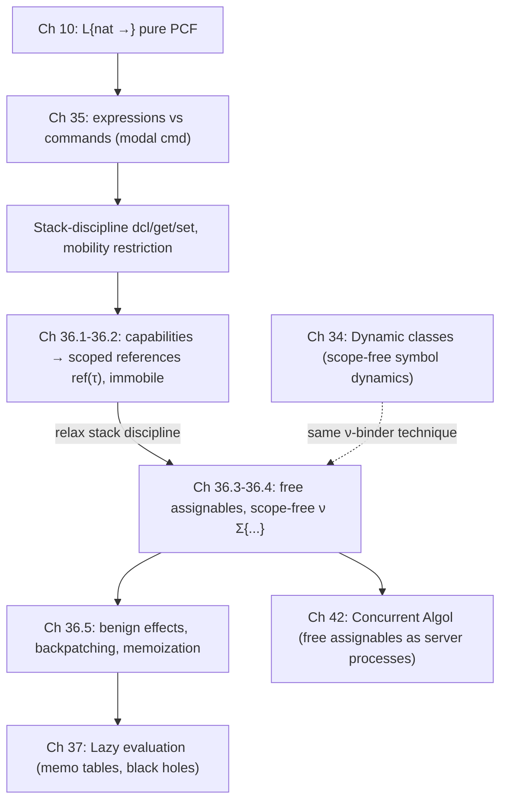

[[book-guidelines|↩ Back to guidelines]]

# State and Assignables

## Why a typed language needs a *modality* for mutation

Every language we've built so far in this book — $\mathcal{L}\{\mathtt{nat}\rightharpoonup\}$, PCF, System F — has one thing in common: evaluating an expression never changes the meaning of another expression sitting next to it. If `e` evaluates to `17`, it will *always* evaluate to `17`, no matter what else runs before or after it. This property — call it *referential transparency* — is what lets us reorder, duplicate, memoize, or run expressions in parallel without thinking twice.

Mutable state breaks this. The moment we introduce something like a variable in C or Python that can be reassigned, `x + x` and `2 * x` stop being interchangeable if evaluating `x` twice might see two different values of some assignable location that changed in between. Harper's response is not to bolt mutation directly onto expressions (which is what most languages do, and why reasoning about C or Java code is hard) but to draw a hard *modal* line: keep two syntactic sorts, **expressions** (pure, unconstrained evaluation order, meaning independent of storage) and **commands** (impure, meaning depends on and can change a memory). This is Modernized Algol, $\mathcal{L}\{\mathtt{nat}\ \mathtt{cmd}\rightharpoonup\}$ — essentially a cleaned-up reformulation of Reynolds's Idealized Algol (1981), and the same idea Haskell later popularized as "the IO monad."

The payoff of the separation: expression evaluation order stays *unconstrained* — you can still substitute equals for equals, evaluate lazily or in parallel, whatever you like — while command execution order is *tightly* constrained, because the whole point of a command is to have an effect that the next command can observe.

## Assignables are not variables

Before touching syntax, Harper insists on a terminological fix that matters more than it looks: what most languages carelessly call a "variable" — a named, mutable memory cell — is *not* a variable in the type-theoretic sense used throughout this book. A **variable** stands for an unspecified value of some type and is given meaning by *substitution* (that's what `\x. x + 1` does when applied). A mutable storage cell is something else entirely, given meaning by *assignment and retrieval*, and Harper reserves a new word for it: an **assignable**.

```rust
// A Rust local `let mut x` conflates two roles that PFPL keeps separate:
let x: i32 = 5;      // binding — this is a *variable*, meaning by substitution
let mut y: i32 = 5;  // storage — this is an *assignable*, meaning by get/set
y = y + 1;            // mutation only makes sense for the assignable
```

Keeping the two ideas apart is exactly the discipline a checker/verifier needs: substitution-based reasoning (β-reduction, definitional equality) applies only to variables; anything claiming a Hoare-triple-style specification over mutable cells needs a *separate* judgment form for assignables, tracked in its own context.

## The syntax: expressions, commands, and the `cmd` modality

$\mathcal{L}\{\mathtt{nat}\ \mathtt{cmd}\rightharpoonup\}$ extends $\mathcal{L}\{\mathtt{nat}\rightharpoonup\}$ (PCF-with-naturals, Chapter 10) with one new expression form and an entire new syntactic sort, **commands**:

$$
\begin{aligned}
\mathrm{Typ}\ \tau &::= \mathtt{cmd} & \mathtt{cmd} &\quad \text{command (encapsulated)} \\
\mathrm{Exp}\ e &::= \mathtt{cmd}(m) & \mathtt{cmd}\ m &\quad \text{encapsulation} \\
\mathrm{Cmd}\ m &::= \mathtt{ret}(e) & \mathtt{ret}\ e &\quad \text{return} \\
 &\mid \mathtt{bnd}(e; x.m) & \mathtt{bnd}\ x \leftarrow e\ ;\ m &\quad \text{sequence} \\
 &\mid \mathtt{dcl}(e; a.m) & \mathtt{dcl}\ a := e\ \mathtt{in}\ m &\quad \text{new assignable} \\
 &\mid \mathtt{get}[a] & \texttt{@}a &\quad \text{fetch} \\
 &\mid \mathtt{set}[a](e) & a := e &\quad \text{assign}
\end{aligned}
$$

Read this as: `cmd(m)` is an expression — a *value* — that packages up an as-yet-unexecuted command; running that command is itself an effect, deferred until something actually asks for it. This is the crucial modal trick: `cmd` is a type whose values are *inert descriptions of effects*, exactly analogous to a Rust closure that captures a mutable reference but hasn't been called yet, or Haskell's `IO a` values.

```rust
// cmd(m) : cmd  ~  a thunk describing an effectful computation, not yet run
struct Cmd<'a> { run: Box<dyn FnOnce(&mut Memory) -> u64 + 'a> }
// executing it ("do e" in PFPL) is the only way to observe/produce effects
```

The five command forms are the whole imperative core:
- `ret(e)` — return the value of a *pure* expression `e`, with no effect on any assignable.
- `bnd(e; x.m)` — evaluate `e` to an encapsulated command, run it, substitute its returned value for `x` in `m`, then run `m`. This is sequential composition *with data flow*.
- `dcl(e; a.m)` — declare a fresh assignable `a`, initialize it to (the value of) `e`, and run `m` in a scope where `a` is available. This is the block-structure mechanism: **assignables come into existence by declaration, scoped exactly like a `let` binding.**
- `get[a]` — fetch the current contents of `a`.
- `set[a](e)` — overwrite `a` with the value of `e`, returning that value.

## Statics: two judgments, and a signature of live assignables

Because there are two syntactic sorts, there are two typing judgments:

1. Expression typing: $\Gamma \vdash_\Sigma e : \tau$
2. Command formation: $\Gamma \vdash_\Sigma m\ \mathsf{ok}$

Both are indexed not just by the variable context $\Gamma$ but by a new context $\Sigma$ — a finite set of *currently declared assignables*. This is the type-theoretic analogue of a stack frame's set of live local mutable cells; it plays exactly the role a borrow-checker's live-region set plays in Rust, or the "store typing" in a Hoare-logic soundness proof.

$$
\dfrac{\Gamma \vdash_\Sigma m\ \mathsf{ok}}{\Gamma \vdash_\Sigma \mathtt{cmd}(m) : \mathtt{cmd}} \qquad (35.1\mathrm{a})
\qquad
\dfrac{\Gamma \vdash_\Sigma e : \mathtt{nat}}{\Gamma \vdash_\Sigma \mathtt{ret}(e)\ \mathsf{ok}} \qquad (35.1\mathrm{b})
$$

$$
\dfrac{\Gamma \vdash_\Sigma e : \mathtt{cmd} \quad \Gamma, x{:}\mathtt{nat} \vdash_\Sigma m\ \mathsf{ok}}{\Gamma \vdash_\Sigma \mathtt{bnd}(e;x.m)\ \mathsf{ok}} \qquad (35.1\mathrm{c})
$$

$$
\dfrac{\Gamma \vdash_\Sigma e : \mathtt{nat} \quad \Gamma \vdash_{\Sigma,a}\ m\ \mathsf{ok}}{\Gamma \vdash_\Sigma \mathtt{dcl}(e;a.m)\ \mathsf{ok}} \qquad (35.1\mathrm{d})
\qquad
\dfrac{}{\Gamma \vdash_{\Sigma,a}\ \mathtt{get}[a]\ \mathsf{ok}} \qquad (35.1\mathrm{e})
\qquad
\dfrac{\Gamma \vdash_{\Sigma,a}\ e : \mathtt{nat}}{\Gamma \vdash_{\Sigma,a}\ \mathtt{set}[a](e)\ \mathsf{ok}} \qquad (35.1\mathrm{f})
$$

Rule (35.1d) is the load-bearing one: the name `a` introduced by `dcl` is *bound*, exactly like a variable bound by $\lambda$, subject to renaming to avoid clashing with names already in $\Sigma$ — Harper is reusing the entire apparatus of binding and $\alpha$-equivalence from Chapter 1 for assignable names, not just variable names. `get[a]` and `set[a](e)` are only well-formed when `a` is present in $\Sigma$ — you cannot even *write down* a command that references an out-of-scope assignable; this is the static enforcement of block structure, before we even get to the [[Exceptions#Dynamics|dynamics]].

## Dynamics: memory as a finite function, states as `m ∥ μ`

The dynamics tracks a **memory** $\mu$, a finite function from assignables to numerals — literally a small heap, but one whose *domain* is exactly the assignables currently in scope. A machine state pairs a command with a memory: $m \Vert \mu$. Two judgments govern such states, mirroring the value/step judgments for expressions:

1. $m \Vert \mu\ \mathsf{final}_\Sigma$ — the state is fully executed.
2. $m \Vert \mu \xrightarrow{\ }_\Sigma m' \Vert \mu'$ — the state steps.

The get/set rules are where the memory actually gets touched:

$$
\mathtt{get}[a] \Vert \mu \otimes a \mapsto e \xrightarrow{\ }_{\Sigma,a} \mathtt{ret}(e) \Vert \mu \otimes a \mapsto e \qquad (35.3\mathrm{f})
$$

$$
\dfrac{e\ \mathsf{val}_\Sigma}{\mathtt{set}[a](e) \Vert \mu \otimes a \mapsto {}_{-} \xrightarrow{\ }_{\Sigma,a} \mathtt{ret}(e) \Vert \mu \otimes a \mapsto e} \qquad (35.3\mathrm{h})
$$

And the declaration rules make the stack discipline completely explicit — allocation on entry, deallocation on exit:

$$
\dfrac{e\ \mathsf{val}_\Sigma \quad m \Vert \mu \otimes a\mapsto e \xrightarrow{\ }_{\Sigma,a} m' \Vert \mu' \otimes a \mapsto e'}
{\mathtt{dcl}(e;a.m) \Vert \mu \xrightarrow{\ }_\Sigma \mathtt{dcl}(e';a.m') \Vert \mu'} \qquad (35.3\mathrm{j})
$$

$$
\dfrac{e\ \mathsf{val}_\Sigma \quad e'\ \mathsf{val}_{\Sigma,a}}{\mathtt{dcl}(e;a.\mathtt{ret}(e')) \Vert \mu \xrightarrow{\ }_\Sigma \mathtt{ret}(e') \Vert \mu} \qquad (35.3\mathrm{k})
$$

Rule (35.3k) is the moment of deallocation: once the body of the declaration is fully reduced to `ret(e')`, the assignable `a` simply *disappears* — it's absent from the resulting state, memory and all. Because these two rules are structurally recursive on scope, **the dynamic lifetime of an assignable is provably nested exactly like its static scope** — assignables behave like values on a call stack, not like heap-allocated objects. This is precisely the discipline a Rust `&mut T` local borrow enjoys by construction; PFPL is deriving that stack discipline from first principles as a *theorem*, not assuming it as a language design axiom.

```rust
fn stack_discipline_example() -> u64 {
    let mut a: u64 = 0;      // dcl a := 0 in ...
    a = a + 1;                // set[a](get[a] + 1)
    a                          // ret(@a); `a` deallocated on return
}
```

### Safety

Well-formed states are those where the memory conforms to the signature — $\mu : \Sigma$ requires every $a \in \Sigma$ to map to a numeral value of the appropriate type:

$$
\dfrac{\forall a \in \Sigma\ \exists e.\ \mu(a) = e\ \text{and}\ e\ \mathsf{val}_\emptyset\ \text{and}\ \vdash_\emptyset e : \mathtt{nat}}{\mu : \Sigma} \qquad (35.5)
$$

Preservation and progress (Theorems 35.1–35.2) go through by straightforward simultaneous induction on the typing/dynamics rules — the interesting case is exactly (35.3j)/(35.3k), where extending $\Sigma$ with a fresh assignable and later retracting it must leave both the command and the memory well-typed at each stage.

## Programming idioms: the imperative core, derived

With just five primitives, Harper derives the rest of familiar imperative programming as *notation*, not new primitives — a nice illustration that "while loops" and "sequencing" aren't fundamental, they're sugar over `bnd`, `dcl`, and general recursion:

- **Sequencing**: $\{x \leftarrow m_1; m_2\} := \mathtt{bnd}\ x \leftarrow \mathtt{cmd}(m_1)\ ; m_2$, generalizing to $n$-ary chains, and $\{m_1;m_2\}$ when the returned value is discarded.
- **do**: `do e` runs an encapsulated command and returns its result: `bnd x ← e ; ret x`.
- **if**: `if (m) m1 else m2` dispatches on whether `m` returns zero, via `ifz`.
- **while**: `while (m1) m2` is built from `fix` — a *self-referential encapsulated command* that re-invokes itself via `do loop` — showing that looping is just guarded recursion at the command level, no new construct needed.
- **procedures**: a procedure is a function `τ → cmd`, i.e. `proc (x:τ) m` abbreviating `λ(x:τ) cmd m`; a call is `call e1(e2) := do (e1(e2))`.

The book's worked example — imperative factorial with an explicit loop invariant ("`r` holds $x! / a$ at each iteration") — is a genuinely nice small piece of Hoare-style reasoning done informally, foreshadowing what a real verifier needs to automate:

```
proc (x:nat) {
  dcl r := 1 in
  dcl a := x in
  { while (@a) {
      y ← @r ; z ← @a ; r := (x-z+1) × y ; a := z-1
    }
  ; @r }
}
```

## The mobility restriction: why `nat`-only was not an arbitrary limitation

So far, returned values and assignable contents were restricted to `nat`. Section 35.3 asks: can we lift that restriction to arbitrary types? The answer is a firm *not without a side condition*, and the two counterexamples Harper gives are the crux of the whole chapter.

**Counterexample 1 — returning a value that closes over a dying assignable:**

```
dcl a := z in {ret (proc (x:nat) {a := x})}
```

This declares `a`, then returns a procedure that assigns into `a` when called — but `a` is deallocated the instant the `dcl` body returns (by rule 35.3k). Call the returned procedure later and execution gets *stuck*: it tries to `set[a]` an assignable that no longer exists. [[Type-Safety|Type safety]] would be violated.

**Counterexample 2 — storing a value that closes over a local assignable into a longer-lived assignable:**

```
dcl a := z in {b := proc (x:nat) {a := x} ; ret z}
```

Same failure mode, routed through `b` instead of the return value.

Both examples are Rust's classic "cannot return value referencing local variable" or "borrowed value does not live long enough" errors, arising from first principles rather than from a borrow checker's syntax:

```rust
fn broken<'a>() -> Box<dyn FnMut(u64) + 'a> {
    let mut a: u64 = 0;
    Box::new(move |x| { a = x; })  // closes over `a`... but `a`'s stack slot ends here
}
// (Rust actually rejects this via lifetime inference — PFPL's mobility
// condition is doing, statically, exactly the job Rust's borrow checker does.)
```

The fix: generalize $\Sigma$ to track a *type* for each assignable ($a \sim \tau$), generalize `cmd` to `cmd(τ)` (the type of encapsulated commands returning a $\tau$), and require, in exactly the two dangerous spots (return, and assignable-content), that the type in question be **mobile**:

$$
\dfrac{\Gamma \vdash_\Sigma e : \tau \quad \tau\ \mathsf{mobile}}{\Gamma \vdash_\Sigma \mathtt{ret}(e) \sim \tau} \qquad (35.6\mathrm{b})
\qquad
\dfrac{\Gamma \vdash_\Sigma e : \tau \quad \tau\ \mathsf{mobile} \quad \Gamma \vdash_{\Sigma,a\sim\tau} m \sim \tau'}{\Gamma \vdash_\Sigma \mathtt{dcl}(e;a.m) \sim \tau'} \qquad (35.6\mathrm{d})
$$

The **mobility condition** that defines the judgment $\tau\ \mathsf{mobile}$:

$$
\text{if}\ \tau\ \mathsf{mobile},\ \vdash_\Sigma e : \tau,\ \text{and}\ e\ \mathsf{val}_\Sigma,\ \text{then}\ \vdash_\emptyset e : \tau\ \text{and}\ e\ \mathsf{val}_\emptyset. \qquad (35.7)
$$

In words: **a value of mobile type never actually depends on any currently-active assignable, even syntactically.** `nat` is mobile (35.8) because the successor is evaluated *eagerly* — a closed numeral never contains an unevaluated subexpression referencing `a`. Products and sums of mobile types are mobile *only if pairing/injection is eager* (35.9, 35.10) — laziness defeats mobility, because a suspended computation is a value that can silently smuggle a dependency on `a` inside it. Procedure types are never mobile, because a procedure body can freely mention assignables from its defining scope, which is exactly the failure mode of both counterexamples.

This is a genuinely subtle point worth dwelling on: mobility is a *purely syntactic, conservative* over-approximation. Harper gives a value of type `nat → nat` that is semantically independent of any assignable —

$$
\lambda(x{:}\mathtt{nat})\ (\lambda(\_{:}\mathtt{cmd})\ z)(\mathtt{cmd}\{\texttt{@}a\})
$$

— yet is *not* safe to deem mobile, because the assignable `a` syntactically occurs inside the value even though it's never actually forced. This is exactly the gap between a sound-but-incomplete static check and full semantic correctness — the same gap a Rust borrow checker lives in (rejecting some memory-safe programs it can't prove safe), and the same gap an implicit-argument elaborator's occurs-check lives in when it conservatively rejects a metavariable instantiation it can't prove acyclic.

```lean
-- The mobility judgment τ mobile is a *type-indexed admissibility predicate* —
-- structurally very close to deciding "is this Lean term closed under this
-- local context," the same shape of question an elaborator's occurs-check
-- or dependency-tracking asks when generalizing a metavariable.
```

## Chapter 36: references — naming an assignable as a first-class value

A **reference** to an assignable `a`, written `&a`, is a *value* of type `ref(τ)` that names `a`. Where a bare `get[a]`/`set[a](e)` command hard-codes *which* assignable it touches (statically, in the program text), a reference lets that choice be made dynamically — passed as an argument, stored, compared.

### From ad-hoc capabilities to a proper reference type

Harper motivates references by first showing the *wrong* solution. Suppose you want a generic "double the contents" procedure that works for any assignable. One approach: pass a **capability** — a pair of a getter command and a setter procedure:

$$
\tau\ \mathtt{cmd} \times (\tau \rightharpoonup \tau\ \mathtt{cmd})
$$

$$
\langle \mathtt{cmd}(\texttt{@}a),\ \mathtt{proc}(x{:}\tau)\ a := x\rangle
$$

This works, but nothing in the type system prevents *mismatched* pairs — the getter for `a` accidentally paired with the setter for `b`. That's a real bug class (think: a struct with a raw get-pointer and set-pointer pair that could point at different objects). References close this hole by making "the same assignable" a *single first-class value* rather than two separately-passed closures:

$$
\begin{aligned}
\mathrm{Typ}\ \tau &::= \mathtt{ref}(\tau) & \tau\ \mathtt{ref} \\
\mathrm{Exp}\ e &::= \mathtt{ref}[a] & \&a \\
\mathrm{Cmd}\ m &::= \mathtt{getref}(e) & {*}e \\
 &\mid \mathtt{setref}(e_1;e_2) & e_1 := e_2
\end{aligned}
$$

$$
\dfrac{}{\Gamma \vdash_{\Sigma,a\sim\tau}\ \mathtt{ref}[a] : \mathtt{ref}(\tau)} \qquad (36.1\mathrm{a})
$$

The dynamics simply defers to the underlying `get[a]`/`set[a]` once the reference is resolved to a name — a reference doesn't change *what* mutation means, only *how* the target assignable is selected:

$$
\mathtt{getref}(\mathtt{ref}[a]) \Vert \mu \xrightarrow{\ }_\Sigma \mathtt{get}[a] \Vert \mu \qquad (36.2\mathrm{c})
$$

```rust
// nat ref  ~  &'a mut Cell<u64>  (a name for a specific storage location)
fn double(r: &Cell<u64>) -> u64 {
    let x = r.get();
    r.set(x + x);
    x
}
```

Because `ref(τ)` bundles get-and-set access to a *specific* assignable, `ref(τ)` is **immobile** — like `cmd(τ)` and procedure types, references cannot be returned from a command or stored in an assignable under the scoped discipline, for exactly the same reason as before: doing so would let a reference outlive the assignable it names, breaking the stack.

### Aliasing and interference — the price of sharing a name

Two references naming the *same* underlying assignable are **aliases**. This single word is the root of most of the notorious difficulty in reasoning about imperative, reference-heavy code — and Harper gives the canonical minimal example. Compare:

```
λ(x:nat ref) λ(y:nat ref) cmd { x' ← *x ; y' ← *y ; x := x' + y' + y' }
```

— safe under aliasing, because both reads happen *before* any write — versus:

```
λ(x:nat ref) λ(y:nat ref) cmd { x += y ; x += y }
   where x += y := { x' ← *x ; y' ← *y ; x := x' + y' }
```

If `x` and `y` are aliases of the same cell `a` with contents $n$, the *first* implementation still correctly computes $n + 2n = 3n$ (all reads precede the write). The *second* — despite looking "equivalent" — computes $4n$: the second `x += y` reads `y`'s contents *after* the first `+=` already mutated it (because `x` and `y` are the same cell). The bug isn't in fixing the code once found; it's in *noticing* the aliasing possibility at all, and the number of pairs to check grows quadratically in the number of live references.

```rust
// Rust's aliasing rule ("&mut is exclusive, or many &T shared") is a
// *static, structural* solution to precisely this problem: it makes it a
// borrow-check error to even construct the two-references-to-one-cell
// situation PFPL's example relies on, rather than requiring the programmer
// to reason about it by hand at every call site.
fn plus_equals(x: &Cell<u64>, y: &Cell<u64>) {
    x.set(x.get() + y.get());
}
// plus_equals(&a, &a) is legal Rust (Cell permits aliasing!) and reproduces
// exactly PFPL's interference bug — Cell deliberately opts out of the
// exclusivity guarantee, which is precisely why this example still bites.
```

This is a direct, concrete instance of the "substitution and context management" thread this reading list keeps tracking: once aliasing is possible, *[[Equational-Reasoning|equational reasoning]]* about commands (treating `x += y` as compositional, substitutable code) silently breaks, because two syntactically distinct names can denote one semantic location. Any Hoare-triple-style verifier over a reference-based language has to carry aliasing information (a "points-to" or separation-logic-style context) precisely because the naive substitution-based reasoning this book relies on everywhere else stops being sound here.

## Free assignables: escaping the stack

Scoped references are safe but weak — because `ref(τ)` is immobile, you can never build a data structure that *contains* a reference internally, which rules out linked lists, trees with parent pointers, or any cyclic structure. To regain that expressiveness, Section 36.3 relaxes the stack discipline entirely: assignables become **free** (scope-free) — their lifetime extends indefinitely past the scope of their declaration, and *every* type, including `ref(τ)`, may now be deemed mobile.

The dynamics changes shape to reflect that allocation persists across transitions — states now carry their own live signature explicitly:

$$
\nu\Sigma\{m \Vert \mu\} \mapsto \nu\Sigma'\{m' \Vert \mu'\}
$$

Declaration now *extends* $\Sigma$ permanently rather than opening and closing a nested scope:

$$
\dfrac{e\ \mathsf{val}_\Sigma}{\nu\Sigma\{\mathtt{dcl}(e;a.m) \Vert \mu\} \mapsto \nu\Sigma,a{\sim}\tau\{m \Vert \mu \otimes a \mapsto e\}} \qquad (36.3\mathrm{j})
$$

— notice there is no longer a companion rule retracting $\Sigma$ back down when the body finishes (compare to 35.3k, which is now simply gone). The natural primitive built on this is `newref`:

$$
\mathtt{newref}[\tau](e) := \mathtt{dcl}\ a := e\ \mathtt{in}\ \mathtt{ret}(\&a) \qquad (36.5)
$$

allocate a fresh cell, return a reference to it, and let it outlive the allocating command entirely — this is `Box::new` / `Rc::new`, or Lean's/OCaml's `ref`, in its purest form. Often `newref` is taken as the *only* primitive, with no exposed `dcl` at all, so every assignable is accessed exclusively through a reference — this is essentially how every mainstream language with a heap actually presents mutable cells to the programmer.

```rust
// newref[τ](e)  ~
fn new_ref<T>(v: T) -> Rc<RefCell<T>> { Rc::new(RefCell::new(v)) }
// the returned Rc<RefCell<T>> can freely escape its allocating scope,
// exactly the capability scoped `ref(τ)` denied.
```

### Safety with cycles: why free assignables are genuinely trickier

Once assignables can outlive their scope, they can also refer to *themselves*, directly or through a chain — a procedure stored in `a` might, when called, fetch `a` again and recurse through it. Harper's example:

```
proc (x:nat) { if (x) ret(1) else { f ← @a ; y ← f(x-1) ; ret (x*y) } }
```

stored precisely into the assignable `a` it reads from — self-reference via the store, not via `fix`. The well-formedness judgment for memories has to change accordingly: instead of requiring each cell's contents to be *closed* (well-typed with no live assignables at all, as in the scoped case), it now only requires each cell's contents to be well-typed *relative to the whole signature $\Sigma$*, cycles and all:

$$
\dfrac{\forall a\sim\rho \in \Sigma\ \exists e.\ \mu(a) = e\ \text{and}\ \vdash_{\Sigma'} e : \rho}{\vdash_{\Sigma'} \mu : \Sigma} \qquad (36.9)
$$

This is precisely the same move as typing mutually-recursive definitions or a recursive type's unrolling: well-formedness becomes *co-inductive/self-referential* rather than well-founded, which is why Harper calls the [[Dynamic-Classification#Safety|safety]] proof here "surprisingly tricky" relative to the scoped case — preservation (Thm 36.1) must show $\Sigma$ only ever *grows*, and that growth stays consistent with (36.9) at every step.

## Benign effects: when mutation stays invisible from outside

The strict expression/command separation is powerful, but it has a real cost: it rules out using mutation *internally* to implement something that is, from the outside, a pure function. Two motivating examples the book flags explicitly:
- **Memoization in a lazy language** (previewing Chapter 37): a suspended computation behaves identically whether or not its result has been cached; the cache itself is implemented with an assignable.
- **Self-adjusting data structures**, e.g. splay trees: mutation rebalances the tree on every access, but the tree's *observable* behavior (what `lookup` returns) is purely functional.

These are **benign effects** — state used only to improve performance, invisible at the specification level. The modal `cmd` type system as given cannot express them, because a memoized *expression* would need to have an effect, and expressions are defined to be effect-free by construction. Harper's fix is not another ad-hoc escape hatch but the most general move available: collapse expressions and commands into **one** syntactic category, $\mathcal{L}\{\mathtt{nat}\ \mathtt{ref}\rightharpoonup\}$. The price is that the type system no longer *guarantees* purity — any expression might secretly touch the store — but the benefit is that natural idioms like **backpatching** become expressible:

```
dcl a := λn:nat.0 in
  { f ← a := λn:nat.ifz(n, 1, n'.n×(@a)(n'))
  ; ret(f) }
```

This builds a self-referential factorial by allocating a placeholder function, defining the "real" function so that its recursive call *fetches itself back out of the assignable*, storing that function into the assignable, and returning it — recursion implemented via state instead of via `fix`, entirely invisible from the caller's perspective (`f` is just `nat → nat`). Harper is explicit that this is impossible in the strict-modality language: you'd have to route the assignment through a command, at which point the "pure" function type is contaminated with `cmd`, exposing exactly the implementation detail benign effects are meant to hide.

## Where this leads



This chapter's $\nu\Sigma\{\cdot\}$ scope-free dynamics is the *same mechanism*, applied to storage locations, that Chapter 34 used for dynamically-generated symbols ([[Dynamic-Classification|dynamic classification]]) — both are instances of "allocate a fresh name whose lifetime the static scope discipline can no longer bound." That technique resurfaces almost immediately: Chapter 37's lazy evaluation is literally built on assignable-like memo cells (a "black hole" state playing the role of an in-progress assignment), and Chapter 42 shows free assignables themselves can be *encoded* as server processes in a process calculus — state, in the end, is just a particular pattern of self-referential, persistent naming.

For the standing project threads: the **mobility condition** (35.7) is a clean worked example of a *conservative, syntactic* soundness check that is incomplete-but-sound — structurally the same shape as an occurs-check or a borrow-checker's escape analysis, worth remembering when designing the Rust verifier's own treatment of "can this value legally leave scope." The **aliasing/interference** material in 36.2 is the sharpest illustration in the book so far of why a Hoare-triple soundness proof over a reference-based language needs an explicit points-to/separation discipline: substitution-based equational reasoning, which underwrites nearly every proof technique used up to this point, silently fails the moment two names can denote one location. And the **self-referential well-formedness judgment** for free-assignable memories (36.9) is a direct analogue of typing recursive/cyclic structures — the same "well-formed relative to the whole, not built up from nothing" pattern that recurs in [[Recursive-Types|recursive types]] (Ch. 16) and will recur again in the memo tables of Chapter 37.
