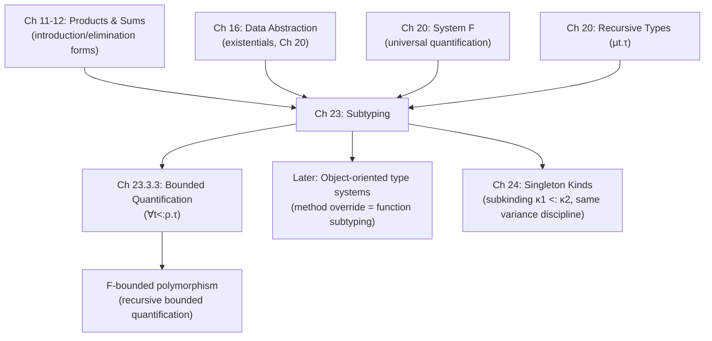

# Subtyping

[[book-guidelines|↩ Back to guidelines]]

## Why a subtype relation at all

Every type system you've worked with draws a hard line: a value either has a type or it doesn't. That's exactly what makes type checking useful — it's what lets a compiler reject `add(true, "x")` before it ever runs. But that hard line is also frustratingly rigid. If a function expects an argument of type $\tau$, and you happen to have a value of some *more specific* type $\tau'$ that would work perfectly well in every context that expects $\tau$, a strict type checker still forces you to convert it explicitly, even though nothing was ever actually at risk.

Subtyping is the mechanism that relaxes this without giving up [[Dynamic-Classification#Safety|safety]]. Harper defines it as a relation on types, written $\tau' <: \tau$ ("$\tau'$ is a subtype of $\tau$"), that is a *preorder* (reflexive and transitive) and validates the **subsumption principle**:

> if $\tau'$ is a subtype of $\tau$, then a value of type $\tau'$ may be provided whenever a value of type $\tau$ is required.

This is the entire idea in one sentence. Everything else in the chapter — variance, bounded quantification, the recursive-type subtlety — is about figuring out *which* relations $\tau' <: \tau$ are actually safe to admit.

**[[Exceptions#What breaks without it|What breaks without it]].** Without subsumption, every type mismatch, even a harmless one, requires an explicit coercion function threaded through the program by hand. In a Rust analogy: without any form of subtyping, you'd need an explicit `.into()` at every call site where a `&mut T` is used where a `&T` would do, or where a concrete `struct Circle` is passed where any `Shape`-like thing is expected — even though the compiler could, in principle, see that it's always safe.

## The wrong intuition, and the right test

Before the formal rules, Harper flags a trap explicitly, because it's the single most common way people get subtyping wrong: **do not think of subtyping as "every value of $\tau'$ is also a value of $\tau$"**, i.e. don't think of types as sets and subtyping as set containment. That intuition only accounts for *introduction* forms (how values of a type get built) and silently ignores *elimination* forms (what a context is allowed to do with a value once it has it).

The correct test, which the book calls the "principle of introduction and elimination," is: **a subtyping relationship $\tau' <: \tau$ is sound exactly when every value introduced at type $\tau'$ can be safely handled by every eliminatory operation that $\tau$ permits.** Subtyping is a statement about *behavior under the supertype's operations*, not about set containment.

This distinction is the thread that runs through the entire chapter — width/depth subtyping on products and sums, the contravariance of function domains, and the failure of the naive recursive-type rule are all just this one principle worked out for different type constructors.

```rust
// A concrete failure of the "subtyping = subset" intuition:
// every f64 "looks like" it could stand in for an f32 (same shape,
// more precision) but f64 -> f32 truncates, and code that pattern-matches
// on the eliminator (bit width, in this analogy) can observe the difference.
// Subtyping has to reason about what the *eliminator* can do, not just
// what values "are".
```

## 23.1 Subsumption: the formal judgment

The subtyping judgment $\tau' <: \tau$ obeys two structural rules, which any concrete subtyping relation must at least admit (either as primitives or as derived facts):

$$
\dfrac{}{\tau <: \tau} \qquad (23.1a)
$$

$$
\dfrac{\tau'' <: \tau' \quad \tau' <: \tau}{\tau'' <: \tau} \qquad (23.1b)
$$

Reflexivity and transitivity — exactly what "preorder" means. The actual work is done by the **subsumption rule**, which is the sole mechanism connecting the subtyping judgment to [[Statics-And-Dynamics#The typing judgment|the typing judgment]]:

$$
\dfrac{\Gamma \vdash e : \tau' \quad \tau' <: \tau}{\Gamma \vdash e : \tau} \qquad (23.2)
$$

Harper stresses something important about this rule's shape: it is the *only* typing rule that is not syntax-directed. Every other typing rule is keyed to the syntactic form of `e` (if `e` is a pair, use the pair-introduction rule; if it's a lambda, use the lambda rule; etc.). Subsumption applies to *any* expression `e` of *any* form — you can invoke it at any point in a typing derivation, as long as you can exhibit some $\tau'$ with $e : \tau'$ and $\tau' <: \tau$.

This is worth internalizing if you're thinking about implementing a type checker: subsumption breaks the nice property that "the syntax of the term determines which rule applies," which is exactly the property that makes naive bidirectional or syntax-directed type checking easy. A real subtyping-aware checker has to insert subsumption at controlled points (usually: check mode, at the boundary between synthesized and expected types) rather than nondeterministically anywhere — this is precisely the practical concern that motivates **bidirectional typing** (inference/synthesis mode vs. checking mode), a theme worth carrying forward from earlier chapters. Concretely, a checker typically synthesizes a type for `e`, then calls a *subtype-check* between the synthesized type and the expected type at the one place a checking judgment meets a synthesized one — rather than trying subsumption everywhere.

```rust
// Sketch of where subsumption actually gets invoked in a bidirectional checker:
// NOT "try subsumption at every node" (that's the non-syntax-directed rule,
// taken too literally) but "synthesize, then subtype-check against what's expected."
fn check(ctx: &Ctx, e: &Expr, expected: &Type) -> Result<(), TypeError> {
    let synthesized = synthesize(ctx, e)?;
    is_subtype(&synthesized, expected)  // <-- subsumption, applied exactly once
}
```

## 23.2 Varieties of subtyping

### Numeric types — a cautionary example

It's tempting to postulate `int <: rat <: real` by analogy with $\mathbb{Z} \subseteq \mathbb{Q} \subseteq \mathbb{R}$. Harper's point here is a warning, not a rule: even in mathematics this containment is only true up to an isomorphic embedding (a rational is really a pair $(m,n)$ with $\gcd(m,n)=1$; an integer $n$ embeds as $n/1$). For *computing*, it's worse — "real" usually means finite-precision floating point, a small, non-closed subset of the rationals, and floating-point arithmetic doesn't even restrict correctly to rational arithmetic. The moral: whether a subtyping relationship is sound is always a question about the actual *representations and operations* involved, never an appeal to informal set analogy. This is the numeric-type instance of the introduction/elimination test: the "eliminators" here are the arithmetic operations, and they don't commute with the embedding cleanly.

### Product types — width subtyping

Consider a context expecting $\tau = \langle \tau_j \rangle_{j \in J}$ (Harper's finite-product notation — a labeled tuple indexed by a finite set $J$). The only elimination form for a product is projection, $e \cdot j$. So if we're handed a value $e$ of some *other* product type $\tau' = \langle \tau_i' \rangle_{i \in I}$, all that's needed for every legal operation on $\tau$ to still work is: every label $j \in J$ that could be projected out of $\tau$ must also be present in $\tau'$ (so $J \subseteq I$), with matching component type. This gives:

$$
\dfrac{J \subseteq I}{\prod_{i \in I} \tau_i <: \prod_{j \in J} \tau_j} \qquad (23.3)
$$

This is **width subtyping**: a *bigger* record (more fields) is a subtype of a *smaller* one (fewer fields) — you can always use a wider record wherever a narrower one is expected, because the eliminator only cares about the fields it actually asks for.

```rust
// Width subtyping, structurally, is what you get for free with
// row-polymorphic / structural records. Rust's nominal structs don't have
// this natively, but the *shape* is:
struct Wide { x: i32, y: i32, label: String } // <: below, ignoring `label`
struct Narrow { x: i32, y: i32 }
// Any context that only ever does `.x` / `.y` projections on a `Narrow`
// could safely accept a `Wide` instead -- that's exactly rule (23.3).
```

### Sum types — the containment reverses

By the dual argument: if a context expects $\sum_{j \in J} \tau_j$, the only nontrivial elimination form is a $J$-indexed case analysis (pattern match covering every tag in $J$). A value of $\sum_{i \in I} \tau_i'$ is safe to hand over provided every tag it could actually carry is one the case analysis is prepared to handle — i.e. $I \subseteq J$:

$$
\dfrac{I \subseteq J}{\sum_{i \in I} \tau_i <: \sum_{j \in J} \tau_j} \qquad (23.4)
$$

Note well: for products the *super*type has the *smaller* index set ($J \subseteq I$), while for sums the *sub*type has the *smaller* index set ($I \subseteq J$). This reversal is exactly what the introduction/elimination test predicts once you notice that a product's eliminator (projection) *removes* choice while a sum's eliminator (case analysis) *must handle* every choice.

```rust
// Sum-type subtyping in the Rust-enum picture: an enum with FEWER
// variants is a subtype of one with MORE variants, because a match
// arm-set covering the superset of tags can safely handle a value that
// only ever carries a subset of them.
enum Small { A(i32), B(bool) }        // <: below
enum Big   { A(i32), B(bool), C(String) }
// Any `match` exhaustively covering Big::{A,B,C} can safely accept
// a Small value that's only ever A or B -- rule (23.4).
```

## 23.3 Variance

With the base cases established, Harper generalizes: how does subtyping interact with type *constructors* — given $\tau' <: \tau$, what can we say about $F(\tau')$ vs $F(\tau)$ for some constructor $F$?

- **Covariant**: subtyping is *preserved* — $\tau' <: \tau \implies F(\tau') <: F(\tau)$.
- **Contravariant**: subtyping is *reversed* — $\tau' <: \tau \implies F(\tau) <: F(\tau')$.
- **Invariant**: neither direction holds in general.

### Products and sums are covariant fieldwise

Beyond width subtyping, both products and sums admit **depth subtyping** — subtyping *within* corresponding fields, holding the index set fixed:

$$
\dfrac{(\forall i \in I)\ \tau_i' <: \tau_i}{\prod_{i \in I} \tau_i' <: \prod_{i \in I} \tau_i} \qquad (23.5)
$$

$$
\dfrac{(\forall i \in I)\ \tau_i' <: \tau_i}{\sum_{i \in I} \tau_i' <: \sum_{i \in I} \tau_i} \qquad (23.6)
$$

Both constructors are covariant in every component. For products this is because a projection at $\tau_j'$ still delivers something usable wherever $\tau_j$ was expected. For sums it's because each branch of a case analysis on the supertype expects something of the corresponding summand type, and a subtype value suffices.

Width and depth subtyping combine freely: you can simultaneously drop fields and narrow the types of the fields you keep.

### Function types: covariant in range, contravariant in domain — and why

This is the conceptual center of the chapter, and the place where the introduction/elimination discipline earns its keep by producing a genuinely counterintuitive result.

**Range (covariant).** If $e : \tau_1 \to \tau_2'$, then applying $e$ to any $e_1 : \tau_1$ yields $e(e_1) : \tau_2'$. If $\tau_2' <: \tau_2$, then by subsumption $e(e_1) : \tau_2$ too. So:

$$
\dfrac{\tau_2' <: \tau_2}{\tau_1 \to \tau_2' <: \tau_1 \to \tau_2} \qquad (23.7)
$$

A function that promises to return *something more specific* can always stand in for one that only promises the general type — the caller can't tell the difference, and subsumption absorbs the gap. This matches every intuition you already have about return-type covariance (it's why overriding a method to return a more specific type is normally fine).

**Domain (contravariant — this is the surprising one).** Suppose $e : \tau_1 \to \tau_2$. This means $e$ accepts *any* $\tau_1$ and returns a $\tau_2$. Now, by subsumption, $e$ can equally well be applied to any value of a *subtype* $\tau_1'$ of $\tau_1$ (a $\tau_1'$-value is always usable wherever a $\tau_1$ is expected) and it will still deliver a $\tau_2$. So $e$ can just as well be regarded as having the *more permissive-looking domain* type $\tau_1' \to \tau_2$:

$$
\dfrac{\tau_1' <: \tau_1}{\tau_1 \to \tau_2 <: \tau_1' \to \tau_2} \qquad (23.8)
$$

Read the direction carefully: the *premise* has $\tau_1' <: \tau_1$, but the *conclusion* has the arrow types in the opposite order — $\tau_1 \to \tau_2$ is a subtype of $\tau_1' \to \tau_2$, not the other way around. **What breaks if you get this backwards**: if you (incorrectly) made the domain covariant, you could take a function accepting `Animal` and claim it's a subtype of a function accepting only `Dog`. Calling that "narrower-domain" function with a `Cat` would then be permitted by its supposed type but would blow up inside the original function, which never promised to handle `Cat`. Contravariance is precisely what prevents this: a function is a safe substitute for another only if it accepts *at least as much* as required, i.e. its domain is a *supertype* of what's required, and its range delivers *at least as little as promised as extra*, i.e. its range is a *subtype* of what's promised.

Combining both gives the general function-subtyping rule:

$$
\dfrac{\tau_1' <: \tau_1 \quad \tau_2' <: \tau_2}{\tau_1 \to \tau_2' <: \tau_1' \to \tau_2} \qquad (23.9)
$$

Domain reversed, range preserved — "contravariant in the domain, covariant in the range" is the standard slogan, and this rule is its precise statement.

```rust
// Contravariance in Rust terms: a callback that accepts a *wider* type
// (Animal) is safe to use wherever a callback accepting a *narrower* type
// (Dog) is expected -- NOT the reverse.
trait Animal {}
struct Dog;
impl Animal for Dog {}

fn handles_any_animal(_: &dyn Animal) {}
fn takes_a_dog_handler<F: Fn(&Dog)>(f: F) { f(&Dog); }

// A handler for `&dyn Animal` can be supplied wherever a handler for
// `&Dog` is required -- this is exactly rule (23.8) read as code.
// (Rust's actual subtyping is mostly about lifetimes, not this kind of
// nominal domain subtyping, but the *variance direction* is the same
// idea Rust encodes with PhantomData<fn(T) -> ()> for contravariant
// markers.)
```

```python
# A dynamically-typed sketch of the same principle, since Python lets us
# be sloppy about the type discipline and focus purely on the direction:
def apply_to_dog(handler):
    return handler("a dog value")

def handles_any_animal(x):   # accepts MORE than strictly necessary
    return f"handled: {x}"

apply_to_dog(handles_any_animal)  # fine: wider-domain handler substitutes safely
```

### Quantified types

Extending subtyping to $\forall$ and $\exists$ needs a judgment relative to a context of type variables, $\Delta \vdash \tau' <: \tau$ (read: $\tau'$ is a subtype of $\tau$, uniformly in the type variables declared in $\Delta$). Both quantifiers turn out to be **covariant in the quantified body**:

$$
\dfrac{\Delta, t\ \mathsf{type} \vdash \tau' <: \tau}{\Delta \vdash \forall(t.\tau') <: \forall(t.\tau)} \qquad (23.10a)
\qquad
\dfrac{\Delta, t\ \mathsf{type} \vdash \tau' <: \tau}{\Delta \vdash \exists(t.\tau') <: \exists(t.\tau)} \qquad (23.10b)
$$

This licenses a substitution principle:

> **Lemma 23.1.** If $\Delta, t\ \mathsf{type} \vdash \tau' <: \tau$ and $\Delta \vdash \rho\ \mathsf{type}$, then $\Delta \vdash [\rho/t]\tau' <: [\rho/t]\tau$.
> *Proof.* By induction on the subtyping derivation.

The intuition for $\exists$ (existential/data-abstraction packages, from earlier chapters): a package of the subtype $\exists(t.\tau')$ consists of a representation type $\rho$ and an implementation $e : [\rho/t]\tau'$. If $t\ \mathsf{type} \vdash \tau' <: \tau$, substitution gives $[\rho/t]\tau' <: [\rho/t]\tau$, so $e$ is *also* a valid implementation at $[\rho/t]\tau$ — hence the package is a package of the supertype too.

**Bounded quantification.** The natural next step is to let a quantifier range not over *all* types, but over all *subtypes of a specified bound*, written $t <: \rho$ as a hypothesis. This is exactly the mechanism behind Java/Scala-style `<T extends Bound>` or `where T: Trait` idioms, formalized:

$$
\dfrac{}{\Delta, t\ \mathsf{type}, t <: \tau \vdash t <: \tau} \qquad (23.11a)
\qquad
\dfrac{\Delta \vdash \tau :: \mathsf{T}}{\Delta \vdash \tau <: \tau} \qquad (23.11b)
$$

$$
\dfrac{\Delta \vdash \tau'' <: \tau' \quad \Delta \vdash \tau' <: \tau}{\Delta \vdash \tau'' <: \tau} \qquad (23.11c)
$$

$$
\dfrac{\Delta \vdash \rho' <: \rho \quad \Delta, t\ \mathsf{type}, t <: \rho' \vdash \tau' <: \tau}{\Delta \vdash \forall\, t <: \rho.\, \tau' <: \forall\, t <: \rho'.\, \tau} \qquad (23.11d)
$$

$$
\dfrac{\Delta \vdash \rho' <: \rho \quad \Delta, t\ \mathsf{type}, t <: \rho' \vdash \tau' <: \tau}{\Delta \vdash \exists\, t <: \rho'.\, \tau' <: \exists\, t <: \rho.\, \tau} \qquad (23.11e)
$$

Rule (23.11d) says the universal quantifier is **contravariant in its bound**: a $\forall$ ranging over a *narrower* (more restrictive) set of types is the *supertype* of one ranging over a wider set — because a function generic over "any subtype of $\rho$" can be specialized to work for "any subtype of $\rho'$" whenever $\rho' <: \rho$, but not vice versa. Rule (23.11e) says the existential is **covariant in its bound**, by a symmetric argument about what a package is allowed to hide.

### Recursive types: why the obvious rule is unsound

This is the chapter's payoff subtlety, and it's worth walking through in full because it's a genuinely instructive failure, not just a technicality.

**The motivating intuition (that turns out to be partly right).** Consider labeled binary trees vs. bare (unlabeled) binary trees:

$$
\mu t.\, [\mathsf{empty} \hookrightarrow \mathsf{unit},\ \mathsf{binode} \hookrightarrow \langle \mathsf{data} \hookrightarrow \mathsf{nat}, \mathsf{lft} \hookrightarrow t, \mathsf{rht} \hookrightarrow t\rangle]
$$
$$
\mu t.\, [\mathsf{empty} \hookrightarrow \mathsf{unit},\ \mathsf{binode} \hookrightarrow \langle \mathsf{lft} \hookrightarrow t, \mathsf{rht} \hookrightarrow t\rangle]
$$

Intuitively labeled trees should be a subtype of bare trees, since bare-tree code can just ignore the label — this is width subtyping, applied under a $\mu$. Harper then adds a second example (bare binary trees vs. bare "two-three" trees with an extra `trinode` case) to illustrate that sum-type-style containment under $\mu$ should also carry through in the expected direction (fewer variants is a subtype of more variants, exactly as in rule 23.4).

**The tempting but broken rule.** The obvious way to formalize "compare bodies with the bound variable treated as a shared parameter" is:

$$
\dfrac{t\ \mathsf{type} \vdash \tau' <: \tau}{\mu t.\tau' <: \mu t.\tau} \qquad ?? \qquad (23.12)
$$

This validates the labeled/bare-tree example correctly. But it's unsound. Harper constructs an explicit counterexample using two recursive record types with a method whose *argument type* differs:

$$
\tau' = \mu t.\, \langle a \hookrightarrow t \to \mathsf{nat},\ b \hookrightarrow t \to \mathsf{int} \rangle
\qquad
\tau = \mu t.\, \langle a \hookrightarrow t \to \mathsf{int},\ b \hookrightarrow t \to \mathsf{int} \rangle
$$

Assuming $\mathsf{nat} <: \mathsf{int}$, Rule (23.12) would let you derive $\tau' <: \tau$ (by covariant range on `a`'s function type, using $t <: t$ reflexively for the shared parameter). But this is unsound: build $e : \tau'$ whose `a`-method ignores its argument and returns `4`, and whose `b`-method calls `unfold(x) · a` applied to *itself* and takes its discrete square root. By the (wrongly admitted) subsumption $e : \tau$ as well. Now build a *genuinely* $\tau$-typed value $e_0$ whose `a`-method returns `-4` (a legal `int`, since `a`'s domain in $\tau$ is `int`, not `nat`). Feeding $e_0$ into `unfold(e) · b` computes `q(-4)` — the square root of a negative number — a **stuck state**. A well-typed program got stuck: [[Type-Safety|type safety]] is refuted.

**Where the reasoning breaks.** The bug is using a *single* bound variable $t$ to stand for both [[Recursive-Types|recursive types]] simultaneously while comparing their bodies — which silently equates the subtype and the supertype during the very derivation that's supposed to establish they're different. Concretely: on the left of $<:$, the bound variable should stand for the *subtype*; on the right, for the *supertype*. Rule (23.12) conflates them. And because function domains are contravariant, this conflation is exactly what lets a domain that should have been checked contravariantly slip through as if it were covariant.

**The fix: bounded coinductive assumption.** The standard self-reference fix applies: *assume what you're trying to prove*, using a fresh variable for each side, related by the very subtyping hypothesis being derived, and verify the assumption is maintained by the bodies:

$$
\dfrac{\Delta, t\ \mathsf{type}, t'\ \mathsf{type}, t' <: t \vdash \tau' <: \tau \qquad \Delta, t'\ \mathsf{type} \vdash \tau'\ \mathsf{type} \qquad \Delta, t\ \mathsf{type} \vdash \tau\ \mathsf{type}}{\Delta \vdash \mu t'.\tau' <: \mu t.\tau} \qquad (23.13)
$$

To check $\mu t'.\tau' <: \mu t.\tau$: use *separate* variables $t'$ (for the subtype) and $t$ (for the supertype), assume $t' <: t$ as a hypothesis, and check $\tau' <: \tau$ under that hypothesis. This is a coinductive-style proof principle — the subtyping-under-$\mu$ claim is validated by *assuming itself* one level down (guarded by the recursion) and discharging that assumption against the bodies. It is instructive (and Harper points this out explicitly) to check that the broken example is *not* derivable under (23.13): trying to prove $\langle a \hookrightarrow t' \to \mathsf{nat}, \dots\rangle <: \langle a \hookrightarrow t \to \mathsf{int}, \dots\rangle$ with only $t' <: t$ in hand requires the function-domain subtyping $t \to \mathsf{int} <: t' \to \mathsf{nat}$ style step to go the *contravariant* way for the domain — and that's exactly where the derivation now fails, because the hypothesis only gives you $t' <: t$, not $t <: t'$.

```python
# A dynamically-typed sketch of the counterexample, to make the runtime
# failure concrete rather than purely symbolic. This is Python, so nothing
# here is "type checked" -- it's just showing what actually executes.
import math

def make_tau_prime():
    def a(x): return 4
    def b(x): return math.isqrt(x['a'](x))  # calls a() on itself, sqrt's the result
    return {'a': a, 'b': b}

def make_tau_bad():
    def a(x): return -4     # legal at tau (domain is "int"), NOT legal at tau'
    def b(x): return 0
    return {'a': a, 'b': b}

e = make_tau_prime()
e0 = make_tau_bad()
# e['b'](e0) computes math.isqrt(e0['a'](e0)) == math.isqrt(-4) -> ValueError.
# This is the "stuck state" Harper derives symbolically: the naive rule (23.12)
# let a nat-domain method be treated as an int-domain method, so passing a
# legitimately-negative int broke an invariant only the narrower type guaranteed.
```

## 23.4 Safety: why subsumption complicates the safety proof

Harper closes the chapter by sketching, for product-type subtyping specifically, why proving type safety is more delicate once subsumption is in the language. The core issue: the rule of subsumption means **the static type of an expression only partially determines its runtime shape** — an expression typed at $\tau$ might, at runtime, actually be carrying extra structure belonging to some unknown subtype $\tau'$. Preservation and progress proofs, and the auxiliary **inversion lemmas** they lean on, all have to be restated to account for this.

Concretely, for [[Product-Types|product types]] with subtyping given by Rules (23.3) and (23.5):

> **Lemma 23.2 (Structurality).** (1) The product subtyping relation is reflexive and transitive. (2) The typing judgment $\Gamma \vdash e : \tau$ is closed under weakening and substitution.

> **Lemma 23.3 (Inversion).**
> 1. If $e \cdot j : \tau$, then $e : \prod_{i \in I} \tau_i$ for some $I \ni j$, and $\tau_j <: \tau$.
> 2. If $\langle e_i \rangle_{i \in I} : \tau$, then $\prod_{i \in I} \tau_i' <: \tau$ where $e_i : \tau_i'$ for each $i$.
> 3. If $\tau' <: \prod_{j \in J} \tau_j$, then $\tau' = \prod_{i \in I} \tau_i'$ for some $I$ and component types.
> 4. If $\prod_{i \in I} \tau_i' <: \prod_{j \in J} \tau_j$, then $J \subseteq I$ and $\tau_j' <: \tau_j$ for each $j \in J$.

These four inversion clauses are precisely what's needed to recover, from a typing fact stated up to subsumption, the concrete structural fact you actually need to push a preservation proof through a reduction step. Preservation (Theorem 23.4: if $e : \tau$ and $e \mapsto e'$, then $e' : \tau$) is then proved by induction on the [[Exceptions#Dynamics|dynamics]], using the inversion lemma repeatedly to peel back subsumption at each occurrence, followed by the appropriate **canonical forms lemma** (Lemma 23.5) to characterize what a well-typed *value* of a subtyped product must actually look like.

The general lesson, worth carrying forward: adding subsumption to a language is never "free" from a metatheory standpoint — every syntax-directed lemma you had (inversion, canonical forms) needs a subsumption-aware restatement, because the typing judgment is no longer syntax-directed.

## Where this leads



Subtyping is deliberately introduced *after* products, sums, functions, existentials, universals, and recursive types are all already on the table — the chapter is essentially "revisit every constructor you've built so far and ask what subtyping means for it." That's why the introduction/elimination discipline is the right lens: it's the same discipline used to *define* those constructors in the first place, just now applied one level up, to the relation between types rather than to the terms themselves.

Downstream, the variance discipline developed here (co/contra/invariance, and especially the *bounded coinductive assumption* technique for recursive types) reappears almost verbatim in **Chapter 24's subkinding** ($\kappa_1 <: \kappa_2$, including dependent product/function kind variance) — Harper is reusing the exact same machinery one level up the type-theoretic hierarchy, from types-and-terms to kinds-and-types. If you've internalized *why* function types are contravariant in the domain here, the analogous kind-level rules in Chapter 24 will look like nothing new.

**Toward the compiler/verifier project:** if you're building a checker that supports any form of subtyping, this chapter is close to a direct spec. The introduction/elimination test *is* the design principle you'd apply when adding a new subtyping rule for a new type constructor, and the recursive-type failure mode (23.12) is a genuine, easy-to-reintroduce bug class — any checker that memoizes "type equality up to a shared recursion variable" without tracking which side of `<:` that variable is on will reproduce exactly this unsoundness. The bidirectional-typing note in §23.1 (subsumption inserted once, at the check/synthesize boundary, rather than nondeterministically) is the practical answer to "where do I actually call `is_subtype` in real code" — worth keeping next to your elaborator's unification code, since a bounded-quantification constraint $t <: \rho$ (§23.3.3) is structurally the same kind of thing a metavariable-with-upper-bound is in constraint-based elaboration.
