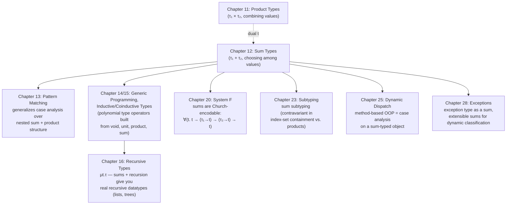

# Sum Types

[[book-guidelines|↩ Back to guidelines]]

## What problem sums solve

Every language needs a way to say "this value is either an `A` or a `B`, and I won't know which until I look." A tree node is either a leaf or an interior node. A parse result is either a success or a syntax error. A lookup either finds something or it doesn't. Harper opens Chapter 12 by pointing out that these are all instances of the same phenomenon: **the choice determines the structure of the value**. A leaf carries no children; an interior node carries two subtrees. You cannot describe "the shape of a tree node" with a single, uniform record — the very fields present depend on which alternative you're looking at.

[[Function-Types-and-the-Lambda-Calculus|Function types]] let you abstract over *how* a value is used; the [[Product-Types|product types]] of Chapter 11 (pairs, tuples, records) let you *combine* several values into one, all of them present simultaneously. Sums are the dual move: they let you express *alternation* — exactly one of several possibilities is present, tagged so you can tell which. Where a product type $\tau_1 \times \tau_2$ says "I have both," a sum type $\tau_1 + \tau_2$ says "I have one, and here's a label telling you which."

### What breaks without them

Without a genuine sum type, languages fall back on ad hoc encodings: a struct with every possible field present at once and a separate integer "tag" the programmer must remember to check by convention (C's tagged unions, pre-`enum` C structs with a `kind` field); or worse, no tag at all — a pointer that's either valid or `NULL`, with nothing in the type distinguishing the two cases syntactically. Both failure modes are historical: the untagged-union case is a straight path to reading a `float` through an `int`'s bit pattern, and the missing-tag case is, as Harper notes at the end of the chapter, the origin of C.A.R. Hoare's self-described "billion dollar mistake" — languages that don't distinguish "definitely a $\tau$" from "maybe nothing" push the burden of remembering to check onto the programmer, discovered only at runtime, usually in production.

## Nullary and binary sums

Harper builds sums the same way he builds every other type former in PFPL: start with the smallest, most degenerate case, then generalize. The grammar for this section:

$$
\begin{array}{lll}
\text{Typ}\ \tau &::=& \mathsf{void} \mid \mathsf{sum}(\tau_1;\tau_2) \\
&& \text{written } \mathsf{void} \mid \tau_1 + \tau_2 \\[4pt]
\text{Exp}\ e &::=& \mathsf{abort}[\tau](e) \mid \mathsf{in}[\tau_1;\tau_2][\mathsf{l}](e) \mid \mathsf{in}[\tau_1;\tau_2][\mathsf{r}](e) \mid \mathsf{case}(e; x_1.e_1; x_2.e_2) \\
&& \text{written } \mathsf{abort}(e) \mid \mathsf{l}\cdot e \mid \mathsf{r}\cdot e \mid \mathsf{case}\ e\ \{\mathsf{l}\cdot x_1 \Rightarrow e_1 \mid \mathsf{r}\cdot x_2 \Rightarrow e_2\}
\end{array}
$$

### void: the sum of nothing

$\mathsf{void}$ is the **nullary sum** — a choice among zero alternatives. Because there are zero cases to choose from, $\mathsf{void}$ has **no introductory form at all**: there is no rule of the form "$\Gamma \vdash \cdots : \mathsf{void}$" that lets you construct a closed value of this type from scratch. That's the whole point of the type — it's the type with no elements.

Its elimination form is $\mathsf{abort}(e)$, typed by:

$$
\frac{\Gamma \vdash e : \mathsf{void}}{\Gamma \vdash \mathsf{abort}(e) : \tau} \tag{12.1a}
$$

Read this rule carefully: it says that *if* you somehow have an expression $e$ of type $\mathsf{void}$, you may treat $\mathsf{abort}(e)$ as having *any* type $\tau$ whatsoever. That's not unsound — it's vacuous. Since no well-typed closed expression can ever actually evaluate to a value of type $\mathsf{void}$ (there's nothing to evaluate *to*), the premise $\Gamma \vdash e : \mathsf{void}$ can only be satisfiable if $e$ itself diverges or gets stuck before producing a value — so the rule never has to make good on a claim it can't keep. This is the type-theoretic mirror image of the principle of explosion in logic ("from a contradiction, anything follows"): $\mathsf{void}$ is the type-level analogue of $\bot$ (falsehood), and $\mathsf{abort}$ is the type-level analogue of *ex falso quodlibet*.

### l·e and r·e: binary sums

The binary sum $\tau_1 + \tau_2$ is a choice between exactly two alternatives, and each value must be **tagged** to say which one it is:

$$
\frac{\Gamma \vdash e : \tau_1}{\Gamma \vdash \mathsf{l}\cdot e : \tau_1 + \tau_2} \tag{12.1b}
$$
$$
\qquad\qquad
\frac{\Gamma \vdash e : \tau_2}{\Gamma \vdash \mathsf{r}\cdot e : \tau_1 + \tau_2} \tag{12.1c}
$$

$\mathsf{l}\cdot e$ injects a $\tau_1$-value into the left summand; $\mathsf{r}\cdot e$ injects a $\tau_2$-value into the right. (Harper writes these as shorthand for the fully explicit abstract syntax $\mathsf{in}[\tau_1;\tau_2][\mathsf{l}](e)$ and $\mathsf{in}[\tau_1;\tau_2][\mathsf{r}](e)$, which carries both summand types along with the value — necessary because, unlike a pair, a sum value's type is not recoverable from the value's shape alone without that annotation, since e.g. $\mathsf{l}\cdot 3$ could be a value of $\mathsf{nat}+\mathsf{str}$ or of $\mathsf{nat}+\mathsf{bool}$.)

The elimination form is **case analysis**:

$$
\frac{\Gamma \vdash e : \tau_1+\tau_2 \quad \Gamma, x_1{:}\tau_1 \vdash e_1 : \tau \quad \Gamma, x_2{:}\tau_2 \vdash e_2 : \tau}{\Gamma \vdash \mathsf{case}\ e\ \{\mathsf{l}\cdot x_1 \Rightarrow e_1 \mid \mathsf{r}\cdot x_2 \Rightarrow e_2\} : \tau} \tag{12.1d}
$$

Notice the constraint hiding in this rule: **both branches must produce the same type** $\tau$. This is forced by the nature of static typing itself — the type of `case e {...}` has to be knowable *before* running the program, i.e. before you know which branch will actually fire. If the two branches were allowed different types, the type of the whole expression would depend on a runtime fact the type checker can't see. This is exactly the same discipline you already know from Rust's `match` (every arm must unify to one type) or an `if`/`else` where both arms must agree.

The [[Exceptions#Dynamics|dynamics]] gives the case-analysis rules their operational bite (eager variant, values tagged before matching):


$$
\dfrac{e\ \mathsf{val}}
{\mathsf{case}\ \mathsf{l}\cdot e\ \{\mathsf{l}\cdot x_1 \Rightarrow e_1 \mid \mathsf{r}\cdot x_2 \Rightarrow e_2\} \mapsto [e/x_1]e_1}
\tag{12.2g}
$$

$$
\dfrac{e\ \mathsf{val}}
{\mathsf{case}\ \mathsf{r}\cdot e\ \{\mathsf{l}\cdot x_1 \Rightarrow e_1 \mid \mathsf{r}\cdot x_2 \Rightarrow e_2\} \mapsto [e/x_2]e_2}
\tag{12.2h}
$$

If you specifically want them side-by-side (as the `\qquad` suggests) rather than stacked, that only works reliably as plain prose with two inline `$...$` fractions, since Obsidian's MathJax doesn't give you a clean way to keep two independently-tagged display equations on one horizontal line — stacking with individual tags (as above) is the more robust choice for a vault note, especially on narrow/mobile rendering.

Case analysis peels off the tag, substitutes the payload into the matching branch's bound variable, and discards the branch that wasn't taken — no trace of the untaken branch survives at runtime, exactly like a real tagged-union `match`.

Harper closes the section with the expected coherence result, proved the same way as every other [[Dynamic-Classification#Safety|safety]] theorem in the book — preservation by induction on the dynamics rules, progress by induction on the [[Symbols-and-Dynamic-Binding#Statics|statics]] rules:

> **Theorem 12.1 ([[State-and-Assignables#Safety|Safety]]).**
> 1. If $e:\tau$ and $e\mapsto e'$, then $e':\tau$.
> 2. If $e:\tau$, then either $e\ \mathsf{val}$ or $e \mapsto e'$ for some $e'$.

### Grounding: tagged alternatives as an `enum`

Rust's `enum` is close to a literal transcription of the binary sum, generalized to $n$-ary from the start:

```rust
enum Sum<A, B> {
    Left(A),
    Right(B),
}

// Case analysis (12.1d / 12.2g,h) is exactly `match`:
fn case_analyze<A, B, T>(
    e: Sum<A, B>,
    on_left: impl FnOnce(A) -> T,
    on_right: impl FnOnce(B) -> T,
) -> T {
    match e {
        Sum::Left(x1) => on_left(x1),   // l · x1 => e1
        Sum::Right(x2) => on_right(x2), // r · x2 => e2
    }
}
```

The Rust compiler enforces rule (12.1d)'s constraint automatically: every arm of a `match` must produce a value of the same type `T`, or it's a compile error — you cannot return an `i32` from one arm and a `String` from another. `void`'s empty-introduction-form property shows up as Rust's uninhabited `enum Void {}` (zero variants, zero constructors), and `abort` is exactly what you get for free from an exhaustive `match` on a value of that type: the match has zero arms to write, because there are zero variants to cover, so the compiler lets the whole expression have any type the context demands (this is literally how `std::convert::Infallible` behaves in Rust today).

In Lean, the correspondence is even more direct, because Lean's kernel *is* a dependently-typed generalization of exactly this machinery:

```lean
inductive Sum (A B : Type) where
  | inl : A → Sum A B
  | inr : B → Sum A B

def caseAnalyze {A B T : Type} (e : Sum A B) (f : A → T) (g : B → T) : T :=
  match e with
  | Sum.inl x => f x
  | Sum.inr y => g y

-- void, with zero constructors -- Lean's `Empty`:
inductive Empty : Type

def abort {T : Sort u} (e : Empty) : T :=
  nomatch e   -- an exhaustive match with zero cases, since Empty has zero constructors
```

`nomatch e` is Lean's `abort` verbatim: because `Empty` has no constructors, an exhaustive pattern match on a value of type `Empty` requires zero cases, so the whole expression is well-typed at *any* result type — the elaborator accepts it unconditionally, precisely because the premise $\Gamma \vdash e : \mathsf{void}$ can never actually be discharged by a real closed term. If you're building a checker in the style described by this book's learning goals, `abort`/`nomatch`/`Void`-match is worth internalizing exactly this way: it's not a special-cased hack, it's what "exhaustive case analysis" degenerates to automatically when the scrutinee's type has no cases.

## Finite sums

Exactly as Chapter 11 generalized the nullary and binary product to an $I$-indexed finite product, Chapter 12 generalizes the nullary and binary sum to an $I$-indexed finite sum, for $I$ a finite index set:

$$
\begin{array}{lll}
\text{Typ}\ \tau &::=& \mathsf{sum}(\{i \hookrightarrow \tau_i\}_{i\in I}) & \text{written } [\tau_i]_{i\in I}, \text{ or } \textstyle\sum_{i\in I}\tau_i \\[4pt]
\text{Exp}\ e &::=& \mathsf{in}[\vec\tau][i](e) & \text{written } i\cdot e \\
&& \mathsf{case}(e; \{i \hookrightarrow x_i.e_i\}_{i\in I}) & \text{written } \mathsf{case}\ e\ \{i\cdot x_i \Rightarrow e_i\}_{i\in I}
\end{array}
$$

Nullary and binary sums are the two extreme instances of this pattern: void is the finite sum with $I=\emptyset$ (an index set with nothing to choose from — hence no introduction rule); the binary sum is the finite sum with $I=\{\mathsf{l},\mathsf{r}\}$. The [[Statics-And-Dynamics|statics and dynamics]] are the pointwise generalization of Rules (12.1)–(12.2): to build a value, inject a $\tau_k$-typed expression tagged with its index $k$; to eliminate, supply one branch per index, all agreeing on a common result type $\tau$; to step, discard the tag, keep the payload, and jump into the one matching branch. Safety (Theorem 12.2) is proved "similarly to the binary case" — the induction structure doesn't change, only the arity.

This is the shape of a genuine Rust `enum` with more than two variants, or an ML-style datatype declaration — you'll rarely reach for literal binary sums once you have this generalized $n$-ary form, exactly as you'll rarely nest binary pairs by hand once you have tuples/structs.

## Applications: what sums are secretly built from

Section 12.3 is where the chapter earns its keep — Harper shows that several types you'd normally think of as *primitive* language features are really thin sugar over $\mathsf{void}$, binary sums, and the unit type from Chapter 11. This matters for the same reason Church encodings matter elsewhere in the book: it tells you what the *irreducible* primitives of a language actually are, and what's merely convenient notation on top.

### void vs. unit — a distinction worth being pedantic about

Harper flags a common confusion directly: **void and unit are not the same "nothing," and conflating them is a real source of bugs.** $\mathsf{unit}$ has exactly one element, $\langle\rangle$ — it says "this expression completes, but there's no interesting payload to report" (think Rust's `()`, or a function whose only job is a side effect). $\mathsf{void}$ has *zero* elements — it says "this expression's type promises there is no possible value at all," which (given safety) means an expression of this type can never terminate with a value. Harper is explicit that many languages' so-called "void" return type (C's `void`, Java's `void`) is a misnomer: a function declared to return `void` in those languages *does* return — to the caller — it just returns nothing interesting. That's $\mathsf{unit}$, not $\mathsf{void}$. A genuine $\mathsf{void}$-returning function is one that is guaranteed, by its type, to never return control at all (it diverges, or it raises an exception that never comes back) — Rust's `!` (the "never" type) is the accurate rendering of PFPL's $\mathsf{void}$, not `()`.

### Booleans as unit + unit

The simplest nontrivial sum is the familiar Boolean:

$$
\mathsf{bool} = \mathsf{unit} + \mathsf{unit}, \qquad
\mathsf{true} = \mathsf{l}\cdot\langle\rangle, \qquad
\mathsf{false} = \mathsf{r}\cdot\langle\rangle, \qquad
\mathsf{if}\ e\ \mathsf{then}\ e_1\ \mathsf{else}\ e_2 = \mathsf{case}\ e\ \{\mathsf{l}\cdot x_1 \Rightarrow e_1 \mid \mathsf{r}\cdot x_2 \Rightarrow e_2\}
\tag{12.7a–d}
$$

Both summands carry the uninteresting unit payload — the entire informational content of a Boolean is *which* summand you're in, not what's inside it. Harper's point in giving both a primitive `bool` (Rules 12.5–12.6) and this derived encoding side by side is that they're **definitionally interchangeable**: a language designer never actually needs to add Booleans as a primitive; two unit-carrying summands and a case analysis already give you everything `if`/`then`/`else` does, statics, dynamics, and safety proof included for free by inheritance from the sum's own theorem.

```rust
// A literal, if silly, transcription of bool = unit + unit in Rust:
enum MyBool {
    True(()),   // l · ⟨⟩
    False(()),  // r · ⟨⟩
}

fn my_if<T>(b: MyBool, then_branch: T, else_branch: T) -> T {
    match b {
        MyBool::True(_) => then_branch,
        MyBool::False(_) => else_branch,
    }
}
```

### Enumerations as sums of units

The same idea scales up: an enumeration like the four card suits is nothing but a finite sum where every summand's payload type is $\mathsf{unit}$ — the payload carries no information, so the *only* content of a value of this type is which of the $|I|$ tags it carries:

$$
\mathsf{suit} = [\mathsf{unit}]_{i \in I}, \qquad I = \{\clubsuit, \diamondsuit, \heartsuit, \spadesuit\}
$$

This is exactly what Rust's C-like `enum Suit { Clubs, Diamonds, Hearts, Spades }` and Lean's `inductive Suit | clubs | diamonds | hearts | spades` desugar to under the hood: each variant is really "inject the unit value tagged with this name."

### Options and the null pointer fallacy

The last, and most consequential, application:

$$
\begin{array}{lll}
\text{Typ}\ \tau &::=& \mathsf{opt}(\tau) & \text{written } \tau\ \mathsf{opt} \\[4pt]
\text{Exp}\ e &::=& \mathsf{null} \mid \mathsf{just}(e) \mid \mathsf{ifnull}[\tau](e; e_1; x.e_2) \\
&&\text{written } \mathsf{null} \mid \mathsf{just}(e) \mid \mathsf{check}\ e\ \{\mathsf{null}\Rightarrow e_1 \mid \mathsf{just}(x)\Rightarrow e_2\}
\end{array}
$$

defined entirely from sums and the nullary product:

$$
\tau\ \mathsf{opt} = \mathsf{unit} + \tau, \qquad
\mathsf{null} = \mathsf{l}\cdot\langle\rangle, \qquad
\mathsf{just}(e) = \mathsf{r}\cdot e, \qquad
\mathsf{check}\ e\ \{\mathsf{null}\Rightarrow e_1 \mid \mathsf{just}(x_2)\Rightarrow e_2\} = \mathsf{case}\ e\ \{\mathsf{l}\cdot\_\Rightarrow e_1 \mid \mathsf{r}\cdot x_2\Rightarrow e_2\}
\tag{12.8a–d}
$$

This is the section where Harper cashes out the earlier void/unit distinction as a genuine engineering payoff. He diagnoses the **null pointer fallacy** as *two compounding errors*, not one:

1. Treating the values of a type as "pointers" — an implementation detail about runtime representation — rather than defining the type by its semantics (what values it has, what you can do with them).
2. Then distinguishing one particular value of that representation, "null," as a value that *doesn't actually denote a value of the type at all*, but instead silently rejects any attempt to use it as one.

The fix isn't a runtime discipline of remembering to call `null(e)` before every use (Equation 12.9 in the text, `if null(e) then error else proceed`) — that's exactly the "conditionals sprinkled everywhere and easy to forget" pattern that makes null-pointer [[Exceptions|exceptions]] "rampant" in practice, per Harper's own wording. The fix is a **type-level** distinction: don't let `τ` itself contain a null-like value at all; instead, use $\tau\ \mathsf{opt} = \mathsf{unit} + \tau$, a genuinely different type from $\tau$. Case analysis (`check`/`ifnull`) then does something a Boolean test structurally cannot do: inside the `just(x)` branch, $x$ is bound at type $\tau$ *itself* — the "value present" fact is baked into the type of the variable you get to use, not something you have to remember to have checked. There is no way to "forget the null check" inside that branch, because there is nothing null-shaped left to forget — the compiler, not the programmer's memory, is now the one enforcing the discipline.

```rust
// τ opt = unit + τ, literally Rust's Option<T>:
enum Option<T> {
    None,       // null = l · ⟨⟩
    Some(T),    // just(e) = r · e
}

fn lookup(key: &str, table: &[(&str, i32)]) -> Option<i32> {
    table.iter().find(|(k, _)| *k == key).map(|(_, v)| *v)
}

fn use_it(table: &[(&str, i32)]) {
    match lookup("x", table) {
        None => println!("not found"),
        Some(v) => {
            // Inside this arm, `v : i32` — a *genuine* i32, not "an i32 or null."
            // There is nothing left to null-check; the type system already
            // did the case analysis Harper's `check` demands.
            println!("found {v}");
        }
    }
}
```

The contrast with a nullable-by-default type — `T*` in C/C++, or a Java reference type before `Optional<T>` — is exactly Harper's two-error diagnosis made concrete: `T*` conflates "a valid `T`" with "the sentinel that isn't one," so *every* use of a `T*` value silently carries an unchecked obligation. `Option<T>`/`τ opt` moves that obligation into the type, where an exhaustive `match`/`case` forces it to be discharged before the payload is ever accessible.

```lean
-- Lean's own Option is definitionally this same sum:
inductive Option (α : Type) where
  | none : Option α
  | some : α → Option α

def useIt (o : Option Nat) : String :=
  match o with
  | Option.none => "not found"
  | Option.some v => s!"found {v}"   -- v : Nat here, genuinely, not Option Nat
```

## Case analysis as *the* elimination form for sums

It's worth stepping back to name the pattern explicitly, since it recurs everywhere sums appear in this book: **every** elimination form for a sum-shaped type in this chapter — $\mathsf{abort}$ for void, binary $\mathsf{case}$, $n$-ary $\mathsf{case}$, `if`/`then`/`else`, `check`/`ifnull` — is one instance of the same principle: given a value that is provably one of several tagged alternatives, provide one branch per alternative, require all branches to agree on a result type, and let the dynamics pick the branch matching the actual tag at runtime and discard the rest. Chapter 13 ([[Pattern-Matching|Pattern Matching]]) generalizes this single-level tag dispatch into nested patterns over both products and sums simultaneously (e.g. matching `⟨l·⟨⟩, x⟩` directly, rather than nesting two separate `case`/`split` expressions) — but the underlying discipline, exhaustive coverage of tagged alternatives with a uniform result type, is exactly what's introduced here first.

## Where this leads



Within the book's own trajectory, this chapter is quietly load-bearing far past its eight pages. It's the direct prerequisite for pattern matching (Chapter 13), for the "polynomial" type operators used to build [[Inductive-and-Coinductive-Types|inductive and coinductive types]] (Chapters 14–15 build lists, trees, and streams out of exactly $\mathsf{void}$, $\mathsf{unit}$, product, and sum), and — once [[Recursive-Types|recursive types]] arrive in Chapter 16 — for essentially every recursive datatype you'd reach for in ordinary programming. It also resurfaces as the technical backbone of two topics that look unrelated on the surface: Chapter 25 reveals that method-based object-oriented dispatch is literally case analysis on a sum-typed representation of "the object's class," and Chapter 28 chooses a sum type (or an *extensible* sum) as the right representation for an exception type, precisely because exceptions are "one of several possible failure tags, each carrying its own payload" — the exact shape this chapter formalizes.

For the standing project of building a checker/verifier: the typing rule for case analysis, Rule (12.1d), is your first real encounter with a **join point** in a type checker's control flow — a place where multiple syntactic branches must be checked independently and their result types *unified* before the whole expression can be assigned a type. That's the same discipline a bidirectional type checker needs for `if`/`match`/pattern-matching constructs in general: check each branch, then require (or infer) a common type, exactly as a Hindley–Milner-style unifier would do at a branch-merge point. And the void/`abort` case is worth remembering as the base case of *totality* checking specifically: a checker that supports an empty-index-set sum for free gets "impossible case" elimination (Rust's `match` on an uninhabited enum, Lean's `nomatch`) without any special-casing — it falls straight out of "zero branches to check" being a degenerate instance of the general case-analysis rule, not an exception to it.
