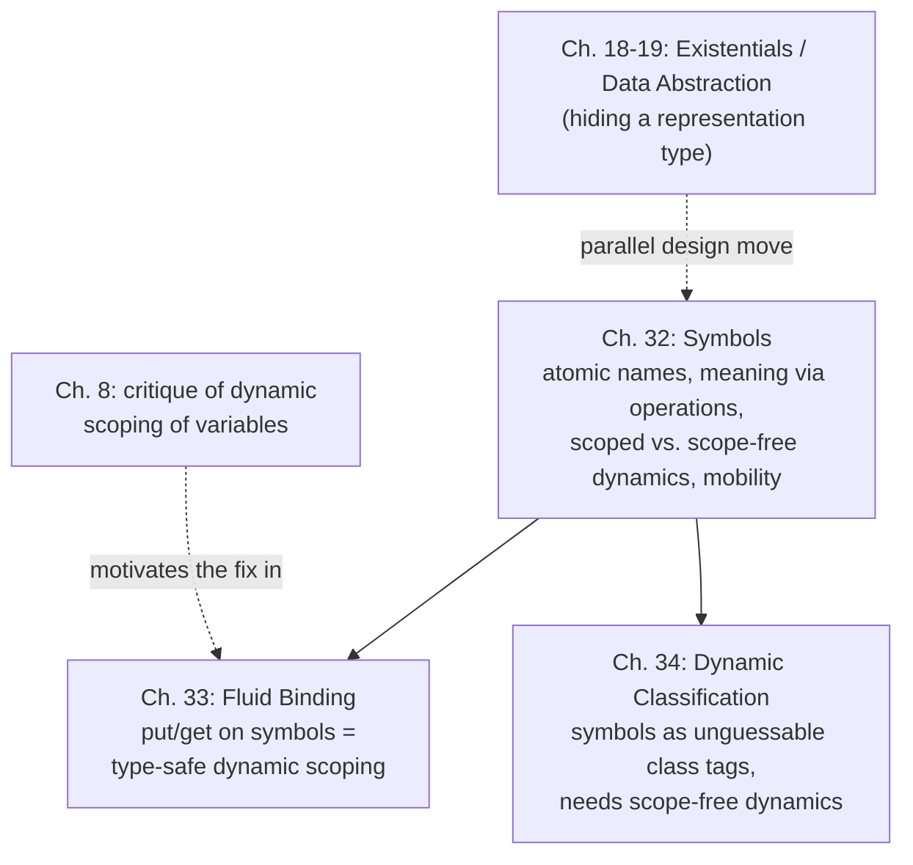

[[book-guidelines|↩ Back to guidelines]]

## Why a language needs a name that *isn't* a variable

Every variable you've ever typed in a program has one job: it stands for a value, and that standing-for relationship is resolved by **substitution**. `let x = 5 in x + x` means exactly `5 + 5` because we substitute `5` for `x`. This is the bedrock semantics of Chapter 6 onward in PFPL, and it is airtight — a variable's meaning is fixed lexically, at the point where it's bound, and nothing that happens at run time can change it.

But there's a whole family of language features that don't fit this mold at all:

- A gensym'd identifier used as a dictionary key, distinct from every other key ever generated, compared only for equality.
- A dynamically-scoped configuration parameter (like Lisp's "special variables," or a logging verbosity level that any nested call can read).
- A mutable reference cell's identity — the *name* of the cell, as opposed to its *contents*.
- An unforgeable capability or channel used to gate access to a resource.

None of these are well-modeled by substitution. A gensym isn't "replaced" by a value wherever it occurs — it *is* the value, an atomic, structureless thing whose only content is that it's distinguishable from every other one. A dynamically-scoped parameter can't be resolved at binding time because its value depends on the *calling context*, not the lexical context. Trying to force these into the variable-and-substitution mold is exactly what got 1960s Lisp into trouble (more on that below), and produced language designs where "dynamic scoping" meant unpredictable capture bugs and unsound typing.

Harper's move in Chapter 32 is to introduce a genuinely new syntactic category — the **symbol** — that is deliberately *not* a variable, specifically so it can support a family of behaviors variables can't safely support. Chapter 33 then shows the payoff: once you have symbols, you can build a fully type-safe version of dynamic binding, called **fluid binding**, that recovers everything dynamic scoping was trying to give you, without the unsoundness.

## Symbols: names given meaning by operations, not substitution

> "A symbol is an atomic datum with no internal structure. Whereas a variable is given meaning by substitution, a symbol is given meaning by a family of operations indexed by symbols." (Ch. 32 opening)

This is the load-bearing sentence of the chapter, so it's worth unpacking slowly.

A symbol $a$ carries no information on its own beyond being distinguishable from other symbols. It gets its *meaning* — what it's good for — entirely from which operations are defined to act on it. The same symbol construct, reused with different associated operations, gives you:

- **fluid binding** (Chapter 33): operations `get[a]` / `put[a](e₁; e₂)` that read/write a dynamically-scoped association;
- **[[Dynamic-Classification|dynamic classification]]** (Chapter 34): operations that tag and pattern-match values against a symbol acting as an unguessable class marker;
- **mutable storage**: operations that read/write a cell named by the symbol;
- **communication channels**: operations that send/receive along a channel named by the symbol.

Each symbol has an associated **type** $\rho$, but — and this is the subtle point the book insists on — *a symbol is not a value of that type*. The type is a **constraint on how the symbol may be interpreted by its associated operations**. For fluid binding, $\rho$ constrains what values can be `put` for $a$; for mutable storage, it constrains the contents of the cell named $a$. The symbol itself is just an index into a family of typed operations — closer to a *key* than to a *value*.

**Rust framing.** This is precisely the shape of a `PhantomData`-carrying opaque handle, or better, a `slotmap`/`generational-arena` key: a `Key<T>` is not a `T`, it's an unforgeable, comparable token that *indexes* a family of operations (`arena.get(key) -> &T`, `arena.get_mut(key) -> &mut T`) parameterized by the type `T`. You never construct a `Key<T>` by hand or substitute a value into it — you generate it fresh from the arena, and its only useful operation is equality comparison plus lookup.

```rust
// A symbol is a fresh, opaque, comparable token — not a value.
struct Symbol<T> {
    id: u64,
    _phantom: std::marker::PhantomData<T>,
}

impl<T> Symbol<T> {
    fn fresh() -> Self {
        static COUNTER: std::sync::atomic::AtomicU64 = std::sync::atomic::AtomicU64::new(0);
        Symbol {
            id: COUNTER.fetch_add(1, std::sync::atomic::Ordering::Relaxed),
            _phantom: std::marker::PhantomData,
        }
    }
}

impl<T> PartialEq for Symbol<T> {
    fn eq(&self, other: &Self) -> bool { self.id == other.id }
}
```

The `PhantomData<T>` carries exactly the "associated type" role the book describes: it constrains what operations indexed by this symbol are allowed to do, without the symbol ever *being* a `T`.

## Symbol declaration: `ν a:τ in e`

The construct for introducing a fresh symbol is:

$$
\text{Exp } e ::= \nu a{:}\tau \text{ in } e \qquad (\texttt{new}[\tau](a.e)) \quad \text{generation}
$$

Read this as "generate a new symbol $a$ of type $\tau$, for use within $e$." The declaration **binds** $a$ within $e$ — statically, this is just like any other binder (like $\lambda x.e$), so $a$ can be alpha-renamed at will to avoid clashing with any finite set of active symbols. That's the *statics* of the construct, and it's unremarkable.

What's genuinely new is that the statics only fixes the **scope** of $a$ (where it's syntactically visible), while a separate notion — **extent** — governs how long the symbol actually remains "live" during execution, and *extent is a property of the [[Exceptions#Dynamics|dynamics]], not the statics*. This scope/extent split is the crux of the chapter, and it doesn't exist for ordinary variables (a variable's extent is always exactly its scope, because it's eliminated by substitution the moment it's used).

Typing uses a **signature** $\Sigma$ — a finite set of pairs $a \sim \tau$ tracking which symbols are currently active and at what type, threaded through [[Statics-And-Dynamics#The typing judgment|the typing judgment]] as $\Gamma \vdash_\Sigma e : \tau$. The one static rule is:

$$
\frac{\Gamma \vdash_{\Sigma, a\sim\rho} e : \tau \qquad \tau \ \text{mobile}}{\Gamma \vdash_\Sigma \texttt{new}[\rho](a.e) : \tau} \tag{32.1}
$$

Note the side condition, `τ mobile` — this is where the two different dynamics diverge, and it's the crux of the whole chapter.

### Scoped vs. scope-free dynamics

**Scoped dynamics.** The transition judgment $e \xrightarrow{}_\Sigma e'$ is indexed by the *active* signature. Symbol declaration steps by evaluating under the declaration and then discarding it once the scope is done:

$$
\frac{e \xrightarrow{}_{\Sigma,a\sim\rho} e'}{\texttt{new}[\rho](a.e) \xrightarrow{}_\Sigma \texttt{new}[\rho](a.e')} \qquad
\frac{e\ \text{val}_{\Sigma,a\sim\rho}}{\texttt{new}[\rho](a.e) \xrightarrow{}_\Sigma e}
$$

The second rule is the "forgetting" step: once $e$ is a value, the whole `new` expression steps to *just* $e$ — the symbol $a$ is dropped from the signature. Its extent equals its scope, exactly as intuition would suggest.

But this creates a soundness hazard: what if $e$'s final value *contains a reference to $a$* (via the symbolic-reference type of §32.2, below)? Then dropping $a$ from the signature would leave a dangling reference to a symbol nobody remembers — unsound. This is exactly what the `mobile` side condition in Rule (32.1) rules out: **a type $\tau$ is mobile only if a value of that type provably cannot depend on any locally-declared symbol.** The book's own examples: a function type can never be mobile in the presence of symbolic references (a closure might capture `&a`), and `nat` is mobile only if successor is evaluated eagerly (otherwise a thunked expression could smuggle out a symbol reference).

Harper states the required invariant explicitly as the **mobility condition**:

> If $\tau$ mobile, $\vdash_{\Sigma,a\sim\rho} e:\tau$, and $e\ \text{val}_{\Sigma,a\sim\rho}$, then $\vdash_\Sigma e:\tau$ and $e\ \text{val}_\Sigma$.

i.e., a mobile value genuinely doesn't need the extended signature — it's fine to "move" it out into the enclosing scope, hence the name.

**Preservation (Thm 32.1)** and **Progress (Thm 32.2)** both go through by straightforward induction on this one rule, with the mobility condition doing exactly the work you'd expect at the "forget the symbol" step.

**Scope-free (free) dynamics.** The alternative interpretation lets a symbol's extent outlive its lexical scope entirely. States are now pairs $\nu\Sigma\{e\}$ — an expression paired with the *entire* signature accumulated so far — and generation simply **enriches** the ambient signature permanently:

$$
\nu\Sigma\{\texttt{new}[\rho](a.e)\} \mapsto \nu\Sigma, a\sim\rho\{e\} \tag{32.3}
$$

There's no "forgetting" step at all. Every other rule of the language (e.g. function application) has to be reformulated to thread the growing signature through:

$$
\frac{\nu\Sigma\{e_1\}\mapsto\nu\Sigma'\{e_1'\}}{\nu\Sigma\{e_1(e_2)\}\mapsto\nu\Sigma'\{e_1'(e_2)\}} \qquad
\nu\Sigma\{\lambda(x{:}\tau)\,e(e_2)\}\mapsto\nu\Sigma\{[e_2/x]e\}
$$

Under this dynamics, **every type is deemed mobile** — trivially safe, because there's no scope boundary to cross; the signature just keeps growing to accommodate whatever symbols escape. Preservation (Thm 32.3) and Progress (Thm 32.4) are correspondingly easy, falling out of Rule (32.3) alone.

The terminology "mobile" captures this nicely: under scoped dynamics symbols have "limited range of motion" (only mobile-typed results may leave their scope); under free dynamics they may be "moved freely" because the dynamics itself accommodates the escape by growing $\Sigma$.

**[[Control-Stacks-and-Abstract-Machines#What breaks without this|What breaks without this]] distinction.** If you tried to run scoped dynamics' *forgetting rule* while also allowing symbolic references to escape (i.e., skip the mobility check), you'd end up with values referencing symbols that no longer exist in any signature — the equivalent of a dangling pointer, except the danger is silent at the type level, not just at run time. Mobility is precisely PFPL's mechanism for statically ruling this out.

**Rust framing.** Scoped dynamics is exactly Rust's borrow-checker discipline for a value tied to a lifetime `'a` — a `&'a T` cannot be returned from a scope shorter than `'a` unless the type doesn't actually depend on it (analogous to "mobile"). Scope-free dynamics is closer to an arena allocator or a global slotmap: keys, once minted, remain valid for the life of the whole program, regardless of where they were created — no scope-exit ever invalidates them. This is also the everyday distinction between a `Box`/stack-scoped resource (scoped) and an entry in a `SlotMap`/`Arena` that outlives the function that inserted it (scope-free).

## Symbolic references: `τ sym` and decidable comparison

Symbols aren't values themselves, but we can build values *about* symbols: a **symbolic reference**. The syntax:

$$
\begin{aligned}
\text{Typ } \tau &::= \texttt{sym}(\tau) & \tau\ \texttt{sym} && \text{symbols}\\
\text{Exp } e &::= \texttt{sym}[a] & \&a && \text{reference}\\
 &::= \texttt{is}[a][t.\tau](e; e_1; e_2) & \texttt{if}\ e\ \texttt{is}\ a\ \texttt{then}\ e_1\ \texttt{ow}\ e_2 && \text{comparison}
\end{aligned}
$$

`&a` is a first-class value of type `sym(ρ)` — "a value that refers to the symbol $a$." The eliminatory form `is[a][t.τ](e; e₁; e₂)` is a run-time equality test: does the reference `e` point at the specific symbol `a`? If so, branch to `e₁`; otherwise, `e₂`.

### Statics: the comparison rule mediates a type discrepancy

$$
\frac{}{\Gamma\vdash_{\Sigma,a\sim\rho}\texttt{sym}[a] : \texttt{sym}(\rho)} \tag{32.5a}
$$

$$
\frac{\Gamma\vdash_{\Sigma,a\sim\rho} e:\texttt{sym}(\rho') \quad \Gamma\vdash_{\Sigma,a\sim\rho} e_1 : [\rho/t]\tau \quad \Gamma\vdash_{\Sigma,a\sim\rho} e_2 : [\rho'/t]\tau}{\Gamma\vdash_{\Sigma,a\sim\rho}\texttt{is}[a][t.\tau](e;e_1;e_2) : [\rho'/t]\tau} \tag{32.5b}
$$

The subtlety worth dwelling on: **the type $\rho$ of the symbol $a$ named in the comparison and the type $\rho'$ of the symbol actually referenced by $e$ need not agree a priori.** They *would* agree if $e$ turns out to refer to $a$ itself, but if $e$ refers to some other symbol $b \neq a$, $\rho$ and $\rho'$ could be completely different types. The construct `is[a][t.τ]` handles this with a **type operator** $t.\tau$ (a type $\tau$ parameterized by a type variable $t$ — see PFPL Ch. 14) that computes the overall result type depending on which branch is taken:

- Positive branch ($e$ turns out to be `&a`): we "learn" $\rho = \rho'$, so $e_1$ gets checked at $[\rho/t]\tau$.
- Negative branch: no such information is available (the referenced symbol could be anything), so $e_2$ is checked generically at $[\rho'/t]\tau$.

This is a strikingly precise piece of design: it's a **type-level pattern match on identity**, where the positive branch's type context is *refined* by the fact of the match, exactly the way a `match` arm on `Option::Some(x)` refines the type to "definitely present." It's a lightweight instance of dependent-style type refinement squeezed into an otherwise simply-typed calculus, driven entirely by decidable symbol equality.

### Dynamics and decidable comparison

$$
\texttt{sym}[a]\ \texttt{val}_{\Sigma,a\sim\rho} \tag{32.6a}
$$
$$
\texttt{is}[a][t.\tau](\texttt{sym}[a]; e_1; e_2) \xrightarrow{}_{\Sigma,a\sim\rho} e_1 \tag{32.6b}
$$
$$
\texttt{is}[a][t.\tau](\texttt{sym}[a']; e_1; e_2) \xrightarrow{}_{\Sigma,a\sim\rho,a'\sim\rho'} e_2 \quad (a\neq a') \tag{32.6c}
$$

Progress (Thm 32.7) relies on a **Canonical Forms lemma** (32.6): any value of type `sym(ρ)` must literally be `sym[a]` for some symbol $a$ declared at type $\rho$ in $\Sigma$. Combined with the fact that **equality of symbols is decidable** ("either $a$ is $b$ or it is not" — the book states this outright as the crux of the progress argument for Rule 32.6b/c), this guarantees the comparison always makes progress: you never get stuck deciding whether two symbols are the same one.

**[[Dynamic-Classification#Safety|Safety]] detail:** symbolic-reference types are *not* mobile (§32.2.3) — a reference can smuggle a local symbol's identity out of its declaring scope, which is exactly the case the mobility condition exists to forbid.

**Rust framing.** `is[a][t.τ](e; e₁; e₂)` is precisely `match e.downcast_ref::<A>() { Some(_) => ..., None => ... }` on a `TypeId`/`Any`-style value, or more directly, matching a `SlotMap` key against a known key with type-level refinement of what you can assume in each branch. The type-operator machinery for computing the branch's result type is the formal counterpart of a Rust `match` arm narrowing an enum variant's payload type.

**Lean framing.** The decidable-equality-driven branch with type refinement in the positive case is structurally the same shape as Lean's `Decidable` typeclass combined with dependent [[Pattern-Matching|pattern matching]]: `if h : a = b then ... else ...` where the `then` branch's context is genuinely refined by `h : a = b` (definitional equality becomes available), while the `else` branch gets no such refinement. Symbol comparison here is doing, in miniature, what Lean's kernel does when it checks `isDefEq` on two opaque constants — either they're literally the same atom, decidably, or they're not, and only the affirmative case licenses substitution/rewriting.

## Fluid binding: type-safe dynamic scoping

### What breaks: dynamic scoping of variables (recap of Chapter 8's complaint)

Chapter 33 opens by returning explicitly to a criticism raised back in Chapter 8: **dynamic scoping of variables** is broken for two independent reasons, both restated verbatim in the text:

1. A bound variable cannot always be renamed without changing the expression's meaning (alpha-equivalence fails).
2. Because a variable's scope is resolved *dynamically* — by walking the call stack at run time rather than the lexical structure at compile time — **[[Type-Safety|type safety]] is compromised**: nothing forces the caller to have bound the variable to something of the right type, or at all.

Both are "intolerable... at variance with mathematical practice" and "compromise modularity," in Harper's words. The classic 1960s dynamic-scoping designs (early Lisp) suffered exactly this: a free identifier inside a function body resolves to whatever binding happens to be active on the call stack at the moment of the call, which depends on the caller's caller's caller — utterly non-local, non-compositional, and untypeable in general.

### The fix: divorce dynamic binding from variables, attach it to symbols instead

The insight of Chapter 33 is that everything dynamic scoping was trying to offer — "let me read a value that was set by some enclosing dynamic context, without threading it explicitly through every intermediate call" — is achievable *safely* if you attach it to a **symbol** instead of a **variable**. A symbol, recall, is a parameter to a family of operations, not a name resolved by substitution — so there's no alpha-renaming hazard, and its typing can be tracked statically via the signature $\Sigma$, restoring type [[State-and-Assignables#Safety|safety]].

The new constructs, extending $L\{\texttt{sym}\}$ from Ch. 32 into $L\{\texttt{fluid}\}$:

$$
\text{Exp } e ::= \texttt{put}[a](e_1;e_2) \;\; \texttt{put}\ e_1\ \texttt{for}\ a\ \texttt{in}\ e_2 \quad\text{binding}
$$
$$
\text{Exp } e ::= \texttt{get}[a] \;\; \texttt{get}\ a \quad\text{retrieval}
$$

`put e₁ for a in e₂` binds symbol $a$ to the value of $e_1$ **for the dynamic duration of evaluating $e_2$**, then reverts $a$'s binding to whatever it was before. `get a` reads $a$'s current binding, or gets stuck if $a$ is unbound. Crucially: "*the symbol $a$ is not bound by the `put` expression, but is instead a **parameter** of it*" — this is the key statics move, echoing symbol declaration's general pattern.

### Statics

$$
\frac{}{\Gamma\vdash_{\Sigma,a\sim\tau}\texttt{get}[a]:\tau} \tag{33.1a}
$$
$$
\frac{\Gamma\vdash_{\Sigma,a\sim\tau_1} e_1:\tau_1 \qquad \Gamma\vdash_{\Sigma,a\sim\tau_1} e_2:\tau_2}{\Gamma\vdash_{\Sigma,a\sim\tau_1}\texttt{put}[a](e_1;e_2):\tau_2} \tag{33.1b}
$$

Both rules simply require $a$ to already be declared in $\Sigma$ (via a `new` from Ch. 32) at the appropriate type — this is where the type safety comes from: the *type* of anything read via `get a` is statically known ahead of time, unlike dynamically-scoped variables where nothing constrains what a caller has bound.

### Dynamics: a stack-like environment $\mu$

Execution now threads an additional environment $\mu$, a finite partial function from symbols to values, alongside $\Sigma$:

$$
\texttt{get}[a] \xrightarrow{\mu\otimes a\mapsto e}_{\Sigma,a\sim\tau} e \tag{33.2a}
$$
$$
\frac{e_1\xrightarrow{\mu}_\Sigma e_1'}{\texttt{put}[a](e_1;e_2)\xrightarrow{\mu}_\Sigma \texttt{put}[a](e_1';e_2)} \tag{33.2b}
$$
$$
\frac{e_1\ \texttt{val}_{\Sigma,a\sim\tau} \qquad e_2\xrightarrow{\mu\otimes a\mapsto e_1}_{\Sigma,a\sim\tau} e_2'}{\texttt{put}[a](e_1;e_2)\xrightarrow{\mu\otimes a\mapsto\bullet}_{\Sigma,a\sim\tau}\texttt{put}[a](e_1;e_2')} \tag{33.2c}
$$
$$
\frac{e_1\ \texttt{val}_{\Sigma,a\sim\tau}\qquad e_2\ \texttt{val}_{\Sigma,a\sim\tau}}{\texttt{put}[a](e_1;e_2)\xrightarrow{\mu}_\Sigma e_2} \tag{33.2d}
$$

Reading the four rules as a story: `put[a](e₁;e₂)` first fully evaluates $e_1$ to a value (33.2b), then evaluates $e_2$ under an environment where $a$ is pushed onto the (stack-like) $\mu$ mapping to $e_1$'s value (33.2c) — note $\mu\otimes a\mapsto\bullet$ in the *conclusion* of 33.2c means "whatever $a$'s binding was before (possibly none, $\bullet$) gets shadowed during $e_2$'s evaluation, then restored" — and once $e_2$ is fully reduced, the whole expression collapses to $e_2$'s value, with $a$'s original binding restored (33.2d). This push/pop discipline is literally a dynamic-extent stack, exactly what "dynamic scoping" always wanted to mean, but now soundly typed.

An **unbound judgment**, $e\ \texttt{unbound}_\mu$, is defined inductively to characterize the "stuck-because-nothing-is-bound" case explicitly (rather than leaving it an undefined transition):

$$
\frac{\mu(a)=\bullet}{\texttt{get}[a]\ \texttt{unbound}_\mu} \qquad
\frac{e_1\ \texttt{unbound}_\mu}{\texttt{put}[a](e_1;e_2)\ \texttt{unbound}_\mu} \qquad
\frac{e_1\ \texttt{val}_\Sigma \quad e_2\ \texttt{unbound}_\mu}{\texttt{put}[a](e_1;e_2)\ \texttt{unbound}_\mu}
$$

### Type safety, with a twist

**Preservation (Thm 33.1)** goes through by rule induction, using an auxiliary judgment $\mu:\Sigma$ that says every symbol $\mu$ actually binds is bound at a value of the type $\Sigma$ assigns it (unbound symbols, $\bullet$, are unconstrained).

**Progress (Thm 33.2)** is the interesting one: the theorem's conclusion is not the usual "$e$ is a value or it steps," but a **three-way** disjunction — *"either $e\ \texttt{val}_\Sigma$, or $e\ \texttt{unbound}_\mu$, or $e\xrightarrow{\mu}_\Sigma e'$."* This is a genuinely new failure mode compared to every earlier language in the book: a well-typed program can still get stuck, not because of a type error, but because it tried to `get` a symbol nobody had `put` yet. This is not a violation of type safety — the theorem explicitly carves out "unbound" as an anticipated, well-characterized outcome (much like PFPL's treatment of partial primitive operations in Chapter 6) rather than an unsafe stuck state. It's the formal acknowledgment that fluid binding trades static guarantee-of-presence for dynamic flexibility, but does so *without* sacrificing preservation or the absence of type errors.

### Some subtleties: closures that outlive their binding

This is where fluid binding's real character shows. Consider (the book's own example, (33.5)–(33.7)):

$$
\texttt{put}\ 17\ \texttt{for}\ a\ \texttt{in}\ \lambda(x{:}\texttt{nat})\ x + \texttt{get}\ a
$$

This has type `nat → nat`. Evaluating it binds $a$ to 17 and returns the closure `λ(x:nat) x + get a` — **but the moment we exit the `put`, $a$'s binding reverts** (to unbound, in this scenario). So if `f` is bound to this closure, `put 21 for a in f(7)` evaluates to `28` (because the *later* `put` supplies a fresh binding at call time), while bare `f(7)`, evaluated with no surrounding `put` for `a`, is a run-time error — `a` is unbound at the point `get a` executes inside the call.

Contrast this with the superficially similar `let y be 17 in λ(x:nat) x + y` — here $y$ is a genuine variable, resolved by substitution, so the returned closure is literally `λ(x:nat) x + 17`. There is no possibility of "losing" the binding, because substitution already consumed it once and for all at closure-creation time. **This is precisely the difference between lexical/static binding and fluid/dynamic binding, made completely explicit and type-checked.**

The book frames this positively too: fluid binding is a way to avoid threading an extra explicit argument through every call site. `put 7 for a in (e(9))` and `put 8 for a in (e(9))` simulate what would otherwise require rewriting `e` to take an explicit extra parameter (`e'(7)(9)`, `e'(8)(9)`) — fluid binding is *implicit argument passing*, dynamically scoped. The trade-off the book flags explicitly: **"nothing in the type of a function reveals its dependency on the binding of a symbol"** — a function's signature doesn't tell you it needs `a` to be bound, so it's easy to forget to `put` it, producing run-time `unbound` errors that a fully static discipline would have caught earlier. This is the honest cost of the mechanism, not swept under the rug.

**Rust framing.** This is *exactly* `thread_local!` combined with a scope-guard RAII pattern, or `tokio::task_local!` / tracing's `Span::entered()`: a thread-/task-local value is `put` for the dynamic extent of a scope and automatically reverted (via `Drop`) on scope exit, and reading it via `.with(...)` can panic (the `unbound` case) if nothing set it up the dynamic call chain.

```rust
thread_local! {
    static A: std::cell::Cell<Option<i32>> = std::cell::Cell::new(None);
}

fn get_a() -> i32 {
    A.with(|a| a.get().expect("fluid binding for `a` is unbound"))
    // ^ this is exactly PFPL's `e unbound_mu` stuck case, made explicit as a panic
}

fn put_a<T>(v: i32, body: impl FnOnce() -> T) -> T {
    let prev = A.with(|a| a.replace(Some(v)));
    let result = body();
    A.with(|a| a.set(prev)); // reverts to prior binding — Rule (33.2d)
    result
}

fn make_closure() -> impl Fn(i32) -> i32 {
    put_a(17, || {
        // returns a closure that reads `get a` — but the binding
        // reverts as soon as `put_a` returns!
        |x: i32| x + get_a() // reproduces the book's example (33.5)
    })
}
```

Calling the returned closure outside any `put_a` reproduces the book's run-time error exactly — `get_a()` panics because `A` has reverted to `None`.

**Lean/Python framing.** Python's `contextvars.ContextVar` is essentially the same mechanism, designed precisely to fix the bugs of naive dynamic scoping across `async` call chains. There isn't a natural Lean analogue for *mutable* fluid state (Lean is pure), but the *implicit-argument* reading of fluid binding is illuminating: fluid binding is dynamic-scope implicit-argument passing, whereas Lean's `{}`/`[]` implicit and instance arguments are *statically* resolved implicit passing (via elaboration/unification, not a run-time stack). The contrast sharpens what's distinctive about fluid binding: it's implicit-argument passing where the "elaborator" is the call stack itself, resolved at run time rather than compile time — trading Lean's compile-time guarantee-of-resolution for late-bound flexibility.

### Fluid references: deferring the choice of symbol to run time

`get[a]` and `put[a](...)` require the target symbol to be given *statically*, as part of the syntax. §33.5 adds **fluid references** to let the choice of *which* fluid to operate on be a run-time value:

$$
\begin{aligned}
\text{Typ }\tau &::= \texttt{fluid}(\tau) & \tau\ \texttt{fluid}\\
\text{Exp } e &::= \texttt{fl}[a] \mid \texttt{getfl}(e) \mid \texttt{putfl}(e;e_1;e_2)
\end{aligned}
$$

`fl[a]` reifies the symbol $a$ as a first-class value of type `fluid(τ)`; `getfl`/`putfl` defer, once the reference resolves to a concrete symbol, to the underlying `get[a]`/`put[a]` primitives:

$$
\texttt{getfl}(\texttt{fl}[a]) \xrightarrow{\mu}_\Sigma \texttt{get}[a] \tag{33.9c}
$$

The book flags explicitly: **because we're using a scoped dynamics, references to fluids cannot be deemed mobile** — same mobility hazard as symbolic references in Ch. 32, for the same reason (a `fluid(τ)` value could smuggle a local symbol's identity out of its declaring scope).

## Synthesis: where this sits in the book's structure



- **Symbols vs. existential types (Ch. 18-19).** Both are ways of introducing an entity whose *identity* matters more than its *structure* — an existential hides a representation type behind an abstract interface; a symbol is an abstract atom whose only observable property is (in)equality with other symbols. Both rely on a careful statics to prevent information (a representation type, or a symbol's provenance) from leaking where it shouldn't.
- **Direct prerequisite for Dynamic Classification (Ch. 34).** Chapter 34 reuses exactly the symbol machinery of Ch. 32 — but needs the **scope-free** dynamics, because classes minted inside one scope must remain usable (as unguessable tags) throughout the rest of the program, which is exactly the "symbols may be moved freely" case Ch. 32 sets up. If you understood *why* scope-free dynamics deems every type mobile, you already understand why dynamic classification needs it.
- **Resolves Chapter 8's unfinished business.** The book explicitly frames fluid binding as the promised fix for dynamic scoping's soundness problems — this chapter is where that thread gets closed off, by relocating "dynamic" resolution from variables (unsound) to symbols (sound, because symbol typing is tracked statically via $\Sigma$ regardless of how $\mu$ evolves at run time).

**Relevance to the standing projects (Rust verifier / Lean-style elaborator).** The mobility condition and the two-signature dynamics ($\Sigma$ for statics, $\mu$/scope-free signature-threading for dynamics) are a clean, small-scale example of exactly the kind of *context management under a changing store* your Hoare-triple verifier will need for mutable-reference soundness proofs — Preservation/Progress here is essentially a rehearsal for reasoning about a heap. Separately, the `is[a][t.τ]` comparison form's type-refining positive branch is a genuine (if tiny) instance of definitional-equality-driven type refinement — worth keeping in mind as a toy model when you get to unification and `isDefEq`-style reasoning in the elaborator project, since it shows the same "decidable equality licenses substitution in one branch, not the other" pattern in its simplest possible setting.
