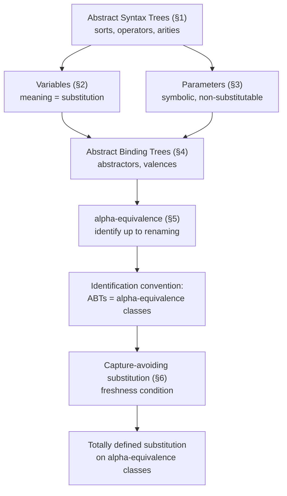

# Syntactic Objects and Binding

[[book-guidelines|↩ Back to guidelines]]

## Why a type theory book starts with syntax

Before Harper's book can talk about typing rules, evaluation, or [[Dynamic-Classification#Safety|safety]] proofs, it needs a precise answer to a question that sounds trivial and isn't: *what, exactly, is a program made of?* Not as a string of characters — that's the concrete syntax, the part that deals with parsers, tokenizers, whitespace, and precedence, and Harper explicitly sets it aside for the whole book. He wants the *structural* content: the tree shape that survives once you've thrown away how the program was typed in.

That tree shape is the abstract syntax tree (AST). But Harper immediately points out that plain trees are not enough, because programming languages have a second structural feature that plain trees don't model: **binding**. A `let x = 2 in x + x` isn't just a tree of `let`, `+`, and `x` nodes — the two `x` occurrences inside the body are *not independent leaves*, they are both references to the *one* variable introduced by the `let`. If you treat a program as a bare tree, you have no way to express that fact, and no way to express when two program texts that look different (`let x = ... in x+x` vs. `let y = ... in y+y`) actually mean the same thing.

This is why Chapter 1 builds two layers, not one:

1. **Abstract syntax trees (ASTs)** — hierarchical structure via operators and sorts, no binding.
2. **Abstract binding trees (ABTs)** — ASTs enriched with a notion of binding and scope, plus the equivalence relation and substitution operation that make binding behave correctly.

Everything else in the book — typing judgments, evaluation rules, substitution lemmas — is built as *relations and functions over ABTs*. If this foundation is sloppy, every later proof by "structural induction" or every later appeal to substitution silently inherits the bug. This is exactly the layer a Rust type-checker or a Lean-style elaborator has to get right before anything else works, which is why it's worth being pedantic about it here.

## 1. Abstract syntax trees: sorts and operators with arities

**[[Control-Stacks-and-Abstract-Machines#What breaks without this|What breaks without this]].** If you just say "a program is a tree," you've said nothing about which trees are legal. Can a number be a child of a plus? Can a plus be a child of a number? Untyped trees let you build nonsense. Sorts and arities are the mechanism that rules nonsense out *before* you even get to a type system for the language being defined — this is the type system for syntax itself, one level down.

**The definitions, precisely.** An AST is an ordered tree whose leaves are **variables** and whose interior nodes are **operators**. Every AST belongs to a **sort** — a syntactic category (e.g. `Exp` for expressions). An operator $o$ has both a sort $s$ (what it produces) and an **arity** $\mathrm{ar}(o) = (s_1, \ldots, s_n)$ — a sequence of sorts describing what it consumes and in what order. An operator of sort $s$ and arity $(s_1,\ldots,s_n)$ combines $n \ge 0$ children of sorts $s_1,\ldots,s_n$ into a compound AST of sort $s$. $n=0$ is a nullary operator (a constant, e.g. `num[2]`), $n=1$ unary, $n=2$ binary, etc.

Harper's running example: one sort $\mathit{Exp}$, with operators `num[n]` (nullary, one per natural number $n$), and `plus`, `times` (binary, both arguments and result of sort $\mathit{Exp}$). The expression $2 + (3 \times x)$ becomes the tree

$$\mathrm{plus}(\mathrm{num}[2]; \mathrm{times}(\mathrm{num}[3]; x))$$

Formally, given a family of sorts $S$, operators $\{O_s\}_{s \in S}$, and variables $\{X_s\}_{s\in S}$, the family of ASTs $A[X] = \{A[X]_s\}_{s\in S}$ is defined as the **smallest** family closed under:

1. $x \in X_s \implies x \in A[X]_s$
2. if $\mathrm{ar}(o) = (s_1,\ldots,s_n)$ and $a_i \in A[X]_{s_i}$ for each $i$, then $o(a_1;\ldots;a_n) \in A[X]_s$.

"Smallest family satisfying these closure conditions" is not decoration — it's what licenses **structural induction**: to prove a property $P$ holds of every AST of sort $s$, it suffices to show $P$ holds of every variable, and that $P$ is preserved by every operator (assuming it holds of the children). Because the closure conditions are exhaustive and the family is minimal, there's nothing else an AST could be, so these cases are the whole proof.

**[[Plotkins-PCF-and-Partial-Computation#Grounding|Grounding]] — Rust.** This is precisely the shape of a `enum` AST node, with the "arity" enforced by Rust's type checker rather than a side condition you have to verify by hand:

```rust
// One sort, "Exp", encoded as a single enum.
// Each variant's field list *is* the operator's arity.
enum Exp {
    Var(VarId),                 // a variable: arity () but distinguished from operators
    Num(i64),                   // nullary operator num[n]
    Plus(Box<Exp>, Box<Exp>),   // binary operator, arity (Exp, Exp)
    Times(Box<Exp>, Box<Exp>),  // binary operator, arity (Exp, Exp)
}
```

Multiple sorts correspond to multiple mutually-recursive enums (`Exp`, `Cmd`, `Decl`, ...), each operator's arity is its variant's field types, and Rust's exhaustiveness checker on `match` is doing structural induction's case-enumeration step *for you*, at compile time, every time you write a function over `Exp`. If you've ever had `match` complain about a non-exhaustive pattern, that error is the compiler enforcing exactly the "these cases exhaust all possibilities" argument Harper makes informally in prose.

**[[Recursive-Types#Grounding|Grounding]] — Lean.** Lean's `inductive` is the most literal transcription of Harper's "smallest family satisfying these closure conditions":

```lean
inductive Exp where
  | var : VarId → Exp
  | num : Nat → Exp
  | plus : Exp → Exp → Exp
  | times : Exp → Exp → Exp
```

Lean derives a recursor (`Exp.rec`) automatically from this declaration, and that recursor *is* the structural induction principle Harper states by hand — Lean doesn't take it on faith, it constructs it from the fact that `Exp` is defined as a least fixed point of the constructor signatures.

**Grounding — Python (sketch only).** Without a static arity checker, you'd represent this as untyped tagged tuples and enforce arity by convention/assertion — illustrative of *why* Rust/Lean's static arity checking is valuable, not a recommended design:

```python
# ("plus", e1, e2) — arity is a convention you must remember, not enforced
def eval_exp(e):
    match e:
        case ("num", n): return n
        case ("plus", e1, e2): return eval_exp(e1) + eval_exp(e2)
        case ("times", e1, e2): return eval_exp(e1) * eval_exp(e2)
```

## 2. Variables as unknowns given meaning by substitution

**[[Data-Abstraction-and-Existential-Types#What breaks without this|What breaks without this]].** If a "variable" were just a distinguished kind of leaf with no defined behavior, you couldn't say what a formula containing one *means*, nor how to specialize it. Harper is explicit: a variable's entire meaning comes from what happens when you substitute something for it.

**The definition.** A variable is an unknown object drawn from a range of significance — for ASTs, that range is "ASTs of a specified sort." Substitution, written $[b/x]a$, is the operation of replacing every occurrence of $x$ in $a$ with $b$:

$$[b/x]x = b \qquad [b/x]y = y \text{ if } x \ne y \qquad [b/x]\,o(a_1;\ldots;a_n) = o([b/x]a_1;\ldots;[b/x]a_n)$$

For plain ASTs (no binding yet) this is "physical replacement" — structurally trivial, and provably well-defined by structural induction (Harper's Theorem 1.1: for any $a \in A[X,x]$ and $b \in A[X]$, there is a *unique* $c \in A[X]$ with $[b/x]a = c$). The existence-and-uniqueness framing matters — it's the same "define a function by its graph, then prove existence and uniqueness" pattern the book leans on throughout (see Chapter 2).

**Grounding — Rust.** Substitution over an AST without binders is a straightforward recursive tree transform:

```rust
fn subst(target: &Exp, x: VarId, b: &Exp) -> Exp {
    match target {
        Exp::Var(y) if *y == x => b.clone(),
        Exp::Var(y) => Exp::Var(*y),
        Exp::Num(n) => Exp::Num(*n),
        Exp::Plus(e1, e2) => Exp::Plus(Box::new(subst(e1, x, b)), Box::new(subst(e2, x, b))),
        Exp::Times(e1, e2) => Exp::Times(Box::new(subst(e1, x, b)), Box::new(subst(e2, x, b))),
    }
}
```

**Grounding — Lean.** This is the mechanism underneath `Eq.subst` / definitional unfolding when you plug a term into a metavariable's binding site — the elaborator's "plug this term in for that variable" operation is exactly $[b/x]a$, just usually applied to terms with far richer binding structure than a bare AST (see §5 below).

**Load-bearing note.** This is the first thread the workbench's standing goals flag explicitly: substitution is the plumbing under both Hoare-triple soundness proofs (substituting a witness for a specification variable) and elaboration (substituting a solved metavariable's value into the rest of a term). Getting *this* version right, at the ungarbled AST level, is the baseline the harder binder-aware version in §6 has to match.

## 3. Parameters: symbolic identifiers admitting disequality

**What breaks without this.** Not every "name-like" thing in a syntax is a variable. Consider a family of operators indexed by, say, class names in an object system (Harper's example: `cls[u]`, previewing Chapter 34) — you want *infinitely many* operators, one per class name, but you never want to "plug in" a value for a class name the way you plug in an AST for a variable. If you modeled class names as variables, substitution would be defined on them, which is meaningless — nothing is a legal "substituend" for a class identity. Parameters are Harper's fix: a second, distinct kind of symbolic identifier.

**The definition.** A parameter is a purely symbolic identifier whose only significance is *sameness or difference from other parameters* — it stands for nothing, unlike a variable, which stands for an unknown AST. Consequently:

- Variables are given meaning by substitution; **parameters are not substitutable at all.**
- Disequality of parameters *is* preserved by substitution (if $u \ne v$ before, $u \ne v$ after, because nothing happens to them). Disequality of variables is **not** preserved — $x \ne y$ can become $b = b$ if both are substituted by the same $b$.

Parameterized operator families like $\mathrm{cls}[u]$ are only well-formed for $u$ drawn from an explicit **active set** $U$; the notation $A[U;X]$ tracks both the active parameters and the active variables simultaneously. New parameters get introduced by *extending* $U$ (this is the seed of Chapter 27's symbol binding and Chapter 3's parametric judgments).

**Why this distinction matters for your two projects.** This is exactly the variable/metavariable-vs-constant distinction that shows up constantly in an elaborator: a metavariable `?m` is Harper's *variable* — it stands for an unknown term, and unification solves it by substitution. A declared inductive type's constructor name, or a fixed universe level parameter, behaves like Harper's *parameter* — it's compared for identity, never substituted for. Conflating the two categories is a real bug class: treating a rigid constant as if it were unifiable, or trying to "solve for" something that's actually just a symbolic tag.

**Grounding — Rust.** The natural encoding is two disjoint identifier types so the type system itself prevents the conflation:

```rust
struct VarId(u32);    // substitutable — unification/subst targets these
struct ParamId(u32);  // symbolic only — compared with `==`, never substituted

enum Exp {
    Var(VarId),
    Cls(ParamId),      // cls[u]: nullary, indexed by a parameter, not substitutable
    // ...
}
```

**Grounding — Lean.** Lean's kernel distinguishes free variables under a local context (which *do* get substituted during instantiation and reduction) from constants and universe parameters (which are compared by name/definitional equality, never substituted). Metavariable assignment (`isDefEq` solving `?m := t`) is variable-substitution behavior; constant/inductive-name comparison during `whnf`/reduction is parameter-style disequality behavior.

## 4. Abstract binding trees: abstractors and valences

**What breaks without this.** ASTs alone can't express `let x = a1 in a2` correctly, because there's no way to say "the `x` inside `a2` is *the same* binding occurrence, and no `x` outside this subtree refers to it." You'd have to bolt on some side table mapping occurrences to declarations — exactly the bookkeeping ABTs are designed to make unnecessary.

**The definitions.** An **abstractor** is an argument of the form $x_1,\ldots,x_k.a$ — the variables $x_1,\ldots,x_k$ are bound within $a$. (When $k=0$ we don't distinguish $.a$ from $a$.) `let x be a1 in a2` becomes the ABT

$$\mathrm{let}(a_1; x.a_2)$$

which makes explicit that $x$ is bound in $a_2$ but *not* in $a_1$ — a distinction the informal "let x = a1 in a2" notation leaves implicit and error-prone.

To support this, arities generalize to **valences**. A valence $(s_1,\ldots,s_k)s$ describes an argument of sort $s$ that binds $k$ variables of sorts $s_1,\ldots,s_k$ within it. `let`'s arity is $(\mathit{Exp}, (\mathit{Exp})\mathit{Exp})$: first argument, sort $\mathit{Exp}$, binds nothing; second argument, sort $\mathit{Exp}$, binds one $\mathit{Exp}$-sorted variable.

The naive definition of the ABT family $B[X]$ mirrors $A[X]$ but adjoins bound variables to the active set per-argument:

1. $x \in X_s \implies x \in B[X]_s$
2. if $\mathrm{ar}(o) = ((\vec s_1)s_1,\ldots,(\vec s_n)s_n)$, and $a_i \in B[X,\vec x_i]_{s_i}$ for each $i$ with $\vec x_i$ of sort $\vec s_i$, then $o(\vec x_1.a_1;\ldots;\vec x_n.a_n) \in B[X]_s$.

Harper flags that this naive version is subtly broken: $\mathrm{let}(a_1; x.\mathrm{let}(a_2; x.a_3))$ should be perfectly well-formed (an inner `let` shadowing an outer `x`), but the naive rule adjoins $x$ to $X$ twice, which the definition as stated doesn't sanction cleanly. The fix is to quantify over **all fresh renamings** of the bound variables rather than the literal names written down — well-formedness (and later, structural induction) has to hold *regardless of which concrete names you chose for the binders*. This is the first appearance of the idea that names are disposable and only binding structure is real — the theme the rest of the chapter is building toward.

**Grounding — Rust.** de Bruijn indices are the standard way to make "abstractor" and "valence" literal in a Rust representation, because they sidestep the freshness/renaming machinery entirely by making bound variables positional rather than named:

```rust
enum Exp {
    Var(usize),                    // de Bruijn index: distance to its binder
    Num(i64),
    Plus(Box<Exp>, Box<Exp>),
    // let(a1; x.a2) — the arity (Exp, (Exp)Exp) is encoded structurally:
    // Let's second field is "one binder deep" relative to Exp
    Let(Box<Exp>, Box<Exp>),
}
// Constructing let x = 2 in x + x:
// Let(Num(2), Plus(Var(0), Var(0)))   -- Var(0) = "nearest enclosing binder"
```

A valence $(\vec s)s$ is exactly "this child is under one more binder layer than its parent, and de Bruijn index 0 there refers to the nearest one." This is precisely the representation choice a Rust-based checker should default to, since it makes the freshness/capture concerns of §6 disappear at the representation level.

**Grounding — Lean.** Lean's own kernel terms (`Expr`) use de Bruijn indices internally for exactly this reason — `Expr.lam`, `Expr.forallE`, and `Expr.letE` all carry a body where bound-variable occurrences are `Expr.bvar n` (a de Bruijn index), matching Harper's abstractor/valence structure one-for-one; the surface-level named binders you see in Lean source are elaborated away into this representation before the kernel ever checks them.

## 5. $\alpha$-equivalence: identification up to renaming

**What breaks without this.** If `let x be 2 in x+x` and `let y be 2 in y+y` were considered *different* ASTs, every definition, theorem, and program would need to be stated "up to renaming of bound variables" as a constant side condition — every proof by induction would need an extra case for "what if I picked different names." Harper's fix is to build this equivalence into the objects themselves once, rather than re-deriving it at every use site.

**The definition.** $a =_\alpha b$ ("$a$ and $b$ are $\alpha$-equivalent") is the strongest congruence satisfying:

1. $x =_\alpha x$
2. $o(\vec x_1.a_1;\ldots;\vec x_n.a_n) =_\alpha o(\vec x_1'.a_1';\ldots;\vec x_n'.a_n')$ if for every $i$, $\pi_i \cdot a_i =_\alpha \pi_i' \cdot a_i'$ for all fresh renamings $\pi_i : \vec x_i \leftrightarrow \vec z_i$ and $\pi_i' : \vec x_i' \leftrightarrow \vec z_i$

— i.e., rename both sides' binders to a *common* fresh set of names, then compare recursively. Two ABTs that only differ in bound-variable names are $\alpha$-variants of each other and this relation treats them as identical.

Harper then states the chapter's central methodological move, the **identification convention**:

> Abstract binding trees are always to be identified up to $\alpha$-equivalence.

Meaning: from here on, "an ABT" secretly means "an $\alpha$-equivalence class of ABTs." Every function or relation defined on ABTs is only legitimate if it respects $\alpha$-equivalence — Harper's own words: "a property or operation is legitimate exactly insofar as it respects $\alpha$-equivalence." This is a real discipline, not a throwaway remark: any later definition in the book (typing rules, evaluation rules, ...) is implicitly required to pass this test, and Harper is telling you up front why you'll never see him worry about bound-variable names mattering later.

**This is the single most load-bearing idea in the chapter for the elaborator project.** $\alpha$-equivalence *is* the mechanism underneath what Lean calls definitional equality's structural-identity checks and what a unifier's `isDefEq` does at the base case for binder-headed terms (`lam`, `forallE`): two lambda terms with differently-named (or differently-indexed, if you're comparing surface syntax) bound variables must compare equal, and a correct unifier has to build $\alpha$-equivalence in exactly the way Harper does here — as a congruence closed under consistent renaming — rather than as an afterthought.

**Grounding — Lean.** With de Bruijn indices (§4), $\alpha$-equivalence becomes *definitional* — `Var(0)` under one `Let` is syntactically identical to `Var(0)` under a differently-*named* `Let` binding the same position, because there are no names left to differ. This is precisely why Lean's kernel uses de Bruijn indices: it turns Harper's $\alpha$-equivalence congruence (a relation you have to define and prove is an equivalence) into plain term equality (`==` on `Expr`, no relation needed). This is a genuinely important design lesson: **choosing de Bruijn representation is choosing to make $\alpha$-equivalence free.**

**Grounding — Rust.** If your `Exp` uses de Bruijn indices per §4, `#[derive(PartialEq)]` on the enum *is* $\alpha$-equivalence, for free, by construction — no custom congruence to write or verify. That's the strongest practical argument for choosing de Bruijn indices in a Rust checker over named-variable ASTs: it eliminates an entire correctness obligation (proving your custom `alpha_eq` function is actually a congruence) by construction.

```rust
#[derive(PartialEq, Clone)]
enum Exp {
    Var(usize),   // de Bruijn: structural PartialEq = alpha-equivalence
    Num(i64),
    Plus(Box<Exp>, Box<Exp>),
    Let(Box<Exp>, Box<Exp>),
}
// Exp::Let(Num(2), Plus(Var(0), Var(0))) == Exp::Let(Num(2), Plus(Var(0), Var(0)))
// is alpha-equivalence-correct regardless of what the "original" bound-variable names were,
// because those names were never represented in the first place.
```

## 6. Capture-avoiding substitution and the freshness condition

**What breaks without this.** Substitution on ABTs is *not* the naive tree-walk of §2, because bound variables complicate it in two distinct ways, and Harper walks through both.

**Problem 1 — don't substitute under a binder for the same name.** In $o(\vec x_1.a_1;\ldots)$, if $x$ is among $\vec x_i$, then occurrences of "$x$" inside $a_i$ are a *different* variable (the bound one) — substitution must not descend into $a_i$ for that argument. The rule:

$$[b/x]\,o(\vec x_1.a_1;\ldots;\vec x_n.a_n) = o(\vec x_1.a_1';\ldots;\vec x_n.a_n')$$

where $a_i' = [b/x]a_i$ if $x \notin \vec x_i$, and $a_i' = a_i$ (untouched) otherwise.

**Problem 2 — capture.** Even when $x \notin \vec x_i$, if some bound variable in $\vec x_i$ occurs free in $b$, naively substituting $b$ into $a_i$ would make that free occurrence in $b$ get *captured* by the binder — silently changing what it refers to. Concretely: substituting $b = y$ for $x$ in $\lambda y. x$ must **not** produce $\lambda y. y$ (that would change $b$'s meaning from "the outer $y$" to "whatever the lambda binds"); it must produce something $\alpha$-equivalent to $\lambda z. y$ instead. Harper's side condition making this precise: $\vec x_i \notin b$ (the bound variables of argument $i$ must not occur free in the substituted term $b$) — called **capture avoidance**. Left unchecked, substitution is simply *undefined* in the capturing case.

**The fix — freshness.** Rather than leave substitution partial, Harper picks fresh bound-variable names in the *result*: for a renaming $\pi_i : \vec x_i \leftrightarrow \vec x_i'$ with $\vec x_i'$ genuinely fresh (not occurring in $b$ or anywhere problematic),

$$[b/x]\,o(\vec x_1.a_1;\ldots;\vec x_n.a_n) = o(\vec x_1'.[b/x](\pi_1\cdot a_1);\ldots;\vec x_n'.[b/x](\pi_n\cdot a_n))$$

This is the **freshness condition**: always rename bound variables to something guaranteed clear of collisions before substituting through them. Because it's stated up to $\alpha$-equivalence (§5), *which* fresh names you pick doesn't matter — any valid choice gives an $\alpha$-equivalent result. This is exactly Harper's closing point: substitution is **totally defined on $\alpha$-equivalence classes of ABTs**, even though it's only *partially* defined on raw, name-committed ABTs. The identification convention (§5) is precisely what rescues substitution from partiality.

**Grounding — Rust, de Bruijn style.** With de Bruijn indices, capture avoidance becomes an index-shifting discipline instead of a name-freshness search — you never "pick a fresh name," you just track how deep the substitution point is:

```rust
// substitute `b` for the variable at de Bruijn depth 0 in `e`,
// shifting `b`'s free indices by `depth` every time we descend under a binder
fn subst(e: &Exp, depth: usize, b: &Exp) -> Exp {
    match e {
        Exp::Var(n) if *n == depth => shift(b, depth, 0),   // capture-safely re-index b
        Exp::Var(n) if *n > depth => Exp::Var(n - 1),        // free var, account for removed binder
        Exp::Var(n) => Exp::Var(*n),                         // bound more tightly, untouched
        Exp::Num(k) => Exp::Num(*k),
        Exp::Plus(e1, e2) => Exp::Plus(Box::new(subst(e1, depth, b)), Box::new(subst(e2, depth, b))),
        Exp::Let(e1, e2) => Exp::Let(
            Box::new(subst(e1, depth, b)),
            Box::new(subst(e2, depth + 1, b)),   // descending under a binder: bump depth
        ),
        // ...
    }
}
fn shift(e: &Exp, by: usize, cutoff: usize) -> Exp { /* increments free indices >= cutoff by `by` */ todo!() }
```

`shift` is doing exactly the work of Harper's fresh-renaming $\pi_i$ — making sure `b`'s own free variables still point at the right things once it's relocated under (or past) a binder — just expressed as index arithmetic instead of name generation. This is the standard technique for a Rust-based typechecker/elaborator core precisely because it makes both $\alpha$-equivalence (§5) and capture-avoidance mechanical and total, with no partiality and no name-freshness bookkeeping at runtime.

**Grounding — Lean.** Lean's kernel `instantiate`/`Expr.instantiate1` (substituting a term for a loose bound variable when you go under a binder, e.g. during $\beta$-reduction or during elaboration when a metavariable gets solved and its solution needs to be substituted into the rest of a term) is exactly this operation — implemented with de Bruijn shifting rather than name generation, for the same reasons.

**Named-variable alternative (Python sketch).** If you do keep names (e.g. for a surface-syntax pretty-printer or REPL), capture-avoidance requires explicit fresh-name generation:

```python
_counter = [0]
def fresh(base):
    _counter[0] += 1
    return f"{base}${_counter[0]}"

def subst(target, x, b, free_vars_of_b):
    match target:
        case ("var", y) if y == x: return b
        case ("var", y): return target
        case ("let", a1, y, a2):
            a1p = subst(a1, x, b, free_vars_of_b)
            if y == x:
                return ("let", a1p, y, a2)          # x is shadowed; don't descend
            elif y in free_vars_of_b:
                y2 = fresh(y)                        # capture-avoidance: rename the binder
                a2_renamed = rename(a2, y, y2)
                return ("let", a1p, y2, subst(a2_renamed, x, b, free_vars_of_b))
            else:
                return ("let", a1p, y, subst(a2, x, b, free_vars_of_b))
```

This is deliberately more verbose than the de Bruijn version — that gap *is* the point Harper is illustrating: named-variable capture-avoidance is correct but bureaucratic, which is exactly why implementers gravitate to de Bruijn indices or locally-nameless representations once they've felt this pain once.

## Structure of the chapter, end to end



## Where this leads

Every later chapter's "structural induction" and "substitution lemma" is silently invoking the machinery built here: Chapter 2's rule induction is structural induction lifted from ASTs to *judgments*; Chapter 4's substitution lemma ($\Gamma,x{:}\tau \vdash e':\tau'$ and $\Gamma \vdash e:\tau$ imply $\Gamma \vdash [e/x]e':\tau'$) is only well-formed because $[e/x]e'$ is guaranteed to be total and capture-avoiding by this chapter's Theorem-and-freshness argument; and dynamic scope (Chapter 8, §8.4) is presented explicitly as *what goes wrong* when a language's designer abandons capture-avoiding substitution in favor of naive replacement — the exact failure mode this chapter builds machinery specifically to prevent.

For the standing project goals: this chapter is the direct ancestor of two concrete pieces of mechanism. First, any Rust verifier's core `Term`/`Exp` representation is a decision made *here* — de Bruijn indices vs. named variables is exactly the abstractor/valence design space Harper opens in §4, and the choice determines whether $\alpha$-equivalence (§5) and capture-avoidance (§6) are free (structural equality, index shifting) or have to be implemented and proved correct by hand. Second, the variable/parameter distinction (§3) is the precise ancestor of the metavariable/constant distinction a pattern-unification-based elaborator has to maintain — confusing the two is exactly the bug class that shows up when an elaborator accidentally tries to "solve" a rigid constant, or fails to notice a metavariable is actually meant to unify.
