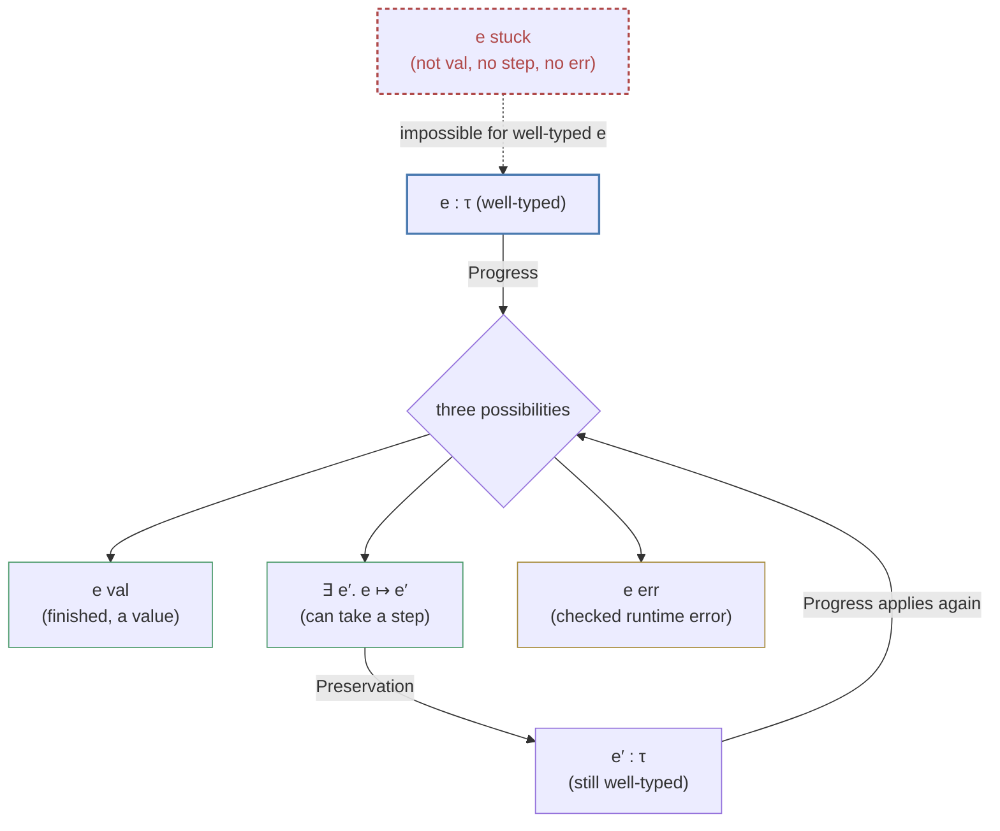

# Type [[Dynamic-Classification#Safety|Safety]]

[[book-guidelines|↩ Back to guidelines]]

## What could possibly go wrong

You've now got two halves of a language definition sitting side by side: a **[[Symbols-and-Dynamic-Binding#Statics|statics]]** that decides, by inspecting syntax alone, whether an expression is well-typed ($\Gamma \vdash e : \tau$), and a **[[Exceptions#Dynamics|dynamics]]** that decides, by simulating execution, what an expression *does* ($e \mapsto e'$). See [[Statics-And-Dynamics|Statics and Dynamics]] if you haven't covered those yet — this article assumes their machinery.

But nothing so far *forces* those two halves to agree with each other. You could, in principle, write down a statics and a dynamics for the same syntax that have nothing to do with one another — a type checker that accepts `plus(num[3]; str["hi"])` while the evaluator, at runtime, has no rule for what to do with a string where it expected a number. The program would type-check and then crash. That's exactly the failure mode every working programmer has hit: a well-typed program that segfaults, throws an unhandled runtime exception, or — worse — silently reads garbage memory because the runtime representation didn't match what the type checker assumed.

Harper's name for the theorem that rules this out is **type [[State-and-Assignables#Safety|safety]]**, and it's worth sitting with why it's not obvious that any given statics/dynamics pair *has* this property. A statics is a free-standing inductive definition; a dynamics is a separate free-standing inductive definition (structural, in this case — see rules (5.4) referenced below). There is no built-in mechanism forcing them to cohere. Coherence is something you *prove*, once, for a given language — and that proof is what this chapter is about.

> "In general type safety expresses the coherence between the statics and the dynamics. The statics may be seen as predicting that the value of an expression will have a certain form so that the dynamics of that expression is well-defined."

That's the whole idea in one sentence: the type is a **prediction** about the shape of the eventual result, made before running anything, and safety is the theorem that the prediction always comes true.

## The safety theorem, stated

Harper states type safety for the running example language $\mathcal{L}\{\texttt{num str}\}$ (numbers and strings, defined via [[Statics-And-Dynamics#The typing judgment|the typing judgment]] and structural dynamics of Chapters 4–5) as a single theorem with two parts:

> **Theorem 6.1 (Type Safety).**
> 1. If $e : \tau$ and $e \mapsto e'$, then $e' : \tau$.
> 2. If $e : \tau$, then either $e\ \mathsf{val}$, or there exists $e'$ such that $e \mapsto e'$.

Part 1 is called **preservation** (sometimes *subject reduction* in the literature): taking a step never changes an expression's type. Part 2 is called **progress**: a well-typed expression is never "finished-but-not-a-value" — it's either already a value, or it can take another step. Safety, as a single property, is defined as the conjunction: **preservation + progress**.

Notice the shape of the guarantee. Preservation alone doesn't rule out getting stuck — a broken program that simply *refuses to move* trivially preserves its type forever (vacuously; there's nothing to check). Progress alone doesn't rule out a step that jumps to an ill-typed successor. You need both, working together, to get the theorem you actually want: iterate stepping as many times as you like, and at every point along the way the expression is well-typed *and* still either a value or able to continue. Neither half is dispensable.

### What breaks without it

Concretely: without preservation, a step of evaluation could turn a well-typed `num`-producing expression into something the rest of the program treats as a `str`, silently corrupting every downstream computation that trusted the type. Without progress, a well-typed expression could reach a dead end with no applicable rule — the formal analogue of a CPU trying to decode an illegal instruction. Real illegal-instruction faults, null-pointer dereferences on objects with the wrong vtable, and reading a tagged union through the wrong tag are exactly what type safety, done correctly, promises can never happen to a well-typed program.

## Stuck states

The theorem needs a name for the bad outcome it rules out:

> An expression $e$ is **stuck** iff it is not a value ($e\ \mathsf{val}$ fails) yet there is no $e'$ such that $e \mapsto e'$.

A stuck expression is a dead letter: the dynamics has nothing more to say about it, and it isn't an answer either. It's the formal object corresponding to "the interpreter doesn't know what to do here" — a `MatchError` with no matching arm, a machine `HALT-AND-CATCH-FIRE`. Safety's payoff is an immediate corollary:

> A stuck state is necessarily ill-typed. Equivalently: **well-typed states never get stuck.**

This corollary is really the *point* of the whole chapter — Theorem 6.1 is stated in terms of preservation and progress because those are what you can prove directly by induction, but the reason you *care* is this contrapositive reading. Nothing well-typed ever wanders into a state the dynamics can't handle.

```rust
// The stuck-state idea, made concrete: an interpreter's step function
// returning `None` is exactly a stuck expression with no applicable rule.
enum Expr {
    Num(i64),
    Str(String),
    Plus(Box<Expr>, Box<Expr>),
}

// A dynamics with a "hole": what happens if `step` hits a case
// the statics should have ruled out already?
fn step(e: &Expr) -> Option<Expr> {
    match e {
        Expr::Plus(a, b) => match (a.as_ref(), b.as_ref()) {
            (Expr::Num(x), Expr::Num(y)) => Some(Expr::Num(x + y)),
            // If the type checker did its job, this arm is dead code —
            // reaching it at runtime would be a *stuck state*: not a
            // value, and no rule applies. Type safety is the theorem
            // that a well-typed `Expr` never reaches this branch.
            _ => None,
        },
        _ => None, // values: nothing to step
    }
}
```

Every time you write an `unreachable!()` or a `panic!("type checker should have caught this")` in an interpreter, you are informally invoking type safety — asserting, without proof, that the statics has already ruled out the case you're refusing to handle. Chapters 6's job is to make that assertion into an actual theorem instead of an act of faith.

## Preservation: steps don't change the type

Preservation is proved by **rule induction on the dynamics** — that is, by induction on the derivation of $e \mapsto e'$, using the structural [[Control-Stacks-and-Abstract-Machines#Transition rules|transition rules]] from Chapter 5 (rules (5.4)). The proof pattern is: for every rule that could have concluded $e \mapsto e'$, show the theorem holds of that rule's conclusion, using the induction hypothesis on its premises.

Two representative cases from the book's proof:

**Case: the search rule for addition**, $\dfrac{e_1 \mapsto e_1'}{\mathsf{plus}(e_1;e_2) \mapsto \mathsf{plus}(e_1';e_2)}$.

Assume $\mathsf{plus}(e_1;e_2):\tau$. By **inversion for typing** (the statics is syntax-directed, so a typing judgment for a given expression form determines what its immediate subexpressions' types must be), $\tau = \mathsf{num}$, $e_1:\mathsf{num}$, and $e_2:\mathsf{num}$. By the induction hypothesis applied to the premise $e_1 \mapsto e_1'$, we get $e_1':\mathsf{num}$, hence $\mathsf{plus}(e_1';e_2):\mathsf{num} = \tau$. Done.

**Case: the instruction rule for `let`**, $\mathsf{let}(e_1;x.e_2) \mapsto [e_1/x]e_2$.

Assume $\mathsf{let}(e_1;x.e_2):\tau_2$. By inversion, $e_1:\tau_1$ for some $\tau_1$ such that $x:\tau_1 \vdash e_2 : \tau_2$. Now apply the **substitution lemma** (from [[Statics-And-Dynamics|Statics and Dynamics]], Chapter 4) — if a term is well-typed under a context extended with $x:\tau_1$, and you have a well-typed $\tau_1$-typed replacement for $x$, substituting it in preserves the type — to get $[e_1/x]e_2 : \tau_2$, exactly as required.

Notice what's structurally recurring here: *inversion* recovers the typing facts a rule's premises must satisfy, and *substitution* is the load-bearing lemma whenever the dynamics itself performs a substitution (as `let`, and later $\beta$-reduction for functions, do). This is why the book proves the substitution lemma early and treats it as infrastructure — preservation for essentially every substitution-based reduction rule in the rest of the book leans on it.

Harper is explicit about *why* induction on the transition judgment, rather than on the structure of $e$ or on the typing derivation, is the right induction principle here: "the argument hinges on examining all possible transitions from a given expression" — you're proving a property of *steps*, so you induct on the thing that produces steps.

### Grounding: preservation as a checker/VM invariant

This is exactly the correctness property you want from a bytecode interpreter or an abstract machine, stated as a formal invariant rather than a hope. If you've ever written a typed stack-based VM, "preservation" is the claim that the type(s) on the stack recorded by your bytecode verifier remain accurate after executing every instruction — a claim JVM- and WASM-style verifiers actually check statically before running any code, for exactly this reason.

```rust
// A tiny typed evaluator where preservation is a *checkable* invariant,
// not just a proof on paper. `Value::type_of` should never disagree
// with what the (external) statics predicted for the pre-step expr.
#[derive(Debug, Clone, PartialEq)]
enum Ty { Num, Str }

#[derive(Debug, Clone)]
enum Value { Num(i64), Str(String) }

impl Value {
    fn type_of(&self) -> Ty {
        match self {
            Value::Num(_) => Ty::Num,
            Value::Str(_) => Ty::Str,
        }
    }
}

// A well-formed step function upholds preservation *by construction*:
// every arm that produces a Value produces one whose type_of() matches
// what the statics assigned to the pre-step expression. If you're
// building a verifier, this is precisely the property you'd want to
// prove once about `step`, rather than re-check on every call.
fn step_plus(v1: &Value, v2: &Value) -> Result<Value, &'static str> {
    match (v1, v2) {
        (Value::Num(a), Value::Num(b)) => Ok(Value::Num(a + b)),
        _ => Err("ill-typed operands — ruled out statically for well-typed input"),
    }
}
```

In Lean, preservation is the theorem you'd state and prove directly against an inductively defined `Step` relation and a `HasType` judgment — this is close to the most literal translation of Harper's proof there is, because Lean's own type theory *is* a statics/dynamics pair (its kernel's definitional-equality reduction is a dynamics; its elaborator's type checking is a statics) whose own metatheory satisfies an analogous preservation property:

```lean
-- Sketch: preservation as a theorem about an inductively defined
-- step relation, proved by induction on the Step derivation —
-- structurally identical to Harper's rule induction on (5.4).
inductive Ty where
  | num | str

inductive Expr where
  | num (n : Nat)
  | str (s : String)
  | plus (e1 e2 : Expr)

inductive HasType : Expr → Ty → Prop
  | num  {n} : HasType (.num n) .num
  | str  {s} : HasType (.str s) .str
  | plus {e1 e2} : HasType e1 .num → HasType e2 .num →
                    HasType (.plus e1 e2) .num

inductive Step : Expr → Expr → Prop
  | plusL {e1 e1' e2} : Step e1 e1' → Step (.plus e1 e2) (.plus e1' e2)
  | plusV {n1 n2}      : Step (.plus (.num n1) (.num n2)) (.num (n1 + n2))

theorem preservation {e e' : Expr} {τ : Ty}
    (ht : HasType e τ) (hs : Step e e') : HasType e' τ := by
  induction hs generalizing τ with
  | plusL hstep ih =>
      cases ht with
      | plus h1 h2 => exact .plus (ih h1) h2
  | plusV =>
      cases ht with
      | plus h1 h2 => exact .num
```

## Canonical forms: what a value of each type must look like

Progress needs one more piece of infrastructure first: given that an expression *is* a value of type $\tau$, what can you actually say about its shape? This is the **Canonical Forms Lemma**:

> **Lemma 6.3 (Canonical Forms).** If $e\ \mathsf{val}$ and $e:\tau$, then
> 1. If $\tau = \mathsf{num}$, then $e = \mathsf{num}[n]$ for some number $n$.
> 2. If $\tau = \mathsf{str}$, then $e = \mathsf{str}[s]$ for some string $s$.

This is deliberately unglamorous for a two-type language, but its role generalizes enormously: for every type former the book introduces later, there's a corresponding canonical forms lemma — a value of function type $\tau_1 \to \tau_2$ is always (up to evaluation) a $\lambda$-abstraction, a value of product type is always a pair, a value of sum type is always an injection. The lemma is what licenses **exhaustive case analysis on the shape of a value once you know its type** — it's the formal justification for "since $e$ has type `num` and is a value, I may assume it's literally a numeral, no other case exists."

### Grounding: canonical forms as exhaustiveness of a match

This is *precisely* what a `match` over an enum with no other variants gives you for free in Rust, and it's worth noticing that the correspondence runs deep, not just by analogy: a canonical-forms lemma is exactly the metatheoretic guarantee that lets a language implementer write a `match` on value shape without a catch-all arm and know the compiler's exhaustiveness checker isn't lying to them about coverage.

```rust
// Canonical Forms says: if e : Ty::Num and e is a value, e is
// *literally* a Value::Num. There's no other case to worry about —
// which is exactly why this match can omit a catch-all arm.
fn as_num(v: &Value, expected: &Ty) -> i64 {
    match (v, expected) {
        (Value::Num(n), Ty::Num) => *n,
        // Canonical Forms is *why* no other arm is reachable here,
        // given the caller already established `v : Ty::Num`.
        _ => unreachable!("canonical forms: a Num-typed value is a Value::Num"),
    }
}
```

In Lean, the corresponding fact is what lets you pattern-match exhaustively on a value known (via a hypothesis `HasType v τ` plus `IsValue v`) to have a given type, without a `| _ => ...` wildcard branch — the kernel's own totality checking is enforcing a canonical-forms-shaped guarantee every time you write such a `match`.

## Progress: well-typed expressions are never dead ends

With canonical forms in hand, progress is proved by **rule induction on the statics** (rules (4.1)) — the mirror image of preservation, which inducted on the dynamics:

> **Theorem 6.4 (Progress).** If $e:\tau$, then either $e\ \mathsf{val}$, or there exists $e'$ such that $e \mapsto e'$.

Sample case, for the typing rule $\dfrac{e_1:\mathsf{num}\quad e_2:\mathsf{num}}{\mathsf{plus}(e_1;e_2):\mathsf{num}}$: by the induction hypothesis on the two premises, either $e_1$ is a value or it can step (if it can step, $\mathsf{plus}(e_1;e_2)$ steps via the search rule and we're done; likewise for $e_2$ once $e_1$ is a value). In the case where *both* $e_1$ and $e_2$ are values, Canonical Forms (Lemma 6.3) tells us $e_1 = \mathsf{num}[n_1]$ and $e_2 = \mathsf{num}[n_2]$ for actual numbers $n_1, n_2$ — and now the instruction rule applies directly: $\mathsf{plus}(\mathsf{num}[n_1];\mathsf{num}[n_2]) \mapsto \mathsf{num}[n_1+n_2]$.

This is the moment Canonical Forms earns its keep: without it, knowing $e_1$ and $e_2$ are values of type $\mathsf{num}$ wouldn't by itself tell you that the instruction rule's syntactic pattern ($\mathsf{num}[n_1], \mathsf{num}[n_2]$) actually matches — you'd know a rule *should* apply, but not which one, or that its left-hand-side pattern is satisfied. Canonical Forms bridges "has this type" to "matches this constructor," which is exactly the gap between a type-level fact and a syntactic fact that a proof needs closed at each instruction step.

Why induction on typing rather than on the structure of $e$? Because the typing rules here happen to be **syntax-directed** (exactly one rule per expression form), so the two coincide in this language — but the book flags that this stops working once a language has typing rules that *aren't* syntax-directed (multiple applicable rules for one expression form, as shows up later with [[Subtyping|subtyping]]). Inducting on the typing derivation itself is the version of the proof that keeps working in that more general setting; inducting on the syntax of $e$ is a shortcut that only survives while syntax-directedness holds.

### What breaks without canonical forms

Imagine trying to prove progress for a language with function types but skipping canonical forms. You'd know $e_1 : \tau_1 \to \tau_2$ and $e_1\ \mathsf{val}$, but without canonical forms you have no license to conclude $e_1$ is a $\lambda$-abstraction — it could, as far as the proof so far is concerned, be some other syntactic form entirely that happens to have a function type. The application rule's instruction step requires syntactically matching a $\lambda$; without canonical forms pinning down the shape, the progress proof for application simply cannot go through. This is the general reason every chapter that introduces a new type former in the rest of the book restates and reproves its own canonical forms lemma before restating progress.

## Checked versus unchecked errors

Preservation and progress, as stated, are theorems about a *total* language — every well-typed closed term either is a value or steps, full stop. But real languages have partial operations: division by zero is the book's example. Extend $\mathcal{L}\{\texttt{num str}\}$ with a naive quotient,

$$\dfrac{e_1 : \mathsf{num} \quad e_2 : \mathsf{num}}{\mathsf{div}(e_1;e_2) : \mathsf{num}}$$

and immediately $\mathsf{div}(\mathsf{num}[3];\mathsf{num}[0])$ is well-typed *and* stuck — no instruction rule's premise is satisfiable, because dividing by zero isn't a number. Progress, as stated in Theorem 6.4, is now **false** for this extended language. Two ways to repair it:

1. **Rule it out statically.** Refine the type system so no well-typed program can ever have a zero denominator (e.g. a refinement type $\mathsf{num}_{\neq 0}$). This is the **unchecked** route: the statics carries the whole burden, and the dynamics performs no runtime check because the type system already guarantees the bad case cannot arise.
2. **Detect it dynamically.** Keep `num` as-is, but give the dynamics an explicit rule that recognizes division by zero and produces an *error* rather than getting stuck. This is the **checked** route.

Harper picks option 2 as the realistic default, for a decisive reason: whether a given arithmetic expression's value will turn out to be zero at runtime is, in general, an *undecidable* static property. A type system precise enough to rule out every possible zero-divisor expression while accepting every legitimate program does not exist for a Turing-complete language — trying to force division-by-zero into the unchecked category would reject far too many perfectly good programs (or require decidability the statics can't have). So: an **unchecked error** is a mismatch the type system provably prevents (no runtime check needed, because the statics already makes it impossible — e.g. `plus` never needs to check its arguments are numbers, since ill-typed additions are rejected before execution). A **checked error** is a mismatch the type system cannot rule out and that must therefore be *detected at run time* and turned into a well-defined outcome, rather than silently falling into a stuck state.

The mechanism for checked errors is a new inductively-defined judgment, $e\ \mathsf{err}$, with rules that both *detect* the error and *propagate* it upward through the syntax:

$$\dfrac{e_1\ \mathsf{val}}{\mathsf{div}(e_1;\mathsf{num}[0])\ \mathsf{err}} \qquad\qquad \dfrac{e_1\ \mathsf{err}}{\mathsf{plus}(e_1;e_2)\ \mathsf{err}} \qquad\qquad \dfrac{e_1\ \mathsf{val}\quad e_2\ \mathsf{err}}{\mathsf{plus}(e_1;e_2)\ \mathsf{err}}$$

and, once the judgment exists, a primitive `error` expression can be added with $\Gamma \vdash \mathsf{error} : \tau$ for *every* $\tau$ (an error is valid wherever any value would be) and $\mathsf{error}\ \mathsf{err}$ as its dynamics.

Preservation is untouched by this addition — an error state doesn't step to anything, so there's nothing new to preserve. Progress, however, needs a third disjunct:

> **Theorem 6.5 (Progress With Error).** If $e:\tau$, then either $e\ \mathsf{err}$, or $e\ \mathsf{val}$, or there exists $e'$ such that $e \mapsto e'$.

Note carefully what's *not* claimed: it's not that errors are ruled out (they're a legitimate, well-typed outcome now), only that **stuck states still are**. Type safety hasn't weakened — it's been generalized to admit a controlled, well-defined form of runtime failure alongside "runs fine" and "keeps going," while still excluding the genuinely undefined case.



### Grounding: checked vs. unchecked as "does the type system prove it, or does the runtime check it"

This distinction is one every systems programmer already has working intuition for, even without the vocabulary. In Rust, array-bounds access is a **checked** error at runtime (`panic!` on out-of-bounds, or `Result`/`Option` if you use `get`) because Rust's static type system does not track array lengths precisely enough to rule out bad indices at compile time (a dependently-typed language *could* make it unchecked, at the cost of much more demanding types). Integer division by zero in Rust is likewise checked — it panics — for exactly Harper's reason: statically proving a divisor nonzero in general is undecidable, so the language falls back to a runtime check plus a well-defined failure (a panic, not undefined behavior).

```rust
// Rust's own checked/unchecked line, in miniature:
fn divide(a: i64, b: i64) -> Result<i64, &'static str> {
    if b == 0 {
        // the "e err" judgment, made explicit and total instead of
        // letting the dynamics get stuck (or, worse, UB, as in C)
        Err("division by zero")
    } else {
        Ok(a / b) // safe: b != 0 established immediately above
    }
}

// Compare: `a + b` for two `i64`s needs NO runtime type check at all —
// Rust's statics (the borrow/type checker) has already made "adding a
// non-number" impossible to express, so this is an *unchecked* error
// class in Harper's sense: ruled out entirely before runtime.
fn add(a: i64, b: i64) -> i64 { a + b }
```

The `error : τ` construct — well-typed at *every* type simultaneously — is also a familiar shape: it's the formal ancestor of Rust's `panic!()` (which unifies with any expected type via the never type `!`) and of [[Exceptions|exceptions]] in languages that let a `throw` expression appear anywhere a value is expected.

## Where this leads

Preservation and progress are not a one-off proof obligation you discharge once for $\mathcal{L}\{\texttt{num str}\}$ and then forget — they are the **recurring correctness criterion the rest of the book re-establishes for every new language feature it adds.** Every subsequent chapter that introduces a type former (functions, products, sums, [[Recursive-Types|recursive types]], polymorphism, subtyping...) restates its own canonical forms lemma and re-proves preservation and progress for the extended language, because adding new syntax and new typing rules can silently break a safety proof that held before. Chapter 7 (Evaluation Dynamics) revisits safety again in the "big-step" $e \Downarrow v$ style, and flags a genuine methodological weakness the checked/unchecked machinery here doesn't have in evaluation-dynamics form: you must define a "going wrong" judgment explicitly just to have something for progress to rule out, since big-step evaluation has no intermediate stuck states to point at directly.

For the standing projects this vault is tracking: **preservation is the exact theorem shape a Rust-based verifier needs for Hoare-triple soundness** — "if a program state satisfies its specification and the program takes a step, the resulting state still satisfies the (possibly updated) specification" is preservation with types generalized to logical assertions. The proof technique transfers directly: rule induction on the operational semantics, with a substitution lemma doing the heavy lifting at every binding construct. **Canonical forms is the mechanism an elaborator or checker leans on every time it does exhaustive case analysis on a value's shape given its type** — precisely the move a bidirectional type checker makes when checking mode uses a known expected type to narrow which constructor an expression must reduce to. And the checked/unchecked distinction is a direct model for how much a verifier's static side should be trusted to prove outright versus where it should insert a runtime obligation (an assertion, a dynamic contract check) instead — the same undecidability argument Harper makes about division by zero is the argument for why *any* sufficiently expressive verifier will always have some checked, not unchecked, obligations left over.
