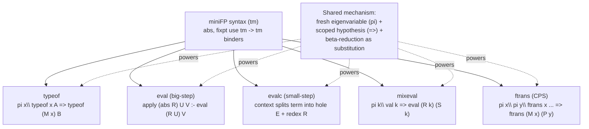

# Computing over Functional Programs

[[book-guidelines|↩ Back to guidelines]]

## Why this chapter exists

Every earlier chapter of this book has been building a case: $\lambda$Prolog isn't just a curiosity where you can express things like natural-deduction proof systems or module scoping — it's a genuinely good *host language* for writing interpreters, program analyses, and program transformers. Chapter 10 cashes that check. It builds a small, concrete functional language — **miniFP** — inside $\lambda$Prolog and then writes several different pieces of tooling for it: two styles of evaluator, a partial evaluator, and a continuation-passing-style (CPS) transformer. The chapter is not about miniFP as a language design; miniFP is deliberately minimal (booleans, integers, lists, conditionals, one form of recursion). It's a vehicle for showing what you get "for free" when your host language already has binders and unification built in.

If you've ever written an interpreter in Rust or Python, you know the annoying part is never the arithmetic — it's the variable binding. You need an environment, you need to worry about capture when you substitute, you need to decide whether closures capture by reference or by value, and if you write a symbolic manipulator (a partial evaluator, a CPS transform) you re-derive "fresh variable generation" from scratch every time. This chapter's real content is: **when program syntax is represented using $\lambda$-tree syntax (Chapter 7's technique — binders in the object language become literal $\lambda$-abstractions in the meta language), substitution becomes $\beta$-reduction, which the underlying $\lambda$Prolog engine already implements correctly, with capture-avoidance guaranteed by construction.** Everything downstream — the evaluator, the partial evaluator, the CPS transform — inherits that for free.

## 10.1 The miniFP language: syntax first, typing second

### The untyped core

miniFP is introduced deliberately *untyped first*, even though it's meant to be a typed language. This is a design choice worth sitting with, because it's the same move Lean's elaborator makes internally: separate "what terms exist" from "which terms are well-typed."

The syntax is one `tm` type with these constructors (Figure 10.1):

```prolog
kind tm          type.

% Lambda calculus with special forms
type abs      (tm -> tm) -> tm.                % function abstraction
type @        tm -> tm -> tm.                  % application
infixl        @ 4.                             % application is infix
type cond     tm -> tm -> tm -> tm.            % conditional
type fixpt    (tm -> tm) -> tm.                % recursive functions
type cns      tm -> tm -> tm.                  % list constructor

% Builtin datatypes and builtin functions over them
type i                            int -> tm. % integers coercion
type and, or, ff, tt                     tm. % for booleans
type cons, car, cdr, nullp, consp, null tm. % for lists
type greater, zerop, minus, sum, times   tm. % for integers
type equal                               tm. % general equality
```

Two constructors are the interesting ones: `abs : (tm -> tm) -> tm` and `fixpt : (tm -> tm) -> tm`. Both take a *meta-level function* `tm -> tm` as their argument, rather than, say, a variable name paired with a body. This is $\lambda$-tree syntax exactly as introduced in Chapter 7: a miniFP function `\x. body` isn't represented as `Abs("x", body_ast)` the way you'd write it in an ordinary Rust AST (`enum Expr { Abs(String, Box<Expr>), ... }`); it's represented as an actual $\lambda$Prolog abstraction `abs (x\ ...)`. The object-language binder rides on the meta-language binder.

**[[Hereditary-Harrop-Formulas-and-Modular-Search#What breaks without this|What breaks without this]]:** if miniFP's AST were the "string name + body" encoding, every piece of code that walks under a binder — the evaluator reducing inside a closure, the CPS transformer, the partial evaluator peeking under an `abs` — would need its own alpha-renaming logic to avoid variable capture, and you'd be one off-by-one bug away from a classic "substituted the wrong `x`" defect. Chapter 10's evaluator, shown below, never once mentions a variable name.

The book gives four sample programs via the `prog` predicate (Figure 10.2) — `fib`, `mem` (list membership), `appnd` (append), `map` — all built from `fixpt` and `abs`:

```prolog
type prog     string -> tm -> o.
prog "fib" (fixpt fib\ abs n\
  cond (zerop @ n) (i 0)
       (cond (equal @ n @ (i 1)) (i 1)
             (sum @ (fib @ (minus @ n @ (i 1))) @
                    (fib @ (minus @ n @ (i 2)))))).
```

Read `fixpt fib\ abs n\ ...` as: "the fixed point, over a self-reference named `fib`, of the function that takes `n` and computes...". `fib` inside the body is a bound eigenvariable standing for "myself," not a global name being looked up — this matters once we get to the evaluator's fixed-point rule.

### Untyped terms overshoot valid programs — hence `typeof`

Because `tm` is just a raw grammar, plenty of well-formed $\lambda$Prolog terms of type `tm` are *not* sensible miniFP programs — the book's example is `(cons @ (i 4) @ (i 5))`, syntactically fine, but `cons`'s second argument here isn't a list. So a *separate* judgment, `typeof`, is layered on top to pick out the well-typed subset (Figure 10.3):

```prolog
kind ty                     type.
type int, bool              ty.
type lst                    ty -> ty.
type arr                    ty -> ty -> ty.
type typeof                 tm -> ty -> o.

typeof (M @ N) A                :- typeof M (arr B A), typeof N B.
typeof (cond P Q R) A           :- typeof P bool, typeof Q A, typeof R A.
typeof (abs M) (arr A B)        :- pi x\ typeof x A => typeof (M x) B.
typeof (fixpt M) A              :- pi x\ typeof x A => typeof (M x) A.
```

**Why untyped-then-restricted, rather than baking types into the `tm` constructors directly?** Two reasons the book's own material supports. First, practically: it decouples the representation concern (how do I encode binding structure faithfully) from the typing concern (which terms are legal), so each can be gotten right independently — exactly the same separation-of-concerns argument for why a compiler's parser shouldn't also be its type checker. Second, and this is the sharper point: the `abs` and `fixpt` clauses show the *hypothetical judgment* pattern this book has used since natural deduction in Chapter 9 — `pi x\ typeof x A => typeof (M x) B` reads as "for a fresh `x`, *assuming* `x : A`, derive that the body applied to `x` has type `B`." This is a typing rule with a variable-binding premise, phrased using $\lambda$Prolog's own universal quantification (`pi`) and implication (`=>`) — the same machinery, not an ad hoc side-condition mechanism bolted onto a typechecker's context-passing code.

**Grounding — Rust and Lean.** In a Rust type checker you'd write something like:

```rust
fn typeof(env: &Env, e: &Tm) -> Result<Ty, TypeError> {
    match e {
        Tm::Abs(x, body) => {
            let arg_ty = fresh_ty_var();
            let mut env2 = env.clone();
            env2.insert(x.clone(), arg_ty.clone());
            let body_ty = typeof(&env2, body)?;
            Ok(Ty::Arr(Box::new(arg_ty), Box::new(body_ty)))
        }
        ...
    }
}
```

The `env.insert` / `env.clone()` dance — pushing a fresh binding, discharging it on the way back out — is exactly what `pi x\ typeof x A => typeof (M x) B` does declaratively: `pi x\` introduces the fresh variable (no `env2.insert` needed, the eigenvariable *is* the fresh binding), and `=>` is a scoped hypothetical addition to the ambient program clauses that's automatically retracted once the sub-derivation of `typeof (M x) B` finishes. In Lean's kernel, this is the shape of every binder-typing rule: `Expr.lam x ty body` typechecks by extending the local context with `x : ty`, typechecking `body` in that extended context, and the extension is scoped to exactly that recursive call — `pi x\ typeof x A => ...` *is* that discipline, just with $\lambda$Prolog's proof search doing the context bookkeeping instead of you writing it by hand.

Also worth flagging for the standing project: this typing relation is genuinely polymorphic without any special-casing. `typeof (abs w\ w) (arr A A)` succeeds with `A` a free (logic) variable — the identity function gets assigned `arr int int`, `arr bool bool`, or the fully general `pi t\ typeof (abs w\ w) (arr t t)`, all from the *same* clause set. That's Hindley–Milner-style polymorphism falling out of ordinary first-order-ish unification over `ty`-terms, with zero extra machinery — worth remembering when you get to `let`-polymorphism's actual difficulty later in the chapter.

## 10.2 Two ways to specify evaluation

The chapter's central methodological point: there's more than one legitimate way to formalize "what a program evaluates to," and the book shows both, in the same host language, so you can compare them side by side.

### 10.2.1 Big-step evaluation

A **big-step** specification relates a term directly to its final value in one predicate, `eval M V`, collapsing however many intermediate steps it takes. (Contrast with **small-step**: relate a term only to the *next* term after one reduction — the chapter previews that this is what the $\pi$-calculus chapter will use for its transition relation.)

```prolog
type eval            tm -> tm -> o.
type val             tm -> o.
type apply           tm -> tm -> tm -> o.

val (abs _) & val (i _) & val tt    & val ff & val null.
val (cns _ _) & val (spec _ _ _).

eval V V               :- val V.
eval (M @ N) V         :- eval M F, eval N U, apply F U V.
eval (fixpt R)    V    :- eval (R (fixpt R)) V.
eval (cond C L R) V    :- eval C B, if (B = tt) (eval L V)
                                                (eval R V).
eval F (spec I F nil) :- special I F.

apply (abs R) U V :- eval (R U) V.
```

Two lines carry all the technical weight:

- `apply (abs R) U V :- eval (R U) V.` The function `R` here has $\lambda$Prolog type `tm -> tm` (it came from unifying against `abs R`). `(R U)` is a meta-level function *application*, so this line performs substitution of the argument `U` for the bound variable purely via $\lambda$Prolog's own $\beta$-reduction, invoked implicitly the moment `(R U)` is evaluated by the underlying engine. There's no `substitute(body, var, value)` helper function anywhere in this program — capture-avoiding substitution is not code you write here, it's a primitive of the host language.
- `eval (fixpt R) V :- eval (R (fixpt R)) V.` — recursion by **unfolding**: to evaluate a fixed point, evaluate the body applied to *the whole fixed-point term itself*. This is literally the mathematical definition of a fixed point ($f(\mathrm{fix}\ f) = \mathrm{fix}\ f$) turned directly into an operational rule, and it terminates in practice only because `R (fixpt R)` typically produces an `abs`, so the next unfolding is driven lazily by function application, not eagerly re-triggered.

**What breaks without $\lambda$-tree syntax here:** if `abs` carried a string-named body instead of a `tm -> tm` function, `apply (abs R) U V :- eval (R U) V` couldn't exist as a one-liner — you'd need an explicit substitution function walking the AST, renaming bound occurrences that happen to clash with free variables in `U`, which is exactly the class of bug (capture) that historically plagued naive interpreter implementations.

Built-in functions (`car`, `cons`, `minus`, ...) get a slightly fussier treatment via a `spec` constructor that accumulates partially-applied arguments — worth reading but mechanically standard currying, not conceptually new.

**Rust grounding.** This whole evaluator is a shape any Rust engineer will recognize instantly once you see it side by side:

```rust
enum Tm {
    Abs(Box<dyn Fn(Tm) -> Tm>),   // closure standing in for `tm -> tm`
    App(Box<Tm>, Box<Tm>),
    Cond(Box<Tm>, Box<Tm>, Box<Tm>),
    Fixpt(Box<dyn Fn(Tm) -> Tm>),
    // ...
}

fn eval(t: Tm) -> Tm {
    match t {
        Tm::App(m, n) => {
            let f = eval(*m);
            let u = eval(*n);
            apply(f, u)
        }
        Tm::Fixpt(r) => eval(r(Tm::Fixpt(r.clone()))),  // unfold
        Tm::Cond(c, l, r) => if is_true(eval(*c)) { eval(*l) } else { eval(*r) },
        v => v,  // already a value
    }
}
```

This is a legitimate — if slightly unusual — encoding technique in Rust: representing a binder as a genuine Rust closure `Box<dyn Fn(Tm) -> Tm>` rather than as a data constructor holding a name, precisely to offload substitution onto Rust's own closure-capture machinery. It's the same idea $\lambda$-tree syntax exploits in $\lambda$Prolog, just with $\lambda$Prolog getting it "for free" at the level of the whole logic (including full unification against these functional terms), where Rust's closures only let you *apply*, never *unify against or pattern-match the shape of*.

### 10.2.2 Small-step evaluation via evaluation contexts

The second specification (Figure 10.5) takes a different, more mechanical stance: repeatedly find the next redex, rewrite it, repeat until you hit a value. This needs three pieces:

- `redex F` — is `F` itself directly reducible right now?
- `reduce R N` — how does redex `R` rewrite to `N`? (e.g. `reduce ((abs R) @ N) (R N)` — beta-reduction; `reduce (fixpt R) (R (fixpt R))` — unfolding)
- `context M E R` — decompose `M` into "the redex `R` to fire next" plus "the surrounding context `E`, as a function `tm -> tm` you plug the reduced redex back into."

```prolog
context R (x\ x) R :- redex R.
context (cond M N P) (x\ cond (E x) N P) R :-
  non_val M, context M E R.
context (M @ N) (x\ (E x) @ N) R :-
  non_val M, context M E R.
context (V @ M) (x\ V @ (E x)) R :-
  val V, non_val M, context M E R.

evalc V V :- val V.
evalc M V :- context M E R, reduce R N, evalc (E N) V.
```

Notice `context` itself returns a function `E : tm -> tm` — "the hole, as an abstraction" — using $\lambda$-tree syntax again, this time to represent *where inside a term* the next computational step happens, not to represent a program binder. This is a nice reminder that $\lambda$-tree syntax is a general representational tool, not something reserved for object-language variables specifically: anywhere you need "a term with a marked, pluggable slot," a `tm -> tm` function does the job and gives you plugging-in for free via application.

The book's worked example: `context (cond ((abs x\ ff) @ tt) (i 2) (i 3)) E R` finds `R = (abs x\ ff) @ tt` and `E = w\ cond w (i 2) (i 3)` — literally "the conditional, with a hole where the redex sits."

**Why present both styles at all?** The book's own framing (and the bibliographic notes, §10.4) situates big-step as Kahn's *natural semantics* and evaluation-context small-step as Felleisen–Hieb's approach — these are genuinely two live traditions in the operational-semantics literature (the book also name-drops Plotkin's structural operational semantics as the more common small-step flavor). Practically: big-step is closer to "how you'd actually implement an interpreter" (direct recursive evaluation), while small-step / evaluation-context style is closer to "how you'd reason about individual reduction steps" — useful when you want to talk about non-terminating programs, interleaving (as in the $\pi$-calculus chapter next), or step-indexed properties, none of which a big-step relation can even express (a diverging computation simply has no `eval` derivation at all).

### The equality trap: raw term equality overshoots program equality

This is one of the sharpest observations in the chapter, and it's a genuine "gotcha" worth internalizing rather than skimming. The built-in `equal` in `eval_spec` is initially implemented via plain $\lambda$Prolog term equality (`=`):

```prolog
eval_spec equal (C::B::nil) V   :- if (B = C) (V = tt) (V = ff).
```

But $\lambda$Prolog's `=` is *syntactic equality up to $\alpha\beta\eta$-conversion over the full term language, including terms with abstraction*. So:

```prolog
?- eval (equal @ (abs x\x) @ (abs y\y)) V.
```

returns `V = tt` — the two identity functions are recognized as literally the same term (up to alpha-renaming). That's actually *correct* mathematically (they are the same $\lambda$-term), but it's *stronger* than what real functional languages permit: OCaml, Haskell, Rust — none of them let you ask "are these two closures equal?" at all; function equality is either a compile error or undecidable-and-forbidden. So $\lambda$Prolog's `equal` built into miniFP quietly does something no target functional language actually does, purely because the host equality is more powerful than intended.

The fix the book gives is to define a narrower, explicit structural equality restricted to first-order data:

```prolog
type eq    tm -> tm -> o.
eq (i N) (i N) & eq tt tt & eq ff ff.
eq null null.
eq (cns X Y) (cns U V) :- eq X U, eq Y V.
```

— no clause for `abs`, so functions are (correctly, by omission) never comparable. **The general lesson:** when you embed one language inside another and inherit the host's primitive operations for free (equality, unification, pattern matching), you have to audit whether the host's notion is *exactly* the guest language's intended notion, or merely a superset of it. This is precisely the kind of trap that shows up in a from-scratch elaborator too — Lean's kernel is careful to define *definitional equality* (`isDefEq`) as a specific, intentionally-restricted notion, distinct from raw term identity, exactly to avoid conflating "syntactically the same after normalization" with whatever ambient notion of equality the implementation language happens to offer.

## 10.3 Manipulating programs: transformations as logic programs

Having two evaluators in hand, the chapter pivots to *program transformations* — code that turns one miniFP program into a different, semantically related one. This is where the payoff of $\lambda$-tree syntax gets most vivid, because transformations are exactly the workloads where naive substitution-by-hand is most error-prone.

### 10.3.1 Partial evaluation and evaluation under a binder

The plainest form of partial evaluation is just *unfolding* a `fixpt` one level without otherwise evaluating anything:

```prolog
?- prog "map" (fixpt Body), Unfold = (Body (fixpt Body)).
```

— literally reusing the same unfolding rule the evaluator used, but stopping after one step instead of driving to a value. Nothing new mechanically; the point is that the *same* meta-level application trick that gave you evaluation also gives you controlled, partial unfolding, because "unfold one level" and "evaluate fully" differ only in how far you recurse, not in what operation you perform.

More interesting is **mixed evaluation** — evaluating *underneath* a binder, which the ordinary `eval`/`evalc` predicates deliberately refuse to do (`eval (abs R) = abs R`, unconditionally, no matter what redexes lurk inside `R`):

```prolog
type mixeval    tm -> tm -> o.
mixeval (abs R) (abs S) :- pi k\ val k => eval (R k) (S k).
```

Read this closely — it's a small but genuinely clever trick. `pi k\` introduces a fresh eigenvariable `k`; `val k =>` *assumes*, as a hypothesis, that this fresh symbolic constant counts as a value (even though it isn't one — it's an unknown placeholder standing for "whatever argument eventually gets supplied"); then it evaluates the *body* `R k` as if `k` were a genuine value. Because `val k` is now hypothetically true, the evaluator's rules that check `val` for various purposes (e.g. not looking further at "already a value") apply to `k` too, letting evaluation proceed *past* the point where a real, unknown argument would eventually sit, simplifying everything around it. This is symbolic execution with a single symbolic variable, expressed as three lines using only mechanisms already in the language (fresh eigenvariables, hypothetical program extension) — no new interpreter infrastructure required.

The example: evaluating `append @ [1,5]` to WHNF then `mixeval`-ing under any residual binder collapses the `append` call entirely, yielding

```prolog
abs w\ cons @ (i 1) @ (cons @ (i 5) @ w).
```

— i.e. append is specialized away into direct cons-ing, for *any* eventual second list `w`. The book states a genuine correctness property here, worth preserving verbatim in spirit: *if `mixeval` relates `(abs R)` to `(abs S)`, and `T` is a value, then evaluating `(R T)` yields the same value as evaluating `(S T)`.* That's a soundness theorem about a program transformer, stated and immediately believable because the transformer's definition is so close to the evaluator's own semantics that the proof is nearly by construction.

**Load-bearing note for the standing project:** this "assume a fresh eigenvariable stands for an arbitrary future value, and reason under that hypothesis" move is structurally identical to how a bidirectional elaborator handles a lambda under a `check` mode with an unknown-but-fresh argument type, and it's the same discipline that makes Hoare-triple soundness proofs work: you introduce a fresh variable for "the (unknown) input," assume its typing/precondition hypothetically, and derive a conclusion that then holds *for all* concrete instantiations by the eigenvariable's own freshness discipline. `pi k\ val k => eval (R k) (S k)` is a miniature of exactly that pattern.

### 10.3.2 Continuation-passing style: where administrative redexes force a design choice

The final transformation is the **Fischer CPS transformation**, restricted to just the pure $\lambda$-calculus fragment of miniFP (`abs` and `@` only). Mathematically, it's defined by two mutually-referential clauses over values $V$ and arbitrary terms $M, N$:

$$
\mathcal{F}[\![V]\!] = \bar\lambda k\, (k\ \langle\!\langle V \rangle\!\rangle)
\qquad
\mathcal{F}[\![M\ N]\!] = \bar\lambda k\, \bigl(\mathcal{F}[\![M]\!]\ (\bar\lambda m\, (\mathcal{F}[\![N]\!]\ \bar\lambda n\, (m\ k\ n)))\bigr)
$$
$$
\langle\!\langle x \rangle\!\rangle = x
\qquad
\langle\!\langle \lambda x.\,M \rangle\!\rangle = \lambda k\,\lambda x\, (\mathcal{F}[\![M]\!]\ k)
$$

— $\mathcal{F}$ transforms an arbitrary term into a function expecting a continuation $k$; $\langle\!\langle\cdot\rangle\!\rangle$ transforms a value in place. The first pass of the $\lambda$Prolog encoding (Figure 10.6) is a nearly line-for-line transcription:

```prolog
ftrans (abs V) (abs k\ k @ U) :- phi (abs V) U.
ftrans (M @ N) (abs k\ P @ (abs m\ Q @ (abs n\ m @ k @ n))) :-
    ftrans M P, ftrans N Q.

phi (abs M) (abs k\ abs x\ (P x) @ k) :-
    pi x\ pi y\ ftrans x (abs k\ k @ y) => ftrans (M x) (P y).
```

The `phi (abs M) ...` clause is worth staring at: to transform under the binder `M : tm -> tm`, it introduces a fresh `x` (the object-level bound variable) and hypothetically asserts `ftrans x (abs k\ k @ y)` — "if we ever encounter this fresh `x`, its CPS translation is `\k. k y`" — for a co-introduced fresh `y` standing for `x`'s eventual CPS-transformed self, then recursively transforms `(M x)` under that assumption. It's the same eigenvariable-plus-hypothetical-clause discipline as `typeof`'s `abs` rule and `mixeval`, now doing compositional program transformation instead of typing or evaluation. That's the chapter's real throughline: one representational idea (fresh eigenvariables + scoped hypothetical program clauses) implements typing-under-binders, evaluation-under-binders, *and* transformation-under-binders, with the same three-line shape each time.

Running this on `(\lambda u. u)\ (\lambda u. u)` produces a correct but bloated result — CPS transformation famously introduces many extra $\beta$-redexes purely as artifacts of the compositional translation scheme, called **administrative redexes**. The book's fix is a genuinely nice two-phase design (Figure 10.7): mark every administrative abstraction with a *new* constructor `adm : (tm -> tm) -> tm`, distinct from ordinary `abs`, so that after the CPS pass a second pass can find and beta-reduce exactly the `adm`-introduced redexes (via `admred`) and nothing else, finally demoting surviving `adm`s back to ordinary `abs`:

```prolog
admred ((adm R) @ N) (R N).
red1 M N :- admred M N.
red1 (M @ N) (M' @ N) & red1 (N @ M) (N @ M') :- red1 M M'.
red1 (adm R) (abs S) & red1 (abs R) (abs S) :-
     pi x\ red1 (R x) (S x).

red M N :- red1 M P, !, red P N.
red M M.
```

This is a clean illustration of a broader technique: when you need to distinguish "redexes I introduced as scaffolding" from "redexes the user actually wrote," don't try to detect the difference after the fact — *tag it at construction time* with a distinct constructor, then write your cleanup pass to target only the tag. It's the same idea as marking synthetic/desugared AST nodes in a compiler pass so a later simplification pass can specifically target (or specifically avoid) them.

## What breaks without $\lambda$-tree syntax: the chapter in one sentence

Every technique in this chapter — the big-step evaluator's `apply`, the small-step evaluator's context-splitting, `mixeval`'s under-binder evaluation, and the CPS transform's under-binder recursion — depends on the same fact: an object-language binder is represented as a literal meta-language function, so "go under the binder and do something with the bound variable made concrete" is just *function application*, and "put a computed replacement back in place of the bound variable" is just *unification/reduction the host engine already performs correctly*. If miniFP used a name-and-lookup encoding instead, every one of these predicates would need bespoke, error-prone substitution code, and correctness proofs like the `mixeval` soundness claim would require an explicit alpha-equivalence lemma instead of following almost by inspection.



## Where this leads

This chapter is the pivot from "logic programming can encode *proof systems*" (Chapters 8–9) to "logic programming can encode *any* syntax-directed computation, including symbolic program manipulation" — and it sets up Chapter 11 directly: the $\pi$-calculus chapter reuses the small-step, evaluation-context flavor of specification from §10.2.2 (the book explicitly flags this), now applied to process transitions instead of expression reduction, and leans even harder on nested `pi`/`=>` for freshness and scope-extrusion side-conditions. The bibliographic notes also point forward to a genuinely important idea for the standing project: Hannan and Miller showed these $\beta$-reduction-based big-step specifications can be *systematically transformed* into specifications using explicit closures instead of implicit substitution — i.e., there's a known, principled path from "substitution is free because the host language gives it to us" (what this chapter does) to "substitution is an explicit data structure I control" (what an actual Rust-based interpreter or elaborator needs, since Rust doesn't have $\lambda$Prolog's unification-and-reduction engine built in). That's the translation you'll eventually have to make by hand when this chapter's elegance meets a real Rust implementation: the *specification* style shown here (fresh eigenvariables, hypothetical typing, beta-substitution) is exactly the right one to write down and reason about first — proving `mixeval`'s soundness property here is tractable precisely because substitution is invisible — and only afterward do you compile it down to explicit environments and closures, the way Hannan and Miller's transformation makes precise.

The `typeof` relation's effortless polymorphism (§10.1) is also directly relevant to the elaborator project: it's a working demonstration that unification over a "types are terms too" representation gives you let-free Hindley–Milner polymorphism without any special-cased generalization step — and the chapter is honest that this stops working once `let`-polymorphism (needing something like Algorithm W) enters the picture, which is exactly the boundary where a from-scratch elaborator has to start doing real, non-trivial work rather than getting it for free from unification.

## Source notes

Drawn from pp. 247–260 (Chapter 10) of the PDF, covering §10.1 (miniFP syntax and typing), §10.2 (big-step and evaluation-context evaluation, plus the raw-equality-versus-program-equality discussion), §10.3 (partial/mixed evaluation and the two-phase Fischer CPS transformation), and the bibliographic notes in §10.4. The chapter is compact and dense but not thin — every subsection carries a complete, runnable code figure plus at least one worked query, so this article stays close to the source's own examples rather than needing to supplement them.
