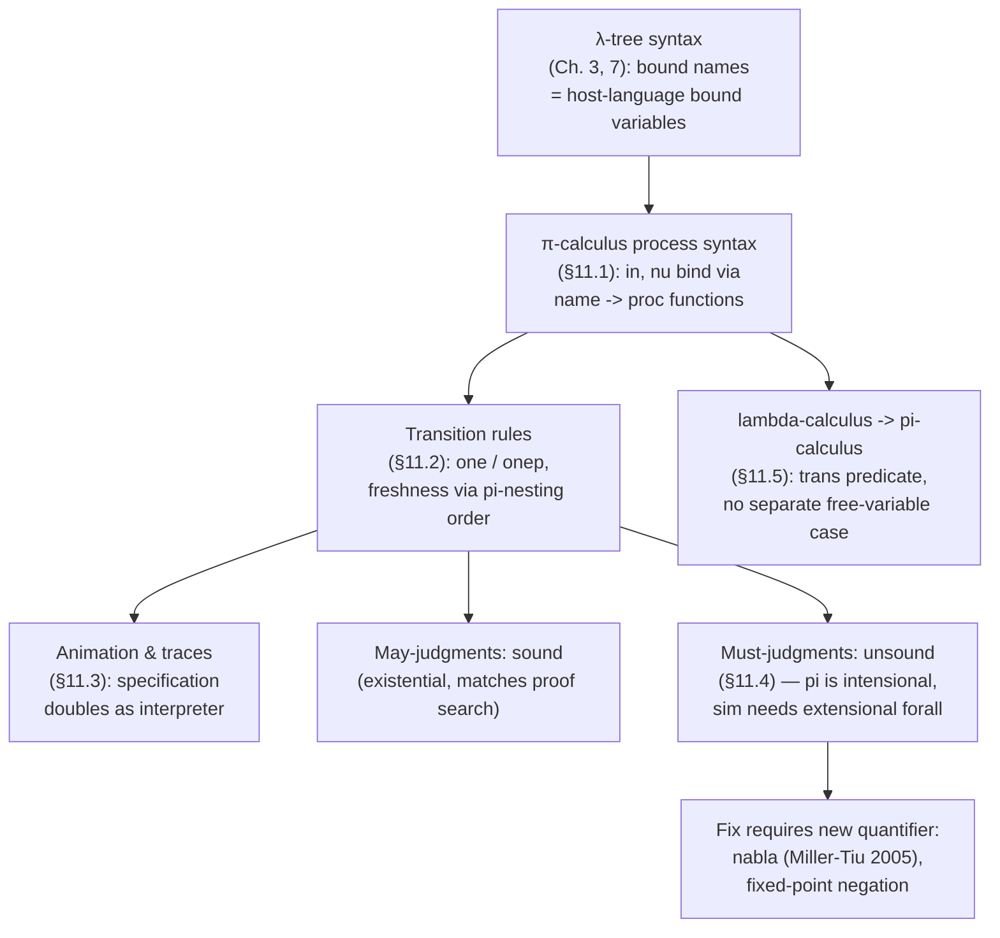

# Encoding the π-Calculus

[[book-guidelines|↩ Back to guidelines]]

## Why a process calculus belongs in a book about logic programming

Every earlier chapter of this book encodes something *static*: a formula, a proof object, a functional program's abstract syntax tree. The π-calculus is different in kind — it's a language for describing systems that interact over time, where the interesting content is *who can talk to whom, and when the set of people who can talk changes*. A channel name can be sent as a message; once received, the receiver can now use that name to talk back. This is called **scope extrusion**, and it is exactly the kind of thing that first-order encodings of syntax handle badly: you end up bolting a separate "is this name still fresh here" side-condition onto every inference rule, checked by an auxiliary function that's easy to get subtly wrong.

The chapter's thesis is that this is a *binding* problem in disguise, and λProlog already has a first-class, checked-by-the-kernel mechanism for binding: λ-abstraction, quantifiers, and their interaction under the eigenvariable/nominal-freshness discipline that hereditary Harrop formulas already give you (Chapter 3's `pi` quantifier, developed further in Chapter 9 for proof systems). If you've internalized "a bound variable in the specification language is a genuinely fresh name, and the kernel enforces that no formula can leak information about it," then the π-calculus's side conditions — the ones that read "provided $w$ is not free in $P$" — stop being something you write custom code to check. They become consequences of how `pi` quantifiers nest. That's the through-line for the whole chapter, and it's worth holding onto because Sections 11.2 and 11.4 are really about two different regimes of that same idea: one where it works beautifully (transition rules), and one where it breaks (must-properties like simulation).

## 11.1 — Representing π-calculus processes

### The calculus itself

The book first fixes the syntax it's encoding (p. 261–262). A process $P$ is built from:

$$P ::= 0 \mid P \mid P \mid P + P \mid x(y).P \mid \bar{x}y.P \mid [x=y].P \mid \tau.P \mid (y)P \mid {!}P$$

In words: the inert process $0$; parallel composition $P \mid P$; nondeterministic choice $P + P$; an **input prefix** $x(y).P$ — receive a name on channel $x$, bind it to $y$, continue as $P$; an **output prefix** $\bar{x}y.P$ — send name $y$ on channel $x$, continue as $P$; a match guard $[x=y].P$; a silent step $\tau.P$; **restriction** $(y)P$ — $y$ is a private name known only inside $P$; and replication ${!}P$, unboundedly many parallel copies of $P$ (used only in §11.5).

Two of these constructs bind a name: input ($x(y).P$ binds $y$ in $P$) and restriction ($(y)P$ binds $y$ in $P$). Everything else is a first-order-shaped combinator.

### The λProlog encoding

Rust readers: think of this as declaring two new opaque token types and a sum-type-like family of constructors over one of them, except the "sum type" is realized as separate typed constants rather than an `enum`, because λProlog has no native sum types — you get open, extensible signatures of typed constants instead, closer to a family of free functions than a closed `enum`.

```prolog
kind name           type.

kind proc           type.
type null           proc.
type plus, par      proc -> proc -> proc.
type in             name -> (name -> proc) -> proc.
type out, match     name -> name -> proc -> proc.
type taup           proc -> proc.
type nu             (name -> proc) -> proc.
type bang           proc -> proc.
```

The two binding constructs are the ones to look at closely: `in` has type `name -> (name -> proc) -> proc` and `nu` has type `(name -> proc) -> proc`. The first argument of `in` is the channel being received on; the *second* argument is not a `name`, it's a function `name -> proc` — a λProlog abstraction. This is **λ-tree syntax**: instead of writing "$x(y).P$ where $y$ is free in $P$" and separately stipulating an alpha-equivalence relation on the string-based representation, you write `in X (y\ P)`, and the bound occurrence of the π-calculus name $y$ *is* the bound variable of a λProlog function. Alpha-conversion, substitution, and "is $y$ free in $P$" all fall out of the host language's own $\lambda$-calculus machinery — the same machinery Chapter 7 used to encode the untyped $\lambda$-calculus's own binders, now reused one level up to encode *another* language's binders. `nu`, for restriction, works the same way: `nu (y\ P)` for $(y)P$.

Concretely, $(b(y).0) \mid (\bar{b}a.0)$ becomes:

```prolog
par (in b y\ null) (out b a null)
```

and $(x)((x(y).0) \mid (\bar{x}a.0))$ becomes:

```prolog
nu x\ par (in x y\ null) (out x a null)
```

**[[Hereditary-Harrop-Formulas-and-Modular-Search#What breaks without this|What breaks without this]].** If you instead represented `in` as `name -> name -> proc -> proc` (channel, bound-name-as-a-plain-constant, body) — the naive first-order move — then $y$ is just another data value sitting in a term, no different from `a` or `b`. Nothing in the representation *tells* you it's scope-bound to that particular `in` node. You'd need a separate, hand-written "free variables of $P$" function, and every rule that needs freshness (there are several, coming up in §11.2) would need to call it and thread the result through as an explicit side condition — precisely the bookkeeping burden λ-tree syntax is designed to eliminate. This is also the exact reason nominal/name-binding representations are notoriously easy to get subtly wrong in ad hoc first-order encodings: it's trivially possible to write a substitution function that accidentally captures a name, and no type checker will catch it, because nothing in the type distinguishes "a bound occurrence" from "a free occurrence." Under λ-tree syntax, that whole category of bug is structurally impossible: there is no way to construct an ill-scoped term, because binding is delegated to the metalanguage's own well-scoped abstractions.

Lean readers: this is precisely why Lean and other dependently-typed proof assistants use the same trick internally (de Bruijn indices, or in the surface language, actual bound Lean/Coq variables) whenever they need to reason about object-language binders — it's the same insight, applied inside a kernel rather than inside a logic-programming interpreter.

## 11.2 — Specifying one-step transitions: where λ-tree syntax pays for itself

### Two relations, because binders come in two flavors

The operational semantics is a labeled transition system: $P \xrightarrow{A} Q$, read "$P$ can do action $A$ and become $Q$." There are three kinds of actions — silent $\tau$, input $x(y)$ (received value bound to $y$), and output $\bar{x}y$ (a concrete value $y$ sent).

```prolog
kind action            type.
type tau               action.
type up, dn            name -> name -> action.
```

Here's the encoding's central design decision, and it's worth pausing on because it's not obvious in advance: the book splits the transition relation into *two* predicates.

```prolog
type one       proc -> action           -> proc         -> o.
type onep      proc -> (name -> action) -> (name -> proc) -> o.
```

`one` handles transitions whose action and residual process don't bind a name — silent actions and *free* outputs, where the sent name was already known. `onep` ("one, prefixed" / bound-action version) handles transitions where the action *itself* binds a name: bound input ($x(y)$, where $y$ is whatever gets received) and, later, bound output (the "open" rule, where a private name gets exported). Notice the types: in `onep`, both the action and the residual process are functions `name -> action` and `name -> proc` — the transition doesn't just produce a process, it produces a *family* of processes, one for every possible instantiation of the bound name. That's the formal way of saying "this transition's continuation genuinely depends on which name arrives."

**[[Polymorphic-and-Pervasive-Constants#What breaks without this|What breaks without this]] split.** If you tried to force everything through a single `one`-shaped relation, you'd need the action or the continuation to sometimes be a plain `proc`/`action` and sometimes be a function — but λProlog (like Rust, like Lean) is uniformly, statically typed; a relation's argument has one type, always. The two-relation split is the direct, structural consequence of "some transitions bind a name in their continuation and some don't," pushed down into the type system rather than handled by a runtime tag check.

### Rules with no binding: literal transcription

```prolog
one (match X X P) A P'  :- one P A P'.
onep (match X X P) A P' :- onep P A P'.
one (plus P Q) A P'     :- one P A P'; one Q A P'.
onep (plus P Q) A P'    :- onep P A P'; onep Q A P'.
```

These correspond directly to the inference rules

$$\text{match:}\ \dfrac{P \xrightarrow{\alpha} P'}{[x=x]P \xrightarrow{\alpha} P'} \qquad \text{sum:}\ \dfrac{P \xrightarrow{\alpha} P'}{P+Q \xrightarrow{\alpha} P'}$$

and there's nothing subtle here — this is the same "backchain against a Horn-like clause" reading that every earlier chapter used, and match against `X X` in the head is ordinary first-order unification forcing the two names to be syntactically identical. Every clause in the chapter comes doubled, one for `one` and one for `onep`, precisely because of the type split above.

### The freshness side condition, for free

Now the interesting one. The **res** rule:

$$\text{res:}\ \dfrac{P \xrightarrow{\alpha} P'}{(y)P \xrightarrow{\alpha} (y)P'} \quad (y \text{ not free in } \alpha)$$

encoded as:

```prolog
one (nu P) A (nu P')            :- pi y\ one (P y) A (P' y).
onep (nu P) A (x\ nu y\ P' y x) :- pi y\ onep (P y) A (P' y).
```

Read the first clause the way Chapter 3/9 taught you to read `pi`-quantified clause bodies: to prove `one (nu P) A (nu P')`, you must prove, *for a fresh eigenvariable $y$*, that `one (P y) A (P' y)` holds — where crucially, `A` was already fixed *before* $y$ was introduced (the `pi y\` sits inside the clause, and `A` is a variable of the whole clause, universally quantified outside that `pi`). Because `A` cannot mention $y$ (it's bound later, in `y`'s scope, and mentioning it would violate the logical order of quantifiers — the same eigenvariable discipline from Section 3.3.1 that prevents an existential witness from depending on a universal that comes after it), **the side condition "$y$ not free in $\alpha$" is not something the program checks — it is something the logic makes impossible to violate.** There is no `notFreeIn(y, A)` predicate anywhere in this clause. The nesting of `pi y\ ... A ...` where `A` is bound outside and `y` inside is the entire mechanism.

This is worth sitting with, because it's the chapter's single best illustration of what "declarative" buys you operationally: a correctness property (no accidental name capture) that in a conventional implementation would be a runtime check, a unit test, or a comment saying "caller must ensure...", is here a *type-and-scoping fact enforced by the kernel that resolves `pi`*. Rust readers: the closest intuition is a region/lifetime that the borrow checker enforces structurally rather than something you assert at runtime — except here it's not lifetimes, it's the logical quantifier order itself doing the enforcing, checked the moment you try to construct an illegal instantiation.

### The harder case: open and close (scope extrusion)

$$\text{input-act:}\ \dfrac{}{x(z).P \xrightarrow{x(w)} P\{w/z\}} \qquad \text{open:}\ \dfrac{P \xrightarrow{\bar{x}y} P'}{(y)P \xrightarrow{\bar{x}(w)} P'\{w/y\}}\ (x\neq y,\ w\ \text{fresh})$$

$$\text{close:}\ \dfrac{P \xrightarrow{\bar{x}(w)} P' \quad Q \xrightarrow{x(w)} Q'}{P \mid Q \xrightarrow{\tau} (w)(P' \mid Q')}$$

`open` is *the* scope-extrusion rule: a name $y$ that was private (bound by a restriction) gets sent out over a channel, becoming a *bound output action* — the environment now learns a fresh name, but that name is delivered as a binder in the action itself, not as free data, because nobody outside yet has a concrete name for it. `close` is the dual: when a bound output meets a matching bound input, the two processes synchronize silently, and the previously-private name's scope gets re-established (extruded, then re-closed) around the combined continuation.

```prolog
onep (in X M) (dn X) M.
onep (nu P)   (up X) P' :- pi y\ one (P y) (up X y) (P' y).
one (par P Q) tau (nu y\ par (P' y) (Q' y)) &
one (par Q P) tau (nu y\ par (Q' y) (P' y)) :-
                          onep P (up X) P', onep Q (dn X) Q'.
```

`input-act` collapses into a one-liner: `onep (in X M) (dn X) M` — because `M` is *already* the abstraction `y\ P`, β-reduction/substitution of the received name for the bound occurrence is realized by simply *applying* `M` to whatever name eventually gets supplied — there's no explicit substitution function `P{w/z}` anywhere; it's the host language's own application. The book actually calls this out explicitly at various points across the book: substitution via β-conversion is "free," delegated to the metalanguage, in exactly the way Chapter 10's `eval` clause `apply (abs R) U V :- eval (R U) V` used it for the λ-calculus.

`open`'s side condition ($x \neq y$, $w$ fresh) is handled the same layered way as `res`: the `pi y\` inside the clause, scoped after `X`, again structurally prevents `X` from depending on `y`. The `close` rule is where the payoff is clearest: the private name that `open`'s bound output and `input-act`'s bound input each individually introduce gets **re-bound by a single `nu y\` wrapping both continuations** — `nu y\ par (P' y) (Q' y)`. That `nu` is scope-extrusion-then-reclosure in one line: the same eigenvariable $y$ is threaded through both the input side and the output side, and because it's introduced by one shared `pi y\` (implicitly, via the shared quantification pattern) before either `P'` or `Q'` is applied, both continuations are forced to agree on using the *same* fresh name, and no other part of the program can leak or collide with it. The book is explicit: "the illegal name capture that is prevented in the close rule by the side condition on $w$ in the input-act and open rules is realized in the clause for close by the nesting of scope for bound variables" (p. 266).

## 11.3 — Animating processes: transitions as computation

Once `one`/`onep` are program clauses, they're not just a specification — they're directly executable. Querying `?- example 1 P, one P A P'.` performs proof search over the clauses, and each successful derivation *is* a possible transition, discovered by ordinary backchaining plus the built-in unification. This is the chapter's payoff on the "specifying = interpreting" theme that runs through the whole book: you get a π-calculus interpreter for free, as a side effect of writing down the operational semantics declaratively, exactly as Chapter 10's `eval` predicate doubled as both a specification and an evaluator for miniFP.

**Traces.** To go beyond single steps, Figure 11.3 defines a `trace` predicate that iterates `one`/`onep`:

```prolog
kind trace     type.
type empty     trace.
type tr        action -> trace -> trace.
type trp       (name -> action) -> (name -> trace) -> trace.

type trace             proc -> trace -> o.
trace P empty.
trace P (tr Act Tr)      :- one P Act Q, trace Q Tr.
trace P (trp (up X) Tr)  :- onep P (up X) Q, pi x\ trace (Q x) (Tr x).
trace P (tr (dn X Y) Tr) :- onep P (dn X) Q, trace (Q Y) Tr.
```

Notice the deliberate asymmetry between the last two clauses, and read it carefully — it's a design decision, not an accident. For a **bound output** (`trp (up X) Tr`), the continuation is explored using `pi x\` — a *generic*, universally-quantified instantiation, because the environment can pick any fresh witness and the process's behavior shouldn't depend on which one. For a **bound input** (`tr (dn X Y) Tr`), `Y` is a plain (existential/logic) variable, left free so that different queries — or later goals in the same derivation — can instantiate it to *different, specific* names, because what a process does next genuinely *does* depend on what value it received. This is a nice concrete instance of the inference-versus-checking-mode intuition that shows up all over type theory: the bound-output case is "any instantiation must behave the same" (∀-like, generic), while the bound-input case is "some particular instantiation is under investigation" (∃-like, a metavariable to be resolved by unification) — the same fork between universal/generic quantification and existential/metavariable-driven search that governs bidirectional typing and elaboration.

## 11.4 — May- versus must-judgments: the chapter's real lesson

This section is where the chapter stops being a success story and turns into a documented limitation, and it's arguably the most important part for anyone building a verifier.

**May-judgments** — "is there *some* path along which X happens?" — map directly onto "is there a proof of this query?" A `one`/`onep`/`trace` derivation *is* a witness. This works declaratively because proof search is inherently existential: finding one derivation is enough.

**Must-judgments** — "does *every* path satisfy X?", or "is it the case that no path does Y?" — are meta-level universal statements, and Horn-clause-style logic programming (even hereditary-Harrop-flavored, with `pi` and `=>`) has no native "for all provable things" connective inside goals. The book's workaround is **negation-as-failure**:

```prolog
possible P :- one P _ _ ; onep P _ _.
terminal P :- not (possible P).

comptrace P empty :- terminal P.
comptrace P (tr Act Tr) :- one P Act Q, comptrace Q Tr.
```

`not` here is not classical or even intuitionistic negation — it's "the goal `possible P` has no successful derivation," an operational, closed-world approximation. This is enough for `comptrace` (complete traces: stop only when genuinely stuck) and for `separating_trace`/`trace_equiv` (find a trace one process has that the other lacks). But it visibly *fails* for **simulation**:

```prolog
sim P Q :- foreach2 (A\P'\ one P A P')
                    (A\P'\ sigma Q'\ one Q A Q', sim P' Q'),
           foreach2 (A\P'\ onep P A P')
                    (A\P'\ sigma Q'\ onep Q A Q',
                           pi x\ sim (P' x) (Q' x)).
```

The book runs this on two genuinely non-simulation-related processes and it reports `solved` (p. 272) — the encoding is **unsound**. The diagnosis is precise and worth internalizing verbatim: `pi` in λProlog has an **intensional** reading — "a goal $G(x)$ holds generically for eigenvariable $x$" means *a single, uniform derivation must work for every instance*. But bound-input simulation needs an **extensional** universal — "for every possible name that could be received, *some* (possibly different) derivation witnesses that the simulation holds" — because different received names can genuinely trigger different process behaviors (recall the a(y) example a few paragraphs earlier where receiving `b` versus `c` unlocks different subsequent actions). Using `pi x\ sim (P' x) (Q' x)` silently smuggles in the wrong (intensional) reading of "for all," and the proof search happily finds one derivation that's uniform across all $x$ even when the real property demanded per-instance derivations. The bug is not a coding mistake — it is the honest consequence of not having the right quantifier available in the logic at all.

**Why this is load-bearing for your verifier project.** This is precisely the distinction a Hoare-triple/contract checker has to get right: checking "for all inputs satisfying the precondition, the postcondition holds after execution" is a must-judgment over program traces, structurally identical in shape to `sim`. If your prover's `pi`/`forall` machinery only supports the intensional reading (one uniform proof term for all instances) where the property actually needs "a possibly-different witness per instance," you will get exactly this class of unsound "verified" result — provable-but-false — and it will look like a working feature until someone runs the analogous counterexample. The book's own fix, sketched in the bibliographic notes (p. 275) but out of scope for the main text, is the **∇ ("nabla") quantifier** of Miller and Tiu (2005): a quantifier with a genuinely extensional, per-instance reading, paired with a proof-theoretic (fixed-point, not "theory that could always grow more clauses") treatment of negation. If your compiler/verifier project ever needs a "for all fresh names, this holds" primitive that must behave extensionally rather than intensionally, ∇ — not `pi` — is the mechanism to look up.

## 11.5 — Mapping the λ-calculus into the π-calculus

The closing demonstration answers a question that's implicit throughout the book: is the π-calculus's expressive power actually connected to the λ-calculus machinery used everywhere else in the text? Milner's classical result says yes — the untyped λ-calculus under call-by-name evaluation embeds into the π-calculus, using channels to model "where to send my argument, and where to send my result":

$$[\![x]\!](u) = \bar{x}u.0 \qquad [\![\lambda x\,M]\!](u) = u(x).u(v).[\![M]\!](v) \qquad [\![(M\,N)]\!](u) = (v).\big([\![M]\!](v) \mid (x).(\bar{v}x.\bar{v}u.{!}x(w).[\![N]\!](w))\big)$$

Encoded as:

```prolog
type trans     tm -> (name -> proc) -> o.

trans (abs M) (u\ in u x\ in u v\ P x v) :-
   pi x\ pi y\ trans x (u\ out y u null) => trans (M x) (P y).

trans (app M N)
      (u\ nu v\ par (P v)
                    (nu x\ out v x (out v u (bang (in x Q))))) :-
   trans M P, trans N Q.
```

The `abs` clause is the sharpest illustration in the whole chapter of what λ-tree syntax buys you architecturally, and it directly answers one of the guidelines' flagged Key Questions: **there is no separate case for a free variable.** In a conventional presentation of this translation, $[\![x]\!](u) = \bar{x}u.0$ is a base case of the recursion, handled independently from the $\lambda x\,M$ case. Here, that base case never appears as a top-level clause at all — instead, when `trans` recurses into the body of an abstraction (`pi x\ ... trans (M x) (P y)`), it *simultaneously* installs a hypothetical fact, `trans x (u\ out y u null) =>`, describing how to translate the *newly introduced bound variable itself*, using λProlog's hypothetical/implicational goals (`=>`, from the hereditary Harrop formulas of Chapters 3–4). Every bound variable, as soon as it's introduced, comes with its own miniature base case, scoped exactly to its lifetime — reusing the identical "assumption valid only inside this `pi`'s scope" discipline that Chapter 9's natural-deduction encodings used for [[Hereditary-Harrop-Formulas-and-Modular-Search#Hypothetical reasoning|hypothetical reasoning]]. This is the payoff of treating "the object language has a notion of free/bound variable" and "the metalanguage has `pi`/`=>`" as literally the same mechanism rather than two mechanisms you have to keep in sync by hand.

The chapter closes by running the translation and animating the result: applying `trans` to $(\lambda x\,x)(\lambda x\,x)$ and computing `comptrace` produces exactly three leading $\tau$ actions (the β-reduction steps) before settling into the same trace as the translation of the reduced term $\lambda x\,x$ — an experimental confirmation, via the machinery of §§11.2–11.3, that the encoding actually simulates β-reduction.

## Synthesis: where this sits in the book, and what it teaches for your projects



Structurally, this chapter is the payoff chapter for the encoding techniques built up since Chapter 7 (λ-tree syntax for the untyped λ-calculus) and Chapter 9 (hypothetical reasoning via `=>`, eigenvariables for proof search): it's the demonstration that those techniques scale to a genuinely different object language — one with concurrency, private names, and dynamic scope change — with almost no new machinery. The one place genuinely new machinery is needed (§11.4) is diagnosed, not glossed over, and the diagnosis is itself a real theoretical contribution the book is honest about not fully delivering in the main text.

For the standing projects this vault is tracking: the split between **intensional `pi`** (uniform, single-derivation-for-all-instances) and the **extensional universal that must-judgments actually need** is directly the same fork you'll hit designing a Hoare-triple checker's `forall`-handling — get this distinction wrong and you get soundness bugs that look, at first, like successes (`sim` returning `solved` on a bad pair is the cautionary tale, not a footnote). And the `abs`-clause trick in §11.5 — hypothetical facts installed exactly at the scope of a fresh bound variable via `pi x\ ... hyp => ...` — is the same shape of mechanism a bidirectional elaborator uses when it extends a typing context under a binder before recursing into a lambda body; seeing it reused here, for an entirely different translation, is good evidence that "generic assumption valid only under a fresh eigenvariable's scope" is one of the load-bearing ideas this whole book keeps returning to, not a one-off trick specific to functional-program evaluation or natural deduction.
