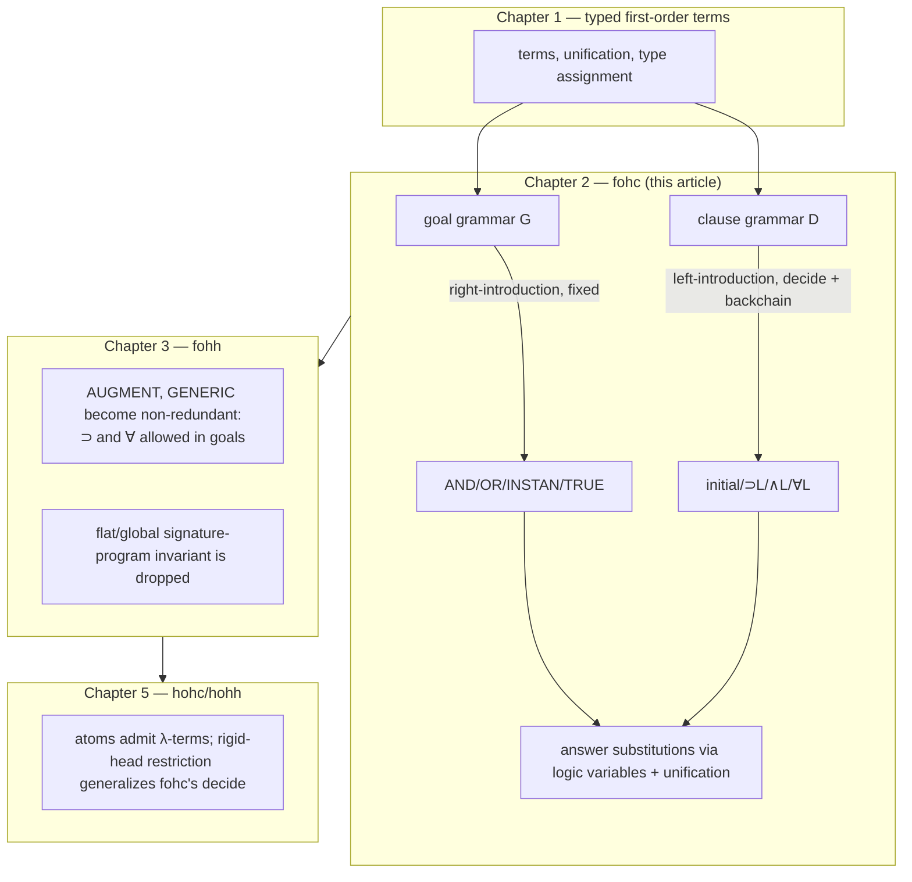

# First-Order Horn Clause Logic Programming

[[book-guidelines|↩ Back to guidelines]]

## Why a *restricted* logic, and not just "logic"?

Chapter 1 gave you a way to represent data as typed first-order terms. This chapter asks the next question: what does it mean to *compute* with those terms using logic? The book's answer is not "write down first-order logic and run a generic theorem prover on it." A generic prover has to search over an enormous space of proof strategies, and the order in which it tries things is, in general, unpredictable — which makes it a poor foundation for a programming language, where you the programmer need to be able to predict what your program is going to do.

fohc — **f**irst-**o**rder **H**orn **c**lauses — is the answer arrived at by deliberately *shrinking* the language of formulas until the search behavior becomes forced, i.e., until there is only one sensible thing to try at each step, modulo a small number of well-defined choice points. This is the same design instinct as building a parser combinator library with no backtracking ambiguity, or restricting a type system so that inference is guaranteed to terminate and produce a most general answer: you buy predictability by cutting expressiveness, precisely where the expressiveness would have created interpretive freedom you didn't want.

The previous article in this vault ([[Logic-Programming-as-Proof-Search]], if you've read it) laid out the general machinery: sequents, the fixed "search semantics" of connectives, goal-directed reduction, cut. This article is about what happens when you instantiate that machinery with the *specific* grammar of Horn clauses — what the language looks like, why exactly it is complete for both classical and intuitionistic logic, how a real implementation compiles it, and what work the type system is secretly doing at runtime.

## The ingredients: signatures, clauses, goals, and a proof calculus

The book's abstract framework for any logic programming language names four ingredients:

1. a **signature** $\Sigma$: declarations of the nonlogical constants used to build terms and formulas,
2. **program clauses** — formulas allowed to appear as axioms of the program,
3. **goal formulas** (queries) — formulas whose derivability from the program is what "running the program" means,
4. a **sequent calculus** that governs how derivations get built.

A sequent has the shape $\Sigma; P \longrightarrow G$: signature $\Sigma$, program $P$ (a set of formulas), goal $G$. Read declaratively, this sequent asserts the judgment "$G$ is provable from $P$ under $\Sigma$." Read operationally, it's the *state of an interpreter*: "solve $G$ given the available program clauses $P$."

That dual reading is the whole point. Every rule in the calculus has to be simultaneously defensible as sound logical inference *and* implementable as a deterministic step of an interpreter. This is exactly the "declarative semantics = operational semantics" property you want from a language with a well-defined evaluator — the logic-programming analogue of a small-step operational semantics being provably sound and complete with respect to a denotational one.

## The fohc grammar

Here is the actual restriction, and it is small. Let $A$ range over first-order atomic formulas (a predicate symbol applied to first-order terms). Goals $G$ and program clauses $D$ are defined by mutual recursion:

$$
\begin{aligned}
G &::= \top \mid A \mid G \wedge G \mid G \vee G \mid \exists_\tau x\, G \\
D &::= A \mid G \supset D \mid D \wedge D \mid \forall_\tau x\, D
\end{aligned}
$$

Read this carefully, because the asymmetry is the entire design:

- **Goals** may use $\wedge$, $\vee$, $\exists$, and atoms — but *not* $\supset$ or $\forall$ at the top level.
- **Clauses** may use $\supset$, $\wedge$, $\forall$, and atoms — but *not* $\vee$ or $\exists$.

A clause of the shape $\forall \bar{x}\,(A_1 \wedge \dots \wedge A_n \supset A_0)$ — the familiar Prolog rule $A_0$ :- $A_1, \ldots, A_n$ — is a special case of this grammar with $m,n \geq 0$ (no quantifiers if $m=0$; no antecedent if $n=0$, i.e. a fact). But note that the book's $D$-grammar is strictly more general than that special case: because $D \wedge D$ is itself a clause and $G \supset D$ allows the consequent of an implication to be *another* implication or conjunction, a "head" can be buried arbitrarily deep under further implications and universal quantifiers. This generality earns its keep in §2.6.2 below (alternative presentations, and the size trade-offs among them).

**[[Hereditary-Harrop-Formulas-and-Modular-Search#What breaks without this|What breaks without this]] restriction.** Drop the restriction and allow $\vee$ or $\exists$ into program clauses, or $\supset$/$\forall$ into goals unrestricted, and you reopen exactly the completeness gaps the chapter demonstrates concretely with the general framework (before fohc is even defined):

- The `OR` rule reduces $\Sigma; p \vee q \longrightarrow q \vee p$ to *either* $\Sigma; p\vee q \longrightarrow q$ *or* $\Sigma; p \vee q \longrightarrow p$. Neither branch is provable — yet the original sequent obviously is, classically and intuitionistically. Disjunctive information in a *program* clause forces you to commit to one disjunct too early.
- $\Sigma; \varnothing \longrightarrow p \vee (p \supset q)$ is a classical tautology (law of excluded middle in a different suit), but the `OR` rule again can't find it: neither $p$ nor $p \supset q$ is provable outright.
- $\Sigma; (r\,a \wedge r\,b) \supset q \longrightarrow \exists x\,(r\,x \supset q)$ is classically provable by a case split on whether $r\,a$ holds — but `INSTAN` requires picking one witness term up front, and no single witness works.

All three failures share a shape: the *right* proof requires classical reasoning (excluded middle) or committing to a choice only after more information is available, and a naive goal-directed reduction commits too early. fohc's grammar is precisely calibrated to make these failure modes structurally impossible: disjunction and existential quantification are banished from clauses (so there's nothing indefinite sitting in the program to force a premature choice), and this alone — no need to first exclude classical logic — is enough to reclaim completeness for the goal side. Classical vs. intuitionistic still matters, though: see the completeness discussion below.

## Right-introduction and left-introduction: two proof rule families

The general framework's reduction rules (`AND`, `OR`, `INSTAN`, `AUGMENT`, `GENERIC`, `TRUE`) become, read bottom-up as inference rules, the **right-introduction rules** — so called because they introduce a connective on the right of the sequent arrow:

$$
\begin{array}{cc}
\dfrac{}{\Sigma;P \longrightarrow \top} \top R
&
\dfrac{\Sigma;P \longrightarrow B_1 \quad \Sigma;P \longrightarrow B_2}{\Sigma;P \longrightarrow B_1 \wedge B_2} \wedge R
\\[2ex]
\dfrac{\Sigma;P \longrightarrow B_1}{\Sigma;P \longrightarrow B_1 \vee B_2} \vee R
&
\dfrac{\Sigma;P \longrightarrow B_2}{\Sigma;P \longrightarrow B_1 \vee B_2} \vee R
\\[2ex]
\dfrac{\Sigma;P \longrightarrow B[t/x] \quad \Sigma;\varnothing \vdash_f t:\tau}{\Sigma;P \longrightarrow \exists_\tau x\,B} \exists R
\end{array}
$$

These rules apply to any goal formula, and — this is the key architectural point — *their applicability depends only on the top-level connective of the goal, never on the program or signature.* $\wedge$ in a goal is always split into two subgoals; $\vee$ always forces a choice of disjunct; there is no scenario in which the program content changes what a connective in the goal means operationally. This fixed interpretation is what the book calls **search semantics**.

Atomic goals are different: an atom $A$ carries no connective to dispatch on, so progress must come from the *program*. This is **backchaining**, formalized by the **left-introduction rules** (Figure 2.3 in the book) — so called because they introduce a connective from a clause selected out of $P$, displayed on the left of the sequent arrow (with a superscript marking which clause is currently in focus):

$$
\begin{array}{cc}
\dfrac{\Sigma;P \overset{D}{\longrightarrow} A}{\Sigma;P \longrightarrow A}\ \texttt{decide}\ (D \in P)
&
\dfrac{}{\Sigma;P \overset{A}{\longrightarrow} A}\ \texttt{initial}
\\[2ex]
\dfrac{\Sigma;P \longrightarrow G \quad \Sigma;P \overset{D}{\longrightarrow} A}{\Sigma;P \overset{G \supset D}{\longrightarrow} A}\ {\supset}L
&
\dfrac{\Sigma;P \overset{D_i}{\longrightarrow} A}{\Sigma;P \overset{D_1 \wedge D_2}{\longrightarrow} A}\ \wedge L
\\[2ex]
\multicolumn{2}{c}{\dfrac{\Sigma;P \overset{D[t/x]}{\longrightarrow} A \quad \Sigma;\varnothing \vdash_f t:\tau}{\Sigma;P \overset{\forall_\tau x\,D}{\longrightarrow} A}\ \forall L}
\end{array}
$$

Read this as an algorithm: `decide` **selects** a clause $D$ from $P$ (the one nondeterministic step); then the other four rules **elaborate** $D$ against the atomic goal $A$ — chase into a conjunct, instantiate a universal, and, when you hit an implication $G \supset D$, spin off $G$ as a fresh subgoal to be solved *against the whole program* while continuing to backchain on $D$. `initial` closes the branch when the clause you've drilled down to is syntactically the atom you wanted.

For ordinary Prolog-shaped clauses $\forall\bar{x}\,(A_1 \wedge \cdots \wedge A_n \supset A_0)$, this whole four-rule dance compiles into the one familiar step you already know:

$$
\frac{\Sigma;P \longrightarrow A_1\theta \quad \cdots \quad \Sigma;P \longrightarrow A_n\theta}{\Sigma;P \longrightarrow A}
$$

where $\theta$ maps the clause's universal variables to terms such that $A = A_0\theta$. This is exactly modus ponens plus instantiation, packaged as one interpreter step — and the soundness argument is a one-line modus-ponens check: if all the $A_i\theta$ follow from $P$, then $(A_1\theta \wedge \cdots \wedge A_n\theta) \supset A_0\theta$ (an instance of the universally quantified clause) plus the premises gives $A_0\theta = A$.

**If you've built a small typed evaluator before**, this decomposition should feel structurally identical to separating a `match`/dispatch step (`decide`, driven by clause selection) from a set of deterministic reduction rules (the rest). In Rust terms:

```rust
enum Goal {
    True,
    Atom(Atom),
    And(Box<Goal>, Box<Goal>),
    Or(Box<Goal>, Box<Goal>),
    Exists(Type, Box<dyn Fn(Term) -> Goal>), // binder as a Rust closure, morally
}

enum Clause {
    Atom(Atom),
    Implies(Goal, Box<Clause>),   // G ⊃ D
    And(Box<Clause>, Box<Clause>),
    Forall(Type, Box<dyn Fn(Term) -> Clause>),
}

// solve_goal dispatches purely on the shape of `goal` — right-introduction.
fn solve_goal(prog: &Program, goal: &Goal) -> bool { /* AND/OR/INSTAN/TRUE, no program lookup */ }

// backchain dispatches on the shape of the *selected clause* — left-introduction.
fn backchain(prog: &Program, clause: &Clause, target: &Atom) -> bool { /* initial/⊃L/∧L/∀L */ }
```

`solve_goal`'s `match` arms never consult `prog` to decide which arm to take — only `backchain`'s entry point (`decide`, picking `clause` out of `prog`) does. That separation of "what to do, dictated by syntax" from "what to try, dictated by the program" is the essence of fixed search semantics, and it's why fohc interpreters are predictable in a way a generic resolution prover is not.

## Answer substitutions: what a query actually returns

A goal derivation can end three ways: success, definite failure (every branch exhausted), or nontermination — and provability in fohc is undecidable in general, so nontermination is a fact of life for *any* interpreter, not a defect of a particular search strategy.

On success, you don't want the whole proof object back — proofs are complete traces, and in practice you want a summary. The `INSTAN`/`∃R` rule already tells you what to keep: solving $\exists_\tau x\, B$ means finding a witness term $t$, and $t$ is the useful residue of the computation. Generalize this: let a goal contain free variables, read as implicitly existentially quantified at the outermost scope. The substitution mapping those variables to the terms that made the proof succeed is the **answer substitution** — this is precisely what a Prolog REPL prints as `X = ...` bindings.

Operationally, answer substitutions are realized with **logic variables**: placeholders (distinct from ordinary bound variables) that `∃R` and `∀L` introduce fresh and that get progressively instantiated by *unification* at `initial` steps, with those instantiations propagated back through the whole derivation built so far. This is the same "unresolved metavariable, refined by unification as the derivation proceeds" pattern used by Lean's elaborator when it solves implicit arguments — a thread this vault's learning goals ask to keep surfacing. In fohc the unification is plain first-order unification (Chapter 1's algorithm); the metavariable-refinement discipline it sits inside, though, is the same one that later, in Chapter 7/8 of this book and in a dependently-typed elaborator alike, gets generalized to *higher-order* pattern unification.

## Completeness: fohc proofs are proofs in classical logic, and in intuitionistic logic

Call a proof built from Figures 1.2 (typing), 2.2 (right-introduction), and 2.3 (backchaining) an **O-proof**. The chapter's central metatheoretic result: for $P$ a program and $G$ a goal in fohc,

$$
\Sigma; P \longrightarrow G \text{ has an O-proof} \iff \Sigma; P \longrightarrow G \text{ is provable in classical logic} \iff \text{provable in intuitionistic logic}.
$$

This is a genuinely strong statement: fohc's narrow, forced search procedure is *simultaneously* complete for two logics that disagree with each other (classical logic accepts excluded middle; intuitionistic logic doesn't). That the same proof procedure works for both only makes sense once you notice that the three completeness-breaking counterexamples above (excluded middle in the goal or in a case-split witness choice) all required disjunctive or existential information sitting *inside the program*, which fohc's clause grammar has already outlawed. With that door closed, the classical/intuitionistic distinction becomes invisible to fohc-shaped sequents — there's no proof-relevant use of excluded middle left to exploit. (Chapter 3 will reopen this question for hereditary Harrop formulas, and there the answer is different: fohh is sound and complete for intuitionistic logic but *not* for classical logic, because Peirce's-formula-style classical equivalences interact badly with `AUGMENT`.)

A structural corollary worth internalizing: every sequent that appears anywhere in an O-proof of $\Sigma;P \longrightarrow G$ has the shape $\Sigma;P \longrightarrow G'$ or $\Sigma;P \overset{D}{\longrightarrow} A$ for the *same* $\Sigma,P$ throughout. Signatures and programs in fohc are **flat and global**: nothing you prove along the way ever adds a new clause or a new constant to what's available. That's a strong, checkable invariant — and it's exactly the invariant that Chapter 3 relaxes (via `AUGMENT` and `GENERIC` becoming non-redundant) to get hereditary Harrop formulas, where [[Hereditary-Harrop-Formulas-and-Modular-Search#Hypothetical reasoning|hypothetical reasoning]] temporarily grows $P$ and $\Sigma$.

## Cut: a logician's tool, deliberately excluded from execution

The **cut rule**,

$$
\frac{\Sigma;P \longrightarrow B \qquad \Sigma;P,B \longrightarrow G}{\Sigma;P \longrightarrow G}
$$

lets you prove $G$ by first establishing a lemma $B$ and then using $B$ as an extra assumption. It is never used *during* proof search — finding the right lemma is exactly the kind of creative, non-mechanical step that a predictable interpreter can't be built around — but **cut-elimination** (Gentzen's theorem: cut can be added to classical or intuitionistic logic without changing what's derivable, and by the completeness result above, an adapted form is admissible for fohc's O-proofs too) is indispensable *metatheoretically*. It licenses substituting a subformula of a program by a logically equivalent one without changing what the program proves. That's precisely the tool used in the next section.

## Three equivalent presentations of fohc, and why the choice isn't free

The book's grammar for $D$ (allowing $\wedge$ and buried implications) is the most liberal of a few classically- and intuitionistically-equivalent presentations. A more familiar one:

$$
F ::= A \mid F \wedge F \qquad D ::= A \mid F \supset A \mid \forall_\tau x\, D
$$

(the textbook "Horn clause": a conjunction of atoms implying one atom, universally closed) — and a maximally compact one, $D ::= A \mid A \supset D \mid \forall_\tau x\,D$, where implications and quantifiers may only ever nest in the *conclusion* of an implication.

Cut-elimination is what licenses moving between these: distributivity laws like

$$
\forall x(B_1 \wedge B_2) \equiv (\forall x B_1)\wedge(\forall x B_2), \qquad B_1 \wedge (B_2 \vee B_3) \equiv (B_1\wedge B_2)\vee(B_1 \wedge B_3)
$$

let you rewrite any clause in one grammar into an equivalent set of clauses in another. But equivalence-preserving is not free-preserving: pushing conjunction out of implication consequents ($G \supset (D_1 \wedge D_2) \equiv (G \supset D_1)\wedge(G\supset D_2)$) duplicates $G$, and iterating this can blow formula size up **exponentially** — the book's example, $((p\vee r)\wedge(q\vee t)) \supset s$, expands via distributivity into four separate clauses $(p\wedge q)\supset s,\ (r \wedge q) \supset s, \ldots$, each containing full copies of what were shared subformulas. There's a cheaper fix — introduce new predicate names ($pr$ for $p \vee r$, etc.) to name the shared pieces instead of duplicating them, giving only linear growth — but this changes the signature, so it's an equi-provability result *relative to the original signature*, not a logical equivalence.

This is the same trade-off you hit converting a formula to CNF for a SAT solver (naive distribution blows up; Tseitin-style variable introduction keeps it linear at the cost of extra atoms) — worth noticing, since the book flags exactly this connection when contrasting fohc's proof-based approach with the resolution-refutation tradition. And it's not just a size question: the *transformed* program can behave differently under `decide`, because what was one clause with one possible derivation for $p$ becomes several clauses each demanding its own derivation attempt.

## Pragmatics: turning "has an O-proof" into a deterministic interpreter

The proof rules alone are nondeterministic in several places; a real interpreter must fix conventions to make behavior predictable — predictability being the entire reason fohc's design excluded rich search options in the first place:

- **$\vee$ in goals / $\wedge$ selected for backchaining**: always try the left disjunct/conjunct first.
- **Conjunctive goals**: solve left-to-right.
- **`decide`'s clause choice**: the program is a *list*, not a set — textual order in the source file is the order in which `decide` tries clauses.
- **`∃R`/`∀L`'s term choice**: rather than enumerating terms of a type (fine for a two-element type like the finite-state-machine alphabet in the book's worked example, hopeless for `int`), use **logic variables** as placeholders, deferred and resolved later by unification at `initial`.

The clause-selection convention is what makes **predicate-indexed compilation** possible: precompute the effect of $\supset L$/$\wedge L$ so every clause is normalized to $\forall\bar{x}\,(G_1 \wedge \cdots \wedge G_n \supset A)$, then partition the whole program by the predicate symbol at the head $A$. `decide` for a goal with head $p$ then only has to consider $p$'s own clause block, tried in file order, with the head's unification largely precomputable since the head shape is known statically. This — clause indexing by predicate name, precompiled unification against a known head shape, argument-shape pre-filtering before invoking full unification — is exactly the architecture that, as the book notes in its bibliographic remarks, work by several researchers eventually crystallized into the **Warren Abstract Machine (WAM)**: a virtual machine whose instruction set is essentially "try next clause in this predicate's block; unify head; on failure, backtrack to the next clause." If you've ever implemented a bytecode VM for a small language, the WAM is the logic-programming sibling of that idea, specialized to make backchaining and unification the primitive instructions instead of arithmetic and jumps.

## Types are not just a static well-formedness check

This is the chapter's least obvious and most operationally important point, and it's worth dwelling on because it's easy to walk away from a first read thinking types in $\lambda$Prolog are "just like Rust's/ML's" — they aren't, quite.

**Equality is syntactic, not semantic.** In $\lambda$Prolog, `2 + 3 = 5` *fails* as a goal — `2+3`, `3+2`, and `5` are three different closed terms of type `int`, not three names for one value. There is no rewriting phase collapsing them; computation here is proof search, not term reduction to normal form. (A separate, explicitly nonlogical `is` predicate is provided if you actually want arithmetic evaluation — Appendix A.4.1.) This matters directly for the vault's standing project: it's the same "terms of functional type are code, tested for equality as code-shape, not as extensional function-graphs" idea that later lets $\lambda$Prolog do genuinely useful things (Chapter 5's higher-order programming) that ordinary functional-language equality can't touch — testing whether two encoded proof terms or programs are *syntactically* the same object, which is exactly what a definitional-equality check in a proof assistant's kernel is doing.

**Determinate and transparent types.** For a canonical-form type $\tau_1 \to \cdots \to \tau_n \to \tau_0$, a type variable occurring in the target $\tau_0$ is called **transparent**; if *every* type variable in the expression is transparent, the type is **determinate**. `nil : list A` and `:: : A -> list A -> list A` are determinate — knowing the list's element type pins down every argument's type — which is exactly why ordinary lists are homogeneous. Contrast a deliberately non-transparent declaration:

```
kind lst    type.
type null   lst.
type cons   A -> lst -> lst.   % A doesn't appear in the target type `lst`
```

Here `A` never surfaces in the target, so `cons`'s argument type isn't determined by anything — `lst` becomes a type for *heterogeneous* sequences. The book's worked example (`separate`, splitting a mixed list into an `int` list and a `real` list) shows both a version built on this non-determinate `cons` and a version rebuilt with a tagged-union style constructor (`inj_int : int -> numb`, `inj_real : real -> numb`) that *is* determinate — same input/output behavior, but the determinate version gets caught by static type checking if misused, where the non-determinate version only fails at runtime. This is a direct instance of the "make illegal states unrepresentable" principle familiar from Rust enum design: a determinate constructor is a Rust `enum` variant whose payload type is fully pinned by the variant tag, while a non-determinate one is closer to `Box<dyn Any>` — it compiles, but the type system has stopped helping you.

**Why this matters at runtime.** Because $\lambda$Prolog uses *typed* unification, types don't vanish after a static well-formedness pass — they can influence whether two terms unify (and, once higher-order unification arrives in later chapters, even the *shape* of the unifier; for first-order terms the effect is more benign — existence only, not structure). Polymorphism means the precise runtime type of a constant or variable may not be pinned down until instantiation, so type information sometimes genuinely has to travel with a computation, not just precede it. The `separate` example makes this concrete: with the non-determinate `cons`, correctly routing a list element to the "integers" or "reals" output requires *inspecting its type at runtime* — there's no term-level tag to dispatch on, only a type. Determinate types let an implementation shortcut this: unification proceeds outside-in, and once the top-level constructor's type bindings check out, nothing further needs checking, so all the runtime type bookkeeping a compiled implementation needs can be squeezed into a few extra term arguments rather than a first-class type-passing mechanism. This is the same design tension a Rust-style monomorphizing compiler resolves at compile time (specialize away the polymorphism, dictionary-passing or codegen per instantiation) versus what a typed Prolog engine has to sometimes defer to runtime because the discipline is unification-driven, not evaluation-driven.

## Synthesis: where fohc sits in the book, and in this project



fohc is the fixed point the whole book keeps generalizing *away from* while trying to preserve its two best properties: a fixed, program-independent search semantics for connectives, and completeness with respect to a real logic. Chapter 3 relaxes the clause language (implications and universal quantifiers move into goals) at the cost of the flat-signature invariant, trading it for hypothetical reasoning. Chapter 5 relaxes the *term* language (atoms built from $\lambda$-terms, not just first-order terms), and has to re-derive an analogue of "clause heads can't be flexible" — a direct generalization of fohc's `decide` needing a syntactically identifiable head to index on.

For this vault's standing project, three things here are directly load-bearing rather than merely background:

- **Right/left-introduction as dispatch-on-syntax vs. dispatch-on-program** is the cleanest possible mental model for separating a proof search engine's fixed connective-handling core from its program-specific clause-selection logic — exactly the decomposition a from-scratch automated theorem prover embedded in a Rust verifier needs to get right first.
- **Answer substitutions via logic variables, refined incrementally by unification during backchaining**, is first-order unification doing the job that a bidirectional elaborator's metavariable-solving does at a higher order — a direct, simplified preview of the pattern-unification machinery (Chapters 7–8 of this book) that the meta-programming elaborator project is aimed at.
- **Determinate types and the static/dynamic split in what typed unification needs to check** is a concrete, small-scale case study in exactly the question a Hoare-triple-checking compiler has to answer: how much of a typing/contract discipline can be discharged once, statically, versus what has to be re-derived or checked per-execution.
