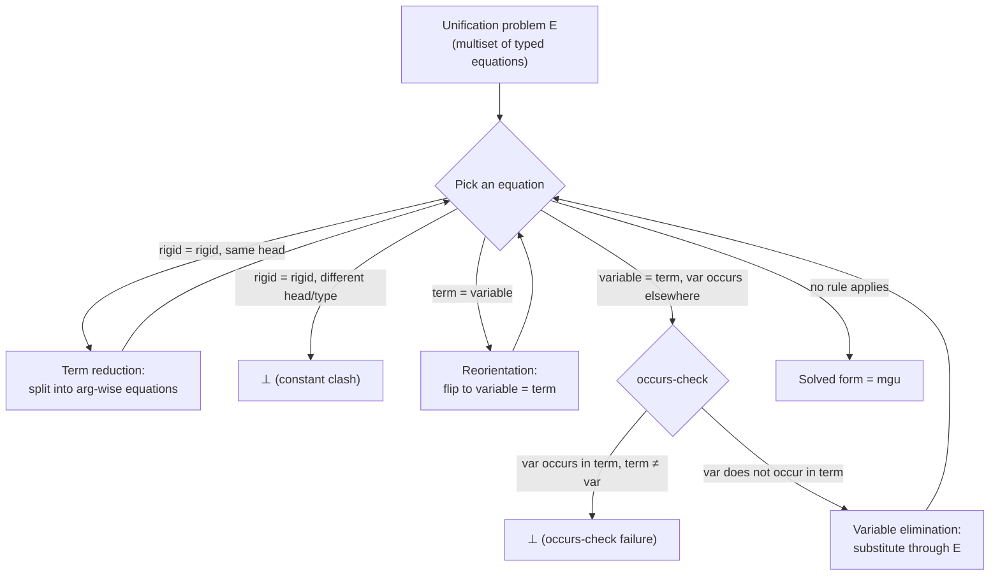

# First-Order Unification

[[book-guidelines|↩ Back to guidelines]]

## Why unification, and why here

Chapter 1 has spent four sections building a language of typed first-order terms — sorts, type constructors, kinds, value constructors — as a way to *represent* data: lists, trees, formulas, programs. Representation alone is inert. What makes a representation into something you can compute with is having a mechanism to (a) take a term apart and (b) put pieces of it back together into a new term. Unification is that mechanism, and it's the single operation on which the whole logic-programming edifice this book builds — from Chapter 2's Horn clauses onward — rests.

[[The-Simply-Typed-Lambda-Calculus#The intuition|The intuition]] to hold onto before any notation: unification is *pattern matching in both directions at once*. Ordinary pattern matching, the kind you write in Rust or ML, takes a concrete value and a pattern with holes, and asks "does the value fit the pattern, and if so, what do the holes bind to?" Unification generalizes this by letting *both* sides have holes. You're not matching a value against a pattern — you're finding the most permissive way to make two patterns describe the same thing.

```rust
// Ordinary pattern matching: only the scrutinee can vary.
match list {
    Cons(x, rest) => ...,   // x, rest are pattern variables, `list` is ground
    Nil => ...,
}
```

Unification erases the distinction between "the concrete value" and "the pattern" — both sides of an equation can contain variables, and the algorithm figures out what each variable must be for the two sides to become syntactically identical.

## The unification problem: a multiset of typed equations

The book's definition (p. 26) is precise and worth quoting almost verbatim, because every later definition (solved form, mgu, rigid term) is stated in terms of it:

> A unification problem is a finite multiset of equations between first-order terms such that the two terms in each equation are of the same type.

Two things to notice immediately, both easy to gloss over:

1. **Multiset, not set.** The book is explicit (footnote 3) that duplicates are allowed and order doesn't matter — this is a bookkeeping convenience so the algorithm doesn't need to deduplicate equations as it goes, not a deep design choice.
2. **Same type per equation.** This is the "typed" in "typed first-order unification." Every equation $t = s$ requires $t$ and $s$ to already have the same type before you even start solving. This matters later — it's what keeps the algorithm from ever being asked to unify an `int` with a `list int`.

A **unifier** for a unification problem $E$ is a substitution $\theta$ (type-preserving — it must map each variable to a term of the variable's own type) such that applying $\theta$ to both sides of every equation in $E$ makes the two sides syntactically identical.

Worked example straight from the book: let $X : \mathtt{int}$ and $L : \mathtt{list\ int}$. The problem
$$\{(X :: L) = (1 :: 2 :: \mathtt{nil})\}$$
has the unifier $\{X \mapsto 1,\ L \mapsto (2 :: \mathtt{nil})\}$ — substitute, and both sides become `1 :: 2 :: nil`.

**What breaks without the type restriction:** if equations could pair terms of different types, you'd need unification to also silently coerce or reject mismatched types mid-algorithm, tangling term-structure reasoning with type-checking. By requiring each equation to already be well-typed, the book cleanly separates "does this equation type-check" (a static, prior question) from "can these terms be made syntactically equal" (unification's actual job) — except, as we'll see near the end, polymorphism reintroduces a controlled amount of type reasoning into the algorithm itself.

## Unification as decomposition *and* construction

The `(X :: L) = (1 :: 2 :: nil)` example shows unification **decomposing** a value: the left-hand pattern extracts the head into `X` and the tail into `L`. But a variable can occur more than once in a term, and that's where unification stops being mere pattern-matching and starts doing real structural recognition. Take the binary-tree representation from earlier in the chapter and consider:

$$\{(\mathtt{node}\ El\ T\ T) = (\mathtt{node}\ 1\ (\mathtt{node}\ 2\ \mathtt{empty}\ \mathtt{empty})\ (\mathtt{node}\ 2\ \mathtt{empty}\ \mathtt{empty}))\}$$

Because `T` appears twice on the left, this pattern only unifies with trees whose left and right subtrees are *identical*. Change the right subtree's label from `2` to `3` and the problem becomes unsolvable — not because of a type mismatch, but because the two occurrences of `T` are forced to disagree. Repeated variable occurrences are how unification expresses structural constraints ("these two subterms must be the same") that plain positional pattern-matching (as in a Rust `match`) cannot express directly — you'd have to write a manual equality check in a guard clause instead.

Unification also **constructs**. Consider:
$$\{(X :: L_1) = (1 :: \mathtt{nil}),\ L_2 = (2 :: \mathtt{nil}),\ (X :: L_2) = L_3\}$$
Solving the first equation decomposes `(1 :: nil)`, binding `X`. But then `X` is *recombined* with `L_2` via the pattern `(X :: L_2)`, and the result flows into `L_3`. Read operationally, the left-hand sides act like a statically-known program and the right-hand sides like dynamically-supplied input; unification then behaves as a two-way data channel — pulling structure out on one side, pushing newly assembled structure out on the other. This is precisely the mechanism Chapter 2 will use to implement argument-passing and result-returning in Horn-clause programs, without ever introducing a separate notion of function call.

## Multiple unifiers, and what "most general" means

A unification problem can have many unifiers. For
$$\{(X :: L) = (Y :: Z :: \mathtt{nil})\}$$
one unifier sends $X \mapsto Y$, $L \mapsto (Z :: \mathtt{nil})$; another goes the other way, $Y \mapsto X$; infinitely many others pick concrete integers for $X, Y, Z$. This raises the question the book poses directly: do we have to consider this whole (possibly infinite) family, or is there a way to name it once and for all?

The book's answer runs through an ordering on substitutions. View a substitution as a *constraint*: $\{X \mapsto Y\}$ constrains $X$ and $Y$ to be equal but says nothing further; $\{X \mapsto 1, Y \mapsto 1\}$ satisfies that constraint but additionally pins both to `1`. Substitution $\theta_1$ is **more general** than $\theta_2$ if $\theta_2$ can be obtained from $\theta_1$ by applying a further substitution. A **most general unifier (mgu)** is a unifier that is at least as general as every other unifier of the problem.

Why generality matters operationally, not just aesthetically: a unifier produced while solving one goal typically feeds into solving the *next* goal (this is exactly what happens in backchaining, Chapter 2). An over-specific unifier is a premature commitment — it can rule out solutions to the next problem that a more general unifier would have permitted. Computing the mgu, rather than *some* unifier, is what keeps the overall search complete.

For first-order terms, the book states the key existence-and-uniqueness fact directly (p. 28, unproved but central):

> Typed first-order unification problems have most general unifiers whenever they have unifiers, and these mgus are unique up to variable renaming.

This is the property that fails for higher-order unification (Chapter 8) — flagging it here is deliberate scaffolding for that later chapter.

## The algorithm: three equation-rewriting transformations

The book presents the mgu-finding procedure not as pseudocode but as a set of *transformations* on the equation multiset $E$ — nondeterministically applicable rewrite rules that preserve the set of unifiers while simplifying the problem. This is the same style you'll recognize from small-step operational semantics: a relation $E \to E'$ (or $E \to \bot$ for failure), repeatedly applied until no rule fires.

Let $\bot$ denote "no unifier exists." The three transformations, verbatim in spirit:

**Term reduction.** Given $(f\ t_1 \ldots t_n) = (g\ s_1 \ldots s_m)$ in $E$ for constants $f, g$:
- if $f \ne g$, or $f$ and $g$ are the same symbol but at *different* types (recall polymorphic constants exist) — replace $E$ with $\bot$;
- otherwise replace the one equation with $n$ equations $t_1 = s_1, \ldots, t_n = s_n$ (necessarily $n = m$).

**Reorientation.** Given $t = x$ in $E$ where $x$ is a variable and $t$ is not — rewrite it to $x = t$. Purely a bookkeeping step so the next rule has something to act on.

**Variable elimination.** Given $x = t$ in $E$ where $x$ occurs somewhere else (in $t$ itself, or in another equation of $E$):
- if $x$ occurs in $t$: remove the equation if $t$ *is* $x$ (trivial, e.g. $x = x$); otherwise replace $E$ with $\bot$ (this is the **occurs-check**);
- if $x$ does not occur in $t$: substitute $t$ for $x$ throughout every other equation in $E$.

**Rigid terms.** The book names the concept that makes term reduction sound: a first-order term is **rigid** if it isn't a variable — i.e. it has the shape $(f\ t_1 \ldots t_n)$ for a constant $f$. Substitution can never change a rigid term's head; it only ever propagates into the arguments. So two rigid terms with different heads can *never* be unified by any substitution (this justifies collapsing to $\bot$), while two rigid terms with the *same* head unify exactly when their corresponding arguments do (this justifies decomposing into $n$ subgoals). Variables, by contrast, are **flexible** — a substitution can turn a variable into anything. First-order unification is comparatively tame precisely because only variables are flexible; Chapter 8 revisits this rigid/flexible split for $\lambda$-terms, where flexible terms (`variable applied to arguments`) are far more disruptive because substitution can also *rearrange* the arguments.

### Solved form

$E$ is in **solved form** if every equation has a bare variable on the left, and no left-hand variable reoccurs anywhere else in $E$. Read this way, $E$ literally *is* a substitution — the right-hand sides are the bindings — and it is trivially its own mgu.

### Termination and correctness

The book states, without a full proof, that as long as you don't re-apply variable elimination to the same unchanged equation more than once, any sequence of these three transformations terminates, ending in either $\bot$ or solved form. Each rule either shrinks the term structure (term reduction breaks a term into smaller subterms) or removes a variable from circulation (variable elimination), so there's a well-founded measure decreasing at every step — this is the same style of termination argument you'd give for a rewriting system on any inductively defined syntax.

### A worked trace (success)

$$\{(\mathtt{node}\ El\ T\ T) = (\mathtt{node}\ 1\ (\mathtt{node}\ 2\ \mathtt{empty}\ \mathtt{empty})\ (\mathtt{node}\ 2\ \mathtt{empty}\ \mathtt{empty}))\}$$

Term reduction (heads match: `node`):
$$\{El = 1,\ T = (\mathtt{node}\ 2\ \mathtt{empty}\ \mathtt{empty}),\ T = (\mathtt{node}\ 2\ \mathtt{empty}\ \mathtt{empty})\}$$

Variable elimination on the second equation, substituting for $T$ in the third:
$$\{El = 1,\ T = (\mathtt{node}\ 2\ \mathtt{empty}\ \mathtt{empty}),\ (\mathtt{node}\ 2\ \mathtt{empty}\ \mathtt{empty}) = (\mathtt{node}\ 2\ \mathtt{empty}\ \mathtt{empty})\}$$

Term reduction on the last equation, then removing the resulting trivial equations:
$$\{El = 1,\ T = (\mathtt{node}\ 2\ \mathtt{empty}\ \mathtt{empty})\}$$

This is solved form — read directly as the mgu $\{El \mapsto 1,\ T \mapsto (\mathtt{node}\ 2\ \mathtt{empty}\ \mathtt{empty})\}$.

### Two ways to fail

**Constant clash.** Change the second subtree's label to `3`:
$$\{(\mathtt{node}\ El\ T\ T) = (\mathtt{node}\ 1\ (\mathtt{node}\ 2\ \mathtt{empty}\ \mathtt{empty})\ (\mathtt{node}\ 3\ \mathtt{empty}\ \mathtt{empty}))\}$$
reduces via the same steps to a multiset containing $2 = 3$. Term reduction sees two distinct constants at the same position and collapses to $\bot$ — a **constant clash**.

**Occurs-check failure.** $\{T = (\mathtt{bt}\ 1\ T\ T)\}$ has $T$ on the left and also occurring inside the right-hand side. Variable elimination's occurs-check fires: $T$ is not the entire right-hand side, so $E \to \bot$. The book's justification is finiteness — terms are finite objects built up in finitely many steps (Section 1.3's well-formedness rules), so no finite term can be "equal to" a strictly larger term containing itself. There is no first-order term you could substitute for $T$ that makes $T = (\mathtt{bt}\ 1\ T\ T)$ hold, because unfolding it once gives you $T = (\mathtt{bt}\ 1\ (\mathtt{bt}\ 1\ T\ T)\ (\mathtt{bt}\ 1\ T\ T))$, and so on forever — an infinite term, which the term language doesn't admit.

**What breaks without the occurs-check:** the book flags (and Chapter 1's Key Questions repeat) that many real Prolog implementations *skip* the occurs-check for performance, on the rationale that you could imagine a solution built from an infinite (rational/cyclic) tree instead of a finite one. But this book is explicit that it requires failure whenever the occurs-check triggers, because later chapters lean on the guarantee that unification never manufactures infinite structures — this finiteness guarantee is specifically what makes it safe to use unification to encode quantifier dependencies (coming up in §4.4) and other invariants elsewhere in the book. Skip the occurs-check and you can get unsound "successful" unifications that silently construct a circular term — a footgun that shows up in real Prolog systems as a specific, well-known class of bug.

## Rust sketch: the algorithm as code

The three transformations translate almost line-for-line into a Rust `unify` function over an explicit term representation. This is close to what a `Term` type and a substitution-driven unifier in a small type-checker/elaborator would look like:

```rust
#[derive(Clone, PartialEq, Eq, Debug)]
enum Term {
    Var(VarId),
    App(Sym, Vec<Term>), // rigid term: (f t1 ... tn), n may be 0
}

type Subst = std::collections::HashMap<VarId, Term>;

fn apply(subst: &Subst, t: &Term) -> Term {
    match t {
        Term::Var(v) => subst.get(v).cloned().unwrap_or(Term::Var(*v)),
        Term::App(f, args) => Term::App(*f, args.iter().map(|a| apply(subst, a)).collect()),
    }
}

fn occurs(v: VarId, t: &Term) -> bool {
    match t {
        Term::Var(w) => *w == v,
        Term::App(_, args) => args.iter().any(|a| occurs(v, a)),
    }
}

/// Solve a multiset of equations, returning the mgu in solved form or None (⊥).
fn unify(mut eqs: Vec<(Term, Term)>) -> Option<Subst> {
    let mut subst: Subst = Subst::new();
    while let Some((l, r)) = eqs.pop() {
        match (l, r) {
            // reorientation: put the variable on the left
            (t, Term::Var(x)) if !matches!(t, Term::Var(_)) => eqs.push((Term::Var(x), t)),

            // term reduction
            (Term::App(f, ts), Term::App(g, ss)) => {
                if f != g || ts.len() != ss.len() {
                    return None; // constant clash
                }
                eqs.extend(ts.into_iter().zip(ss));
            }

            // variable elimination (with occurs-check)
            (Term::Var(x), t) => {
                if t == Term::Var(x) {
                    continue; // trivial, drop it
                }
                if occurs(x, &t) {
                    return None; // occurs-check failure
                }
                // propagate x -> t through remaining equations and the substitution so far
                for (a, b) in eqs.iter_mut() {
                    *a = apply(&Subst::from([(x, t.clone())]), a);
                    *b = apply(&Subst::from([(x, t.clone())]), b);
                }
                for v in subst.values_mut() {
                    *v = apply(&Subst::from([(x, t.clone())]), v);
                }
                subst.insert(x, t);
            }
        }
    }
    Some(subst)
}
```

The correspondence is direct: the `match` arms *are* the three named transformations, and the `Option<Subst>` return type *is* the book's $\bot$-or-solved-form dichotomy — `None` for $\bot$, `Some(subst)` for a solved multiset read as a substitution. Real implementations optimize the propagation step (union-find with path compression instead of eagerly rewriting every remaining equation), but the transformation structure — and the requirement to occurs-check — is unchanged.

## Types re-enter through polymorphism

The presentation above assumes no type variables appear anywhere. The book then lifts that restriction (p. 30–31), and this is worth dwelling on because it's easy to assume "typed unification" just means "check types once, then unify untyped terms" — which turns out to be *false* in general.

Types only enter the algorithm at term reduction, and only when two rigid terms share a head symbol name — you then have to check the two *occurrences'* types line up, which, when type variables are present, is itself a (simpler) unification problem over types (recall: types are just first-order terms built over the sort `type`, so the very same algorithm applies recursively).

Why can't you just trust the equation's outer type and ignore this? The book's counterexample: let `c : A -> A -> i` be a polymorphic constant and `a : i`. The problem $\{(\mathtt{c}\ 1\ Y) = (\mathtt{c}\ X\ a)\}$ is well-typed overall (both sides have type `i`), but blindly decomposing by position, ignoring types, gives $\{1 = X, Y = a\}$ and the unifier $\{X \mapsto 1, Y \mapsto a\}$ — which is *ill-typed*, because it silently instantiates `c`'s type parameter `A` inconsistently across the two occurrences (once to `int`, if `1 : int`, and once to whatever `a`'s "slot" needs). The type information that would catch this got erased by looking only at argument positions, not argument *types*. Two forces make this necessary: polymorphic constants can appear at different type instances in different places, and application itself erases argument types from the result. So genuinely typed unification threads a type-unification subproblem through term reduction whenever a shared polymorphic head is involved — this is a real coupling, not an artifact of a lazy presentation.

One reassurance the book offers: types affect *whether* a unifier exists, but — provided everything stays well-typed — they never affect the *shape* of the unifiers that do exist. So an implementation can often strip types out of the core unification loop once well-typedness is otherwise guaranteed (e.g. when every type variable in a constructor's argument types also shows up in its target type), and only re-check types where polymorphism could otherwise leak an inconsistency, as in the `c` example.

## Unification problems as quantified formulas

The book closes the section (p. 31–32) by reframing everything logically, which turns out to be the seed for the entire rest of the book's approach to unification. Constants in a unification problem behave like universally quantified variables (fixed, arbitrary — the environment picks them); the term-level "instantiatable" variables behave like existentially quantified ones (you get to pick a witness). Under this reading, a unification problem
$$\{t_1 = s_1, \ldots, t_p = s_p\}$$
with constants $x_1, \ldots, x_n$ and variables $y_1, \ldots, y_m$ corresponds to the formula
$$\forall x_1 \ldots \forall x_n\ \exists y_1 \ldots \exists y_m\ [t_1 = s_1 \wedge \cdots \wedge t_p = s_p]$$

— a $\forall\exists$ (universal-then-existential) quantifier prefix. Finding a unifier is finding witnesses for the existentials that make the equalities hold, for *every* choice of the universals. The book flags explicitly that it will connect this to formula-provability properly in §4.4, and that later problems (Chapter 4 onward, for higher-order terms) will have genuinely more tangled quantifier alternations than this simple $\forall\exists$ shape — that's a direct preview of why higher-order unification (Chapter 8) is a fundamentally harder problem, not just a bigger version of this one.

## Where the mechanism actually lives (Lean grounding)

This section is the finite, decidable ancestor of exactly the machinery a proof assistant's elaborator uses to resolve metavariables. In Lean, an elaborator's `isDefEq`-style check — "are these two terms definitionally equal, possibly assigning metavariables along the way?" — is doing first-order unification's job whenever no binders or higher-order metavariable applications are involved: it walks two terms in lock-step, and where it finds `?m` (a metavariable — this book's "variable") opposite a rigid term, it *assigns* `?m`, subject to exactly the same occurs-check discipline (Lean will refuse `?m := f ?m` for the same finiteness reason as the book's $T = (\mathtt{bt}\ 1\ T\ T)$ example). Where it finds two rigid applications with the same head, it recurses structurally into the arguments — that's term reduction. Where the metavariable is on the "wrong" side, that's reorientation.

The gap between what's in this section and Lean's real unifier is exactly the gap this book is building toward: Lean's terms have binders (`λ`, `∀`), and its metavariables can appear applied to arguments, so its unification problem is higher-order, not first-order — full higher-order unification is undecidable and has no mgu in general (Chapter 8's subject). Lean's actual engine survives this by restricting attention to *patterns* in Miller's sense (metavariables applied only to distinct bound variables), where the problem collapses back down to something with the good properties — unique mgu, decidable, efficient — that this section proves hold for first-order unification outright. In other words: this section's clean algorithm is not just background reading, it's the target correctness spec that pattern unification is designed to recover in the harder setting.

## Structural summary



## Where this leads

Everything downstream depends on the guarantees proved here. Chapter 2's backchaining rule literally *is* "unify the goal atom with a clause head, and if it succeeds, continue with the mgu as an answer substitution" — the fixed search semantics of Horn-clause logic programming presupposes exactly this section's existence-and-uniqueness-of-mgu result. Chapter 4 reframes this section's $\forall\exists$ reading of unification problems into the general machinery needed once quantifiers can nest arbitrarily deeply, and Chapter 8 shows precisely which of this section's nice properties (mgu existence, termination, decidability) survive the move to $\lambda$-terms — spoiler: none of them do in general, which is exactly why the $L_\lambda$/pattern restriction (bearing directly on the meta-programming elaborator project's Miller-pattern unification target) exists as a way to claw them back for a useful fragment.
