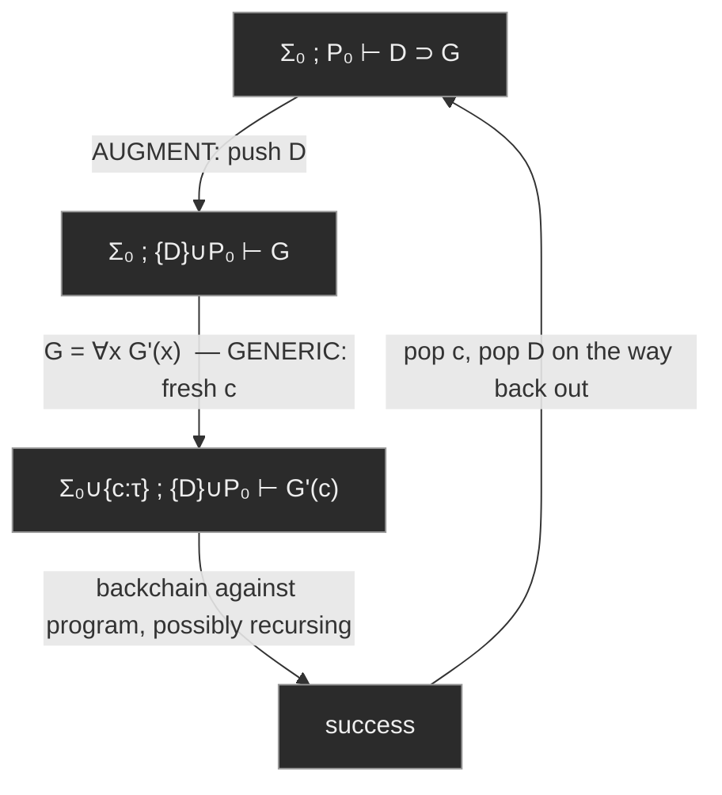

# Hereditary Harrop Formulas and Modular Search

[[book-guidelines|↩ Back to guidelines]]

## The problem with a flat world

fohc — first-order Horn clause logic — gets you a surprising amount of computing power out of a very restricted grammar. But the restriction is real: goal formulas and clause bodies in fohc are built only from atoms, conjunction, disjunction, and existential quantification. Implication and universal quantification are banned from goals entirely. The practical consequence is that the *signature* (what constants and types exist) and the *program* (what clauses are available) are fixed for the entire computation. Every clause you could ever backchain against has to be declared up front, globally, for the whole run.

That's a real expressive ceiling. Think about what it rules out: you can't say "assume fact `F`, then show `G` follows" as a single goal — hypothetical reasoning is off the table. You can't introduce a local helper predicate that's scoped to just one part of a computation — everything lives in one flat global namespace forever. You can't say "for every bug in the jar, prove it's dead" as a single goal without first enumerating every bug that will ever exist.

Chapter 3's move is to lift exactly those two restrictions: let goals contain implications (`D ⊃ G`) and universal quantifiers (`∀x G`). The resulting logic is called **first-order hereditary Harrop formulas**, or **fohh**. The name sounds ceremonial, but the "hereditary" qualifier is doing real technical work, and by the end of this article you'll see exactly what it buys you and what it costs.

## What breaks without this

Concretely: in fohc there is no way to write a query like "if Dana had taken course 210, would the database become inconsistent?" That's a *conditional* question — you want to temporarily add a fact to the program, then see what follows, without permanently committing to it. fohc's proof search never modifies the program; it only ever consults it. Hypothetical, modular, and locally-scoped reasoning are structurally impossible in a system where "prove `G`" always means "prove `G` against the one fixed program you started with."

## The grammar: what changes, what doesn't

fohh redefines goal formulas $G$ and program clauses $D$ by mutual recursion:

$$
\begin{aligned}
G &::= \top \mid A \mid G \land G \mid G \lor G \mid \exists_\tau x\, G \mid D \supset G \mid \forall_\tau x\, G \\
D &::= A \mid G \supset D \mid D \land D \mid \forall_\tau x\, D
\end{aligned}
$$

Compare this to fohc, where $G$ excluded $\supset$ and $\forall$ entirely, and $D$ was the same shape it still is here. Two things to notice:

- Goals are *not* freely built from atoms with all four connectives and both quantifiers. The premise of a goal-level implication ($D \supset G$) is still restricted to being a $D$-formula — you can't hypothesize an arbitrary goal, only something that itself has clause shape.
- Clauses are exactly as restricted as they were in fohc: no disjunction, no existential quantification at the top level, and the premise of a clause-level implication must be a $G$-formula. What's new is that $G$-formulas are now richer, so the class of expressible clauses grows even though the clause grammar's *shape* didn't change.

A $D$-formula satisfying this grammar is itself called a **first-order hereditary Harrop formula** — the same term is overloaded for both "a formula of this shape" and "the whole logic programming framework built on this shape." Context disambiguates.

### Positive and negative occurrences, and why "hereditary" is the right word

Once implication is present, it matters whether a subformula sits to the left or right of an odd number of implications. The book defines this recursively: $B$ is a positive occurrence of itself; positive/negative occurrences propagate covariantly through $\land$, $\lor$, $\forall$, $\exists$, and the *consequent* of $\supset$; but propagate with a flip through the *antecedent* of $\supset$. Equivalently — count implication arrows: an even number of "crossings" to the left is positive, odd is negative.

Given the fohh grammar, positive subformulas of $G$-formulas are $G$-formulas, and negative subformulas of $G$-formulas are $D$-formulas (and dually for $D$-formulas). This gives a clean characterization of hereditary Harrop formulas that doesn't even mention the grammar: **a formula in which no positive subformula occurrence is disjunctive or existentially quantified.** That's the "hereditary" part — it's not enough to ban $\lor$ and $\exists$ at the top level (that's all Harrop's original 1960 formulas did); you have to ban them at *every* positive position, recursively, all the way down. This is what guarantees the disjunction and existential property holds not just for the whole proof, but at every intermediate step — see below.

### Clausal order

The book also defines the **clausal order** of a formula, by structural recursion:

$$
\begin{aligned}
\mathrm{clausal}(A) &= 0 \\
\mathrm{clausal}(B_1 \land B_2) &= \max(\mathrm{clausal}(B_1), \mathrm{clausal}(B_2)) \\
\mathrm{clausal}(B_1 \lor B_2) &= \max(\mathrm{clausal}(B_1), \mathrm{clausal}(B_2)) \\
\mathrm{clausal}(B_1 \supset B_2) &= \max(\mathrm{clausal}(B_1) + 1,\ \mathrm{clausal}(B_2)) \\
\mathrm{clausal}(\forall x\, B) &= \mathrm{clausal}(\forall x\, B) = \mathrm{clausal}(B)
\end{aligned}
$$

In fohc, goals have clausal order 0 and clauses have order 0 or 1 — there's essentially no room for nesting. In fohh both can have arbitrary order. The book flags something worth sitting with: if you read $\supset$ as the function-type arrow $\to$, this definition is *literally* the same shape as [[Typed-First-Order-Terms-and-Type-Structure#The order of a type|the order of a type]] from Section 1.2 (a first-order type has order 1, a function taking a function argument has order 2, and so on). That's not a coincidence — it's the same structural recursion showing up twice because propositions-as-types is quietly operating in the background even in a first-order setting. It resurfaces explicitly in Section 7.6 for higher-order constants.

## Implicational goals: AUGMENT and stack-discipline programs

Here's the operational rule that makes all of this compute. To prove the goal $D \supset G$ from signature $\Sigma$ and program $P$:

> **AUGMENT.** Reduce proving $D \supset G$ from $(\Sigma, P)$ to proving $G$ from $(\Sigma, \{D\} \cup P)$.

That's it — one clause gets pushed onto the program, the goal underneath gets proved against the *extended* program, and (implicitly, once that subproof is done) the clause is popped again. Nest this: proving

$$(D_0 \supset ((D_1 \supset G_1) \land (D_2 \supset G_2))) \land G_3$$

against $P$ results in proving $G_1$ against $\{D_1, D_0\} \cup P$, $G_2$ against $\{D_2, D_0\} \cup P$, and $G_3$ against plain $P$ — three different program contexts derived from one static formula, none of them polluting the others or the original.

**Rust grounding.** This is precisely a scope guard / RAII pattern applied to a search context instead of memory. Model the program as a `Vec<Clause>` (or better, a persistent/immutable list, since backtracking needs to *un-push* on failure, not just at scope exit):

```rust
struct SearchState {
    program: im::Vector<Clause>, // persistent vector: cheap structural sharing
}

impl SearchState {
    // AUGMENT: D ⊃ G reduces to proving G with D pushed onto the front
    fn augment(&self, d: Clause, g: &Goal) -> bool {
        let extended = self.program.push_front(d); // O(1) structural share, no mutation of self
        SearchState { program: extended }.prove(g)
        // `extended` (and hence the pushed clause) is dropped here —
        // the caller's `self.program` was never touched.
    }
}
```

Using a persistent vector rather than mutate-then-restore is the right instinct here, and it's exactly the data structure choice you'd want in a Hoare-triple checker too: proving an implication-shaped goal extends the *hypothesis context*, and that extension must vanish the instant you leave the subproof, including across the multiple branches of a conjunction like the $D_0$ example above, each of which needs its own private view of the extension.

Order matters for a deterministic implementation. λProlog's convention: newly augmented clauses go at the **front** of the program list, so the most recently hypothesized clause is tried first in backchaining. This is directly observable:

```prolog
?- p 2 => p 3 => p X.
X = 3;
X = 2;
X = 1
```

`p 3` was pushed last (innermost), so it's tried first.

### Hypothetical reasoning

This is where AUGMENT earns its keep as a *programming* tool, not just a proof-theoretic curiosity. Take a small course database (predicates `fact`, `finished`, `cs_major`, `graduates`, plus a `false` marker for an inconsistency: having finished both course 210 and 250). You can now ask genuinely hypothetical questions by writing the hypothesis as the antecedent of a goal-level implication:

```prolog
?- fact (finished dana X) => false.
X = 210
```

*"Is there a course such that, were Dana to have finished it, the database becomes inconsistent?"* — answered directly, because the interpreter can literally add `fact (finished dana 210)` to the program, attempt `false`, and see it succeed. fohc has no way to phrase this: there, `false` would have to be provable from the fixed starting program, full stop — no mechanism to temporarily entertain a counterfactual.

The book pushes further into a small interactive database (Figure 3.2) with a `whatif` command whose clause is essentially

```prolog
do (whatif Conjecture) :- (fact Conjecture => db), print "Resuming\n", db.
```

Run the nested `db` loop with the conjecture augmented in, then fall back out — a literal push/enter-scope/exit-scope pattern implemented in the logic itself, no special-cased host-language mechanism required.

**What breaks without AUGMENT's discipline.** Depth-first search plus implicational goals is not free of danger: the query `?- (q :- (q => q)) => (q :- (q => q)).` — an instance of $B \supset B$ — *has* an O-proof from the empty program, but a naive depth-first strategy loops on it forever. Nothing about the *logic* prevents termination; it's purely an artifact of the fixed, simple search strategy the book commits to for predictability (Section 2.5's tradeoff: a rigid, predictable strategy over a complete-but-unpredictable one). This is the same lesson every recursive-descent parser writer learns the hard way: a grammar that's logically fine can still diverge under a specific evaluation order, and the fix is almost always "restructure the program," not "make the interpreter smarter."

## Universally quantified goals: GENERIC and eigenvariables

The dual move — signatures instead of programs growing during search:

> **GENERIC.** To prove $\forall_\tau x\, G(x)$ from $(\Sigma, P)$, pick a fresh constant $c$ of type $\tau$ not occurring in $\Sigma$, and reduce to proving $G[c/x]$ from $(\Sigma \cup \{c : \tau\}, P)$.

Any fresh $c$ works — which particular token you pick never affects whether a derivation exists. A token satisfying "doesn't already occur" is called an **eigenvariable**, and because it never gets instantiated (unlike a logic/unification variable), the book also calls it a **scoped constant**.

Worked example: a jar is sterile if every bug in it is dead; a bug in a heated jar is dead; jar `j` is heated.

```prolog
sterile J :- pi x\ bug x => in x J => dead x.
dead B    :- heated J, in B J, bug B.
heated j.
```

Note the signature declares no constants of type `bug` — no assumption is smuggled in about bugs existing. Proving `sterile j` backchains to the universal goal `pi x\ bug x => in x j => dead x`. GENERIC picks a fresh constant `g : bug`, reducing to `bug g => in g j => dead g` — which further AUGMENTs the program with `bug g` and `in g j`, then succeeds by backchaining `dead g` against `heated j, in g j, bug g`. Once the whole subproof is done, both `g` and the two clauses about it are discarded — GENERIC and AUGMENT compose into one combined scope that shrinks the signature *and* the program together.

**Lean grounding — this is `intro`.** If you've worked in Lean's tactic mode, GENERIC should feel immediately familiar: proving `∀ x : Bug, ...` by `intro x` introduces a fresh local constant `x` into the local context, proves the body with `x` opaque (you learn nothing about `x` beyond its type), and the whole thing is discharged the instant you close that goal — `x` cannot leak out. That's exactly the "fresh token not in $\Sigma$, discarded on success" behavior of GENERIC. The proof-theoretic name for this style of justification — "true because I can carry out this argument for an arbitrary, opaque witness" — is a **generic judgment**, contrasted with a **universal judgment**, which is "true because I checked (or could check) every actual instance in the domain." Lean's kernel is doing the generic reading pervasively; whenever the domain is inductively defined and admits induction, the two readings can diverge, which is exactly the next point.

### Why GENERIC alone can't do induction

This is one of the sharpest points in the chapter. Take Peano naturals with `plus`:

```prolog
plus zero L L.
plus (succ N) M (succ P) :- plus N M P.
```

The query `?- pi N\ plus N zero N.` is **not provable** in fohh, even though `plus N zero N` is true for *every* closed natural number `N` — semantically it's a valid universal statement. But GENERIC only gives you the *generic* reading: pick one fresh, opaque `N`, and there is no rule that lets you case-split it into `zero` versus `succ N'` and recurse. fohh has no induction principle. You genuinely can prove the base case and inductive step separately —

```prolog
?- plus zero zero zero,
   pi N\ plus N zero N => plus (succ N) zero (succ N).
```

— both conjuncts succeed. But there's no rule in the logic that lets you *glue* "base case holds" + "inductive step holds" into "the universal statement holds." That gluing step is induction, and induction is a strictly stronger principle than anything GENERIC provides. This is precisely the gap between an *elaborator's* generic unification-based reasoning and a *kernel's* recursor: Lean's `Nat.rec` (or the `induction` tactic built on it) is the extra axiom-like machinery bolted on top of the base type theory to license exactly this glue step — nothing about generic quantifier introduction alone gets you there for free.

### Substitution has to be capture-avoiding

Once quantifiers can sit inside formulas at arbitrary depth (not just as an outermost Horn-clause prefix), naive textual substitution breaks. Substituting `(f y)` for `X` in

```prolog
p X :- pi y\ q X y.
```

by blind replacement gives

```prolog
p (f y) :- pi y\ q (f y) y.
```

— which is *not* a logical consequence of the original: the free `y` in the substitution term has been captured by the `pi y\` binder, turning one bound occurrence of `y` into two. The book's fix is the standard one: $t$ is **free for** $x$ in $B$ if no free occurrence of $x$ in $B$ sits inside the scope of a binder that captures a free variable of $t$; if it isn't, first rename bound variables in $B$ to an alpha-equivalent $B'$ where it is, then substitute. Correctly, substituting `(f y)` for `X` yields

```prolog
p (f y) :- pi z\ q (f y) z.
```

**Where this bites in a real implementation.** This is exactly the substitution lemma that has to be airtight for Hoare-triple soundness — `{P} c {Q}` reasoning constantly substitutes program-state terms into formulas with bound quantifiers (`∀`-quantified invariants, `∃`-quantified witnesses), and a capture bug here is a soundness bug, not just an ugly output. It's also the same discipline a Rust-hosted elaborator needs the moment it represents binders with named variables instead of de Bruijn indices — which is precisely why most serious implementations (including this book's own later development and Lean's kernel) sidestep the whole "free for" proviso by using de Bruijn indices or nominal/locally-nameless representations, where capture becomes structurally impossible rather than a proof obligation you have to discharge by hand.

A sharp illustration of quantifier-scope interaction: `?- sigma x\ pi y\ x = y.` is unprovable — GENERIC introduces a fresh `c` for `y`, and `x = c` fails for the same reason no single witness for `x` can work uniformly across every fresh `y` a future proof step might introduce. (Trying to reuse `y` itself as the witness for `x` just forces a rename to `z`, restating the same obstruction.)

### Quantification linking goals and clauses

A more subtle capability: because logic variables (unification placeholders introduced by $\exists$-right / $\forall$-left) can now appear *inside* freshly-augmented program clauses — not just in goals, as in ordinary Prolog — a clause's local variable can stay bound to a variable that lives in the calling goal. The book's two `reverse` implementations (Figures 3.3–3.4) exploit exactly this to write a *difference-list*-style, single-pass reversal:

```prolog
reverse L K :-
   (rev nil K &
    (pi X\ pi L\ pi K\ rev (X::L) K :- rev L (X::K)))
       => rev L nil.
```

Here the `K` in the *augmented* clause `rev nil K` is not a fresh universally-quantified clause variable at all — its binding is tied to the `K` in the calling goal `reverse L K`. This "tie a clause's variable to the goal's variable" trick has no fohc analogue; fohc's fixed global program can never contain a clause whose meaning depends on the specific goal that triggered its temporary existence.

## The logical relationship: what fohh's search actually proves

Section 3.4 is where the chapter earns the "relationship with logical notions" title, and it's the part with the sharpest payoff for anyone building a verifier: **which textbook logic does this operational semantics correspond to?**

### Classical logic is unsound for fohh — and the reason is scope extrusion

For fohc, both classical and intuitionistic provability coincided with O-proof existence (Section 2.3's earlier result). For fohh this breaks: **O-proofs are sound and complete for intuitionistic logic, but not for classical logic.**

The canonical counterexample: $p \lor (p \supset q)$ has no O-proof from the empty program (correctly — search would need to either prove `p` from nothing, or prove `q` from `{p}`, and neither holds), and no intuitionistic proof either. But classically:

$$B_1 \lor (B_2 \supset B_3) \equiv B_1 \lor \neg B_2 \lor B_3 \equiv (B_2 \supset B_1) \lor B_3 \equiv B_2 \supset (B_1 \lor B_3)$$

so $p \lor (p \supset q)$ is classically equivalent to $p \supset (p \lor q)$, which is trivially provable. The book names this phenomenon **scope extrusion**: classical logic lets the scope of an implication used as a *hypothesis-introduction device* leak out across a disjunction in a way that destroys the "temporarily add $D$ to the program, then discard it" reading that AUGMENT depends on. (The term is borrowed from the $\pi$-calculus, where it describes a channel-scope binder extending its reach over parallel composition — the same shape of problem, a different domain.) Two more classically-valid-but-O-unprovable examples reinforce this: $(r\,a \land r\,b \supset q) \supset \exists x\,(r\,x \supset q)$, and Peirce's formula $((p \supset q) \supset p) \supset p$, and $\exists x\,\forall y\,(p\,x \supset p\,y)$ (the "drinker's paradox" shape). **Classical logic cannot be the declarative semantics of λProlog** — this is stated flatly, not as a caveat.

### Minimal logic vs. intuitionistic logic, and ex falso quodlibet

Negation $\lnot B$ is defined as $B \supset \bot$, and there are two live choices for what inference rules $\bot$ gets:

- **Minimal logic**: $\bot$ is essentially a nonlogical constant with no special elimination rule.
- **Intuitionistic logic**: adds *ex falso quodlibet* — from $\bot$, infer anything:
$$\frac{\Sigma; P \longrightarrow \bot}{\Sigma; P \longrightarrow B}$$

λProlog implements the weaker, minimal-logic reading directly: pick a nonlogical propositional constant `false`, and there is no built-in rule letting you conclude an arbitrary goal from having derived `false` — you'd have to add an explicit inconsistency check before every failure to emulate full intuitionistic negation. This is a genuine implementation/design choice, not a limitation of the underlying logic — the book notes the interpreter *could* be extended to check for `false`-provability before failing, at the cost of doing so at every augmentation point.

The excluded middle instance `?- p; (p => false).` is unprovable in fohh — expected, since intuitionistic logic rejects excluded middle in general. But its *double negation* — `?- ((p; (p => false)) => false) => false.` — **is** provable, and the book walks the derivation trace explicitly, showing the classic intuitionistic pattern: you can't prove $A \lor \lnot A$, but you can always prove $\lnot\lnot(A \lor \lnot A)$.

The precise correspondence theorem stated: for fohh program $P$ and goal $G$ over signature $\Sigma$, the sequent $\Sigma; P \longrightarrow G$ has an O-proof **iff it is provable in minimal logic.** Since actual fohh formulas never contain a real $\bot$ or $\lnot$ (only the nonlogical stand-in), minimal and intuitionistic provability collapse to the same thing on formulas of this shape — which is why the book is comfortable saying fohh's declarative semantics is "intuitionistic logic" without further qualification, even though the *operational* correspondence is technically to the weaker minimal logic.

### Notable subsets — restricting the grammar without losing power

Two grammar restrictions are shown to be operationally lossless:

1. Preprocess every clause so top-level implications have *atomic* conclusions only: $D ::= A \mid G \supset A \mid D \land D \mid \forall x\, D$. Every fohh clause is intuitionistically equivalent to a set of clauses in this shape.
2. Drop disjunction and existential quantification from goals entirely, collapsing $G$ and $D$ into one shared grammar $D ::= A \mid D \supset D \mid D \land D \mid \forall x\, D$.

The second restriction is subtler than it looks: it is **not** a logical-equivalence-preserving transformation in general. $(p \supset (q \lor r)) \supset s$ is a legal clause under the richer grammar but is *not* intuitionistically equivalent to any disjunction-free clause set — it only implies (not iff) $((p \supset q) \supset s) \land ((p \supset r) \supset s)$. What rescues the restriction is that, restricted to the narrow question "which atomic goals does this clause let you prove," the two formulas are operationally interchangeable, even though they're not logically equivalent. That's a recurring and important theme for anyone who wants to reason about program transformations in a proof-search setting: **operational equivalence and logical equivalence are different relations**, and conflating them is a real source of bugs (the chapter's other running example: swapping the order of `print "yes", print "no"` is licensed by commutativity of $\land$ logically, but visibly changes behavior operationally, because side effects break the "idealized, side-effect-free, complete search" assumption under which logical equivalence implies operational equivalence).

### Disjunction and existential property, and why "hereditary" matters

This is the payoff for the "hereditary" restriction defined back in Section 3.1. Harrop (1960) showed: if every *hypothesis* formula in a sequent is restricted to the shape $H ::= \top \mid A \mid H \land H \mid B \supset H \mid \forall x\, H$ (arbitrary $B$ allowed only as an implication's antecedent, never itself required to be Harrop-shaped), then the sequent enjoys the **disjunction property** (if $F_1 \lor F_2$ is provable, one of $F_1$, $F_2$ is individually provable) and the **existential property** (if $\exists x\, F$ is provable, some concrete term $t$ makes $F[t/x]$ provable). But Harrop's formulas only guarantee this *at the root* of a proof — nothing stops a disjunction from appearing positively somewhere in the middle of a derivation once you descend past the top level.

*Hereditary* Harrop formulas strengthen the restriction to hold recursively at **every** positive position, not just the outermost one — which is exactly the "no positive subformula occurrence is disjunctive or existential" characterization from Section 3.1. The direct payoff: these two properties hold at *every point* in an fohh derivation, not merely at the end. Operationally, this is the theoretical justification for why proof search can commit to "prove the left disjunct or the right disjunct, pick one" and "prove this existential with one concrete witness" as *complete* strategies, rather than something weaker like proving a disjunction of possibilities. It is precisely this property that a resolution-style or model-theoretic account of these connectives would not hand you for free.

### Open-world vs. closed-world assumption

The bibliographic notes name something that's been implicit throughout: fohh's search satisfies the **open-world assumption**. Model a "world" as a signature-program pair $(\Sigma, P)$; computation in fohh only ever moves to *larger* worlds — AUGMENT only adds clauses, GENERIC only adds constants, nothing is ever retracted mid-proof (retraction only happens as you pop back out on success). This is exactly why intuitionistic-style negation-as-$\bot$ is inherently weak here: $A \supset \bot$ for atomic $A$ can essentially never be proved, because there's always some larger future world where $A$ has been added and is now true. Getting an interesting notion of negation requires a **closed-world assumption** instead — programs and signatures that don't grow during proof, letting "not currently provable" mean something.

This ties directly back to the intensional/extensional/generic/universal distinction from Section 3.3: under the open-world assumption, a *universal* reading of $\forall_\tau x\, G$ (true for every actual term of type $\tau$) implies the *generic* reading (true for one fresh, unconstrained token) for free — just extend $\tau$ with a genuinely new constant $c$, and the universal reading already covers it. Under a closed-world assumption that move isn't available, and the two readings can come apart. Miller and Tiu's $\nabla$-quantifier (mentioned only in passing here, developed properly elsewhere) is exactly a device for reclaiming generic quantification's good behavior under a closed-world reading.

## Structure of a search state



The diagram is really the whole chapter in one shape: fohh turns proof search from "consult one fixed $(\Sigma, P)$" into "walk a monotonically-growing sequence of worlds along a stack discipline," where AUGMENT grows $P$ and GENERIC grows $\Sigma$, and both unwind cleanly on the way back out of a successful subproof — never on failure-driven backtracking within the same branch, and never leaking across sibling branches of a conjunction.

## Where this leads

This chapter is the hinge the rest of the book's logic-programming story turns on. Chapter 5's **hohh** and **hohh⁺** take the exact same $G$/$D$ grammar and lift it to admit $\lambda$-terms as atoms — nothing about AUGMENT or GENERIC changes in spirit, only the term language underneath grows. Chapter 6's **module system** is, almost verbatim, "use existential quantification over program clauses to hide local predicate names" — a direct descendant of the same AUGMENT-style scoping mechanism turned into a *language feature* rather than a query-time device. And the intensional/generic reading of $\forall$ established here — an eigenvariable that's opaque, freshly introduced, and cannot leak — is the exact proof-theoretic core that reappears, dressed up in higher-order clothing, as $\lambda$-tree syntax's treatment of bound variables in later chapters on encoding object-level binders.

For the standing projects this vault is tracking: the AUGMENT/GENERIC pair is close to a template for how a Rust-hosted verifier should represent its proof context — a persistent, stack-disciplined structure that a hypothesis-introduction or `∀`-introduction step extends and a closing step retracts, with the retraction being structural (falls out of scope) rather than something the checker has to remember to do. And the capture-avoiding substitution discussion is the precise lemma a Hoare-triple soundness proof leans on every time a substitution crosses a quantified invariant — get it wrong here, in the first-order setting, and you'll get it wrong again, less visibly, in the higher-order unification and elaboration machinery that this book builds toward next.
