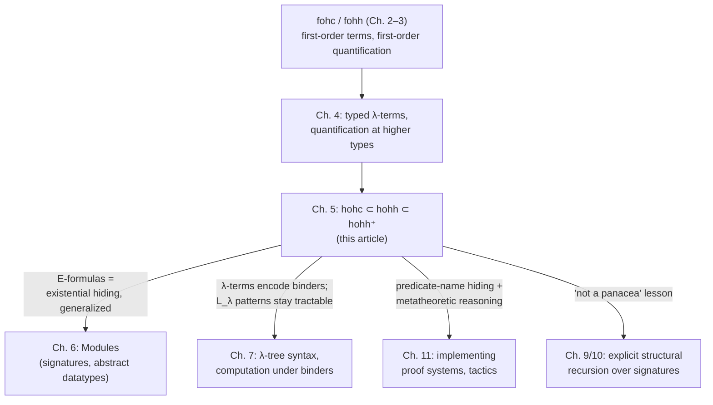

# Higher-Order Logic Programming Languages

Chapter 4 gave us the raw material: a simply typed $\lambda$-calculus, quantifiers reinterpreted as abstractions over formulas of type $o$, and unification problems that can now mix $\forall$ and $\exists$ over arbitrary types. But having the *terms* isn't the same as having a *programming language*. If you let every syntactic possibility that higher-order logic technically permits leak into program clauses and goals, you get something that either isn't consistent as a theory, or isn't searchable in a goal-directed way, or both. This chapter's job is to take fohc and fohh — the first-order Horn-clause and hereditary-Harrop languages from Chapters 2–3 — and reintroduce them at higher types, but only after figuring out *exactly* which uses of $\lambda$-terms, predicate variables, and logical symbols can be allowed without breaking the properties that made fohc/fohh work as programming languages in the first place (goal-directedness, a fixed search semantics, freedom from having to prove consistency before failure).

This is a chapter about drawing careful boundaries, and the boundaries themselves are the interesting content — not just for the theory, but because the pattern "restrict where flexibility is allowed so search stays decidable and predictable" is the exact same move that shows up later as pattern unification and as metavariable postponement in real elaborators (Lean's kernel does version of this move constantly).

## Why not just allow anything?

The nice thing about first-order Horn clauses (fohc) is that the syntax of a clause,

$$\forall \bar{x}\,(A_1 \land \dots \land A_n \supset A_0),$$

*guarantees* certain properties: $A_0$ names a definite predicate, so backchaining against it is a lookup, not a guess. Once you let $A_0$ be built from arbitrary $\lambda$-terms, including variables, that guarantee can evaporate — unless you put restrictions back in by hand. Section 5.1 works through two specific hazards before Section 5.2 gives the formal grammars.

### Hazard 1: flexible clause heads

In $\lambda$-normal form, an atomic formula looks like $(h\ t_1 \cdots t_n)$, where $h$ is either a nonlogical constant or a variable. The book's terminology: if $h$ is a constant, the atom is **rigid**; if $h$ is a variable, it's **flexible**. Flexible *goals* are fine and in fact essential (Section 5.3 is built on them). Flexible atoms as the **heads of program clauses**, though, are a different story — the book gives two independent reasons to ban them.

**Reason one: it wrecks consistency.** A logic program is *inconsistent* if every formula whatsoever is provable from it. fohc and fohh programs are always consistent — that's a load-bearing property, because otherwise an interpreter can't treat goal failure as meaningful without first proving the whole program consistent. Allow a flexible clause head and you can write

```prolog
P B :- q.
q.
```

Now backchain on the first clause with any target formula $B$: unify the head $P\,B$ against your goal by instantiating $P$ with $\lambda x.\,B$, and you're left needing to prove `q`, which succeeds. Every formula in the signature is now provable. A single flexible-headed clause (even just $\forall p.\ p$ on its own) can blow up the whole program's consistency.

**Reason two: it breaks the "clause defines one predicate" reading.** Normally $\forall \bar{x}(A_1\land\dots\land A_n \supset A_0)$ is read as *part of the specification of the predicate named in $A_0$*. If the head of $A_0$ is a variable, the clause isn't attached to any one predicate — it silently adds meaning to *every* predicate in the signature. That's directly hostile to modularity: you can no longer reason locally about what a given predicate means by looking at its own clauses.

So: **hohc/hohh require the head of a program clause to be a rigid atom.** This is exactly the same shape of decision a type checker makes when it insists a function definition's left-hand side pattern-matches on a *known* constructor rather than an unbound metavariable — you need a stable dispatch key.

```rust
// The rigid/flexible distinction, made concrete: dispatching on a clause
// head is only sound if the head is a known tag, not an unresolved slot.
enum Head {
    Constant(PredicateId), // rigid — safe to index clauses by this
    Variable(VarId),       // flexible — no fixed dispatch target
}

fn backchain(head: &Head, clauses: &ClauseDb) -> SearchResult {
    match head {
        Head::Constant(p) => clauses.lookup(*p), // O(1)-ish, predictable
        Head::Variable(_) => {
            // Nothing to index against — you'd have to try instantiating
            // the variable with *everything provable*, which is exactly
            // the inconsistency hazard above.
            panic!("flexible clause heads are disallowed for this reason")
        }
    }
}
```

Note the book doesn't just dismiss the tempting counterexamples — it takes them seriously. Leibniz equality ($x + 0 = x$ specified by `P (X+0) :- P X.` and `P X :- P (X+0).`) is logically meaningful with a flexible head, but operationally catastrophic: with $n$ occurrences of a matching subterm in a goal, there are $2^n$ ways to abstract them into an instance for $P$. And disallowing flexible heads also rules out a Lisp-`eval`-style computation — computing a formula and then invoking it as a clause — because there's no simple static check that guarantees a computed value has the shape of a legal clause. Both counterexamples are conceded as *meaningful*, then rejected as *unworkable*. That's the register of the whole chapter: theoretical possibility versus operational discipline.

### Hazard 2: implications inside atomic-formula arguments

The second restriction is subtler. If you let logical symbols like $\supset$ appear *inside the arguments of atomic formulas* (not at the top level of a goal, but nested inside a term that gets plugged into a predicate), you can break the goal-directedness invariant itself. The book's example: with $r : o \to o$, $s, t : o$, and $Q$ a predicate variable of type $o \to o \to o$,

$$\exists Q\ \big[\forall p\,\forall q\,[r(p\supset q)\supset r(Q\,p\,q)] \land Q(t\lor s)(s\lor t)\big]$$

To prove the first conjunct you're forced to instantiate $Q$ with $\lambda x\lambda y.(x\supset y)$, which turns the second conjunct into $(t\lor s)\supset(s\lor t)$ — a formula that's provable in ordinary logic but *not* reachable by the goal-directed rules of Chapter 2, because those rules were designed around a fixed notion of *polarity*: an occurrence of a logical symbol is positive if it's inside an atomic formula or to the left of an even number of implications, negative otherwise, and positive/negative occurrences are supposed to stay positive/negative as the proof search rearranges the sequent. If implications can hide inside atomic-formula arguments, instantiating a predicate variable can silently flip a disjunction from positive to negative — as it does here — and the invariant the whole search procedure depends on collapses.

So: **implications are excluded from the terms that can appear as predicate arguments** in hohc/hohh (though $\top, \land, \lor, \exists$ are fine there). This restriction is what keeps "arguments of predicates" and "top-level structure of goals/clauses" from being able to interfere with each other.

## The formal languages: hohc, hohh, hohh$^+$

With both hazards named, Section 5.2 gives the actual grammars. Two auxiliary sets of terms do the restricting — **Herbrand universes**, parameterized by an ambient signature $\Sigma$ (assumed to contain all logical constants):

- $\mathcal{H}_1$: all closed-or-open $\lambda$-normal terms over $\Sigma$ that avoid the logical constants $\forall$ and $\supset$. (So $\top,\land,\lor,\exists$ are still allowed inside these terms, at any type.)
- $\mathcal{H}_2$: all $\lambda$-normal terms over $\Sigma$ that avoid only $\supset$. So $\forall$ is now permitted too — this is the extra flexibility hohh needs over hohc.

**hohc** (higher-order Horn clauses), with $A$ ranging over atoms in $\mathcal{H}_1$ and $A_r$ over *rigid* atoms in $\mathcal{H}_1$:

$$G ::= \top \mid A \mid G\land G \mid G\lor G \mid \exists_\tau x\, G \qquad D ::= A_r \mid G\supset D \mid D\land D \mid \forall_\tau x\, D$$

**hohh** (higher-order hereditary Harrop formulas), with $A$, $A_r$ now ranging over $\mathcal{H}_2$:

$$G ::= \top \mid A \mid G\land G \mid G\lor G \mid \exists_\tau x\, G \mid D\supset G \mid \forall_\tau x\, G \qquad D ::= A_r \mid G\supset D \mid D\land D \mid \forall_\tau x\, D$$

Note goal formulas in hohh are genuinely richer than $\mathcal{H}_2$ itself (goals can contain $\supset$; nothing in $\mathcal{H}_2$ can) — the restriction on $\mathcal{H}_2$ governs what can be *substituted into* a goal or clause via quantifier instantiation, not the top-level shape of the goal.

The inference rules are the same right-introduction/backchaining machinery from Chapters 2–3 (Figures 2.2, 2.3), with two changes: equality is now $\lambda$-conversion (formulas are compared in $\lambda$-normal form, and the `initial` rule needs $\alpha$-convertibility rather than syntactic identity), and the terms used to instantiate $\exists R$ / $\forall L$ must be drawn from $\mathcal{H}_1$ (for hohc) or $\mathcal{H}_2$ (for hohh) — not arbitrary $\lambda$-terms. Why the restriction on instantiating terms specifically? Because without it you can instantiate, say, $\exists p.\,p$ with $\forall x.\,q\,x$ and get a formula that isn't itself a goal formula anymore — the "shape invariant" that lets the proof-search rules pattern-match on sequent structure would break. This is precisely analogous to a type checker needing substitution to be *type-preserving*: $t : \tau$ substituted for $x$ must keep a well-typed term well-typed, or downstream rules that pattern-match on syntactic shape stop being sound. In Lean's kernel, `isDefEq` and the elaborator lean on an equivalent invariant — instantiating a metavariable must preserve the expected sort/shape at the site of use, or later structural matches (on `Expr.app`, `Expr.forallE`, etc.) become unsound.

A remarkable payoff mentioned in passing: with these restrictions, provability via goal-directed search for hohc coincides *exactly* with provability in classical higher-order logic, and for hohh it coincides with provability in higher-order *intuitionistic* logic — the operational language and a genuine logic line up precisely, not just approximately.

### hohh$^+$: hiding predicate names

hohh can be liberalized one further step without losing its operational character: allow a clause head to be a **variable**, but only if that variable is bound by a universal quantifier whose scope contains the entire clause — an "essentially universal" quantifier. The reasoning: by the time the enclosing $\forall$-goal is actually reached in proof search, that quantifier gets instantiated with a *fresh constant* added to the signature (this is the GENERIC rule from Chapter 3 — eigenvariable introduction). So by the time the clause is actually added to the program, its head has become rigid again — the restriction from Section 5.1 is satisfied dynamically, even though the raw syntax looks like it violates it statically.

This buys **predicate-name hiding**, and the book's worked example is a second, better definition of `reverse`. Compare the earlier fohh version (Chapter 3) — which used an auxiliary predicate `rev`, but left `rev` globally visible, meaning a caller's own clauses for `rev` could silently interfere with the reverse computation — against the hohh$^+$ version:

```prolog
type reverse   list A -> list A -> o.

reverse L K :- pi rv\
  (                   rv nil K &
   (pi X\ pi N\ pi M\ rv (X::N) M :- rv N (X::M)))
   => rv L nil.
```

Here `rv` is bound by `pi rv\`, so proving `reverse` first mints a *fresh* predicate constant (say `c`), adds clauses for `c` to the program, proves the goal, and then discards both `c` and its clauses. No caller can ever see or collide with `c`. This is exactly the "hide an implementation behind an existential/universal boundary" move you already know from Rust's `impl Trait` (the caller gets an opaque, unnameable type) or from Standard-ML-style existential-type modules — except here the quantifier is doing the hiding *inside the proof search itself*, using the standard eigenvariable-freshness machinery from Chapter 3, not a separate module layer. (Chapter 6's actual module system, in fact, is built *on top of* exactly this idiom — existential quantification over clauses is the semantic core of `local`-style hiding there too.)

## Predicate variables in practice

Section 5.3 is where hohc earns its keep as a genuine programming idiom: predicates become first-class values you quantify over, not just names you invoke.

```prolog
type foreach, forsome    (A -> o) -> list A -> o.
type mappred             (A -> B -> o) -> list A -> list B -> o.
type sublist             (A -> o) -> list A -> list A -> o.

foreach P nil.
foreach P (X::L) :- P X, foreach P L.

forsome P (X::L) :- P X; forsome P L.

mappred P nil nil.
mappred P (X::L) (Y::K) :- P X Y, mappred P L K.
```

If you've written `Vec::iter().all(|x| p(x))` and `Vec::iter().map(f)` in Rust, `mappred`/`foreach`/`forsome` are their relational counterparts — the difference is that `P` here isn't restricted to being a total, deterministic function. Because it's a full predicate, `mappred age L (23::24::nil)` can run "backward," enumerating every list `L` of names whose ages are `23` then `24` — something a `map` over an `Fn` closure simply cannot do.

The chapter also builds relational closures purely as $\lambda$-terms, without recursion, when possible: the reflexive closure of `adj` is literally `x\y\ x = y ; adj x y`, and the symmetric closure is `x\y\ adj x y ; adj y x`. Transitive closure needs recursion (and, notably, the naive attempt to write it as a single closed $\lambda$-term fails: the natural formula for it contains an implication inside a term argument, which is exactly the Section 5.1.2 hazard — "this term is not a legal $\mathcal{H}_2$ term ... it cannot be used as an argument of a $\lambda$Prolog goal"). This is a nice concrete instance of the abstract restriction actually biting in a natural example, not just a contrived one.

The **continuation-passing-style (CPS) transformation** of Section 5.3 is worth pausing on, because it's a compiler pass expressed as *program transformation on Horn clauses themselves*: every predicate $p:\tau_1\to\cdots\to\tau_j\to o$ gets a partner $p^\star : \tau_1\to\cdots\to\tau_j\to o\to o$, and

$$\forall\bar{x}\,[A_1\land\dots\land A_n\supset A_0]\quad\rightsquigarrow\quad \forall\bar{x}\,\forall K\,[(A_1^\star(\dots(A_n^\star K)\dots))\supset(A_0^\star K)]$$

turning conjunctive clause bodies into linear chains of unary calls threaded through a continuation `K` of type `o`. This is the exact same transformation a Rust compiler pass does when it lowers a sequence of fallible operations into an explicit continuation/callback chain — only here it's literally re-deriving one Horn-clause program from another, inside the logic, with no separate metalanguage needed.

Section 5.3 closes with `fib_memo` (Figure 5.7), an hohh$^+$ program that dynamically extends the program with memoized facts (`memo 0 0 => memo 1 1 => ...`) and then calls a goal parameterized by the name of the memo table — this is the pattern from the previous section (fresh-name-via-universal-quantifier) put to work not for hiding but for *building up local state during a computation*.

## Flexible goals: what to do when you don't know who's calling

A goal like `(P bob 23)`, with `P` an uninstantiated predicate variable, has an enormous — usually infinite — set of technically-valid answer substitutions (any provable closed goal `g` gives a valid `x\y\g`), most of which have nothing to do with what the programmer meant. The book lays out three strategies an interpreter can take when proof search hits a flexible atomic goal:

1. **Suspend** it, hoping other goals will pin down the head variable first; if everything rigid gets solved and only flexible goals remain, close them out by instantiating each head with the (extensionally largest) universally-true relation of the right type. This strategy is *complete* for intuitionistic higher-order provability.
2. **Solve eagerly**, using that same universally-true relation immediately — incomplete, but cheap.
3. **Raise a runtime error** — also incomplete, but in practice a flexible goal at the point it's *encountered* under ordinary depth-first search is almost always a programmer mistake (a mistyped capitalized identifier, most commonly), so this is what real $\lambda$Prolog implementations actually do.

This is worth flagging explicitly against the elaborator project's shape, because it's the *same three-way choice* an implicit-argument elaborator faces the moment it hits a unification problem whose head is an unresolved metavariable: **postpone** the constraint and retry later (Lean's `isDefEq` does exactly this — it defers metavariable-headed equations rather than guessing), **solve immediately** with a default/greedy assignment, or **fail fast**. Miller and Nadathur are naming, in 1987-era logic-programming terms, precisely the postponement discipline that a modern bidirectional elaborator's constraint solver still needs today. If you're building the meta-programming elaborator from the standing project brief, this section is a direct precedent: "suspend-then-resume-on-rigidification" is the algorithm shape to imitate for deferred unification/instance-resolution goals.

```python
# The suspend/resume shape, sketched minimally (not load-bearing, just the idea)
def solve_goal(goal, bindings, suspended):
    if is_flexible(goal, bindings):
        suspended.append(goal)
        return  # come back once something rigidifies the head
    # ... ordinary rigid backchaining, then re-check `suspended` for goals
    # whose head just became bound by this step
```

## Reasoning *about* logic programs, not just running them

Section 5.5 gives a genuinely striking example: proving that the hidden-`rv` version of `reverse` is a *symmetric* relation, using only the specification logic's own metatheory — no separate induction principle for lists is invoked. Sketch of the argument: assume `(reverse L K)` is provable; that means the universally quantified body

$$\forall rv\,\big[(rv\,\mathtt{nil}\,K \land \forall X\forall N\forall M(rv(X{::}N)\,M \Coloneq rv\,N\,(X{::}M))) \Rightarrow rv\,L\,\mathtt{nil}\big]$$

is provable, so *every instance of it* is provable — in particular, the instance obtained by substituting $\lambda x\lambda y.\,\lnot(rv\,y\,x)$ for the predicate variable `rv`. That instantiation, after applying the classical contrapositive equivalence ($p\supset q \equiv \lnot q\supset\lnot p$) and observing that the resulting formula is a purely first-order Horn-clause deduction (where classical and intuitionistic provability coincide, per Chapter 2), yields exactly the body needed to prove `(reverse K L)`. The proof exploits the fact that `rv` was *hidden* by hohh$^+$'s essentially-universal quantifier — there's a clean site to substitute a re-implementation into, precisely because the auxiliary predicate's meaning is fully circumscribed by its own clauses and nothing else. This is a genuinely deep synergy: predicate-name hiding isn't just an encapsulation nicety, it's what makes *this style of metatheoretic reasoning about your own program* possible at all.

## Defining logical constants and controlled non-monotonicity

hohc clauses can partially define logical connectives themselves:

```prolog
type tt, ff   o.
type or       o -> o -> o.
type exists   (A -> o) -> o.

tt.
or P Q :- P.
or P Q :- Q.
exists B :- B T.
```

These are *partial* definitions — right-introduction rules only (in sequent-calculus terms, from Chapter 2's vocabulary), not left-introduction. There's no clause for `ff` at all; its behavior as a goal is just "trying to prove it fails," nothing more needs to be said. hohh$^+$ can express the same connectives without dedicated syntax at all, purely via $\forall$ and $\supset$: $\bot$ becomes $\forall p.\,p$, and existential/disjunctive goals become instances of the same $\forall p.\,(\cdots\supset p)$ shape — a nice illustration that $\supset$ and $\forall$, restricted the right way, are already expressive enough to reconstruct the rest of the connectives.

Then the chapter is honest about where classical Prolog pragmatics — `if`/`then`/`else` and negation-as-failure — sit relative to this clean logic: both are defined using the `!` (cut) operator,

```prolog
if P Q R :- P, !, Q.
if P Q R :- R.

not P :- P, !, fail.
not P.
```

and both **break commutativity of conjunction** — `X = 2, not(1 = X)` succeeds while `not(1 = X), X = 2` fails. The book's own stance is blunt: use these "extremely sparingly," and justify each use explicitly. This is a useful data point for the compiler/verifier project: cut-based control constructs are operationally convenient but they step *outside* the logic the rest of the framework's soundness guarantees were built for — anything built on top of `if`/`not` needs its own, separate correctness argument, not one inherited for free from hohh's completeness results.

## $\lambda$-terms as functions: running evaluation backward

Section 5.8 turns to variables of genuinely *functional* (non-predicate) type — instantiated by $\lambda$-terms, evaluated by $\beta$-conversion, not by proof search:

```prolog
type mapfun    (A -> B) -> list A -> list B -> o.
mapfun F nil nil.
mapfun F (X::L) ((F X)::K) :- mapfun F L K.
```

`mapfun` looks like `mappred`'s functional cousin, and computationally it's much weaker — the "evaluation" it does is literally $\beta$-reduction, nothing more (`mappred` can be strictly stronger, and in fact `mapfun F L K :- mappred (x\y\ y = F x) L K.` recovers `mapfun` from `mappred`, not the other way around). But that very weakness is what makes something new possible: because functional application is just unification of $\lambda$-terms up to $\beta\eta$, you can run it *backward*. Given `mapfun F (a::b::nil) ((g a a)::(g a b)::nil)`, the interpreter solves $(F\,a) \doteq (g\,a\,a)$ and $(F\,b)\doteq(g\,a\,b)$ by higher-order unification and finds the unique answer $F = \lambda x.\,g\,a\,x$. This "solve for the function, not just apply it" capability is, per the book, "perhaps the single most novel aspect of higher-order logic programming."

But it's also visibly limited: `mapfun F (a::b::nil) (c::d::nil)` *fails outright* — there's no closed simply-typed $\lambda$-term sending $a\mapsto c, b\mapsto d$ (no combinator to build it from), even though an arbitrary set-theoretic function doing exactly that obviously exists. The synthesized functions live inside the same weak, non-extensional fragment described in Chapter 4 — a useful reminder that "solve the unification problem" and "compute the function you actually want" are not the same request. The book also points out (Section 5.8.1's closing example) that quantifying a variable *universally* inside the scope of the function variable being solved for prunes away spurious solutions that would otherwise reuse that variable's own witness constant — an early, concrete taste of the raising/Skolemization interplay from Chapter 4, and of why the well-behaved fragment of higher-order unification (the $L_\lambda$ pattern subset, formally introduced in Chapter 4/7) matters: these `mapfun`-style equations are exactly pattern equations, which is *why* they have unique most-general solutions instead of the runaway branching that flexible-flexible or non-pattern problems produce.

### Functional difference lists

The **difference list** idiom — representing a list as a pair `(dl L K)` where `K` is a suffix of `L`, so the "real" list is the prefix that remains after removing `K` — gets a purely functional reformulation as `fdl : (list A -> list A) -> fdlist A`, where the abstracted argument marks exactly where the tail goes:

```prolog
type fdl   (list A -> list A) -> fdlist A.
```

`(fdl x\ (1::2::3::x))` denotes the list `[1,2,3]` while keeping a "hole" pointing at its tail — concatenation of two functional difference lists `(fdl A)` and `(fdl B)` is literally function composition, `(fdl x\ A (B x))`. This is precisely the Rust idiom of building a list via a chain of composed closures (`Box<dyn FnOnce(Vec<T>) -> Vec<T>>`) instead of eagerly appending — and unifying `(fdl F)` against `x\(H::(T x))` extracts head and tail *in a single unification step*, which is what makes the `palindrome` predicate in Figure 5.11 so compact:

```prolog
type palindrome    fdlist A -> o.
palindrome (fdl x\x).
palindrome (fdl x\ Y::x).
palindrome (fdl x\ Y::(F (Y::x))) :- palindrome (fdl F).
```

Each recursive step peels one element off *each end* simultaneously, purely by unifying against the shape `x\ Y::(F (Y::x))` — something that would need explicit index bookkeeping with an ordinary list representation.

## Higher-order unification is not a panacea

Section 5.9 is the chapter's most important cautionary note, and it directly informs how much you should lean on unification versus explicit recursion when building an actual verifier. Consider "abstract all occurrences of a constant `a` inside a term":

```prolog
extract_a (F a) F.
```

Query `extract_a (f a (f a b)) F` and you don't get the one intended answer — you get **all $2^n$ ways** to choose which of the $n$ occurrences of `a` to abstract, because unification is happy to leave some occurrences as literal `a`s inside `F`'s body rather than abstracting them. A cut (`extract_a (F a) F :- !.`) prunes it to the first answer, but that's non-declarative and implementation-dependent. A cleaner fix reorders the quantifiers in the *query* itself — `pi a\ sigma F\ (F a) = ...` has four proofs, but `sigma F\ pi a\ (F a) = ...` has exactly one, because now `F` must be chosen *before* `a` is fixed, ruling out solutions that smuggle the literal constant `a` into `F`'s body. (This quantifier-order trick is exactly the **raising** operation from Chapter 4, made operational.) But when reordering isn't available, the book's actual recommendation is blunter: **write the recursion over the term's structure explicitly** instead of leaning on unification to discover it:

```prolog
extract_a a x\x.
extract_a b x\b.
extract_a (f T S) (x\ f (U x) (V x)) :- extract_a T U, extract_a S V.
```

Term rewriting gets the same treatment: a naive `rewrite (C X) (C Y) :- rewrite X Y.` clause, meant to propagate a rewrite into a subterm via a variable congruence context `C`, produces an *infinite* family of derivations for the same goal (because `C` can be instantiated to progressively deeper contexts before finally landing on the intended one) — again fixed only by an explicit structural recursion that consults the signature directly.

**This is a load-bearing design lesson for the Rust verifier project.** Both cautionary examples are instances of the same failure mode: using a *flexible-headed unification variable to stand in for "the position where I do the interesting work"* looks elegant but produces unconstrained search. The book's actual recommendation — encode structural recursion explicitly, keyed on the term's own constructors, and reserve higher-order unification for genuinely pattern-shaped problems (à la $L_\lambda$/Miller patterns) — is exactly the design principle to carry into a Hoare-triple checker: don't ask a general higher-order unifier to discover a substitution context or an invariant; compute it by structural recursion over the program syntax, and use unification only where the equation is already known to be in the tractable pattern fragment.

## Comparison with functional programming

The chapter closes by placing this style of higher-order programming next to Scheme/ML-style higher-order functional programming, and names two genuine differences (not just syntactic ones): (1) predicate variables are only *one* instance of higher-order quantification here — non-predicate function variables (Section 5.8) give capabilities functional languages don't have, because you can solve *for* a function via unification, not just apply one; and (2) predicate expressions can be *compared* (`eq_pred R R.`), because equality between predicates is decided **intensionally** — by $\lambda$-term structure — where functional-language equality between functions is undecidable in general because it would have to be extensional. `eq_pred (x\ p x,q x) (x\ q x,p x)` fails no matter what `p` and `q` mean, because the two $\lambda$-terms aren't structurally identical, even though the predicates they denote might coincide.

## Where this leads



Chapter 5's restrictions — rigid clause heads, no implications inside atomic-formula arguments, the $\mathcal{H}_1$/$\mathcal{H}_2$ Herbrand universes bounding quantifier instantiation — aren't red tape around an otherwise-uniform higher-order logic; they're the precise conditions under which goal-directed search *stays* complete and predictable once you've added $\lambda$-terms and predicate quantification. hohh$^+$'s essentially-universal clause heads turn out to be exactly the mechanism Chapter 6 generalizes into a full module system (existential quantification over program clauses, formalized as E-formulas), and the $\mathcal{H}_2$ restriction that keeps $\supset$ out of predicate arguments is a direct ancestor of the discipline Chapter 7 needs to represent variable-binding syntax safely as $\lambda$-terms.

For the standing project: this chapter is the clearest illustration in the book of the tension between **unification as a general search mechanism** and **unification as a decidable equation solver**, and it comes down unambiguously on the side of restricting to the tractable fragment (patterns, essentially-universal quantifiers, rigid heads) and falling back to explicit structural recursion everywhere else — precisely the design stance a from-scratch verifier or elaborator needs to take deliberately, rather than discovering the hard way after building something that (like `extract_a` or naive `rewrite`) technically works but explodes combinatorially.

---
[[book-guidelines|↩ Back to guidelines]]
