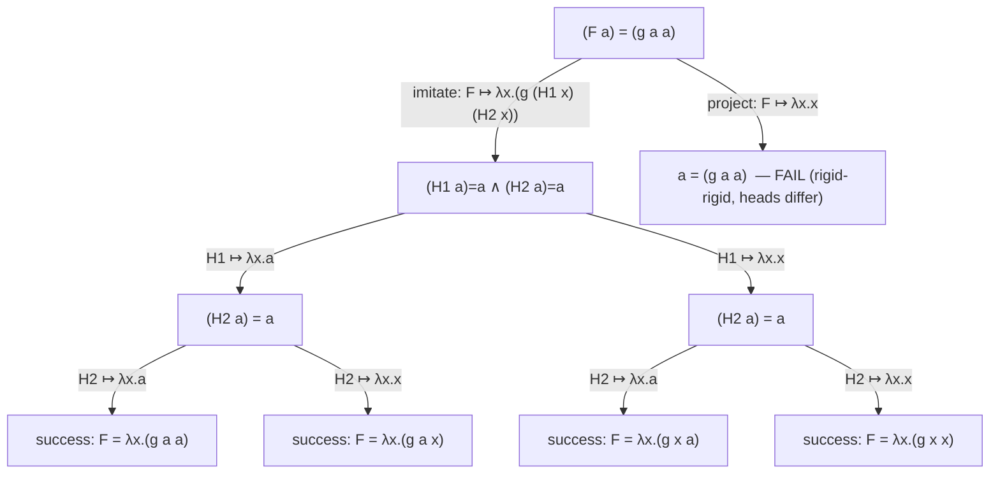
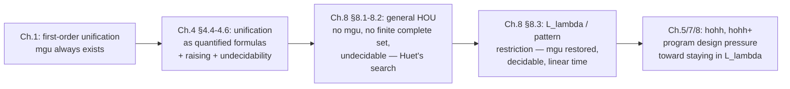

# Higher-Order Unification

[[book-guidelines|↩ Back to guidelines]]

## Why this is hard in a way first-order unification isn't

First-order unification asks: given two terms built from variables, constants, and function symbols, is there a substitution that makes them syntactically identical? Robinson's algorithm answers this in near-linear time, and — crucially — whenever a unifier exists, there is a *most general* one that subsumes every other unifier. This single fact is what makes Prolog's SLD-resolution deterministic-enough to implement efficiently: compute the mgu once, move on.

Higher-order unification asks the same question but over simply typed $\lambda$-terms, with equality taken to mean $\beta\eta$-convertibility rather than syntactic identity. That one change — "equal up to conversion" instead of "equal up to variable renaming" — is enough to break almost everything that made first-order unification tractable. There may be no most general unifier. There may be no finite set of unifiers that covers all the others. And the question "does a unifier exist at all" is, in general, *undecidable*.

If you're building an elaborator that resolves implicit arguments by unifying metavariables against expected types — which is exactly the second standing project this vault is tracking — this chapter is where you learn *why* real systems (Lean's kernel included) don't attempt full higher-order unification, and what fragment they actually implement instead.

## Unification problems as quantified formulas

Chapter 1 introduced first-order unification problems as multisets of equations, solved by an algorithm (term reduction, reorientation, variable elimination) whose [[First-Order-Unification#Termination and correctness|termination and correctness]] you can check by a simple measure on term size. Chapter 4 reframes unification problems logically: a unification problem is a *formula*, and finding a unifier is a search for a proof of that formula.

Concretely, a unification problem is written

$$
Q_1 x_1 \ldots Q_n x_n \,[\, t_1 = s_1 \wedge \cdots \wedge t_m = s_m \,]
$$

where each $Q_i$ is $\forall$ or $\exists$. The universally quantified variables stand for the constants of the ambient signature (think: everything already declared, held rigid); the existentially quantified variables are the *logic variables* — the ones a unifier actually has to instantiate.

This is a genuine reframing, not just notation. It lets the book state a distinction that has no first-order analogue:

- A **unifier** $\theta$ makes $\theta(t_j)$ and $\theta(s_j)$ $\lambda$-convertible for every $j$, subject only to the syntactic constraint that the universally quantified variables inside the "inner" quantifier block don't leak into $\theta$'s range.
- A **solution** is a unifier whose substitution terms are built *only* from the variables that were free from the very start (the "outermost" universals) — i.e., a unifier that actually witnesses provability of the quantified formula, with no leftover free logic variables.

**[[Hereditary-Harrop-Formulas-and-Modular-Search#What breaks without this|What breaks without this]] distinction:** take the trivial problem $\{X = X\}$, read logically as $\exists x\,[x = x]$. As a unification problem in the Chapter 1 sense it has the trivial solution $\{X, X\}$ — nothing to check. But proving $\exists x\,[x=x]$ as a formula requires exhibiting an actual *closed term* $t$ of the right type and showing $t = t$. If the type in question has no closed terms — which can genuinely happen in this logic, since the book does not assume every type is inhabited ([[The-Simply-Typed-Lambda-Calculus#Church numerals|Church numerals]] are built by treating $i$ as uninhabited, so that $(i\to i)\to i \to i$ is exactly the Church-numeral type and nothing else) — then the formula has no proof even though the "unification problem" looks solved. This is why the book insists on distinguishing "unifier" from "solution": in a setting without the classical nonempty-domain assumption, a unifier can be logically empty. In practice, the book (and this chapter) works with unifiers — the "solution" refinement matters mainly for provability, not for the pragmatics of what a $\lambda$Prolog interpreter does at runtime.

## Raising: pushing existentials past universals

A unification problem in fully general form can have arbitrarily alternating quantifiers, and quantification can even sit *inside* the matrix (e.g. two abstracted terms $(\lambda y\, t) = (\lambda y\, s)$, read as $\forall y\,[t=s]$). To make the problem tractable to reason about uniformly, the book normalizes every unification problem down to a **$\forall\exists\forall$ prefix** — one block of universals (the fixed signature), then one block of existentials (the unknowns), then possibly one more block of universals introduced by the abstractions inside the equations themselves.

The tool that does this normalization is **raising**, and its logical justification is a small equivalence: $\forall y\, \exists x\, G$ is provable iff $\exists h\, \forall y\, G[h\,y / x]$ is, where $h$ has the "raised" type $\sigma \to \tau$ (with $y:\sigma$, $x:\tau$). Reading left to right: witness $x$ with a term $t$ possibly depending on the fresh constant standing for $y$ — package that dependency as a function $h$ instead, and existentially quantify over $h$ itself, outside the $\forall y$. This lets you slide an existential quantifier leftward past a universal quantifier that used to sit in front of it, at the cost of raising the type of the existential variable by the domain of the universal it jumped.

The book is explicit that **raising is the dual of Skolemization**, and spells out the duality precisely:

| | moves | introduces | direction |
|---|---|---|---|
| Skolemization | $\exists$ to a *smaller* scope | a new constant (eigenvariable) of raised type | assumption: $\forall x\,\exists y\, D \rightsquigarrow \forall x\, D[f\,x/y]$ |
| Raising | $\forall$ to a *smaller* scope | a new existentially quantified variable of raised type | goal: $\forall y\, \exists x\, G \rightsquigarrow \exists h\, \forall y\, G[h\,y/x]$ |

Skolemization eliminates an existential by manufacturing a witness function and holding it fixed; raising eliminates a *stray* universal-before-existential ordering by making the existential itself carry an extra argument. Both are "the same trick" pointed in opposite directions, but the book flags that relating unifiers for the raised (or Skolemized) problem back to the original is delicate once higher-order types are involved — it's not a free lunch, just a normalization that keeps the bookkeeping uniform.

**What breaks without raising:** without a canonical $\forall\exists\forall$ shape, every later procedure (rigid/flexible classification, simplification, imitation/projection) would need to handle arbitrary quantifier nesting as a special case. Raising is the "put it in a normal form once, then build the algorithm against the normal form" move — the same role that, say, converting to prenex normal form plays for first-order proof search, or that ANF/CPS conversion plays before writing a compiler pass.

## Rigid and flexible terms, and the four kinds of equations

Every $\lambda$-term in $\beta$-normal form has the shape

$$
\lambda x_1 \ldots \lambda x_n\,(h\; t_1 \cdots t_p)
$$

— a **binder** $x_1,\ldots,x_n$, a **head** $h$, and **arguments** $t_1,\ldots,t_p$ (together the **body**). This is exactly the shape you'd use to define a `Term` type in Rust as a normal-form-only AST node: a fixed list of bound names, a head symbol, and a spine of argument terms. The book also uses the finer **$\beta\eta$-long normal form**, which additionally $\eta$-expands every subterm until the body has purely non-functional (primitive) type — this is the canonical form the unification algorithm actually works over, since it removes any residual ambiguity from partially-applied heads.

The head $h$ is one of three things: a variable bound by a $\forall$ in the prefix, a variable in the term's own binder, or a variable bound by an $\exists$ in the prefix. The first two cases are called **rigid**: substitution can never change what the head *is*, only what it's applied to. The third case is **flexible**: substituting for an existential can replace the entire head-and-spine structure wholesale.

> If a term is rigid, any substitution instance of it keeps the same head. If it's flexible, a substitution can change the head outright.

This single distinction is the load-bearing one for the whole chapter, because it lets equations in a unification problem's matrix be classified into four kinds: **rigid-rigid**, **rigid-flexible**, **flexible-rigid**, and **flexible-flexible**. Each kind gets different treatment, mirrored directly by the algorithm in §8.2:

- **Rigid-rigid**: since neither head can move, a unifier must have identical heads on both sides — if the heads differ, the equation (and the whole problem) is immediately unprovable; if they match, the equation decomposes into equations between corresponding arguments (`(c s1...sn) = (c t1...tn)` becomes `s1=t1 ∧ ... ∧ sn=tn`). This is called **simplification**, and it's structurally identical to first-order term decomposition.
- **Flexible-rigid** (and symmetrically rigid-flexible): the only way to make progress is to guess a substitution for the flexible head that forces it to expose the rigid head — this is where **imitation** and **projection** substitutions come in (next section).
- **Flexible-flexible**: neither side can be forced to expose a particular head deterministically; the book shows these are always solvable (there's a **canonical substitution** that trivially unifies any flexible-flexible conjunction — send every existential of primitive type to one shared fresh variable, everything else to the $\eta$-long term built from that), but characterizing *all* solutions is intractable and not attempted. A unification problem reduced entirely to flexible-flexible form is treated as a *success* — this is called **pre-unification**, and it's the actual target Huet's procedure aims for, not full unification.

A worked structural constraint worth internalizing: substitution can never *capture* a bound variable that a rigid term's body doesn't already use, and it can never introduce a "vacuous" binder use into a flexible term beyond what the arguments allow. E.g. $\lambda x\,\lambda y\, F\,(f\,x\,(G\,x))$ can become any $\lambda x\,\lambda y\,t$ where $t$ doesn't contain $y$ free — the binder for $y$ stays vacuous no matter what you substitute for $F$, because $F$'s argument list never mentions $y$. This constraint is exactly what makes the later pattern-unification algorithm (§8.3) deterministic: the *arguments a flexible variable is applied to* pin down which bound variables can possibly appear in its eventual instantiation.

## Undecidability: two independent reductions

Chapter 4 closes with two reductions establishing that higher-order unification is genuinely undecidable — not just hard to make efficient, but formally unsolvable in general.

**Post correspondence (§4.6.1).** Given two lists of strings $s_1,\ldots,s_n$ and $t_1,\ldots,t_n$ over $\{u,v\}$, the Post correspondence problem asks whether some index sequence $i_1,\ldots,i_k$ makes $s_{i_1}\cdots s_{i_k} = t_{i_1}\cdots t_{i_k}$. This is classically undecidable. The book encodes strings over $\{u,v\}$ as closed terms of type $i \to i$ (a string $r_1\cdots r_m$ becomes $\lambda w\,(r_1(\cdots(r_m\,w)\cdots))$, so concatenation is just composition), assumes the type $i$ has no constructors of its own (so the only closed terms of the relevant function type really are these encoded strings), and then poses:

$$
\exists F\,\exists G\,\forall u\,\forall v\,\big[(F\,\hat s_1\cdots \hat s_n) = (F\,\hat t_1\cdots \hat t_n) \;\wedge\; (F\,u\cdots u) = \lambda w\,(u\,(G\,u\,w))\big]
$$

A solution for $F$ must be a term built from *some selection* of its arguments composed together — and a nonempty selection satisfying the equality is exactly a solution to the correspondence instance. The second conjunct exists purely to rule out the degenerate empty-selection case. This reduction is *third-order* (the types of $F$ and $G$ nest two arrows deep) — historically the first proof (Huet 1973) that unification is undecidable already at third order.

**Hilbert's Tenth Problem (§4.6.2).** Diophantine equations built from addition and multiplication over natural numbers are, by Matiyasevich's theorem, undecidable to solve in general. The book reduces this to unification by encoding naturals as Church numerals (closed terms of type $(i\to i) \to i \to i$, again with $i$ taken to have no constructors) and giving three fixed "gadget" unification problems whose unique solutions correspond to the successor, addition, and multiplication relations on Church-numeral-encoded naturals — for instance $\exists M\,\exists N\,\exists P\,[(\lambda f\lambda x\,(N\,f)\,(M\,f)\,x) = (\lambda f\lambda x\, P\,f\,x)]$ has $\{N{\mapsto}\underline n, M{\mapsto}\underline m, P{\mapsto}\underline{n{+}m}\}$ as exactly its solutions. Chaining these gadgets per equation turns an arbitrary Diophantine system into a *flexible-flexible* unification problem — third order again — solvable iff the Diophantine system is. Because the problem is stated in terms of *solutions* (closed-term instantiations) rather than mere *unifiers*, the reduction depends precisely on the unifier/solution distinction from §4.4.2: the trivial "canonical substitution" always exists as a unifier here, but it uses an open variable, so it is *not* a solution, and doesn't trivialize the reduction.

Both reductions matter for the same reason: they explain why no later chapter even attempts a decidability result for hohh's unrestricted flexible atoms, and they set up the motivation for carving out a decidable fragment — which is exactly where the chapter is heading.

## Huet's pre-unification procedure

Given the rigid/flexible classification, §8.2 assembles a search procedure. The two moves beyond simplification are the ones that handle a flexible-rigid equation $(F\,t_1 \cdots t_n) = (c\,s_1\cdots s_m)$, where $F$ is existential and $c$ is a universal (rigid) head:

**Imitation.** Legal only when $F$'s quantifier is inside the scope of $c$'s quantifier (so $c$ is "available" as a constant at $F$'s binding site). If $F : \tau_1\to\cdots\to\tau_n\to\beta$ and $c:\sigma_1\to\cdots\to\sigma_m\to\beta$, imitation substitutes

$$
F \mapsto \lambda x_1\ldots\lambda x_n\,(c\;(H_1\,x_1\cdots x_n)\cdots(H_m\,x_1\cdots x_n))
$$

with each $H_i$ a fresh existential. This commits to the head being $c$ while leaving every argument fully open (as a fresh flexible term applied to all of $F$'s original arguments) — the *"copy the rigid head, defer the arguments"* move.

**Projection.** For each argument position $i$ of $F$ whose type's target matches $\beta$ (the target type of the whole flexible term), there's a substitution

$$
F \mapsto \lambda x_1\ldots\lambda x_n\,(x_i\;(H_1\,x_1\cdots x_n)\cdots(H_k\,x_1\cdots x_n))
$$

which commits to $F$'s *own $i$-th argument* becoming the new head. There are between $0$ and $n$ valid projections and at most one imitation, so a flexible-rigid equation branches into at most $n+1$ children.

This is genuinely a search tree, not a deterministic function — the book's own worked example, $\forall a\,\forall g\,\exists F\,[(F\,a) = (g\,a\,a)]$, produces exactly the matching tree reproduced below (Fig. 8.1), and different root-to-leaf paths yield the *four distinct* unifiers $\{F \mapsto \lambda x. g\,x\,x\}$, $\{F\mapsto \lambda x. g\,a\,x\}$, $\{F\mapsto\lambda x.g\,x\,a\}$, $\{F\mapsto\lambda x. g\,a\,a\}$ — none of which is more general than another. This is the concrete instance of "no mgu": a $\forall\exists$-shaped problem with a rigid template on the right and enough repeated occurrences of the same variable ($a$ appearing twice under $g$) to make multiple incomparable solutions genuinely necessary.

The tree can also fail to be finite. $\forall g\,\exists F\,\forall x\,[(F\,(g\,x)) = (g\,(F\,x))]$ has a unique projection that solves it immediately ($F\mapsto\lambda x.x$), but also an imitation branch $F \mapsto \lambda x.(g\,(H\,x))$ that simplifies back to a problem *syntactically identical to the original* (with $H$ in place of $F$) — an infinite path generating the infinite unifier family $\lambda x.x,\ \lambda x.(g\,x),\ \lambda x.(g\,(g\,x)),\ldots$. This is the concrete witness for "no finite complete set of unifiers," and — combined with the Post/Diophantine reductions — for undecidability itself: since unifiability can't be decided in general, some matching trees must have an infinite path and *no* success node anywhere, with no way to know this from a finite inspection.

The procedure's completeness guarantee is precise and worth stating exactly as the book does: **if the root has a unifier, the matching tree has a success node at finite depth**, regardless of which equation you pick to branch on at each step. That's what makes it a genuine (semi-)decision procedure for unifiability, even though it can't be a full decision procedure.

## The $L_\lambda$ pattern fragment: why it's tractable

This is the section the learning-goals file flags as a standing priority thread, so it's worth slowing down here.

The **$L_\lambda$ condition** (a.k.a. the *pattern* condition, and this is precisely what's meant by "Miller patterns" in the unification literature) restricts every subterm of the form $(x\,t_1\cdots t_n)$, where $x$ is an essentially-existential variable, to have $t_1,\ldots,t_n$ be **distinct, universally-quantified variables bound within $x$'s own scope**. In other words: a metavariable may only ever be applied to a list of *distinct bound variables* — never to a compound term, never to a repeated variable, never to another metavariable.

Why does this one syntactic restriction fix everything?

1. **Imitation/projection collapses to (at most) one live choice.** In a flexible-rigid equation $(F\,c_1\cdots c_n) = (c\,t_1\cdots t_m)$ under the pattern condition: if $F$'s quantifier is inside $c$'s scope, every projection immediately fails simplification (because $c$ is distinct from all the $c_i$, by the pattern condition's *distinctness* requirement) — so imitation is the only live branch. If $c$'s quantifier is inside $F$'s scope, imitation isn't even legal, and at most one $c_i$ can equal $c$ (again by distinctness) — so at most one projection is live. Either way: **branching factor 1.** The search tree degenerates into a straight-line computation.
2. **Flexible-flexible pairs get an actual most general unifier**, not just *some* unifier. For $(F\,c_1\cdots c_n) = (G\,d_1\cdots d_m)$ with $F\ne G$, let $e_1,\ldots,e_\ell$ be the variables common to both argument lists; the substitution $F,G \mapsto \lambda \vec c\,(H\,\vec e)$ (fresh $H$) is shown to be a most general unifier — any common instance must avoid every non-shared variable, and this substitution is exactly the "keep only what's shared" solution. (The book handles $F=G$ separately, filtering to positions where $c_i = d_i$.)
3. **The remaining engine is "variable elimination"** — a single generalized operation folding together occurs-check, pruning of non-permitted variables, and the actual binding, applied to a flexible-rigid equation $(F\,c_1\cdots c_n) = t$. It (a) prunes any flexible subterm of $t$ whose arguments aren't all among $c_1,\ldots,c_n$ (a **pruning substitution**), then (b) fails if $F$ itself, or any universal variable outside $c_1,\ldots,c_n$, still occurs in the result — otherwise binds $F \mapsto \lambda c_1\ldots c_n\,t'$ directly.

The book states the payoff explicitly: **higher-order pattern unification is decidable and possesses most general unifiers** — and it is "computationally similar to first-order unification," with variable elimination as the higher-order analogue of first-order variable elimination, differing mainly in bookkeeping complexity, not in kind. A later remark (Qian 1996, cited in the bibliographic notes) establishes it runs in **linear time**.

**Where general HOU still lurks and how practice papers over it (§8.4).** Two loose ends the book is candid about:

- *Raising cost.* Real $\lambda$Prolog computations don't hand you a clean $\forall\exists\forall$ prefix; raising has to happen dynamically and can raise an existential over long lists of universals, much of which is wasted work later undone by pruning. The fix sketched is **delayed raising** — keep, per existential variable, the list of universals it's eligible to be raised over, and only materialize the raise when variable elimination actually needs it (implementable efficiently since these lists are prefixes of one shared sequence, so numeric "universe" indices suffice).
- *Programs that violate $L_\lambda$ on paper but not at runtime.* The canonical example is the `subst` predicate (`subst R N (R N).`) used to realize object-level substitution via meta-level $\beta$-reduction (Chapter 7) — `(R N)` applies an existential to another existential, which is *not* a pattern. The book's practical resolution is **dynamic $L_\lambda$ programming**: don't statically reject such clauses, just expect (and in practice guarantee, by the calling discipline of the predicate) that by the time this equation is actually solved, $R$ and $N$ are already fully instantiated closed terms, so the equation reduces to ordinary $\beta$-reduction rather than a genuine unification problem. More generally, a solver can *attempt* pattern unification everywhere and defer (suspend) any equation that turns out non-pattern until further substitutions from elsewhere resolve it into pattern form.

## Synthesis: where this sits and where it leads

This chapter is the technical hinge the rest of the book's "higher-order logic programming is practical" claim depends on. Chapters 5, 7, and 8 don't grant $\lambda$Prolog unrestricted higher-order unification as an operational primitive — they're explicit (§5.9, "[[Higher-Order-Logic-Programming-Languages#Higher-order unification is not a panacea|higher-order unification is not a panacea]]") that doing so invites spurious solutions and undecidable search. Instead, the language design and the *idiom* of $\lambda$-tree syntax (Chapter 7) steer programs toward staying inside $L_\lambda$: predicate arguments applied to distinct bound eigenvariables, which is exactly the shape that "mobility of binders" naturally produces. Teyjus's second implementation generation drops general HOU altogether and implements only $L_\lambda$ unification (§8.5, and the Appendix's closing remark that this is a genuine, named deviation from the idealized language of the main text).

For the two standing projects this vault is tracking against: this is close to the whole ballgame for the elaborator target. Lean's kernel — and essentially every practical dependently typed elaborator's `isDefEq`/unifier — does not attempt general higher-order unification for metavariable-headed equations; it attempts **pattern unification** first (metavariable applied to distinct local/bound variables), falls back to heuristics or postponement for non-pattern cases, and treats genuinely ambiguous higher-order equations (the "no mgu" cases this chapter demonstrates concretely, like $\forall a\,\forall g\,\exists F\,[(F\,a)=(g\,a\,a)]$) as either unsolvable-without-more-information or resolved by elaboration-order heuristics rather than full search. The variable-elimination algorithm in §8.3 — prune-then-bind, occurs-check folded in — is, almost line for line, what a pattern-unification metavariable assignment routine in such an elaborator does. For the Rust verifier/checker target, the relevant transfer is narrower but still real: any place where a checker needs to solve for an unknown *predicate* or *relation* (rather than just an unknown term) inside a specification is walking directly into this chapter's undecidability results, which is the argument for keeping such unknowns pattern-shaped by construction rather than hoping a general solver will terminate.
