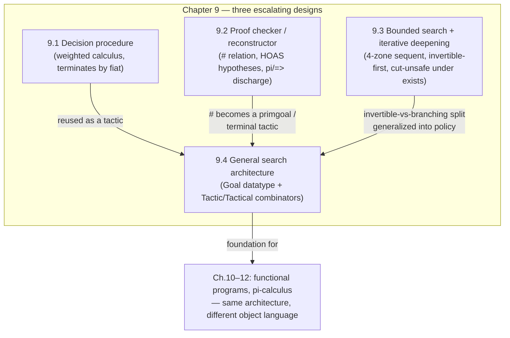

# Implementing Proof Systems

Chapters 1–8 built the machinery: typed $\lambda$-terms as a representation for syntax-with-binding, higher-order unification, hereditary Harrop formulas as the logical core of $\lambda$Prolog. Chapter 9 is where the book cashes that machinery in. The question it asks is blunt: *if formulas and proofs are just $\lambda$-terms, and provability is just logic programming, can you actually write a theorem prover this way?*

The chapter's honest answer is: sort of, and the "sort of" is the interesting part. A direct transcription of a proof system's inference rules into $\lambda$Prolog clauses is almost always *sound* — every derivation the program finds really is a proof — but it is routinely *incomplete in practice*, because depth-first SLD-resolution-with-backtracking has no idea that some transcriptions loop forever. Chapter 9 is a case study in the gap between "this specification is logically correct" and "this specification is an algorithm," and in the machinery ($\lambda$Prolog's `pi` and `=>`, plus a layer of goals/tactics/tacticals) that closes that gap without leaving the logic-programming paradigm.

This maps almost one-to-one onto the "Rust verifier with an embedded automated theorem prover" project from the learning goals: the chapter is literally the design history of *what an ITP/ATP's search engine looks like once you decide to treat inference rules as data instead of as a fixed interpreter loop*. Hold onto that thread — it's picked back up explicitly in the closing synthesis.

---

## 1. The problem: soundness is easy, termination is not

### 1.1 Why a "transparent" translation can loop

Section 2.4.5 (recalled here) showed the general recipe: take a sequent-calculus rule, read it bottom-up as "the conclusion sequent is provable if all the premise sequents are provable," and write that down as a Horn clause. This recipe is *sound by construction* — you're just restating the inference rule as an if-then. The catch is *completeness under a specific search strategy*. $\lambda$Prolog, like Prolog, searches depth-first with backtracking. If some rule's premise can be syntactically identical to its conclusion, the clause for that rule can call itself with the exact same goal, and depth-first search dives into an infinite left-recursive loop before it ever tries the right premise.

The book's example is the standard `⊃L` (left-implication) rule for intuitionistic propositional sequent calculus, Figure 9.1:

$$
\dfrac{\Gamma, A{\supset}B \longrightarrow A \qquad \Gamma, B \longrightarrow G}{\Gamma, A{\supset}B \longrightarrow G}\ {\supset}L
$$

Instantiate with $A = p, B = q$: the left premise of proving $p{\supset}q \longrightarrow q$ from $p{\supset}q \longrightarrow p$ is *syntactically the conclusion itself*. A direct clause

```
seq Gamma G :- memb_and_rest (A ==> B) Gamma Gamma',
               seq Gamma B_side_stuff,   % this can recreate the same sequent
               ...
```

can recurse on the same goal forever. **What breaks without a fix:** nothing about the logic is wrong — the rule is sound and (with the right calculus) complete — but naive depth-first execution never terminates on it. This is the central tension of the whole chapter: *proof theory tells you a calculus is complete; it says nothing about whether a particular search strategy over that calculus terminates.* That gap is exactly what any hand-built ATP has to close, and it's why "just translate the typing/inference rules into Prolog clauses" is not itself a verifier — you additionally need a termination argument (or an explicit search controller, which is where Section 9.4 ends up).

### 1.2 The fix: reformulate the calculus so premises are provably smaller

The book's solution at this stage isn't a smarter search strategy — it's a *better calculus*. Section 9.1 replaces the single `⊃L` rule with six rules (Figure 9.2, due to Hudelmaier and Dyckhoff) that case-split on the shape of the antecedent $A$ in $A \supset B$:

$$
\dfrac{\Gamma, A, B \longrightarrow G}{\Gamma, A, A{\supset}B \longrightarrow G}\ {\supset}L_1\ (A\text{ atomic})
\qquad
\dfrac{\Gamma, C{\supset}(D{\supset}B) \longrightarrow G}{\Gamma, (C{\wedge}D){\supset}B \longrightarrow G}\ {\supset}L_2
$$

$$
\dfrac{\Gamma, C{\supset}B,\, D{\supset}B \longrightarrow G}{\Gamma, (C{\vee}D){\supset}B \longrightarrow G}\ {\supset}L_3
\qquad
\dfrac{\Gamma, D{\supset}B \longrightarrow C{\supset}D \qquad \Gamma, B \longrightarrow G}{\Gamma, (C{\supset}D){\supset}B \longrightarrow G}\ {\supset}L_4
$$

and two degenerate cases for $\bot \supset B$ and $\top \supset B$. The point of this reformulation is that one can assign a **weight** to formulas and sequents such that the weight of every premise is strictly less than the weight of the conclusion, for *every* rule in the system, not just the easy ones. That turns "provability search" into a **decision procedure**: depth-first search over Figure 9.3's clauses is guaranteed to terminate, because there is a well-founded measure decreasing at every step. This is the textbook technique for building any decidable proof-search algorithm — it's the same idea as measuring formula size to show that a naive-CNF-conversion tautology checker terminates, or that a typing-rule-driven type checker terminates on syntax-directed derivation.

**Rust framing.** This is precisely the shape of a terminating recursive-descent proof search you'd write for a fragment of a specification language: an `enum Formula` with a `fn weight(&self) -> usize` (or a `derive` of `Ord` on a well-founded lexicographic measure), and a search function whose recursive calls are only ever made on strictly smaller weight. In a Rust verifier this is the difference between a `fn prove(seq: &Sequent) -> bool` that can be *proved* to terminate by structural induction on `weight`, versus one you just hope terminates.

```rust
enum Formula {
    Atom(String),
    True, False,
    And(Box<Formula>, Box<Formula>),
    Or(Box<Formula>, Box<Formula>),
    Imp(Box<Formula>, Box<Formula>),
}

fn weight(f: &Formula) -> usize {
    match f {
        Formula::Atom(_) | Formula::True | Formula::False => 1,
        Formula::And(a, b) | Formula::Or(a, b) => 1 + weight(a) + weight(b),
        // Imp gets extra weight precisely because it can appear
        // in both a conclusion and (case-split) a premise:
        Formula::Imp(a, b) => 1 + 2 * weight(a) + weight(b),
    }
}
```

The `Imp` case getting extra weight mirrors why the `⊃L` rule alone was the troublemaker — case-splitting on the antecedent's shape is what buys the strict decrease that a single undifferentiated `⊃L` clause could not guarantee.

---

## 2. Encoding natural deduction: proofs as first-class typed terms

Section 9.2 switches proof styles — from sequent calculus to **natural deduction** — and, more importantly, switches *what's being computed*. Instead of a provability predicate that only answers yes/no, the specification now builds an explicit **proof object**: a $\lambda$Prolog term of a new type `proof` that *is* the derivation tree, constructor by constructor.

### 2.1 Proof objects as an inductive datatype

Figure 9.5 declares one constructor per inference rule in the natural deduction system (Figure 9.4):

```
kind     proof              type.
type true_i                 proof.
type false_e                form -> proof -> proof.
type and_i                  proof -> proof -> proof.
type and_e1, and_e2         form -> proof -> proof.
type imp_i                  (proof -> proof) -> proof.
type imp_e                  form -> proof -> proof -> proof.
type or_i1, or_i2           proof -> proof.
type or_e                   form -> form -> proof ->
                            (proof -> proof) -> (proof -> proof) -> proof.
type all_e                  term -> (term -> form) -> proof -> proof.
type all_i                  (term -> proof) -> proof.
type some_e                 (term -> form) -> proof ->
                            (term -> proof -> proof) -> proof.
type some_i                 term -> proof -> proof.
```

This is a Rust programmer's `enum` with typed payloads, and the design choice to notice immediately: `imp_i` doesn't take a proof of $B$ and a "hypothesis marker" — it takes a **function from proofs to proofs**, `proof -> proof`. A proof of $A \supset B$ under `imp_i` is represented as a function that, given any proof of $A$, produces a proof of $B$. This is $\supset$-introduction encoded via **higher-order abstract syntax (HOAS)**: the hypothetical judgment "assume $A$, derive $B$" becomes a genuine object-language function, and the book's earlier machinery for binding (Chapter 7's $\lambda$-tree syntax) is what makes this legitimate rather than a hack. The same move recurs for `or_e` (two case-proof continuations `proof -> proof`), `all_i` (`term -> proof`, one proof per instantiation), and `some_e` (`term -> proof -> proof`, an eigenvariable-and-hypothesis-abstracted continuation).

**Rust framing.** In Rust you would model this as an enum whose introduction-rule variants that discharge a hypothesis carry a closure or a de Bruijn-indexed body rather than a name:

```rust
enum Proof {
    TrueI,
    AndI(Box<Proof>, Box<Proof>),
    ImpI(Box<dyn Fn(Proof) -> Proof>),   // HOAS-style hypothetical
    ImpE(Box<Form>, Box<Proof>, Box<Proof>),
    AllI(Box<dyn Fn(Term) -> Proof>),
    // ...
}
```

Real Rust verifiers virtually never use `Box<dyn Fn>` for this (no decidable equality, no easy traversal) — they use de Bruijn indices or a name-and-context representation instead. But the HOAS version is exactly what the *shape* of the mechanism is, and it's worth building once to see why de Bruijn indices exist: they're the first-order encoding of precisely this "hypothesis is a bound variable" idea, chosen for tractability over elegance.

### 2.2 The `#` relation: proof objects as a typing judgment

The heart of Section 9.2 is the infix predicate `#`, read "is a proof of":

```
type #                    proof -> form -> o.
infix # 2.

true_i # tt.
(and_i P1 P2) # (A && B) :- (P1 # A), (P2 # B).
(imp_i Q) # (A ==> B)    :- pi p\ (p # A) => ((Q p) # B).
(all_i Q) # (all A)      :- pi y\ (Q y) # (A y).
(or_e A B P Q1 Q2) # C   :- (P # (A !! B)),
                            (pi p1\ (p1 # A) => ((Q1 p1) # C)),
                            (pi p2\ (p2 # B) => ((Q2 p2) # C)).
(some_e A P1 Q) # B      :- (P1 # (some A)),
                            pi y\ pi p\ (p # (A y)) => ((Q y p) # B).
```

Read the `imp_i` clause carefully, because it is the entire chapter's thesis in one line. `(imp_i Q) # (A ==> B)` holds iff, for a **fresh, universally quantified** proof variable `p` (`pi p\ ...`), assuming `p # A` (`(p # A) => ...`) lets you derive `(Q p) # B`. Two $\lambda$Prolog primitives do all the work here:

- **`pi p\ ...`** (universal quantification in goal position) introduces a genuinely fresh eigenvariable `p` for the scope of the goal — this is what enforces the "$y$ must not occur free in the conclusion or any undischarged assumption" side-condition on rules like $\forall I$ and $\exists E$ *for free*, because $\lambda$Prolog's proof theory (backward-chaining under `pi`) already guarantees the variable it introduces is new.
- **`=>`** (implication in goal position, "assume-and-prove," or hypothetical judgment) temporarily adds `p # A` to the program's clause database for the duration of proving `(Q p) # B` — this is exactly how you discharge a hypothesis in natural deduction, and it's the mechanism, not a simulation of it.

So the two hardest bookkeeping problems in implementing natural deduction — *managing a context of open hypotheses* and *guaranteeing eigenvariable freshness* — are not implemented by the $\lambda$Prolog program at all. They are inherited from the meta-level proof theory of hereditary Harrop formulas that Chapters 3–4 already established. This is the "adequacy" payoff the earlier chapters were building toward: the object language's binding and hypothesis discipline rides for free on the meta-language's.

**This is the load-bearing connection to the elaborator/unification project.** The book flags it explicitly in the bibliographic notes (§9.5, p. 245–246): `P # A` is a **typing judgment** in the LF (Edinburgh Logic Framework) sense — "$P$ is a proof of $A$" reads exactly like "$e$ has type $\tau$" — and Felty and Miller showed LF typing derivations can be translated automatically into $\lambda$Prolog programs of this shape. The book is explicit that this is *not* just an analogy: dependently-typed proof checking (Lean's kernel, in your terms) and this `#` relation are doing the same job — checking that a syntactic object witnesses a judgment — with the difference being *where* the check lives. LF's dependent type checker validates `P # A` internally, as part of type checking, so a malformed `P` is a type error before you even ask "is this a proof." $\lambda$Prolog's `#` is external: `(some_junk_term) # (a ==> a)` is perfectly well-typed as a *term*, and `#` simply fails to hold as a *relation*. That is the difference between Lean's `isDefEq`/kernel check rejecting an ill-typed term outright and a logic-programming relation that happens to be unsatisfiable for that input — worth sitting with, because it's the exact seam your Rust verifier will have to choose a side of: do malformed proof terms get rejected by the type system, or by failure of a checking predicate?

Because `#` is a genuine relation and not a one-way checker, running it with the proof argument left as a **logic variable** does double duty:

```
?- (imp_i P\ all_i y\ imp_i Q\ ...) # R.
R = a && b ==> b && a.
```

— pass a complete proof term, compute the formula it proves (proof objects determine formulas: this is proof *reconstruction*, not just checking). And running it with a partially-specified proof term and *un*instantiated internal metavariables (`A`, `A'` in the example on p. 234) lets $\lambda$Prolog's unification fill in missing subterms — a primitive, unrestricted-first-order-unification analogue of what a real elaborator does with implicit-argument metavariables under Miller-pattern unification. The chapter doesn't develop this into general elaboration (that's Chapter 8's territory, already covered), but it's the same phenomenon in miniature: **a bidirectional discipline** is implicit here too — `#` used to check ("is this specific `P` a proof of this specific `A`?") is the *checking* mode, `#` used with `P` a variable is *synthesis*, and the fact that both directions are the *same predicate* rather than two separate algorithms is worth noticing as a design choice a hand-rolled bidirectional type checker in Rust would need to make explicit (usually as two separate functions, `check` and `infer`, precisely because Rust doesn't get unification for free the way $\lambda$Prolog's engine provides it).

### 2.3 Why proof checking here is not yet automated theorem proving

The naive next idea — "leave `P` as a logic variable and query `?- P # (a ==> ((a ==> b) ==> b)).` to get a theorem prover" — **does not work**, and the book says so directly (p. 234–235). The specification is *sound* (anything found is a real proof) but $\lambda$Prolog's fixed depth-first search order over the `#` clauses will loop on formulas that do have short proofs, for the same reason Section 9.1 opened with: **soundness of a specification is not the same as a terminating, complete search procedure over it.** This is deliberate scaffolding for Section 9.4: proof-checking predicates like `#` are exactly the *primitive goals* that a general-purpose search architecture (tactics/tacticals) will later be built to drive under a controllable strategy instead of $\lambda$Prolog's fixed one.

---

## 3. A theorem prover for classical logic: the four-zone sequent

Section 9.3 moves from "specify, hope it terminates" to "engineer termination and completeness explicitly," for a harder setting: **classical** first-order logic in negation normal form, with existential quantifiers requiring genuine search (unlike the earlier propositional decision procedure, where a weight argument sufficed).

### 3.1 The calculus CL and its four zones

The sequent form is $\Sigma : L\,;\,\Theta\,;\,\Delta$ — four zones with four distinct jobs:

| Zone | Contents | Role |
|---|---|---|
| $\Sigma$ | eigenvariables | signature of variables introduced by $\forall R$ |
| $L$ | literals | "committed" atomic/negated-atomic facts, checked for a matching pair to close a branch |
| $\Theta$ | NNF formulas (a **list**) | the active work queue — introduction rules only ever touch the *first* formula here |
| $\Delta$ | existentially-quantified formulas | a **reusable pool** — can be revisited to try further instantiations |

$$
\dfrac{\Sigma : L, A\,; \Theta\,; \Delta}{\Sigma : L\,; A,\Theta\,; \Delta}\ \text{literal}
\qquad
\dfrac{}{\Sigma : A, \lnot A, L\,; \cdot\,; \Delta}\ \text{initial}
\qquad
\dfrac{\Sigma : L\,; \Theta\,; \exists\tau x.B[t/x] \text{ instantiated}}{\Sigma : L\,; \cdot\,; \exists\tau x.B, \Delta}\ \exists R
$$

The zoning is itself a control strategy expressed as data structure, and this is the point worth dwelling on. "If the introduction zone $\Theta$ is nonempty, the first formula there **determines** the next rule with no choice" — this is what makes those rules **invertible**: applying them backward never loses provability, so they can be run eagerly with zero backtracking risk. Only once $\Theta$ is empty does genuine choice appear — between `initial` (check $L$ for a complementary pair) and $\exists R$ (reuse an item from $\Delta$, at the cost of potential nontermination). This is a textbook illustration of a principle every proof-search engine needs: **separate the deterministic, information-losing-if-delayed steps from the genuinely branching, backtracking-required steps**, and run the former eagerly.

### 3.2 Encoding eigenvariables and literals: pushing bookkeeping into the meta-level, again

Just as in Section 9.2, the $\lambda$Prolog encoding (Figure 9.9) doesn't carry $\Sigma$ or $L$ as explicit data structures at all:

```
prv ((all B) :: Gamma) Phi :- pi x\ prv ((B x)::Gamma) Phi.
prv (p A      :: Gamma) Phi :- lit (p A) => prv Gamma Phi.
prv (n A      :: Gamma) Phi :- lit (n A) => prv Gamma Phi.
prv nil Phi :- lit (n A), lit (p A).
```

$\Sigma$ becomes, once again, the `pi x\` binder — the eigenvariable literally *is* a $\lambda$Prolog bound variable, introduced fresh by the meta-interpreter. $L$ becomes an accumulating set of `lit` assumptions added via `=>`. Checking for a complementary pair reduces to asking whether both `lit (n A)` and `lit (p A)` are currently *provable as assumed facts* — i.e., first-order (unification-based) backward-chaining search over the meta-level's own assumption store does exactly the job that an explicit "scan list $L$ for $\neg$-pair" algorithm would otherwise have to implement by hand. Every zone in the object-level sequent maps onto a specific $\lambda$Prolog primitive: this is the strongest illustration in the whole book of "hereditary Harrop formulas are not just *sufficient* for encoding proof search — their proof theory *is* the natural home for it."

### 3.3 $\Delta$ as a bounded, reusable queue — and where a naive "fix" breaks completeness

$\Delta$, the existential pool, is the one zone that can't be handled by an implicit meta-level device, because reusing an item is exactly the thing that can *not* terminate (Figure 9.8's `qpush`/`qpop` queue-with-a-reuse-bound is built for this). The overall prover (`thm`) does the standard **iterative deepening** move: try bound 1, then 2, then 3, ..., using `posints` to generate the sequence and re-attempting the whole proof from scratch at each bound.

```
posints 1.
posints N :- posints M, N is M + 1.
thm B :- posints N, bound N => prv (B::nil) (que x\x).
```

This buys **completeness without giving up termination-per-attempt**: for the wrong bound, `prv` fails after finitely much work (the queue's reuse limit forces it); if a proof exists at some finite bound, iterative deepening eventually reaches it.

The chapter then runs a genuinely instructive failure case (p. 239–240). It's tempting to optimize: once a literal enters $L$, check *immediately* for a complementary partner instead of waiting for `initial`, and — since only the first such match matters — commit to it with Prolog's cut `!`:

```
prv (p A :: Gamma) Phi :- lit (n A), ! ; lit (p A) => prv Gamma Phi.
```

This is **unsound-by-omission** in exactly the setting that matters most: when existential instantiation is still undetermined. The counterexample is concrete — $(p(r\,c)) \vee (p(r\,t)) \vee (p(g\,c)) \vee \exists x.(\neg r(x) \wedge \neg g(x))$ is a classical theorem, but the cut-optimized prover fails to find its proof, because the free logic variable standing in for $x$ gets bound to `t` by one branch of the search, the cut discards the branch where it should have been bound to `c`, and no backtracking is left to recover the correct instantiation. **This is the single most important cautionary lesson in the chapter for anyone building a real ATP**: Prolog-style cut is a *control* commitment, and it is unsafe to combine with the still-open *data* commitments that unbound logic variables represent. A Rust ATP built around backtracking search over unification metavariables has to draw this line explicitly — you cannot prune a branch just because "the first solution looked complete," if a metavariable in that branch could still be resolved differently by an alternative continuation. This is precisely the discipline a resolution-based or tableau-based Rust prover needs baked into its search-state representation (e.g., not committing to a substitution until the whole proof search below it succeeds, or making commit-points only at genuinely deterministic — invertible — steps, which is exactly what Section 9.4 formalizes next).

---

## 4. Goals, tactics, and tacticals: search as a first-class, programmable object

Section 9.4 is the chapter's payoff and the part most directly reusable in an actual verifier's architecture. The motivating complaint: everything so far has "reflected provability directly into predicates," which is transparently correct but locks you into $\lambda$Prolog's own fixed search order. Sections 9.1–9.3 fought that constraint ad hoc (reweight the calculus, add a bounded queue, avoid cut). Section 9.4 generalizes the fix into a reusable architecture — **the LCF tactics/tacticals tradition** (Gordon–Milner–Wadsworth, originally in ML; this is its logic-programming incarnation, credited to Felty and Miller).

### 4.1 Goals as a datatype, decoupled from any one calculus

```
kind goal        type.
type trueg       goal.                       % vacuously true goal
type cc          goal -> goal -> goal.       % conjunctive goal
type allg        (A -> goal) -> goal.        % universally quantified goal
infixl cc        3.
```

`goal` is deliberately calculus-agnostic: a goal is either **primitive** (a formula, a sequent, a `P # A` judgment — anything your specific domain wants to prove) or one of three fixed combinators — trivially true, conjunctive, or universally quantified (`allg`, mirroring `pi`, again for eigenvariable freshness in whatever gets proved under it). `primgoal` is a predicate the client declares to mark which constructors count as primitive for a given application (graph reachability's `adj`/`path`, or the sequent calculus's `sq`, in the book's two worked examples).

**Rust framing.** This is the "trait for a proof obligation, generic over the specific judgment being proved" pattern:

```rust
enum Goal<P> {         // P = primitive-goal payload, e.g. a Sequent
    True,
    Conj(Box<Goal<P>>, Box<Goal<P>>),
    Forall(Box<dyn Fn(Term) -> Goal<P>>),
    Prim(P),
}
```

A tactic is then just a function (not a fixed clause-selection order) `Goal<P> -> Goal<P> -> bool`, or in Rust terms `fn(&Goal<P>) -> Option<Goal<P>>` — a transformation from one goal to a (possibly compound) new goal, representing "here is one way to reduce this obligation to subobligations." Compare this to `type initial, and_r, imp_r, ... : goal -> goal -> o` in Figure 9.12 — each inference rule of the intuitionistic sequent calculus becomes exactly one such relation, e.g.

```
imp_r   (sq Gamma (A ==> B)) (sq (A::Gamma) B).
and_r   (sq Gamma (A && B)) ((sq Gamma A) cc (sq Gamma B)).
all_r   (sq Gamma (all A)) (allg x\ sq Gamma (A x)).
```

This is a **decoupling** every real proof engine needs: the inference rule (a *fact* about the calculus) is separated from the *search policy* that decides when and in what order to apply it. That separation is what a Rust ATP's `Tactic` trait would encode, and it's the direct architectural ancestor of what Lean, Coq, and Isabelle all still do internally.

### 4.2 Tacticals: combinators over tactics, not over goals

```
idtac                In In.
then       Tac1 Tac2 In Out :- Tac1 In Mid, maptac Tac2 Mid Out.
orelse     Tac1 Tac2 In Out :- Tac1 In Out ; Tac2 In Out.
orelse!    Tac1 Tac2 In Out :- Tac1 In Out, ! ; Tac2 In Out.
repeat     Tac       In Out :- orelse (then Tac (repeat Tac)) idtac In Out.
try        Tac       In Out :- orelse Tac idtac In Out.
```

The one subtlety worth internalizing is why `then` needs `maptac` instead of naive sequential composition (`Tac1 In Mid, Tac2 Mid Out`). A tactic's contract is: *first* argument must be a **primitive** goal, second can be compound. After `Tac1` fires, `Mid` is generally compound (a conjunction of several sub-sequents, or something under an `allg`). `Tac2` can't just be handed `Mid` — it has to be **mapped across every primitive goal buried inside `Mid`**, recursing through `cc` and `allg` structure:

```
maptac Tac trueg trueg.
maptac Tac (I1 cc I2) (O1 cc O2) :- maptac Tac I1 O1, maptac Tac I2 O2.
maptac Tac (allg In) (allg Out) :- pi t\ maptac Tac (In t) (Out t).
maptac Tac In Out :- primgoal In, Tac In Out.
```

— which is, precisely, `Functor::fmap` for the `Goal` datatype, specialized to the leaves marked `primgoal`. This is a clean illustration of why "goals form a functor" is more than decoration: the entire `then` combinator's correctness *depends* on being able to push a transformation uniformly through the compound-goal structure, and that's exactly the guarantee a `Functor`/`Traversable` law gives you.

```rust
trait Tactic<P> {
    fn apply(&self, goal: &P) -> Option<Goal<P>>;
}

fn map_tac<P>(tac: &impl Tactic<P>, g: &Goal<P>) -> Option<Goal<P>> {
    match g {
        Goal::True => Some(Goal::True),
        Goal::Conj(a, b) => Some(Goal::Conj(
            Box::new(map_tac(tac, a)?),
            Box::new(map_tac(tac, b)?),
        )),
        Goal::Forall(f) => { /* apply under the binder, fresh var */ todo!() }
        Goal::Prim(p) => tac.apply(p),
    }
}

fn then<P>(t1: &impl Tactic<P>, t2: &impl Tactic<P>, g: &P) -> Option<Goal<P>> {
    let mid = t1.apply(g)?;
    map_tac(t2, &mid)
}
```

`orelse` is a first successful tactic wins with backtracking on failure preserved (crucially, plain `;` disjunction, **no cut** — a direct, deliberate echo of Section 9.3's cut-safety lesson: `orelse!` (with `!`) is offered as a separate, explicitly *riskier* combinator for when you're willing to trade completeness for determinism). `repeat` is the fixpoint of "apply, then try again, until it stops firing" — precisely `loop { if !tac_applies() { break } }` but expressed as logical repetition rather than an imperative loop, and inheriting backtracking for free if a later step in the overall proof fails and needs to reconsider how many times `repeat` should have fired.

### 4.3 Assembling a controllable proof script

The chapter's closing worked example composes these pieces into a script that decides

$$
(\forall x.\, p(x) \supset p(f(x))) \supset (\forall x.\, p(x) \supset p(f(f(x))))
$$

First, the **invertible** tactic — combining only the rules that can never lose completeness (conjunction and implication introduction, universal right, and left-conjunction — all information-preserving) — is applied exhaustively with no search risk:

```
invertible In Out :-
    repeat (orelse and_r (orelse and_l (orelse imp_r all_r))) In Out.
```

This mirrors, in a general-purpose way, the eager/deterministic-first discipline that Section 9.3's zoned sequent baked directly into its data structure — Section 9.4 shows that discipline doesn't need to be hardwired into a bespoke calculus; it can be expressed once, as a policy over arbitrary tactics. Then two instances of universal-left instantiation (`all_l`, `all_l'`) peel off the two quantifiers, and finally `ip_decide` hands the fully-instantiated propositional remainder off to the *Section 9.1 decision procedure* — reusing the earlier, narrower, guaranteed-terminating prover as one tactic among many, rather than reimplementing its logic:

```
ip_decide (sq Gamma A) trueg :- seq Gamma A.

?- then invertible (then all_l (then all_l' ip_decide))
      (sq [] ((all x\ (p x) ==> (p (f x))) ==>
              (all x\ (p x) ==> (p (f (f x))))))
      Out.
Out = allg W1\ trueg
```

The tactic expression `then invertible (then all_l (then all_l' ip_decide))` **is** the proof script — a value in the object language that names a specific, controllable, replayable strategy, exactly the way Lean or Coq proof scripts are values built from tactic combinators, not ad hoc procedural code.

---

## 5. Synthesis: where this sits in the book, and why it's load-bearing for the verifier/ATP project



Every section is a response to the same underlying tension — *a sound specification is not automatically a working algorithm* — solved at increasing levels of generality: hardcode termination into the calculus (9.1); push bookkeeping onto the meta-level's own proof theory (9.2); explicitly engineer a bounded, zoned search strategy for a case where 9.1's trick doesn't apply (9.3); then extract the pattern common to all three into reusable, goal-and-tactic-typed combinators (9.4) that make search a first-class, inspectable, composable value instead of an emergent property of clause order.

**For the Rust verifier / embedded ATP:** this chapter is close to a blueprint.
- The **goals/tactics/tacticals split** (§9.4) is the architecture to steal wholesale: a `Goal` enum generic over a primitive-judgment payload, a `Tactic` trait, and combinators (`then`, `orelse`, `repeat`, `try`) implemented with the same care about *not* committing (no cut) until a branch is known-complete. This is a more honest target than trying to reflect Hoare-triple checking directly into an interpreter's fixed strategy the way §9.1–9.3 initially tried and then had to work around.
- The **invertible-rules-first discipline** (§3.1 and §4.3 here) is a genuinely reusable optimization for a Hoare-logic verifier: any proof rule whose premises are provable iff the conclusion is (most structural rules on `and`/`->`-shaped goals) should run eagerly with zero backtracking, exactly mirroring `invertible` — this is worth implementing as a distinguished tactic category in the verifier, not just an incidental optimization.
- The **cut-unsafety lesson under existentials** (§3.3) is a hard constraint on any Rust ATP that mixes backtracking search with metavariable unification (which yours will, once Hoare-triple side-conditions or existential witnesses are involved) — don't let deterministic control-flow constructs commit to a choice while a metavariable in that branch is still open to being resolved by an as-yet-unexplored alternative.
- The `#` **relation is the chapter's most direct tie to the elaborator project**: it's an external, logic-programming rendition of exactly what a dependently-typed kernel's type checker does internally, and the book says so by name (LF, citing Harper et al. 1993, and Felty & Miller's LF-to-$\lambda$Prolog translation). The gap between "checked as a relation, externally" and "checked as part of type-checking, internally" is the design decision your own kernel/checker has to make, and this chapter is the clearest illustration in the book of what you give up (redundant, possibly-inefficient type information, per Snow's later analysis cited in §9.5) and what you gain (proof reconstruction and search reuse the same predicate) by choosing the external, relational route.

Chapters 10–12 (functional programs, then the $\pi$-calculus) reuse this same posture — specify an operational semantics or type system as $\lambda$Prolog relations, then worry separately about which parts need search control — so Chapter 9's goals/tactics/tacticals architecture is not a one-off trick for proof systems specifically; it's the book's general answer to "how do you get a controllable algorithm out of a declarative specification," applied here to its most natural target.

---

[[book-guidelines|↩ Back to guidelines]]
