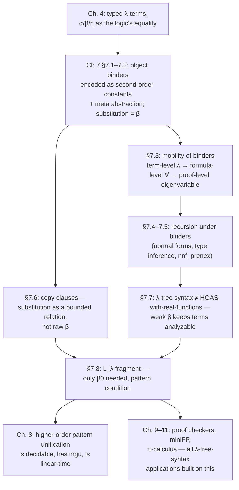

# λ-Tree Syntax and Computation over Binders

## The problem: binders are contagious

Every serious piece of software that manipulates programs, proofs, or formulas eventually has to deal with a bound variable. A compiler pass over a `let`, a type checker walking under a `fun`, a theorem prover instantiating a `∀` — all of it is the same problem wearing different clothes: *some name in this tree only means something relative to where it sits, and I need to either rename it, substitute into it, or descend past it without breaking that relationship.*

If you've ever implemented a substitution function by hand — tracking which names are "free," bumping de Bruijn indices as you cross a binder, renaming to dodge capture — you know this is exactly the kind of code that is simple to state and painful to get right. It's also *not the interesting part* of whatever you're building. You wanted to write a type checker; instead you're debugging an off-by-one in your shifting function.

Chapter 7 of *Programming with Higher-Order Logic* makes a case that this plumbing can be almost entirely outsourced — not to a library, but to the logic itself. The book's core move: represent object-level binders using the λ-abstraction that is already a first-class citizen of λProlog's term language (Chapter 4), and let the metalanguage's own notion of equality — which already includes α-, β-, and η-conversion — absorb the bookkeeping. This is the idea the chapter calls **λ-tree syntax**, and it's the chapter where the book's earlier investment in higher-order terms (Ch. 4) and hohh proof search (Ch. 5–6) pays off concretely.

This matters beyond λProlog. If you're building a Rust verifier that checks Hoare triples against clause specifications, or a Lean-style elaborator that resolves metavariables, you are going to reimplement some fragment of exactly this machinery — substitution, context extension, fresh-variable generation — whether or not you call it λ-tree syntax. Seeing the "outsource it to the metalogic" version first is a good way to understand what your own hand-rolled version is secretly trying to approximate.

---

## 1. Representing binders with second-order constants

The book's running technique, introduced in §7.1, splits every object-level binder into two pieces:

1. A **second-order constant** that names *which* binder this is (a quantifier, a λ, whatever).
2. A **meta-level abstraction** that carries the actual scoping.

Take first-order formulas with quantifiers. Given base types `term` and `form`, and ordinary predicate/function constants like `p : term -> form` and `f : term -> term`, the book declares:

```
type all, some   (term -> form) -> form.
```

An expression `x\ (p x) ==> (p (f x))` (read: "the function taking `x` to `p(x) ⊃ p(f(x))`") has type `term -> form` — it's *not yet* a formula, just an abstraction over one. Only after you apply `all` or `some` to it do you get something of type `form`:

```
all x\ (p x) ==> (p (f x))     -- represents ∀x (p(x) ⊃ p(f(x)))
some z\ (p z) && (p (f z))     -- represents ∃z (p(z) ∧ p(f(z)))
```

Crucially, `x\ (p x) ==> (p (f x))` and `Z\ (p Z) ==> (p (f Z))` are *the same term* — equal because meta-level equality already includes α-conversion. That's the whole point: the object-level quantifier's binding behavior is realized by borrowing a binding mechanism (the λProlog `\`) that the interpreter already has to implement correctly for its own sake.

The same trick, done for untyped λ-calculus itself, needs just two constants:

```
kind tm    type.
type app   tm -> tm -> tm.
type abs   (tm -> tm) -> tm.
```

so that `λx.(x x)` becomes `abs (x\ app x x)`, and `λx.λy.(y x)` becomes `abs (x\ abs (y\ app y x))`. This is the paradigm case the rest of the chapter builds programs around, and it's worth internalizing the type discipline: `abs` demands an argument of type `tm -> tm`, and the *only* way to produce a closed term of that function type is a meta-level abstraction — which means every well-typed `tm` really is built by the constructors you'd expect, with fresh "constructors" (bound variables) becoming available as you descend under `abs`.

**Grounding (Rust).** The Rust analogue of "the constant identifies the binder, the abstraction carries the scope" is closest to how you'd represent a *higher-order abstract syntax* AST using closures instead of a `Vec<Stmt>` body plus a separate variable-index type:

```rust
enum Tm {
    App(Box<Tm>, Box<Tm>),
    Abs(Box<dyn Fn(Tm) -> Tm>),
}
```

This is a real technique (sometimes called "PHOAS" — parametric HOAS — in Rust/Haskell/Coq circles) and it buys you exactly what the book is describing: you get host-language variable binding, capture-avoidance, and substitution (function application) for free, at the cost of losing the ability to pattern-match on the *structure* under a binder without first applying the closure to something. Section 7.7 of the chapter is precisely about why that trade-off is dangerous if taken to its logical extreme (Rust closures are as semantically opaque as it gets) and why λProlog's typed λ-terms modulo a *weak* β-conversion sit at a better point on that spectrum. Keep that tension in mind — it resurfaces below.

**[[Hereditary-Harrop-Formulas-and-Modular-Search#What breaks without this|What breaks without this]].** If instead you represent `∀x (p(x) ⊃ p(f(x))))` first-order-style — say `all("x", implies(atom("p", [var("x")]), ...))` with `"x"` a string — then `∀x (p(x))` and `∀y (p(y))` are *syntactically different terms* that you must remember are "the same" by a side convention, and every function that walks the tree has to carry its own capture-avoidance logic. The book flags this explicitly as the failure mode that first-order representations of quantified formulas cannot escape (a thread it foreshadows as early as Chapter 1).

---

## 2. Object-level substitution as meta-level β-conversion

Here's where the payoff becomes concrete. If quantifier instantiation is represented as function application, then *instantiating a quantifier is just applying a function* — and the "substitute `t` for `x` in the body" step is handled by β-conversion, which the metalogic's equality already performs.

Given `∀x (p(x) ⊃ ∃y q(x,y))`, encoded as `all x\ p x ==> some y\ q x y`, applying the bound function to `(f a)` gives:

$$(x\backslash\ p\ x \Rightarrow \exists y.\, q\ x\ y)\ (f\ a) \;=_\beta\; p\ (f\ a) \Rightarrow \exists y.\, q\ (f\ a)\ y$$

— exactly the formula you'd write as $(p(x) \supset \exists y\, q(x,y))[f(a)/x]$, produced with *zero* substitution code. This shows up directly in logic-program clauses. The predicate that peels off universal quantifiers one at a time is:

```
list_instan nil B B.
list_instan (T::Ts) (all B) C :- list_instan Ts (B T) C.
```

The clause head `(all B)` matches any `all`-quantified formula (using η-conversion, `(all B)` unifies with `all x\ (B x)`); the recursive call's `(B T)` is literally "apply the abstraction to `T`" — substitution by application, nothing more. The chapter's Figure 7.1 pushes this further into a full interpreter for object-level Horn clauses (`interp`, `backchain`), where existential goals `some G` are solved by proving `(G X)` — instantiating with a fresh logic variable `X` — and universal program clauses `all D1` are used by proving `(D1 X)`. The entire fohc interpreter from Chapter 2, re-derived here at the meta-level, is under fifteen lines because instantiation is free.

The same idea gives call-by-name/call-by-value evaluators for untyped λ-terms almost by transcription of the textbook rules:

```
cbn (abs R) (abs R).
cbn (app M N) V :- cbn M (abs R), cbn (R N) V.

cbv (abs R) (abs R).
cbv (app M N) V :- cbv M (abs R), cbv N U, cbv (R U) V.
```

`(R N)` in `cbn` is "substitute `N` for the bound variable of the abstraction `R`" — again, just application. The chapter shows this distinguishes the two evaluation strategies correctly: `(λx.λw.w)((λx.x x)(λx.x x))` terminates under `cbn` (the divergent argument is never forced) but loops forever under `cbv` (it's evaluated before being discarded) — the standard call-by-name/call-by-value divergence example, reproduced faithfully because the encoding didn't have to fake laziness; it inherited it from λProlog's own (lazy, unification-driven) evaluation of goals.

**Grounding (Lean).** This is the cleanest possible illustration of something Lean's kernel does constantly: `isDefEq` treats $(\lambda x.\, e)\ a \equiv e[a/x]$ as **definitional equality**, not a rewrite you have to invoke — it's baked into the conversion check itself (`whnf` unfolds β-redexes automatically when comparing two terms). What the book calls "substitution realized as β-conversion" is, syntactically, the exact same move as Lean reducing `(fun x => e) a` to `e[a/x]` during type checking without the user ever writing `rfl` — because it *is* `rfl`, definitionally. The difference is only where the reduction happens: in Lean it's the kernel's `whnf`/`isDefEq`; in λProlog it's unification during backchaining. Both are "substitution for free by delegating to the host equality."

---

## 3. Mobility of binders: descending under a `λ` by proof search

Sections 7.1–7.2 handle *shallow* uses of binding (instantiate the outermost quantifier and stop). The harder problem — the one that actually requires "computing over" a binder rather than just past it — is **recursing into the body of an abstraction**, e.g. checking that *every* subterm of a λ-term satisfies some property, including subterms that mention the bound variable.

Section 7.3 states the mechanism (called **mobility of binders**) as three levels a binder can occupy, and a recipe for moving between them during proof search:

- **term level** — a λ-abstraction, e.g. `abs R` where `R : tm -> tm`
- **formula level** — a universally quantified goal, `pi x\ G x`
- **proof level** — an eigenvariable, a fresh constant `c` introduced when a `pi`-goal is proved

The worked example is defining `term : tm -> o`, a predicate recognizing well-formed terms of type `tm`, by reflecting the two constructors:

```
term (app M N) :- term M, term N.
term (abs R)   :- pi x\ term x => term (R x).
```

Trace `?- term (abs y\ app y y)`:

1. The second clause fires: prove `pi x\ term x => term ((y\ app y y) x)`.
2. β-reduce the body: `pi x\ term x => term (app x x)`. **This is step one of mobility** — the term-level binder on `y` has been converted into a formula-level binder on `x` via β-conversion.
3. Proving a `pi x\ ...` goal introduces a fresh eigenvariable `c` and continues with `term c => term (app c c)`. **This is step two** — the formula-level binder becomes a proof-level constant `c`.
4. The hypothesis `term c` (added to the program by the `=>`) closes the remaining goal `term (app c c)` immediately.

The idiom the chapter distills from this (and reuses constantly for the rest of the book):

> To recurse under a binder, apply it to a universally quantified goal variable — the metalogic substitutes a fresh eigenvariable — and use an implicational goal to extend the program with whatever new facts hold about that eigenvariable, before continuing the recursion in its body.

This single pattern is what lets `bnorm`/`bbnorm` recognize β-normal forms (§7.4.1), what lets `typeof` do Hindley–Milner-style type inference for untyped λ-terms (§7.4.3), and what drives `nnf`/`prenex` in §7.5. The pattern is always: peel a binder, introduce a fresh constant for it, assume whatever "base case" facts hold of that constant, recurse.

```
bnorm (abs M)    :- pi x\ bbnorm x => bnorm (M x).
bnorm H          :- bbnorm H.
bbnorm (app M N) :- bbnorm M, bnorm N.
```

The type-inference clauses are the same shape and should look immediately familiar as a *typing rule*:

```
typeof (app M N) A :- typeof M (arr B A), typeof N B.
typeof (abs M) (arr A B) :- pi x\ typeof x A => typeof (M x) B.
```

That second clause is the abstraction typing rule $\dfrac{\Gamma, x:A \vdash M\,x : B}{\Gamma \vdash \lambda M : A\to B}$ written directly as a Horn clause: extending the context (`typeof x A => ...`) *is* the eigenvariable/hypothesis-augmentation step, and recursing into `(M x)` *is* mobility of binders in action. If you've ever written a bidirectional type checker in Rust with an explicit `Vec<(Name, Type)>` context that you push onto before recursing into a lambda body and pop after, this clause is doing the identical operation — except the "context" here is the ambient hohh program, extended and retracted automatically by the `=>`/backchaining discipline (Ch. 3's AUGMENT and GENERIC rules), and the "fresh name" is generated by the prover, not by you.

**Grounding (Rust).** This is the part of the chapter most directly transferable to a checker you'd actually write:

```rust
fn check_abs(ctx: &mut Vec<(VarId, Type)>, body: impl Fn(VarId) -> Term, arg_ty: Type) -> Type {
    let x = fresh_var();               // the "eigenvariable"
    ctx.push((x, arg_ty));             // the "=>" hypothesis
    let result_ty = infer(ctx, body(x));
    ctx.pop();                         // discharge the hypothesis on the way out
    result_ty
}
```

`fresh_var()` here plays exactly the eigenvariable's role — a name guaranteed not to collide with anything already in scope — and `ctx.push`/`ctx.pop` is the AUGMENT-rule discipline of Chapter 3 made explicit as a stack. Mobility of binders is, in effect, the proof-theoretic justification for why this stack-discipline context management is *sound*: it's not an ad hoc engineering convention, it's what a hereditary-Harrop-formula proof of the corresponding sequent looks like.

**What breaks without mobility.** Without a fresh-constant/hypothesis-extension mechanism, "recurse into the body of a binder" has no meaning — you'd either have to substitute a *concrete* term for the bound variable (losing generality: you're now checking one instance, not the general case) or invent your own private notion of "generic but unconstructed" variable and hand-roll its freshness invariant, which is precisely the eigenvariable discipline reinvented badly.

---

## 4. Substitution as a relation, not a function: copy clauses

Raw β-conversion (§7.1–7.5) is the cheapest way to get substitution, but §7.6 makes a sharper point: full β-reduction on an *unrestricted* term can be expensive (recall Ch. 4's warning about superexponential blowup), and moreover, sometimes you want a version of substitution that doesn't quietly do more reduction than intended.

The alternative is `subst`, defined via an auxiliary predicate `copy` that recursively rebuilds a term constructor-by-constructor:

```
copy (app M N) (app P Q) :- copy M P, copy N Q.
copy (abs M)   (abs N)   :- pi x\ copy x x => copy (M x) (N x).

subst M T S :- pi x\ copy x T => copy (M x) S.
```

Read `subst M T S` as "substituting `T` into the abstraction `M` yields `S`." Operationally: introduce a fresh eigenvariable `x` (mobility again), assume the *fact* `copy x T` — i.e., "wherever you meet `x`, copy it as `T`" — then copy the whole body `(M x)` recursively; every other constructor gets copied structurally, and every occurrence of `x` in the body gets rewritten to `T` via the assumed fact. The book proves (using the same substitution-lemma-for-free argument as the type-preservation proof in §7.4.3) that `subst M T S` is provable exactly when `S` equals `(M T)` — the `copy`-clause version and the raw-β version compute the same relation.

The reason to prefer copy clauses is that they're **signature-dependent but structurally bounded**: they touch each constructor exactly once, so there's no risk of runaway reduction. The chapter generalizes this to arbitrary object signatures via a type-indexed translation $[\![t,s:\tau]\!]^{\pm}$ — for each object-level constant, "lower" the general equality-with-substitution relation for its functional type down to base-type `copy` facts. For a binder-taking constant like `all : (term -> form) -> form`, this mechanical process produces exactly the clause you'd expect:

$$\forall x\,\forall y\,\big(\forall z\,(\mathtt{copyterm}\ z\ z \supset \mathtt{copyform}\ (x\ z)\ (y\ z)) \supset \mathtt{copyform}\ (\mathtt{all}\ x)\ (\mathtt{all}\ y)\big)$$

There's a subtlety worth flagging because it's easy to miss: **`copy` is a relation, not a function**, even though it's *used* to compute a function (equality/substitution). `?- M = N` unifies immediately by binding one variable to the other. `?- copy M N` with both unbound instead *enumerates* — it will bind `M` and `N` together to `a`, then `(f a)`, then `(f (f a))`, and so on, because the clauses are read as a generative grammar for the object language, not a decision procedure for equality of two already-known terms. This is exactly the distinction the learning-goals thread on unification cares about: `copy`/`subst` are doing definitional-equality-style work (deciding/witnessing that two terms denote the same object), but the *mechanism* is ordinary first-order-flavored unification against Horn clauses — a nice illustration of "the book's own equality machinery doing unification's job without naming it as such."

The chapter also gives a version (Figure 7.12) that inlines the recursion directly into `subst`/`substterm` without the intermediate `copy` predicate — same relation, one less auxiliary layer, at the cost of a clause per constructor arity combination rather than per constructor.

**Grounding (Rust).** `copy` is structurally identical to a `substitute` pass written the "obvious" way over an AST enum, where the one interesting case is the binder case:

```rust
fn subst(body: &Term, replacement: &Term) -> Term {
    match body {
        Term::App(m, n) => Term::App(Box::new(subst(m, replacement)),
                                       Box::new(subst(n, replacement))),
        Term::Var(x) if *x == BOUND => replacement.clone(),
        Term::Var(_) | Term::Const(_) => body.clone(),
        Term::Abs(inner) => Term::Abs(Box::new(subst_under_binder(inner, replacement))),
    }
}
```

The one thing this Rust version has to do by hand — shifting de Bruijn indices, or renaming to avoid capture, when descending into `Abs` — is precisely what `copy`'s `pi x\ copy x T => copy (M x) (N x)` clause gets for free from the metalogic's own binder handling. That gap is the entire value proposition of this chapter, stated as a diff.

---

## 5. λ-tree syntax vs. higher-order abstract syntax: why "weak" function spaces matter

Section 7.7 is the chapter's conceptual payoff and its most important terminological distinction — and it's exactly the point where the "represent binders as Rust closures" idea from §1 above needs to be walked back.

**Higher-order abstract syntax (HOAS)**, generically, is any technique that maps object-level binding onto metalanguage abstraction. But "metalanguage abstraction" can mean wildly different things:

- In a **functional programming language** (or a constructive type theory using function evaluation to determine values), `tm -> tm` denotes a *rich* function space — arbitrary computable functions, or worse, arbitrary set-theoretic functions. Two functions in that space can be extensionally equal (same input/output behavior) while being utterly different as *syntax* — which means you can no longer look inside them, pattern-match on their structure, or ask "does this abstraction have `y` free in its body." You've traded away exactly the thing you wanted (a syntactic representation you can analyze) for a semantic one.
- In λProlog's hohh language, `tm -> tm` denotes typed λ-terms **modulo only α-, a weak form of β-, and possibly η-conversion** — not modulo arbitrary extensional function equality. Terms of this function type are still syntactic objects: they can be applied (giving substitution, as in §2–4 above), but the equality relation on them stays intensional enough that the structural predicates in Figures 7.6–7.9 (`vacuous`, `quantfree`, `nnf`, `prenex`, `fohcG`/`fohcD`, `fohhG`/`fohhD`) can still pattern-match through binders and classify formulas by shape.

The book reserves the term **λ-tree syntax** specifically for this second, weaker discipline — "the approach to higher-order abstract syntax that uses typed λ-terms modulo equality based on α-conversion, some sufficiently weak form of β-conversion, and possibly η-conversion." The name is a deliberate narrowing of "HOAS" (which the field had by then already begun using for the general — and more dangerous — technique of identifying object binders with genuine host-language functions).

This directly resolves the tension flagged in §1: a naive `Box<dyn Fn(Tm) -> Tm>` in Rust is HOAS in the *dangerous*, function-space sense — you cannot pattern-match on it, cannot check if a variable occurs free, cannot enumerate its structure without applying it. λ-tree syntax is what you get if you instead restrict yourself to a term representation whose "functions" are just syntax (abstractions built from a small term grammar) with equality closed only under α/β/η — analyzable, because it's still *terms*, not opaque closures.

**What breaks without the distinction.** If you build your elaborator's term representation on raw host-language closures for binders, you will hit a wall the moment you need to do anything the book's Figure 7.6–7.9 predicates do routinely: check whether a bound variable occurs, decide if two abstractions are syntactically (not just extensionally) related, or print a term back out in a stable form. This is a real, well-documented pitfall in HOAS-based implementations, and the book is explicitly naming it as the reason λ-tree syntax exists as a distinct, narrower idea.

---

## 6. The $L_\lambda$ fragment: how much β do you actually need?

Section 7.8 asks the natural next question: given that λ-tree syntax only needs a *weak* form of β-conversion, how weak can it get while still supporting everything done in this chapter?

The classification hinges on how a bound variable occurrence in a goal or clause is used:

- **Essentially universal**: bound by a positive `∀` (or negative `∃`), or by a term-level `λ`. These are the ones instantiated only with fresh eigenvariables during search — they carry the "mobility."
- **Essentially existential**: bound by a negative `∀` (or positive `∃`). These are instantiated with arbitrary terms via unification/logic variables.

$L_\lambda$ restricts hohh by requiring: every subterm of the form $(x\,t_1 \ldots t_n)$ where $x$ is essentially existential must have $t_1, \ldots, t_n$ as **distinct essentially universal variables**, all bound within $x$'s own scope. This is exactly the shape later called the **pattern condition** (Chapter 8's terminology; the Topic 10 index calls it "higher-order pattern unification"). Under this restriction, whenever an essentially-existential $x$ gets instantiated by some $t$, the only β-redexes that can subsequently arise have the shape $(\lambda y_1\ldots\lambda y_n.\,t')\,y_1\ldots y_n$ — i.e., the redex's argument list is *exactly* the abstraction's own bound-variable list, in order, with no repeats. Define:

$$(\lambda x.\, s)\ x = s \qquad (\beta_0)$$

— substituting a bound variable for *itself*. This is trivial: no term growth, no new redexes introduced, unlike general β where $(\lambda x.\,M)\,N = M[N/x]$ can blow up in either direction depending on how often $x$ occurs in $M$ and how large $N$ is (the superexponential-blowup concern raised back in Ch. 4).

The book is careful to point out this isn't just a technical curiosity: **most of the code in this chapter is already $L_\lambda$**. The `nnf`, `prenex`, `fohcG`/`fohcD`/`fohhG`/`fohhD`, and `copy`/`subst` clauses all qualify. The one conspicuous exception is the raw reduction clause from Figure 7.4:

```
redex (app (abs R) N) (R N).
```

— here `(R N)` applies an essentially-existential `R` to another essentially-existential `N`, violating the pattern condition outright. But it can be *rewritten into* $L_\lambda$ using exactly the machinery from §4:

```
redex (app (abs R) N) S :- subst R N S.
```

pushing the real β-reduction work into `subst`'s structural recursion, which never needs more than $\beta_0$ internally.

Why care? Because — and this is the chapter's forward pointer into Chapter 8 — **unification modulo unrestricted α/β/η is undecidable and can lack most general unifiers entirely**, while **unification restricted to $L_\lambda$ (equivalently, unification of *higher-order patterns*) is decidable and behaves like first-order unification**: unifiers, when they exist, are unique up to a most-general one, and there's a linear-time algorithm. This is precisely Miller's own result that gives "pattern unification" its name, and it's the mechanism cited by name in the learning-goals file as the tractable fragment worth building an elaborator around.

**Grounding (Lean).** This is the single most load-bearing connection in the whole chapter for the elaborator project described in the learning goals. Lean's actual elaborator does not attempt general higher-order unification when solving metavariable equations like `?m x y =?= t` — it restricts itself, whenever possible, to exactly the pattern case: `?m` applied to a list of *distinct free/local variables*. When that shape holds, Lean can solve `?m := fun x y => t` directly and deterministically, precisely because the problem reduces to $\beta_0$-style reasoning rather than full higher-order unification's search over imitation/projection choices (which Chapter 8 covers as Huet's procedure). The $L_\lambda$ condition in this chapter — "essentially existential variable occurrence applied to distinct essentially universal variables in its own scope" — is a direct, book-native restatement of exactly the condition Lean's `isDefEq`/metavariable-assignment code checks before it will assign a metavariable outright rather than defer or fail. If you are building a metaprogramming elaborator "in the spirit of Miller's pattern unification," this section — not Chapter 8's algorithmic detail — is where the *shape* of the restriction is stated most cleanly, in terms you can check syntactically before ever writing a unification algorithm.

---

## Synthesis: where this sits in the book, and why it matters for the standing project



Structurally, this chapter is the hinge of the book: everything before it (Ch. 1–6) built the logic and its proof-search semantics; everything after it (Ch. 8–11) is either the algorithmic theory of unification over these representations (Ch. 8) or applications that assume you already understand mobility of binders and λ-tree syntax as fluent tools (Ch. 9's proof checkers, Ch. 10's miniFP, Ch. 11's π-calculus).

Two threads from this chapter are directly load-bearing for the two engineering targets in the standing project:

**Substitution, context management, and variable capture.** Sections 7.2–7.6 are, end to end, a worked case study in *not writing capture-avoiding substitution by hand*. The mobility-of-binders idiom (§7.3) — fresh eigenvariable in, hypothesis assumed, recurse, hypothesis discharged on the way out — is a direct model for how a Rust type/proof checker should manage its context when descending into a binder: it's the proof-theoretic justification for the "push a binding, recurse, pop it" discipline you'd write by hand, and it tells you *why* that discipline is sound (it corresponds to a valid sequent-calculus proof of the corresponding hypothetical judgment, per Ch. 3's AUGMENT/GENERIC rules). The `copy`-clause technique (§7.6) is worth taking further: it shows a substitution operation can be defined as a *bounded, structurally-recursive relation* keyed off the object signature, which is closer to how you'd want a real Hoare-triple checker's substitution lemma to be structured — provably total, provably terminating, one case per constructor — rather than a general β-reducer you then have to separately prove terminates.

**Unification and definitional equality.** Section 7.8's $L_\lambda$/pattern condition is, as argued in §6 above, essentially Lean's own metavariable-assignment restriction stated in the book's native vocabulary, and it's the fragment the second project target explicitly names as its target mechanism. The chapter also quietly demonstrates the learning-goals' point about equality machinery "doing unification's job without naming it as such": `copy`/`subst` in §7.6 are, mechanically, ordinary Horn-clause backchaining, but semantically they *are* a decision procedure for term equality (definitional equality's job) built entirely out of unification against structural clauses — worth remembering the next time a "trivial" equality check in a type checker turns out to be doing real unification work under the hood.

**[[Computing-over-Functional-Programs#Where this leads|Where this leads]].** Chapter 8 picks up exactly where §7.8 leaves off: it develops Huet's general pre-unification procedure for full βη-unification (needed for the non-$L_\lambda$ residue of hohh), then shows that restricting to the pattern condition identified here recovers a decidable, most-general-unifier-bearing, linear-time algorithm — the two extremes bracketing the "how expensive is unification really" question this chapter raises but defers. Chapters 9–11 then treat λ-tree syntax and binder mobility as settled infrastructure, using them to build proof checkers, a functional-language interpreter, and a π-calculus encoding without re-deriving any of the substitution machinery from scratch — which is itself the strongest argument for why this chapter's investment is worth internalizing rather than skimming.

---

[[book-guidelines|↩ Back to guidelines]]
