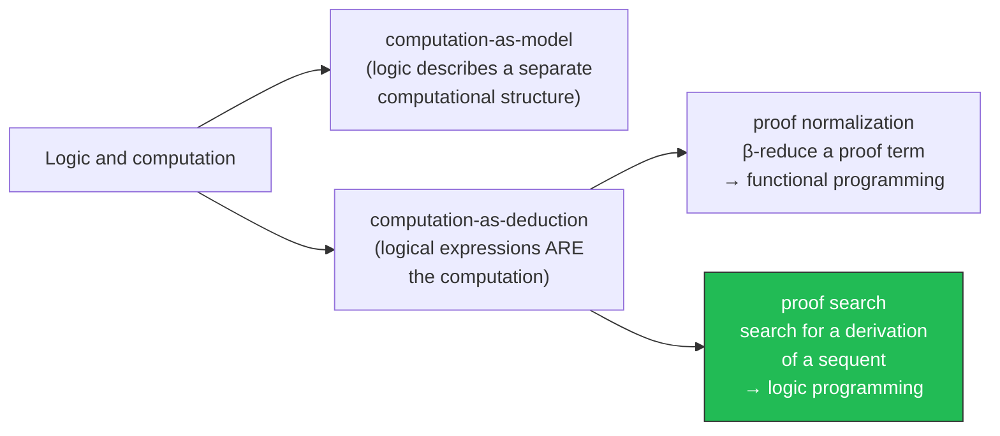
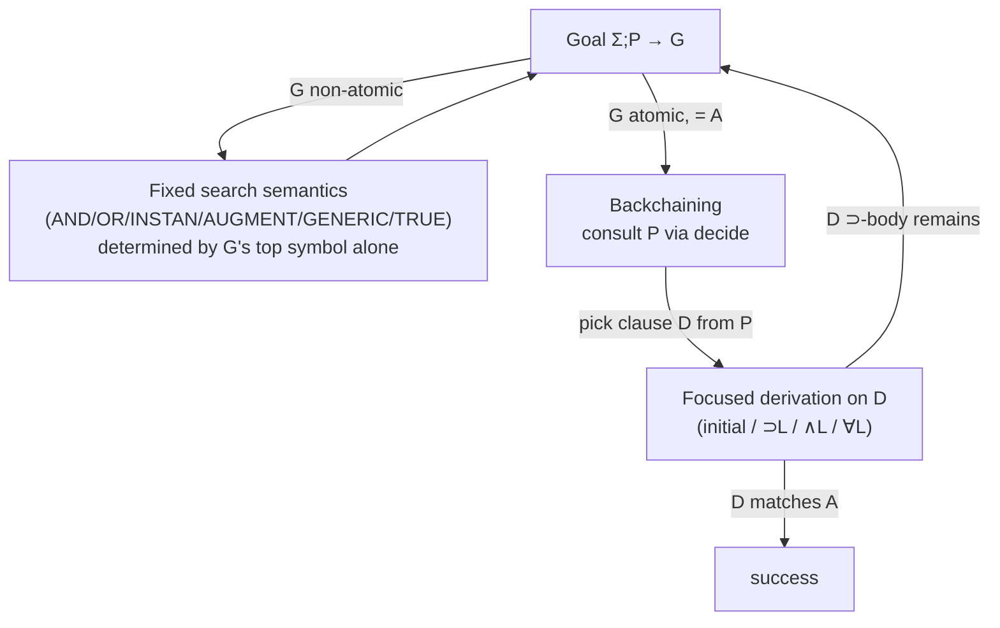
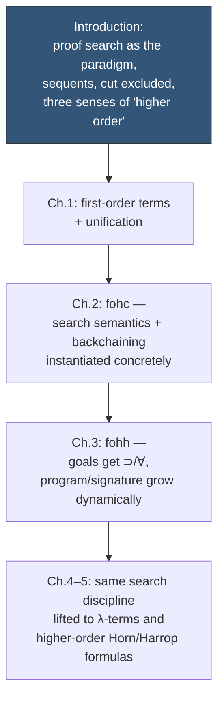

# Logic Programming as Proof Search

## The fork in the road: two ways to make logic *do* something

Logic can relate to computation in two structurally different ways, and the book opens by insisting you notice the difference before it says another formal word.

The first way — **computation-as-model** — is the one you already know from Hoare logic or temporal logic. You build some external mathematical structure (a state machine, a heap, a trace), and logic is a *language you use to talk about it from outside*. The triples in `{P} c {Q}` describe a program; they aren't the program. This is the oldest and most successful use of logic in computer science, and it's not what this chapter is about.

The second way — **computation-as-deduction** — throws out the "from outside" part. Here, formulas, terms, and proofs aren't a description of the computation; they *are* the computation. There are two sub-species of this idea, and the book is careful to keep them apart because they generalize in opposite directions:

- **Proof normalization**: a computation is a proof term, and running it means reducing that term to normal form — think $\beta$-reduction. This is the proof-theoretic ancestor of functional programming: a term has *a* normal form, execution is confluent reduction toward it, and types classify values.
- **Proof search**: a computation is a *sequent* — a claim of the form "this goal follows from these assumptions" — and running it means *searching for a derivation* of that sequent. The moves the sequent makes as the search proceeds — what shrinks, what grows, what gets consulted — *are* the steps of the computation. This is the proof-theoretic ancestor of logic programming, and it's the thread this whole book pulls on.

If you already think in Rust, here's the fastest bridge: proof normalization is evaluating an expression tree to a value. Proof search is closer to running a Prolog query, or — more precisely for where this book is headed — running a type checker's `unify`/`elaborate` loop, where "success" means the goal reduced to something already established, and the object produced along the way (a substitution, a derivation) is secondary to the fact that the reduction succeeded.

## The sequent as the unit of computational state

To make "search for a derivation" concrete, the book fixes a shape for the object being searched over. A **sequent** is a triple

$$\Sigma; P \longrightarrow G$$

where $\Sigma$ is a *signature* (the typed nonlogical constants currently in scope), $P$ is a *program* (a set of $\Sigma$-formulas serving as assumptions/axioms), and $G$ is a *goal* (the $\Sigma$-formula being asked for). Read declaratively, the sequent asserts: "$G$ is provable from $P$ (over the vocabulary $\Sigma$)." Read operationally, it's a machine state: "solve $G$ given the current program-and-signature context $\Sigma, P$."

This double reading — the same object is simultaneously a logical judgment and an interpreter state — is the whole trick of the proof-search paradigm, and it's worth sitting with. In a Rust type checker, the analogous double-reading is a typing judgment `Γ ⊢ e : τ` that is *also* literally the state of a recursive `typecheck` call: the context `Γ` you're threading through *is* $\Sigma$ (plus term-level bindings later), and asking "is `e : τ` derivable" *is* running the checker on `e`.

The book asks a genuinely load-bearing question about this state: if solving $\Sigma; P \longrightarrow A$ leads to a new attempt $\Sigma'; P' \longrightarrow A'$, *what is allowed to change*? The answer to that question is what distinguishes the logics developed later in the book (Horn clauses versus hereditary Harrop formulas versus the higher-order languages) — and it's flagged here, in the Introduction, as the organizing axis of everything that follows.

## Goal-directed search: the connectives don't wait for the program

Here is the central mechanical idea, and it's worth being very precise about it because the precision is the payoff.

Suppose you're trying to prove $\Sigma; P \longrightarrow G$. There are two completely different regimes depending on what $G$ looks like:

1. **$G$ is not atomic** (its top symbol is a connective or quantifier: $\wedge, \vee, \supset, \exists, \forall, \top$). Then the *only* thing that can happen next is dictated entirely by that symbol. It doesn't matter what's in $P$. This is what the book calls the **fixed search semantics** of the logical connectives.
2. **$G$ is atomic.** Then $P$ is consulted, and the process is **backchaining**: find a program clause whose "conclusion" matches the atom, and reduce to proving its "premises."

The fixed search-semantics rules (Figure 2.2 in the book), read as reduction steps transforming one sequent-to-be-solved into others:

| Rule | Reduces | To |
|---|---|---|
| AND | $\Sigma; P \longrightarrow B_1 \wedge B_2$ | both $\Sigma; P \longrightarrow B_1$ and $\Sigma; P \longrightarrow B_2$ |
| OR | $\Sigma; P \longrightarrow B_1 \vee B_2$ | either $\Sigma; P \longrightarrow B_1$ or $\Sigma; P \longrightarrow B_2$ |
| INSTAN | $\Sigma; P \longrightarrow \exists_\tau x\, B$ | $\Sigma; P \longrightarrow B[t/x]$ for some chosen $\Sigma$-term $t : \tau$ |
| AUGMENT | $\Sigma; P \longrightarrow B_1 \supset B_2$ | $\Sigma; P, B_1 \longrightarrow B_2$ |
| GENERIC | $\Sigma; P \longrightarrow \forall_\tau x\, B$ | $c{:}\tau, \Sigma; P \longrightarrow B[c/x]$, $c$ a brand-new constant |
| TRUE | $\Sigma; P \longrightarrow \top$ | done, no reduction needed |

Every one of these is *sound* as a rule of ordinary logic — read bottom-up, each is exactly the corresponding right-introduction rule of a sequent calculus (AND is $\wedge R$, AUGMENT is $\supset R$, and so on). What's not automatic is **completeness**: does provability of the goal actually *force* one of these specific reductions to succeed? The book gives three sharp counterexamples worth internalizing, because they explain design choices you'll meet again in Chapters 2 and 3:

- $p \vee q \longrightarrow q \vee p$ is classically/intuitionistically valid, but the OR rule commits you to proving $q$ alone or $p$ alone from $p \vee q$ — and neither holds standalone. **Lesson: disjunction cannot appear unrestricted in programs.**
- $\longrightarrow p \vee (p \supset q)$ is a classical tautology (excluded middle in disguise) but neither disjunct is provable outright, and OR forces a choice. **Lesson: classical logic's law of excluded middle is fundamentally hostile to goal-directed disjunction handling — hence the move to intuitionistic logic.**
- $(r\,a \wedge r\,b) \supset q \longrightarrow \exists x\,(r\,x \supset q)$ is classically true (case on whether $r\,a$ holds) but INSTAN forces you to *commit to one witness term* before you know which one will work.

These aren't pedantic corner cases — they are precisely the reasons the book will (in Chapter 2) restrict programs to *definite* formulas (no top-level disjunction) and commit to intuitionistic logic rather than classical. The fixed search semantics is only as good as the syntactic discipline that keeps it complete.

**[[Hereditary-Harrop-Formulas-and-Modular-Search#What breaks without this|What breaks without this]] restriction:** without banning disjunction and existentials from clause bodies at unfavorable positions, goal-directed search stops being a *complete* proof procedure — some provable goals simply have no derivation reachable by these mechanical reductions, which would make "the program didn't answer" ambiguous between "false" and "the search strategy is too weak to find it." A logic programming language needs completeness to be trustworthy: failure has to mean something.

## Backchaining: what happens when the goal is atomic

Once $G$ has whittled down (via the rules above) to an atomic formula $A$, the fixed semantics has nothing left to say — the program takes over. The book's backchaining rules (Figure 2.3) are the left-introduction counterpart:

$$
\dfrac{\Sigma; P \xrightarrow{D} A}{\Sigma; P \longrightarrow A}\ \text{decide (}D \in P\text{)}
\qquad
\dfrac{}{\Sigma; P \xrightarrow{A} A}\ \text{initial}
\qquad
\dfrac{\Sigma; P \longrightarrow G \quad \Sigma; P \xrightarrow{D} A}{\Sigma; P \xrightarrow{G \supset D} A}\ {\supset}L
$$

$$
\dfrac{\Sigma; P \xrightarrow{D_i} A}{\Sigma; P \xrightarrow{D_1 \wedge D_2} A}\ {\wedge}L
\qquad
\dfrac{\Sigma; P \xrightarrow{D[t/x]} A \quad \Sigma;\emptyset \vdash_f t : \tau}{\Sigma; P \xrightarrow{\forall_\tau x\, D} A}\ {\forall}L
$$

Read procedurally: **decide** picks a clause $D$ out of the program to commit to (this is the genuinely nondeterministic step — it's where a Prolog interpreter's clause-ordering and backtracking live); **initial** succeeds when the clause you've drilled down to is syntactically the goal atom itself; ${\supset}L$ says that to backchain against $G \supset D$ you must additionally *prove $G$ outright* (this is where subgoals come from — a Horn clause body); ${\wedge}L$ lets you pick either conjunct of a compound clause; ${\forall}L$ instantiates a universally-quantified clause with a chosen term, exactly mirroring INSTAN on the goal side.

Chain these all the way down and you get exactly the shape of resolution in vanilla Prolog: a program clause $\forall x_1 \ldots \forall x_m\,(A_1 \wedge \cdots \wedge A_n \supset A_0)$ reduces backchaining against $A_0\theta$ to proving each $A_i\theta$ — the familiar "head :- body1, body2, ..." reading, recovered as a derived rule rather than assumed as primitive.

## The Rust-shaped reading: this is your unification/elaboration loop already

This two-phase alternation — "if the goal has structure, the structure dictates the move; if it's atomic, consult the database" — is *precisely* the shape of a bidirectional type-checking/elaboration loop, and this is the load-bearing connection for the standing project on a Rust verifier and a Lean-style elaborator.

Think of it this way:

- The **fixed search semantics** phase is your *checking* mode: given a goal type/proposition with visible top-level structure ($\Pi$-type, conjunction of obligations, existential metavariable to solve), the checker's next move is forced by that structure, not by any lookup table. This is exactly what a `check(expr, expected_type)` function does when `expected_type` has a canonical head constructor.
- The **backchaining** phase is your *inference/lookup* mode: an atomic goal (an unresolved predicate, an unelaborated metavariable, a trait obligation) has no internal structure to dictate a move, so you consult a database of clauses/instances/lemmas — this is what `impl` resolution in a trait solver or clause selection in a Datalog/Prolog engine, or instance search in Lean's elaborator, is *doing*.

The `decide` rule's nondeterminism — "pick some $D \in P$" — is the same design problem as trait-impl selection or Lean's instance search: you need either backtracking, or a syntactic discipline strong enough (as later chapters build for `hohh`, rigid clause heads, etc.) that the choice becomes deterministic given the goal's head symbol. That discipline is a direct prerequisite for building a predictable proof-search engine rather than an exponential-blowup one — worth flagging explicitly since it's exactly the kind of "make search tractable via syntax restrictions" move the standing project's Hoare-triple/contract checker will need.

## The cut rule: the thing proof search deliberately refuses to do

Ordinary mathematical proof-finding leans constantly on lemmas: to prove $B$, invent an auxiliary claim $C$, prove $C$, then prove $C \supset B$. In sequent-calculus terms this is the **cut rule**:

$$
\dfrac{\Sigma; P \longrightarrow B \qquad \Sigma; P, B \longrightarrow G}{\Sigma; P \longrightarrow G}
$$

Cut lets you use an already-established fact $B$ as a bonus hypothesis while finishing the proof of $G$. It is enormously useful for *human* proof construction — modularity, reuse, shorter proofs — and correspondingly useless for *mechanized* proof search, because inventing the right $B$ requires exactly the creative leap search can't automate. (Note: this "cut" is unrelated to Prolog's `!` pruning operator, despite the name collision — the book is explicit about this.)

So logic programming's execution model **excludes the cut rule entirely**. Every computation proceeds via cut-free derivations only. This might look like it costs completeness — but **Gentzen's cut-elimination theorem** is exactly the classical result that rescues you: for classical and intuitionistic logic, any sequent provable *with* cut is also provable *without* it (the cut-using proof can always be "inlined" — every use of a lemma re-expanded in place, which is why cut-elimination proofs and $\beta$-reduction are close cousins: eliminating a cut is structurally the same move as $\beta$-reducing a redex). So dropping cut from the execution machinery costs *nothing in terms of what's provable* — it only means the proofs found by search may be far larger (fully inlined, no lemma reuse) than what a mathematician would write by hand.

This gives cut a precise dual role: **excluded from execution, but retained in the metatheory.** You use cut freely when *reasoning about* logic programs — e.g., proving that swapping in a logically-equivalent replacement clause preserves what's provable — even though a running program never invokes it. Chapter 2 later exploits exactly this: several logically-equivalent syntactic presentations of Horn clauses exist (conjunction-in-the-body vs. distributed-out clauses), and cut-admissibility is the justification that they all prove the same goals, even though they can differ wildly in program size (the book shows a distributivity transformation that blows up exponentially) and even in *operational* behavior under `decide` (duplicated clauses mean duplicated, separately-explored derivations for what was logically one clause).

**[[Polymorphic-and-Pervasive-Constants#What breaks without this|What breaks without this]] exclusion:** if you allowed cut during execution, "run the program" would require the interpreter to invent auxiliary lemmas on the fly — an activity with no decidable, or even effectively enumerable, strategy in general. You'd have turned a programming language into an open-ended theorem-proving search with no predictable termination or complexity behavior. Excluding cut is what keeps "the program's behavior" a well-defined, deterministic-modulo-clause-order notion instead of "whatever auxiliary facts the machine happens to discover."

## Uniform proofs and abstract logic programming languages

The two-phase discipline just described — right-introduction (search semantics) until you hit an atom, then left-introduction (backchaining) — has a name in the book's later terminology (flagged here via the bibliographic notes, developed properly starting in Chapter 2's closing sections): a derivation with exactly this alternating shape is a **uniform proof**. A logic — a choice of formula syntax plus a proof calculus — is an **abstract logic programming language** precisely when "search for a uniform proof" is a *complete* proof procedure for it. First-order Horn clauses (`fohc`, the subject of the rest of Chapter 2) and first-order hereditary Harrop formulas (`fohh`, Chapter 3) are both proved to have this property; it's the technical anchor underneath everything the book calls "goal-directed."

**Focused proof systems** (Andreoli's generalization, later given a comprehensive treatment by Liang and Miller) push the same idea further: group the "small" individual inference rules (like the six in Figure 2.2) into "larger" composite rules (like backchaining in Figure 2.3), and show that *focusing* — committing to fully exploiting one formula's polarity before moving to the next — is complete even for richer logics like linear logic. The relevance for later chapters: this is the proof-theoretic justification for why the languages in this book can afford increasingly rich connectives (implications and universals in goals in Chapter 3; higher-order everything from Chapter 4 onward) while still guaranteeing that goal-directed search remains a complete strategy, not just a plausible heuristic.

## Three meanings of "higher order" — and which one this book means

Before the book commits to calling its target logic "higher-order," it disambiguates three unrelated senses of the term, because conflating them causes real confusion:

1. **The philosopher's sense** (second-order logic): full quantification over the domain of all functions/predicates, used as a foundation for mathematics. Gödel incompleteness makes this sense's notion of *truth* not recursively axiomatizable — it's a model-theoretic subject, not a computational one.
2. **The proof-theorist's sense**: a logic is higher-order if it has *predicate quantification and comprehension* (forming abstractions over formulas). This is a proof-theoretic property with real technical teeth — ordinary induction-on-formula-size cut-elimination arguments (which work fine for first-order logic) break down here and need heavier machinery (Girard's "candidats de réductibilité").
3. **The implementer's sense**: a logic is higher-order if it uses $\lambda$-terms and permits quantification *at higher-order types* — without necessarily allowing quantification over predicates. Equality here is based on $\lambda$-conversion, and theorem proving needs some form of higher-order unification, but cut-elimination can still go through with an ordinary first-order-style induction if predicate quantification is absent.

The book's logic sits deliberately in sense 3 (with a controlled, syntactically-restricted amount of sense 2 admitted later, exactly so that unification stays adequate for finding proof instantiations — this is why hohh's clause-head restrictions in Chapter 5 matter so much). It is explicitly **not** built on sense 1. The concrete logic used throughout is a simplified intuitionistic fragment of Church's Simple Theory of Types — dropping extensionality, infinity, and choice (mathematically necessary axioms that are computationally irrelevant or actively unhelpful), replacing first-order terms and formulas uniformly with simply typed $\lambda$-terms, and basing equality on $\beta$- and $\eta$-conversion.

## Synthesis: where this sits in the book, and why it's load-bearing for the project

Everything downstream of this topic is the *same* two-phase, cut-free, uniform-proof discipline, re-instantiated over successively richer formula classes: first-order Horn clauses (flat, global program/signature — Chapter 2), then hereditary Harrop formulas (program and signature can grow and shrink locally via AUGMENT/GENERIC — Chapter 3), then the higher-order versions of both (Chapters 4–5). The Introduction's question — "what can change when a sequent reduces?" — is literally the axis distinguishing these languages: `fohc` answers "nothing but the atom," `fohh` answers "the program and signature too, in a scoped way."

**Why this matters for the standing project.** The judgment-form/typing-rule connection this book makes explicit — a sequent is simultaneously a logical claim and an interpreter state — is exactly the conceptual move needed for a Rust verifier that checks Hoare-triple-style contracts via embedded proof search: your verification conditions *are* goals, your lemma/spec database *is* the program $P$, and "the contract holds" *is* "this sequent has a cut-free derivation." The backchaining/decide-rule nondeterminism, and the syntactic disciplines later chapters use to tame it, are a direct preview of what a tractable clause-selection strategy in that verifier will need. And the fixed-search-semantics/backchaining split maps cleanly onto bidirectional typing's checking/inference distinction, which is a thread worth keeping explicit as the meta-programming elaborator's design takes shape — the elaborator's "given expected type, deconstruct" phase is search semantics; its "resolve this metavariable/instance obligation" phase is backchaining against a clause database of instances.

---
[[book-guidelines|↩ Back to guidelines]]
