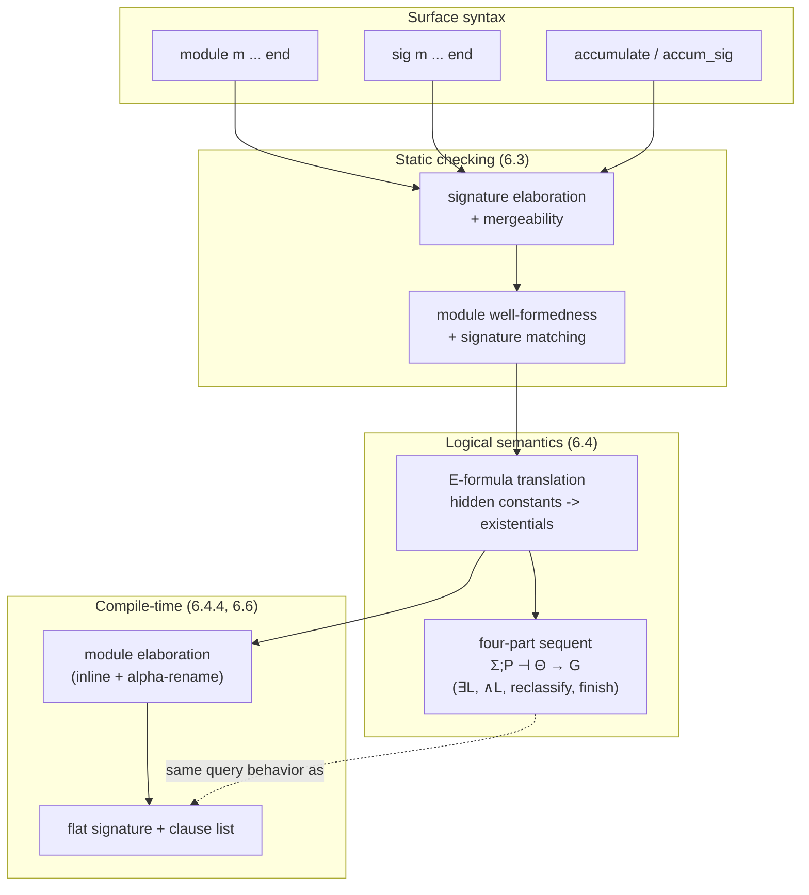

# Modular Program Structuring

[[book-guidelines|↩ Back to guidelines]]

## The problem: modularity usually costs you your semantics

Every language that survives long enough gets a second language bolted onto it. You start out programming-in-the-small — writing functions, clauses, whatever the core language gives you — and once programs get big you need programming-in-the-large: namespaces, encapsulation, separate compilation, interfaces. The trouble, as the book puts it bluntly at the top of Chapter 6, is that this second language is usually born as an afterthought. `local`, `use`, `import`, `include` — new keywords bolted onto the parser, governing scope and visibility through mechanisms that have no connection to the semantics of the underlying language. You end up with a language whose core has a clean denotational or operational story, and a module layer that is pure engineering, understood only informally, verified only by testing.

If you've worked with Rust's module system, or Python's, or even C's `#include`, you've felt this seam. Rust's privacy rules (`pub`, `pub(crate)`, path visibility) are a genuinely well-designed module system — but they are *extra machinery*, not a consequence of anything else in the type system. You cannot derive `pub(crate)` from the typing rules for `enum` or `trait`. It is bolted on, even when it's bolted on well.

Chapter 6 asks a different question: for a logic programming language built on hohh$^+$ (higher-order hereditary Harrop formulas — see the article on hohc/hohh/hohh$^+$ for the full grammar), is it possible to get modules *for free*, as a direct reading of connectives already in the logic? The answer is yes, and the mechanism is almost embarrassingly small: conjunction gives you code composition, and existential quantification — placed in exactly the right syntactic position — gives you information hiding. Nothing new needs to be invented; you just need to notice that program clauses can be existentially quantified, and that this already means something proof-theoretically precise.

This is the encapsulation-for-free idea Rust and ML programmers reach for instinctively when they say "hiding a type behind an existential" or "an opaque `impl Trait` return type is an existential type." Chapter 6 is the logic-programming mirror of that same move, and it's worth seeing exactly how literally it's meant: not "modules are *like* existentials," but modules literally *elaborate into* formulas with existential quantifiers, and the proof rules for existentials in hohh$^+$ are the entire operational semantics of hiding.

## Desiderata: what a module system for a logic language should give you

Before designing anything, Section 6.1 sets criteria (this is worth internalizing as a checklist, because most of the chapter is a demonstration that the E-formula translation satisfies all of it):

- **Rich abstraction, hiding, and parametrization**, with **interfaces** giving a high-level view of code interaction, supporting **separate compilation**.
- **The core language semantics must not be complicated** by adding modularity — in particular, higher-order programming (predicate variables, `call`-like constructs) must interact correctly with modules. The book flags this explicitly as *the* classic failure mode: getting `call/1` to interact sanely with module boundaries has been a long-standing headache in real Prolog systems.
- **A nontrivial notion of module equivalence** — "representation independence" — so that swapping one implementation of a module for another doesn't change what a larger program computes. Logical equivalence of the corresponding formulas is exactly this notion, once modules are translated into logic.

The strategy for hitting all three: reduce programming-in-the-large to programming-in-the-small by explaining every modular construct as a formula in the existing logic. If that works, the first desideratum is met by design (it's just readable surface syntax over formulas), the second is met automatically (you never left the logic), and the third falls out of ordinary logical equivalence.

## Modules and signatures: the surface syntax

The concrete syntax is close to what you'd expect from any ML-family language, and deliberately minimal:

```prolog
module smlists.

type id                     list A -> list A -> o.
type memb, member           A -> list A -> o.
type revapp                 list A -> list A -> list A -> o.
type reverse                list A -> list A -> o.
type append                 list A -> list A -> list A -> o.
type memb_and_rest          A -> list A -> list A -> o.

id nil nil.
id (X::L) (X::K) :- id L K.

memb X (X::L).
memb X (Y::L) :- memb X L.

revapp nil L L.
revapp (X::L1) L2 L3 :- revapp L1 (X::L2) L3.

reverse L1 L2 :- revapp L1 nil L2.

append nil K K.
append (X::L) K (X::M) :- append L K M.

memb_and_rest X (X::L) L.
memb_and_rest X (Y::K) (Y::L) :- memb_and_rest X K L.

end
```

A `module <name> ... end` block is a named collection of kind/type/operator declarations and program clauses. A **signature** is the corresponding interface:

```prolog
sig smlists.

type id                      list A -> list A -> o.
type memb, member            A -> list A -> o.
type reverse                 list A -> list A -> o.
type append                  list A -> list A -> list A -> o.
type memb_and_rest           A -> list A -> list A -> o.

end
```

Notice `revapp` is declared in the module but absent from the signature. That single omission is the entire hiding mechanism at the surface level: `revapp`'s *definition* becomes invisible outside `smlists`, even though it's used internally by `reverse`. In Rust terms this is exactly a private helper function; in ML terms it's a value present in the structure but absent from the signature ascribed to it. What makes Chapter 6 interesting is *why* this hiding is sound — that's Section 6.4, below — not just that the syntax supports it.

Two composition primitives round out the surface language:

- **`accumulate <name1>, ..., <namen>.`** — textually (conceptually) inserts the accumulated modules' code into the accumulating module, alpha-renaming their private constants first so they don't collide.
- **`accum_sig <name1>, ..., <namen>.`** — the signature-level analogue: pulls another signature's declarations into this signature, so that everything the accumulated module could see becomes visible through the accumulating module too, without re-listing every declaration by hand.

The distinction between these two — accumulating a *module* (a private copy of implementation + hidden internals) versus accumulating just a *signature* (a promise about an interface, to be satisfied later) — turns out to be the whole story of module parametrization; more on that below.

**What breaks without accumulation:** without it, every module wanting list operations would have to redefine `memb`, `append`, etc. from scratch, or the language would need a flat global namespace (Prolog's classic failure mode — every predicate name is globally visible, and two unrelated files defining `append` silently collide). Accumulation is what lets `smpairs` (association lists, built from `smlists`) exist as a *module*, with its own signature, while completely hiding the fact that it's implemented on top of another module:

```prolog
module smpairs.
accumulate smlists.

kind pair       type -> type -> type.
type pr         A -> B -> pair A B.
type assoc, assod        A -> B -> list (pair A B) -> o.

assoc X Y L :- memb (pr X Y) L.
assod X Y L :- member (pr X Y) L.
...
end
```

`smlists`'s predicates (`memb`, `member`, `revapp`, ...) are *not* re-exported through `smpairs`'s signature unless explicitly re-declared there — accumulation gives you access, not automatic re-export. This is the opposite default from, say, `pub use` re-exports in Rust, where you have to opt in to hiding rather than opt in to exposing; here hiding is the default and exposure is deliberate.

## Signature elaboration and well-formedness: the type-checking layer

Before any of this can be given meaning, the book needs to nail down when a signature or module is even *well-formed* — this is Section 6.3, and it's the part of the chapter that reads most like ordinary static type-checking, which is worth dwelling on if your target is a Rust-based checker.

**Signature elaboration** is the process of computing the *full* set of declarations a signature denotes, once all its `accum_sig` directives are resolved — think of it as the fixpoint/closure computation you'd write for resolving `use` imports transitively in a Rust crate graph. Two signatures are **mergeable** if:

- any token with a kind declaration in more than one signature has *identical* declarations everywhere,
- any token with a type declaration has types identical *up to renaming of type variables* (i.e., up to alpha-equivalence at the type level — this is literally "these are the same polymorphic type scheme"),
- any token with an operator declaration (fixity/precedence) agrees everywhere it's declared as a constant.

This is exactly the coherence condition you'd want in a Rust trait-resolution or module-linking system: if two accumulated interfaces both claim to know what `append` means, they'd better agree, or the whole notion of a well-defined merged interface collapses. The book requires this explicitly rather than silently taking "last definition wins" (which is what a naive `#include`-style textual pasting would do, and which is exactly the kind of accidental-shadowing bug real C/C++ codebases suffer from).

**Module well-formedness** layers on top: no accumulation cycles (an acyclicity check on the module dependency graph — the same check a build system does on `use`/`import` edges), every accumulated module must itself be well-formed *and match* its declared signature, and — critically — a module is well-typed only if every clause in it type-checks against the (elaborated) implicit signature. "Matching" a signature means: the module's own *implicit* signature (everything it actually declares, clauses dropped) must be mergeable with the *elaboration* of the explicit signature ascribed to it. This is structural/duck-typed matching, much closer to how Go interfaces or Rust trait bounds are checked (does this thing provide what's required?) than to OCaml/SML's nominal, ascription-based nature — though the mergeability condition (identical up to alpha-renaming) does buy you something closer to type equality than pure structural subtyping.

The worked example in Figure 6.4 (modules `m1`, `m2`, `m3` where `m3` accumulates both `m1` and `m2`) shows the failure mode directly: if `m1` and `m2` both declare a predicate `r` with genuinely different (non-alpha-equivalent) types, the signatures are not mergeable, `m3`'s implicit signature can't be computed, and `m3` is simply ill-formed. This is precisely the diamond-import conflict a Rust build tooling author has to handle when two dependencies expose colliding items.

## The logical interpretation: existential quantification *is* hiding

This is the technical heart of the chapter (Section 6.4), and the place where "modules are existentials" stops being a slogan and becomes a literal reading.

**The starting intuition.** In ordinary predicate logic, a formula $\exists y\,\forall x\,(D(x) \supset G(y))$ is logically equivalent — when $x$ does not occur free in $G(y)$ — to $\exists y\,((\exists x\, D(x)) \supset G(y))$. Read operationally: instead of introducing $x$ as a fresh universal constant that scopes over the *whole* implication, you can push the existential quantifier down so it scopes over just the *antecedent* $D(x)$. The constant that $x$ eventually gets treated as (in proof search, universally quantified goals introduce fresh "eigenvariable" constants — see the chapter on $\lambda$-tree syntax for the general mobility-of-binders idiom this belongs to) becomes local to the piece of program that needed it, rather than global to the whole proof.

A further equivalence, $\exists x(D_1(x) \wedge D_2) \equiv (\exists x\,D_1(x)) \wedge D_2$ when $x \notin D_2$, lets the scope of the existential be narrowed even further, down to just the piece of a conjunctive program clause that actually mentions the local name.

**The syntax extension.** To make this a first-class device rather than a derived equivalence you invoke by hand, the book extends the hohh$^+$ grammar to admit **E-formulas**:

$$
\begin{aligned}
G &::= \top \mid A \mid G \wedge G \mid G \vee G \mid \exists x\, G \mid E \supset G \mid \forall x\, G \\
D &::= A_r \mid G \supset D \mid D \wedge D \mid \forall x\, D \\
E &::= D \mid E \wedge E \mid \exists x\, E
\end{aligned}
$$

The only real novelty relative to hohh$^+$ is that the antecedent of an implicational goal ($E \supset G$) is now allowed to be an E-formula — a conjunction of D-formulas (ordinary program clauses) *with existential quantifiers scattered through it*, rather than a plain D-formula. This is a deliberately narrow, surgical extension: you cannot write arbitrary E-formulas as top-level program clauses; E-formulas only ever arise as the *translation target* of modules, never as something a programmer types directly (beyond the `module`/`sig`/`accumulate` surface syntax itself).

**Why the naive proof rule breaks.** If you tried to handle $E \supset G$ with the ordinary implication-right rule from Chapter 2 ($\Sigma; P, B_1 \longrightarrow B_2$ over $\Sigma; P \longrightarrow B_1 \supset B_2$), you'd be adding an E-formula directly into the program $P$ — but programs are supposed to contain only D-formulas. The fix is a genuinely new phase of the sequent calculus, using a four-part sequent

$$
\Sigma; P \dashv \Theta \longrightarrow G
$$

where $\Theta$ is a multiset of E-formulas waiting to be unpacked. The rules:

$$
\frac{\Sigma; P \dashv E \to G}{\Sigma; P \longrightarrow E \supset G}\ {\supset}R'
\qquad
\frac{\Sigma; P \dashv {} \to G}{\Sigma; P \dashv \Theta \to G}\ \text{finish}
\qquad
\frac{\Sigma; P, D \dashv \Theta \to G}{\Sigma; P \dashv D, \Theta \to G}\ \text{reclassify}
$$

$$
\frac{\Sigma; P \dashv E_1, E_2, \Theta \to G}{\Sigma; P \dashv E_1 \wedge E_2, \Theta \to G}\ {\wedge}L
\qquad
\frac{\Sigma, y; P \dashv E[y/x], \Theta \to G}{\Sigma; P \dashv \exists x\,E, \Theta \to G}\ {\exists}L \ \ (y \text{ fresh})
$$

Read bottom-up: entering this phase (${\supset}R'$) opens a "processing zone" $\Theta$ for the E-formula that was just consumed as an antecedent. $\wedge L$ splits conjunctions apart; $\exists L$ instantiates an existential with a *genuinely fresh* constant $y$ (the proviso — $y$ not free in the surrounding sequent — is exactly what makes this constant local and prevents it leaking into the goal $G$ or getting confused with any other constant of the same name); `reclassify` promotes a bare D-formula out of $\Theta$ and into the program $P$ proper, where ordinary backchaining can use it; and `finish` closes the phase once $\Theta$ is empty, handing control back to ordinary goal-directed search. All of these rules are **invertible** — no backtracking is ever needed to process an E-formula, so this phase is deterministic bookkeeping, not search. That invertibility is precisely why this is a sound compilation target rather than a source of nondeterminism a compiler would have to worry about optimizing away.

If you're building a Rust type-checker/elaborator, this four-part sequent is a genuinely useful pattern to steal directly: it's the proof-theoretic version of "elaborate a module's imports into fresh, alpha-renamed local bindings before type-checking the body" — the $\exists L$ freshness proviso is doing exactly the job that gensym'd hygiene macros or de Bruijn-shifted local scopes do in a compiler pass.

## Translating a module into a formula

With E-formulas available, Section 6.4.2 gives the actual translation:

1. Compute the module's implicit signature, and subtract the explicit (declared) signature — what's left are the **hidden constants**.
2. Conjoin all the program clauses in the module into one big D-formula.
3. Existentially quantify the hidden constants at the head.
4. If the module accumulates others, first recursively translate each accumulated module to its own E-formula (well-defined because accumulation cycles are already ruled out by well-formedness), then conjoin those in with the module's own clauses before quantifying.

Concretely, for the `m1`/`m2`/`m3` example (module `m1` hides only `r`, `m2` hides nothing, `m3` hides `p`, `q`, `r`, `b` because it accumulates both and doesn't export them):

$$
\llbracket m1 \rrbracket = \exists r\,\big((\forall x(q\,x \supset p\,x)) \wedge (r\,(a{::}\mathtt{nil}))\big)
$$

$$
\llbracket m2 \rrbracket = \forall x(r\,x \supset q\,x) \wedge (r\,a)
$$

$$
\llbracket m3 \rrbracket = \exists p\,\exists q\,\exists r\,\exists b\,\Big(\exists r\big((\forall x(q\,x\supset p\,x))\wedge(r\,(a{::}\mathtt{nil}))\big) \wedge \big(\forall x(r\,x\supset q\,x)\wedge(r\,a)\big) \wedge \big(\forall x(p\,x\supset s\,x)\wedge(t\,b)\big)\Big)
$$

Note the *nested* existential over $r$ inside $\llbracket m1 \rrbracket$'s copy, distinct from the outer $\exists r$ in $\llbracket m3 \rrbracket$ that hides `m2`'s `r` — two different constants happen to share a surface name, and the quantifier structure keeps them completely apart without any explicit renaming needed at the formula level (the renaming becomes necessary only when you want a *flat*, quantifier-free program via elaboration — see below).

**Interpreting a query.** A query `[m] ?- g X` against module `m` (whose translation is $E$) is, by definition, the request to prove $\exists x\,(E \supset g\,x)$. This single equation is doing an enormous amount of work: it explains, in one stroke, why $r$ from `m1` and $r$ from `m2` can never be confused externally (they're bound by different, non-interacting quantifiers, invisible outside their own $E$), why `[m3] ?- p a.` is ill-formed (the surface-syntax type-checking phase rejects it — `p` isn't in `m3`'s exported signature) while `[m3] ?- s a.` succeeds via an *internal* use of `p` that the querier never sees, and — most strikingly — why

```prolog
[m3] ?- sigma x\ t x.
```

succeeds (by choosing $b$ for the bound variable $x$, entirely within the scope of the existential) while

```prolog
[m3] ?- t X.
```

fails outright: `t X` asks for a *free* logic variable to be exposed as the answer to an *external* query, and no witness for $b$'s identity is available outside the module's own existential scope. The difference between "using a hidden constant during search" and "trying to expose its identity to the caller" is exactly the difference between $\exists x. P(x)$ being provable and $P(c)$ being provable for a caller-visible $c$ — this is definitional-equality-style reasoning about what's observable, not just a scoping rule bolted onto a parser.

If you know Standard ML or OCaml, this is precisely the semantics of an abstract type behind a functor signature: the module *knows* what it's using internally, callers can *use* facilities the module exposes, but callers can never *name* the internal representation. What Chapter 6 buys you that ML's existential-types-for-modules account (Mitchell & Plotkin) doesn't automatically give you is that this is all happening inside a *proof-search* semantics rather than a *proof-normalization*/evaluation semantics — the book flags this distinction explicitly in the bibliographic notes as the actual novel content, not the resemblance to ML.

## Module elaboration: compiling away the quantifiers

Executing the four-part sequent calculus rules at every query is correct but wasteful — you'd be re-processing the same accumulation structure on every single proof search. Section 6.4.4 defines **module elaboration**: a compile-time pass that inlines all accumulated signatures and modules, alpha-renaming private constants as needed to avoid collisions, producing a flat pair (signature, clause list) with *no* accumulation directives left. This is exactly what a Rust build system does when it resolves a crate's dependency graph into a flat set of monomorphized, name-mangled symbols before codegen — module elaboration is the mangling pass.

Concretely, elaborating `m3` from the running example renames `m1`'s local `r` to a fresh `r'` (to avoid colliding with `m2`'s exported `r`), yielding the flat program:

```prolog
p X :- q X.
r' (a :: nil).
q X :- r X.
r a.
s X :- p X.
t b.
```

paired with the flat signature `kind item type. type p,q,r,r',s,t item -> o. type a,b item.` — mediated by `m3`'s original explicit signature, this behaves identically to `m3` under every possible query. This is a genuine compiler correctness theorem in miniature: elaboration is claimed to preserve query-answering behavior exactly, which is the module-system analogue of a compiler pass preserving observable semantics.

## Programming payoffs

Section 6.5 works through what this machinery buys in practice — four applications worth knowing by name because they're the standard menu of "things a good module system should support."

**Abstract datatypes (6.5.1).** Expose a type constructor and its operations, hide the data constructors:

```prolog
sig stack.
kind store               type -> type.
type init                store A -> o.
type add, remove         A -> store A -> store A -> o.
end

module stack.
kind store          type -> type.
type emp            store A.
type stk            A -> store A -> store A.
type init           store A -> o.
type add, remove    A -> store A -> store A -> o.
init emp.
add    X S (stk X S).
remove X (stk X S) S.
end
```

`[stack] ?- init A.` fails — trying to *observe* the representation of the empty stack from outside is exactly the "expose the identity" case that failed for `t X` above. But `sigma A\ sigma B\ sigma C\ init A, add 1 A B, remove X B C.` succeeds, binding `X = 1`: the representation is used, never named. This is `impl Stack` with a private `enum` behind it in Rust, or an OCaml module sealed by a signature that omits the constructor declarations — same idea, proof-theoretic engine underneath.

**Code extensibility (6.5.2).** Because logic-program predicate definitions are naturally *distributed* across clauses (unlike, say, a single Rust `match` that must be exhaustive at one site), a module can extend both the data type and the predicate defined over it, in a *different* module, via accumulation. The worked example builds a propositional prover `proplogic`, then `quantlogic` accumulates it and adds new `form` constructors (`all`, `some`) plus new `prove` clauses handling them — genuinely extending an existing open predicate rather than needing to modify the base module's source. This is closer to open extensible sum types / typeclasses-with-default-methods than to Rust's closed `enum`s — worth flagging as a place where the logic-programming and Rust mental models diverge rather than align.

**Signature accumulation as parametrization (6.5.3).** This is the one that resolves the tension between "private copy" and "shared library." If `proplogic` and `quantlogic` both `accumulate smlists` directly, you get two *separate, private* copies of list operations wired in at elaboration time — correct, but wasteful, and the signatures give no hint that a list implementation is expected. The fix: `accum_sig smlists` into the *signature*, not the module — this declares "I need something satisfying `smlists`'s interface" without committing to a specific copy. Only later, when the theorem prover is actually assembled (`mylogic`, Figure 6.9), do you `accumulate quantlogic, smlists` together, at which point the parameter gets bound to a concrete implementation. This is a direct proof-theoretic analogue of a Rust generic function bounded by a trait (`fn f<T: MyTrait>(...)`) versus a function that owns a private, concrete `impl MyTrait` internally — `accum_sig` is the bound, `accumulate` is the concrete instantiation.

**Resolving the `call/1` ambiguity (6.5.4).** This is the desideratum flagged back in 6.1, now paid off. In ordinary Prolog-with-modules, when a predicate variable holding a name like `p` gets passed into `call`, there are two competing readings for what `p` *means*: the environment where `call` itself is defined, or the environment where the term mentioning `p` was constructed. Real systems disagree, and the ambiguity is a long-documented wart. The book's example (Figure 6.10) makes it concrete — two modules each define a `p`, and depending on which reading you take, a query's answer comes out `1::nil` or `2::nil`. Because the E-formula semantics never distinguishes "calling context" from "defining context" in the first place — a module just *is* one big formula with existentially scoped local names, elaborated once, before any query happens — there is only one coherent answer: names are resolved *statically*, at elaboration time, exactly as elaborating `test` (which accumulates `comblibrary`) shows: `p` and the accumulated `p'` (renamed to avoid collision) are fully determined before the query `call (p X)` is ever posed, so the ambiguity simply cannot arise. This is a genuinely elegant case of "the right foundational choice makes a whole class of bugs a type error rather than a runtime footgun" — the exact property you want from the elaborator described in the standing learning goals: static, unambiguous name resolution as a *consequence* of the underlying quantifier semantics, not a separately bolted-on scoping pass.

## Implementation sketch and where the book leaves it

Section 6.6 is intentionally brief but names the two real implementation strategies: (1) a preprocessor that does full inlining/renaming (module elaboration) before standard compilation — simple, but forces recompilation of accumulated code every time an accumulating module is rebuilt; (2) moving the inlining to *link time* over already-compiled code, enabling genuine separate compilation, at the cost of the linker needing to combine separately generated clause blocks for a predicate without hurting runtime performance relative to the inlined version. The bibliographic notes point to [[The-Teyjus-Implementation|the Teyjus implementation]] as having pursued exactly this evolution (compile-time inlining first, then a later version supporting separate compilation).

## Where this leads

The chapter closes an arc that began in Chapter 2 (where modules were used informally, without any semantics attached) and depends on Chapter 5's hohh$^+$ (the relaxation of hohh that allows clause heads to be flexible atoms — this is exactly what lets a locally-hidden predicate name be existentially bound and still head a clause). It stands as a self-contained "programming system" stage in the book's four-part structure — foundations (Ch. 1-3), higher-order foundations (Ch. 4-5), *this* programming-system stage (Ch. 6 + Appendix), and $\lambda$-terms-as-data (Ch. 7-11). Nothing in the later chapters on $\lambda$-tree syntax or encoding proof systems and process calculi strictly depends on the module machinery, but the large worked examples in those later chapters (theorem provers, interpreters) are all written *as* accumulating modules, so the surface fluency earned here pays for itself throughout the rest of the book.

For the standing compiler/verifier project, this chapter is worth treating as load-bearing in a specific, narrow way: the four-part sequent $\Sigma; P \dashv \Theta \to G$ and its invertible $\exists L$/reclassify rules are a genuinely reusable pattern for *any* module or hygiene-sensitive elaboration pass — not just for a $\lambda$Prolog-flavored checker. The freshness proviso on $\exists L$ ("$y$ not present in $\Theta$, hence not free in the concluding sequent") is precisely the invariant a Rust-based elaborator needs to maintain when generating fresh metavariables or hygienic local bindings during module instantiation; and the static, elaboration-time resolution that dissolves the `call/1` ambiguity is a direct argument for doing name resolution as a *first-class formula-rewriting pass before search*, rather than deferring it to be resolved dynamically at call sites — a design choice worth carrying over verbatim into a bidirectional elaborator's handling of module-qualified names.


