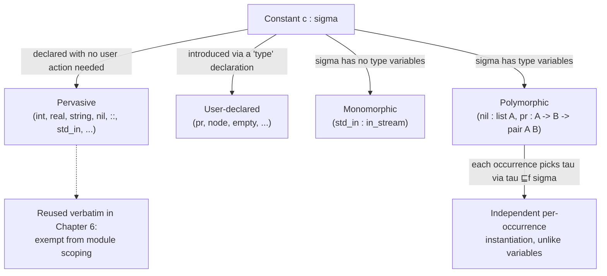

# Polymorphic and Pervasive Constants

[[book-guidelines|↩ Back to guidelines]]

## Two separate questions hiding in one word: "constant"

Before $\lambda$Prolog can typecheck a single term, two independent design questions have to be settled about every constant in the language:

1. **Where does it come from?** Did the programmer declare it, or is it simply *there*, available in every program without any declaration at all — the way `int`, `+`, or `nil` are?
2. **How many types can it have?** Is it pinned to one fixed type forever, or can the same symbol stand for a whole family of types at once, picking a different member of that family at each place it's used?

These are orthogonal axes, and the book's terms for the two "yes" answers are **pervasive** (question 1) and **polymorphic** (question 2). It's easy to conflate them because the flagship built-in constants — `nil`, `::`, the arithmetic operators — happen to be both. But a constant can be pervasive and monomorphic (`std_in : in_stream`, fixed, one type, always available), or user-declared and polymorphic (`pr : A -> B -> pair A B`, defined by you, but still ranges over infinitely many instance types). Keeping the two questions apart is what makes the rest of this section click.

---

## 1. Pervasive constants: the vocabulary that has to exist before you write anything

### What breaks without this

Imagine a version of $\lambda$Prolog with *zero* built-in constants — every symbol, including the ones for integers, strings, and lists, has to be declared by the programmer before use. You'd hit a bootstrapping wall immediately: how do you even *write* the type declaration for integer literals, if you have no prior notion of what an integer is? Every program would need to re-declare the same scaffolding — arithmetic, strings, list constructors — before doing anything domain-specific. This isn't a hypothetical: it's exactly the tax you'd pay if a language had no standard prelude at all.

The book's fix is to designate a fixed set of sorts, type constructors, and constants as **pervasive** — "present in every setting," in the book's own phrasing — meaning they need no declaration and are simply always in scope. Concretely:

- Nonnegative integers (`1`, `42`, ...) as constants of the pervasive sort `int`, plus arithmetic constants like unary minus `~ : int -> int` and infix `+`, `*`.
- Nonnegative reals, written with a decimal point, as constants of the pervasive sort `real`, plus their own arithmetic constants.
- Strings, written in double quotes, as constants of the pervasive sort `string`.
- `std_in : in_stream`, `std_out : out_stream`, `std_err : out_stream` — the standard I/O streams.
- The list type constructor and its two constructors, `nil` and `::` ("cons") — these get their own treatment below because they're also the book's running example of polymorphism.

Pervasiveness is a property of the *sort or type constructor itself* too, not just the term-level constant — the book calls `list`, `int`, and friends **pervasive type symbols**, in parallel with pervasive constants.

### Where "pervasive" resurfaces later

This isn't just a Chapter 1 bookkeeping detail. When the book builds $\lambda$Prolog's module system in Chapter 6, it explicitly reuses this exact vocabulary: "certain sorts, type constructors, and constants... are assumed to be pervasive and can be used freely in **any module or query**." In a language where modules otherwise carefully control what's visible where (via accumulation and signatures), pervasive constants are the one category exempted from that discipline entirely — a deliberately global, ambient layer beneath the module system's scoping rules. Chapter 1 is quietly laying the groundwork for a distinction Chapter 6 will lean on hard: *ambient, always-visible* versus *locally scoped*.

### Grounding: the "prelude" pattern

This is a pattern every working programmer has already internalized under a different name — a **prelude** or **standard library that's implicitly in scope**.

```rust
// You never write `use std::primitives::i32;` — i32, bool, str, and their
// literals are pervasive in exactly Miller and Nadathur's sense: built into
// the language, available with no declaration, in every crate you write.
fn distance(a: i32, b: i32) -> i32 {
    (a - b).abs()   // `-`, integer literals, and `i32` itself: all pervasive
}
```

```python
# Python's __builtins__ module is implicitly imported into every module —
# int, str, list, len, print — the pervasive layer of the language.
def total(xs: list[int]) -> int:
    return sum(xs)   # sum, list, int: none of these were declared by you
```

Lean draws the line in the same place, just with a much larger and more carefully curated "always available" core (`Nat`, `List`, `Prop`, and the entire pervasive vocabulary the kernel and `Init` library expose without an explicit `import`). The principle is identical across all three: *some* base vocabulary has to be exempt from the "you must declare it before you use it" rule, or the language can't bootstrap its own examples.

---

## 2. Polymorphic constants: one declaration, infinitely many types

### The core idea

A constant is **polymorphic** if its declared type contains type variables. Since a type variable can be instantiated to *any* (order-0, non-`o`) type, a polymorphic constant doesn't have one type — it simultaneously has *every* type obtainable by substituting for its variables. The book's canonical example is the pair of list constructors:

$$
\texttt{nil} : \mathtt{list}\ A \qquad\qquad \texttt{::} : A \to \mathtt{list}\ A \to \mathtt{list}\ A
$$

`nil` isn't "the empty list of `int`s" or "the empty list of `string`s" — declared once with the type variable `A` left free, it stands for `list int`, `list string`, `list (list int)`, and so on, all at once. The type checker picks whichever instance the surrounding term demands.

### What breaks without this

Without polymorphism, you'd need a family of monomorphic constants — `nil_int : list int`, `nil_string : list string`, `nil_list_int : list (list int)`, ... — one per concrete element type, declared in advance, with no way to write code that's generic *over* the element type. This is precisely the "untyped Prolog" failure mode from the broader chapter: either you throw away typing altogether to get genericity back, or you're stuck hand-duplicating declarations. Polymorphic constants are what let a single declaration of `nil` and `::` serve every list you'll ever build, while still letting the type checker catch `node(3, "cat", 4)`-style nonsense.

### The subtlety: per-occurrence instantiation, not one global choice

This is the detail that's easy to under-appreciate on a first pass: **different occurrences of the same polymorphic constant in one term can pick different, even mutually incompatible instance types.** Consider:

```
(2 :: 1 :: nil) :: (1 :: nil) :: nil
```

This term has type `list (list int)`. But look at the three occurrences of `nil` inside it: the first two (closing off `2 :: 1 :: nil` and `1 :: nil`) each have type `list int`, while the outermost `nil` has type `list (list int)`. One declaration, three occurrences, two different concrete types — chosen independently, purely by what makes each local application well typed.

Contrast this sharply with **term variables**. A variable's type, once fixed by its context, is the *same* at every occurrence — no per-occurrence reinstantiation is allowed. The book makes the contrast concrete: `(X pr X)` is well typed (both occurrences of `X` share one instance of `pr`'s type), but `((X :: nil) :: X :: nil)` is *not* well typed for any choice of types, because it would require `X` itself to simultaneously be an element of the outer list and a *list of* elements of the outer list — something a single fixed type for `X` can never satisfy, no matter which instance of `::`'s polymorphism you pick.

This asymmetry — constants reinstantiate freely per occurrence, variables don't — is not a minor footnote. It's the exact borderline between "genuinely polymorphic" (constants) and "just one unknown, consistently used" (variables), and it's the same borderline that shows up throughout typed programming languages.

### Grounding: monomorphization and implicit type parameters

Rust generics make the "one declaration, many instantiations, chosen per call site" behavior completely explicit, because the compiler performs exactly this instantiation (via *monomorphization*) at compile time:

```rust
// `Option::<T>::None` is declared once, polymorphically...
fn wrap_int() -> Option<i32> { None }        // None instantiated at T = i32
fn wrap_str() -> Option<String> { None }     // None instantiated at T = String

// ...and nothing stops two *different* instantiations of the same generic
// constant from appearing in one expression, exactly like the nested-nil term:
let nested: Vec<Vec<i32>> = vec![vec![1, 2], vec![3]];
//           ^ outer Vec::new-style constant at T = Vec<i32>
//                        ^ inner ones at T = i32
```

Lean's implicit-argument polymorphism is the more literal translation, since — like $\lambda$Prolog's constants — the type parameter isn't even written at the use site, only inferred:

```lean
-- List.nil : {α : Type} → List α  — one polymorphic declaration
#check ([] : List Nat)                    -- α inferred as Nat
#check ([] : List String)                 -- α inferred as String
#check ([[1], [2, 3]] : List (List Nat))  -- outer [] at α = List Nat,
                                           -- inner [] occurrences at α = Nat
```

Both snippets are doing, by hand or by compiler magic, exactly what the book's constant-typing rule does formally in one line — which is the next thing to make precise.

### The typing rule, and why it's the load-bearing part for this book's project

The type assignment calculus's rule for constants (developed in full in [[Typed-First-Order-Terms-and-Type-Structure#3. Typed first-order terms and the type assignment calculus|Typed First-Order Terms and Type Structure, section 3]]) is what makes "per-occurrence reinstantiation" precise rather than hand-wavy:

$$
\frac{c : \sigma \in \Sigma \quad \tau \sqsubseteq_f \sigma}{\Sigma;\Gamma \vdash c : \tau}
$$

Read right to left: to type an *occurrence* of constant $c$ at type $\tau$, look up $c$'s one declared (possibly polymorphic) type $\sigma$ in the signature $\Sigma$, then check that $\tau$ is obtainable from $\sigma$ by substituting order-0, non-`o` types for $\sigma$'s variables ($\tau \sqsubseteq_f \sigma$). Nothing in this rule remembers what instance was chosen at any *other* occurrence of $c$ — which is exactly the freedom the nested-`nil` example exploits, and exactly the discipline the variable rule (which just looks $x$ up once in $\Gamma$, no instantiation permitted) deliberately lacks.

If you're tracking the standing project's elaborator thread: this is the smallest possible instance of *implicit-argument resolution*. "Look up a symbol's polymorphic declared type, then find an instantiation of its type variables that fits the surrounding context" is the one-line summary of what a bidirectional elaborator's metavariable machinery does at scale — Lean's `{α : Type}` inference for `List.nil` is not an analogy so much as the same rule, run by a more sophisticated engine. The $\sqsubseteq_f$ relation here is unification's job (Topic 3 of this book) doing its work silently, one occurrence at a time, before unification itself is even formally introduced.

---

## 3. How new constants join the pervasive ones: type and operator declarations

Pervasive constants cover the base vocabulary, but obviously a real program needs its own. Two declaration forms extend the constant space:

**Type declarations** introduce new constants and fix their (possibly polymorphic) type:

```
type  pr   A -> B -> pair A B.
```

This is a *user-declared, polymorphic, non-pervasive* constant — `pr` is available only because you wrote this line, but once declared, it enjoys exactly the same per-occurrence instantiation freedom as `nil` and `::` do. The first-order fragment this chapter builds constrains what's allowed here: the declared type must have order at most 1, and it must not mention `o` — the same order restriction from [[Typed-First-Order-Terms-and-Type-Structure#The order of a type|the order-of-a-type discussion]], now applied as a *well-formedness condition on declarations themselves*, not just an observation about types in the abstract.

**Operator declarations** are a separate, purely syntactic layer on top — they don't add typing power, only concrete-syntax convenience:

```
infixl  pr  5.
```

This lets you write `3 pr 4 pr "three"` instead of `((pr ((pr 3) 4)) "three")`. The fixity keywords (`prefix`, `infixl`, `infixr`, etc.) and a precedence level control associativity and binding strength, mirroring how `::` itself is pre-declared as `infixr` so that `2 :: 1 :: nil` parses the way you'd expect. Operator and type declarations have to agree — an infix operator needs at least two argument types, and a left-associative one needs its first argument type to admit common instances with its target type — violations show up as terms that simply fail to parse or typecheck.

The point worth carrying forward: *pervasiveness*, *polymorphism*, and *fixity* are three genuinely independent knobs. A constant can be pervasive or user-declared; independently polymorphic or monomorphic; independently an operator or plain prefix-applied. The built-in list constructors happen to hit "pervasive + polymorphic + operator" all at once, which is exactly what makes them memorable — and exactly why it's worth pulling the three properties apart explicitly, as this section does.

---

## The taxonomy, end to end



Pervasiveness answers "where did this constant come from"; polymorphism answers "how many types can one occurrence have." The two axes cross freely — the diagram's left/right split (pervasive vs. user-declared) is orthogonal to its top/bottom split (monomorphic vs. polymorphic) — and the book's own running examples simply happen to sit in the corner where both properties hold at once.

## Where this leads

- **Unification** (Section 1.5 of this chapter) is the mechanism that actually *finds* the instantiation $\tau$ that makes $\tau \sqsubseteq_f \sigma$ hold at each occurrence — this section describes the type-checking side of polymorphism; unification is the algorithmic side that makes it decidable and automatic rather than something the programmer supplies by hand.
- **Chapter 6's module system** reuses "pervasive" verbatim as the one category of constant exempt from module-level visibility control — worth remembering that this term isn't chapter-local vocabulary but a concept the book deliberately carries forward unchanged.
- **Chapter 4's higher-order type assignment calculus** generalizes this exact constant-typing rule to unrestricted $\lambda$-terms, dropping the order-$\le 1$ restriction on declared types — the per-occurrence instantiation story told here for `nil` and `::` is the first-order rehearsal of the general mechanism that governs *every* constant, at every order, for the rest of the book.
- For the standing elaborator project: the $\tau \sqsubseteq_f \sigma$ side condition on the constant-typing rule is, in miniature, exactly the problem of resolving an implicit type argument from a polymorphic declaration — "look up the declared type, generate a placeholder for each type variable, let the surrounding context pin the placeholders down" is the whole of what this section does by inspection, and the whole of what a metavariable-driven elaborator does by search once declarations stop being this simple.
