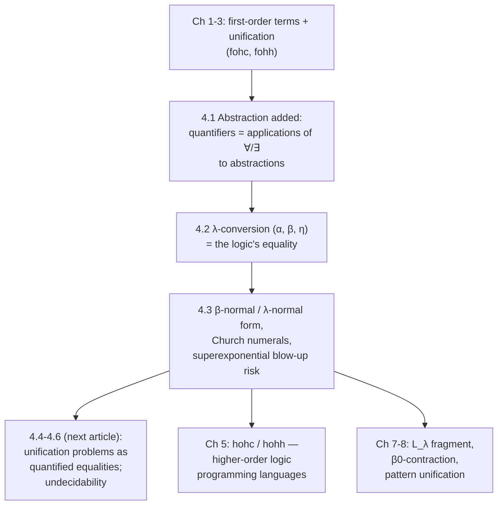

# The Simply Typed λ-Calculus

[[book-guidelines|↩ Back to guidelines]]

## Why the book stops to build a new calculus here

Chapters 1–3 got a full logic-programming language — fohc, then fohh — working entirely on *first-order* terms: constants, variables, and application, with unification doing all the computational work. That machinery has a hard ceiling. First-order terms can only ever be inert data. If you try to represent a quantified formula like $\forall x\, P(x)$ as a first-order term, the best you can do is something like `forall(x, P(x))`, where `x` is just another constructor argument — a piece of syntax with no actual binding force. Nothing in the term itself says "this occurrence of `x` is bound here and nowhere else"; you'd have to bolt that meaning on from outside, and it would leak the moment you tried to substitute something into the formula.

The book's fix is to stop faking binding with data constructors and instead give the *term language itself* a binding construct: abstraction, $\lambda x\, t$, borrowed wholesale from Church's simply typed $\lambda$-calculus. Once abstraction is a first-class syntactic operation, quantifiers stop being ad hoc constructors and become an instance of it — and, as a side effect, the term language now contains genuine *functions*, with their own computational content (`β`-reduction). That computational content is what the rest of Part II of the book (higher-order unification, higher-order logic programming) is going to exploit. This chapter's job is narrower: get [[Encoding-the-Pi-Calculus#The calculus itself|the calculus itself]] — syntax, typing, the three conversion rules, and their basic properties — pinned down precisely before any of that.

This article covers exactly sections 4.1–4.3 (pp. 96–105): the syntax of $\lambda$-terms and formulas, the rules of $\lambda$-conversion, and the properties of $\lambda$-conversion (normal forms, Church numerals, and normalization blow-up). The next article in this vault, on Higher-Order Unification, picks up where this one stops — section 4.4 onward, where unification problems get reframed as quantified equalities.

---

## 1. Abstraction: the one new syntactic ingredient

### The intuition

First-order terms are built from constants and variables using **application** — juxtaposition, `f x`. That's it; that's the whole term language of Chapters 1–3. This chapter adds exactly one new operation: **abstraction**. Given an expression $t$ in which a typed variable $x : \alpha$ possibly occurs free, abstraction packages $t$ into a term denoting *a function of $x$*, written $\lambda(x:\alpha)\, t$ in the book's mathematical notation, or `(x:A)\ T` in $\lambda$Prolog's concrete syntax (the backslash is the abstraction operator; `T` and `A` are the concrete-syntax renderings of $t$ and $\alpha$). The type annotation can be dropped — `x\ T` — and left to type inference, which the book describes as working the same way it does for first-order quantified variables: assign a fresh type variable, then refine it minimally while checking the typing rules.

Two parsing conventions matter for reading the book's examples: an abstraction's body extends as far right as delimiters allow, and application binds tighter than abstraction, so abstraction is right-associative. `λf λx (f (f (f x)))` in concrete syntax is `f\x\ f (f (f x))` — no extra parentheses needed around the nested abstractions.

### What breaks without this

Without abstraction as a genuine syntactic operation, you're stuck with the Chapter 1 approach — encoding "a formula with a bound variable" as a first-order term where the bound variable is just another symbol sitting inside a constructor argument. The book flags exactly this failure mode back in Chapter 1: first-order encodings of quantified formulas cannot capture the true binding force of a quantifier. Concretely, nothing stops you from writing an ill-scoped substitution into such an encoding, because the representation carries no actual notion of "this name is bound here." Abstraction fixes this by making binding a property the *term former* enforces, not something a downstream interpreter has to reconstruct by convention.

### Grounding: closures, not just syntax

A Rust closure is the closest everyday intuition for what an abstraction *means* computationally — `|x: i32| f(f(f(x)))` denotes a function value, not a piece of inert data. But the analogy has a load-bearing limit: a Rust closure is an opaque function pointer plus captured environment; you cannot pattern-match into its body. A $\lambda$-term is *transparent* — it's still a piece of syntax you can inspect, take apart, and substitute into. That transparency (term as both function *and* data) is precisely the property Chapters 7–11 of the book build entire techniques around ($\lambda$-tree syntax, computing under binders). Keep both halves of the analogy in view: "abstraction denotes a function" (closure-like) and "abstraction is still syntax you can pattern-match on" (very much *not* closure-like — this is where Lean's own kernel-level term representation, with `Expr.lam`, is the more literal model).

---

## 2. The type assignment calculus for $\lambda$-terms

### The judgment and its rules

The book generalizes the first-order typing judgment $\Sigma;\Gamma \vdash_f t : \tau$ (Chapters 1–2) to a new judgment without the $f$ subscript:

$$
\Sigma;\Gamma \vdash t : \tau
$$

— dropping the subscript is deliberate notation for "we've left the first-order-restricted world." $\Sigma$ assigns types to constants (including the logical constants), $\Gamma$ assigns types to variables. The rules (the book's Figure 4.1) are:

$$
\frac{c:\sigma \in \Sigma \quad \tau \trianglelefteq \sigma}{\Sigma;\Gamma \vdash c : \tau}
\qquad
\frac{x:\tau \in \Gamma}{\Sigma;\Gamma \vdash x : \tau}
\qquad
\frac{\Sigma;\Gamma \vdash g : \tau_1 \to \tau_2 \quad \Sigma;\Gamma \vdash t : \tau_1}{\Sigma;\Gamma \vdash (g\ t) : \tau_2}
$$

$$
\frac{\Sigma;\Gamma, x:\tau \vdash t : \sigma}{\Sigma;\Gamma \vdash \lambda(x:\tau)\, t : \tau \to \sigma}\ (\dagger)
\qquad
\frac{\Sigma;\Gamma \vdash B : \tau}{\Sigma;\Gamma \vdash C : \tau}\ (\ddagger)
$$

where proviso $(\dagger)$ requires $x$ not already declared as a type or kind in $\Sigma$ or $\Gamma$, and proviso $(\ddagger)$ (an implicit structural rule making the judgment closed under $\alpha$-renaming) requires $B$ and $C$ to differ only in the names of bound variables. Three things changed relative to the first-order rules of Chapters 1–2: the instance-of-a-type-scheme relation $\tau \trianglelefteq_f \sigma$ becomes the unrestricted $\tau \trianglelefteq \sigma$ (no more restriction to first-order type instantiation); there's a genuinely new rule for typing abstractions; and — notably — there is *no separate rule* for quantifiers, because (as section 1 already set up) $\forall$ and $\exists$ are just applications of ordinary constants to abstractions, so the application and abstraction rules alone suffice to type them.

An expression $t$ is a **well-formed $\lambda$-term** (or well-formed $\Sigma$-term) exactly when some $\Gamma$ and $\tau$ make $\Sigma;\Gamma \vdash t:\tau$ derivable. It's **closed** if $\Gamma$ can be taken empty, **open** otherwise. If a term's type contains no type variables, it's a **simply typed $\lambda$-term** — this distinction matters later, when the book restricts attention to simply typed terms for the details of a unification procedure. And a key structural fact the book states directly: given fully type-annotated bound variables, the type of a well-formed $\lambda$-term is unique up to renaming of type variables — the same guarantee that lets type inference on unannotated abstractions (`x\ T` instead of `(x:A)\ T`) recover a unique-up-to-renaming answer.

### Formulas are just terms of type $o$, and quantifiers are just abstractions

This is the payoff the whole section has been building toward. A well-formed $\lambda$-term of type $o$ is called a **formula**. Nothing new needed for conjunction, disjunction, implication — they were already ordinary constants from Chapter 2. What *is* new: the global signature $\Sigma$ is extended with constants $\forall$ and $\exists$, both of type $(A \to o) \to o$ for a type variable $A$ (concrete syntax: `pi` and `sigma`, already used informally since Chapter 2). Universal and existential quantification of $x$ over $F$ are then literally

$$
\forall(\lambda x\, F) \qquad \exists(\lambda x\, F)
$$

with $\forall x\, B$ and $\exists x\, B$ as sugar for these, and a type-annotated variant $\forall_\tau x\, B$, $\exists_\tau x\, B$ when the bound variable's type needs to be shown explicitly. Working through the book's derivation: if $\Sigma;\Gamma,x{:}\sigma \vdash B:o$ is derivable, the abstraction rule gives $\Sigma;\Gamma \vdash \lambda x\,B : \sigma \to o$; since $\Sigma$ contains $\forall : (\tau\to o)\to o$, instantiating $\tau$ to $\sigma$ gives $\Sigma;\Gamma \vdash \forall : (\sigma\to o)\to o$; the application rule then combines these into $\Sigma;\Gamma \vdash \forall(\lambda x\,B) : o$ — i.e. $\forall x\,B$ is a well-formed term of type $o$, a *formula*, built from nothing but the application and abstraction rules already on hand. In $\lambda$Prolog concrete syntax, applying `pi : (list int -> o) -> o` to the abstraction `y\ append (1::2::nil) y X` (of type `list int -> o`) produces the quantified formula `pi y\ append (1::2::nil) y X`.

### What breaks without unifying quantifiers into abstraction

If quantifiers stayed special-cased constructs (as they effectively were, informally, through Chapter 3), the typing calculus would need a dedicated rule for each of them, plus special-cased substitution machinery for instantiating a quantified variable — exactly duplicating the substitution machinery abstraction already needs for $\beta$-reduction. Folding quantifiers into abstraction means one substitution mechanism does both jobs, and it's why the book can now write terms mixing logical connectives *inside* the arguments of ordinary nonlogical symbols — its `foreach` example, `type foreach (A -> o) -> list A -> o.`, lets you write `foreach (x\ x > 5, x < 9) (3::10::6::8::nil)`, an atomic formula with a conjunction buried inside one of its arguments. That's the seed of the higher-order *programming* that Chapter 5 builds out; abstraction is the single binding operation underneath all of it (the book is explicit that other binders it introduces later are all encoded via abstraction too).

### Grounding: a compiler-pass sketch

The typing rules above are, almost line for line, a bidirectional type checker. Application and constant/variable lookup are *inference* rules (given the subterms' types, compute the result type); abstraction is naturally a *checking* rule once you fix the bound variable's declared type, or an inference rule that first synthesizes a fresh metavariable for it. In Rust:

```rust
enum Type {
    Base(String),
    Arrow(Box<Type>, Box<Type>),
}

enum Term {
    Const(String),
    Var(String),
    App(Box<Term>, Box<Term>),
    Abs(String, Type, Box<Term>), // λ(x:τ) t
}

fn infer(sig: &Signature, ctx: &Context, t: &Term) -> Result<Type, TypeError> {
    match t {
        Term::Const(c) => sig.lookup(c).ok_or(TypeError::UnknownConst),
        Term::Var(x) => ctx.lookup(x).ok_or(TypeError::UnboundVar),
        Term::App(g, arg) => match infer(sig, ctx, g)? {
            Type::Arrow(t1, t2) => {
                let arg_ty = infer(sig, ctx, arg)?;
                if arg_ty == *t1 { Ok(*t2) } else { Err(TypeError::Mismatch) }
            }
            _ => Err(TypeError::NotAFunction),
        },
        Term::Abs(x, ty, body) => {
            let mut ctx2 = ctx.extend(x.clone(), ty.clone()); // proviso (†): x fresh
            let body_ty = infer(sig, &ctx2, body)?;
            Ok(Type::Arrow(Box::new(ty.clone()), Box::new(body_ty)))
        }
    }
}
```

This is deliberately the minimal skeleton — no unification-driven inference for unannotated abstractions, no polymorphism — but it makes the shape of proviso $(\dagger)$ concrete: `ctx.extend` is exactly where you'd reject shadowing a type/kind-level name, and the abstraction case is where a real implementation would either demand an annotation or synthesize a metavariable and defer.

---

## 3. The rules of $\lambda$-conversion

### "Free for" — generalizing capture-avoidance

Before stating the conversion rules, the book generalizes the "free for" substitution proviso from Chapter 3's quantified-formula substitution to full $\lambda$-terms: $t$ is **free for** $x$ in $s$ if the free occurrences of $x$ in $s$ don't fall inside the scope of an abstraction binding a free variable of $t$. Example: $(f\,x)$ is free for $u$ in $\lambda w\,(g\,u\,w)$, but $(f\,w)$ is *not* free for $u$ in $\lambda w\,(g\,u\,w)$ — substituting would let the free $w$ in $(f\,w)$ get silently captured by the surrounding $\lambda w$. When $x$ and $t$ share a type and $t$ is free for $x$ in $s$, $s[t/x]$ denotes the capture-free replacement of all free occurrences of $x$ in $s$ by $t$.

The book later lifts this restriction for convenience: pick an $\alpha$-variant $s'$ of $s$ for which $t$ *is* free, and define $s[t/x]$ via $s'$. All choices of $s'$ give $\alpha$-convertible (hence equal) results, so $s[t/x]$ is well defined unconditionally — this is exactly the "rename bound variables to avoid capture" move every substitution implementation does silently, made rigorous.

### The three rules

- **$\alpha$-rewriting**: replace $\lambda x\,s$ by $\lambda y\,s[y/x]$, provided $y$ is free for $x$ in $s$ and $y \notin \mathrm{FV}(s)$. The reflexive-symmetric-transitive closure is **$\alpha$-conversion**.
- **$\beta$-contraction**: replace $(\lambda x\,s)\,t$ by $s[t/x]$ (given the liberalized substitution above, no side condition needed). The reverse is **$\beta$-expansion**. Reflexive-transitive closure of ($\alpha$-conversion $\cup$ $\beta$-contraction) is **$\beta$-reduction**; its symmetric-transitive closure is **$\beta$-conversion**.
- **$\eta$-contraction**: replace $\lambda x\,(s\,x)$ by $s$, provided $x \notin \mathrm{FV}(s)$. Reverse is **$\eta$-expansion**. Reflexive-transitive closure is **$\eta$-reduction**; symmetric-transitive closure is **$\eta$-conversion**.

$\lambda$-conversion is the transitive closure of $\alpha$, $\beta$, and $\eta$-conversion together — an equivalence *and* a congruence — and the book adopts it wholesale as **the notion of equality within higher-order logic**. A direct consequence: the logic can never distinguish $\alpha$-variants, and no specification in the logic can pin down the concrete name of a bound variable — renaming a bound variable via $\alpha$-conversion always preserves equality.

The book's worked illustration, in concrete syntax:

```
x\y\ f (g x) y                       -- (i)
X\Y\ f (g X) Y                       -- (ii)  α-variant of (i)
x\ f (g x)                           -- (iii) η-contraction of (i)
x\y\ f ((u\v\v) (2 + 3) (g x)) y     -- (iv)
```

(i) and (ii) are $\alpha$-convertible. (iii) is an $\eta$-contraction of (i). A single $\beta$-contraction on (iv) — reducing $(u\backslash v\backslash v)\,(2+3)$ to $v\backslash v$ — yields `x\y\ f ((v\v) (g x)) y`, and a second $\beta$-contraction (reducing $(v\backslash v)\,(g\,x)$ to $g\,x$) yields exactly (i). All four terms are therefore $\lambda$-convertible, hence *equal*.

### What breaks without capture-avoidance

Drop the "free for" proviso and $\beta$-contraction becomes unsound: substituting $(f\,w)$ for $u$ into $\lambda w\,(g\,u\,w)$ without renaming the bound $w$ first would silently turn the substituted term's free $w$ into a bound occurrence, changing its meaning. This is the *identical* failure mode Chapter 3 already flagged for substituting into quantified formulas — unsurprising, since $\forall/\exists$ are now just applications of $\forall/\exists$ to abstractions, so quantifier-substitution soundness and abstraction-substitution soundness are, definitionally, the same fact.

### Grounding: this is exactly `isDefEq`

Because $\lambda$-conversion is stipulated to *be* the logic's equality relation, this section is the most literal possible match to a proof assistant's kernel. Lean's `isDefEq` (definitional-equality check) is precisely a decision procedure for $\lambda$-conversion (extended with further reduction rules like $\delta$ for definition unfolding and $\iota$ for recursor computation, which this book's calculus doesn't have — Miller and Nadathur's logic is deliberately Church's Simple Theory of Types *without* those extras). When Lean's elaborator checks that a term you wrote has the expected type, at some point it is calling something structurally identical to: normalize both sides, compare up to $\alpha$. `rfl` in Lean succeeds exactly when two terms are related by (Lean's extended notion of) this same conversion relation.

```lean
-- α-conversion: bound-variable names are not part of a term's identity
example : (fun x : Nat => x + 1) = (fun y : Nat => y + 1) := rfl

-- β-conversion: this is literally what `rfl` checks here
example : (fun x : Nat => x + 1) 3 = 4 := rfl

-- η-conversion: Lean's kernel performs η as part of defeq too
example (f : Nat → Nat) : (fun x => f x) = f := rfl
```

---

## 4. Properties of $\lambda$-conversion: redexes, normal forms, and Church numerals

### Redexes and normal forms

A term of the form $(\lambda x\,s)\,t$ — one that $\beta$-contraction can act on — is a **$\beta$-redex**. A term $\lambda x\,(t\,x)$ with $x \notin \mathrm{FV}(t)$ is an **$\eta$-redex**. A term with no $\beta$-redexes is in **$\beta$-normal form**; if it additionally has no $\eta$-redexes, it's in **$\lambda$-normal form** (also called **$\beta\eta$-normal form**). If $t$ is $\lambda$-normal and $s$ is $\lambda$-convertible to $t$, $t$ is *a* $\lambda$-normal form of $s$ — and the book states the key existence-and-uniqueness fact: every typed $\lambda$-term here has a $\lambda$-normal form, unique up to $\alpha$-conversion, written $\lambda\mathrm{norm}(s)$.

The algorithm follows directly: repeatedly contract $\beta$-redexes to reach $\beta$-normal form, then repeatedly contract $\eta$-redexes. This gives a decision procedure for equality-up-to-$\lambda$-conversion of same-typed terms too: normalize both sides, compare up to $\alpha$ — which is exactly what section 3's Lean `isDefEq` correspondence above is doing computationally.

One subtlety worth flagging explicitly, since it matters for how logic programs use $\lambda$-terms: **logical constants inside a term don't get any special equational treatment.** $\lambda x\,(p\,x) \wedge (q\,x)$ is *not* equal (as a term) to $\lambda x\,(q\,x)\wedge(p\,x)$, even though $\wedge$ is semantically commutative — the term-equality relation only sees $\alpha,\beta,\eta$, never logical equivalences. This is consistent with the book's Chapter 2 stance that types like $i \to o$ are inhabited by *expressions*, not by more abstract semantic objects such as sets.

### Church numerals

To see $\beta$-reduction do real computational work, fix a sort $i$ with no constants, and look at closed $\lambda$-normal terms of type $(i \to i) \to i \to i$ (second-order — a function *from* functions). These are, up to $\alpha$-conversion, exactly

$$
\lambda f\,\lambda x\,x,\ \ \lambda f\,\lambda x\,(f\,x),\ \ \lambda f\,\lambda x\,(f\,(f\,x)),\ \ \ldots,\ \ \lambda f\,\lambda x\,(f^n\,x),\ \ldots
$$

— the **Church numerals**, encoding $n \geq 0$ as $\lambda f\,\lambda x\,(f^n\,x)$ (where $f^n\,x$ abbreviates $n$-fold application of $f$). The successor function is the $\lambda$-term $\lambda n\,\lambda f\,\lambda x\,f\,(n\,f\,x)$: applied to the encoding of 3, $(\lambda n\,\lambda f\,\lambda x\,f\,(n\,f\,x))\,(\lambda f\,\lambda x\,f\,(f\,(f\,x)))$ has $\lambda$-normal form $\lambda f\,\lambda x\,f\,(f\,(f\,(f\,x)))$ — the encoding of 4. Addition and multiplication are similarly $\lambda n\,\lambda m\,\lambda f\,\lambda x\,n\,f\,(m\,f\,x)$ and $\lambda n\,\lambda m\,\lambda f\,\lambda x\,n\,(m\,f)\,x$ respectively. The book shows this working live in a $\lambda$Prolog top level, since the interpreter normalizes before printing:

```
?- N = ((n\m\f\x\ n (m f) x) ((f:i -> i)\x\ f (f x)) (f\x\ f (f x))).
N = f\x\ f (f (f (f x)))
```

— multiplying 2 by 2 and getting back the Church numeral for 4, purely by $\beta$-normalization.

The book is careful to note the limitation: with *typed*, closed terms of this particular second-order type standing in for the integers, only the **polynomial** functions on naturals are representable this way — a strict subset of what an untyped $\lambda$-calculus (or a Turing-complete language) could encode.

### The superexponential blow-up, and why it's mostly avoided in practice

Define the **size** of a $\lambda$-term as its number of application occurrences. $\beta$-reducing $(\lambda x\,s)\,t$ to $s[t/x]$ can *duplicate* $t$ — once for every free occurrence of $x$ in $s$ — and the result may need further reduction even when both $s$ and $t$ started out normal. The book's headline example, in $\lambda$Prolog concrete syntax, with types $x{:}i$, $f{:}i\to i$, $e{:}(i\to i)\to i \to i$, $g{:}((i\to i)\to i\to i)\to(i\to i)\to i\to i$:

```
(g\e\ e)           (e\f\ e (e f)) (f\x\ f (f x)).
(g\e\ g e)         (e\f\ e (e f)) (f\x\ f (f x)).
(g\e\ g (g e))     (e\f\ e (e f)) (f\x\ f (f x)).
(g\e\ g (g (g e))) (e\f\ e (e f)) (f\x\ f (f x)).
```

The `g\e\...` prefix on each line is a Church numeral over the *bumped-up* type $(i\to i)\to i\to i$ (fourth order, since `g` itself takes a term of that type as argument) rather than over $i$. The $(n{+}1)$th term has size $n+6$ — linear — but its $\lambda$-normal form encodes the numeral $2\uparrow\uparrow(n{+}1)$ (a tower of $n{+}1$ twos): the first normalizes to the numeral 2, the second to 4, the third to 16, the fourth to 256. Size grows superexponentially under normalization even though the un-normalized term's size only grew linearly.

### What breaks without care here

If a logic-programming implementation naively normalized every $\lambda$-term it touched with no further thought, this blow-up would be a live correctness-and-performance hazard — the book is explicit that "this increase in the size of terms is dramatic and is not the kind of value one expects to be calculating within any practical computational setting." Three properties of realistic logic programs keep this from biting in practice, and the book flags all three as load-bearing for everything that follows:

1. **Built-in data types replace closed-term encodings.** Real logic programs use built-in integers (and constructors for structures like binary trees) rather than closed Church-numeral-style $\lambda$-term encodings — you don't pay $\lambda$-normalization's cost for arithmetic you can do natively.
2. **Bound variables are usually order-0.** When a term $T$'s bound variables all have primitive (order-0) types, and both $s$ and $t$ in a $\beta$-redex $(\lambda x\,s)\,t$ are already $\lambda$-normal, then $s[t/x]$ is *automatically* $\lambda$-normal — substitution may duplicate copies of $t$, but it creates no *new* $\beta$-redexes. This is precisely what fails in the tower-of-twos example: `e` there has a higher-order type, so contracting `(e\f\ e (e f)) (f\x\ f (f x))` creates fresh redexes that themselves need reducing.
3. **The $L_\lambda$ fragment restricts $\beta$ to $\beta_0$.** A sublanguage of higher-order logic programs (developed fully in section 7.8) restricts $\beta$-contraction to **$\beta_0$-contraction** — contracting $(\lambda x\,s)\,x$ to $s$ specifically, i.e. the bound variable applied to itself, nothing more general. Under this restriction, passage to $\lambda$-normal form provably does not grow terms the way unrestricted $\beta$ can.

This is a direct preview of why the book's later higher-order unification and higher-order logic programming design (Chapters 5, 7, 8) keeps circling back to restricting *which* $\beta$-redexes are allowed to arise — it's not an incidental engineering detail, it's load-bearing for the whole system staying decidable and efficient.

### Grounding: normalization-as-computation, briefly in Python

The core normalization algorithm is short enough that a five-line sketch communicates the mechanism without Rust's typing ceremony getting in the way (this is illustrative only — no capture-avoidance, no types):

```python
def beta_reduce_once(t):
    # find a β-redex (App(Abs(x, body), arg)) and contract it; else None
    ...

def normalize(t):
    while (r := beta_reduce_once(t)) is not None:
        t = r
    return t  # β-normal form (η omitted here)
```

The tower-of-twos example is exactly the case where the `while` loop's body count explodes — each contraction of an `e\f\...` redex, rather than shrinking toward a fixed point quickly, produces a new term that itself needs many more contractions before `beta_reduce_once` returns `None`.

---

## Where this leads



Sections 4.1–4.3 are pure calculus — no logic programming yet — but every later chapter in Part II leans on something fixed here. The typing calculus of section 4.2 is the direct ancestor of the higher-order atomic formulas in Chapter 5's hohc/hohh. The equality-via-$\lambda$-conversion of section 4.2 is what "solving a unification problem" is going to mean in section 4.4 onward — a unifier will be a substitution making two terms $\lambda$-convertible, not just syntactically identical. And the normalization-blow-up discussion in section 4.3 is not a curiosity: it's the reason the book bothers developing the $L_\lambda$ pattern subset in Chapter 7 and giving it decidable, unitary, linear-time unification in Chapter 8 — restricting to $\beta_0$-contraction is precisely the fix for the blow-up demonstrated here.

For the standing project threads: this chapter is the direct prerequisite for **definitional equality as a mechanism**, not just a theoretical concept — $\lambda$-conversion here is what Lean's `isDefEq` implements, and getting a checker/elaborator right means implementing exactly the normalize-then-compare-up-to-$\alpha$ algorithm sketched in section 4 above, plus the capture-avoiding substitution machinery from section 3. The typing rules in section 2 are also worth reading in **bidirectional-typing terms** even though the book doesn't frame them that way explicitly: application and variable/constant lookup are inference-mode judgments, abstraction is naturally checking-mode against a known argument type — exactly the split a hand-built type checker or elaborator needs to make.
