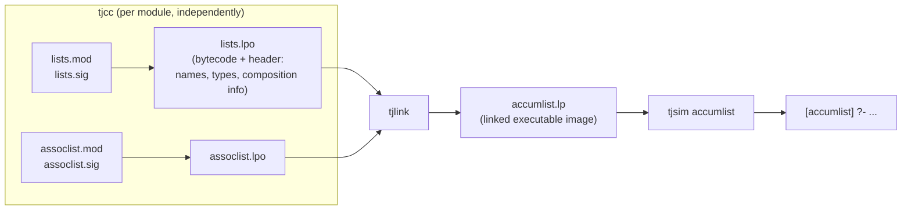

# The Teyjus Implementation

Every logic and every typing rule in this book is, up to this appendix, a piece of paper mathematics — sequents, proof rules, undecidability proofs. That's deliberate: the whole point of the proof-theoretic method is that you can reason about a programming language's meaning without committing to any particular machine. But at some point somebody has to actually run `append` on real bytes, and the moment you do that you're no longer doing proof theory — you're building a compiler and a virtual machine. This appendix is the book's brief, unglamorous, and genuinely important answer to "so what does the *real* $\lambda$Prolog look like?" It describes Teyjus, the reference implementation, and — just as importantly — catalogs the places where a real system has to depart from the idealized logic of Chapters 1–11.

If you've been reading this book with an eye toward eventually writing your own checker/prover toolchain, this is the chapter that is least about theorems and most about the shape of the toolchain you'd actually build: a compiler, a bytecode format, a linker, a runtime with a query loop, and a pile of engineering compromises around unification and I/O. Nothing here is deep theory, but nearly everything here is a decision you will have to make yourself.

## Two components: separate the *what* from the *how*

Teyjus, per §A.1, is built from two pieces:

1. **An emulator** — an abstract/virtual machine with its own instruction set and runtime, which realizes the high-level computations ($\lambda$-term construction, unification, backtracking, backchaining) implicit in a $\lambda$Prolog program.
2. **A compiler** — translates $\lambda$Prolog source into instructions for that abstract machine.

This is the same shape as a JVM/CLR-style pipeline, or as GHC compiling Haskell to STG/bytecode rather than directly to native code: a stable, well-understood intermediate machine absorbs all the "how do I actually implement unification-with-backtracking efficiently" engineering, while the compiler's job shrinks to "translate this static, checkable surface syntax into that machine's instructions." The predecessor for this specific abstract-machine idea is the Warren Abstract Machine (WAM) for Prolog, mentioned back in the Chapter 2 bibliographic notes — Teyjus's abstract machine is, in spirit, a WAM extended to carry types, $\lambda$-terms, and higher-order pattern unification instead of first-order terms.

**[[Hereditary-Harrop-Formulas-and-Modular-Search#What breaks without this|What breaks without this]] separation:** if you tried to interpret $\lambda$Prolog source directly (a tree-walking interpreter over the AST), you'd pay repeated parsing/typechecking/elaboration cost on every re-entry into a predicate, and you'd have no reusable, inspectable intermediate form. The bytecode format is what makes separate compilation (below) and a disassembler even conceivable.

### The five executables

Building Teyjus produces five programs, and their names map cleanly onto a conventional toolchain:

| Teyjus tool | Role | Rust/systems analogue |
|---|---|---|
| `tjcc` | compiler: source module $\to$ bytecode (`.lpo`) | `rustc --emit obj` |
| `tjlink` | linker: bytecode modules $\to$ executable image (`.lp`) | `ld` / `cargo`'s link step |
| `tjsim` | emulator/runtime: loads and runs the linked image, drives the query loop | the produced binary + its runtime (think: a bytecode VM like Python's or the JVM, invoked as `tjsim <image>`) |
| `tjdis` | disassembler: renders bytecode files (linked or not) in human-readable form | `objdump` |
| `tjdepend` | dependency analyzer: computes the signatures/modules a given module needs | a `cargo`/`make` dependency scanner, generating a Makefile |

That table is worth internalizing as a whole, not module by module — it is a complete, small compiler toolchain, and it is a useful sanity check for anyone scoping their own "compiler/verifier for logic-clause specifications" project (this book's stated eventual target): a minimal viable system needs at least a compiler and a runtime; a linker only becomes necessary once you support separate compilation of multiple modules; disassembler and dependency-analyzer are quality-of-life tools you can defer.

## The read-prove-print loop, concretely

Section 2.4 introduced the *read-prove-print loop* abstractly, as an interaction relative to a program and a signature. §A.2 makes it concrete. Running `tjsim` with no arguments drops you into a `[toplevel]` prompt where the "ambient" program and signature are just Teyjus's built-ins:

```
% tjsim
Welcome to Teyjus
...
[toplevel] ?- pi x:int \ (F x) = (x :: 1 :: x :: nil).

The answer substitution:
F = W1\ W1 :: 1 :: W1 :: nil

More solutions (y/n)? y
no (more) solutions
[toplevel] ?-
```

Note the shape of the interaction — it is exactly the "answer substitution, then ask for more" pattern you'd expect from a Prolog-family REPL, but the answer substitution here can bind a variable to an *abstraction* (`W1\ ...`), because $F$ has a function type. That's the higher-order logic showing through even in the most mundane top-level interaction: the thing being solved-for isn't always a first-order value, it can be a $\lambda$-term.

Two categories of rejection are illustrated, and it's worth distinguishing them precisely because they correspond to two different phases of any compiler pipeline you'd build yourself:

- **Parse errors**, e.g. an unmatched parenthesis — caught during parsing, before any typing or unification is attempted.
- **Type errors**, e.g. applying an `int` where a function was expected (`operator is not a function`) — caught during type checking, which in Teyjus is fused with an actual **type inference** pass. Given `pi x:int \ (F x) = (x :: 1 :: x :: nil)`, Teyjus infers `F : int -> list int` without being told; given `pi x \ (F x) = (x :: x :: nil)` with no type annotation on `x` at all, it infers a fully polymorphic type ($x : A$, $F : A \to \mathtt{list}\ A$) using the type-variable machinery from Chapter 1 (§1.2's target/argument types, polymorphic constants).

This inference is explicitly *scoped*: it fills in missing types only for variables bound within a single query or clause, under the assumption (echoing Chapter 1's type assignment calculus) that every occurrence of a bound variable has one consistent type throughout an expression. It is **not** whole-program type inference in the Hindley–Milner sense of inferring principal types for top-level definitions from scratch — every constant used in a query must already be pervasive (built-in) or explicitly declared via a module/signature. Try to use an undeclared constant `g` and you get `undeclared constant 'g'`, full stop; Teyjus will not silently generalize an unknown symbol into a fresh variable the way, say, a very permissive dynamically-typed language might. This is a design choice with a clear rationale for anyone building a verifier: *bounded* local inference (fill holes in a single judgment, given a fixed, already-elaborated global signature) is dramatically easier to make sound and predictable than global inference, and it's the right default unless you have a specific reason to need principal-type inference across a whole program.

There is exactly one restriction on the *logical shape* of top-level goals that doesn't exist for clause bodies: **top-level goals cannot contain embedded implications** (no `:-` or `=>` directly in a query). This is purely an artifact of Teyjus's compilation model — implications inside clause bodies get compiled along with the clause, but the top level currently has no equivalent compilation step for on-the-fly goals. §A.4.2 gives the standard workaround: wrap the implicational goal in a throwaway clause and query that clause instead.

```
?- p a => p b => p X.        % rejected at the top level

test X :- p a => p b => p X. % define instead...
?- test X.                    % ...and query the wrapper
```

**[[Polymorphic-and-Pervasive-Constants#What breaks without this|What breaks without this]] workaround:** nothing conceptually — it's a pure implementation gap, not a semantic one, and it's a good illustration of a recurring theme in real systems: the *idealized* language (Chapters 3 and 5's fohh/hohh with implicational and universal goals) and the *implemented* language can diverge for reasons that have nothing to do with logic and everything to do with which code paths the compiler happens to support.

## Modules, for real: two-stage compile-then-link

Chapter 6 built the modules language as a purely logical construct — modules and signatures translate into E-formulas, and "elaboration" was described abstractly as either compile-time inlining or (§6.6) a separate-compilation, link-time-inlining strategy. §A.3 tells you which one Teyjus actually implements: **link-time inlining**, via a genuine two-stage pipeline.



Why two stages instead of one? Because `tjcc` processes each module **in isolation** — it never sees the source of any module it accumulates, only that module's declared signature (its "external view"). This is exactly separate compilation in the C/Rust sense: `lists.mod` compiles to `lists.lpo` without ever having `assoclist.mod` in view; the reverse is also true, `assoclist.lpo` is produced by checking `assoclist.mod` against `lists.sig` (never `lists.mod`'s actual clauses). Only `tjlink` needs both `.lpo` files simultaneously, to splice the byte-code bodies together into one runnable image (`accumlist.lp`).

Two concrete facts fill in the mechanism:

- **The `.lpo` file's "header" carries composition metadata** beyond constant/type names — information the compiler computed once, so that `tjlink` doesn't have to re-derive it from source. This is the same idea as an object file's symbol table plus relocation info in a conventional linker.
- **`accumulate`** in a module body (e.g. `assoclist` doing `accumulate lists.`) is what forces this two-file dance at all — a module that accumulates nothing could in principle skip straight to a linked `.lp` file, but Teyjus doesn't special-case that; every module goes through `tjcc` then `tjlink` uniformly.

The book's worked example is a `lists` module (`append`, `reverse` via `rev_aux`, `member`) exporting a signature that only surfaces `append`, `reverse`, `member` — `rev_aux` stays internal, exactly the abstract-datatype hiding Chapter 6 built out of existential quantification over program clauses. Concretely: query `rev_aux` from the top level after linking and you get `undeclared constant 'rev_aux'`, even though the clause is right there in the linked image. The signature — not the module body — is what determines the visible surface.

**What breaks without checking the module against its own signature at compile time (not just at use sites):** you'd lose the guarantee that every consumer of `lists` sees a consistent interface; type declarations could silently drift between what `lists.mod` actually defines and what its signature promises, and errors would surface late, at arbitrary call sites in unrelated modules, instead of immediately at `lists`'s own compilation.

### `exportdef` / `useonly`: making sharing contracts explicit

Chapter 6 discussed two broad module-interaction patterns (§6.5): incremental extension of a predicate's definition across accumulating modules, versus one module merely *using* another's fixed predicates without adding to them. Teyjus reifies the second pattern as a compiler-checked contract, via two variants on the ordinary `type` declaration inside a `.sig` file:

- **`exportdef P : ...`** — "I define `P`; any module accumulating me should treat `P`'s definition as fixed — don't add more clauses for it in whatever context you accumulate me into."
- **`useonly P : ...`** — "I consume `P` without adding clauses to it; someone accumulating *me* had better also bring in an actual definition."

```
sig lists.
exportdef append   list A -> list A -> list A -> o.
exportdef reverse  list A -> list A -> o.
exportdef member   A -> list A -> o.
end
```
```
sig assoclist.
...
useonly member   A -> list A -> o.
end
```

This is worth pausing on because it's a small but real piece of the "contracts embedded in a type/module system" idea that generalizes well beyond logic programming — it's the same shape as marking a Rust trait method `final`-like (no further `impl` blocks may extend it) versus declaring a trait bound that says "I require this to already be implemented, I won't provide it." The compiler can check `useonly`/`exportdef` conformance mechanically because separate compilation already forces every module to declare its expectations in a signature file rather than relying on convention. There's also a convenience form, `use_sig` (a variant of `accum_sig`), that accumulates a *whole* signature while automatically converting its `exportdef`s to `useonly`s — sparing you from rewriting every declaration by hand when you just want to consume a library wholesale.

### `tjdepend`: the missing piece for real build systems

Once you have separate compilation, you inevitably need to answer "which modules and signatures does building `X` actually require, transitively, given the `accumulate` graph?" — the same question `cargo`'s dependency resolver or a hand-written Makefile answers for you. `tjdepend` computes exactly this, and the book notes it's meant to feed a generated Makefile that exploits separate compilation (only rebuild what changed). This is unglamorous, but it's the piece that turns "a compiler exists" into "a compiler is usable on a project with more than three files" — a lesson that transfers directly if you're building your own multi-module Rust-based logic-clause checker.

## Built-ins: where the idealized logic meets the real machine

§A.4.1 catalogs what Teyjus provides beyond the pure logic: `int`, `real`, `string` as primitive types; overloaded arithmetic (`+`, `-`, `*`, `div`, `/`, string concatenation `^`); comparison operators `<`, `=<`, `>`, `>=`, also overloaded across `int`/`real`/`string`; `list` with `nil`/`::`; and two stream types, `in_stream`/`out_stream`, with `std_in`/`std_out`/`std_err` plus `open_in`/`open_out`/`close_in`/`close_out`/`input`/`output` for file I/O.

The one subtlety worth internalizing is **intensional treatment of arithmetic**, which directly echoes §2.7's discussion (Chapter 2, "the meaning and use of types") of types classifying rather than evaluating expressions. `"every" ^ "thing"` by itself doesn't concatenate anything — `=` just unifies `X` with the syntactic term `"every" ^ "thing"` unevaluated:

```
[toplevel] ?- X = "every" ^ "thing".
The answer substitution:
X = "every" ^ "thing"
```

Evaluation is a separate, explicit act, forced with the `is` predicate (borrowed straight from Prolog):

```
[toplevel] ?- X is "every" ^ "thing".
The answer substitution:
X = "everything"
```

This is the same distinction a Rust programmer already has ready-made intuition for: `+` on an *AST node* representing an expression (a `BinOp::Add(lhs, rhs)` you'd pattern-match on) versus calling `.eval()` on that node to get a concrete value. Arithmetic terms in $\lambda$Prolog are, by default, inert data — first-class syntax you can unify against, pass around, and pattern-match — and only become "computed" when you explicitly ask via `is`. This design choice matters a great deal if you're building a system where program terms and specification terms share a representation (Hoare-triple-style checking, say): you want your arithmetic expressions to remain unevaluated, inspectable syntax by default, with evaluation as an opt-in judgment — not a language where every `+` eagerly reduces and you lose the ability to reason about the expression itself.

Metalogical predicates round things out: `=` (unification), `!` (cut, imported wholesale from Prolog), `fail`, `halt`, and `not` — with an explicit warning that `not` (negation-as-failure, discussed operationally back in §5.7) is riskier here than in ordinary Prolog specifically because $\lambda$Prolog goals can themselves be implications, and negation-as-failure's soundness story gets shakier once the thing you're negating can carry hypothetical assumptions.

**What's conspicuously absent:** `assert`/`retract`. Prolog programmers use these for mutable, "stateful" program augmentation at runtime. Teyjus deliberately omits them; the book notes their scoping effect can be *partially* approximated with implicational goals (recall §3.2's AUGMENT rule — an implicational goal really does grow the program, but only for the duration of solving that goal, then it's gone — a strictly disciplined, stack-like notion of "mutation" rather than global, persistent `assert`). For anything resembling durable state, the fallback is genuinely primitive: write to a file, read it back later. This is a deliberate purity constraint, not an oversight — and it's a good design question to sit with if you're building your own logic-clause verifier: do you want an `assert`-like escape hatch that breaks the clean proof-theoretic story, or do you accept only the disciplined, provably-scoped form of "state" that implicational goals already give you for free?

## The two deviations that actually bite

§A.4.2 is short but important, because it's the appendix explicitly flagging where the *book's own earlier examples* won't run as-written:

1. **No implications in top-level goals** (already covered above) — a purely engineering gap, worked around with a wrapper clause.
2. **Partial, not full, higher-order unification.** Teyjus implements the *pattern* fragment — $L_\lambda$, from §7.8/Chapter 8 — rather than full Huet-style pre-unification with imitation/projection branching. Concretely: **examples in §5.9** (the chapter's own cautionary tales about higher-order unification producing spurious or redundant solutions) rely on the *extended*, non-pattern behavior of full higher-order unification, and "will not display the kind of behavior presented there if run using the Teyjus system."

This second point is the single most consequential engineering fact in the whole appendix, and it connects directly to this book's own emphasis on pattern unification as the tractable fragment worth building a real system around (Chapter 8, §8.3). Teyjus's designers made a considered bet: full higher-order unification is undecidable, admits no most general unifiers, and can branch unboundedly (Huet's imitation/projection search) — so a *practical* implementation restricts to the $L_\lambda$/pattern subset, where unification is decidable, unitary (a genuine most general unifier exists), and has an essentially first-order-shaped algorithm (§8.3's "variable elimination generalized to the pattern case"). The price is that the full, non-pattern generality discussed abstractly in Chapter 8 for its own sake — and used illustratively in §5.9 — is simply not what runs when you type the query into `tjsim`.

If you're modeling your own elaborator's metavariable-unification engine on Miller's pattern unification (as this project's second stated target does), Teyjus's actual behavior *is* the reference implementation of that engineering trade-off — this is effectively what Lean's `isDefEq`/elaborator does too: full higher-order unification is never attempted as a general search procedure; a decidable pattern fragment carries the load, and anything falling outside it either gets delayed (as a suspended unification constraint) or rejected, rather than triggering an expensive general search. Teyjus committing to the pattern fragment at the systems level, rather than the idealized full theory, is exactly the kind of choice you'll be forced to make yourself.

## Where this leads

The Appendix closes the book's arc from theory to practice: Chapters 1–5 build the idealized logic, Chapter 6 gives it a module system, Chapters 7–11 show what you can compute over $\lambda$-terms once you have that logic — and this appendix is the reality check, showing exactly which idealizations survive contact with an actual compiler-plus-virtual-machine implementation and which get quietly restricted (implications in top-level goals, full versus pattern higher-order unification) for tractability. For the standing goals of this reading project, the two load-bearing takeaways are: (1) the `tjcc`/`tjlink`/`tjsim` separation is a template worth mirroring directly in a Rust-based verifier — compile each specification module independently against declared signatures, link at the end, keep a disassembler-equivalent for debugging; and (2) Teyjus's commitment to pattern unification over full higher-order unification is the empirical confirmation, from a real fielded system, that the $L_\lambda$ fragment discussed abstractly in Chapter 8 is not just theoretically nice but the actual mechanism a from-scratch elaborator or unifier should be built around.

---
[[book-guidelines|↩ Back to guidelines]]
