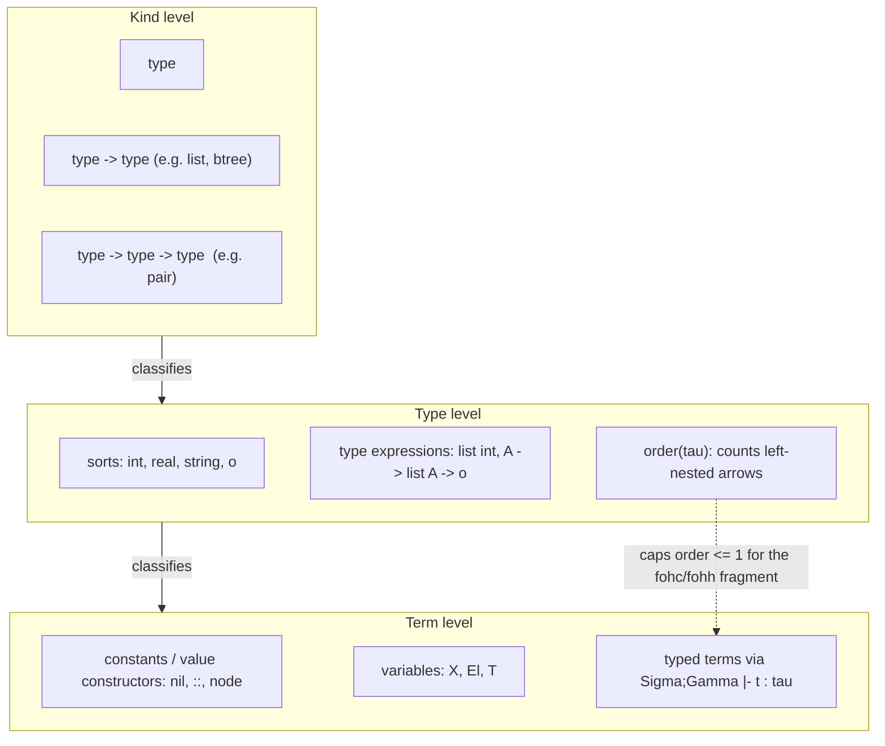

# Typed First-Order Terms and Type Structure

[[book-guidelines|↩ Back to guidelines]]

## Why bother typing Prolog terms at all?

Untyped Prolog gets a lot of mileage out of one idea: a term is either a variable, an atom, or a compound `functor(arg1, ..., argN)`, and unification decides everything else. That simplicity is also its biggest liability. Nothing stops you from writing `node(3, "cat", 4)` where you meant a tree of integers, and nothing in the term itself tells a reader — or a compiler — what shape of data a predicate expects. Bugs that a compiler would catch instantly in Rust or Lean surface at runtime, if at all, deep inside a failed unification.

Miller and Nadathur's response, which sets up everything else in the book, is to layer a type system directly on top of first-order terms *before* any discussion of unification, Horn clauses, or proof search. This isn't a stylistic nicety. The type system is going to do real, load-bearing work later: it will make substitutions land in well-typed places (Chapter 2, "the operational role of types beyond static well-formedness"), and — as we'll see at the end of this article — its restriction to *first-order* types is precisely what changes once the book moves to $\lambda$-terms in Chapter 4, where "order" is allowed to climb without bound.

The chapter's structure mirrors how you'd actually build such a system: first you need *types of types* (kinds), then *type expressions* built from those, then *terms* classified by types via a small deductive system, and finally an account of how those terms are used to represent real data — lists, trees, formulas, even imperative programs.

---

## 1. Sorts, type constructors, and kinds

### The intuition

Before you can classify terms, you need a vocabulary of types. $\lambda$Prolog starts with **sorts** — atomic, unanalyzable types like `int`, `real`, `string`, and, crucially, `o` (the type of formulas, whose full significance the book postpones to Chapter 2). Sorts alone aren't enough, though: you also want *type-level functions* like `list`, which take a type and produce a new type. The book calls these **type constructors**.

This immediately raises a question anyone who has used Rust or Haskell will recognize: if `list` takes a type and returns a type, what is *its* type? The answer is a second, higher level of classification — a "type of types" — which the book calls a **kind**:

$$
\mathit{kind\_exp} ::= \mathtt{type} \mid \mathtt{type} \to \mathit{kind\_exp}
$$

A sort like `int` has kind `type`. A unary constructor like `list` has kind `type -> type`. A binary constructor like `pair` has kind `type -> type -> type`. New constructors are introduced with **kind declarations**:

```
kind  pair   type -> type -> type.
```

after which `(pair string int)` is a legal type expression, denoting pairs of strings and integers.

### What breaks without this

Without a separate kind level, you'd have no principled way to reject nonsense like applying `list` to itself as an argument the wrong number of times, or writing `list` where a *type* (rather than a type-constructor) is expected — `list` is not itself a type, it needs to be *fed* a type first. Kinds are exactly the mechanism that keeps "things that classify terms" (types) and "things that classify type-formers" (kinds) from collapsing into one untyped soup. It's the same discipline that stops `Vec` (without a parameter) from type-checking as a concrete type in Rust.

### Grounding: Lean's kind level

Because this is genuinely type-theoretic machinery — a classification stratified one level above the objects being classified — Lean's own universe structure is the most literal translation. In Lean, `Type` itself has type `Type 1`, and a type-constructor like `List` has type `Type → Type`:

```lean
-- List : Type → Type is a kind-1 declaration, exactly like
-- kind list  type -> type.
#check (List : Type → Type)

-- pair : Type → Type → Type
def Pair (α β : Type) : Type := α × β
#check (Pair : Type → Type → Type)
```

$\lambda$Prolog's `kind_exp` grammar is a *deliberately* impoverished fragment of what Lean's universe hierarchy supports: there is no polymorphism over kinds, no dependent kinds, and — as the book notes explicitly — no attempt to let kind, type, and term levels blur into one indexed hierarchy (the direction Lean and dependently typed languages like LF/Twelf do take, and which the book's bibliographic notes flag as the road not taken here). $\lambda$Prolog stops at exactly two strata: kinds classify types, types classify terms, full stop.

Rust doesn't have first-class kinds in the same sense (no genuine higher-kinded polymorphism without workarounds), so for *this* particular piece — the kind level itself — Lean is the more faithful grounding, per the "promote Lean when the material is type-theoretic" rule. Rust becomes the sharper tool once we get to actual data representation, below.

---

## 2. Type expressions: target types, argument types, and order

### Building types

With sorts, type constructors, and kinds in hand, the full grammar of **type expressions** is:

$$
\mathit{type\_exp} ::= \mathit{type\_variable} \mid (\mathit{type\_exp} \to \mathit{type\_exp}) \mid (\mathit{tyc}\ \mathit{type\_exp} \ldots \mathit{type\_exp})
$$

Type variables (written uppercase, e.g. `A`, `B`) are what makes this **polymorphic** — the same declaration can stand for many concrete types. `->` is right-associative, so `a -> b -> c` means `a -> (b -> c)`, and constructor application binds tighter than `->`, so `list A -> B` means `(list A) -> B`.

Any type $\tau$ can be written in the canonical right-associative form

$$
\tau_1 \to \cdots \to \tau_n \to \tau_0 \qquad (n \ge 0)
$$

where $\tau_0$ has no top-level `->`. The book calls $\tau_0$ the **target type** and $\tau_1, \ldots, \tau_n$ the **argument types**. A type with $n \ge 1$ is **functional**; otherwise it's **nonfunctional**; a nonfunctional type that isn't a variable is **primitive**.

### The order of a type

This is the one piece of genuinely new vocabulary in this section, and it matters far more than its two-line definition suggests:

$$
\mathrm{ord}(\tau) = 0 \quad \text{if } \tau \text{ is nonfunctional}
$$
$$
\mathrm{ord}(\tau_1 \to \tau_2) = \max(\mathrm{ord}(\tau_1) + 1,\ \mathrm{ord}(\tau_2))
$$

Order counts how deeply the function arrow nests to the *left* — i.e., how "function-taking-functions" a type is. `int`, `A`, `list (int -> int)` are all order 0 (the interior of a constructor argument doesn't count against the constructor's own order — only nesting on the left of a top-level `->` does). `int -> int` and `string -> list (pair string int) -> o` are order 1: they're functions, but none of their argument types is itself a function. `(string -> string) -> string` is order 2: it's a function whose *own argument* is already a function.

**[[Hereditary-Harrop-Formulas-and-Modular-Search#What breaks without this|What breaks without this]] concept**: the first-order fragment of $\lambda$Prolog that this whole chapter builds is defined *exactly* by capping order at 1 — types in the signature $\Sigma$ must have order at most 1, types in the term context $\Gamma$ must have order 0, and neither may mention `o`. Without a precise notion of order, "first-order" would be an informal slogan; with it, it's a checkable syntactic constraint. This constraint is also the seed of the book's biggest structural pivot: Chapter 4 lifts this same order function to *unrestricted* $\lambda$-terms, where order can grow without bound, and that's precisely what makes higher-order unification (the L$_\lambda$/pattern fragment you'll meet later) a genuinely harder problem than the first-order unification this chapter is heading toward.

There's a subtlety worth internalizing now because it resurfaces later: **order is not preserved under substitution for type variables**. `A -> list A -> o` has order 1, but substituting an order-1 type for `A` produces an order-2 type. First-order $\lambda$Prolog sidesteps this by only ever substituting order-0 types for type variables — a restriction that keeps the "first-order" promise intact across instantiation.

### Grounding: Lean and the shape of currying

Lean's own type-checker computes something structurally identical when it decides whether an application is "saturated" or how many arguments a function still expects — order is a purely syntactic measure of how curried a type is:

```lean
-- order 0
#check (Nat : Type)
-- order 1: a function, but its argument isn't itself a function
#check (fun n : Nat => n + 1 : Nat → Nat)
-- order 2: takes a function as an argument
#check (fun (f : Nat → Nat) => f 0 : (Nat → Nat) → Nat)
```

The order-2 case — a function accepting a function — is exactly the shape that first-order $\lambda$Prolog forbids in its constant declarations. This is the syntactic fingerprint of "higher-order" long before you get anywhere near quantifiers or predicate variables.

---

## 3. Typed first-order terms and the type assignment calculus

### From types to terms

Constants (including what traditional Prolog calls "function symbols" — here unified under one notion since $\lambda$Prolog doesn't distinguish functional from nonfunctional constants) are introduced with **type declarations**:

```
type  pr   A -> B -> pair A B.
```

Constants with type variables are **polymorphic**: `nil : list A` genuinely has *every* instance type `list int`, `list (list int)`, etc. simultaneously — not one fixed type chosen once and for all. Different *occurrences* of the same constant in one term may pick different, even incompatible, instantiations; it's precisely this freedom that makes `(1 :: nil) :: nil` well-typed (the two `nil`s have different types: `list int` and `list (list int)`).

Term formation is just application: given $t_1$ of type $\alpha \to \beta$ and $t_2$ of type $\alpha$, $(t_1\ t_2)$ has type $\beta$. The book packages this into a **type assignment calculus** — a small deductive system deriving judgments of the shape

$$
\Sigma; \Gamma \vdash t : \tau
$$

read as "$t$ has type $\tau$ with respect to signature $\Sigma$ (typed constants) and context $\Gamma$ (typed variables)":

$$
\frac{c : \sigma \in \Sigma \quad \tau \sqsubseteq_f \sigma}{\Sigma;\Gamma \vdash c : \tau}
\qquad
\frac{x : \tau \in \Gamma}{\Sigma;\Gamma \vdash x : \tau}
\qquad
\frac{\Sigma;\Gamma \vdash g : \tau_1 \to \tau_2 \quad \Sigma;\Gamma \vdash t : \tau_1}{\Sigma;\Gamma \vdash (g\ t) : \tau_2}
$$

The relation $\tau \sqsubseteq_f \sigma$ in the constant rule says $\tau$ is obtained from the declared type $\sigma$ by substituting order-0, non-`o` types for $\sigma$'s type variables — this is exactly the mechanism that lets one declaration of `nil` justify many differently-typed occurrences. The book proves this substitution ordering is reflexive, transitive, and antisymmetric (up to renaming) — i.e. well-behaved enough to talk about a **most general typing**: given a term, there is (up to renaming of type variables) a *most general* assignment of types to its free variables and to the term itself, from which every other valid typing is obtained by further instantiation.

A well-typed term always has a **canonical form**: it's a variable, a constant, or an application $(f\ t_1 \cdots t_n)$ where $f$ is a constant — the **head** — applied to argument terms $t_1, \ldots, t_n$ (with $n = 0$ covering the constant case).

### What breaks without this

Without the $\sqsubseteq_f$ instance relation restricted to order-0 substitutions, "most general typing" wouldn't exist as a clean, computable notion — you'd either lose polymorphism entirely (forcing one fixed type per constant, `int`-`nil` and `string`-`nil` becoming unrelated symbols) or you'd let type variables be instantiated by arbitrarily high-order types, which is exactly the extra expressive power the book is *not* ready to hand you in Chapter 1 — that power (and its cost) is deferred to Chapter 4's higher-order type assignment calculus, which is the unrestricted version of precisely this same three-rule system.

### Grounding: this is Lean's elaborator, doing exactly this

This is the single most direct point of contact with the book's learning-goal thread on judgment forms as the shared ancestor of type checkers and proof checkers. The rule for constants is *literally* what Lean's `isDefEq`/unifier does every time it elaborates an occurrence of a polymorphic constant:

```lean
-- List.nil : {α : Type} → List α  is declared once...
#check (List.nil : List Nat)     -- α ↦ Nat
#check (List.nil : List String)  -- α ↦ String
```

Each occurrence of `List.nil` gets its own instantiation of the implicit `α`, found by unifying the expected type against the declared (polymorphic) type — precisely the role $\tau \sqsubseteq_f \sigma$ plays here, just without Lean's universe polymorphism or dependent types layered on top. If you're building the elaborator described in the standing project — one that resolves implicit arguments via metavariable unification — this three-rule calculus *is* the toy version of the core loop you're eventually scaling up: look up a constant's declared (possibly polymorphic) type, generate fresh metavariables for its type parameters, and let unification (Topic 3 in this book) pin them down from context.

The application rule, meanwhile, is the one every toy type checker in Rust ends up writing almost verbatim:

```rust
enum Type {
    Sort(String),                 // primitive/sort type, e.g. "int"
    Var(String),                  // type variable
    Arrow(Box<Type>, Box<Type>),  // tau1 -> tau2
}

fn infer_app(g_ty: &Type, t_ty: &Type) -> Result<Type, String> {
    match g_ty {
        Type::Arrow(arg, ret) if **arg == *t_ty => Ok((**ret).clone()),
        Type::Arrow(_, _) => Err("argument type mismatch".into()),
        _ => Err("head is not a function type".into()),
    }
}
```

This is the direct Rust shape of the third inference rule above — and it's the seed of exactly the kind of Hoare-triple/contract checker the standing project targets: a term-level type checker built from three inference rules, one of which is "look up," one "context lookup," one "function application," is the smallest nontrivial instance of the judgment-form pattern that recurs at every later, richer layer (natural deduction proof objects in Chapter 9 use the identical shape, just with formulas instead of types).

---

## 4. Parametric versus nonparametric polymorphism

The book makes a distinction here that's easy to skim past but has real teeth. Compare two declarations for binary trees. First, the "honest" one:

```
kind  btree   type -> type.
type  empty   btree A.
type  node    A -> btree A -> btree A -> btree A.
```

Here the type variable `A` in each constructor's argument types *also* appears in its target type. This is **parametric polymorphism**: the tree's type genuinely encodes the type of its elements, so `(node 3 (node "cat" empty empty) (node 4 empty empty))` is rejected outright — a compile-time guarantee that every element in a given tree has the same type.

Now the "dishonest" alternative:

```
kind  btree   type.
type  empty   btree.
type  node    A -> btree -> btree -> btree.
```

`A` appears in `node`'s argument type but *not* in its target type `btree`. This is legal in $\lambda$Prolog — the type system doesn't force parametricity — and it's called **nonparametric polymorphism**. The resulting `btree` type says nothing about what's stored inside; you've thrown away exactly the invariant the first version bought you for free.

### What breaks without the parametric discipline

Nonparametric polymorphism isn't wrong, but it silently discards static guarantees: any property that depended on "all elements share a type" now has to be re-established at runtime or not at all. The book is explicit that this is a genuine design choice available to the $\lambda$Prolog programmer, unlike, say, ML/Haskell datatype declarations, which *force* parametricity by construction (a variable in a constructor's argument type is required to occur in the datatype's own parameters).

### Grounding: Rust makes this a visible fork in the road

This maps almost one-to-one onto a decision every Rust programmer with generics has made, usually without naming it:

```rust
// Parametric — mirrors the "honest" btree declaration.
// The compiler enforces that every element has type T.
enum BTree<T> {
    Empty,
    Node(T, Box<BTree<T>>, Box<BTree<T>>),
}

// Nonparametric — mirrors the "dishonest" declaration.
// Type information about the payload is erased at the BTree level.
enum BTreeAny {
    Empty,
    Node(Box<dyn std::any::Any>, Box<BTreeAny>, Box<BTreeAny>),
}
```

`BTree<T>` is what Rust's type system pushes you toward by default; `BTreeAny` requires deliberately reaching for `dyn Any` (or an enum of concrete types) to *opt out* of parametricity. $\lambda$Prolog simply doesn't have Rust's default nudge — both forms are equally first-class, and the chapter's point is that the choice, and its cost, is yours to make explicitly.

One more difference worth flagging for the standing project: $\lambda$Prolog lets you declare new value constructors *incrementally*, across separate `type` declarations, unlike ML's single monolithic `datatype` declaration (or Rust's single `enum` block) that fixes the whole constructor set up front. This open-constructor-set property is what makes the modular encoding of extensible logics in Chapter 6 possible — a design point this chapter flags but doesn't yet cash out.

---

## 5. Representing symbolic objects: where the type system meets its limits

Section 1.4 puts the machinery to work on three examples — lists/trees (already covered above), logical formulas, and imperative programs — and it's the formula case that matters most for where the book is headed.

### Encoding formulas: the binding problem

To represent an untyped first-order logic's formulas as $\lambda$Prolog terms, you first need to represent its own variables. The book rejects using $\lambda$Prolog's *own* variables for this (their scoping would be entirely dictated by the metalanguage, with no way to control it explicitly) and instead introduces a constructor:

```
type  var   string -> term.
```

so that the object-language term $f(a, f(x,b))$ becomes `(f a (f (var "x") b))`. This works fine for variable-free structure. It breaks down the moment you need quantifiers. Encoding $\forall x\, (p(a,x) \land q(x))$ via

```
type  all   term -> form -> form.
```

as `(all (var "x") ((p a (var "x")) && (q (var "x"))))` reproduces the formula's *tree shape* faithfully but captures nothing about the *binding relationship* between the quantifier and the occurrences of `x` inside it — that connection lives only in the programmer's head, or in ad hoc string-matching code the programmer has to write by hand for every computation that needs to respect it.

### Why this is the chapter's most important "what breaks" moment

This is explicitly flagged by the book as **a fundamental limitation of first-order approaches to representing syntax with binding** — not a bug to patch locally, but a structural ceiling on what first-order terms can express. Every later payoff in the book's fourth part (encoding proof systems, functional programs, the $\pi$-calculus, all in Chapters 7–11) depends on lifting representations out of this first-order encoding and into $\lambda$-tree syntax, where object-level binders are represented by *actual* meta-level $\lambda$-abstractions, so that object-level substitution reduces to meta-level $\beta$-conversion — a mechanism this chapter deliberately does not yet have available.

This is exactly the substitution/variable-capture thread the standing project needs to track closely: everything this section does by hand (naming variables as strings, hoping side conditions about freshness are respected) is precisely the plumbing that a real Hoare-triple checker or elaborator cannot leave informal — and it's precisely what Chapter 7's $\lambda$-tree syntax formalizes correctly. Treat this section less as "a worked example" and more as a controlled demonstration of the failure mode that motivates half the rest of the book.

### Type-neutral representations

The imperative-program example makes a smaller but practical point in the same spirit: object-language *value* types (int vs. bool) are deliberately **not** baked into the metalanguage encoding. Identifiers, for instance, are given one uniform type `expr` regardless of what they'll eventually hold, because properties like "can appear on the left of an assignment" don't depend on the object language's own type system — that gets checked later, by a separate logic program (Chapter 2), rather than being enforced by the encoding itself. This is the same "keep the representation permissive, push validity checks into separate judgments" discipline that a bidirectional type checker uses when it defers checking to a distinct pass rather than trying to make the syntax itself unrepresentable-if-wrong.

---

## The stratification, end to end



Three strata, one classifying relation applied twice: kinds classify types, types classify terms. Nothing here is dependent — kinds never mention terms, types never depend on term-level values — which is exactly what keeps this fragment "first-order" and computationally tame. The moment you let types depend on terms (dependent types) or let the classifying relation recurse into itself unboundedly (higher kinds, universe towers), you've left this chapter's world and entered something closer to Lean's own kernel.

## Where this leads

This chapter is quietly doing two jobs at once: giving you a working type system for first-order data (immediately useful, self-contained), and giving you a controlled, minimal setting in which to notice exactly where first-order representation runs out of expressive power (the `all`/`var` binding problem). Both threads get picked up directly:

- **Unification** (Topic 3, Section 1.5 of this same chapter) is the next thing the book builds on top of these typed terms — the type assignment calculus here is what makes unification substitutions type-*preserving* rather than merely syntactic pattern matching.
- **The order restriction** ($\mathrm{ord}(\tau) \le 1$ in $\Sigma$) is lifted in Chapter 4, where the same three-rule type assignment calculus is generalized to unrestricted $\lambda$-terms — the jump from "first-order" to "higher-order" in this book is, structurally, exactly the jump from capping order to not capping it.
- **The binding problem** flagged in Section 1.4.2 is the motivating failure this book spends its entire fourth part (Chapters 7–11) fixing, via $\lambda$-tree syntax — well worth remembering as the reason that material exists at all.
- For the standing elaborator project: the constant-typing rule with its $\sqsubseteq_f$ instance relation is a first, uncomplicated look at the exact problem bidirectional metavariable-driven elaboration solves in general — pin down instantiations for a polymorphic declaration's type variables from context. Everything harder later (higher-order unification, patterns) is this same problem under weaker syntactic guarantees.
