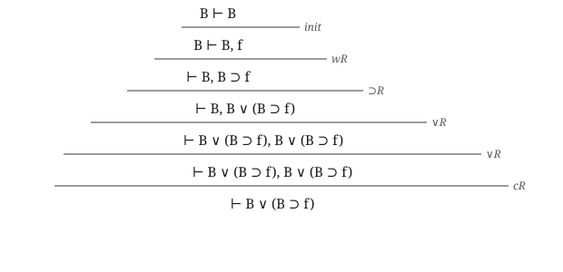
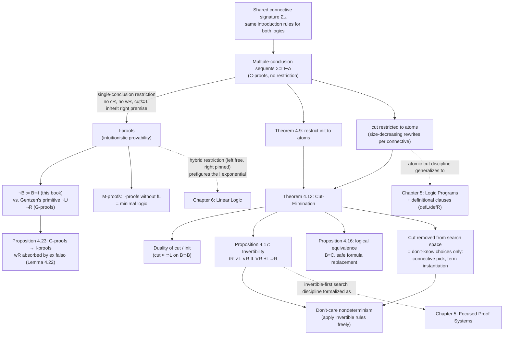

# Classical and Intuitionistic Logic

[[book-guidelines|↩ Back to guidelines]]

## Why this distinction needs a proof-theoretic (not just semantic) account

You already have an intuition for classical vs. intuitionistic logic if you've touched Lean, Coq, or Agda: classical logic lets you assume `p ∨ ¬p` for free, intuitionistic logic makes you *earn* it. The usual story is semantic — intuitionistic truth is "constructive evidence," classical truth is "true in some Platonic sense regardless of whether you can exhibit a witness" — or you reach for Kripke models, where intuitionistic implication is truth-persistent across a tree of "possible worlds."

Miller's chapter takes a third route, due to Gentzen, and it's the one that matters for building actual proof-search systems: characterize the difference **structurally**, as a restriction on the shape of sequents a proof system is allowed to use. This is the route that generalizes — Miller flags explicitly that this characterization is what motivates [[Linear-Logic|linear logic]] two chapters later, and it's the version you actually need if you're implementing a prover rather than philosophizing about one.

The core move: both logics get *the same* introduction rules for *the same* connectives. What differs is a single structural constraint on the right-hand side of a sequent. That's it. Everything else in this chapter — cut-elimination, invertibility, admissibility, negation, the taxonomy of nondeterminism in proof search — is downstream of that one restriction.

## Setting up: sequents over a shared signature

Both logics share the connective signature $\Sigma_{-1}$:

$$\{f:o,\ t:o,\ \wedge:o\to o\to o,\ \vee:o\to o\to o,\ \supset:o\to o\to o\}\ \cup\ \{\forall_\tau,\exists_\tau : (\tau\to o)\to o \mid \tau\in S\setminus\{o\}\}$$

In words: $f$ (false) and $t$ (true) are nullary connectives (propositional constants), $\wedge,\vee,\supset$ are the usual binary connectives, and $\forall_\tau,\exists_\tau$ are quantifiers indexed by every non-propositional type $\tau$ in the fixed set of primitive types $S$. If $S = \{o\}$ there are no quantifiers at all and you get pure propositional logic — everything in this chapter specializes cleanly to that case if you want to think about it without the first-order overhead.

A sequent has the shape $\Sigma :: \Gamma \vdash \Delta$: read "under signature $\Sigma$ (the eigenvariables and non-logical constants in scope), the multiset of formulas $\Gamma$ (assumptions, left-hand side) entails the multiset of formulas $\Delta$ (goals, right-hand side)." Both $\Gamma$ and $\Delta$ are **multisets**, not sets or lists — order doesn't matter, but multiplicity does (this is exactly why contraction and weakening exist as separate structural rules later; if $\Gamma,\Delta$ were literal sets, contraction would be a non-event).

The three rule families are:

- **Introduction rules** (Figure 4.1): the familiar left/right rules for $\wedge,\vee,\supset,\forall,\exists$, plus a zero-premise $\mathsf{tR}$ (introduce $t$ on the right, no left rule needed — $t$ is the identity/unit for $\wedge$, so it's the "0-ary conjunction") and a zero-premise $\mathsf{fL}$ (dually, $f$ is the unit for $\vee$). Of the two-premise rules, $\supset\!L$ and $\mathsf{cut}$ are *multiplicative* (each premise keeps its own separate context, which get unioned at the conclusion), while $\wedge R$ and $\vee L$ are *additive* (both premises share the same context).
- **Identity rules** (Figure 4.2): $\mathsf{init}$ ($\Sigma::B\vdash B$) and $\mathsf{cut}$.
- **Structural rules** (Figure 4.3): weakening ($\mathsf{wL}, \mathsf{wR}$) and contraction ($\mathsf{cL}, \mathsf{cR}$) — the rules that let you add or duplicate a formula in a context without touching its logical content.

## C-proofs and I-proofs: the single restriction that does all the work

**A C-proof** is any proof built from Figures 4.1–4.3 — no restriction. This defines classical provability.

**An I-proof** is a C-proof in which *every sequent in the proof has exactly one formula on the right-hand side.* A proof system enforcing this everywhere is a **single-conclusion proof system**; without the restriction, it's a **multiple-conclusion proof system**. This defines intuitionistic provability.

Notation: $\Sigma::\Delta \vdash_C \Gamma$ means the sequent has a C-proof; $\Sigma::\Delta\vdash_I B$ means it has an I-proof (necessarily to a single formula $B$, since that's the only shape I-proofs can conclude).

That's the entire definitional gap between classical and intuitionistic logic in this book: **not** different connectives, **not** different axioms, **just** — can your proof ever have more than one formula on the right of a turnstile?

**Consequence you can derive immediately:** since I-proofs are single-conclusion throughout, they can never use $\mathsf{cR}$ or $\mathsf{wR}$ (both would produce or preserve a right-hand side of size $\ne 1$). And every use of $\supset\!L$ or $\mathsf{cut}$ must send the *right* premise's conclusion formula straight through to the end-sequent's single conclusion — never the left premise's, because the left premise's conclusion-side formula ($B$ in $\supset\!L$, the cut formula in $\mathsf{cut}$) has to disappear, and in a single-conclusion system there's no room for it to survive alongside anything else:

$$\dfrac{\Sigma::\Gamma_1\vdash B \qquad \Sigma::C,\Gamma_2\vdash E}{\Sigma::B\supset C,\Gamma_1,\Gamma_2\vdash E}\ {\supset}L \qquad\qquad \dfrac{\Sigma::\Gamma_1\vdash B \qquad \Sigma::B,\Gamma_2\vdash E}{\Sigma::\Gamma_1,\Gamma_2\vdash E}\ \mathsf{cut}$$

This gives **Proposition 4.2**, an internal (proof-theoretic, not semantic) characterization: a C-proof $\Xi$ of $\Sigma::\Gamma\vdash B$ is an I-proof iff (a) it contains no $\mathsf{cR}$ or $\mathsf{wR}$, and (b) every $\supset\!L$/$\mathsf{cut}$ in it has its conclusion's right-hand side inherited from the right premise. You can check "is this an I-proof?" by local inspection of each rule instance — you never need semantic machinery.

**Why this particular restriction, and not some other-looking one, is the "right" one to prefigure linear logic:** Miller points out the restriction is *hybrid* — the left context still allows full structural freedom (weakening and contraction), only the right side is pinned down. That asymmetry is exactly the shape that linear logic's `!` (the "of course" exponential) will later formalize precisely: intuitionistic implication is quietly hiding a use of unrestricted structural behavior on the left that classical logic doesn't need to justify specially. You don't need to understand `!` yet — just notice that the asymmetry, not a blanket restriction, is the load-bearing idea, and it survives into Chapter 6 essentially unchanged.

### Grounding: this is precisely Lean's `Classical.em` boundary

If you've written Lean, you've lived this restriction without necessarily naming it. Lean's core type theory (dependent, definitional-equality-based) is intuitionistic by construction — a proof of `P ∨ Q` is a runtime-inspectable tag saying which disjunct holds, plus a proof of that disjunct. There is no primitive rule that hands you `p ∨ ¬p` for an arbitrary undecidable `p`, because that would require producing *evidence* for one side without knowing which. `Classical.em : ∀ p, p ∨ ¬p` exists in Lean's library specifically as an *axiom* — a deliberately non-constructive escape hatch, proved consistent relative to the type theory but not derivable inside it. Reaching for `Classical.em` (or `Classical.byContradiction`, or `Decidable.em` when a `Decidable` instance genuinely computes it) is, proof-theoretically, exactly the move of "I no longer insist on a single-conclusion proof" — you are stepping from I-proof territory into C-proof territory, on purpose, formula by formula.

```lean
-- Constructive: you must produce actual evidence.
example (p : Prop) (h : p) : p ∨ (p → q) := Or.inl h

-- Classical: no evidence required, just excluded middle applied
-- to a proposition you never decide.
example (p q : Prop) : p ∨ (p → q) :=
  Classical.byCases (fun h : p => Or.inl h) (fun h : ¬p => Or.inr (fun hp => absurd hp h))
```

This second proof is a C-proof with no I-proof counterpart in general — which is exactly the book's headline example below.

**What breaks if you don't enforce the single-conclusion restriction uniformly:** you lose the entire distinction. If you let I-proofs use $\mathsf{cR}$ "just this once" you've silently smuggled in a proof of $B\vee\neg B$-shaped things through the back door (multiple formulas on the right is exactly what lets you keep two alternatives alive simultaneously and contract them together later, as the excluded-middle proof below shows). A theorem prover that claims to check constructive proofs but has one leaky code path that permits multi-conclusion sequents is not actually constructive — it's classical logic wearing a costume. This is a real implementation hazard, not a pedantic point.

### The headline example: $B \vee (B \supset f)$ has a C-proof but not (in general) an I-proof


Recall $\neg B$ is *defined* here as $B\supset f$ (Miller flags explicitly: Gentzen treated negation as primitive with its own rules; this book treats it as notation — more on that in the negation section below). Here is the book's C-proof of the excluded middle $B \vee \neg B$, i.e. $B \vee (B\supset f)$:



Read bottom-up as a search, or top-down as a construction: start from the trivial $B\vdash B$, weaken in an $f$ on the right (harmless — $\mathsf{wR}$ just adds junk to the goal multiset), package $B\vdash B,f$ into $\vdash B, B\supset f$ via $\supset\!R$, inject each disjunct via two separate $\vee R$ steps (note: this is exactly *why* you needed two formulas alive on the right simultaneously — one becomes $B$, the other becomes $B \vee (B\supset f)$), and finally **contract** ($\mathsf{cR}$) the two identical right-hand formulas into one.

That $\mathsf{cR}$ at the very end is the tell. It is a right-contraction — exactly the rule I-proofs are forbidden to use. There is no way to route around it for this formula in general, which is why $B\vee(B\supset f)$ — and its instance $p\vee(p\supset q)$ from Exercise 4.3 — is C-provable but has **no I-proof**. Consequently:

$$p\vee(p\supset q) \text{ is C-provable, not I-provable} \implies \text{I-proofs are not complete for C-proofs, and C-proofs are not sound for I-proofs.}$$

This single formula is the cleanest possible witness of the entire classical/intuitionistic gap — worth internalizing over any amount of Kripke-model hand-waving.

### Soundness and completeness, made precise

C-proofs and I-proofs serve as *the* reference standard against which other proof systems get measured. For a proof system $Y$:

- $Y$ is **sound** for classical logic if every $Y$-provable $\Gamma\vdash B$ also has a C-proof.
- $Y$ is **complete** for classical logic if every C-provable $\Gamma\vdash B$ also has a $Y$-proof.
- Same definitions with "I-proof" substituted for intuitionistic soundness/completeness.

Gentzen's cut-elimination theorem (Theorem 4.13, below) can itself be read as a completeness statement: it says the cut-free fragment of the C-proof rules is *complete* for full C-proofs — dropping cut loses no provable sequents.

### A signature subtlety: empty types break the "obvious" quantifier equivalences

One place this book's formalization is stricter than the textbook-standard one: eigenvariable signatures are made *explicit*, and substitution terms in $\forall L/\exists R$ must be built from the current signature $\Sigma$. Take $S=\{i,o\}$, $\Sigma_0=\{p:i\to o\}$. The sequent

$$\cdot :: \forall_i x\,(p\,x) \vdash \exists_i x\,(p\,x)$$

has **no proof** here, even though it's classically-and-intuitionistically valid in the usual textbook presentation — because there are no closed $\Sigma_0$-terms of type $i$ to instantiate $\exists$ with (type $i$ is empty in this signature). The fix is a side condition: $\Sigma$ **inhabits** $S$ if every non-$o$ type in $S$ has some $\Sigma$-term. When it does, this book's notion of provability coincides with the traditional one. This is a genuinely useful thing to remember if you're implementing a first-order prover: don't assume every sort is nonempty, or you'll accept unsound instantiations (or, as here, reject sound-looking sequents that are actually vacuous).

## Cutting the identity rules down to atoms

### Atomic initial rules

$\Sigma::B\vdash B$ is an **atomic initial rule** if $B$ is atomic (built from a non-logical predicate symbol, no connectives). A proof is **atomically closed** if every $\mathsf{init}$ instance in it is atomic.

**Theorem 4.9:** any sequent with a C-proof (resp. I-proof) has one where every $\mathsf{init}$ is atomic.

The proof is a clean structural induction: whenever $B$ has a connective at the top, you can push the $\mathsf{init}$ down to its immediate subformulas and rebuild it with introduction rules. E.g. for $B_1\supset B_2$:

$$\dfrac{B_1\vdash B_1 \qquad B_2\vdash B_2}{B_1, B_1\supset B_2\vdash B_2}\ {\supset}L \qquad\qquad \dfrac{}{B_1\supset B_2\vdash B_1\supset B_2}\ {\supset}R$$

Apply the same trick recursively to $B_1\vdash B_1$ and $B_2\vdash B_2$ until everything bottoms out atomic.

Crucially, this stops at atoms — you *cannot* eliminate atomic $\mathsf{init}$ rules. And there's a reason that's not just a technical limit, it's the entire point: **atoms are where the non-logical content of a theory lives.** The logical connectives have fixed meaning given by the proof rules; atomic predicates (the stuff you'll later build logic programs out of, in the next chapter) don't — their meaning comes from whatever theory or program you plug in. This is precisely the seam a Rust theorem prover checking programs against logic-clause specs sits on: connectives are handled once, generically, by your kernel; atoms are the programmer-supplied surface where actual specification content enters.

### Restricting cut to atomic formulas — and why the general case is hard

Symmetrically, cut can be restricted to atomic cut formulas, but proving it is considerably more work — it's essentially the classical Gentzen cut-elimination argument, case-split on what rule last produced the cut formula on each side. The book walks the two representative cases:

**Conjunction case** — both premises immediately introduce the same $\wedge$:

$$\dfrac{\dfrac{\Sigma::\Gamma_1\vdash A_1,\Delta_1 \qquad \Sigma::\Gamma_1\vdash A_2,\Delta_1}{\Sigma::\Gamma_1\vdash A_1\wedge A_2,\Delta_1}\wedge R \qquad \dfrac{\Sigma::\Gamma_2,A_i\vdash \Delta_2}{\Sigma::\Gamma_2,A_1\wedge A_2\vdash \Delta_2}\wedge L}{\Sigma::\Gamma_1,\Gamma_2\vdash \Delta_1,\Delta_2}\ \mathsf{cut}$$

rewrites to a cut on the strictly smaller subformula $A_i$ — you throw away whichever of the two $\wedge R$ premises you don't need and cut directly on $A_i$. **Implication case** is the interesting one: it doesn't shrink to *one* smaller cut, it **splits into two** cuts (one on $A_1$, one on $A_2$) chained together, because $\supset$ is contravariant in its first argument. **The $t$/no-left-rule case** is different in kind: since there's no $\mathsf{fL}$-style left rule to match against $\mathsf{tR}$, you don't rewrite the cut, you *delete the cut formula entirely* — strip $t$ out of the right premise's proof (tracing every occurrence back to its origin) and patch the arity mismatch with weakening.

Every one of these rewrites either shrinks the cut formula or eliminates the cut entirely, which is what makes the induction on formula size terminate. This is the standard cut-elimination engine (you'll see it again, generalized, for linear logic in Ch.7 and for focused intuitionistic logic in Ch.5).

**What breaks without the atomic-cut restriction** — and this is the load-bearing implementation point: unrestricted cut lets proof search invent *any* formula as a lemma at *any* point (see the "sources of nondeterminism" section below — cut-formula choice is choice #1 on that list, and it's unbounded: there is no a-priori finite set of candidate cut formulas). If your prover allows arbitrary cut, proof search stops being decidable-search-over-a-bounded-space and becomes "guess an auxiliary lemma," which is exactly what makes automated proof search hard in the first place. Restricting cut to atoms (or eliminating it and relying on invertible rules, discussed below) is what turns "search for a proof" back into a terminating, syntax-directed procedure — this is precisely the kind of tractability move your embedded theorem prover needs if it's going to search rather than merely check.

### Definitional rules and *local* cut permutation without *global* elimination

Add a finite set $D$ of propositional definitions $A := B$ (a predicate symbol defined as a formula), with:

$$\dfrac{\Gamma,B\vdash\Delta}{\Gamma,A\vdash\Delta}\ \mathsf{defL} \qquad\qquad \dfrac{\Gamma\vdash\Delta,B}{\Gamma\vdash\Delta,A}\ \mathsf{defR}$$

These interact nicely with cut *locally*: a cut on the defined atom $A$, immediately following $\mathsf{defR}/\mathsf{defL}$, permutes down to a cut on the (possibly larger) defining body $B$:

$$\dfrac{\dfrac{\Gamma_1\vdash\Delta_1,B}{\Gamma_1\vdash\Delta_1,A}\mathsf{defR}\qquad \dfrac{\Gamma_2,B\vdash\Delta_2}{\Gamma_2,A\vdash\Delta_2}\mathsf{defL}}{\Gamma_1,\Gamma_2\vdash\Delta_1,\Delta_2}\ \mathsf{cut} \quad\rightsquigarrow\quad \dfrac{\Gamma_1\vdash\Delta_1,B \qquad \Gamma_2,B\vdash\Delta_2}{\Gamma_1,\Gamma_2\vdash\Delta_1,\Delta_2}\ \mathsf{cut}$$

This is a *permutation*, not a *reduction* — the cut formula got **bigger** ($A\to B$), not smaller, so this doesn't terminate a size-based induction the way the connective cases above did. Definitions can make cut ineliminable outright. Exercise 4.12's example is sharp: define $p := (p\supset f)$ (a self-referential, "Russell's-paradox-shaped" definition). You can build cut-free proofs of both $p\vdash f$ *and* $\vdash p$ — meaning $\vdash f$ has a proof *with* cut (compose the two), and attempting to eliminate that cut sends the elimination procedure into a genuine, non-terminating loop.

This should feel familiar if you've thought about Prolog or Datalog: unrestricted recursive definitional clauses are exactly the mechanism by which a logic-programming system can become inconsistent/non-terminating. It's a direct preview of the concerns Chapter 5 (logic programs) will need to manage carefully — the definitional-clause machinery your Rust verifier's logic-clause specs are built from lives right here, and this example is the cautionary tale for why you can't let clause bodies be arbitrary formulas without a well-foundedness discipline.

## Theorem 4.13: cut-elimination, and what it buys you

**Theorem 4.13 (Cut-elimination).** If a sequent has a C-proof (resp. I-proof), it has a *cut-free* C-proof (resp. I-proof).

This is Gentzen's 1935 theorem (Miller notes the book will later reprove sharper, focused versions — Theorem 5.28 for a fragment of intuitionistic logic, Theorem 7.19 for linear logic — but the classical statement is this one). Cut-elimination is the theorem that makes everything downstream in this chapter (invertibility, admissibility results, the negation translations) provable by "run cut-elimination and look at what the resulting cut-free proof must look like" arguments, rather than direct induction on arbitrary proofs.

### Duality of cut and initial

Recall from earlier in the book (Section 3.2.2, referenced here) that $\mathsf{init}$ and $\mathsf{cut}$ are dual aspects of $\vdash$. Made concrete: let $T$ be the set of all instances $B\supset B$. $\mathsf{init}$ proves every member of $T$ directly. And a $\mathsf{cut}$ step is exactly equivalent to a $\supset\!L$ step that *uses* a member of $T$ as an assumption:

$$\dfrac{\Sigma::\Gamma\vdash\Delta,B \qquad \Sigma::B,\Gamma'\vdash\Delta'}{\Sigma::\Gamma,\Gamma'\vdash\Delta,\Delta'}\ \mathsf{cut} \qquad\equiv\qquad \dfrac{\Sigma::\Gamma\vdash\Delta,B \qquad \Sigma::B,\Gamma'\vdash\Delta'}{\Sigma::B\supset B,\Gamma,\Gamma'\vdash\Delta,\Delta'}\ {\supset}L$$

So: $\mathsf{init}$ *supplies* cut-free proofs of $T$; $\mathsf{cut}$ *consumes* members of $T$ as hypotheses. Every $\mathsf{cut}$-using proof of $\Gamma\vdash\Delta$ converts to a cut-free proof of $T',\Gamma\vdash\Delta$ for some finite $T'\subseteq T$. This is the cleanest one-line summary of what cut-elimination is actually doing: it's trading a proof-time lemma ($\mathsf{cut}$) for a finite set of extra left-hand-side axioms ($T'$), all provable for free by $\mathsf{init}$.

### The cost: cut-free proofs can be exponentially bigger

With signature $\{a:i, f:i\to i, p:i\to o\}$ and $P=\{p\,a,\ \forall x.(p\,x\supset p\,(f\,x))\}$, the sequent $P\vdash p(f^n a)$ is provable for all $n$. A cut-based proof chains $n$ modus-ponens-shaped steps linearly: prove $p(f^k a)$, use it plus the universal fact to get $p(f^{k+1}a)$, repeat. Cut-free, the same result forces you to inline every intermediate step's *own* proof at every use — height grows like $2^n$ instead of $n$ (the exercises make this precise: cut-free I-proof height is linear via a different strategy for the *specific* linear-chain sequent, but the general phenomenon — proofs with cut of height linear in $n$ vs. cut-free proofs needing exponential blowup for a related family — is exercise-verified in the book). The moral: cut-elimination is a completeness/uniformity tool, not a compression tool. If you build a real prover that eliminates cut aggressively for search-space reasons, be aware you may be trading search-space tractability for proof-object size — a genuine tradeoff, not a free lunch.

### Logical equivalence and formula replacement

$B\equiv C$ abbreviates $(B\supset C)\wedge(C\supset B)$. $B,C$ are **equivalent** (classically/intuitionistically) if $\Sigma::\cdot\vdash B\equiv C$ has the corresponding proof. Intuitionistic equivalence implies classical equivalence but not conversely — and $p\vee(p\supset q)$ strikes again as the standard counterexample: it's classically equivalent to $(p\supset p)\vee q$, but not intuitionistically.

To justify "replace a subformula with an equivalent one, anywhere it occurs, and the whole formula's provability status is preserved," the book gives an inductive replacement judgment $\Sigma :: C \bowtie D$ ("$D$ arises from $C$ by replacing zero-or-more occurrences of a fixed $A$ with a fixed $B$," where $\Sigma::\cdot\vdash A\equiv B$ is separately established) — Figure 4.5, with congruence rules per connective and a base case $\Sigma::A\theta\bowtie B\theta$ for any signature-respecting substitution $\theta$. **Proposition 4.16** then says: if $\Sigma::C\bowtie D$, then $\Sigma::\cdot\vdash C\equiv D$ — replacement preserves equivalence, provably, by structural induction using the equivalence-witnessing I-proofs (or C-proofs) of $A\vdash B$ and $B\vdash A$ at the leaves. This is exactly the theoretical license for "algebraic-style" formula rewriting you'd want for a simplification pass in a verifier: replacing subterms/subformulas by provably-equivalent ones under a congruence, safely, without re-deriving the whole proof from scratch.

### Invertible introduction rules

**Definition** (from Section 3.5, recalled here): a rule is **invertible** if provability of its conclusion implies provability of *all* its premises — you can apply it "for free" during search, no backtracking risk, ever.

**Proposition 4.17:** $\mathsf{tR}, \vee L, \wedge R, \mathsf{fL}, \forall R, \exists L, \supset\!R$ are all invertible.

$\mathsf{tR}$ and $\mathsf{fL}$ are trivial (no premises to invert into). The interesting proof technique, illustrated for $\supset\!R$: given a C-proof $\Xi$ of $\Gamma\vdash B\supset C,\Delta$, build

$$\dfrac{\Xi \atop \Gamma\vdash B\supset C,\Delta}{\dfrac{B\vdash B\quad C\vdash C}{B, B\supset C\vdash C}\ {\supset}L}\ \mathsf{cut}\Big/\Gamma,B\vdash C,\Delta \quad\rightsquigarrow\quad \text{(run cut-elimination)}\quad\rightsquigarrow\quad \Gamma,B\vdash C,\Delta \text{ ends with } {\supset}R\text{'s premise}$$

Cut-eliminate this proof; since only rules *above* the cut are touched by the elimination procedure, the result is a cut-free proof of exactly $\Gamma, B\vdash C,\Delta$ — precisely the premise $\supset\!R$ needs. So cut-elimination is not just a standalone cleanliness theorem, it's the *proof technique* for invertibility results across the board (the same pattern handles $\vee L,\wedge R,\forall R,\exists L$, left as Exercise 4.18).

**Why invertibility matters for search, concretely:** it's the difference between a rule you can apply eagerly during proof search with zero risk of dead-ending, and one you have to guess about. This is the seed of the don't-care/don't-know distinction two sections down — and it's exactly the kind of fact a real prover's rule-selection heuristic needs baked in structurally (Chapter 5's focused proof systems will formalize "always apply invertible rules first, in any order" as a phase of the search algorithm).

## Derivable vs. admissible rules

A **derivable** rule is literally assembled from a fixed finite combination of primitive rules — e.g. "$n$-ary conjunction elimination" $\dfrac{\Gamma,B_i\vdash\Delta}{\Gamma,B_1\wedge\cdots\wedge B_n\vdash\Delta}$ is derivable by iterating $\wedge L$.

An **admissible** rule is weaker and more interesting: adding it to the primitive rules doesn't change the set of provable sequents, but you may not be able to point at a fixed finite assembly of primitive rules that realizes it — you might need a whole meta-level argument (an induction over the structure of the premise proofs, say) to show that *whenever* the premises are provable, so is the conclusion. Every derivable rule is admissible; not every admissible rule is derivable.

This is exactly the right vocabulary for Theorem 4.13 itself: **cut is admissible in $C^-$** (C-proofs minus the cut rule) — that's a rephrasing of cut-elimination. You cannot generally assemble a fixed proof-schema showing cut is derivable from the other rules (the whole point of cut-elimination's inductive proof is that it needs a global argument by induction on cut-formula size, not a local rewrite template).

Two more admissibility facts worth naming explicitly:

- **Strengthening** (deleting a formula from a sequent's side) is *not* admissible in general — obviously, since dropping hypotheses can turn a provable sequent unprovable. But it *is* admissible in the narrow case of deleting a redundant $t$: from a proof of $\Sigma::\Gamma,t\vdash\Delta$ you get one of $\Sigma::\Gamma\vdash\Delta$ (Exercise 4.19) — $t$ carries no real content, so dropping it costs nothing.
- **The `instan` rule** — substitution as an admissible rule at the level of terms, echoing cut's role at the level of formulas:

$$\dfrac{\Sigma\Vdash t:\tau \qquad \Sigma,x:\tau::\Delta\vdash\Gamma}{\Sigma::\Delta[t/x]\vdash\Gamma[t/x]}\ \mathsf{instan}$$

Given a proof of the general (eigenvariable-parametrized) sequent and a concrete term $t$ of the right type, you get a proof of the instantiated sequent by literally substituting $t$ for $x$ throughout the whole proof tree — same rule arrangement, just specialized (Exercise 4.20). This fact gets invoked repeatedly elsewhere in the chapter (e.g. inside the $\forall$-cut-elimination case, and inside Proposition 4.16's proof) as a black box — it's load-bearing plumbing, not a headline result, but you'll want it if you ever implement generalization/specialization over eigenvariables in an elaborator.

## Negation, false, and minimal logic

Gentzen's original LK/LJ treat negation as a *primitive connective* with its own rules:

$$\dfrac{\Gamma\vdash B,\Delta}{\neg B,\Gamma\vdash\Delta}\ \neg L \qquad\qquad \dfrac{\Gamma,B\vdash\Delta}{\Gamma\vdash\neg B,\Delta}\ \neg R$$

Notice $\neg L$'s conclusion has an *empty* right-hand side extension beyond $\Delta$ — in the single-conclusion LJ restriction, that forces $\Delta$ itself to be empty, which is why Gentzen's LJ needs $\mathsf{wR}$ explicitly (to later widen an empty right side back out to one formula). This book instead treats $\neg B$ as pure **notation** for $B\supset f$ — no primitive negation rules at all, negation is just implication into falsehood, definitionally. This is a real, deliberate simplification choice, not an oversight; it's cleaner to build a proof theory around fewer primitive connectives.

### Minimal logic and M-proofs

**Minimal logic** = intuitionistic logic *without* ex falso quodlibet ("from false, anything"). Formally: an **M-proof** is an I-proof that never uses $\mathsf{fL}$ — since $\mathsf{fL}$ is $f$'s *only* rule, this means $f$ stops behaving as a logical connective at all inside M-proofs (it's just an inert atom-like symbol you can never eliminate from a context). Exercise 4.21 shows this is not a cosmetic restriction but a genuinely different, weaker logic: $B$ has an M-proof iff the formula $B'$ (obtained by replacing all $f$-occurrences in $B$ with a fresh non-logical constant $q$) has an *I-proof* — i.e., minimal-provability of $B$ is literally intuitionistic-provability of $B$ with "false" treated as just another undetermined atom.

**Lemma 4.22:** ex falso quodlibet ("$\Gamma\vdash f$ implies $\Gamma\vdash B$ for any $B$") is *admissible* in I-proofs (not primitive — you never need it as a rule, but it always holds), proved by structural induction rewriting occurrences of $f$-on-the-right to $B$-on-the-right, bottoming out at leaves of the shape $\Gamma',f\vdash f \rightsquigarrow \Gamma',f\vdash B$. Equivalently: permute a hypothetical $\mathsf{cut}$ against $f\vdash B$ (itself provable via $\mathsf{fL}$) up into the proof of $\Gamma\vdash f$.

### G-proofs: translating Gentzen's negation into "implies false"

Define a **G-proof**: a C-proof allowed to use $\neg L,\neg R$ *and* restricted to at-most-one formula on the right (i.e., Gentzen's actual LJ, negation-as-primitive). Define the translation $(B)^\circ$ = replace every $\neg C$ in $B$ with $C\supset f$, extended to contexts and to sequents via

$$(\Gamma\vdash\Delta)^\circ = \begin{cases}(\Gamma)^\circ \vdash (\Delta)^\circ & \Delta \text{ nonempty}\\ (\Gamma)^\circ \vdash f & \Delta \text{ empty}\end{cases}$$

**Proposition 4.23:** every G-proof of $\Sigma::\Gamma\vdash\Delta$ translates to an I-proof of $\Sigma::(\Gamma)^\circ\vdash(\Delta)^\circ$. Every rule other than negation and $\mathsf{wR}$ translates directly; $\neg L/\neg R$ translate via the $(\cdot)^\circ$-rewrite plus $\mathsf{fL}$/$\supset$-rules; and $\mathsf{wR}$'s role gets *absorbed* by Lemma 4.22 (ex falso), since widening an empty-right sequent $\Gamma\vdash\cdot$ (translated: $(\Gamma)^\circ\vdash f$) out to $\Gamma\vdash B$ is exactly what ex falso admissibly does.

The payoff, stated cleanly: **I-proofs have ex falso quodlibet but no $\mathsf{wR}$; G-proofs have both ex falso and $\mathsf{wR}$** — and they prove the same things once you translate negation as $B\supset f$. This is a genuinely satisfying resolution: two syntactically different-looking proof systems for "the same" intuitionistic logic turn out to differ only in *where* they've hidden a structural rule (right-weakening in one case, versus a built-in admissible lemma in the other), and the translation makes that precise instead of leaving it as folklore.

## Sources of nondeterminism in proof search

Gentzen's calculus is a beautiful *specification* of provability; it's a terrible *search procedure* as given, because nearly every rule choice is a branch point. The book enumerates four:

1. **Cut-formula choice** — $\mathsf{cut}$ applies to *any* sequent with *any* invented lemma formula; the search space is unbounded (there's no syntactic upper bound on what formula to try).
2. **Structural-rule choice** — weakening/contraction can fire at essentially any point, adding or duplicating formulas.
3. **Connective/context-splitting choice** — a sequent with several non-atomic formulas offers a choice of *which* to introduce next, and multiplicative two-premise rules ($\supset\!L$, $\mathsf{cut}$) additionally require *splitting* the surrounding multiset context — exponentially many ways to split, in general.
4. **Term-instantiation choice** — $\forall L/\exists R$ need a witness term $t$ chosen from a (possibly infinite) space of $\Sigma$-terms.

The book's mitigations, mapped one-to-one:

1. Cut-elimination (Theorem 4.13) removes choice 1 entirely — don't search over cut, search cut-free. (Tradeoff, as noted above: you may pay in proof size, and — per the earlier remark on Section 3.7 — cut-free search moves you closer to "proofs as computation traces" than "proofs as free-standing mathematical witnesses.")
2. Structural rules get absorbed into other rules — weakening delayed to the leaves and folded into a generalized $\mathsf{init}$; contraction used tactically (duplicate a formula, send one copy down each branch of a splitting two-premise rule) instead of guessing a multiset split up front.
3. Term instantiation is deferred via **logic variables and unification** — determine witnesses *lazily*, driven by later unification constraints, rather than guessing eagerly. (The book flags this as standard but out of scope here — it's exactly the mechanism your meta-programming elaborator's implicit-argument resolution needs, and it returns in force in later chapters.)
4. Connective choice remains genuinely nondeterministic, but splits into two qualitatively different kinds:

**Don't-care nondeterminism**: choices where *order doesn't matter for completeness* — you can make them in any order and never need to backtrack. The invertible rules from Proposition 4.17 are exactly this: apply them whenever available, in whatever order, freely.

**Don't-know nondeterminism**: genuine choices, where a wrong pick can dead-end the search and force backtracking — the *non-invertible* rules ($\vee R$'s disjunct choice, $\wedge L$'s... wait, $\wedge L$ is invertible; the genuinely don't-know rules are things like $\vee R$ picking a disjunct, or $\supset\!L$/$\mathsf{cut}$'s context split, or $\forall L$/$\exists R$'s witness choice before unification resolves it).

This taxonomy is *the* practical payoff of the whole chapter for anyone building a prover: invertible rules are free lunch (apply eagerly, no bookkeeping), non-invertible rules are where your search algorithm needs real strategy (backtracking, heuristics, or — as the book previews — a disciplined "focusing" phase that the next chapter formalizes). If your Rust theorem prover's search loop doesn't distinguish these two categories structurally, it's leaving an easy, sound pruning strategy on the table.

## Structural synthesis



## Where this leads, and what it means for what you're building

The single-conclusion restriction on I-proofs is not a footnote — Miller says outright it *prefigures* two structural features of linear logic (Chapter 6): the **hybrid** treatment of contexts (structural freedom on the left, none on the right) generalizes into linear logic's careful per-side bookkeeping of resources, and the "something special is hidden in $\supset$" observation gets a name — the **`!` exponential** — in Section 6.2. If Chapter 6 feels like it's dropping a new primitive out of nowhere, it isn't: it's naming precisely the asymmetry you already saw here.

Closer at hand, Chapter 5 picks up two loose threads directly: the definitional rules ($\mathsf{defL}/\mathsf{defR}$) here are the seed of logic-program clauses, and the invertible/non-invertible split from Proposition 4.17 gets formalized into an actual phased search algorithm (**focused proof systems**), with its own sharper cut-elimination theorem (5.28/5.30).

For the standing project: this chapter is the theoretical backbone for a design decision your Rust verifier can't dodge — *which logic does it check proofs against?* If it wants to accept classical reasoning (excluded middle, proof by contradiction) it needs multi-conclusion sequents or an equivalent device; if it wants proofs to double as extractable programs/witnesses (the usual reason to want constructivity in a verifier), it needs the single-conclusion I-proof discipline — exactly Lean's default stance, with `Classical.em` as the deliberate, auditable escape hatch. And regardless of which logic you pick, the atomic-cut / cut-elimination discipline is the concrete mechanism that keeps your embedded prover's search space finite and syntax-directed rather than "guess a lemma" — this is not optional plumbing, it's the difference between a prover that terminates on failure and one that doesn't.
