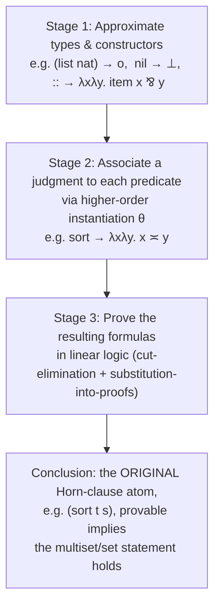
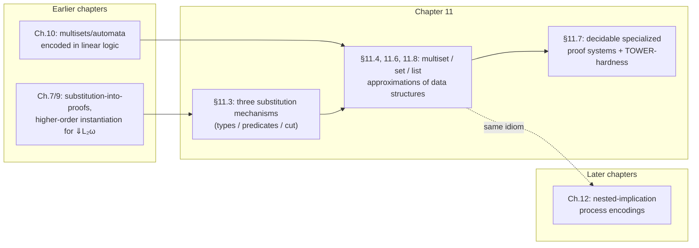

# Collection Analysis for Horn Clauses

[[book-guidelines|↩ Back to guidelines]]

## Why this chapter matters: static analysis, but the whole toolbox is linear logic

Here's the pitch the chapter opens with, and it's worth taking completely seriously: **you can prove a Horn clause program has a partial-correctness property without doing induction, without a model, and without running it — by translating [[Linear-Logic-Programming#The program|the program]] into a [[Linear-Logic|linear logic]] formula and checking that formula is a theorem.** That's it. That's collection analysis.

If you've ever written or used a borrow checker, this should feel structurally familiar before a single symbol shows up. A borrow checker doesn't prove your program is correct — it proves a *coarser*, decidable property (no aliased mutable access) by abstracting away almost everything about what your program computes and keeping only a shape: who owns what, when. Collection analysis does exactly this move for Horn clause (Prolog-style) programs. It doesn't try to prove your `sort` predicate produces a *correctly ordered* list — that would need induction and invariants, real theorem-proving work. Instead it abstracts every list in the program down to a coarser shape — a multiset, forgetting order; or a set, forgetting order *and* multiplicity; or (as we'll see at the end) a list-shaped structure that keeps order — and asks a much easier question: does the program, read at that coarser resolution, still type-check? If yes, you get "no elements were created, dropped, or duplicated" for free, statically, without ever proving the harder property "the output is sorted."

This is abstract interpretation with linear logic as the abstract domain's proof engine. The book states this explicitly in its own framing (§11.2): "if typing is important, why use only one type system?" — collection analysis is offered as *one more* static analysis a compiler could bolt onto a language that already has ordinary types, in the same spirit that a Rust compiler runs borrow-checking *in addition to* (not instead of) type-checking.

**Load-bearing for the standing project.** If you're building a Rust-based verifier that checks Horn-clause-style specifications, this chapter is close to a literal blueprint for one concrete way to do it: translate a program's data-structure invariants into a linear logic formula, hand that formula to an embedded prover, and treat "provable" as your static guarantee. Keep that in mind throughout — this isn't a tangential curiosity, it's a worked instance of the exact mechanism.

---

## 1. The motivating example: sorting as a multiset-preserving relation (§11.1)

The book's running example is a first-order Horn clause program for sorting lists (quicksort, essentially), reproduced below (Figure 11.1):

```prolog
type append   list nat -> list nat -> list nat -> o.
type sort     list nat -> list nat -> o.
type split    nat -> list nat -> list nat -> list nat -> o.
type leq      nat -> nat -> o.
type gr       nat -> nat -> o.

append nil K K.
append (X :: L) K (X :: M) :- append L K M.

split X nil nil nil.
split X (A :: R) (A :: S) B :- leq A X, split X R S B.
split X (A :: R) S (A :: B) :- gr A X, split X R S B.

sort nil nil.
sort (F :: R) S :- split F R Sm B, sort Sm SS, sort B BS,
   append SS (F :: BS) S.
```

What does "correct" mean for `sort`? Two properties, really: (a) the output is a permutation of the input (nothing created, dropped, or duplicated), and (b) the output is actually in order. Property (b) is genuinely hard — it needs an inductive argument about the relation between adjacent elements. Property (a) is much weaker, and — this is the whole chapter's thesis — **weaker in exactly the way that makes it checkable by a decision procedure instead of a proof search over induction schemes.**

The move: forget that lists are ordered. Treat `(sort s t)` as a claim about *multisets*: if `(sort s t)` is provable, the multiset of items in `s` equals the multiset of items in `t`. That's strictly implied by "permutation," and — crucially — it's the part you can check statically, mechanically, without inventing an induction hypothesis.

**"What breaks without this" framing.** If you tried to state permutation-preservation directly and hand it to a decision procedure, you'd fail — permutation is not a decidable-by-pattern-matching property of Horn clause derivations in general; proving it needs the actual inductive structure of the recursive calls. Collection analysis sidesteps this by *deliberately* asking a weaker question whose translation lands inside a decidable (or at least mechanically checkable) fragment of linear logic.

---

## 2. The undercurrents: scoped constants and linear logic as a resource substrate (§11.2)

Two ideas set up everything that follows.

### Constants are just eigenvariables with global scope

Recall from earlier in the book (Chapter 3, on eigenvariables) that during cut-free proof search, an eigenvariable behaves like a constant *scoped* to the subproof it was introduced in — it doesn't vary within that subproof, but it isn't visible outside it either. A genuine constant is the limiting case: scope over the *entire* proof. The book packages this by pointing back to the three-way split of a signature from §2.4: $\Sigma_{-1}$ (the logical connectives), $\Sigma_0$ (the non-logical constants — your program's predicates and constructors), and $\Sigma$ (the eigenvariables bound within the current proof). In a higher-order setting you can move constants from $\Sigma_0$ into $\Sigma$ — i.e., treat a "fixed" predicate symbol as if it were just another universally quantified variable, subject to instantiation.

That last sentence is the mechanism this whole chapter runs on: **if a predicate symbol can be treated as a bound variable, it can be *substituted for* — replaced by an actual formula.** This is what §11.3 formalizes, and it's the technical heart of the chapter.

### Linear logic as "sub-atomic" resource reasoning

The book has spent ten chapters showing that linear logic explains the proof theory of logic programming languages that weren't originally built on it. Here it does something extra: linear logic isn't just used to encode the *program* (as in Chapter 10's automata encodings) — it's used to encode a *judgment about the data flowing through an atomic formula's arguments*. Substituting a predicate `p` with a linear-logic formula built from `item`, $\parr$, $\otimes$, etc. is described as "splitting the atom": you're reasoning about resources *inside* what used to be an opaque atomic formula `p(t1,...,tn)`. That's the "sub-atomic" framing — one declarative logic (linear logic) does double duty as both the logic programming substrate and the bookkeeping logic for what's inside each predicate's argument list.

---

## 3. Three substitution mechanisms in proof theory (§11.3)

This section is short but it's the engine room. The book identifies three distinct things you're allowed to substitute for in a sequent-calculus proof, each with a clean justification, and each preserving provability. If you've done a substitution lemma in Lean (or any dependently-typed kernel), all three should feel like variations on a single, extremely familiar theme: *substitution into a valid derivation yields another valid derivation.*

### (a) Substituting for primitive types

If you have a proof involving a primitive type constant $\sigma$, and you replace every occurrence of $\sigma$ with some other type $\tau$ throughout the proof, you get another valid proof. This is the same move as instantiating a polymorphic function at a concrete type in Rust or Lean — nothing about the *proof structure* depends on which primitive type you plugged in, only that the substitution is uniform. Here it's used concretely: the primitive type `(list nat)` gets replaced by `o` (the type of formulas) — because we're about to reinterpret "list" as "linear logic formula denoting a collection."

### (b) Substituting for non-logical constants, via higher-order instantiation

This is the interesting one. Suppose you have a proof of

$$\Sigma, p:\tau :: D_1, D_2, \Gamma;\, \cdot \vdash p(t_1,\ldots,t_m);\, \cdot$$

where $\tau$ is a *predicate type* ($\tau_1 \to \cdots \to \tau_m \to o$) and $p$ appears in $D_1$ and $D_2$. Let $\theta$ be the substitution $[p \mapsto \lambda x_1 \ldots \lambda x_m . S]$, replacing the predicate symbol $p$ with a $\lambda$-abstraction over some formula $S$. By the higher-order instantiation result already proved for the focused system (Proposition 7.7, back in Chapter 7 — cut/substitution admissibility for $\Downarrow L_2^\omega$), applying $\theta$ everywhere yields another valid proof:

$$\Sigma :: D_1\theta, D_2\theta, \Gamma;\, \cdot \vdash S[t_1/x_1,\ldots,t_m/x_m];\, \cdot$$

Read operationally: you had a proof that the atom $p(t_1,\ldots,t_m)$ holds. You replace the *predicate itself* with a formula built from linear-logic connectives, and the proof survives, now proving that the substituted-in formula holds of the substituted-in arguments. This is what "splitting the atom" concretely means — $p$ stops being an opaque relation symbol and becomes shorthand for an actual linear-logic sentence about its arguments.

**This is higher-order unification's cousin, not its instance — flag for the elaborator project.** Note carefully what's happening here: this is *instantiation*, going from a proof with a free/quantifiable predicate variable to one with a concrete formula plugged in — the same direction of information flow as a Lean elaborator resolving a metavariable once it discovers what it should be. The chapter doesn't run *unification* here (nothing is being solved for — $\theta$ is handed to you, chosen by the analysis designer, not inferred), but the underlying machinery — substituting a $\lambda$-abstraction for a predicate-typed variable and getting a well-formed proof back out — is exactly the substitution step that a Miller-pattern higher-order unification algorithm needs to *produce* as its final answer. If you're building the elaborator, this section is a clean picture of "what a solved higher-order metavariable substitution looks like when soundly applied," even though the *solving* isn't happening on this page.

### (c) Substituting for assumptions, via cut

The third mechanism is the ordinary cut rule:

$$\dfrac{\Sigma :: \Gamma;\, \cdot \vdash C;\, \cdot \qquad \Sigma :: \Gamma, C;\, \cdot \vdash B;\, \cdot}{\Sigma :: \Gamma;\, \cdot \vdash B;\, \cdot}\ \text{cut}_!$$

Cut lets you merge a proof of a formula $C$ with a proof that uses $C$ as an assumption, producing a proof that doesn't need $C$ as a hypothesis at all. Chaining this together with mechanism (b): once you've substituted $p \mapsto \lambda\bar x.S$ and produced obligations $D_1\theta$ and $D_2\theta$, if you can separately prove $\Sigma :: \Gamma;\, \cdot \vdash D_1\theta;\, \cdot$ and $\Sigma :: \Gamma;\, \cdot \vdash D_2\theta;\, \cdot$, two applications of cut (plus cut-elimination) collapse everything down to a cut-free proof of

$$\Sigma :: \Gamma;\, \cdot \vdash S[t_1/x_1,\ldots,t_m/x_m];\, \cdot$$

**Lean framing.** This three-part story — substitute types, substitute the "predicate" content via instantiation, then use cut to discharge the resulting side-obligations — is a dressed-up version of the substitution lemma every Lean user relies on constantly without naming it: `Eq.mpr`, `▸`, and definitional unfolding are all instances of "a valid derivation stays valid after substituting a well-typed term for a variable it depends on." Cut here plays the role of Lean's `have`/`suffices` combined with the kernel's substitution rule for `let`-bindings: prove the lemma once, substitute it into place, done. The novelty isn't the substitution lemma itself — it's *what* gets substituted: not just terms, but entire predicate symbols, replaced wholesale by linear-logic formulas.

**What breaks without cut here.** Without cut-elimination, you'd be stuck with a proof that still *mentions* $D_1\theta$ and $D_2\theta$ as live hypotheses rather than a clean, self-contained proof of the target multiset/set statement. Cut-elimination is what turns "I can derive the goal *given* these auxiliary facts" into "the goal is unconditionally provable" — the difference between a conditional lemma and a finished theorem.

---

## 4. Multiset approximations (§11.4)

### The formal apparatus

A **multiset expression** is a linear logic formula built from three ingredients:

- the predicate `item`, where $\text{item}\ x$ denotes the singleton multiset $\{x\}$,
- multiplicative disjunction $\parr$ ("par"), denoting multiset *union*,
- the unit $\bot$ for $\parr$, denoting the *empty* multiset.

Variables of type $o$ (the type of formulas) can stand for an *open* multiset expression — a placeholder for "the rest of the multiset, unknown for now." Example: $\text{item}\,(f\,X) \parr \bot \parr Y$ is an open multiset expression, with $Y$ an open slot. If $S$ is *closed* (no open $o$-typed variables), write $\ulcorner S \urcorner$ for the actual multiset it denotes — so $\ulcorner \text{item}\,(f\,a) \parr \bot \parr \text{item}\,a \parr \text{item}\,a \urcorner = \{a, a, (f\,a)\}$.

Two judgments on multiset expressions matter: **inclusion** $S \sqsubseteq T$ and **equality** $S \stackrel{m}{=} T$ (the syntactic variable $\rho$ ranges over either). A **multiset statement** is a formula of the shape

$$\forall \bar x\,[\,S_1 \rho_1 T_1 \,\&\, \cdots \,\&\, S_n \rho_n T_n \Rightarrow S_0 \rho_0 T_0\,]$$

— an implication between multiset judgments, universally quantified over first-order and $o$-typed variables. This is a statement *about* multisets in the ordinary mathematical sense (written $\models^m \cdots$); it says nothing about linear logic yet.

The bridge to linear logic: for closed expressions, $\stackrel{m}{=}$ corresponds exactly to provability of $S \multimap T$ (equivalently $T \multimap S$, equivalently $S \between T$ using $\between$ for $(B\multimap C)\ \&\ (C \multimap B)$); $\sqsubseteq$ corresponds to provability of $S \parr 0 \multimap T$. Write $\rho$'s linear-logic-translated counterpart as $\hat\rho$.

### Proposition 11.1

> If $\forall \bar x[S_1 \hat\rho_1 T_1 \,\&\, \cdots \,\&\, S_n \hat\rho_n T_n \Rightarrow S_0 \hat\rho_0 T_0]$ is provable in linear logic, then $\models^m \forall \bar x[S_1 \rho_1 T_1 \,\&\, \cdots \,\&\, S_n \rho_n T_n \Rightarrow S_0 \rho_0 T_0]$.

In words: **linear-logic provability of the translated statement is a sound proof procedure for the corresponding fact about actual multisets.** The proof is a direct application of the substitution-into-proofs machinery from §11.3(c): given a closed substitution $\theta$ making the hypotheses valid multiset facts, those facts translate to provable linear-logic sequents, cut those into the provable implication, cut-eliminate, and read off provability of the conclusion — which (by the equivalence stated above) means the conclusion holds as a multiset fact.

**What breaks: the converse is false.** The book flags this explicitly and it's worth dwelling on, because it's exactly the gap every abstract-interpretation-style analysis has: soundness, not completeness. The statement

$$\forall x\forall y.\, (x \sqsubseteq y)\ \&\ (y \sqsubseteq x) \Rightarrow (x \stackrel{m}{=} y)$$

is *valid* as a fact about multisets (mutual inclusion implies equality — true of multisets in general) but its linear-logic translation is **not provable**. This is the same shape of gap as a borrow checker rejecting a memory-safe program it can't prove safe: the analysis is a *sufficient*, not *necessary*, condition. You don't get "the multiset statement fails" as a conclusion from "linear logic can't prove it" — only silence. This matters practically: collection analysis can certify correctness but can never certify its absence.

### Worked example: the sort program, all three stages

This is the spine example — walk it through completely.

**Stage 1 — approximate the type and constructors.** Replace `list nat` with `o` everywhere in the signature. Map the list constructors into multiset-building linear-logic operations:

$$\text{nil} \mapsto \bot \qquad :: \; \mapsto \; \lambda x \lambda y.\, \text{item}\ x \parr y$$

Under this mapping the list `(1 :: 3 :: 2 :: nil)` becomes the multiset expression $\text{item}\ 1 \parr \text{item}\ 3 \parr \text{item}\ 2 \parr \bot$.

**Stage 2 — associate a judgment to each predicate.** Each predicate in the sort program gets replaced (via mechanism (b) from §11.3 — higher-order instantiation of the predicate symbol) with a $\lambda$-abstracted linear-logic formula stating the invariant we want that predicate to guarantee (Figure 11.2):

$$
\begin{aligned}
\text{append} &\mapsto \lambda x\lambda y\lambda z.\ (x \parr y) \between z \\
\text{split}  &\mapsto \lambda u\lambda x\lambda y\lambda z.\ (y \parr z) \between x \\
\text{sort}   &\mapsto \lambda x\lambda y.\ x \between y \\
\text{leq}    &\mapsto \lambda x\lambda y.\ 1 \\
\text{gr}     &\mapsto \lambda x\lambda y.\ 1
\end{aligned}
$$

Reading these off: `append r s t` is instantiated to mean "the multiset union of $r$ and $s$ equals the multiset of $t$" — exactly the intended invariant, not derived, but *stipulated* by the analysis designer as the judgment to try to prove. `leq` and `gr` relate numbers, not collected items, so they get the trivial substitution $1$ (they contribute nothing to the collection invariant).

**Stage 3 — prove the resulting formulas.** Applying these substitutions to the clauses of Figure 11.1 produces the formulas of Figure 11.3 — for instance, the `append` clauses become:

$$\forall K\,(\bot \parr K \between K)$$
$$\forall X,L,K,M.\ (L \parr K \between M) \Rightarrow (\text{item}\ X \parr L \parr K \between \text{item}\ X \parr M)$$

and similarly for `split` and `sort`. Every one of these turns out to be a *trivial theorem of linear logic* — the kind of thing that follows from unit laws and associativity/commutativity of $\parr$, checkable by straightforward proof search with no induction, no invariant invention, nothing clever. That triviality is the entire payoff: what would have needed an inductive argument about permutations, phrased directly, becomes a routine linear-logic derivation once you approximate lists as multisets.

Having discharged Stage 3, the conclusion is: `(sort s t)` provable implies $s$ and $t$ denote the same multiset — the sort program computes a permutation, established entirely statically.

### Toy sketch: what the checker is actually doing (Python)

The book's proof system is a real decision procedure (see §7 below), but the *shape* of what it's checking is simple enough to sketch directly — a multiset-equality check on the "collected" version of the program's inputs/outputs:

```python
from collections import Counter

def flatten(lst):
    """The 'item / par / bot' translation, computed directly on lists."""
    return Counter(lst)

def check_sort_is_permutation(input_list, output_list):
    # This is what Proposition 11.1 lets you conclude WITHOUT running
    # this check on every possible input -- linear-logic provability of
    # the translated clauses gives you this for ALL inputs at once.
    return flatten(input_list) == flatten(output_list)
```

The static analysis's entire point is that you never have to write the loop above and run it against every input — the linear-logic theorem stands in for universal quantification over all runs of the program.

---

## 5. Formalizing the method (§11.5)

Putting the pieces together, the book states the method as a three-stage recipe, justified end-to-end by chaining the three substitution mechanisms of §11.3:



The formal justification, precisely: let $\Gamma$ be the multiset of Horn clauses (Figure 11.1), $\theta$ the combined substitution from Stages 1–2, and split the signature $\Sigma$ into $\Sigma_1$ (domain of $\theta$ — the original list-typed vocabulary), $\Sigma_2$ (unrelated symbols), and $\Sigma_3$ (range of $\theta$ — here, just `item`). If $\Sigma_1,\Sigma_2;\Gamma \vdash \text{sort}(t,s)$ is provable, then by mechanism (b) (§11.3), $\Sigma_1,\Sigma_3;\Gamma\theta \vdash t\theta \between s\theta$ is provable. Since the formulas in $\Gamma\theta$ are themselves theorems (Stage 3 discharged them), mechanism (c) (cut) collapses this to $\Sigma_1,\Sigma_3;\,\cdot \vdash t\theta \between s\theta$. Proposition 11.1 then hands you $\models^m t\theta \stackrel{m}{=} s\theta$ — the multiset statement, for free.

The book contrasts this with the *model-theoretic* alternative: build a model $M$ that already bakes in the intended invariant (e.g. $M$ contains `(append r s t)` only when the item-multisets genuinely match up), show $M \models \Gamma$, and invoke soundness of first-order logic. That works too, but it's a semantic argument requiring you to *construct a model with the right properties baked in* — non-mechanical, essentially requiring you to already know the answer. The proof-theoretic route is purely syntactic: you write down a substitution, and a decision-procedure-flavored proof search (§11.7) does the rest. That's the difference between "verify a model exists" and "run a checker" — and it's exactly the practical distinction between hand-written soundness proofs and an automatable static analysis pass.

---

## 6. Set approximations (§11.6)

Everything in §11.4 has a dual version obtained by swapping the multiplicative connective $\parr$ for the additive connective $\&$ (and $\bot$ for $\top$). A **set expression** is built from `item`, additive disjunction-as-union $\&$, and unit $\top$ (empty set). A set is idempotent under this encoding: $\text{item}\,(f\,a)\ \&\ \top\ \&\ \text{item}\,a$ denotes $\{a,(f\,a)\}$ — repeats collapse, unlike the multiset case where they'd be counted.

Set inclusion $S \subseteq T$ corresponds to provability of $T \multimap S$ (equivalently $T \Rightarrow S$); set equality $S \stackrel{s}{=} T$ corresponds to provability of $T \between S$ (equivalently $T \Leftrightarrow S$, writing $B \Leftrightarrow C$ for $(B\Rightarrow C)\ \&\ (C\Rightarrow B)$). Note the **flip in argument order** relative to the multiset case ($T \multimap S$, not $S \multimap T$) — this falls out of $\&$'s proof rules being additive (context replicated across branches) rather than multiplicative, and is a good concrete reminder that additive/multiplicative isn't just cosmetic; it changes which direction the implication has to run to be provable.

**Proposition 11.3** is the set-analysis analogue of Proposition 11.1, same statement shape, same soundness-not-completeness caveat, proved the same way (in fact simpler, since the two set judgments are related — inclusion, plus symmetric inclusion for equality — so only the inclusion case needs separate treatment).

**Worked mini-example.** Modify the sort program to drop duplicates (Figure 11.4's revised `split`, with a third `lt`-branch for equal elements). Substituting

$$\text{append} \mapsto \lambda x\lambda y\lambda z.\ (x\ \&\ y) \Leftrightarrow z, \quad \text{split} \mapsto \lambda u\lambda x\lambda y\lambda z.\ (\text{item}\ u\ \&\ x) \Leftrightarrow (\text{item}\ u\ \&\ y\ \&\ z), \quad \text{sort} \mapsto \lambda x\lambda y.\ x \Leftrightarrow y$$

and discharging the resulting formulas (Figure 11.5) shows: this program relates two lists only when they denote the same *set* — weaker than "same multiset," appropriately, since this version of sort is explicitly allowed to drop duplicates.

Also worth noting: lists can be approximated as *sets* the same way they were approximated as multisets — $\text{nil} \mapsto \top$, $:: \mapsto \lambda x\lambda y.\,\text{item}\ x\ \&\ y$ — and because $\&$ is idempotent, `(1::2::2::nil)` and `(1::2::nil)` collapse to logically equivalent set expressions. This is a genuinely different *strength* of approximation than the multiset version, chosen per-property, not a strictly-better-or-worse alternative — exactly like choosing between a coarser and finer abstract domain in abstract interpretation depending on what property you need.

---

## 7. Automation of analysis (§11.7)

So far, "prove the resulting formulas are linear logic theorems" has been left as an appeal to general linear-logic provability. This section tightens it into something you'd actually implement: specialized, restricted proof systems targeted exactly at set and multiset statements, decidable by construction.

### Set statements — Figure 11.6

Sequents have the shape $R \mid S \vdash T$, where $S, T$ are set expressions and $R$ is a multiset of set-inclusion hypotheses (of the form $B \Rightarrow (\&_{i \in I} A_i)$). The rules are essentially $\&L$/$\&R$ restricted to this shape, plus a **backchaining (BC)** rule that consumes a hypothesis from $R$. **Proposition 11.4** ties this proof system exactly to the general translation: the linear-logic formula is provable iff the corresponding $R \mid S \vdash T$ sequent is provable in Figure 11.6.

Decidability here is almost free once you see the shape: proof search never grows the left-hand side, and only finitely many atomic right-hand sides can occur — so any search either finds a proof or provably loops, and looping search can be cut off. This is the same argument you'd use to show a syntax-directed type-checking algorithm terminates: bounded left context, finite right-hand-side alphabet, no way to grow the search space indefinitely.

### Multiset statements — Figure 11.7

Same idea, dualized to $\parr$: sequents $\Gamma \mid S \vdash \Delta$, with left-unbounded-zone hypotheses of the form $(B_1 \parr \cdots \parr B_m) \multimap (A_1 \parr \cdots \parr A_n)$ — atomic rewrite rules, essentially. **Proposition 11.5** gives the same exact correspondence as Proposition 11.4. The book notes this proof system *is*, essentially, the focused proof system for $\Downarrow L_2^\omega$ restricted to this fragment — so soundness/completeness are inherited, not reproved from scratch.

Structurally, proofs in this system are straight-line (no branching) until a `decide` step fires; between decides, the left context stays fixed while the right-hand side gets rewritten according to the left-unbounded-zone rules. That's multiset rewriting, described as a proof system.

### The TOWER-hardness result — genuinely worth pausing on

Here's the fun, surprising turn: because this restricted multiset-statement proof system amounts to *multiset rewriting*, and multiset rewriting can encode **Petri net reachability** (does some marking $M_2$ reach from marking $M_1$ under a fixed set of transitions?), and Petri net reachability was shown by Czerwiński, Lasota, Lazić, Leroux, and Mazowiecki (2020) to be **TOWER-hard** — an astronomically worse-than-EXPSPACE complexity class, characterized by towers of exponentials — the complexity of deciding multiset-statement provability inherits a TOWER lower bound.

That's a striking result to land on for what looked, a page earlier, like a small decidable syntax-directed proof system. It's worth flagging exactly *why* this doesn't sink the practical usefulness of the technique: the book explicitly notes that in the context of collection analysis applied to *actual Prolog programs* (as opposed to adversarially constructed worst-case multiset-rewriting systems), the proof system is likely far more effective than the worst-case bound suggests — the same story you'd tell about SAT solvers being NP-complete in general but fast in practice on structured instances. Worth remembering next time a "this is decidable, great" result turns out to hide a tower-of-exponentials in the fine print — decidable and tractable are very different promises.

---

## 8. List approximations: the non-commutative device (§11.8)

Multisets forget order; sets forget order and multiplicity. What if you want to keep order — approximate a list *as a list*, and get list-equality as your judgment?

**What breaks without a non-commutative connective.** Both $\parr$ (multiset union) and $\&$ (set union) are commutative — that's the whole point, it's what makes them the right tool for order-forgetting approximations. To encode something order-*sensitive*, you need a connective that isn't commutative. Linear implication $\multimap$ fits: $A \multimap B$ is emphatically not the same as $B \multimap A$.

[[Linear-Logic-Programming#The encoding|The encoding]] (fixing some propositional constant $p$ as a "continuation" token): the list `(a::b::nil)` becomes

$$(((\bot \multimap p) \multimap \text{item}\ b) \multimap p) \multimap \text{item}\ a$$

— a nested tower of linear implications, alternating between "producing" an item and "consuming" a continuation. This formula is equivalent to $\text{item}\ a \parr (p^\bot \otimes (\text{item}\ b \parr p^\bot))$, which is a helpful way to see the structure: it's a $\parr$-chain of items, but interleaved with tensor-connected continuation tokens that force a specific consumption order — that ordering is exactly what a flat $\parr$-chain (the multiset encoding) throws away.

More systematically, as a translation of `nil`/`::` themselves (parametrized over a "continuation" argument $l$):

$$\text{nil} \mapsto \lambda l.\bot \qquad :: \; \mapsto\; \lambda x\lambda R\lambda l.\ ((R\ l) \multimap l) \multimap \text{item}\ x$$

**Proposition 11.6.** For lists $s, t$ built from `nil`/`::`, with $S, T$ their translations (now formulas of type $o \to o$, taking a continuation argument): $\forall l.\,(S\,l) \between (T\,l)$ is provable in linear logic if and only if $s$ and $t$ are the *same* list — order and all.

That "if and only if" is notably stronger than what Propositions 11.1 and 11.3 gave you (soundness only, one direction) — for list equality specifically, the linear-logic translation is *exact*, not merely an approximation-with-a-blind-spot. It's a genuine biconditional, at the cost of a much more intricate encoding.

**Bibliographic note worth flagging:** the book points out (§11.9) that this nested-implication list encoding can be read as an *asynchronous process* alternating output of list elements with input of a control token — i.e., the exact same construction reappears in Chapter 12 as a way of encoding communicating processes in linear logic. The list encoding here isn't a one-off trick; it's the same "alternating input/output via nested linear implication" idiom that shows up again as soon as you need to model sequencing/protocol-order in linear logic.

**What you lose going to lists.** The book is candid about this: there's no simple combinator for list concatenation in this encoding, and as a result no direct way to state prefix/suffix/sublist judgments — the expressive power that made multiset-inclusion ($S \sqsubseteq T$) and set-inclusion ($S \subseteq T$) useful judgments doesn't carry over cleanly to the list case. Equality (Proposition 11.6) is about the only natural judgment this encoding supports. This is a real cost/benefit tradeoff, not a minor footnote: multisets and sets buy you a rich vocabulary of decidable judgments (inclusion, equality, and the whole Figure 11.6/11.7 machinery); lists buy you order-sensitivity but at the price of almost all of that vocabulary.

---

## Structural synthesis: how this chapter fits the book



Chapter 11 doesn't introduce new proof theory — every tool it uses (higher-order instantiation, cut-elimination, the focused $\Downarrow L_2^\omega$ system) was built in earlier chapters. What's new is the *application*: using linear logic as the target language of a translation-based static analysis, where "provable" is the analysis's pass/fail verdict. This is a small, self-contained instance of the book's overarching thesis — computation and verification as proof search — turned specifically toward the compiler-engineer's question "can I check a partial-correctness property of this program without running or fully verifying it?"

**For the standing project.** This chapter is close to a direct blueprint for target (1) — a Rust verifier checking programs against logic-clause specifications with an embedded prover: (a) pick an abstraction (multiset/set/list, or something else entirely — the method generalizes, §11.2's "why only one type system?" is explicitly an invitation to design more), (b) translate program constructs into that abstraction's linear-logic vocabulary via a substitution, (c) hand the resulting formula to a specialized decidable proof system like Figures 11.6/11.7, (d) get a partial-correctness certificate, soundly but not completely. The §11.3(b) higher-order-instantiation substitution mechanism is also directly relevant to target (2), the elaborator — it's the "substitution succeeded, proof stayed valid" half of exactly the operation a Miller-pattern unifier needs to perform when it resolves a predicate-typed metavariable.

## Where this leads

The chapter closes by noting its own nested-implication list encoding will resurface, almost unchanged, as the mechanism for modeling communicating processes in Chapter 12 — the same "alternating input/output via nested $\multimap$" idiom becomes the backbone for encoding the $\pi$-calculus and security protocols. More broadly, this chapter is best read as a worked case study of a much larger point the book keeps returning to: linear logic isn't just *a* logic to program in — it's a flexible enough substrate that you can bolt entirely new verification tools (here, a static analysis) onto an existing programming language (Horn clauses) just by choosing the right translation and letting linear-logic provability do the checking.
