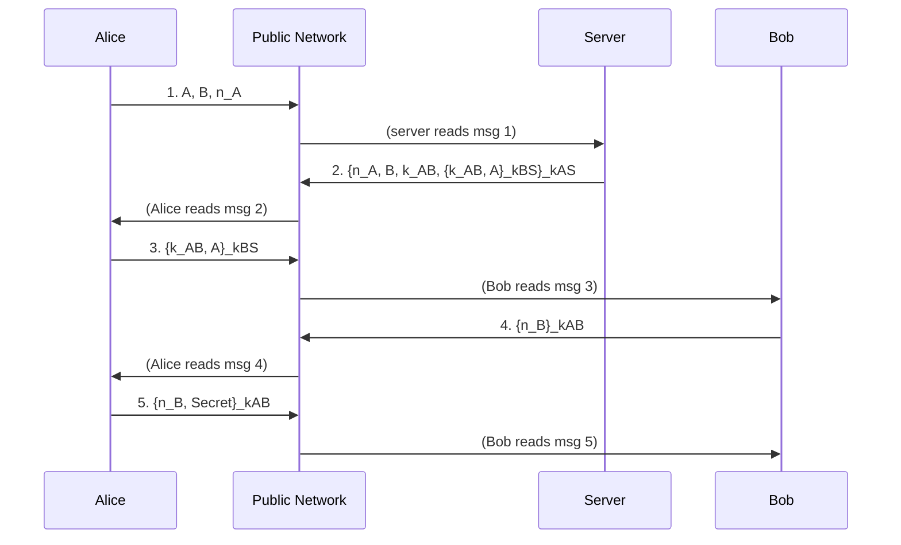

# Encoding Security Protocols and Process Calculi

[[book-guidelines|↩ Back to guidelines]]

## Why this chapter is here

Chapter 10 (multiset rewriting in linear logic) gave you the basic move: a program state is a multiset of atomic facts, and a program clause is a linear-logic implication that consumes some facts and produces others. Chapter 12 asks a more ambitious question: can that same move scale up to something people actually build and break in the real world — a concurrent system with multiple independent agents, a public untrusted network, and cryptography? The answer is yes, and watching it happen is the point of this chapter. It's also a chapter that is refreshingly honest about where the analogy strains: the first attempt (encoding the π-calculus directly as linear-logic formulas) is explicitly flagged by the book as *flawed*, and understanding exactly how it's flawed is as instructive as the parts that work.

There are two acts here. Act one (§12.1) tries to encode Robin Milner's π-calculus — the canonical formal model of message-passing concurrency — directly into linear-logic connectives, and finds two genuine cracks in the translation. Act two (§12.2–12.5) backs off to a weaker, more tractable calculus purpose-built for security protocols, and shows that *this* one embeds into linear logic cleanly, all the way down to a full working encoding of the Needham–Schroeder Shared Key Protocol.

---

## 1. The duality that starts everything: $\otimes$ vs. $\parr$, resources vs. processes

### The picture

Take a data structure built from pointers: a node that holds a pointer to resource $A$ and a pointer to resource $B$. If you hold the node, you have simultaneous, static access to both $A$ and $B$. That's exactly the reading of linear logic's multiplicative conjunction $\otimes$ ("tensor"): $A \otimes B$ is "you have both, at once, as a resource."

Now flip every arrow in that picture — dualize it, in linear logic's own sense of negation turning $\otimes$ into $\parr$ ("par"). Instead of two things pointing *into* a shared resource, you get two things pointing *out of* a shared meeting point. The book's reading: this is two *processes*, $P$ and $Q$, converging and synchronizing at that point, after which they're replaced by a new process $R$. Formally, this is exactly backchaining on a clause

$$P \parr Q \multimap R$$

read operationally: $P$ and $Q$ interact at the $\parr$, and the residue is $R$. So $\parr$ isn't just "resource or resource" the way $\otimes$ is "resource and resource" — under this dual reading it's a *location*, a forum, where independent processes rendezvous. That reading is literally where the name of Miller's logic-programming language **Forum** (built on the $\Uparrow L_2$ proof system) comes from: $\parr$ is where the action is.

**What this buys you conceptually.** Static resource access ($\otimes$, think: two references you both hold right now) and process synchronization ($\parr$, think: a rendezvous point where two independent threads of control meet) are *dual descriptions of the same connective pair*, viewed from opposite sides of linear negation. That single observation is the seed of the whole chapter: if $\parr$ is a synchronization point, then a linear-logic clause with $\parr$'s in its head is naturally a specification of concurrent interaction, not just data.

**Rust framing.** $\otimes$ is like holding two `Box<T>`s you own outright and can use together right now — the classic "resource" reading. $\parr$-as-synchronization is closer to two `tokio` tasks meeting at a `oneshot::channel` or a rendezvous `mpsc` send/recv pair: neither side "has" the value until the handoff completes, and the handoff is the computational event, not a static possession.

---

## 2. Encoding the π-calculus: the setup

### π-calculus primitives, briefly

If you haven't seen it: the π-calculus models concurrency as named communication channels along which *other names* get passed.

- $\bar x z.P$ — "send $z$ along channel $x$, then continue as $P$."
- $x(y).Q$ — "receive something along channel $x$, bind it to $y$, then continue as $Q$."
- The core reduction rule: $\bar x z.P \mid x(y).Q \longrightarrow P \mid Q[z/y]$ — send and receive on the same channel synchronize, and the received name gets substituted in.
- $(x)P$ — scope restriction: $x$ is a private name, invisible outside $P$, but it can be sent out through a channel and thereby *extruded* into a wider scope (this is the famous "scope extrusion" phenomenon — a private name leaking outward legitimately, as part of communication itself, not as a bug).

The book walks a concrete reduction: starting from $(x(y).\bar y a.\bar y b.0) \mid (z)(\bar x z. z(u).z(v).\bar u v.0)$, the restriction $(z)$ extrudes, two communications happen inside the extruded scope, and the whole thing collapses to $\bar a b.0$. This is the phenomenon any encoding needs to reproduce.

### The encoding into $\Uparrow L_2^\omega$

Four non-logical predicate symbols carry the encoding, over a base type `name`:

```
kind  name         type.
type  or           o -> o -> o.
type  send         name -> name -> o -> o.
type  get          name -> (name -> o) -> o.
type  match        name -> name -> o -> o.
```

Notice `get`'s second argument has type `name -> o` — a function from names to formulas. This is where the π-calculus's variable-binding input prefix becomes a genuine object-logic $\lambda$-abstraction: the bound variable of `x(y).Q` is literally encoded as the bound variable of a $\lambda$-term.

The translation $\langle\!\langle \cdot \rangle\!\rangle$ from π-calculus expressions to linear-logic formulas:

$$\langle\!\langle P \mid Q\rangle\!\rangle = \langle\!\langle P\rangle\!\rangle \parr \langle\!\langle Q\rangle\!\rangle \qquad \langle\!\langle (x)P\rangle\!\rangle = \forall x.\langle\!\langle P\rangle\!\rangle \qquad \langle\!\langle 0\rangle\!\rangle = \bot$$
$$\langle\!\langle \bar x y.P\rangle\!\rangle = \text{send}\ x\ y\ \langle\!\langle P\rangle\!\rangle \qquad \langle\!\langle x(y).P\rangle\!\rangle = \text{get}\ x\ (\lambda y.\langle\!\langle P\rangle\!\rangle)$$
$$\langle\!\langle P + Q\rangle\!\rangle = \text{or}\ \langle\!\langle P\rangle\!\rangle\ \langle\!\langle Q\rangle\!\rangle \qquad \langle\!\langle [x=y]P\rangle\!\rangle = \text{match}\ x\ y\ \langle\!\langle P\rangle\!\rangle$$

Parallel composition maps onto $\parr$ directly — confirming the reading from §1: parallel processes really are things meeting at a synchronization point. Restriction maps onto $\forall$ (a bound name becomes a universally quantified logic variable — this will matter in §12.2.3, where the same intuition reappears as "new"). But `send`, `get`, `match`, and `or` are *not* mapped onto logical connectives — they're left as non-logical (uninterpreted) predicates, governed by their own program clauses:

```
get X R || send X Y Q :- R Y || Q.
match X X P :- P.
or P Q :- P.
or P Q :- Q.
```

(`||` here is the object-language's own parallel-composition notation inside the Lolli-style clause syntax the book uses; these are ordinary linear-logic-programming clauses, higher-order because `R`, `P`, `Q` range over predicates/formulas, not just first-order data.)

Notice immediately: this is a two-tier translation. Structural combinators of the π-calculus ($\mid$, restriction, the unit process) get mapped onto *genuine logical connectives* ($\parr$, $\forall$, $\bot$). Communication and choice ($\bar x y, x(y), [x{=}y], {+}$) get mapped onto *predicates defined by non-logical axioms*. That asymmetry is not an accident — it's exactly where the two flaws below come from.

---

## 3. Two flaws — what breaks, and why it's instructive

The book states plainly: this encoding is genuinely useful for illustrating how process behavior can live inside proof search, but it has two real flaws. Both come from where the mapping stopped being a direct correspondence.

**Flaw 1 — nondeterministic choice `+` had to dodge $\oplus$.** It's tempting to map π-calculus choice $P + Q$ onto linear logic's additive disjunction $\oplus$ directly (rather than the non-logical `or` predicate above). The *right*-introduction rule for $\oplus$ does capture what you want: choosing to become $P$ or choosing to become $Q$. But the *left*-introduction rule for $\oplus$ would force you to accept: if $P$ reduces to $Q_1$ and $P$ reduces to $Q_2$, then $P$ reduces to $Q_1 + Q_2$. That's not a principle anyone accepts as a valid π-calculus reduction — reducing *to* a choice-expression, as opposed to reducing *from* one, isn't part of the calculus's semantics. So the book deliberately encodes `+` as a non-logical predicate instead: backchaining on `or P Q :- P` and `or P Q :- Q` mimics only the right-introduction behavior (choosing one branch), and the problematic left-introduction behavior simply never arises because `or` isn't a logical connective in the first place. This is a case where matching operational behavior *requires* declining the more elegant logical encoding.

**Flaw 2 — the left rule for $\forall$ is too strong.** In every quantificational logic in the book, $\forall x.\forall y. P\,x\,y \vdash \forall x. P\,x\,x$ is provable (instantiate both quantifiers to the same variable). Translated back through the encoding, this licenses reducing $(x)\bar x a.\bar x b.0$ to $(x)(y)\bar x a.\bar y b.0$ — i.e., splitting one restricted name into two independent restricted names. That's not a valid π-calculus reduction either; you can't legitimately turn a single shared private channel into two separate ones just by a logical inference. The mismatch is a structural one: $\forall$'s proof-theoretic behavior is simply richer than what restriction in the π-calculus is meant to support.

**The honest verdict.** Both flaws trace back to the same root: the translation used real logical connectives ($\parr$, $\forall$, $\bot$) for the *structural* combinators of the calculus, but those connectives come with proof rules that are more permissive than the calculus's own reduction relation. Whenever a logical connective's left- or right-rule does "more" than the source calculus licenses, the encoding leaks extra reductions that shouldn't be there. The book notes that Chapter 13 fixes this with a different strategy — encoding process expressions as *terms* rather than as *formulas* — which sidesteps both problems. For the rest of Chapter 12, though, the response is different: retreat to a calculus that's *deliberately weaker* than the π-calculus, one for which provability turns out to align exactly with the intended semantics. That's the security-protocol calculus built in §12.2 onward.

---

## 4. Specifying communication protocols: from arrows-and-labels to multiset rewriting

### The standard notation, and why it's misleading

Security protocols are conventionally written with arrow notation like

$$A \longrightarrow S : A, B, n_A$$

meaning "Alice sends the server the tuple $(A, B, n_A)$." Figure 12.2 gives the full **Needham–Schroeder Shared Key Protocol** (NS) this way — this is the chapter's running worked example, so it's worth having it in front of you:

| Step | Message |
|---|---|
| 1 | $A \to S: A, B, n_A$ |
| 2 | $S \to A: \{n_A, B, k_{AB}, \{k_{AB}, A\}_{k_{BS}}\}_{k_{AS}}$ |
| 3 | $A \to B: \{k_{AB}, A\}_{k_{BS}}$ |
| 4 | $B \to A: \{n_B\}_{k_{AB}}$ |
| 5 | $A \to B: \{n_B, \text{Secret}\}_{k_{AB}}$ |

Here $k_{AS}$, $k_{BS}$ are long-term shared keys (Alice–server, Bob–server); $n_A$, $n_B$ are freshly-generated *nonces* ("numbers used once," there to prevent replay attacks); $k_{AB}$ is the fresh session key the protocol's whole purpose is to establish; $\{t_1,\dots,t_n\}_k$ denotes the tuple $t_1,\dots,t_n$ encrypted under key $k$. Goal: by the end, Alice and Bob share $k_{AB}$ and can talk directly, without going through the server again.

The problem with $A \to B : M$ as notation: it looks like a **three-way synchronization** between Alice, Bob, and the message — as if all three had to be present at once. But that's not what actually happens on a real network. Alice posts $M$ to a public channel (the internet) and moves on; at some later, unrelated time, Bob happens to read it off that channel. The two events are decoupled — and crucially, an *intruder* could read, delete, or modify $M$ in between. The arrow notation hides this asynchrony and, with it, hides the entire attack surface. If you can't even talk about what happens *between* message-post and message-read, you can't reason about protocol security at all.

### The fix: multiset rewriting over a shared network

The book replaces the arrow notation with multiset-rewriting rules (recall Chapter 10's machinery: `|` is the multiset constructor, and $N\,M$ denotes "message $M$ sitting on the network"):

$$A \longrightarrow A' \mid N\,M$$
$$B \mid N\,M \longrightarrow B'$$
$$\vdots$$
$$E \mid N\,M \longrightarrow E' \mid N\,M$$

Read these as agent-state transitions: Alice in state $A$ posts $M$ and moves to state $A'$ (line 1); Bob in state $B$ can only fire this rule *if* a matching message $M$ is currently sitting on the network — he consumes it and transitions to $B'$ (line 2); an eavesdropper $E$ consumes a message, *re-posts it unchanged* (note $N\,M$ appears on both sides), and updates his own internal state $E'$ — modeling passive observation without disrupting the protocol.

More generally, a single agent transition can consume several network messages and post several new ones at once:

$$A \mid N\,M_1 \mid \cdots \mid N\,M_p \longrightarrow A' \mid N\,P_1 \mid \cdots \mid N\,P_q$$

**Rust framing — this is a state machine.** If you've ever modeled a protocol in Rust, this is exactly the shape you reach for: an `enum AliceState { Init, AwaitingServerReply(Nonce), AwaitingBobAck { session_key: Key }, Done }`, with a step function `fn step(&mut self, incoming: &[NetworkMsg]) -> Vec<NetworkMsg>` that pattern-matches on `(self.state, incoming)` and returns the messages to post. Each multiset-rewriting rule above is one match arm. The book is, in effect, giving you a *logic* whose provability tracks whether such a state machine can reach a given state — which is the whole point: instead of hand-simulating the actor system, you ask a theorem prover whether a goal state is derivable.

### Static key distribution as local scoping

A protocol needs to declare, once and for all, *which agents can possibly know which keys* — this is what makes later correctness arguments ("the intruder cannot forge this ciphertext") even meaningful. The book expresses this with a `local` binder:

$$\text{local } k.\; \Big[\; A \longrightarrow A' \mid N\{M\}_k \;;\quad S \mid N\{P\}_k \longrightarrow S' \;\Big]$$

This looks like a quantifier because it behaves like one: everything about $k$'s visibility can be read off *statically*, by inspecting which rules lie inside the scope of `local k`. If a rule sits outside that scope, its agents provably have no access to $k$. This is a syntactic, checkable notion of "who can possibly know this key" — exactly the kind of static guarantee you'd want a type system to give you for capability/permission tracking.

### Dynamic symbol creation: `new`

`local` handles keys that are fixed for the whole protocol run. But nonces and session keys ($n_A$, $k_{AB}$, …) need to be generated *fresh, at runtime, per protocol execution*. The book introduces a `new` binder for this:

$$a_1\, S \longrightarrow \text{new } k.\ (a_2\, k\, S) \mid N\{M\}_k$$

`new` "resembles a quantifier" quite deliberately — it supports $\alpha$-conversion (renaming the bound symbol doesn't change meaning) and behaves like reasoning generically about an arbitrary-but-fresh value, exactly as $\forall$-introduction does in a sequent proof. Note also the syntax upgrade here: Alice is no longer a bare label but a structured object $a_i$ carrying an index $i$ (which protocol step she's at) and arguments (her accumulated memory) — this is the seed of the "agent state predicate" idea formalized in §12.3.

**Lean framing (brief, since this is the weaker fit for this chapter).** The static/dynamic distinction between `local` and `new` maps loosely onto Lean's own two scoping devices: a `local` in this protocol calculus is closest to Lean's `section`/`variable` scoping — a name visible only within a lexical region, checkable by looking at nesting — while `new` is closer to what happens when Lean's elaborator introduces a fresh metavariable or local hypothesis per invocation: the *symbol* is generated afresh each time the surrounding rule fires, not shared across runs the way a `section`-scoped `variable` is. It's a genuinely useful analogy for the static-vs-dynamic distinction, but don't lean on it harder than that — the protocol calculus's `new` is about cryptographic freshness, not about term elaboration.

### Mapping `new`/`local` onto linear logic: two dual routes

Here's the payoff — both binders are just linear-logic quantifiers in disguise, and there are two consistent ways to read the whole notation:

| | $\mid$ | unit | $\longrightarrow$ | `new` | `local` |
|---|---|---|---|---|---|
| **disjunctive** | $\parr$ | $\bot$ | $\multimap$ | $\forall$ | $\exists$ |
| **conjunctive** | $\otimes$ | $1$ | $\multimap$ | $\exists$ | $\forall$ |

The disjunctive reading puts protocols on the *right* of the turnstile as $\Uparrow L_2^\omega$ specifications (consistent with everything in this book so far — recall Chapter 10's right-side, $\parr$-based multiset rewriting). The conjunctive reading puts them on the left, and is the style used by the independent MSR system (Cervesato et al.). Proof-search-wise the two are essentially the same dynamics; the only difference is which side of the sequent carries the action. The book commits to the disjunctive reading for the rest of the chapter — worth flagging, since it means `new` becomes $\forall$ and `local` becomes $\exists$ in what follows, which can read backwards from the naming intuition ("new" sounds existential) until you internalize that it's about *which side of the turnstile* the quantifier is discharged on.

### Encrypted data as an abstract data type

One more piece of machinery: how do you represent $\{M\}_k$ — "$M$ encrypted under $k$" — as a logical term at all? The book's move: a key is a symbolic function $k : d \to d$, and $\{M\}_k$ is literally just the application $(k\ M)$. Decryption becomes pattern matching: if you have (a term unifying with) $k$, you can match $(k\ M)$ against an encrypted term and recover $M$; if you don't have access to $k$'s definition, matching simply fails — there's no way to peel the application apart. A postfix coercion $(\cdot)^\circ$ of type $(d \to d) \to d$ lets a key itself be sent as first-class data (needed once keys start traveling *inside* messages, as $k_{AB}$ does in NS message 2).

This is precisely the "abstract data type" discipline: encryption keys are constructors whose *scope is limited by quantification* — an agent can only construct or destruct $\{M\}_k$ terms if $k$ is in scope for it, exactly mirroring how an ADT's constructors are only usable inside the module that defines them.

A compact worked example ties `local`/`new`-style scoping to this ADT view directly:

$$\exists k_{as}.\exists k_{bs}.\Big[\; a_1\langle M,S\rangle \multimap a_2\,S \parr N(k_{as}\,M).\quad b_1\,T \parr N(k_{bs}\,M) \multimap b_2\,M\,T.\quad s_1 \parr N(k_{as}\,P) \multimap N(k_{bs}\,P).\;\Big]$$

Alice ($a_1, a_2$) talks to Bob ($b_1, b_2$) through a server ($s_1$) that re-encrypts one message under a different key and is *consumed* in doing so (note $s_1$ appears only on the left of its own clause, with nothing replacing it on the right — the server-relay step is genuinely one-shot). The two $\exists$'s pin down, once and for all, that $k_{as}$ and $k_{bs}$ occur *only* in these clauses — no matter how many more agents get added to the system later, these are the only occurrences of those specific keys. That's the static-locality guarantee from `local`, now expressed as an ordinary existential quantifier scoping a linear-logic formula. (Dynamically, of course, keys can still extrude their scope onto the network as the protocol runs — the same scope-extrusion phenomenon as the π-calculus's restricted names in §1.)

---

## 5. Protocols as theories in linear logic: the full formal machinery

Now the book assembles precise vocabulary for "a protocol, as a linear-logic theory":

- An **agent identifier** is a symbol $\rho$ (e.g., $a$ for Alice, $b$ for Bob, $s$ for the server).
- For $i = 1,\dots,n$, $\rho_i$ (identifier plus index) is an **agent state predicate** — all its arguments have type $d$. These encode where an agent is in the protocol and what it currently remembers.
- An **agent state atom** is $\rho_i\,t_1\cdots t_m$ for terms $t_1,\dots,t_m : d$.
- An **agent clause** has the shape

$$\forall x_1.\cdots\forall x_i.\Big[a_1 \parr \cdots \parr a_m \multimap \forall y_1.\cdots\forall y_j.[b_1 \parr \cdots \parr b_n]\Big]$$

with the head $a_1 \parr \cdots \parr a_m$ and body $\forall \bar y.[b_1 \parr \cdots \parr b_n]$, subject to two restrictions that are doing real work:

1. Exactly one agent-state atom in the head, at most one in the body — everything else in the clause must be network messages ($N\cdot$). This is the formal version of "an agent clause belongs to exactly one agent" — no direct agent-to-agent synchronization, only agent-to-network.
2. If the head's state atom is $\rho_i\,\bar t$ and the body has a state atom $\rho'_j\,\bar s$, then $\rho = \rho'$ (same agent) and $i < j$ (state index strictly increases).

Put together: **an agent cannot synchronize directly with another agent — only through the network — and an agent cannot morph into a different agent, only advance its own state index.** Every agent's run is therefore finite (the index strictly increases, so it eventually runs out of clauses). This is a strong, checkable discipline baked directly into the *syntactic shape* of the clauses, not bolted on as a side condition.

An **agent theory** is $\exists x_1.\cdots\exists x_r.[C_1 \otimes \cdots \otimes C_s]$ for agent clauses $C_1,\dots,C_s$, with the additional requirement that no two clauses share a head state predicate (agents are deterministic — one clause per state, no ambiguity about which transition fires).

### Figure 12.3: the NS protocol as an agent theory

This is the chapter's centerpiece — the full NS protocol (Figure 12.2 above) rendered as six agent clauses inside two existentials for the long-term keys:

$$\exists k_{as}.\exists k_{bs}.\Big\{$$
$$a_1\,S \multimap \forall n_a.\ a_2\,n_a\,S \parr N\langle \text{alice},\text{bob},n_a\rangle.$$
$$a_2\,N\,S \parr N(k_{as}\langle N,\text{bob},K,E\rangle) \multimap a_3\,K\,S \parr N\,E.$$
$$a_3\,\text{Key}\,S \parr N(\text{Key}^\circ\,N_b) \multimap a_4 \parr N(\text{Key}\langle N_b,S\rangle).$$
$$b_1 \parr N(k_{bs}\langle \text{Key}^\circ,\text{alice}\rangle) \multimap \forall n_b.\ b_2\,n_b\,\text{Key}^\circ \parr N(\text{Key}\,n_b).$$
$$b_2\,N_b\,\text{Key}^\circ \parr N(\text{Key}\langle N_b,S\rangle) \multimap b_3\,S.$$
$$s_1 \parr N\langle \text{alice},\text{bob},N\rangle \multimap \forall k.\ N(k_{as}\langle N,\text{bob},k^\circ,(k_{bs}\langle k^\circ,\text{alice}\rangle)\rangle).$$
$$\Big\}$$

Trace this against Figure 12.2 message-by-message — it's worth doing slowly once:

- **Clause $a_1$**: Alice starts, picks a fresh nonce $n_a$ (the $\forall n_a$ — recall §4: `new` reads as $\forall$ under the disjunctive mapping), posts $\langle\text{alice},\text{bob},n_a\rangle$. This *is* message 1.
- **Clause $s$**: the server, on seeing that message, generates a fresh session key $k$ (again $\forall k$) and posts the doubly-nested encrypted reply — the encoding of message 2's $\{n_A,B,k_{AB},\{k_{AB},A\}_{k_{BS}}\}_{k_{AS}}$, built compositionally from the tupling operator and $(\cdot)^\circ$.
- **Clause $a_2$**: Alice consumes that reply (matching against her own key $k_{as}$, only possible because she's in the existential's scope), extracts the inner still-encrypted forwarding blob $E = \{k_{AB},A\}_{k_{BS}}$, and reposts it unmodified — this *is* message 3, Alice forwarding Bob's ticket without being able to decrypt it herself.
- **Clause $a_3$**: once Bob replies (message 4, $\{n_B\}_{k_{AB}}$), Alice decrypts using her now-known session key, reaches final state $a_4$, and posts the last message (message 5, the actual secret encrypted under $k_{AB}$).
- **Clauses $b_1, b_2$**: symmetric story for Bob — receive the forwarded ticket, extract the session key, generate his own nonce (message 4), then wait for confirmation (message 5) to reach $b_3$.

The book states the correctness result concisely: this six-clause theory, together with the two key-existentials, is provably equivalent (in the specific sense of $\Uparrow L_2^\omega$ provability) to the *specification*

$$\forall x.[a_1\,x \parr b_1 \parr s_1 \multimap a_4 \parr b_3\,x]$$

— "starting states of Alice (holding secret $x$), Bob, and the server together entail final states where Alice has finished and Bob has received $x$." That's the whole promise of the encoding cashed out as a single provability statement: correctness of an entire cryptographic protocol reduced to a linear-logic sequent being derivable.

### A cautionary aside: clause (3.2) and what "knowing a key" really means

The book contrasts two candidate clauses for Alice decrypting a message:

$$a\,K^\circ \parr N(K\,M) \multimap a'\,M \qquad\text{(3.1)}$$
$$a \parr N(K\,M) \multimap a'\,M \qquad\text{(3.2)}$$

(3.1) has Alice *holding* the key $K^\circ$ as an explicit argument — she genuinely possesses it and uses it to decrypt. (3.2) drops that argument. It *looks* similar, but it's operationally very different: (3.2) is logically equivalent to $\forall X.[a \parr N\,X \multimap \exists M.\,a'\,M]$ — meaning Alice isn't decrypting anything at all, she's just *guessing* some value $M$ for her next state, unconstrained by what's actually on the network. Unification confirms this concretely: matching the pattern $(K\,M)$ against a real network message $(k\ \text{secret})$ admits at least three distinct unifiers — $M \mapsto (k\ \text{secret}), K \mapsto \lambda w. w$ (the "no real decryption" solution), $M \mapsto \text{secret}, K \mapsto k$ (the intended one), and $M \mapsto M, K \mapsto \lambda w.\,k\,\text{secret}$ (another trivial one). This is a sharp, concrete illustration of why the *shape* of an agent clause — which arguments an agent actually carries — is not cosmetic. Drop the key argument and you've silently modeled an agent who can "decrypt" anything, which is exactly the kind of unintended-capability bug a real protocol verifier needs to catch.

---

## 6. Abstracting internal states: existential quantification as locality

### $n$-way to 2-way, mechanically

Agent state predicates like $a_2, a_3, b_2$ are pure bookkeeping — nothing outside a single agent's own clauses should ever need to mention them. The book shows existential quantification over predicate symbols achieves exactly this hiding, and along the way demonstrates something more general: any $n$-way multiset-rewriting synchronization can be re-expressed with only 2-way synchronization, using fresh hidden intermediate predicates:

$$\exists l_1.\exists l_2.\Big[\;a\parr b \multimap l_1.\quad l_1\parr c \multimap l_2 \parr e.\quad l_2 \multimap d \parr f\;\Big] \;\dashv\vdash\; a \parr b \parr c \multimap d \parr e \parr f$$

The right-hand formula is a single 3-in/3-out rule; the left-hand formula reaches the same net effect using only 2-in/2-out steps chained through the existentially-hidden $l_1, l_2$. The forward direction (left implies right) is straightforward proof search; the reverse direction needs two *higher-order* substitutions — instantiate $\exists l_1$ with $a \parr b$ and $\exists l_2$ with $d \parr f$ — which is only expressible because the quantifiers range over predicate/formula-valued variables, not just first-order data. **What this buys you concretely:** it means the theoretical framework never actually needs primitive $n$-way synchronization primitives; 2-way synchronization plus existential hiding is enough, which keeps the proof theory (and any implementation of it) uniform.

**What breaks without it.** These two formulas are provability-equivalent, but not *observably* equivalent if you could inspect failed proof attempts: searching for a proof from $a, b$ (without $c$) behaves differently — you can make partial progress with the left-hand chained version (reach $l_1$) in a way that has no analogue in the atomic 3-way rule. The book flags this and then sets it aside: this book's proof theory is only concerned with *complete* proofs, so this distinction never surfaces here — but it's worth knowing it exists if you ever build a system that reasons about partial/stuck protocol runs (which, for security analysis, you very much might want to).

### Locality of agent identity itself

The same trick applies to the agent-state predicates from §12.3 directly:

$$a_1 \parr N\,m_0 \multimap a_2 \parr N\,m_1$$
$$\exists a_2.\exists a_3.\Big[\;a_2\parr N\,m_1 \multimap a_3 \parr N\,m_3.\quad a_3 \parr N\,m_4 \multimap a_4 \parr N\,m_5\;\Big] \;\dashv\vdash\; a_1 \parr N\,m_0 \multimap \big(N\,m_1 \multimap (N\,m_2 \multimap (N\,m_3 \multimap (N\,m_4 \multimap (N\,m_5 \parr a_4)))))\big)$$

(schematic — the book's actual displayed equivalence chains a sequence of steps this way). The point: existentially quantifying the *intermediate* agent-state predicates $a_2, a_3$ makes the equivalence hold, and produces on the right a single deeply nested chain of $\multimap$'s, alternating input and output as you cross each implication. **Why this matters beyond tidiness:** the restrictions baked into "agent clause" in §12.3 (no direct agent-to-agent sync, no agent-to-different-agent transition) were essentially *hand-written* discipline enforcing locality/hiding of predicates. Existential quantification achieves the identical hiding *automatically*, as a direct consequence of the logic's own proof rules — you don't need a side-condition checker verifying the restrictions, the quantifier structure does it for you. This is a genuine instance of "scoping as a first-class logical device" rather than an external well-formedness check bolted onto the syntax — directly resonant with the broader recurring theme (echoed in this book's treatment of eigenvariables and in how a type-checker's elaborator manages metavariable scope) that *where a name is allowed to be substituted* is itself something the logic, not an external checker, should be responsible for enforcing.

---

## 7. Agents as nested implications: the payoff reformulation

The observation that hiding internal states collapses a protocol into one long alternating $\multimap$-chain suggests dropping agent-state predicates altogether and writing agents directly as such chains. Define two syntactic classes:

$$H ::= A \mid \bot \mid H \parr H \qquad\qquad K ::= H \mid H \multimap K \mid \forall x.K$$

where $A$ ranges over atomic network-message formulas ($N\cdot$). $H$-formulas are "bundles of messages" (a batch of simultaneous sends or a batch of simultaneous receives); $K$-formulas — **agent formulas** — can nest $\multimap$ arbitrarily deep, and the *only* predicate that ever appears is $N$. No more $a_1, a_2, \dots$ bookkeeping predicates at all — an agent's entire internal state is now implicit in *how deep into the nested implication you currently are*.

### Why the nesting alternates input and output

Consider proof search for the sequent $\Sigma :: \cdot;\Gamma \vdash \Delta, A\,;\cdot$ where $\Gamma,\Delta$ are multisets of $K$-formulas. The right-introduction phase performs all currently-available *output* actions (posting messages); left-introduction, focused on one agent formula, performs *input* (consuming messages). Concretely, for $P = \forall x.\forall y.(N(fx) \parr N(gxy) \multimap \hat P\,xy)$:

- On the **right**, $P$'s right-rule generates two fresh tokens $x,y$, *outputs* $N(fx)$ and $N(gxy)$ to the network, and the continuation $\hat P\,xy$ moves to the left — the process now switches into *input* mode.
- On the **left**, the mirror rule: the continuation $\hat P\,t\,s$ (for chosen terms $t,s$) moves to the *right*, after consuming $N(ft)$ and $N(gts)$ as *input*.

So crossing one $\multimap$ boundary always flips the current phase between output and input — and $\forall$, depending on which side it's discharged, either generates a fresh eigenvariable (output mode, like the π-calculus's restriction operator generating a fresh private name) or acts as ordinary variable-binding for an incoming value (input mode, like value-passing CCS's input prefix). $\bot$ acts as a no-op phase-flip: $\bot \multimap P$ on the right outputs nothing and hands $P$ straight to input mode.

### Figure 12.4: NS re-encoded as three nested-implication agents

This is the same protocol as Figure 12.3, restated with no agent-state predicates at all — just deeply nested $\multimap$'s, each line's `(Out)`/`(In)` tag telling you which phase it represents:

**Alice:**
```
(Out)  ∀na. N⟨alice,bob,na⟩ ⊸
(In)     (∀Key.∀E. N(kas⟨na,bob,Key°,E⟩) ⊸
(Out)       (N E ⊸
(In)          (∀N. N(Key N) ⊸
(Out)            (N(Key⟨N,secret⟩) ⊸
(Cont)              a4 )))).
```

**Bob** (negated, since he starts by receiving — first line outputs nothing):
```
(Out)  ⊥ ⊸
(In)     (∀Key. N(kbs⟨Key°,alice⟩) ⊸
(Out)       (∀nb. N(Key nb) ⊸
(In)          (∀S. N(Key⟨nb,S⟩) ⊸
(Cont)           b3 S))).
```

**Server** (also negated, likewise starts by receiving):
```
(Out) ⊥ ⊸
(In)    (∀N. N⟨alice,bob,N⟩ ⊸
(Out)      (∀k. N(kas⟨N,bob,k°,kbs⟨k°,alice⟩⟩))).
```

Every line matches, message for message, the Figure 12.3 encoding you already traced through in §5 — but now the protocol's control flow *is* the formula's nesting structure, rather than being scattered across separate clauses linked only by shared state-predicate names. The book notes this style reads almost like a process calculus itself: $\multimap$ plays the role of CCS's dot-prefix ("do this, then continue as..."), and $a \multimap (b \multimap (c \multimap \cdots))$ can be read, depending on which side of the turnstile it sits, as either $\bar a \mid\mid (b.(\bar c \mid\mid (d.\cdots)))$ or $a.(\bar b \mid\mid (c.(\bar d\mid\mid\cdots)))$ — output-then-input-then-output..., or input-then-output-then-input..., a direct echo of the π-calculus prefixing this chapter opened with, but now free of the two flaws from §3, because the encoding no longer routes structural combinators through connectives whose proof rules are more permissive than intended.

The book also flags two practical variations worth knowing: making an agent *persistent* (e.g. a server that should survive multiple invocations, not be consumed after one use) is a one-symbol change — replace its leading $\multimap$ with $\Leftarrow$ (the "banged"/unbounded implication). And for modeling active attacks, moving network-message output into the unbounded (`?`) zone captures the standard Dolev–Yao assumption that an adversary remembers every message it has ever seen, even ones since "removed" from the bounded/linear part of the context.

---

## Structural synthesis

**The Needham–Schroeder message flow**, as an ordinary sequence diagram — useful to hold alongside both linear-logic encodings above, since every arrow here corresponds to one $N(\cdot)$ posted-then-consumed:



**How the chapter's pieces stack:**

```
π-calculus attempt (§12.1)
   └─ ⊗/⅋ duality: resource-access vs. process-synchronization  →  origin of "Forum"
   └─ send/get/match/or as non-logical predicates (2 flaws: + vs ⊕, ∀-left too strong)
             │
             ▼   (retreat to a weaker, purpose-built calculus)
Security-protocol calculus (§12.2)
   ├─ asynchronous multiset rewriting over a public network (N·)
   ├─ local k. ............ static key distribution  ⟶ ∃ (disjunctive reading)
   ├─ new k. ............... dynamic symbol generation ⟶ ∀ (disjunctive reading)
   └─ encrypted data {M}_k = (k M), an ADT with scoped constructors
             │
             ▼
Protocols as linear-logic theories (§12.3) — Figure 12.3, NS protocol
   agent identifier → agent state predicate → agent clause → agent theory
             │
             ▼   (existential quantification hides bookkeeping predicates, §12.4)
Agents as nested implications (§12.5) — Figure 12.4, same NS protocol
   H ::= A | ⊥ | H ⅋ H         K ::= H | H ⊸ K | ∀x.K
   alternating (Out)/(In) chain, no agent-state predicates left at all
```

Chapters 12 and 13 are the book's two extended "apply everything" chapters — this one takes the Chapter 10 multiset-rewriting-in-linear-logic pattern and scales it to concurrency and cryptographic protocols; Chapter 13 will revisit the π-calculus specifically, encoding processes as *terms* rather than formulas, precisely to dissolve the two flaws surfaced in §3 here.

**Connection to the standing project.** This chapter is breadth-context rather than core mechanism for a Rust compiler/verifier with an embedded prover — but it's a valuable data point on how far "verify programs against logic-clause specs" scales: NS is not a toy, it's a real (if small) cryptographic protocol, and its correctness is reduced, in full, to one linear-logic sequent's provability. The genuinely load-bearing idea for the standing project is §12.4's use of existential quantification over predicate symbols for locality: this is a real instance of the recurring "scoping and substitution management" thread — a formal, checkable way to say "this internal bookkeeping predicate (or, in an elaborator, this metavariable) may not be referenced or unified with anything outside its introducing scope," enforced by the logic's own quantifier rules rather than by an external well-formedness pass. If your verifier or elaborator ever needs to hide internal machinery from client-visible specs while still reasoning soundly about it, this is the proof-theoretic shape that guarantees it.
