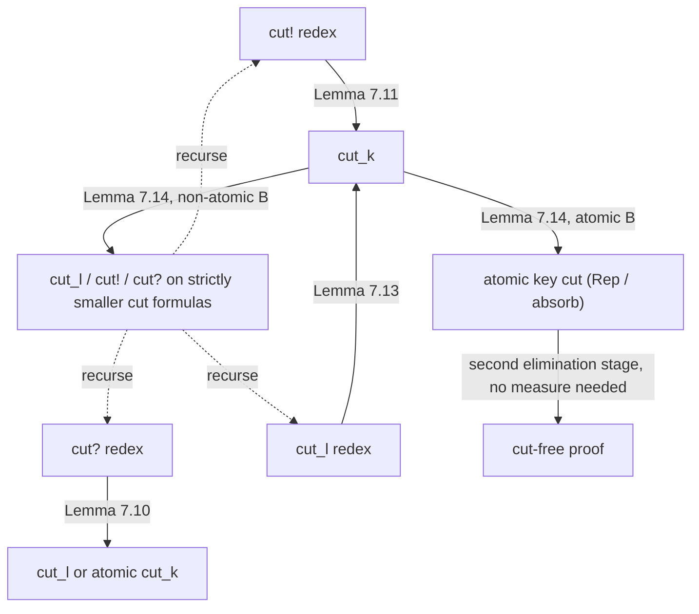
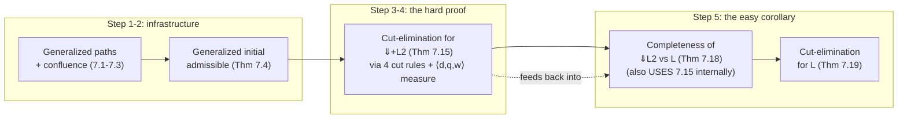

# Focused Proofs and Cut-Elimination for Linear Logic

[[book-guidelines|↩ Back to guidelines]]

## Why this chapter has to exist at all

Back in the unfocused system $L$, cut-elimination is the classical Gentzen argument: take a proof ending in a cut, look at how the cut formula was last introduced on each side, and push the cut upward until it disappears or shrinks. It's a single rule, a single induction, one moving part.

Focusing breaks that. The whole point of the focused system $\Uparrow L_2$ (built in Chapter 6) is that provers don't get to introduce connectives in just any order — they alternate between two disciplined phases: a *right-introduction phase* (invertible, negative connectives, no choices) and a *left-introduction phase* (a `decide` rule commits to a formula, then that formula's positive/negative-but-focused structure gets torn down without interruption). This is exactly the shape of a deterministic backchaining prover, which is why the book cares about it — it's the proof-theoretic backbone of logic programming. But it means "the last rule used to build the cut formula" is no longer a single rule occurrence you can point to. A cut formula might be the entire target of a multi-step left-introduction phase decided on minutes (proof-tree-wise) earlier. The bookkeeping Gentzen needed for one rule, focusing needs for a whole *phase*, and it needs to track it separately depending on which of the four unbounded/bounded zones the cut formula is sitting in when it's cut.

So this chapter rebuilds cut-elimination from scratch for the focused system $\Uparrow L_2$, and it does something conceptually striking that the book flags explicitly: it proves the *hard* theorem (cut-elimination for the focused system) first, and then gets cut-elimination for the *original, unfocused* system $L$ as a two-line corollary. That's backwards from the historical order — Gentzen proved cut-elimination for the unfocused calculus, and focusing came decades later — but once you have both systems, proving it on the more constrained, disciplined system turns out to be *easier*, and completeness plus the focused cut-elimination theorem together hand you the unfocused result for free. Worth sitting with: this is the kind of inversion that only becomes visible once you have the right auxiliary structure (paths, phases) in place.

If you're building a Rust verifier that embeds a resolution/backchaining prover as an oracle, this chapter is the reason that oracle doesn't need to *be* an oracle. Cut-elimination is precisely the statement "any proof that goes through an intermediate lemma (the cut formula) can be rewritten into a proof that doesn't" — i.e., the prover never needs to guess an intermediate fact from nowhere; everything bottoms out in analytic, subformula-respecting steps. Without cut-elimination for the focused calculus specifically, "focus and backchain" wouldn't be guaranteed complete or terminating as a *search* strategy — you'd have completeness for the unfocused system but no guarantee that the disciplined, implementable search strategy inherits it.

## Step 1: generalized paths — giving formulas a canonical "signature"

### The problem paths solve

In the right-introduction phase, a prover is handed a formula built from $\{\top, \&, \multimap, \Rightarrow, \forall, \bot, \parbin, \mathord{?}\}$ (this restricted set, $L_2$, is the chapter's working sublanguage) and has to peel off invertible connectives until it bottoms out in something atomic or focusable. But `&` branches the proof (two premises), so a single formula can spawn many different "bottom-out" sequents depending on which branch you're following. You need a name for each of these bottomed-out end states, and you need to know that this set of end states is *the same set* regardless of the order in which you strip connectives — otherwise "the right-introduction phase" isn't well-defined as a deterministic (up to permutation) procedure.

This is exactly the same problem Section 5.5 solved for $L_0$ with the notion of a *path*; this chapter lifts it to $L_2$.

### Definition, in words first

A path through a formula is a route from the root to one particular "leaf" behavior, tracking which branch of each `&` you took, while flattening every invertible connective along the way. Formally, the book defines a relation $B \uparrow P$ ("$P$ is a path of $B$") by structural rules — e.g. $A \uparrow A$ for atoms, $C \Rightarrow B \uparrow C \Rightarrow P$ if $B \uparrow P$, and — crucially, for `&` — both $B_1 \uparrow P$ *and* $B_2 \uparrow P$ give you $B_1 \& B_2 \uparrow P$, i.e. `&` produces one path *per branch*, not a combined one.

`&` can be eliminated from paths entirely because it distributes over every other connective up to provable equivalence:
$$C \parbin (B_1 \& B_2) \equiv (C \parbin B_1) \& (C \parbin B_2), \quad C \multimap (B_1 \& B_2) \equiv (C \multimap B_1)\&(C \multimap B_2), \ \ldots$$
So you can always imagine pulling every `&` to the outside of the formula, turning "pick a path" into "pick a conjunct." This is the linear-logic analogue of pushing a `match` to the top of an expression before analyzing control flow — you're normalizing the *shape* of the decision tree before reasoning about it.

### The normal form

Using further provable equivalences (distributing $\forall$ and the binary connectives past each other, using $B \parbin \bot \equiv B$, and commutativity of $\parbin$), every path can be rewritten into one canonical shape:
$$\forall \bar{x}.[\,C_1 \Rightarrow \cdots \Rightarrow C_n \Rightarrow B_1 \multimap \cdots \multimap B_m \multimap A_1 \parbin \cdots \parbin A_p \parbin\, ?E_1 \parbin \cdots \parbin\, ?E_q\,]$$
Here $A_1,\ldots,A_p$ are *atomic*. The book names the pieces:

- $\{C_1,\ldots,C_n\}$ — the **intuitionistic arguments** (these will land in the unbounded left zone $\Psi$),
- $\{B_1,\ldots,B_m\}$ — the **linear arguments** (bounded left zone $\Gamma$, consumed multiplicatively),
- $\{A_1,\ldots,A_p\}$ — the **atomic targets**,
- $\{E_1,\ldots,E_q\}$ — the **?-targets** (they end up in the unbounded right zone $\Upsilon$).

Since these are *multisets*, the decomposition is unique — that uniqueness is what makes "the path associated to a sequent" a well-defined object rather than a syntactic artifact. The book restates this normal form directly as a sequent:
$$\bar{x} :: C_1,\ldots,C_n; B_1,\ldots,B_m \vdash A_1,\ldots,A_p; E_1,\ldots,E_q$$
This is the four-zone sequent shape from Chapter 6 ($\Psi;\Gamma \vdash \Delta;\Upsilon$) — a path *is* a recipe for one particular bottomed-out sequent shape.

**Rust/type-theory framing**: think of a path as one arm of an exhaustive `match`, flattened all the way to its leaf return type — except the "leaf" here isn't a value, it's a whole calling convention: which arguments are affine/linear (`m` of them, consumed exactly once — `B_i`), which are freely-shared reusable premises (`n` of them, `C_i`), and what atomic proposition(s) come out the other end (`A_i`, or a "boxed"/`?`-marked one, `E_i`). A path fixes the *type signature* of one deterministic slice through the formula before you even start proving anything with it.

### Confluence of the rewriting system

The right-introduction phase is recast as a rewriting system on multisets of sequents: pick a sequent in the multiset, apply a right-introduction rule to its non-atomic conclusion formula, replace it with the rule's premises. Two structural facts make this system well-behaved:

1. **Termination.** Define the size of a sequent as the connective-count in its bounded-right zone $\Delta$; the size of a multiset is the sum. Every rewrite strictly decreases total size, so the system can't rewrite forever — bounded strictly-decreasing measure, terminates. (Structurally this is the simplest possible instance of the "decreasing measure ⟹ terminates" pattern that recurs, in much heavier form, later in the chapter.)
2. **Confluence (Proposition 7.1).** Only *local* confluence needs proving (termination + local confluence ⟹ global confluence — the standard Newman's-lemma move). The one interesting case is when two different non-atomic formulas in the same $\Delta$ could each be decomposed first (e.g. $B \parbin C$ and $D \& E$ both sitting in $\Delta$); the proof exhibits the common reduct directly, relying on the fact that all right-introduction rules for $L_2$ connectives permute freely over each other.

The payoff (Proposition 7.2) is that you can pick *any* one formula $G$ in the endsequent and insist the right-introduction phase decomposes it first — the proof is unaffected up to rule permutation, and the premises of that phase are exactly the sequents associated to $G$'s paths. Proposition 7.3 gives the mirror-image statement for the left-introduction phase: it's driven by a single path in the focused formula $B$, and the multiset of premises decomposes cleanly into the $n{+}m{+}q$ pieces predicted by the path's normal form. These two propositions are the load-bearing lemmas for everything that follows — confluence is what lets later proofs say "WLOG the phase looks like *this*" without loss of generality.

## Step 2: admissibility of the general initial rule (Theorem 7.4)

In the base focused system, `init` only fires on *atomic* formulas — that's what makes it checkable in $O(1)$. But for the completeness and cut-elimination arguments to go through, you need the *generalized* initial sequent $\Sigma :: \Psi; B \vdash B; \Upsilon$ to be provable for *arbitrary* $L_2$-formulas $B$, not just atoms. That's exactly the shape of the "generalized identity extends to all types" lemma you prove for a typed calculus with η-expansion — the atomic identity rule extends to a full identity *derivation* at every type by induction on structure, using invertibility (right rules) to expand and then re-focus.

**Theorem 7.4** proves, by simultaneous induction on the structure of $B$, three claims: $\Psi; B \vdash B; \Upsilon$ is provable; if $B \in \Psi$ then $\Psi; \cdot \vdash B; \Upsilon$; if $B \in \Upsilon$ then $\Psi; B \vdash \cdot; \Upsilon$. The construction is mechanical given Step 1: run the right-introduction phase on $B\vdash B$ down to the path-associated premise, `decide` on the copy of $B$ sitting on the left, run the matching left-introduction phase (Proposition 7.3 guarantees it lines up against the *same* path), and the resulting open premises are handled by the three inductive hypotheses (intuitionistic-argument premises by claim 2, linear-argument premises by claim 1 recursively, ?-target premises by claim 3). This is a completely mechanical structural induction once the phases are pinned down — exactly the kind of thing you'd discharge in Lean with `induction B` and let the three IHs close each generated goal.

**What breaks without it**: every later argument that wants to say "cut this arbitrary formula against its own initial proof" (e.g. converting a `decide` rule into a cut, which is the engine of the cut-elimination lemmas below) needs generalized initial to exist first. Without Theorem 7.4, you'd only have identity at atomic type, and none of the redex-reduction lemmas in Section 7.3 would have anywhere to bottom out.

## Step 3: four cut rules, not one

### Why four

In the unfocused calculus, cut has one shape: prove $B$, prove "$B$ implies the rest," combine. In the focused calculus, $B$ can be sitting in *four different places* depending on which zone it occupies, and each zone has different structural rules governing it (bounded zones are consumed multiplicatively/linearly; unbounded zones $\Psi,\Upsilon$ are shared/contractible). A single generic cut rule would have to pattern-match on which zone the formula is in anyway — so the book just gives each zone its own primitive cut rule, matching Figure 7.1:

$$
\dfrac{\Sigma :: \Psi; \cdot \vdash B; \Upsilon \qquad \Sigma :: \Psi, B; \Gamma \vdash \Delta; \Upsilon}{\Sigma :: \Psi; \Gamma \vdash \Delta; \Upsilon}\ \mathsf{cut{!}}
\qquad
\dfrac{\Sigma :: \Psi; \Gamma \vdash \Delta, B; \Upsilon \qquad \Sigma :: \Psi; B \vdash \cdot; \Upsilon}{\Sigma :: \Psi; \Gamma \vdash \Delta; \Upsilon}\ \mathsf{cut{?}}
$$
$$
\dfrac{\Sigma :: \Psi; \Gamma_1 \vdash B, \Delta_1; \Upsilon \qquad \Sigma :: \Psi; \Gamma_2, B \vdash \Delta_2; \Upsilon}{\Sigma :: \Psi; \Gamma_1,\Gamma_2 \vdash \Delta_1,\Delta_2; \Upsilon}\ \mathsf{cut}_l
$$
$$
\dfrac{\Sigma :: \Psi; \Gamma_1 \vdash B, \Delta; \Upsilon \qquad \Sigma :: \Psi; \Gamma_2 \Downarrow B \vdash A; \Upsilon}{\Sigma :: \Psi; \Gamma_1,\Gamma_2 \vdash \Delta, A; \Upsilon}\ \mathsf{cut}_k
$$

- $\mathsf{cut{!}}$ — cut against a formula being moved into the unbounded-left zone $\Psi$ (the "!"-style, freely reusable, hypothesis).
- $\mathsf{cut{?}}$ — the mirror image on the unbounded-right zone $\Upsilon$.
- $\mathsf{cut}_l$ — ordinary linear cut between the two *bounded* zones $\Gamma,\Delta$.
- $\mathsf{cut}_k$, the **key cut** — the odd one out: its right premise is a $\Downarrow$-sequent (mid-left-introduction-phase, formula under focus), and it's introduced purely as *technical machinery* for the elimination procedure, not because the base calculus needs it as a primitive. It is the only cut rule that touches a focused ($\Downarrow$) sequent.

An occurrence of one of the three *regular* cuts is a **border cut** if its conclusion is a border sequent (i.e. all of $\Gamma,\Delta$ atomic — the boundary between phases); otherwise it's **non-border**. Note the right premise of a border cut is automatically a border sequent.

**What breaks with only one generic cut rule**: if you tried to write a single cut rule polymorphic over "which zone," the reduction lemmas (Section 7.3's Lemmas 7.10–7.14) would each need internal case-splits on zone *and* you'd lose the clean measure-decrease argument below, because a $\mathsf{cut}_k$ redex reduces by *decomposing a whole phase*, structurally unlike how a $\mathsf{cut{!}}$ redex reduces (by deleting a single `decide!`). They're different enough operationally that keeping them as four separate rules, each with its own reduction lemma, is what makes the induction tractable at all.

### Why `?` needs special-casing

$?$ is logically redundant — $?B$ is definable as $(B \multimap \bot) \Rightarrow \bot$ — but it's kept because it's genuinely convenient for examples. Its proof-rule behavior is structurally different from every other connective: `decide?` doesn't bridge a left- and right-phase the way `decide` and `decide!` do — it sits *between two adjacent right-introduction phases* — and the left rule for `?` doesn't preserve the $\Downarrow$-focus in its premise. So $\mathsf{cut{?}}$ gets carved out as its own primitive rather than being handled as a special case of one of the others.

## Step 4: the measure — proving termination the way you'd prove a recursive function halts

### Threads, rank, degree

To run an induction that eliminates cuts one at a time, you need a well-founded ordering on cut *occurrences* so that each rewriting step strictly decreases something. The book builds this from three ingredients:

- **Thread**: a chain of sequent occurrences $S_1,\ldots,S_n$ in a proof $\Xi$, starting at the conclusion of an `init` rule and ending at the endsequent, where each consecutive pair is a premise/conclusion of some inference rule. (Think: one path from a leaf to the root of the proof tree.)
- **Rank** of $\Xi$: the maximum, over all threads in $\Xi$, of the number of `decide`-and-cut rule occurrences in that thread, *excluding* any thread that passes through the left premise of $\mathsf{cut}_l$, $\mathsf{cut{!}}$, or $\mathsf{cut}_k$. (Rank is only meaningful when the proof has no $\mathsf{cut{?}}$ occurrences.)
- **Degree** of a formula: its connective count (same notion of size used for the phase-termination argument in Step 1).

For a cut *occurrence*, let $\Xi$ be the subproof ending in that cut. Its measure is the triple
$$|\Xi| = \langle d, q, w \rangle$$
where $d$ = degree of the cut formula, $q$ = number of $\mathsf{cut{?}}$ occurrences in $\Xi$, $w$ = rank of $\Xi$ — ordered **lexicographically**.

**This is exactly a `termination_by`/`decreasing_by` argument.** If you've written a Lean function with nested recursion that isn't structural in any single argument, you reach for a lexicographic tuple and show each recursive call strictly decreases it in the first coordinate that differs. That's precisely what's happening here: eliminating one kind of cut redex might *not* shrink the formula's degree (the cut formula could even split into several smaller cuts of similar shape), but it will always shrink $d$, or hold $d$ fixed and shrink $q$, or hold both fixed and shrink $w$. The lemmas below are the case analysis that a Lean `decreasing_by` tactic block would have to discharge goal-by-goal.

### Atomic key cuts, Rep, and absorb — the base case that isn't reduced by measure

An atomic key cut is a $\mathsf{cut}_k$ whose cut formula is atomic. Because its right premise, being a focused atomic sequent, can *only* be closed by `init` or `init?`, the whole subproof structure of its *left* premise is irrelevant to termination — every atomic key cut has measure exactly $\langle 0,0,1 \rangle$, regardless of how big the rest of the proof is. Concretely, these degenerate to two shapes:

$$
\dfrac{\Sigma::\Psi;\Gamma\vdash\Delta,A;\Upsilon\quad \Sigma::\Psi;\cdot\Downarrow A\vdash A;\Upsilon}{\Sigma::\Psi;\Gamma\vdash\Delta,A;\Upsilon}\ \mathsf{cut}_k
\ \rightsquigarrow\ \textbf{Rep}
\qquad
\dfrac{\Sigma::\Psi;\Gamma\vdash\Delta,A;A,\Upsilon\quad \Sigma::\Psi;\cdot\Downarrow A\vdash\cdot;A,\Upsilon}{\Sigma::\Psi;\Gamma\vdash\Delta;A,\Upsilon}\ \mathsf{cut}_k
\ \rightsquigarrow\ \textbf{absorb}
$$

**Rep** is literally an identity — the proof of the left premise already *is* the desired conclusion; the cut is a no-op that can just be deleted. **absorb** takes a proof that produces $A$ two ways (once in $\Delta$-position, once already sitting as a hypothesis-target in $\Upsilon$) and folds them into one — it corresponds to `decide?` once permuted appropriately (Lemma 7.9). Atomic key cuts are removed in a *second stage of the elimination procedure* that doesn't touch the measure at all — it's pure structural rewriting (delete Rep occurrences; replace absorb occurrences with `decide?`).

**What breaks without this two-stage split**: if you tried to fold atomic-key-cut elimination into the main measure-decreasing induction, you'd have nothing to decrease against — the measure is flat at $\langle0,0,1\rangle$ for every occurrence, by construction, precisely because their subproof structure is deliberately erased from consideration. So the procedure is honestly staged: first drive every non-atomic cut down to atomic key cuts by measure induction, *then* clean up the atomic key cuts by simple structural rewriting that needs no ordering argument at all.

### The four reduction lemmas

Each lemma takes a *redex* — a cut whose two immediate subproofs are already cut-free except for atomic key cuts ($\Downarrow_a L_2$-proofs) — and rewrites it away, strictly decreasing the measure:

- **Lemma 7.10 ($\mathsf{cut{?}} \to \mathsf{cut}_l$ / atomic $\mathsf{cut}_k$)**: find the `decide?` occurrences on the cut formula $B$ in the left premise, replace each with a $\mathsf{cut}_l$ against (a weakened copy of) the right premise, then strengthen away the now-unused $B$ from $\Upsilon$ (Proposition 7.8). Removes an occurrence of $\mathsf{cut{?}}$, so $q$ strictly decreases.
- **Lemma 7.11 ($\mathsf{cut{!}} \to \mathsf{cut}_k$)**: symmetric move on `decide!` occurrences of $B$ in $\Psi$, replaced by $\mathsf{cut}_k$ against the (weakened) left premise. Rank strictly decreases because the rank measure explicitly ignores what's inside the left premise of $\mathsf{cut{!}}$ and $\mathsf{cut}_l$.
- **Lemma 7.12 (side-cut case for $\mathsf{cut}_l$)**: handles the case where the right premise's last rule *isn't* focused on the cut formula — the cut just gets permuted upward past the intervening `decide`/left-introduction phase, using the phase decomposition from Proposition 7.3 to relocate exactly which premise the cut lands against.
- **Lemma 7.13 ($\mathsf{cut}_l \to \mathsf{cut}_k$)**: once side cuts are handled by 7.12, the remaining case is that the right premise's last rule *does* focus on $B$ via `decide_l` — this converts directly into a $\mathsf{cut}_k$.
- **Lemma 7.14 (reduce $\mathsf{cut}_k$)**: the interesting one. If $B$ is atomic, the redex reduces trivially (to Rep/absorb form, measure $\langle0,0,1\rangle$, already minimal). If $B$ is non-atomic, this is where the path machinery from Step 1 earns its keep: the left premise ends in a right-phase, the right premise ends in a left-phase, both governed by the *same path* $P$ through $B$ (by confluence, Propositions 7.2/7.3), and the single big $\mathsf{cut}_k$ decomposes into $n{+}m{+}q$ *smaller* cuts — one for each intuitionistic argument $C_i\theta$, linear argument $B_i\theta$, and ?-target $E_i\theta$ of the path. Each of these has degree strictly less than $\deg(B)$, since they're proper subformulas. This is the genuine structural-recursion step: one cut on a compound formula becomes several cuts on strictly smaller formulas, exactly like breaking a recursive call on a tree node into calls on its children.

**Theorem 7.15 (Elimination of cuts).** *If a sequent has a $\Downarrow^+L_2$-proof, it has a (cut-free) $\Downarrow L_2$-proof.*

The proof is two nested inductions: (1) outer induction on the number of non-atomic-key-cut redexes, driving every proof down to a $\Downarrow_a L_2$-proof (only atomic key cuts remain) by repeatedly picking a non-atomic-key redex and applying whichever of Lemmas 7.10–7.14 matches its shape — measure strictly decreases each time, so this terminates by the lexicographic well-ordering; (2) inner, separate induction on the *count* of remaining atomic key cuts, deleting Rep occurrences and converting absorb occurrences to `decide?` via Lemma 7.9, needing no measure at all.

**A note the book makes explicit and worth repeating**: in unfocused $LK$, cut-elimination interacts badly with weakening — you can end up with genuinely non-deterministic choices about which occurrence of a cut formula survives contraction/weakening, which is why some treatments of classical cut-elimination need extra machinery (permutability lemmas, or restricting to specific strategies) to stay confluent. In $\Downarrow^+L_2$, this can't happen: in $\mathsf{cut{!}}$, the cut-formula occurrence in the *left* premise is rigid (it's about to be right-introduced, can't be weakened away), while the occurrence in the right premise genuinely can be — and the asymmetry is baked into the rule shape rather than left to a separate confluence argument. Focusing's discipline removes an entire category of case analysis that the classical proof needs.

## Step 5: from focused $L_2$ back to unfocused $L$ — completeness, then cut-elimination as a corollary

### The polarity-respecting translation, $(\cdot)^\triangledown$ and $(\cdot)^\blacktriangledown$

$L$ and $\Downarrow L_2$ don't share a connective set — $L$ has both polarities' full complement ($\otimes,\oplus,\exists,{!}$ positive; $\parbin,\&,\forall,{?}$ negative, plus $\bot,\top$), while $L_2$ only has the negative-flavored ones. So before you can compare provability across the two systems, you need a formula translation, and it has to be *polarity-aware*: a positive connective like $\otimes$ doesn't map to a positive $L_2$ connective (there isn't one) — it maps to its *negation's* De Morgan dual using $\multimap$ and $\bot$:
$$(B\otimes C)^\blacktriangledown = B^\triangledown \multimap C^\triangledown \multimap \bot \qquad (B\oplus C)^\blacktriangledown = (B^\triangledown\multimap\bot)\ \&\ (C^\triangledown\multimap\bot) \qquad (!B)^\blacktriangledown = B^\triangledown \Rightarrow \bot$$
while negative connectives translate structurally (homomorphically): $(B \parbin C)^\triangledown = B^\triangledown \parbin C^\triangledown$, $(?B)^\triangledown = {?}(B^\triangledown)$, etc. For a formula $P$ whose top connective is positive, $(P)^\triangledown := (P)^\blacktriangledown \multimap \bot$ — i.e. "the negative-polarity encoding of a positive formula is the negation of its direct encoding." This double-function setup ($\triangledown$ total, $\blacktriangledown$ only defined on positive-headed formulas) mirrors exactly the kind of polarity bookkeeping a focusing-aware elaborator or proof-search engine has to track at run time — it's the static, formula-level shadow of what the prover's `decide` rule does dynamically.

### Soundness (Prop. 7.16) and completeness (Theorem 7.18)

**Soundness** is the easy direction: a cut-free $\Downarrow L_2$-proof of the translated sequent gives you a cut-free $L$-proof of the original. It's proved by a three-way mutual structural induction on the shape of the $\Downarrow L_2$-derivation, essentially reading each $L_2$ rule occurrence back off as the corresponding $L$ rule (with the polarity-flip cases needing the $\blacktriangledown$ definitions unwound, e.g. seeing through $B_1\multimap B_2\multimap\bot$ to recover $\otimes R$).

**Theorem 7.18 (Completeness of $\Downarrow L_2$-proofs).** *If $\Sigma :: \Gamma \vdash \Delta$ has an $L$-proof, then $\Sigma :: \cdot;\Gamma^\triangledown \vdash \Delta^\triangledown; \cdot$ has a $\Downarrow L_2$-proof.*

The proof shows every $L$ inference rule is *admissible* in $\Downarrow L_2$ under the translation, by induction on the $L$-derivation. This is where all the earlier machinery gets spent:

- `init` in $L$ ↦ Theorem 7.4 (generalized initial admissibility) directly.
- `cut` in $L$ ↦ $\mathsf{cut}_l$ in $\Downarrow^+ L_2$, immediately followed by Theorem 7.15 to strip it back to cut-free.
- Left rules for negative connectives (e.g. `&L`) don't correspond to any *primitive* $\Downarrow L_2$ rule when the target zone isn't atomic — they're synthesized by cutting against a generalized-initial proof of $B_1\&B_2 \vdash B_i$ (itself built from Theorem 7.4) and invoking cut-elimination again.
- Positive-connective rules (`⊕R`, `⊕L`, etc.) go through the $\blacktriangledown$ encoding and lean on an **inversion lemma (Lemma 7.17)**: every right-introduction rule of $\Downarrow L_2$ is invertible, and there are two extra useful equivalences — $\Psi;\Gamma,(B\Rightarrow\bot)\multimap\bot \vdash_\Downarrow \Delta;\Upsilon$ iff $\Psi,B;\Gamma\vdash_\Downarrow\Delta;\Upsilon$, and $\Psi;\Gamma\vdash_\Downarrow{?}B,\Delta;\Upsilon$ iff $\Psi;\Gamma\vdash_\Downarrow\Delta;\Upsilon,B$ — both proved *using* the cut-elimination theorem just established. (Notice the dependency direction: completeness needs cut-elimination for $\Downarrow^+L_2$ as a tool partway through its own proof — cut-elimination isn't just a "nice property proved afterward," it's load-bearing infrastructure for completeness itself.)
- The exponentials (`!W`, `!C`, `!D`, `!R` and their `?` mirrors) each unwind to a use of Lemma 7.17 plus cut against small lemma sequents established via Exercise 7.5 (e.g. $\Sigma::(B\Rightarrow\bot)\multimap\bot \vdash B$).

### Theorem 7.19 — cut-elimination for $L$, as a two-step corollary

*A sequent provable in $L$ can be proved without the cut rule.*

The proof is genuinely short once everything above is in place: take cut-free $L$-proofs of $B,\Delta_1 \vdash \Gamma_1$ and $\Delta_2 \vdash \Gamma_2, B$. By completeness (Theorem 7.18) both translate to $\Downarrow L_2$-proofs. Combine them with a single $\mathsf{cut}_l$ in $\Downarrow^+L_2$. Apply cut-elimination for $\Downarrow^+L_2$ (Theorem 7.15) to get a *cut-free* $\Downarrow L_2$-proof of the combined, translated sequent. Apply soundness (Proposition 7.16) to translate that back down to a cut-free $L$-proof of $\Delta_1,\Delta_2 \vdash \Gamma_1,\Gamma_2$. A trivial induction removes every cut occurrence in a full $L$-proof this way, one at a time, from the leaves up.

Sit with how strange the proof shape is: cut-elimination for $L$ — the system that historically came *first*, whose cut-elimination theorem is the textbook Gentzen result — is derived here as a corollary of (a) a translation into a *different*, more constrained system, and (b) that system's *own*, independently-proved cut-elimination theorem. You never touch an $L$-derivation directly with a cut-reduction step. All the actual reduction work happens over in $\Downarrow^+L_2$, where the extra discipline of focusing — paths, phases, the four-cut split, the lexicographic measure — makes the induction *tractable* in a way that attacking $L$'s cut rule head-on (with its unconstrained rule-application order) would not be. Constraining the search space made the metatheorem easier, not harder — the opposite of the usual intuition that more restricted systems are harder to reason about.

## Structural synthesis

Everything in Chapters 8–13 — the programming-language readings of linear logic, the operational semantics of logic-program execution as focused proof search — depends on the disciplined, phase-structured proof system of Chapter 6 actually being *complete* (Theorem 7.18) and *cut-free-normalizable* (Theorem 7.15). Completeness says the disciplined search strategy doesn't lose any provable goals; cut-elimination says that once you find a proof, you can always find one that never had to "guess" an unjustified intermediate lemma along the way.

For the standing project: this chapter is the proof-theoretic warrant for embedding a resolution-style prover as a decision procedure inside a larger verifier. Cut-elimination for the focused calculus is what tells you that "prove goal $G$ by backchaining through clauses, never inventing an intermediate fact from nowhere" is not merely *a* strategy but a *complete and sound* one for everything the logic can prove — the oracle really can be discharged mechanically. And the $\langle d,q,w\rangle$ lexicographic-measure argument is worth internalizing directly as engineering technique, independent of linear logic: it's the general recipe for proving *any* rewriting/normalization procedure terminates when no single argument shrinks monotonically on its own — exactly the shape of proof a Rust verifier's termination checker, or a Lean `termination_by ... decreasing_by` clause, would need to produce for its own well-founded recursion obligations.

## Where this leads

Chapter 7 is the last purely metatheoretic chapter before the book turns to *using* linear logic as a programming and specification language. Everything from here on — proof search as computation, the operational reading of `?`/`!` as control over resource reuse, encoding stateful and concurrent computation as sequent construction — is only trustworthy because this chapter nailed down, with full rigor, that the focused proof system doesn't lose completeness, and that its notion of proof search (backchaining through phases) never needs to fabricate an unjustified lemma. If either Theorem 7.15 or Theorem 7.18 were false, the "compile logic programs to focused proof search" story of the rest of the book would rest on air.
