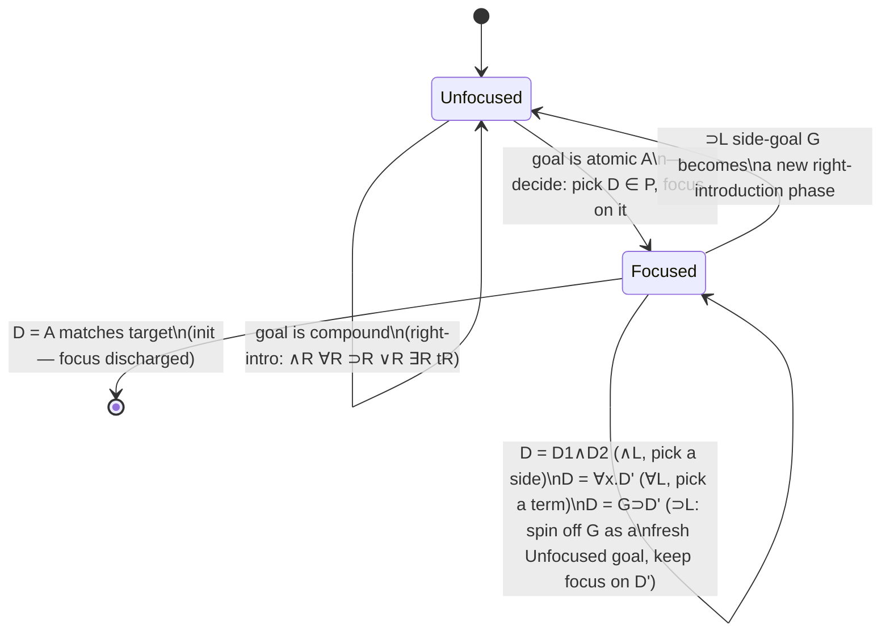
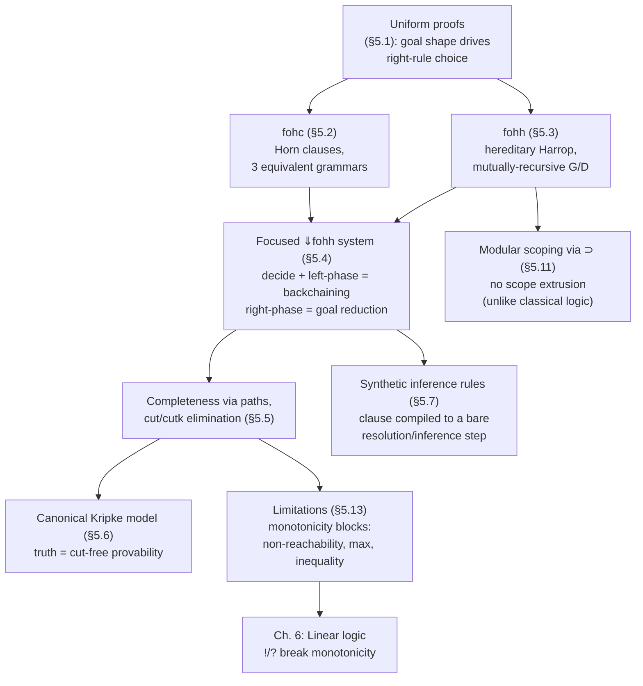

# Goal-Directed Proof Search and Uniform Proofs

[[book-guidelines|↩ Back to guidelines]]

## Why a proof system needs to become an interpreter

Chapters 3 and 4 built sequent calculus as a *description* of provability: given a sequent, there are many possible last inference rules, and the calculus doesn't tell you which one to try first. That's fine for metatheory, but it's useless as an algorithm. If you're going to execute a logic program — treat "is this sequent provable?" as "run this query" — you need to strip away the nondeterminism until what's left is closer to an interpreter loop than to an oracle.

This chapter does exactly that, in three tightening passes:

1. **Uniform proofs** — restrict *which* inference rule can be the last step of a (partial) proof, based purely on the shape of the goal. This is a proof-search *discipline*, not yet an algorithm.
2. **Focusing** (the $\Downarrow$ system) — go further and restrict *when* you're even allowed to look at the left-hand side ([[Linear-Logic-Programming#The program|the program]]), bundling each visit to a clause into one atomic, contiguous burst of work. This is the algorithm — it's what a Prolog or λProlog interpreter actually does on every call.
3. **Synthetic inference rules** — compress each such burst into a single derived rule that mentions no logical connectives at all. This is the "compiled" view: a program clause has become a resolution/backchaining step, indistinguishable in shape from a hand-written inference rule.

If you're building an embedded theorem prover that checks programs against logic-clause specifications — which is exactly the target system this reading is feeding — this chapter *is* the mechanism. Everything else in the book either motivates this construction (Chapters 1–4) or generalizes it (Chapter 6 onward, to [[Linear-Logic|linear logic]]). Read closely.

## Uniform proofs: formalizing "goal-directed"

Picture an idealized interpreter state as the two-sided sequent $\Sigma :: P \vdash G$: $\Sigma$ is a signature (the currently declared eigenvariables/constants — think of it as the interpreter's symbol table), $P$ is the program (a set of assumed formulas), and $G$ is the goal you're trying to establish from $P$.

The intuitive interpreter behavior is: look at the *top-level connective of the goal* and let it dictate the next step, without ever consulting the program, until the goal becomes atomic — only then do you consult $P$. Concretely, instantiating Gentzen's right-introduction rules against this idea gives six strategies (conjunction splits into two goals, disjunction picks a side, existential picks a witness, implication moves its antecedent into the program, universal picks a fresh eigenvariable, and $\mathsf t$ succeeds immediately). This yields the formal definition:

> A cut-free I-proof $\Xi$ is a **uniform proof** if every sequent in $\Xi$ whose right-hand side is non-atomic is the conclusion of a right-introduction rule.

In other words: work top-down; every time the goal has a connective, use *that connective's* rule — no shortcuts through the program, no identity or structural rule fired early. Left rules and the identity rule are permitted only once the goal has become atomic.

**What breaks without this restriction.** Without it, proof search degenerates into "try every applicable rule, including left rules on program formulas, even while the goal is still a compound formula" — the search space explodes combinatorially, because now every step has to consider both what the goal says *and* what's sitting in the (possibly huge) program. Uniform proofs prune this: the goal's syntax alone drives search until you hit bedrock (an atom), and only then does the program get consulted.

But uniform proofs are not automatically complete. The book gives explicit witnesses:

- $\Sigma :: (ra \wedge rb) \supset q \vdash \exists x (rx \supset q)$ and $\Sigma :: \cdot \vdash p \vee (p \supset q)$ have **C-proofs but no I-proofs** at all (so certainly no uniform proof — you can't out-restrict what wasn't there to begin with).
- $\Sigma :: p \vee q \vdash q \vee p$ and $\Sigma :: \exists x. rx \vdash \exists x. rx$ have **I-proofs but no uniform proof** — provable intuitionistically, but not by the disciplined top-down strategy. (Try it: proving $q \vee p$ from $p \vee q$ genuinely requires case-splitting on the *hypothesis* $p \vee q$ before you can commit to a disjunct on the right — a left rule applied to a non-atomic goal.)

So completeness of uniform proofs is a property of a *pair* (which connectives you allow, which logic you're targeting), not a free theorem. This motivates a formal object:

> An **abstract logic programming language** is a triple $\langle D, G, \vdash_{\mathcal X}\rangle$ such that for every signature $\Sigma$, finite set $P$ of $\Sigma$-formulas from $D$, and $\Sigma$-formula $G$ from $\mathcal G$: $\Sigma :: P \vdash_{\mathcal X} G$ iff $\Sigma :: P \vdash G$ has a uniform proof.

$D$ is the syntactic class allowed as program clauses, $\mathcal G$ the class allowed as goals, and $\vdash_{\mathcal X}$ some target provability relation (classical, intuitionistic, or minimal). The rest of the chapter is about identifying which $(D, \mathcal G)$ pairs make this triple actually hold — i.e., where uniform-proof search is complete.

Two structural corollaries fall out whenever uniform proofs *are* complete for a given $\Delta$: the **disjunction property** ($\Delta \vdash B \vee C$ provable implies $\Delta \vdash B$ or $\Delta \vdash C$ provable) and the **existence property** ($\Delta \vdash \exists x.B$ provable implies some witnessing term $t$ with $\Delta \vdash B[t/x]$ provable). These are exactly the semantic guarantees you want from something you're calling a "logic programming language": a disjunctive or existential query doesn't just have an abstract proof of existence, it has a *constructive* answer you can read off.

## Horn clauses (fohc): three ways to say the same thing

The classical (refutation-based) definition of a Horn clause is a disjunction of literals with at most one positive literal:
$$\forall x_1 \ldots \forall x_n [\neg A_1 \vee \cdots \vee \neg A_m \vee B_1 \vee \cdots \vee B_p], \quad p \le 1.$$
If $p=1$ it's a **positive** Horn clause (a "fact-or-rule"); if $p=0$ it's **negative** (a denial/goal clause). This is the SLD-resolution presentation — useful historically, but it isn't shaped like a sequent-calculus object.

Moving to goal-directed sequent proof, Miller gives three equivalent grammars, all mutually derivable via *curry/uncurry* equivalences (provable in intuitionistic logic):
$$\mathsf t \supset E \equiv E, \quad (B\wedge C)\supset E \equiv B \supset C \supset E, \quad (B\vee C)\supset E \equiv (B\supset E)\wedge(C\supset E), \quad (\exists x.B)\supset E \equiv \forall x.(B\supset E).$$

**Presentation (5.1)** — the "obvious" translation of the classical form:
$$G ::= A \mid G\wedge G \qquad D ::= A \mid G \supset A \mid \forall \tau x\, D.$$
Program clauses look like $\forall \bar x.(A_1 \wedge \cdots \wedge A_m \supset A_0)$.

**Presentation (5.2)**, richer (goals can use $\vee,\exists$ freely; program clauses can be $\wedge$-conjoined):
$$G ::= \mathsf t \mid A \mid G\wedge G \mid G\vee G \mid \exists\tau x.G \qquad D ::= \mathsf t \mid A \mid G \supset D \mid D\wedge D \mid \forall \tau x. D.$$

**Presentation (5.3)**, the leanest — only implication and universal quantification, no connectives left of an implication:
$$G ::= A \qquad D ::= A \mid A \supset D \mid \forall \tau x.D,$$
giving clauses of the "nested implication" shape $\forall \bar x_1(A_1 \supset \forall \bar x_2(A_2 \supset \cdots \supset \forall \bar x_m(A_m \supset \forall \bar x_0 A_0)\cdots))$ — this is the *uncurried* Horn clause, one antecedent implication per body atom, which is what a resolution-style interpreter actually walks through argument by argument.

All three define the same informal language, **fohc**. The chapter proves (Prop. 5.5) something worth pausing on: restricted to $D_1/G_1$ (presentation 5.2), a sequent has a **C-proof iff it has an I-proof** — classical and intuitionistic provability *coincide* on Horn-clause data. This is a converging-to-determinism result: the extra freedom of classical logic (multiple conclusions, unrestricted contraction/weakening on both sides) buys nothing once you're confined to Horn shape, because Horn clauses just don't have the syntactic room to exploit classical-only reasoning (no genuine disjunction survives on the left, no $\mathsf f$ can appear). It's the first hint that Horn-clause logic programming is a genuinely *constructive* fragment, not merely a classical one restricted after the fact.

## Hereditary Harrop formulas (fohh): letting goals get richer

Horn clauses only allow *atoms* as goals in the body of a rule (module conjunction). **First-order hereditary Harrop formulas (fohh)** extend this by allowing implications and universal quantifiers *inside goals* — which means program clauses can now have hypothetical and generic sub-goals in their bodies. The definition is necessarily **mutually recursive** between $G$ (goals) and $D$ (definite clauses), because now a $D$-formula can occur negatively inside a $G$-formula and vice versa:

$$G ::= A \mid G\wedge G \mid D \supset G \mid \forall x.G \qquad D ::= A \mid G \supset A \mid \forall x. D. \tag{5.4}$$

A richer version (5.5) additionally allows $\mathsf t, \vee, \exists$ in goals; this is the definition used by default for the rest of the chapter, and $\mathcal D_2/\mathcal G_2$ denote its formula classes.

There's also a **fully symmetric** presentation, where $G$ and $D$ range over literally the same grammar:
$$G ::= \mathsf t \mid A \mid D\supset G \mid G\wedge G \mid \forall x.G \qquad D ::= \mathsf t \mid A \mid G\supset D \mid D\wedge D \mid \forall x. D. \tag{5.6}$$
Formulas built from just the connective set $L_0 = \{\mathsf t, \wedge, \supset, \forall\}$ under this symmetric grammar are called **$L_0$-formulas**, and they will be the workhorse of the completeness argument in the next section — precisely because $L_0$'s connectives all have *invertible* right-introduction rules (you never need to backtrack over a right rule) while their left-introduction rules are not invertible (that's where all the search-relevant choice lives).

**What fohh buys you, concretely:** a program clause can require, to derive its head, that you assume a *new, locally scoped hypothesis* and prove a subgoal under it — e.g. "$X$ is sterile if, for every bacterium $y$ possibly in $X$, assuming $y \in X$ lets you derive $y$ is dead." That's a $\forall y.(\text{in } y\ X \supset \text{dead } y) \supset \text{sterile } X$ clause — syntax Horn clauses simply cannot express, because Horn program clauses can't have $\supset$ or $\forall$ *inside* a goal position.

Two structural facts anchor fohh as a genuine abstract logic programming language:

- **Proposition 5.11**: cut-free I-proofs preserve the $D_2/G_2$ split — every intermediate sequent still has program-formulas on the left and a goal-formula on the right. The syntactic discipline is *self-maintaining* under proof search.
- **Proposition 5.13** (via Lemma 5.12, a permutation argument): every cut-free I-proof of a $\mathcal D_2/\mathcal G_2$ sequent can be rewritten into a **uniform** proof, by permuting left rules up past right-introduction rules wherever they'd otherwise interrupt a right-introduction phase. This is the completeness theorem for uniform proofs restricted to fohh — the crucial fact that makes fohh an abstract logic programming language, $\langle \mathcal D_2, \mathcal G_2, \vdash_I\rangle$.

By contrast, $\langle \mathcal D_2, \mathcal G_2, \vdash_C\rangle$ — the *classical* version — is **not** an abstract logic programming language: there are $\mathcal G_2$ formulas with classical proofs and no uniform proof. Uniform-proof completeness is specifically an intuitionistic (or minimal-logic — fohh formulas never contain $\mathsf f$, so intuitionistic and minimal provability coincide here) phenomenon.

## Backchaining as focused rule application

Uniform proofs tell you what to do when the goal is *non-atomic*: apply the matching right rule. They say nothing about what to do once the goal is atomic — that's where you have to consult $P$, and *that's* where all the real search-space explosion in naive interpreters happens, because in principle any left rule on any formula in $P$ might be tried.

The chapter tightens this with two observations about left rules restricted to atomic-conclusion sequents:

1. Weakening on the left can always be delayed until immediately before the identity rule, so we can fold it into a derived rule $\Sigma :: \Gamma, B \vdash B$ — an identity rule that doesn't require $\Gamma$ to consist of *only* $B$.
2. $\supset L$ — the one multiplicative left rule, whose naive form requires *splitting* the right-hand-side multiset between two premises — can, in the single-conclusion (I-proof) setting, be simplified to
$$\frac{\Sigma :: \Gamma \vdash B \qquad \Sigma :: C, \Gamma \vdash E}{\Sigma :: B\supset C, \Gamma \vdash E}$$
using contraction to duplicate $\Gamma$ rather than split it.

Now specialize this to $A$ atomic and $G \supset D$ a member of $P$:
$$\frac{\Sigma :: P \vdash G \quad \Sigma :: D, P \vdash A}{\Sigma :: G\supset D, P \vdash A}\ {\supset L}, \quad\text{then}\quad \frac{\cdots}{\Sigma :: P \vdash A}\ cL.$$
You copy $G\supset D$ (contraction), split off the implication, prove the antecedent $G$ as a fresh goal, and continue trying to prove the original atom $A$ but now with $D$ *also* available. That's exactly what "using a clause" means operationally: check its premises, then keep going with its conclusion added to what you know. Miller formalizes this by introducing a **focused sequent**: $\Sigma :: P \Downarrow D \vdash A$. The formula $D$ between $\Downarrow$ and $\vdash$ is the **focus** — the *only* formula that left-introduction rules are permitted to act on, for as long as the focus persists.

### The $\Downarrow$fohh proof system

Two disjoint kinds of sequent, two disjoint sets of rules:

- **Unfocused, right-introduction rules** (act on $\Sigma :: P \vdash G$; standard right rules for $\wedge,\vee,\exists,\forall,\supset,\mathsf t$, plus the **decide** rule $\dfrac{\Sigma :: P\Downarrow D \vdash A}{\Sigma :: P \vdash A}$ where $D \in P$ — this is the *only* way to enter a focused sequent).
- **Focused, left-introduction rules** (act on $\Sigma :: P \Downarrow D \vdash A$; $\wedge L,\forall L,\supset L$ acting purely on the focus, plus **init**: $\Sigma :: P \Downarrow A \vdash A$).

A **right-introduction phase** is a maximal run of right rules — it's the "goal reduction" you already know from uniform proofs, and (in $L_0$, where every right rule is invertible) it is *unique up to eigenvariable renaming* given its endsequent: no choice, no backtracking, purely mechanical unfolding. A **left-introduction phase** is a maximal run starting with decide, walking down through the focused formula's own logical structure via $\wedge L/\forall L/\supset L$, and terminating in init — this is "backchaining": pick a clause, then chase its implication chain, discharging each antecedent as a fresh (unfocused) goal, until the clause's conclusion matches the atom you were trying to prove.



This diagram *is* a Prolog/λProlog interpreter loop: "Unfocused" is "what am I trying to prove right now," "decide" is "pick a clause whose head might match," "Focused" is "walk the clause's argument structure, proving each premise as I go." The alternation is exactly resolution's alternation between selecting a clause and proving its subgoals.

**Rust grounding.** This maps almost verbatim onto a small interpreter. Represent goals/clauses as terms, keep a substitution/environment for unification, and structure the solver as mutually recursive functions matching the two phases:

```rust
// A minimal fohc solver: the decide/backchain loop as literal Rust control flow.
// (Sketch — omits occurs-check, indexing, and proper renaming for brevity.)

#[derive(Clone, Debug)]
enum Term {
    Var(usize),
    App(String, Vec<Term>),
}

#[derive(Clone)]
struct Clause {
    head: Term,          // the atomic conclusion A
    body: Vec<Term>,     // A1, ..., Am  (the antecedents, i.e. the goal G)
}

struct Program {
    clauses: Vec<Clause>,
}

// `prove_goal` is the right-introduction ("unfocused") phase: for Horn
// clauses the only goal-level connective is ∧, so it's just "prove every
// conjunct." A richer fohh solver would branch here on ⊃, ∀, ∨, ∃ too.
fn prove_goal(prog: &Program, goals: &[Term], env: &mut Subst) -> bool {
    match goals.split_first() {
        None => true, // t : empty conjunction, immediate success
        Some((g, rest)) => backchain(prog, g, env) && prove_goal(prog, rest, env),
    }
}

// `backchain` is the decide + focused left-introduction phase: try each
// clause D ∈ P as the "focus," unify its head with the atom A, and if it
// matches, recurse into its body as fresh goals — this is ⊃L applied
// repeatedly down the clause's implication chain, terminated by init.
fn backchain(prog: &Program, atom: &Term, env: &mut Subst) -> bool {
    for clause in &prog.clauses {
        let (head, body) = rename_fresh(clause); // fresh eigenvariables per attempt
        let mark = env.mark();
        if unify(&head, atom, env) && prove_goal(prog, &body, env) {
            return true; // init reached: this path through the clause succeeded
        }
        env.undo_to(mark); // backtrack: try the next clause (don't-know choice)
    }
    false
}
```

`backchain`'s `for clause in &prog.clauses` loop *is* the decide rule made concrete — "pick $D \in P$" becomes "iterate candidates and try unification." The recursive call into `prove_goal` on the clause's body *is* the sequence of $\supset L$ steps peeling antecedents off the focused formula. Nothing here is a metaphor; it's the same control structure the book derives by permutation arguments, just realized as executable code instead of a derivation tree. If you're writing a verifier that checks a Rust program against logic-clause specs, this pairing (`backchain` ↔ decide/focus, `prove_goal` ↔ goal-reduction phase) is the literal shape your solver's inner loop should take — and the completeness theorems below are exactly what let you trust that this loop, if it terminates with a `true`, has actually found a genuine proof.

**What breaks without focusing.** Without the discipline of "once you decide on $D$, you must consume $D$'s entire structure before returning to an unfocused goal," an interpreter loop has no principled place to stop backtracking into the choice of *which subformula of which clause* to work on next — you'd be re-deciding at every left rule, not just once per clause use, and the "one loop iteration per program-clause application" correspondence with resolution breaks down entirely.

## Completeness of focused proofs

Restricting to a proof discipline is worthless if it's *incomplete* — if some intuitionistically provable sequent has no proof respecting the discipline. This section is the technical heart of the chapter: it proves the $\Downarrow L_0$ system loses nothing.

**Paths.** The key combinatorial tool is the notion of a **path** through an $L_0$-formula $B$, defined by the two-place relation $B \uparrow P$:
$$\frac{}{A \uparrow A} \qquad \frac{B\uparrow P}{B\wedge C \uparrow P} \qquad \frac{C\uparrow P}{B\wedge C\uparrow P} \qquad \frac{C\uparrow P}{B\supset C \uparrow B\supset P} \qquad \frac{B\uparrow P}{\forall x.B \uparrow \forall x.P}$$
A path has the shape $\forall \bar x_1.(G_1 \supset \forall \bar x_2.(G_2 \supset \cdots \supset \forall \bar x_n.(G_n \supset \forall \bar x_0.A)\cdots))$, with target atom $A$, argument list $G_1,\ldots,G_n$, and bound variables $\bar x_0,\ldots,\bar x_n$ — equivalently the sequent $\bar x_0,\ldots,\bar x_n :: G_1,\ldots,G_n \vdash A$. Concretely, the paths of $\forall x.p(x)\supset((\forall y.q(x,y)\supset(r(x,y)\wedge r(y,x)))\wedge p(x))$ are the three routes down its $\wedge$/$\supset$ skeleton to each of the three atoms $r(x,y)$, $r(y,x)$, $p(x)$.

Two propositions pin down exactly how paths correspond to the two phases:

- **Prop. 5.19**: the premises of the right-introduction phase for $\Sigma :: \Gamma \vdash B$ correspond *one-to-one* with the paths of $B$.
- **Prop. 5.20**: the premises of a left-introduction phase for $\Sigma :: \Gamma \Downarrow B \vdash A$ correspond to *some single* path in $B$ whose (instantiated) target matches $A$.

I.e. all paths describe the right phase (you must resolve every one), one path describes any given left phase (you commit to one route through the focus). This asymmetry is exactly why left rules are the source of don't-know nondeterminism and right rules aren't, in $L_0$.

**Admissibility of a general initial rule (Thm 5.22).** The identity rule as originally stated only applies to *atomic* $B$. The theorem shows $\Sigma :: \Gamma \vdash B$ has a $\Downarrow L_0$-proof whenever $B \in \Gamma$, for *arbitrary* $L_0$-formula $B$ — proved by induction on $B$'s structure using the path correspondence: decide on $B$ itself, follow the path that matches each premise of the right phase.

**Cut elimination.** Two auxiliary rules are introduced for the argument (Fig. 5.2):
$$\text{cut: } \frac{\Sigma :: \Gamma \vdash B \quad \Sigma :: \Gamma, B \vdash C}{\Sigma :: \Gamma \vdash C} \qquad \text{key-cut (}cut_k\text{): } \frac{\Sigma :: \Gamma \vdash B \quad \Sigma :: \Gamma \Downarrow B \vdash A}{\Sigma :: \Gamma \vdash A}$$
The elimination proceeds in the classic two-step ping-pong pattern: **Lemma 5.24** rewrites a topmost `cut` into (possibly several) `cutk` instances, by pushing the cut formula's proof into every place `decide` picks it out; **Lemma 5.26** rewrites a topmost `cutk` into (possibly several) `cut` instances **on strictly smaller cut formulas**, by using the path correspondence to match the focus's left-phase premises against the corresponding premises of the right phase that proved $B$. Interleaving these two rewrites, with the second one strictly decreasing formula size, terminates (**Lemma 5.27, Theorem 5.28**): every $\Downarrow^+L_0$-proof (i.e., allowing cut/cutk) reduces to a cut-free $\Downarrow L_0$-proof.

From cut-elimination, everything downstream is nearly free:

- **Theorem 5.29** (completeness of $\Downarrow L_0$ for $L_0$-formulas): every cut-free I-proof restricted to $L_0$ has a $\Downarrow L_0$-proof — proved by showing *all* the I-proof system's rules ($\wedge L,\supset L,\forall L$, weakening, contraction, identity) are admissible in $\Downarrow L_0$, leaning on Theorem 5.22 and cut-elimination for each.
- **Theorem 5.30 / 5.31**: cut and the term-instantiation rule ("instan") are both admissible for cut-free I-proofs restricted to $L_0$ — the *unfocused* proof system inherits the same admissibility results, "for free," by routing through the focused system and back.

**Lean/metatheory framing.** This is a textbook instance of the pattern you'll recognize from proof assistants: cut-elimination here plays the same role as *normalization* does for a type theory's reduction relation — both are the technical linchpin that lets you replace "provable by some possibly-detour-laden derivation" with "provable by a canonical, structurally-decreasing derivation," and both proofs proceed by a measure that strictly decreases on some syntactic complexity of the eliminated object (cut-formula size here; term size in normalization proofs). If your elaborator's kernel ever needs "every valid derivation can be replaced by one respecting a fixed discipline" — e.g. for a bidirectional type checker where you want to show the check/synthesis split loses no typability — this is the same argument shape, and this section is a clean worked model of how to actually carry it out (introduce an auxiliary cut rule, prove two mutually-decreasing rewrites, combine by nested induction).

## A canonical Kripke model

Sections so far were purely proof-theoretic (about derivations). This section switches to model theory (about truth) — and shows the two coincide *exactly* once cut and instan are admissible.

A **world** is a pair $\langle \Sigma, P\rangle$: a signature plus a set of $L_0$ formulas over it. Worlds are ordered by $\langle\Sigma,P\rangle \preceq \langle\Sigma',P'\rangle$ iff $\Sigma\subseteq\Sigma'$ and $P \subseteq P'$ — you can only move to worlds with a bigger vocabulary and more assumptions ("growing" the interpreter's state, in the fohh sense from Section 5.12). A Kripke model $\langle W,I\rangle$ has an order-preserving interpretation $I$ assigning each world a set of atoms it satisfies. Satisfaction $I,\langle\Sigma,P\rangle \Vdash B$ is defined by the standard Kripke clauses — most notably implication is genuinely *modal*: $B\supset B'$ holds at $w$ iff $B'$ holds at *every* accessible world where $B$ holds, in contrast to *proving* $B\supset B'$, which only requires moving to *one* new world $\langle \Sigma, P\cup\{B\}\rangle$ and proving $B'$ there. This gap between "prove in one extension" and "true in all extensions" is precisely what soundness/completeness has to bridge.

The **canonical model** for a world $\langle\Sigma,P\rangle$ takes as its worlds every extension $\langle\Sigma',P'\rangle \succeq \langle\Sigma,P\rangle$, and interprets each world by *literal cut-free provability*: $I(\langle\Sigma',P'\rangle)$ is the set of atoms $A$ such that $\Sigma' :: P' \vdash A$ has a cut-free I-proof. It's an infinite structure (countably many worlds), but it's built entirely out of syntax — no set-theoretic magic, just "provability, reified as a model."

**Lemma 5.32** is the pivot: cut/instan admissibility for cut-free I-proofs holds *iff* truth in the canonical model coincides with provability, $\Sigma :: P \vdash B$ iff $I,\langle\Sigma,P\rangle \Vdash B$. Proved by structural induction pairing each connective's proof-theoretic behavior against its Kripke clause (e.g., for $\supset$: cut lets you transport a proof of $B_1$ available at any extended world into a proof of $B_2$, matching exactly what the Kripke implication clause demands). Given Theorems 5.28/5.31 (already established), this delivers **Theorem 5.33**: for the canonical model built from $\langle\Sigma,P\rangle$, $\Sigma :: P \vdash_I B$ iff $I \Vdash B$ — provability *is* truth-in-this-one-model, no quantification over "all models" required. That's the sense in which the model is "canonical": it's not merely sound and complete like any Kripke semantics for intuitionistic logic — it's a single, syntactically-constructed model that already settles the question for every formula built over its signature.

**Why this matters beyond elegance.** A canonical model is a semantic *proof-theoretic tool*, not decoration: it's the standard way of showing conservativity and consistency results (Section 5.13's negative results — "you cannot express non-reachability" — are ultimately arguments of this Kripke-model flavor, showing no accessible world distinguishes reachable from unreachable configurations the way the target predicate would need). If your elaborator or verifier ever needs to argue "this fragment of my specification language cannot express property X," building (or gesturing at) a small canonical countermodel is usually the cleanest route, mirroring exactly what Section 5.13 does informally.

## Synthetic inference rules: compiling clauses into inference rules

The left-introduction phase for a decided formula $D$ can be collapsed into a *single* derived rule, formalized via a generalized backchaining relation. Define $|\Gamma|_\Sigma$ as the smallest set of pairs $\langle \Delta, D\rangle$ ($\Delta$ a multiset of formulas, $D$ a formula) such that:

1. if $D \in \Gamma$ then $\langle\emptyset, D\rangle \in |\Gamma|_\Sigma$;
2. if $\langle\Delta, D_1\wedge D_2\rangle \in |\Gamma|_\Sigma$ then both $\langle\Delta,D_1\rangle$ and $\langle\Delta,D_2\rangle \in |\Gamma|_\Sigma$;
3. if $\langle\Delta, G\supset D\rangle \in |\Gamma|_\Sigma$ then $\langle\Delta\cup\{G\}, D\rangle \in |\Gamma|_\Sigma$;
4. if $\langle\Delta,\forall\tau x\,D\rangle \in |\Gamma|_\Sigma$ and $t$ a $\Sigma$-term of type $\tau$, then $\langle\Delta, D[t/x]\rangle \in |\Gamma|_\Sigma$.

This is exactly "unfold a program clause's structure, collecting the antecedents you'll owe as new goals." The **backchaining rule** is then
$$\frac{\{\Sigma :: \Gamma \vdash G \mid G \in \Delta\}}{\Sigma :: \Gamma \vdash A}\ \mathrm{BC},\quad \text{provided } A \text{ atomic and } \langle\Delta,A\rangle \in |\Gamma|_\Sigma,$$
and this rule, combined with the right-introduction rules, is *equi-provable* with the $\Downarrow$ system (Prop. 5.36) — the focused system is just BC with its internal decide/left-phase machinery made explicit.

**Worked example (paths and adjacency).** Given the clauses $\forall x\forall y[\text{adj}\ x\ y \supset \text{path}\ x\ y]$ and $\forall x\forall y\forall z[\text{adj}\ x\ y \wedge \text{path}\ y\ z \supset \text{path}\ x\ z]$, deciding on the second and walking the $\Downarrow$fohh phases produces the seven-rule derivation shown in the book, which — once you erase the logical connectives from view — is just:
$$\frac{\Sigma::\Gamma,P \vdash \text{adj}\ s\ u \qquad \Sigma::\Gamma,P \vdash \text{path}\ u\ t}{\Sigma::\Gamma,P \vdash \text{path}\ s\ t}$$
and deciding on the first clause gives $\dfrac{\Sigma::\Gamma,P \vdash \text{adj}\ s\ t}{\Sigma::\Gamma,P \vdash \text{path}\ s\ t}$. These are the two *inference rules* a resolution-based reachability checker would use, derived rather than postulated. Formally:

> A **border sequent** is $\Sigma :: \Gamma \vdash A$ ($A$ atomic) — it sits at the boundary between a right phase (below) and a left phase (above). A **synthetic inference rule** is what results from moving up from a border sequent through decide, through the entire left phase, and then through any resulting right phases, until only border sequents remain — those remaining border sequents are its premises.

For pure Horn clauses, synthetic rules mention only atoms — the logic has been *compiled away* entirely, leaving pure resolution steps (Exercise 5.37 makes this precise: clausal order $\le 2$ guarantees atom-only synthetic rules). For higher-order-clause-order formulas, synthetic rules retain logical structure in their premises — e.g. focusing on $((p\supset q)\supset r)\supset s$ yields $\dfrac{\Gamma, p\supset q \vdash r}{\Gamma \vdash s}$, a premise that still has an implication in it.

**This is the mechanism, stated plainly.** A logic program *is* a set of synthetic inference rules waiting to be extracted. Backchaining as focused rule application (previous section) is how you compute them on demand rather than precompiling them; synthetic rules are what you'd get if you compiled ahead of time. For a Rust verifier embedding a theorem prover against logic-clause specs, this is the difference between an interpreted Prolog engine (walk the $\Downarrow$fohh phases fresh on every call, as the sketch above does) and a compiled one (turn each clause into a native Rust match-arm/inference-rule once, ahead of time) — both are faithful to the same semantics, and this section is the proof that the compiled view is sound.

## Disjunctive and existential goals via non-logical constants

$L_0$ deliberately excludes $\vee$ and $\exists$ because their left-introduction rules are non-invertible in a way that breaks the clean path/border-sequent story. But fohh (definition 5.5) *does* allow $\vee,\exists$ on the right of goals. The trick: introduce non-logical constants $\hat\vee : o\to o\to o$ and $\hat\exists^\tau : (\tau\to o)\to o$, governed by the Horn clauses
$$\forall P\forall Q[P \supset (P\ \hat\vee\ Q)], \quad \forall P\forall Q[Q\supset(P\ \hat\vee\ Q)], \quad \forall B\forall t[(B\ t)\supset(\hat\exists^\tau B)],$$
whose synthetic rules are exactly the $\vee R$/$\exists R$ rules you'd want:
$$\frac{\Sigma::P,C\vdash P}{\Sigma::P,C\vdash P\hat\vee Q} \quad \frac{\Sigma::P,C\vdash Q}{\Sigma::P,C\vdash P\hat\vee Q} \quad \frac{\Sigma::P,C\vdash B\ t}{\Sigma::P,C\vdash \hat\exists^\tau B}.$$
(These clauses are technically *higher-order* Horn clauses — the quantifiers range over predicate/type-$o$ arguments, formally treated in Chapter 9 — but their behavior is exactly first-order in spirit.) This lets **Proposition 5.38** establish full completeness of $\Downarrow$fohh-proofs for fohh: any I-proof of a full fohh sequent can be systematically rewritten, replacing every $\vee R/\exists R$ step by a decide-step on the corresponding $\hat\vee/\hat\exists$ clause, into an $L_0$-only proof — then Theorem 5.29 finishes the job, and the $\hat\vee/\hat\exists$ decide-steps get converted back into the right rules they were emulating. Disjunction and existence aren't primitive to the focused calculus; they're *derived* by encoding them as one more pair of clauses the interpreter can decide on.

## λProlog syntax and worked programs

The book's example programs use λProlog surface syntax: `kind tok type.` declares a primitive type; `type tok <type-expr>.` declares a constant/predicate's type; `:-` is the *converse* of $\supset$ (so `H :- B` means $B \supset H$); `,` (binding tighter than `:-`/`;`) is conjunction of goals; `;` is disjunction; `&` is conjunction of *program clauses* (semantically the same $\wedge$, syntactically distinguished — it becomes a genuinely different linear-logic connective once Chapter 6 arrives); capitalized tokens are implicitly universally quantified with scope over one clause (terminated by `.`); `pi x\ ...` is explicit universal quantification with maximal right scope.

Arithmetic and comparisons over `nat` (Peano-encoded, constructors `z`, `s`):

```prolog
kind nat                  type.
type z                     nat.
type s                     nat -> nat.
type sum                   nat -> nat -> nat -> o.
type leq, greater          nat -> nat -> o.

sum z N N.
sum (s N) M (s P) :- sum N M P.
leq z N.
leq (s N) (s M)    :- leq N M.
greater N M        :- leq (s M) N.
```

Lists, and computing a running sum / a maximum:

```prolog
kind list                  type -> type.
type nil                   list A.
type ::                    A -> list A -> list A.
infixr :: 5.
type sumup, max            list nat -> nat -> o.
type maxx                  list nat -> nat -> nat -> o.

sumup nil z.
sumup (N :: L) S    :- sumup L T, sum N T S.

max L M             :- maxx L z M.
maxx nil A A.
maxx (X :: L) A M   :- leq X A,     maxx L A M.
maxx (X :: L) A M   :- greater X A, maxx L X M.
```

A directed graph and reachability:

```prolog
kind node                  type.
type a, b, c, d, e, f      node.
type adj, path             node -> node -> o.

adj a b & adj b c & adj c d & adj a c & adj e f.
path X X.
path X Z :- adj X Y, path Y Z.
```

`memb`/`append`/quicksort-style `sort`:

```prolog
type memb    A -> list A -> o.
type append  list A -> list A -> list nat -> o.
type sort    list nat -> list nat -> o.
type split   nat -> list nat -> list nat -> list nat -> o.

memb X (X :: L).
memb X (Y :: L) :- memb X L.

append nil L L.
append (X :: L) K (X :: M) :- append L K M.

split X nil nil nil.
split X (A :: L) (A :: S) B :- leq A X,     split X L S B.
split X (A :: L) S (A :: B) :- greater A X, split X L S B.
sort nil nil.
sort (X :: L) S :- split X L Sm Bg, sort Sm SmS,
                    sort Bg BgS, append SmS (X :: BgS) S.
```

And the fohh-only example (McCarthy's sterile jar), which genuinely needs implicational goals:

```prolog
kind jar, bacterium         type.
type j                      jar.
type sterile, heated        jar -> o.
type dead                   bacterium -> o.
type in                     bacterium -> jar -> o.

sterile X :- pi y\ in y X => dead y.
dead X    :- heated Y, in X Y.
heated j.
```

`sterile X :- pi y\ in y X => dead y` reads as $\forall x.(\forall y.(\text{in } y\ x \supset \text{dead } y) \supset \text{sterile } x)$: to prove the jar is sterile, you don't enumerate bacteria — you prove a *generic* implication ("for any $y$ that might be in the jar, if it's in the jar, it's dead") without ever committing to a fixed roster of bacteria, or even declaring any constructors for the type `bacterium` at all. Its synthetic rule is
$$\frac{y:\text{bacterium},\ \Sigma :: P, \text{in}\ y\ x \vdash \text{dead}\ y}{\Sigma :: P \vdash \text{sterile}\ x},$$
directly witnessing why fohh strictly extends fohc: this quantified-hypothesis reasoning has no Horn-clause analogue.

The two `reverse` specifications side by side make the fohc→fohh gap concrete. In fohc:
```prolog
reverse L K :- rev L nil K.
rev nil L L.
rev (X :: M) N L :- rev M (X :: N) L.
```
versus the fohh version, which packs the accumulator relation into a *scoped, unary* auxiliary predicate that only exists for the duration of one call to `reverse`:
```prolog
reverse L K :- rv nil K => rv L nil.
rv (X :: M) N :- rv M (X :: N).
```
or fully self-contained, defining `rv`'s clauses as hypotheses local to the proof of `reverse` itself:
```prolog
reverse L K :-
  (pi X\ pi M\ pi N\ rv (X :: M) N :- rv M (X :: N)) =>
    rv nil K => rv L nil.
```
No other clause in the program can ever call `rv` — it's invisible outside this one derivation.

## Modular scoping and why classical logic can't do this

Implicational goals give fohh a genuine, logic-native module system. If `misc`, `classify`, and `scanner` each name a (possibly large) conjunction of clauses, the goal
$$\text{misc} \supset ((\text{classify}\supset G_1)\wedge(\text{scanner}\supset G_2)\wedge G_3)$$
runs $G_1$ against `misc`+`classify`, $G_2$ against `misc`+`scanner`, and $G_3$ against `misc` alone — `classify`'s code is genuinely unreachable while proving $G_2$. This is lexical scoping realized as nested implication: each $\supset$ extends the program (Section 5.12: the left context can only *grow* along any branch of a proof, never shrink or get replaced), giving exactly the nesting discipline a module system needs.

**What breaks without intuitionistic scoping.** Classical logic cannot support this discipline, because $B\supset C \equiv \neg B \vee C$ is classically provable, and disjunction commutes/associates freely. The three goals
$$D\supset(G_1\vee G_2), \quad (D\supset G_1)\vee G_2, \quad G_1\vee(D\supset G_2)$$
look like they give $D$ three different scopes — but classically they're all equivalent to $\neg D \vee G_1\vee G_2$. This is **scope extrusion**: $D$'s apparent locality to $G_1$ silently leaks across the entire disjunction. Intuitionistic logic (specifically, the absence of $\neg B\vee C$ as a valid rewrite of $B\supset C$) is what *prevents* this leakage and makes "the code in `classify` is unavailable while proving $G_2$" a statement that's actually true, not just syntactically suggestive. This is a genuinely load-bearing reason the book's account of logic programming lives in intuitionistic, not classical, logic — it isn't a stylistic preference.

## The limits of fohc/fohh

Section 5.13 catalogues what this fragment cannot express, and *why*, each traced back to a single structural fact — **monotonicity**: if $\Sigma::\Gamma\vdash_I G$ and $\Gamma\subseteq\Gamma'$, then $\Sigma::\Gamma'\vdash_I G$ (an immediate consequence of the weakening admissibility, Proposition 5.23). Once something is provable, adding more facts can never make it *stop* being provable. Every limitation below is really a proof that some target property is *not* monotone.

- **No non-reachability.** Encode a graph as `adj` facts (Figure 5.5's style). No fohh program can define a predicate true exactly of non-adjacent/non-reachable pairs, because "no path exists" would have to stop being true as soon as you assert one more `adj` fact linking them — but provability only grows.
- **No maximum "in logic."** If a set of numbers is encoded *logically* as a multiset of atoms $\{a\ n_1,\ldots,a\ n_k\}$ (rather than packed into one list term, as Figure 5.4 does), no fohh program can compute the max — same monotonicity obstruction: adding `a n'` for some larger `n'` must be able to *change* which atom counts as the max, but adding an atom can never invalidate an existing proof.
- **No inequality without constructors.** Given an abstract type `i` with no declared constructors, no fohh specification of list-element removal can be *fully general* (work regardless of what `i`'s inhabitants turn out to be) — because generality over the signature means [[Higher-Order-Quantification#The specification|the specification]] must remain provable under *any* instantiation of eigenvariables, including instantiations that collapse distinct elements onto the same term. The book's argument: if `remove` worked generically for `a`,`b`,`c` : `i`, then `pi a\ pi b\ remove a (a::b::a::nil) (b::nil)` would be provable — but any instance of that universal is then provable too, including the (wrong) instance `remove a [a,a,a] [a]`. The fix requires making inequality of constructors explicit and specific (as in the `notequal` clauses given for `remove`), which is exactly a constructor-based device, not a logical one.
- **Substitution predicates need similar care** — `subSome` (substitute *some* occurrences) is expressible; `subAll` (substitute *all* occurrences, generically over any extension of the signature with more constants of the relevant type) is not, and cannot be recovered by repeated calls to a `subOne` predicate either, for the same signature-extension argument.

These aren't bugs to patch inside fohc/fohh — they're the precise boundary of what "logic program as monotone intuitionistic implication" can mean, and they are exactly the limitations that motivate moving to **linear logic** in Chapter 6, where the exponentials $!$/$?$ let you *mark* which assumptions are persistent (reusable, like Horn-clause facts) versus which are single-use resources — breaking the blanket monotonicity that causes every limitation above.

## Structural synthesis



The dependency chain is linear and load-bearing: uniform proofs (§5.1) motivate restricting *which* rule fires; fohc/fohh (§5.2–5.3) are the syntactic fragments where that restriction is complete; focusing (§5.4) turns the restriction into an actual two-phase algorithm; §5.5–5.6 prove that algorithm loses nothing, via cut-elimination and a canonical model; §5.7 shows the algorithm compiles down to bare inference rules — the same content as a resolution engine, derived rather than assumed; §5.13 draws the fragment's expressiveness boundary, motivating everything that follows in the book.

**Direct bearing on your project.** This chapter is, essentially, the specification for the embedded theorem-prover component of a Rust verifier checking programs against logic-clause specs: the $D/\mathcal G$ grammars are your specification language's syntax; the $\Downarrow$fohh proof system is your solver's control-flow skeleton (decide ↔ clause selection, right-phase ↔ goal decomposition — the [[Linear-Logic-Programming#Rust sketch|Rust sketch]] above is not an analogy, it's close to literal); synthetic inference rules are what your solver produces if you choose to compile specs ahead of time instead of interpreting the focused phases on every call; and the monotonicity-driven limitations of §5.13 tell you, precisely, which properties your specification language will need linear-logic-style resource tracking (Chapter 6) to express — e.g., anything shaped like "exactly-once use," "no longer reachable," or "maximum so far" will hit this wall in a plain-Horn/hereditary-Harrop encoding.

For the meta-programming elaborator project: the $D/\mathcal G$ grammar split is a direct instance of the judgment-forms-as-shared-ancestor pattern — just as a type checker separates "checking" (analogous to goal-reduction, syntax-directed) from "synthesis"/unification (analogous to backchaining, where you search), the focused sequent's alternation between an invertible phase (no choice, like bidirectional type-checking's checking mode) and a non-invertible phase (real search, like metavariable resolution) is the same architecture. And the recurring plumbing thread — signatures $\Sigma$ growing along a proof branch, substitutions θ propagated through cut/instan-admissibility arguments — is precisely the context-and-substitution management your elaborator's unifier needs for pattern-unification-based implicit argument resolution: here it's dressed as eigenvariable signatures and term substitutions in cut-elimination lemmas; there it will be metavariable contexts and unifiers, but the bookkeeping discipline (growth is monotone, substitution commutes with weakening) is identical.

## Where this leads

Everything provable here rests on one structural assumption the chapter surfaces explicitly in §5.13: intuitionistic provability is *monotone* — assumptions, once available, are permanent and reusable without limit. That's exactly right for modeling persistent facts and rules, and exactly wrong for modeling resources that get consumed, states that change, or properties (like non-reachability) that need to become false as more is asserted. Chapter 6 replaces classical/intuitionistic logic with **linear logic**, where the exponentials $!$ (arbitrarily reusable, recovering everything in this chapter) and the *absence* of $!$ (used exactly once) let a logic program distinguish "always-true fact" from "resource consumed by this step" — and the two-zone sequent, Lolli, and Forum languages introduced there are a direct generalization of the $\Downarrow L_0$ focused system built here, not a different construction. The uniform-proof/focusing/synthetic-rule machinery of this chapter is reused wholesale; what changes is which structural rules (contraction, weakening) are available on which zone of the sequent.
