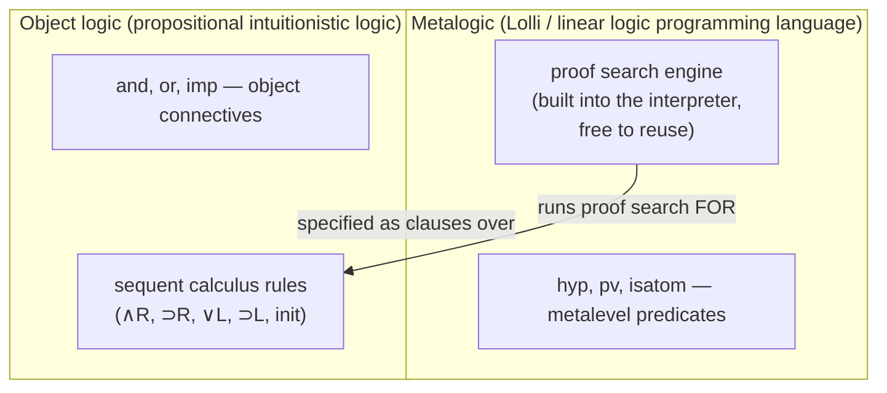

# [[Linear-Logic|Linear Logic]] Programming

[[book-guidelines|↩ Back to guidelines]]

## Why this chapter is the payoff

Everything up to this point in the book — [[The-Sequent-Calculus|the sequent calculus]], focusing, the L1/L2 goal-directed proof systems for linear logic — was machinery. This chapter is where the machinery starts *doing something you'd recognize as programming*. The core trick, stated as plainly as possible: **a linear logic context is a multiset, and linear logic's proof rules for consuming formulas out of that context are, operationally, exactly the rules for consuming items out of a `Vec` you're only allowed to move out of once.** Once you see that, every example in the chapter — permuting a list, rewriting a multiset, running a theorem prover — is just "what does it mean to run a program whose state is a multiset that you can only linearly consume."

This matters beyond the cute-encoding-trick level. Section 8.5 and Section 8.7 aren't warm-up exercises — they are a worked blueprint for writing a theorem prover's context-management logic as a logic program. If you're building something like a Rust verifier with an embedded prover, this chapter is close to a spec for the "hypothesis context" data structure and its manipulation rules.

---

## 1. Encoding multisets as formulas (§8.1)

### The problem

Logic programming languages built on classical or intuitionistic logic (Prolog, λProlog) have no native notion of "resource." A hypothesis, once added to a context, can be used zero, one, or a hundred times — that's what weakening and contraction give you for free. But lots of real computational problems are *inherently* about multisets: "I have these tokens, and I consume them as I go." Encoding that in a logic without resource sensitivity means writing accounting code by hand (counters, "used" flags). Linear logic's contraction- and weakening-free sequents give you multisets *natively*, at the level of the sequent itself.

### The two encodings

Let `item` be a one-place predicate; the atomic formula $\text{item}\ x$ denotes the singleton multiset $\{x\}$. There are two dual ways to combine such atoms into a formula denoting a whole multiset:

- **Conjunctive encoding**: use $1$ (multiplicative true) for the empty multiset and $\otimes$ (multiplicative conjunction/tensor) to combine multisets. The multiset $\{1,2,2\}$ becomes $\text{item}\ 1 \otimes \text{item}\ 2 \otimes \text{item}\ 2$. Proof search manipulates this multiset **on the left** of the turnstile — this is the style used with the intuitionistic-flavored $\Uparrow L_1$ presentation (Section 6.4).
- **Disjunctive encoding**: use $\bot$ for the empty multiset and $\parr$ ("par", multiplicative disjunction) to combine. Proof search manipulates the multiset **on the right** of the turnstile, which forces you into a *multiple-conclusion* sequent calculus like $\Uparrow L_2$ (Section 6.7).

This conjunctive/disjunctive duality is exactly the $\otimes$/$\parr$ duality baked into linear logic from the start, and the chapter exploits both halves: left-side multiset rewriting in §8.3–8.5 (conjunctive, $\otimes$), right-side multiset rewriting in §8.6–8.7 (disjunctive, $\parr$).

**Rust framing.** The conjunctive encoding is precisely a `Vec<T>` (or better, a multiset/bag type) with *move* semantics on its elements: an `item x` fact is a token you hand out of the collection, and once handed out it's gone — you cannot borrow it twice. `$\otimes$` is "these two multisets, disjoint, both consumed"; that's `Vec` concatenation where ownership of every element transfers. There is no `Clone` in this world unless you explicitly ask for one (that's what `!`, discussed below, buys you).

### Multiset inclusion, and why it needs a quantifier

Given $S = \text{item}\ s_1 \parr \cdots \parr \text{item}\ s_n$ and $T = \text{item}\ t_1 \parr \cdots \parr \text{item}\ t_m$ (disjunctive encodings), the book shows $S \multimap T$ is provable iff $T \multimap S$ is provable iff the two multisets $\{s_1,\dots,s_n\}$ and $\{t_1,\dots,t_m\}$ are literally equal as multisets (Exercise 8.1). Multiset *inclusion* $S \sqsubseteq T$ is subtler — you need to account for the leftover elements of $T$ not in $S$. Two ways to say it:

1. $S \parr 0 \multimap T$ — mixing multiplicatives with the additive $0$: $0$ can "absorb" whatever's left in $T$ that $S$ doesn't cover.
2. $\exists q.\,(S \parr q \multimap T)$ — a higher-order existential standing for "the difference." Nothing in the formula *forces* $q$ to actually be that difference; it's just some formula that happens to make the implication provable.

These two are provably equivalent:
$$\forall S.\forall T.\big[(S \parr 0 \multimap T) \between \exists q.(S \parr q \multimap T)\big]$$
where $B \between C$ abbreviates $(B \multimap C)\ \&\ (C \multimap B)$. This is a nice early signal of the chapter's recurring theme: additive connectives ($0$, $\&$) let you talk about "the rest" or "a choice," while multiplicatives ($\otimes$, $\parr$, $\multimap$) do the actual resource bookkeeping.

---

## 2. A Prolog/λProlog syntax for Lolli (§8.2)

To write real program clauses in the rest of the chapter, Miller extends Prolog/λProlog notation for linear logic's connectives. The mapping:

| Symbol | Meaning |
|---|---|
| `=>` | $\Rightarrow$ (intuitionistic implication, unbounded context) |
| `:-` | converse of $\multimap$ |
| `-o` | $\multimap$ (linear implication, bounded context) |
| `<=` | converse of $\Rightarrow$ |
| `&` | $\&$ (additive conjunction) |
| `erase` | $\top$ |

On top of these, five more connectives are *defined* (not primitive) via right-introduction clauses — a technique the book calls "definitions" (§5.8): a predicate whose clauses literally spell out how to introduce the connective it stands for.

```
type   true      o.
type   ,         o -> o -> o.
type   ;         o -> o -> o.
type   exists    (A -> o) -> o.
type   bang      o -> o.

true .
( P , Q ) :- P :- Q .
( P ; Q ) :- P .
( P ; Q ) :- Q .
exists B :- ( B T ).
bang G <= G .
```

Read operationally: `true` succeeds trivially (it's $1$); `,` (comma) is $\otimes$ — succeed on `P` and, independently, on `Q` — the clause body `P :- Q` is shorthand meaning "prove `P`, prove `Q`," splitting the bounded resources between them; `;` (semicolon) is $\oplus$ (additive disjunction — pick a side, don't split resources); `exists` is $\exists$, instantiate the bound variable and recurse; `bang G <= G` is $!G$ — provable exactly when `G` is provable *from an empty bounded zone* (more on this below, it's the crux of §8.3).

This is genuinely the "operator-overloading table" of the chapter — every subsequent program is written in this syntax, so it's worth having pinned above the rest.

---

## 3. Permuting a list: load/unload (§8.3)

### The idea before the code

Since the bounded (linear) part of a context is a *multiset*, not a list, you get list permutation almost for free: push a list's elements into the bounded context one at a time (destroying the list structure — order is gone, only multiplicity survives), then pull them back out one at a time in some — any — order. Because pulling-out is nondeterministic, backtracking over it enumerates every permutation.

### The program

```
type load            list A -> list A -> o.
type unload                     list A -> o.

load nil K           :- unload K .
load ( X :: L ) K    :- ( item X -o load L K ).
unload nil .
unload ( X :: L )    :- item X , unload L .
```

`load L K` walks down `L`, and for each element `X` it pushes `item X` into the bounded zone (via `-o`, i.e. $\multimap$) before recursing; once `L` is exhausted it calls `unload K`. `unload K` walks down `K`, and for each element demands that `item X` be *consumed* from the bounded zone (the comma splits resources between "consume this one item" and "unload the rest"), succeeding on `nil` only when the bounded zone is exactly empty.

The book states the correctness precisely, relative to a background theory $\Psi$ (everything except `item`/`load`/`unload`) and a bounded zone $\Delta$:

1. $\Sigma :: \Psi;\Delta \vdash (\text{unload}\ K); \cdot$ is provable iff $K$ has the same elements with the same multiplicities as $\Delta$.
2. $\Sigma :: \Psi;\Delta \vdash (\text{load}\ L\ K); \cdot$ is provable iff $K$'s elements-with-multiplicity are $L$'s together with $\Delta$'s.

### Rust sketch

```rust
// A multiset of "item" tokens standing in for the bounded zone.
// (In real Lolli this is enforced by the sequent calculus itself;
// here we make the linear discipline explicit with ownership.)
struct Bag<T>(Vec<T>);

fn load<T>(mut list: Vec<T>, bag: &mut Bag<T>) {
    // consumes `list`, moving each element into the bag
    bag.0.extend(list.drain(..));
}

// unload is nondeterministic: it must produce EVERY permutation.
fn unload_permutations<T: Clone>(bag: &Bag<T>) -> Vec<Vec<T>> {
    permutations(bag.0.clone())
}

fn permute<T: Clone>(l: Vec<T>) -> Vec<Vec<T>> {
    let mut bag = Bag(Vec::new());
    load(l, &mut bag);          // bounded zone must start EMPTY
    unload_permutations(&bag)   // backtrack over every ordering
}
```
The one piece Rust's ownership system gives you for free that the sequent calculus has to state as a theorem: `load` really does *consume* its input list — you cannot call `load` twice on the same `Vec` without the borrow checker stopping you, which mirrors exactly the "linear, used-exactly-once" discipline of the bounded zone.

### Why you need `!` — the bounded zone must start empty

Nothing in the `load`/`unload` clauses *by themselves* stops you from starting with junk already sitting in the bounded zone (leftover `item` facts from some other part of a bigger proof search), which would corrupt the permutation. Two conditions must hold for `load`/`unload` to be *correct as a self-contained permutation routine*: (1) `item`, `load`, `unload` aren't used as head symbols anywhere else (a namespacing concern, addressable with higher-order quantification, deferred to §9.8), and (2) **the bounded zone is empty when the computation starts.**

Condition (2) is enforced with `!` (bang, the exponential). Consider proving $\Sigma :: \Psi;\Delta \vdash\ !G_1 \otimes G_2; \cdot$. By completeness of $\Uparrow L_1$ this holds iff both $\Sigma :: \Psi;\cdot \vdash G_1;\cdot$ (note: **empty** bounded zone) and $\Sigma :: \Psi;\Delta \vdash G_2;\cdot$ hold. So `!` is precisely "prove this subgoal starting from nothing borrowed." Hence:

```
perm L K   :-   bang ( load L K ).
```
or equivalently, using the converse-of-`=>` notation,
```
perm L K   <=   load L K .
```
Either way, `perm L K` only reduces to `load L K` when the ambient bounded zone is empty — guaranteeing `L` and `K` really are permutations of *only each other*, with no extraneous linear resources contaminating the result.

**What breaks without the `!`.** Drop it, and write `perm L K :- load L K` directly using whatever's ambient in the ambient bounded context. If that context happens to already contain some `item a` left over from an enclosing proof obligation, `unload K` is now free to either consume it or leave it dangling depending on how the rest of the surrounding proof needs resources balanced — `perm` silently stops meaning "K is a permutation of L" and starts meaning "K is a permutation of L plus whatever the caller happened to have lying around." This is the linear-logic analogue of a function that's supposed to take ownership of exactly its arguments but instead reaches into a shared global `Vec` — it "works" until it's composed with something else that also touches that Vec, and then you get non-local, order-dependent bugs. `!` is the type-level (well, proof-level) guarantee that `load`/`unload` is *hermetic*.

---

## 4. Multiset rewriting on the left (§8.4)

### Setup

Let $H = \{\langle L_i, R_i\rangle \mid i \in I\}$ be a rewriting system on finite multisets: $M \Rightarrow_H N$ iff $M = C \cup L_i$ and $N = C \cup R_i$ for some $i$ and context multiset $C$. This is the shape of essentially every "term rewriting," "chemical reaction," or "Petri net token-firing" system you'll ever encode. We want a predicate `rewrite` such that `rewrite L K` is provable iff the multisets encoded by lists `L` and `K` stand in the reflexive-transitive closure $\Rightarrow_H^*$.

### The generic scaffolding (independent of $H$)

```
rewrite L K             <= load L K .

load ( X :: L ) K       :- ( item X -o load L K ).
load nil        K       :- rew K

rew K                    :- unload K .

unload ( X :: L )       :- item X , unload L .
unload nil .
```

This is the load/unload program from §8.3 with one addition: instead of `load` calling `unload` directly on hitting `nil`, it calls `rew` — a "socket" predicate. `rew` defaults to just calling `unload` (i.e., "stop rewriting, report current state"), but you plug in additional clauses per rewrite rule.

### Encoding $H$

A rule $\langle\{a_1,\dots,a_n\},\{b_1,\dots,b_m\}\rangle \in H$ becomes:

```
rew K :- item a1 , ... , item an ,
        ( item b1 -o ... -o item bm -o rew K ).
```

Operationally: pull the $a_i$'s out of the bounded zone (consume them — they're gone), push the $b_i$'s in (produce them), then recurse into `rew` again to look for another applicable rule. If $n$ or $m$ is 0, drop that part.

Worked example: $H = \{\langle\{a,b\},\{b,c\}\rangle,\ \langle\{a,a\},\{a\}\rangle\}$ gives:
```
rew K     :-      item a , item b , ( item b -o ( item c -o rew K )).
rew K     :-      item a , item a ,             ( item a -o rew K ).
```

**Python framing (Prolog-style, tertiary grounding language here).** This is close to a textbook multiset-rewriting interpreter:

```python
from collections import Counter

def rewrite_step(multiset: Counter, rules):
    """Try every rule; yield all one-step successors (nondeterministic)."""
    for lhs, rhs in rules:
        lhs_count = Counter(lhs)
        if all(multiset[k] >= v for k, v in lhs_count.items()):
            nxt = multiset.copy()
            nxt.subtract(lhs_count)
            nxt.update(Counter(rhs))
            yield +nxt  # drop zero/negative counts

def reaches(start: Counter, target: Counter, rules, seen=None):
    seen = seen or set()
    key = tuple(sorted(start.elements()))
    if key in seen:
        return False
    if start == target:
        return True
    seen.add(key)
    return any(reaches(n, target, rules, seen) for n in rewrite_step(start, rules))
```
`rew`'s consume-then-produce clause body is exactly `rewrite_step`'s subtract-then-update; the Lolli program's advantage is that backtracking over "which rule, and how to split the remaining bounded zone" is handled by the underlying proof search rather than by hand-rolled recursion.

**Caveat the book itself flags**: `rewrite` is a predicate on *lists*, but it's meant to denote multisets — there are up to $n!$ lists denoting one multiset of $n$ elements, so this is redundant as stated. (Exercises 8.4–8.6 push this further: computing a maximum, a sum, and graph connectivity via essentially this same rewriting pattern — worth knowing they're there, but out of scope for this article's page range.)

---

## 5. Context management in a theorem prover (§8.5) — the load-bearing section

This is where the chapter stops being "cute encodings" and becomes directly relevant to writing an actual theorem prover, which is exactly the kind of embedded component a Rust program verifier needs.

### Metalogic vs. object logic

> "Since such implementations deal with two logics, we call the logic underlying the logic programming language the **metalogic** and the target logic being implemented the **object logic**."



This is precisely the split your embedded prover needs: a Rust "metalogic" (the engine doing unification/backtracking/context bookkeeping) implementing a specific "object logic" (whatever your verifier's type system or spec language demands), where the object logic's *inference rules* are data — clauses — not hard-wired control flow. Swap the clause set (Figure 8.4 vs. Figure 8.6 below) and you swap decision procedures without touching the engine.

### First attempt: natural deduction (and why it's not enough)

Natural deduction has one rule per connective per direction (introduction / elimination). Implication introduction:

```
pv ( A imp B ) :- hyp A => pv B .
```
"To prove `A imp B`, add `A` as a hypothesis (`=>`, i.e. $\Rightarrow$ — note: *unbounded* context, `A` can be used any number of times) and try to prove `B`." Conjunction elimination:
```
pv G :- hyp ( A and B ) , ( hyp A => hyp B => pv G ).
```
"If `G` is provable, check whether there's a conjunctive hypothesis `A and B` around; if so, split it into `A` and `B`, add both, and keep trying." Plus the closing rule `pv G :- hyp G.`

**What breaks here, and why it's a metalogic problem, not an object-logic one.** This *works* as a specification — but hypotheses only ever accumulate via `=>`, meaning `hyp` facts persist and can be reused arbitrarily many times, forever, throughout the whole proof search. That's fine for most rules, but the elimination rule for disjunction (case analysis) genuinely only needs its disjunctive hypothesis *once*: after you split on `A or B`, that assumption has done its job in each branch and shouldn't still be sitting around inflating the search space every branch has to re-scan. Using intuitionistic logic (unbounded contexts) as the metalogic gives you no way to say "this hypothesis is used up." The fix isn't a cleverer object-logic rule — it's switching the *metalogic's* structural discipline, i.e., moving from natural deduction to a resource-tracked sequent calculus.

### Second attempt: a linear, contraction-free sequent calculus for the object logic

The book's sequent system (Figure 8.3) for propositional intuitionistic logic, single-conclusion, multiset-on-the-left, *no* weakening or contraction rules baked in — except that $\supset L$ deliberately keeps its introduced implication around in the left premise, because implications genuinely might need to be used more than once:

$$
\frac{\Gamma \vdash B}{\Gamma \vdash A\land B}\land R \quad
\frac{\Gamma, A \vdash B}{\Gamma \vdash A \supset B}\supset R \quad
\frac{\Gamma \vdash A}{\Gamma \vdash A \lor B}\lor R \quad
\frac{\Gamma, A, B \vdash G}{\Gamma, A \land B \vdash G}\land L \quad
\frac{\Gamma, A \vdash G \quad \Gamma, B \vdash G}{\Gamma, A \lor B \vdash G}\lor L
$$
$$
\frac{\Gamma, C\supset B \vdash C \quad \Gamma, B \vdash G}{\Gamma, C \supset B \vdash G}\supset L \qquad
\frac{}{\Gamma, A \vdash A}\ \text{init, } A \text{ atomic}
$$

This is captured directly as a Lolli specification, with the object logic declared first:

```
kind fm                 type .
type p , q , r          fm .
type or , and imp       fm -> fm -> fm .
infixr or      3.
infixr and 4.
infixr imp 5.
```

and then `pv`, `hyp`, `isatom : fm -> o`:

```
pv ( A and B ) :- pv A & pv B .
pv ( A imp B ) :- hyp A -o pv B .
pv ( A or B ) :- pv A .
pv ( A or B ) :- pv B .
pv G :- hyp ( A and B ) , ( hyp A -o hyp B -o pv G ).
pv G :- hyp ( A or B ) ,
         (( hyp A -o pv G ) & ( hyp B -o pv G )).
pv G :- hyp ( C imp B ) ,
         (( hyp ( C imp B ) -o pv C ) & ( hyp B -o pv G )).
pv A :- isatom A , hyp A , erase .

isatom p    &    isatom q    &    isatom r .
```

Notice what changed structurally, not just syntactically: `hyp A` is now added via `-o` ($\multimap$), so it's **linear** — consumed exactly once — mirroring $\land R$'s additive splitting via `&` (both branches see *the same* resources, since `&` doesn't split — that's the point of additive conjunction, it's "your choice, but no cost either way") versus $\otimes$/comma splitting (used in the `and`-elimination and `or`-elimination clauses, where the context genuinely gets divided between subgoals). The `erase` (i.e. $\top$) in the `init`-style closing clause forces weakening of any leftover side formulas so the atomic-hypothesis match can succeed even with junk still in context — this is the Lolli encoding's way of saying "this branch of the proof is done, discard whatever's unused here."

**This is the direct blueprint.** If your embedded Rust prover's context is `Vec<Hypothesis>` (or some multiset type), the `hyp`/`pv` pattern here — hypotheses added by linear consumption, split additively vs. multiplicatively depending on whether a rule genuinely divides resources between subgoals or lets both subgoals see the same ones — is *the* design pattern for your context-management module. A Rust sketch of the shape:

```rust
enum Fm { P, Q, R, And(Box<Fm>, Box<Fm>), Or(Box<Fm>, Box<Fm>), Imp(Box<Fm>, Box<Fm>) }

// Γ, as a genuinely linear multiset: consuming a hypothesis removes it.
struct Ctx(Vec<Fm>);

// pv G  ~  provable(ctx, goal)
fn provable(mut ctx: Ctx, goal: &Fm) -> bool {
    match goal {
        Fm::And(a, b) => provable(ctx.clone(), a) && provable(ctx, b), // & : shared, not split
        Fm::Imp(a, b) => { ctx.0.push((**a).clone()); provable(ctx, b) } // -o : add hyp linearly
        Fm::Or(a, _) if provable(ctx.clone(), a) => true,
        Fm::Or(_, b) => provable(ctx, b),
        g => {
            // try: pv G :- hyp(A and B), ...   /  hyp(A or B), ...  /  hyp(C imp B), ...
            // each match CONSUMES the matched hypothesis from ctx (multiset semantics)
            try_decompose_hypothesis(ctx, g)
        }
    }
}
```
The point isn't that this Rust is a faithful compiler target for the Lolli program — it's that the *shape* of context-splitting-vs-sharing decisions your prover's `provable` function has to make is exactly what the additive/multiplicative choice in each clause encodes. Get that choice wrong in your Rust prover (e.g. accidentally `clone()` a hypothesis that should have been consumed once) and you've silently reintroduced contraction where the object logic's soundness depended on its absence.

### Still not terminating: the `⊃L` problem, and the Dyckhoff/Hudelmaier fix

Figure 8.4's `⊃L` clause keeps `hyp (C imp B)` around after using it (that's the `&` branch that re-adds `hyp (C imp B)` before trying to prove `C`). That's *necessary* for completeness — some proofs genuinely need to use an implication twice — but it also means naive depth-first search can loop forever: proving `p ⊃ p ⊢ p` can re-invoke the same `⊃L` step on `p ⊃ p` indefinitely.

Dyckhoff (1992) and Hudelmaier (1992) independently found a **contraction-free reformulation**: replace the one `⊃L` rule with four rules, each keyed on the *shape* of the antecedent implication's own antecedent ($A$ atomic, $C\land D$, $C\lor D$, or $C\supset D$):

$$
\frac{\Gamma, A, B \vdash G}{\Gamma, A, A\supset B \vdash G}\supset L_1,\ A\ \text{atomic} \qquad
\frac{\Gamma, C\supset D\supset B \vdash G}{\Gamma, (C\land D)\supset B \vdash G}\supset L_2
$$
$$
\frac{\Gamma, C\supset B, D\supset B \vdash G}{\Gamma, (C\lor D)\supset B \vdash G}\supset L_3 \qquad
\frac{\Gamma, D\supset B \vdash C\supset D \quad \Gamma, B \vdash G}{\Gamma, (C\supset D)\supset B \vdash G}\supset L_4
$$

Encoded directly as Lolli clauses:

```
pv G :- hyp ( A imp B ) , isatom A , hyp A ,
        ( hyp B -o hyp A -o pv G ).
pv G :- hyp (( C and D ) imp B ) ,
        ( hyp ( C imp ( D imp B )) -o pv G ).
pv G :- hyp (( C or D ) imp B ) ,
        ( hyp ( C imp B ) -o hyp ( D imp B ) -o pv G ).
pv G :- hyp (( C imp D ) imp B ) ,
        (( hyp ( D imp B ) -o pv ( C imp D )) &
          ( hyp B -o pv G )).
```

Swap this in for the old `⊃L` clause and — run under depth-first search — you get an actual **decision procedure** for propositional intuitionistic logic. There's something genuinely satisfying about this: the termination fix isn't a hand-rolled loop-detection hack bolted onto the search engine; it *falls straight out* of correctly tracking which hypothesis is consumed once versus which formula structurally shrinks in each of the four cases. Get the resource discipline right, and termination is a side effect, not an afterthought. This is proof theory earning its keep as an engineering tool, not just an elegance exercise.

---

## 6. Multiset rewriting on the right (§8.6)

Everything in §8.3–8.5 rewrites the *left* (bounded) zone. Since $L_1$-formulas are also $L_2$-formulas, the same technique lifts to $L_2$'s multiple-conclusion sequents — but now you can *also* rewrite multisets sitting on the **right** of the turnstile, using $\parr$ (par) instead of $\otimes$, and the converse connectives $\lhd$ and $\Leftarrow$ (converses of $\multimap$ and $\Rightarrow$ respectively — used purely for a more Prolog-like left-to-right operational reading, exactly like `:-`).

Example clause: $a \parr b \lhd c \parr d \parr e$ (here $\parr$ binds tighter than $\lhd$). Backchaining on this reduces the goal multiset $a, b, \Gamma$ to $c, d, e, \Gamma$ — a rewrite rule pointed the opposite direction from §8.4's left-side version, but the same idea: consume some tokens, produce others, all via multiset-shaped sequent manipulation, just now on the conclusion side.

When a clause has several top-level implications chained with $\Leftarrow$/$\lhd$, e.g.
$$A_1 \parr A_2 \Leftarrow G_4 \lhd G_3 \Leftarrow G_2 \lhd G_1,$$
proving $\Sigma::\Psi;\Delta \vdash A_1, A_2, A; \Upsilon$ splits into four subgoals, and — this is the crucial bookkeeping point — **subgoals immediately following a $\Leftarrow$ are proved from an *empty* bounded zone**, while the ones following $\lhd$ divide up the remaining bounded resources between them. So $\Leftarrow$ plays the same "hermetic, empty-zone" role on the right that `bang`/`!` played in §8.3 — it's a structural marker for "this subgoal doesn't get to see any ambient linear leftovers."

A worked right-side rewriting example, computing a sum:
```
sumall M     :- acc M -o acc z .
acc N || a M :- sum N M S , acc S .
```
(`sum` here reusing the natural-number-addition encoding from earlier in the book.) The claim (Exercise 8.7): $\Sigma::\Psi;\cdot \vdash a\ n_1 \parr a\ n_2 \parr\cdots\parr a\ n_i \parr \text{sumall}\ m;\cdot$ is provable iff $m$ is the sum.

---

## 7. Specification of sequent calculus proof systems (§8.7) — the second load-bearing section

This is the chapter's capstone, and arguably its most important idea for anyone building a theorem-prover-as-a-program: **use linear logic itself, as a metalogic, to specify an object-level sequent calculus** — not via natural-deduction-style `hyp`/`pv` predicates this time, but by directly encoding object-level *sequents* as single metalevel formulas.

### The encoding

Recall (§4.1) that classical, intuitionistic, and linear sequent calculi differ exactly in where weakening/contraction are allowed: both sides (classical), only the left (intuitionistic), neither side (linear). This suggests a uniform recipe. Let `fm` be the object-level formula type, and let $\lfloor\cdot\rfloor,\lceil\cdot\rceil : fm \to o$ be two metalevel predicates marking "this object formula sits on the left" / "on the right" of the object sequent. An object sequent $B_1,\dots,B_n \longrightarrow C_1,\dots,C_m$ becomes, depending on which logic you're specifying:

- **Linear**: $\lfloor B_1\rfloor \parr \cdots \parr \lfloor B_n\rfloor \parr \lceil C_1\rceil \parr \cdots \parr \lceil C_m\rceil$
- **Intuitionistic** (single conclusion $C$): $?\lfloor B_1\rfloor \parr \cdots \parr ?\lfloor B_n\rfloor \parr \lceil C\rceil$
- **Classical**: $?\lfloor B_1\rfloor \parr \cdots \parr ?\lfloor B_n\rfloor \parr ?\lceil C_1\rceil \parr \cdots \parr ?\lceil C_m\rceil$

The $?$ exponential (linear logic's "this formula can be weakened and contracted") is placed exactly where the target object logic permits structural rules — literally encoding the classical/intuitionistic/linear distinction as *where you write a $?$*. This is a strikingly compact way to parametrize a whole family of proof systems by a single structural choice.

### The specification `J` (intuitionistic sequent calculus)

```
(⊃R)      ⌈A ⊃ B⌉ ▷ ?⌊A⌋ ` ⌈B⌉.
(⊃L)      ⌊A ⊃ B⌋ ⇐ ⌈A⌉ ▷ ?⌊B⌋.
(∧R)       ⌈A ∧ B⌉ ▷ ⌈A⌉ ▷ ⌈B⌉.
(∧L1)      ⌊A ∧ B⌋ ▷ ?⌊A⌋.
(∧L2)      ⌊A ∧ B⌋ ▷ ?⌊B⌋.
(∨L)       ⌊A ∨ B⌋ ▷ ?⌊A⌋ & ?⌊B⌋.
(∨R1)      ⌈A ∨ B⌉ ▷ ⌈A⌉.
(∨R2)      ⌈A ∨ B⌉ ▷ ⌈B⌉.
(initial)  ⌈B⌉ ` ⌊B⌋.
(cut)      ⊥ ▷ ?⌊C⌋ ⇐ ⌈C⌉.
```
(using $\rhd$ for $\lhd$'s mirror-direction reading in this display, per the book's Figure 8.7 layout — each line is shorthand for its formula's universal closure under `!`.) Let `J` be this clause set and $\Sigma_0$ the object-level constants ($\land,\lor,\supset$ plus $\lfloor\cdot\rfloor,\lceil\cdot\rceil$).

Running `decide!` (focused backchaining) on each clause produces exactly the *synthetic inference rule* you'd expect from the standard sequent calculus. E.g. deciding on $(\supset R)$:
$$\frac{\cdot::J;\cdot \vdash \lceil B\rceil; \lfloor A\rfloor, \lfloor\Gamma\rfloor}{\cdot::J;\cdot \vdash \lceil A\supset B\rceil; \lfloor\Gamma\rfloor}$$
which is precisely "proving $\Gamma \longrightarrow A\supset B$ reduces to proving $A,\Gamma \longrightarrow B$" — the standard $\supset R$ rule, recovered automatically from the metalevel specification, no extra work.

### The subtle part: why `cut` (and `⊃L`) need $\Leftarrow$, not $\lhd$

Deciding on `(cut)` yields:
$$\frac{\cdot::J;\cdot \vdash \lceil C\rceil; L \qquad \cdot::J;\cdot \vdash \lceil B\rceil; \lfloor C\rfloor, L}{\cdot::J;\cdot \vdash \lceil B\rceil; L}$$
— exactly the object-level cut rule $\dfrac{\Gamma\longrightarrow C \quad C,\Gamma\longrightarrow B}{\Gamma\longrightarrow B}$.

Now suppose you'd written cut's *naive* version using $\lhd$ throughout instead:
$$(\text{cut}') \quad \bot \rhd\ ?\lfloor C\rfloor \rhd \lceil C\rceil.$$
Deciding on this yields *two* synthetic rules, not one: the correct one above, plus a spurious second rule
$$\frac{\cdot::J;\cdot \vdash \lceil B\rceil,\lceil C\rceil; L \qquad \cdot::J;\cdot \vdash \cdot;\lfloor C\rfloor, L}{\cdot::J;\cdot \vdash \lceil B\rceil; L}$$
corresponding to the *unsound-as-cut* object rule $\dfrac{\Gamma\longrightarrow B, C \quad C,\Gamma\longrightarrow \cdot}{\Gamma\longrightarrow B}$ — where $B$ is allowed to leak onto the right of the left premise, which is not what cut is supposed to permit. It happens that this spurious premise is never itself provable from `J`, so no *unsound proof* slips through — but you now have **two distinct synthetic rules doing duty for one intended inference rule**, which is a correctness-of-specification bug even if it's not a soundness bug: your metalevel encoding no longer has a clean 1-1 correspondence with the object calculus you meant to specify.

The fix is exactly using $\Leftarrow$ (not $\lhd$) for the subgoal immediately following the rewritten formula in both `(cut)` and `(⊃L)`: recall from §8.6, $\Leftarrow$ forces its subgoal to be proved from an **empty** bounded zone, which is precisely what prevents $B$ from drifting into that subgoal's conclusion multiset. `(cut)` and `(⊃L)` are, not coincidentally, exactly the two sequent-calculus rules the book earlier flagged (Section 6.2) as behaving differently from every other rule — and here that difference cashes out as "these two need $\Leftarrow$, everything else can use $\lhd$."

**What breaks without this distinction, stated plainly**: if your embedded prover's clause-to-synthetic-rule compiler doesn't distinguish "this premise gets a fresh empty context" from "this premise shares the ambient context," you will generate *extra*, unintended inference rules for cut and implication-left specifically — the two places where object-level proof theory is famously fussy about exactly this kind of resource discipline. This is a direct, concrete instance of the "context/substitution management" plumbing your standing project cares about: getting $\Leftarrow$ vs. $\lhd$ right here is structurally the same problem as getting hypothesis-splitting right anywhere else a prover needs to decide "does this subgoal inherit the caller's context, or start clean."

---

## Where this leads

Structurally, this chapter is the hinge of the book: Chapters 5–7 built the proof-theoretic machinery (focused proof systems, L1/L2 presentations of linear logic, goal-directed search) precisely so that Chapter 8 could cash it in as *actual runnable programs*. Two threads from here matter most for a Rust-verifier-with-embedded-prover project:

- **§8.5's `hyp`/`pv` pattern** is a direct template for how your prover's context object should manage hypotheses — when to add linearly vs. unboundedly, when a rule genuinely splits the context (multiplicative/comma) vs. shares it (additive/`&`), and how a resource-honest specification of `⊃L` *automatically* yields termination (Dyckhoff/Hudelmaier) rather than requiring a bolted-on loop guard.
- **§8.7's $\lfloor\cdot\rfloor/\lceil\cdot\rceil$ + `?`-marking technique**, together with the $\Leftarrow$-vs-$\lhd$ distinction for cut and `⊃L`, is a template for how to encode a whole *sequent calculus* — not just single formulas — as clauses, and for getting the subtle cases (cut, implication-left) provably right rather than merely "seems to work."

The chapter closes by noting (§8.8) that this style of specification extends to first-order object logics with quantifiers (Miller & Pimentel 2004/2013, Nigam et al. 2014, Felty et al. 2021) — worth knowing as forward references if your object logic isn't purely propositional. The book's own next step is Chapter 9: lifting Lolli's ideas to a genuinely **higher-order** linear logic programming language, where the quantifiers you saw used loosely here (e.g. $\exists q$ in the multiset-inclusion formula of §8.1, or the implicit universal closures under `!` throughout §8.7's `J`) become first-class and get their own proof theory.
