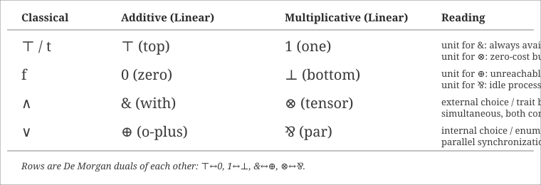
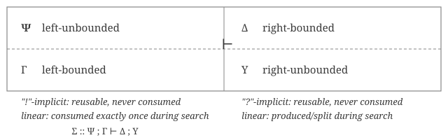

[[book-guidelines|↩ Back to guidelines]]

# Linear Logic

## Why a logic of resources, not truth

Chapter 5 built two logic programming languages out of intuitionistic logic — first-order Horn clauses (`fohc`, i.e. Prolog) and first-order hereditary Harrop formulas (`fohh`, i.e. λProlog) — and showed both were *complete* for goal-directed proof search via uniform proofs and backchaining. But Miller opens this chapter by cataloguing exactly what that machinery still can't do:

1. It only covers a *fragment* of intuitionistic logic ($L_0 = \{\mathsf t, \wedge, \supset, \forall\}$), not all of it.
2. It's stuck with single-conclusion sequents, so it can't use classical negation and De Morgan duality to reason about programs.
3. Most importantly: during `fohh` proof search, the left-hand side of a sequent (the "program") can only ever *grow*. Once a clause is in your context, it's there forever, indefinitely reusable. You can never say "this resource gets consumed" or "this fact becomes false after I use it."

That third limitation is the real motivator, and it's worth sitting with before any symbols appear. Ordinary logic — classical or intuitionistic — treats a hypothesis $B$ as a *fact*: once true, forever true, and freely reusable in as many places in a proof as you like. That's exactly what the structural rule of **contraction** encodes ($\Gamma, B, B \vdash \Delta$ can always be weakened to needing just $\Gamma, B \vdash \Delta$, and vice versa — you can duplicate or discard $B$ at will). If you want to model computation as *proof search*, and you want that computation to track things like "I have one ticket, and using it destroys it" or "this mutex is locked until I release it," ordinary logic's assumption that hypotheses are infinitely reusable facts is the wrong substrate. **Linear logic**, introduced by Girard in 1987, is what you get when you strip contraction and weakening out of the default rules and then reintroduce them *only* for formulas you explicitly mark as reusable. A hypothesis becomes a *resource*: something that must be consumed exactly once to be used at all, unless you've tagged it as freely copyable.

If you've internalized Rust's ownership model, you already have the core intuition. A `String` you pass by value into a function is *moved* — the caller can't use it again, the function must do something with it (or explicitly drop it), and you can't just conjure a second copy unless the type implements `Clone`. That's linear logic's basic move: **most hypotheses behave like non-`Copy` values, consumed exactly once as a proof is built; only explicitly-marked hypotheses behave like `Copy`/`Clone` values, available at will.** This chapter formalizes that intuition into a full logic — with its own conjunctions, disjunctions, units, and two flavors of implication — and then, in its second half, turns that logic directly into two new logic programming languages, Lolli and Forum, that fix all three of the limitations above.

**What this chapter builds, roughly in order:** (1) diagnose *why* classical/intuitionistic sequent calculus entangles contraction with connective choice; (2) tell the "origin story" — the two restrictions that turn Gentzen's LK into LJ literally *dictate* the shape of linear logic's exponentials; (3) lay out the full L proof system and its eight MALL connectives, plus $!$/$?$; (4) explain duality and polarity; (5) introduce two-zone sequents and the focused proof system for a first fragment $L_1$ (Lolli); (6) show how to embed `fohh` into it; (7) sketch an implementation technique (lazy context splitting); (8) generalize to multiple-conclusion sequents and $L_2$ (Forum); (9) prove $L_2$ conservative over $L_1$ and $L_0$; (10) generalize synthetic inference rules with a toggling-switch example.

---

## 6.1 — Structural rules, contraction, and the additive/multiplicative choice

### Contraction and invertibility are entangled

Recall from Chapter 3 that an introduction rule is **invertible** if provability of the conclusion guarantees provability of every premise — you can always apply it "for free" without losing completeness. Miller points out a structural fact about C-proofs (classical) and I-proofs (intuitionistic) that sets up everything to come: whether a connective's left-introduction rule is invertible determines whether contraction is *ever* needed for occurrences of that connective.

Compare $\vee_L$ and $\wedge_L$:

$$
\dfrac{\Sigma :: B, \Gamma \vdash \Delta \qquad \Sigma :: C, \Gamma \vdash \Delta}{\Sigma :: B \vee C, \Gamma \vdash \Delta}\ \vee_L
\qquad\qquad
\dfrac{\Sigma :: B_i, \Gamma \vdash \Delta}{\Sigma :: B_1 \wedge B_2, \Gamma \vdash \Delta}\ \wedge_L
$$

$\vee_L$ is invertible: nothing is lost by splitting into both cases, so contraction on $B \vee C$ is never needed. $\wedge_L$ is *not* invertible — it throws away $B_{3-i}$ to keep $B_i$ — so if a proof needs *both* conjuncts (Miller's example: a cut-free proof of $(p\wedge q) \supset (p \supset q \supset r) \supset r$), you need contraction on $p \wedge q$ to get two independent copies to pick from. **Contraction is only ever needed on formulas whose introduction rule is non-invertible.** This single observation is the seed of everything linear logic does with $!$ and $?$: mark exactly the formulas that need contraction, leave the rest genuinely resource-like.

### Additive vs. multiplicative is a forced choice — until now

Chapter 3 classified a two-premise rule as **additive** if the context ($\Gamma, \Delta$) is copied identically into both premises, and **multiplicative** if the context is *split* between the premises. In ordinary sequent calculus you must pick one variant per connective — $\wedge$ and $\vee$ are additive, $\supset$ is multiplicative, full stop. Miller flags this as unsatisfying: with weakening and contraction freely available, additive and multiplicative variants of a connective are provably *interchangeable*, so the choice looks arbitrary. But once you start restricting weakening and contraction (which is exactly what a resource-sensitive logic needs to do), the two variants stop being interchangeable and start behaving *differently*. Linear logic's answer, previewed here and made precise in §6.3, is not to choose — it keeps **both** an additive and a multiplicative version of conjunction and disjunction, as genuinely distinct connectives.

**What breaks without this distinction.** If you collapse additive and multiplicative conjunction back into one $\wedge$, you can no longer distinguish "I need $\Gamma$ resources to build *either* $B$ or $C$, but not both" (additive) from "I need $\Gamma_1$ resources for $B$ *and* $\Gamma_2$ more for $C$, both simultaneously" (multiplicative) — which is precisely the distinction a resource-cost model (or a type system distinguishing "borrow" from "consume") needs to make.

### Cut collides badly with weakening

Miller gives a concrete example of *why* unrestricted structural rules are hostile to deterministic computation: a cut whose right premise was derived by weakening admits two structurally different reductions (permute the cut past weakening on either side), which can produce two *entirely different* proofs of the same endsequent. Since Chapter 1 committed this book's parallel project (functional programming via Curry–Howard) to *deterministic* cut-elimination as its computational content, a setting where cut and the structural rules collide nondeterministically is a bad foundation. This is a second, independent reason (beyond resource semantics) to want tight control over weakening and contraction — and it's why focusing (Chapter 3's $\Downarrow$ notation, generalized fully to linear logic in Chapter 7) matters so much here.

---

## 6.2 — The LK-vs-LJ origin story

This is the chapter's cleanest piece of motivation, and it's worth walking through exactly as the book does, because it derives the shape of $!$ and $?$ from something you already understand: the difference between classical and intuitionistic sequents.

Recall Proposition 4.2 (Chapter 4): a **C-proof** (classical, multiple-conclusion) is restricted to being an **I-proof** (intuitionistic, single-conclusion) precisely by two conditions:

1. **No structural rules on the right.** $w_R$ and $c_R$ are simply forbidden — you can never weaken or contract the right-hand side.
2. **$\supset_L$ and cut are multiplicative in a specific asymmetric way**: the single right-hand formula of the conclusion must migrate to the *right* premise only, never the left:
$$
\dfrac{\Sigma :: \Gamma_1 \vdash \Delta_1, B \qquad \Sigma :: C, \Gamma_2 \vdash \Delta_2}{\Sigma :: B \supset C, \Gamma_1, \Gamma_2 \vdash \Delta_1, \Delta_2}\ \supset_L
$$

Condition 2 means $\supset_L$ is doing *two* jobs at once: introducing a connective, and routing a side formula to a specific place. No other intuitionistic connective's rule does this — it's implication specifically that carries extra plumbing.

Now generalize. Condition 1 says: *structural rules only ever happen on the left*. Condition 2 says: *there's a marked asymmetry in how implication moves formulas around*. Linear logic's answer is to stop treating "structural rules allowed" as an all-or-nothing property of a whole sequent side, and instead attach it to *individual formula occurrences*, using two new unary connectives:

- $!B$ ("$B$, of course") — freely weakenable and contractible **on the left**.
- $?B$ ("$B$, why not") — freely weakenable and contractible **on the right**.

With this vocabulary, a C-proof's sequents translate into linear-logic sequents of the shape $!B_1,\dots,!B_n \vdash {?}C_1,\dots,{?}C_m$ (everything marked reusable both sides — this is what "classical logic" degenerates to inside linear logic), and an I-proof's sequents translate into $!B_1,\dots,!B_n \vdash B_0$ (reusable hypotheses, but a single, non-$?$-marked, genuinely linear conclusion).

And crucially: intuitionistic implication itself gets *decomposed*. Since $\supset_R$ moves $B$ from the goal into the left context (where it will be reused freely as a hypothesis), the natural linear-logic reading of $B \supset C$ is
$$
B \Rightarrow C \;:=\; (!B) \multimap C
$$
where $\multimap$ (**linear implication**, "lollipop") consumes its argument exactly once. Plugging this into the $\multimap_L$ rule for $(!B) \multimap C$ and comparing to $\supset_L$ above, you can mechanically re-derive *exactly* the asymmetric-routing restriction that defined I-proofs in the first place — the second restriction on I-proofs wasn't an arbitrary technical condition, it's a shadow of the fact that intuitionistic implication is secretly "consume $!B$, produce $C$ linearly."

**Rust framing.** This is the single cleanest place in the whole chapter to draw the ownership analogy explicitly. $B \multimap C$ is a function `fn(B) -> C` where the argument is *moved* — used up building the result, unavailable afterward. $!B \multimap C$, i.e. intuitionistic $B \Rightarrow C$, is `fn(&B) -> C` or, more precisely, a function that receives a `Clone`-able resource it can duplicate as many times as it needs (`fn(B) -> C where B: Clone`) — which is exactly what "ordinary," non-linear implication silently assumes about every hypothesis. Intuitionistic logic is what you get when *every* type is `Clone`. Linear logic makes cloning opt-in, per-hypothesis, marked with `!`.

---

## 6.3 — The L proof system: MALL, the exponentials, duality

### 6.3.1 Restaurant/font semantics for $\otimes$ and $\&$

Before the formal rules, Miller gives an informal pricing story that nails the additive/multiplicative distinction better than any amount of staring at inference rules. Suppose you've built two digital fonts, $B_1$ and $B_2$, and want to package and price them together.

- **$\otimes$ (tensor, multiplicative "and"):** if font $B_1$ cost $\Gamma_1$ resources and font $B_2$ cost $\Gamma_2$ resources *separately*, the bundle $B_1 \otimes B_2$ costs $\Gamma_1, \Gamma_2$ — resources accumulate. Buy the bundle, get simultaneous access to *both* fonts. €3 font + €7 font = €10 bundle.
- **$\&$ (with, additive "and"):** if each font individually costs $\Gamma$ resources on its own, the bundle $B_1 \& B_2$ *still* costs $\Gamma$ — but the buyer only gets to pick **one** font; once picked, the other is gone. €5 font & €5 font = €5 bundle (you get whichever one you choose).

This is exactly **internal vs. external choice** in the concurrency-theory sense, and it maps cleanly onto two different Rust idioms:

- $\otimes$ is a `struct` (or tuple) holding both fields — `struct FontBundle { b1: Font, b2: Font }` — constructing it requires paying for both, and you own both afterward.
- $\&$ is closer to a value that satisfies *multiple trait bounds simultaneously but only one is ever invoked*, or — even more directly — it's what a function signature `fn pick(bundle: impl HasB1 + HasB2) -> Font` expresses: the *producer* commits to being able to deliver either projection, and the *consumer* decides which one to actually take, at the cost of losing access to the other. That's the "external choice" reading: the *environment* (the proof/the caller) picks the branch, which is why $\&$R has **two premises that must both be provable** (you must be ready to honor either choice) while $\&$L only needs **one** branch chosen (i = 1 or 2) to proceed.
- Dually, $\oplus$ (**plus**, additive "or") is **internal choice**: the *producer* commits to one branch and only needs to justify that one. $\oplus_R$ (right rule) picks $B_i$ and proves only that; $\oplus_L$ (left rule) must handle *both* possible incoming branches. This is precisely Rust's `enum`: constructing `Ok(x)` or `Err(e)` is the producer unilaterally picking a variant ($\oplus_R$), while `match` on the consuming side must provide a handler for every variant ($\oplus_L$'s two premises). **$\&$ is trait-object-style external choice (multiple capabilities offered, caller decides); $\oplus$ is enum-style internal choice (producer decides, caller must handle every case).**

### 6.3.2 MALL and the eight connectives

**Multiplicative additive linear logic (MALL)** is exactly the propositional connectives-plus-units from Figure 6.1/6.2 — additive and multiplicative conjunction/disjunction and their four units, no exponentials yet, no quantifiers. Because MALL has *no* weakening or contraction at all, the additive and multiplicative variants are genuinely inequivalent (unlike in classical/intuitionistic logic) — this is the payoff of §6.1's observation. Miller tabulates all eight:



Rust doesn't have a clean native analogue for $\bot$ or $\wp$ (par) — Miller himself defers the intuition for right-multiple-formula sequents to Chapter 12's process-calculus reading (⅋ as parallel composition/synchronization). That's a fair place to say the Rust grounding runs out: ⅋ is fundamentally about *what it means to have more than one thing to prove at once*, which single-threaded ownership semantics doesn't have a direct picture for. Treat it as a placeholder connective for now — it earns its keep in §6.7 when multiple-conclusion sequents arrive.

### 6.3.3 The exponentials: $!$ and $?$

Four rules per exponential (Figure 6.4): weakening, contraction, dereliction, and the "real" introduction rule (promotion).

$$
\dfrac{\Sigma :: \Gamma \vdash \Delta}{\Sigma :: \Gamma, {!}B \vdash \Delta}\ {!}W
\qquad
\dfrac{\Sigma :: \Gamma, {!}B, {!}B \vdash \Delta}{\Sigma :: \Gamma, {!}B \vdash \Delta}\ {!}C
\qquad
\dfrac{\Sigma :: \Gamma, B \vdash \Delta}{\Sigma :: \Gamma, {!}B \vdash \Delta}\ {!}D
\qquad
\dfrac{\Sigma :: {!}\Gamma \vdash B, {?}\Delta}{\Sigma :: {!}\Gamma \vdash {!}B, {?}\Delta}\ {!}R
$$

Weakening ($!W$) and contraction ($!C$) are exactly the two structural rules that were banned everywhere else — reintroduced, but *only* for $!$-marked formulas. Dereliction ($!D$) says: a resource with the "can be duplicated/discarded" privilege can always choose to be used exactly once instead — the privilege is optional to exercise. The interesting one is **promotion**, $!R$: you may only conclude $!B$ is provable on the right if *every* other formula in context is itself marked reusable (all $!$ on the left, all $?$ on the right). Miller's restaurant framing: to guarantee unlimited french fries, you don't guarantee one fry — you guarantee an unlimited supply of oil, salt, and potatoes, from which the cook can make one fry *repeatably*. Promotion is the rule that turns "provable once, from purely reusable ingredients" into "provable arbitrarily many times."

**Rust framing.** $!B$ is `B: Clone` (or `B: Copy` for the strongest case) — a type whose values you're licensed to duplicate freely. Dereliction is just: a `Clone` type can still be used linearly (moved) if you want — cloning is a capability, not an obligation. Promotion is the deeper statement: you can only *derive* a general `Clone` capability for a compound value if it was built entirely from `Clone` ingredients in a `Clone`-only environment — which is structurally identical to why `#[derive(Clone)]` on a struct requires every field to itself implement `Clone`.

### 6.3.4 De Morgan duality and polarity

Linear logic has De Morgan duals for *everything*, exponentials included:

<svg viewBox="0 0 700 130" xmlns="http://www.w3.org/2000/svg" font-family="Georgia, serif" font-size="16">
  <style> text { fill: #3a3a3a; } .hdr { font-weight: bold; fill: #2a2a2a; } </style>
  <rect x="0" y="0" width="700" height="130" fill="none" stroke="#888888" stroke-width="1"/>
  <text x="20" y="30" class="hdr">connective</text>
  <text x="20" y="70" class="hdr">dual</text>
  <line x1="10" y1="42" x2="690" y2="42" stroke="#888888" stroke-width="1"/>
  <g font-size="17">
    <text x="150" y="30">⊤</text><text x="200" y="30">&amp;</text><text x="250" y="30">1</text><text x="300" y="30">⊗</text>
    <text x="350" y="30">⊥</text><text x="400" y="30">⅋</text><text x="450" y="30">0</text><text x="500" y="30">⊕</text>
    <text x="550" y="30">!</text><text x="600" y="30">?</text><text x="650" y="30">∀</text><text x="690" y="30" font-size="14">∃</text>
    <text x="150" y="70">0</text><text x="200" y="70">⊕</text><text x="250" y="70">⊥</text><text x="300" y="70">⅋</text>
    <text x="350" y="70">1</text><text x="400" y="70">⊗</text><text x="450" y="70">⊤</text><text x="500" y="70">&amp;</text>
    <text x="550" y="70">?</text><text x="600" y="70">!</text><text x="650" y="70">∃</text><text x="690" y="70" font-size="14">∀</text>
  </g>
  <line x1="10" y1="90" x2="690" y2="90" stroke="#888888" stroke-width="1"/>
  <text x="20" y="115" font-size="13" font-style="italic">Negative (right-rule invertible):  ⊥, ⊤, ⅋, &amp;, ∀, ?</text>
  <text x="360" y="115" font-size="13" font-style="italic">Positive (left-rule invertible):  1, 0, ⊗, ⊕, ∃, !</text>
</svg>

**Polarity** is the property this table encodes. A connective is **negative** if its right-introduction rule is invertible — provable without loss of information, no choice required — and **positive** if its left-introduction rule is invertible. Equivalently (and more operationally): a connective is *positive* if applying its right-rule requires an oracle/decision from outside (which disjunct for $\oplus_R$, how to split the context for $\otimes_R$, which term for $\exists_R$); it's *negative* if the right-rule can always fire without needing any such external input. $!$ is positive by this test (its right-rule, promotion, needs the whole surrounding context to already be uniform); $?$, its dual, is negative. Atoms are conventionally negative, by fiat, so that *every* formula has a polarity.

**What breaks without polarity.** Polarity is what will let Chapter 7's focused proof system group together a maximal run of same-direction rule applications into one atomic "phase" (Andreoli's asynchronous/synchronous phases) without ever needing to backtrack over choices that were forced anyway. Positive connectives are exactly the ones where proof search *must* make a choice (and so belong in the backchaining/"synchronous" phase, where you commit to a formula and drive it to completion); negative connectives are exactly the ones proof search can always apply eagerly and for free (the "asynchronous"/goal-reduction phase). Without this classification, a proof-search procedure has no principled way to decide which rule to try next without exponential backtracking — polarity turns "what should I do next" from a search problem into a determined-by-syntax computation for roughly half the connectives.

### 6.3.5 Two implications: $\multimap$ vs. $\Rightarrow$

Linear implication is given first-class introduction rules (rather than just being *defined* as $B^\perp \wp C$):

$$
\dfrac{\Sigma :: \Gamma_1 \vdash B, \Delta_1 \qquad \Sigma :: \Gamma_2, C \vdash \Delta_2}{\Sigma :: \Gamma_1, \Gamma_2, B \multimap C \vdash \Delta_1, \Delta_2}\ {\multimap}_L
\qquad
\dfrac{\Sigma :: \Gamma, B \vdash C, \Delta}{\Sigma :: \Gamma \vdash B \multimap C, \Delta}\ {\multimap}_R
$$

and intuitionistic implication is, per §6.2, $B \Rightarrow C := (!B) \multimap C$ — same shape, but the left premise's context is required to be entirely reusable (all-$!$), giving it the characteristic "additive-ish" flavor where $B$ persists as a hypothesis rather than being consumed. Both are multiplicative, negative connectives (both defined via $\wp$). One curiosity worth flagging: naively writing left/right rules for $\Rightarrow$ that literally mention "$!B$ in the premise" violates the sequent-calculus discipline that a rule's premises shouldn't already contain occurrences of logical connectives not present in the conclusion — this is the technical wrinkle that motivates §6.4's entire two-zone reformulation.

---

## 6.4 — Two-zone sequents, the P proof system, and $\Downarrow L_1$

### The zone split

Rather than smuggling $!$ into implication's rules, Miller restructures the sequent itself. Define $L_1 = \{\top, \&, \multimap, \Rightarrow, \forall\}$ and build a proof system $P$ (Figure 6.6) over sequents of the shape

$$
\Sigma :: \Psi; \Gamma \vdash B
$$

where $\Psi$ is the **left-unbounded zone** (informally: everything implicitly $!$-marked, freely reusable) and $\Gamma$ is the **left-bounded zone** (genuinely linear, consumed once). The reading is: $B_1,\dots,B_n; C_1,\dots,C_m \vdash E$ stands for the linear-logic sequent $!B_1,\dots,!B_n, C_1,\dots,C_m \vdash E$. Every $P$-rule now has the clean sequent-calculus shape — exactly one connective introduced, no stray connectives smuggled into premises — because the $!$-marking is handled structurally by *which zone* a formula sits in, not by writing $!$ explicitly. Two versions each of cut ($\text{cut}_l$, $\text{cut}_!$) and decide ($\text{decide}_l$, $\text{decide}_!$) exist, one per zone.

This is a direct, load-bearing instance of a pattern from your elaborator/verifier work: **splitting a typing context into a linear part and an unrestricted part is exactly what substructural type systems (and Rust's own borrow checker, informally) do when distinguishing owned/moved bindings from `Copy`/shared ones.** A Rust function's parameter list is implicitly doing a version of this split already — parameters taken by value and not `Copy` behave like $\Gamma$; parameters behind `&` or of `Copy` types behave like $\Psi$. If you're building a Rust-embedded prover that needs to reason about resource-consuming operations (locks, file handles, "this Hoare-triple precondition gets consumed"), this two-zone sequent is close to the literal data structure your prover's context representation should use: two multisets, not one.

Additive rules copy a context formula into every premise regardless of zone; multiplicative rules split bounded-zone formulas across premises but *copy* unbounded-zone formulas into every premise (because $!$-marked formulas support contraction) — Miller shows this hybrid multiplicative behavior is literally derivable from ordinary linear logic's $\multimap_L$ plus a $!C$ contraction step. Proposition 6.13 makes the translation precise: $\Psi; \Gamma \vdash B$ has a $P$-proof iff $!(\Psi^\diamond), \Gamma^\diamond \vdash B^\diamond$ has an $L$-proof, where $(\cdot)^\diamond$ unfolds $\Rightarrow$ and $\multimap$ back into their $\wp$-based definitions.

### Focusing: $\Downarrow L_1$ and backchaining

$P$ is unfocused and not yet the right shape for studying goal-directed search. Figure 6.7 gives the focused system $\Downarrow L_1$, structurally the linear-logic sibling of Chapter 5's $\Downarrow$fohh: right-introduction (goal-reduction) rules for the negative connectives $\top, \&, \multimap, \Rightarrow, \forall$ that fire unconditionally, plus a designated-formula slot $\Gamma \Downarrow D \vdash A$ for left-introduction (backchaining) once a program clause has been "decided" upon (via $\text{decide}_l$ or $\text{decide}_!$, one per zone, just as before). $\multimap_L$'s bounded-zone split is now the *only* place nondeterminism about resource allocation shows up — everything else is forced.

Miller also gives a second, more operational characterization of backchaining as a relation $\|B\|_\Sigma$ — the smallest set of triples $\langle \Psi, \Gamma, B'\rangle$ built by "unfolding" a clause $B$ through its own $\&$, $\Rightarrow$, $\multimap$, $\forall$ structure (Figure 6.8's clauses 1–5), exactly generalizing Chapter 5's border-sequent unfolding to track *which* zone each unfolded premise lands in. This directly generalizes to the **BC** (backchaining) synthetic inference rule, collapsing an entire decide-then-unfold run into one derived step — the same "compile the clause into a derived rule" idea Chapter 5 introduced, now resource-aware.

**What breaks without two-zone sequents.** Try to write $\Rightarrow_L$/$\Rightarrow_R$ over a *single* left context and you either violate the "no stray connectives in premises" discipline (as §6.3.5 flagged) or you lose the ability to distinguish, syntactically, "this hypothesis is available forever" from "this hypothesis will be gone after this step" — which is precisely the distinction the whole chapter exists to make precise. Two-zone sequents aren't an implementation convenience; they're the mechanism that makes intuitionistic-inside-linear well-typed as a sequent calculus at all.

**The result:** the abstract logic programming language $\langle L_1, L_1, \vdash_L\rangle$ is named **Lolli**. Unlike `fohh`, whose bounded-analogue-of-a-context could only grow, $\Downarrow L_1$ proofs let the bounded zone $\Gamma$ change in arbitrary ways during search — grow, shrink, or transform — while the unbounded zone $\Psi$ (and the signature) can still only grow, exactly like before. This is limitation #3 from the chapter's opening, fixed.

---

## 6.5 — Embedding `fohh` into Lolli

Two translations from intuitionistic formulas into linear-logic ones are given. Girard's original (provability- and proof-preserving) translation is uniform: $t \mapsto \top$, $\wedge \mapsto \&$, $\supset \mapsto \Rightarrow$, $\forall \mapsto \forall$ — i.e., stay additive/intuitionistic-flavored throughout. But if you only care about *cut-free* proofs (which is all that matters for logic programming, since goal-directed search never needs cut), a sharper **polarized translation** with two mutually-defined maps $(\cdot)^+$/$(\cdot)^-$ does better — sending conjunction to $\otimes$ on the positive side but $\&$ on the negative side, and implication to $(B)^- \Rightarrow (C)^+$. Proposition 6.15: an I-proof of $\Delta \vdash B$ exists iff $\Delta^-; \cdot \vdash B^+$ has a cut-free $\Downarrow L_1$-proof.

The payoff is concrete syntax. Prolog's `A0 :- A1, ..., An`, traditionally read as $(A_1 \wedge \cdots \wedge A_n) \supset A_0$, becomes under the negative translation $(A_1 \otimes \cdots \otimes A_n) \multimap A_0$ — **the comma in Prolog *is* $\otimes$**, and `:-` is the converse of $\multimap$. And λProlog's `=>` operator, used for hypothetical/scoped reasoning, is confirmed to denote $\Rightarrow$ (not $\multimap$) by tracing through a `prov` predicate specifying natural-deduction implication-introduction. This is a genuinely nice payoff: two syntactic choices you might have taken for granted in Prolog/λProlog turn out to be forced by which linear connective they secretly denote.

**Load-bearing note for the standing project.** Lolli is not a toy — it is a real logic programming language whose search procedure is *this exact focused proof system*. If the Rust-embedded prover in your standing project needs a search strategy over resource-sensitive specifications (e.g. Hoare triples where preconditions get consumed by a statement's effect), Lolli's $\Downarrow L_1$ discipline — decide, then drive left/right introduction to atoms, splitting the bounded zone only where $\multimap_L$ demands it — is a directly implementable search algorithm, not just a theoretical curiosity.

---

## 6.6 — A model of resource consumption: lazy splitting

$\multimap_L$ requires splitting the bounded zone $\Gamma$ into two sub-multisets — naively, $2^{|\Gamma|}$ possibilities to try. Section 6.6 sketches how a real implementation avoids this blowup: instead of committing to a split *before* searching the left premise, hand the *entire* bounded zone to the left-premise search as an **input** list, let it consume whatever it needs, and pass along whatever's left as an **output** list to the right premise. The **IO proof system** (Figure 6.9) formalizes this with sequents $[I \| O]$ (input/output pairs of "option formulas" — either a live formula $\langle B\rangle$ or a deletion marker $\circ$), a `pick` predicate that nondeterministically removes one live formula and marks it deleted, and a `subcontext` predicate checking one list is an "erasure" of another. Proposition 6.19 shows this lazy-splitting technique is *sound*: an IO-proof translates directly back into a $\Downarrow L_1$-proof by replacing $[I \| O]$ with the multiset difference $I - O$.

This is squarely an implementation-mechanism section — the kind of thing that transfers almost verbatim into code. In Python-sketch terms, `pick` is just: iterate the input list, and at each live element, yield (that element, input-with-that-slot-marked-deleted) as one nondeterministic choice — precisely how you'd implement resource allocation in a Prolog-style resolution engine over a mutable "remaining resources" list rather than trying every subset split up front.

---

## 6.7 — Multiple-conclusion uniform proofs: $L_2$ and Forum

$L_1$ can already *encode* all of linear logic if extended with just $\bot$ (Exercise 6.20) — but Miller goes further and adds $\bot$, $\wp$, and $?$ together, since all three are negative-polarity and represent the 0-ary, 2-ary, and "$\infty$-ary" multiplicative disjunction respectively. This gives

$$
L_2 = L_1 \cup \{\bot, \wp, ?\} = \{\top, \&, \multimap, \Rightarrow, \forall, \bot, \wp, ?\}
$$

— the **Forum** presentation of linear logic (Miller 1996). ($\wp$ and $?$ are technically redundant given $\multimap$/$\bot$ — $?B \iff (B\multimap\bot)\Rightarrow\bot$ and $B \wp C \iff (B\multimap\bot)\multimap C$ — but keeping them makes specifications far more natural, and only mildly complicates Chapter 7's metatheory.)

### Uniform proofs, generalized

Chapter 5's notion of uniform proof assumed a *single* right-hand formula to drive right-introduction toward. With multiple conclusions on the right, "goal-directed" has to mean something subtler: a cut-free proof is **uniform** if, for every subproof and every non-atomic right-hand formula occurrence, *some* permutation-equivalent proof exists that introduces that formula's top connective last. In other words: it shouldn't matter which order you introduce the (independent) right-hand connectives in — they're all simultaneously "up for grabs," which sequent calculus can only express via a permutation-invariance requirement rather than literal simultaneity.

### Four zones

The focused system $\Downarrow L_2$ (Figure 6.11) generalizes $\Downarrow L_1$'s two zones to **four**: left-unbounded $\Psi$, left-bounded $\Gamma$, right-bounded $\Delta$, right-unbounded $\Upsilon$ — sequents $\Sigma :: \Psi; \Gamma \vdash \Delta; \Upsilon$, read as $!\Psi, \Gamma \vdash \Delta, {?}\Upsilon$.



Right rules only exist for the un-focused $\Sigma::\Psi;\Gamma\vdash\Delta;\Upsilon$ shape; left rules, as always, apply only to the designated formula between $\Downarrow$ and $\vdash$. All right rules are additive (Chapter 3's terminology), all left rules multiplicative — a clean mirror image of $\Downarrow L_1$'s behavior, now doubled onto the right. Theorem 6.21 gives soundness relative to the unfocused $L$ system by unfolding $\Rightarrow$/$\multimap$ via $(\cdot)^\diamond$ exactly as before; completeness is deferred to Chapter 7's cut-elimination machinery.

**What breaks without four zones.** Collapse right-bounded and right-unbounded into one zone and you lose the ability to state, syntactically, "these conclusions are alternatives still being decided among" (bounded, linear) versus "these conclusions are facts I can re-derive at will" (unbounded, reusable) — exactly the asymmetry that made `fohh`'s single-conclusion setting too weak to reason about negation and duality. Four zones is the minimal bookkeeping that lets both directions of the sequent independently track "what's linear" vs. "what's structural."

---

## 6.8 — Conservativity: $\Downarrow L_2$ doesn't do anything extra on old formulas

Two clean results close the loop. Proposition 6.28: if $B$ is an $L_1$-formula and $\Sigma::\cdot;\cdot \vdash B; \cdot$ has a $\Downarrow L_2$-proof, that proof is *already* a $\Downarrow L_1$-proof — the extra connectives $\bot,\wp,?$ and the extra zones never actually get exercised when the formula in question doesn't mention them. Proposition 6.29 pushes the same fact down to $L_0 = \{\mathsf t, \wedge, \supset, \forall\}$, viewed as a renaming of $\{\top, \&, \Rightarrow, \forall\}$: $\Downarrow L_2$-proofs of $L_0$-formulas are already $\Downarrow L_0$-proofs. This is a strong sanity check on the whole tower — it says $L_0 \subset L_1 \subset L_2$ genuinely nests as proof systems, not just as syntax:

```mermaid
flowchart LR
    L0["L0 = {t, ∧, ⊃, ∀}\n(fohh, Ch.5)"] -->|renaming ⊤,&,⇒,∀| L1["L1 = {⊤, &, ⊸, ⇒, ∀}\n(Lolli)"]
    L1 -->|∪ {⊥, ⅋, ?}| L2["L2 = L1 ∪ {⊥, ⅋, ?}\n(Forum)"]
    L2 -. "conservative over" .-> L1
    L1 -. "conservative over" .-> L0
```

The metatheoretic significance for a Lean-style proof-checker builder: this is the exact shape a *conservative extension* proof takes — you don't have to re-verify every old proof when you extend the connective set, because the extension provably introduces no new proofs of old-language sequents. That's the same guarantee you'd want when e.g. extending an elaborator's core type theory with a new eliminator and needing to know old judgments still typecheck the same way.

---

## 6.9 — Generalized synthetic inference rules, and a toggling switch

Chapter 5's border sequent (right side atomic) and synthetic rule (a full decide→left-intro→right-intro cycle compiled into one derived rule) generalize immediately: a **border sequent** is now $\Sigma::\Psi;\Gamma\vdash A;\Upsilon$ with the right-*bounded* zone $A$ restricted to atoms (the right-unbounded zone $\Upsilon$ is untouched by this restriction). A **synthetic inference rule** is what you get moving from a border sequent up through one decide step, a left-introduction phase, then a right-introduction phase (whose open premises are themselves border sequents).

The worked example is genuinely illuminating: model a boolean switch using two clauses,
```
step1 :- off, on -o step2.
step1 :- on, off -o step2.
```
i.e. $\text{off} \multimap (\text{on} \multimap \text{step2}) \multimap \text{step1}$ and its mirror. Because `off`/`on` are *linear* resources in the bounded zone, deriving `step1` from a context containing `on` genuinely **consumes** `on` and **produces** `off` — the switch actually flips, and the derivation is forced through a specific splitting of the bounded zone because any other split fails to close the proof. Miller contrasts this with the same clauses written using $\Rightarrow$ instead of $\multimap$: since $\Rightarrow$'s hypotheses are non-linear (reusable, never consumed), you'd end up with both `on` and `off` simultaneously true in context — "a poor implementation of a switch." **This is the cleanest illustration in the whole chapter of why resource-sensitivity is not a stylistic preference but a semantic necessity**: mutable state literally cannot be modeled faithfully by a logic where every hypothesis is freely duplicable.

A second version puts the switch's state on the *right* of the sequent instead, using $\wp$ (written `||` in the book's λProlog-flavored syntax) — `step1 || off :- on || step2.` — producing $(\text{on}\wp\text{step2}) \multimap (\text{step1}\wp\text{off})$, and now the toggle is achieved by a *single* synthetic rule (one decide, not two), because both effects land on the multiple-conclusion right side simultaneously rather than requiring two separate proof fragments stitched together.

**Direct hit on the standing project.** If your Rust verifier needs to check programs against Hoare-triple-style specifications, "resource $R$ is consumed, resource $R'$ is produced" is *exactly* the toggling-switch pattern — a statement's precondition/postcondition pair is a linear implication whose left side is what gets consumed and whose right side is what gets produced, and $\multimap_L$'s forced context-splitting during proof search is the mechanism that would check whether a given Hoare triple's resources actually balance.

---

## Where this leads

Chapter 7 takes the $\Downarrow L_2$ system built here and does the hard metatheoretic work only sketched in this chapter: four distinct cut rules (ordinary $\text{cut}_l$, $\text{cut}_!$, $\text{cut}_?$, and a special *key cut* for atoms), a measure-based induction to eliminate all of them, and — inverting the usual order — proving cut-elimination for the *focused* system first and deriving cut-elimination for the unfocused $L$ system as a corollary. Chapter 8 then cashes out everything built here as actual programs: multiset encodings, a Lolli-based theorem-prover specification, and $L_2$ used as a *metalogic* to specify sequent-calculus proof systems for object-level intuitionistic logic — i.e., linear logic reasoning about proof search itself, which is precisely the kind of self-hosting a Rust-embedded prover's search engine would eventually want to reach. Chapters 9–13 extend everything here to higher-order quantification and apply it to encode automata, security protocols, and full operational semantics — all riding on the resource-consuming, two-(then-four-)zone sequent machinery this chapter introduced.
