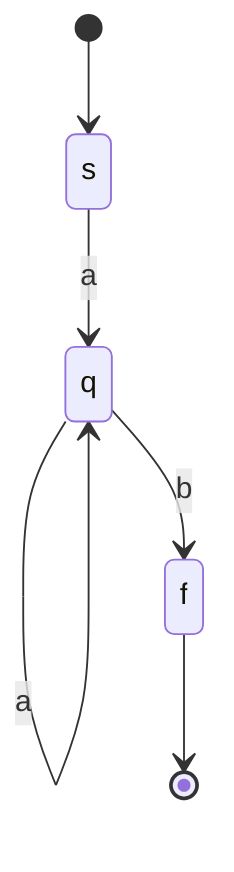
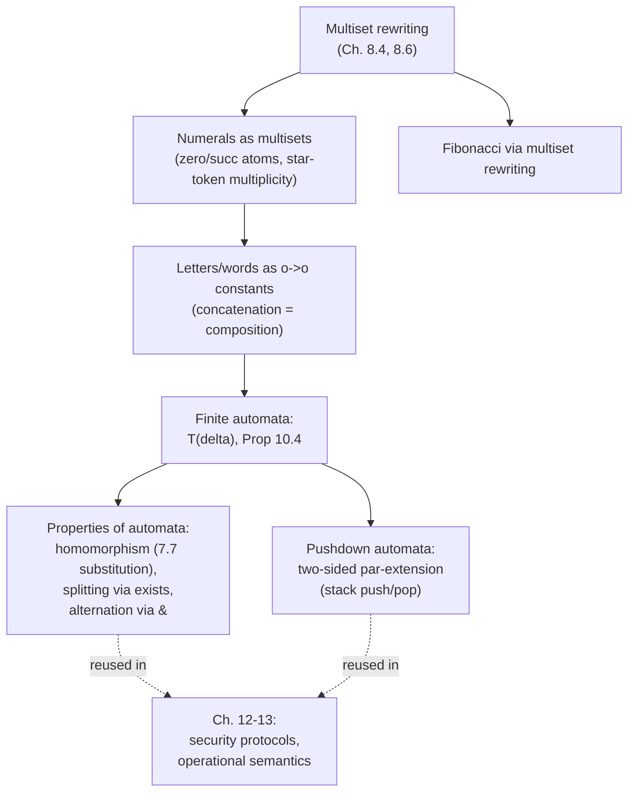

# Specifying Computations with Multisets and Automata

[[book-guidelines|↩ Back to guidelines]]

## Why this chapter exists

Every previous chapter of the book has been building machinery: multiplicative and additive connectives, focused sequent calculus, higher-order quantification, the ability to substitute a formula for a predicate variable ("splitting the atom"). This chapter cashes all of that in on a single, satisfying payoff: **a finite automaton is not just *modeled* by a linear logic theory — acceptance of a word by the automaton is *equivalent* to provability of a specific sequent.** Not an analogy, not "you could simulate it this way" — an iff, stated and proved as Proposition 10.4.

That's a strong claim, and it's the reason this chapter matters for anyone building a verifier: it's a fully worked example of the pattern "encode a computational model as a logic theory, then let proof search *be* the execution engine, and prove the encoding faithful." If you're building a Rust tool that checks programs against logic-clause specifications with an embedded prover, this chapter is the smallest complete instance of exactly that architecture — small enough to hold in your head, rich enough to generalize.

The mechanism underneath everything here is **multiset rewriting**, introduced earlier (Sections 8.4, 8.6) and now put to work. A multiset — a collection where order doesn't matter but multiplicity does — turns out to be exactly the right data structure for modeling "current state of a computation," because linear logic's multiplicative connectives ($\multimap$ for consumption, $\parr$ for the dual of $\otimes$, used here for combination) treat formulas as *consumable resources* rather than persistent truths. A transition rule consumes an old configuration and produces a new one. That's multiset rewriting, and it's also, it turns out, what a state transition does.

## Numerals as multisets: two encodings, and why the difference matters

The chapter opens with something deceptively simple: how do you represent a natural number in this framework? It gives two answers, and the contrast between them is the whole chapter in miniature.

**Encoding 1 — structural, via inductive constants.** This is the encoding you already know from ordinary logic programming (Prolog/λProlog style):

```
kind nat            type.
type z              nat.
type s              nat -> nat.

nat z.
nat (s X) :- nat X.
```

Here `z` and `s` are ordinary term constructors. A number is a *term*, and `nat` is a predicate that recognizes well-formed numeral terms. This is intuitionistic logic programming — nothing new.

**Encoding 2 — atomic, via provability itself.** The book's alternative:

```
type zero   o.
type succ   o -> o.

zero.
succ X :- X.
```

Now `zero` isn't a term — it's a *proposition*. The number 3 isn't a term you construct; it's *the proof obligation* `succ (succ (succ zero))`. Provability of `succⁿ(zero)` from the theory `P = {zero, succ X :- X}` holds for exactly the naturals $n$. This might look like a pointless reformulation, but it's the seed of everything that follows: the book is demonstrating that you can push a piece of *data* (a number) entirely into the *shape of a proof obligation*. Once numbers can live in the proof structure rather than in terms, so can automaton states, so can stack contents.

**The real move — multiplicity as the number.** Let $\star$ be some atomic token of type $o$. Define $\star^n$ as the multiset containing $n$ copies of $\star$ (with $\star^0$ the empty multiset). The claim: the sequent

$$\cdot :: \bot \multimap \star; \; \bot \;\vdash\; \Delta; \; \cdot$$

is provable in $\Downarrow L_2^\omega$ (the book's focused, higher-order, second-order linear-logic sequent calculus) **if and only if** $\Delta$ is $\star^n$ for some natural number $n$. The theory $\bot \multimap \star$ says "you may trade nothing (⊥) for one token"; applying it $n$ times and combining with $\parr$ builds up exactly $n$ copies of $\star$ on the right. The number is no longer represented by any term at all — it's represented by *how many resources a proof search produced*. This equivalence is derived, not postulated: it comes from instantiating the atomic-predicate encoding above via the higher-order substitution $\mathtt{zero} \mapsto \bot$, $\mathtt{succ} \mapsto \lambda w.\, \star \parr w$, using Proposition 9.12 (substitution into provable sequents stays provable) plus an equivalence from Exercise 10.1.

**What breaks without multisets specifically:** if you tried this with *sets* instead (the additive connective `&`/`⊕` machinery used later in the chapter for sets), you'd lose multiplicity — a set can only tell you "$\star$ is present," not "$\star$ is present three times." Counting requires the multiplicative, resource-sensitive reading where each occurrence is a separate, individually consumable fact. This is precisely why linear logic (as opposed to ordinary classical/intuitionistic logic, where `zero` proved once is proved forever, with no notion of "used up") is the right host logic for this whole chapter.

**Rust grounding.** The atomic encoding's proof-search behavior is just a `Vec<Token>` or a `usize` counter being consumed one unit at a time — a resource-counted state:

```rust
// The multiset {star, star, star} — analogous to counting Fibonacci "weight"
type Multiset<T> = std::collections::HashMap<T, usize>; // token -> multiplicity

fn star_n(n: usize) -> Multiset<&'static str> {
    let mut m = Multiset::new();
    if n > 0 { m.insert("star", n); }
    m
}
```
The linear-logic proof search that builds $\star^n$ from $n$ applications of $\bot \multimap \star$ is structurally identical to a loop that decrements a linear/affine resource counter — this is the same intuition behind Rust's own linear-ish ownership model (a value can be *moved*/consumed exactly once), which is why "linear logic" and "Rust's borrow checker" rhyme so often in these articles.

### The Fibonacci worked example

This is the chapter's first genuinely load-bearing worked example, and it's worth reproducing exactly as given. Fix a signature $\Sigma_0$ containing at least $\star : o$, $z : \mathtt{nat}$, $s : \mathtt{nat} \to \mathtt{nat}$, $f : \mathtt{nat} \to o$, and let $P$ be:

$$f\,z. \qquad f\,(s\,z) \parr \star. \qquad \forall x.\,(f\,x \multimap f\,(s\,x) \multimap f\,(s\,(s\,x)))$$

Read the third clause operationally, right-to-left: "to prove $f(s(sx))$, consume a proof of $f(x)$ *and* a proof of $f(sx)$." That's exactly the Fibonacci recurrence $F_{n} = F_{n-1} + F_{n-2}$, except "addition of the two preceding Fibonacci counts" is realized as *linear-logic consumption of two prior resource-collections and re-emission of a combined one*. The claim:

For a multiset $\Delta$ of atomic $\Sigma_0$-formulas, $\cdot :: P; \cdot \vdash f(s^n z), \Delta; \cdot$ is provable in $\Downarrow L_2^\omega$ **iff** $\Delta = \star^m$ where $m$ is the $n$-th Fibonacci number ($F_0 = 0, F_1 = 1, F_{12} = 144$).

This is the chapter's thesis in one example: a recursive numeric computation, specified declaratively as three linear-logic clauses, with *provability itself* computing the answer via the multiplicity of tokens in the succeeding multiset. Figure 10.1 in the book gives a second illustration (`star`/`zero`/`one`/`two`/`suc`/`plus` clauses for simple arithmetic, left as Exercise 10.2) using the same trick.

**Python sketch**, purely as an illustration of what the *search* is doing operationally (not a faithful proof-search implementation, just the resource bookkeeping):

```python
def fib_multiset(n: int) -> int:
    # mirrors: f z. | f (s z) with one *. | f(s x) & f(s(s x))  needs f(x)+f(s x) stars
    a, b = 0, 1          # weight attached to f(z), f(s z)
    for _ in range(n):
        a, b = b, a + b  # f(s(s x)) consumes f(x)'s and f(s x)'s stars
    return a
```

## Letters and words: encoding via function composition, not lists

Fix a finite nonempty alphabet $\Lambda$. The book's encoding: **letters are constants of type $o \to o$**, and a **word is a term of type $o \to o$ built by composing them**. So $uvu$ (letters $u, v$) is $\lambda x.\, u(v(u\,x))$, and the empty word $\epsilon$ is $\lambda x.\, x$ (the identity function). Concatenation of words $w$ and $w'$ is literally function composition at the term level: $\lambda x.\, w(w'\,x)$.

**Why not lists?** This is exactly the kind of "what breaks without this" question worth pausing on. A list encoding (`cons`/`nil`, the way you'd naturally write it in Prolog: `[u,v,u]`) would require the theory to reason *about* the list structure — pattern-matching on `cons`/`nil`, recursing to peel off letters. The function-composition encoding instead makes a word into something that can be **applied directly to a term of type $o$**, folding "consume this word" into ordinary function application/beta-reduction, which the proof theory already handles for free via $\forall$-elimination and cut. Concretely: in the automaton encoding below, a transition clause for reading word $w$ literally applies $w$ as a function to the *rest of the input* — you don't need a separate "read one letter, recurse" clause per letter; a single higher-order clause consumes the whole word $w$ at once, because $w$ *is* a function you can invoke. Function composition also makes the associativity of concatenation *free* — it's just associativity of function composition, no separate lemma required. With a list encoding you'd need an explicit `append` predicate and would have to prove your automaton-transition properties are compatible with it.

This trick — words as compositions of $o \to o$ constants — is also, per the book's bibliographic notes, the same device Huet used in 1973 to reduce the Post correspondence problem to third-order unification (showing that unification is undecidable). That's a strong hint about how much computational power is packed into this innocuous-looking type.

## Encoding finite automata

### Setup

A finite automaton is the familiar quintuple $F = \langle Q, \Lambda, \delta, s, \mathcal{F}\rangle$: states $Q$, alphabet $\Lambda$, transition relation $\delta \subseteq Q \times \Lambda^* \times Q$, initial state $s \in Q$, final states $\mathcal{F} \subseteq Q$. Write $p \xrightarrow{w} q$ for $\langle p, w, q\rangle \in \delta$; write $p \xrightarrow{w}^{\!*} q$ for the reflexive-transitive-by-concatenation closure. A word $w$ is accepted if some $s \xrightarrow{w}^{\!*} f$ with $f \in \mathcal{F}$; $L(F)$ is the accepted-word set.

### The encoding

States become constants of type $o$ (joining the non-logical signature $\Sigma_0$). The transition relation $\delta$ becomes a **theory** $T(\delta)$: one linear-logic clause per transition,

$$\forall x.\,[\,q \parr x \multimap p \parr (w\,x)\,] \quad \text{for every } \langle p, w, q\rangle \in \delta.$$

Read it right-to-left as an inference: "if you can produce $q \parr x$ (state $q$ holding onto whatever remains of the input, $x$), you may produce $p \parr (w\,x)$ (state $p$, with $w$ prepended to the remaining input)." An $\epsilon$-transition $p \xrightarrow{\lambda x.x} q$ becomes $\forall x.[q \parr x \multimap p \parr x]$, which the book notes is logically equivalent to the simpler $q \multimap p$ — call this variant theory $T'(\delta)$; it proves exactly the same formulas as $T(\delta)$.

These clauses, once focused, give rise to two **synthetic inference rules** (a "synthetic rule" is what an entire clause collapses into once you fix a polarity and commit to using it — the compound effect of several primitive sequent rules chained together, derived explicitly in the text via a short focused derivation using the $\parr R$ and $\multimap L$ rules plus `decide!`):

$$\dfrac{\cdot :: T'(\delta); \Gamma \vdash q, \Delta; \cdot}{\cdot :: T'(\delta); \Gamma \vdash p, \Delta; \cdot}\ \langle p,\epsilon,q\rangle \qquad\qquad \dfrac{\cdot :: T'(\delta); \Gamma \vdash q, t, \Delta; \cdot}{\cdot :: T'(\delta); \Gamma \vdash p, (w\,t), \Delta; \cdot}\ \langle p,w,q\rangle$$

This is the crucial payoff for anyone thinking about embedding a prover in a verifier: **a proof-search step in this calculus just is an automaton transition.** The prover doesn't need a bespoke "simulate automaton" subroutine bolted onto the side — the automaton's operational semantics falls straight out of focusing on the right clause and applying `decide!`. This is what "a template for encoding a state-machine-shaped program property as a linear-logic theory and letting the prover check it" looks like mechanically, not just as a slogan.

### Proposition 10.4 — the correspondence

> **Proposition 10.4.** Let $F = \langle Q,\Lambda,\delta,s,\{f_1,\dots,f_n\}\rangle$.
> 1. $p \xrightarrow{w}^{\!*} q$ holds **iff** $\cdot :: T(\delta); \cdot \vdash \forall x.[q \parr x \multimap p \parr (w\,x)]; \cdot$ is provable in $\Downarrow L_2^\omega$.
> 2. $w \in L(F)$ **iff** $\cdot :: T(\delta); \cdot \vdash \forall x.[(f_1 \mathbin{\&} \cdots \mathbin{\&} f_n) \parr x \multimap s \parr (w\,x)]; \cdot$ is provable in $\Downarrow L_2^\omega$.

Part 1's forward direction is a clean induction on the definition of $\xrightarrow{w}^{\!*}$: base case is the trivial $\epsilon$-transition identity proof; the inductive step for $w = uv$ (splitting through an intermediate state $r$) extends a proof of the $v$-part with one more synthetic inference rule for the $u$-step. The converse direction is an induction on **decide depth** — how many times focus has been placed on a clause of the theory along the proof's spine — case-splitting on whether the last rule was `decide l` (forces $p = q$, $w = \lambda x.x$) or `decide !` (forces the proof to bottom out in exactly the synthetic rule for some transition in $\delta$). Part 2 follows from Part 1 by using the additive conjunction $f_1 \& \cdots \& f_n$ to represent "any one of the final states," discharged via a trivial cut with $x{:}o :: \cdot; (f_1\&\cdots\&f_n)\parr x \vdash f_i \parr x; \cdot$.

**Lean framing.** This is a textbook structural-induction correspondence proof — the shape you'd write as two mutually-recursive Lean lemmas over an inductively-defined transition-closure relation and a provability judgment:

```lean
-- sketch, not literal Miller notation
inductive StarStep (δ : State → Word → State → Prop) : State → Word → State → Prop
  | eps  {p} : StarStep δ p [] p
  | step {p r q u v} : δ p u r → StarStep δ r v q → StarStep δ p (u ++ v) q

-- Proposition 10.4(1), forward direction, sketch:
theorem transitions_provable
    (h : StarStep δ p w q) :
    Provable (T δ) (forallX (q ⊸ p ∘ w)) := by
  induction h with
  | eps => exact proof_of_identity
  | step hpu hrq ih =>
      -- ih : Provable (T δ) (forallX (q ⊸ r ∘ v))
      exact extend_with_synthetic_rule hpu ih
```
The proof-theoretic argument in the book *is* this induction, just carried out in the sequent calculus's own metatheory rather than Lean's. If you were building the "check a program against a logic-clause spec" verifier, this is precisely the soundness/completeness theorem you'd want to state and mechanically check — automaton acceptance (your Rust reference simulator) agrees with theory provability (your embedded prover) — as a property test, or ideally as a proved theorem if the state space is small enough to formalize directly.

### A concrete automaton, and the Rust/property-test angle

Take $Q=\{s,q,f\}$, $\Lambda=\{a,b\}$, accepting strings that end in $b$ after at least one $a$: $s \xrightarrow{a} q$, $q \xrightarrow{a} q$, $q \xrightarrow{b} f$.



$T(\delta) = \{\, \forall x.[q\parr x \multimap s\parr(a\,x)],\ \forall x.[q\parr x \multimap q\parr(a\,x)],\ \forall x.[f\parr x \multimap q\parr(b\,x)] \,\}$. Proving $w = aab \in L(F)$ means proving $\cdot :: T(\delta); \cdot \vdash \forall x.[f\parr x \multimap s \parr((a(a(b\,x))))]; \cdot$ — actually $w=aab$ so it's $s \parr (a(a(b\,x)))$; proof search focuses on the $s$-clause, then the $q$-clause twice, then decides on the identity, mechanically retracing the automaton's run.

```rust
// The reference simulator your prover's output should agree with
use std::collections::HashMap;

#[derive(Clone, Copy, PartialEq, Eq, Hash)]
enum St { S, Q, F }

fn step(δ: &HashMap<(St, char), St>, state: St, w: &str) -> Option<St> {
    w.chars().try_fold(state, |st, c| δ.get(&(st, c)).copied())
}

fn accepts(δ: &HashMap<(St, char), St>, w: &str, finals: &[St]) -> bool {
    step(δ, St::S, w).map_or(false, |end| finals.contains(&end))
}
// property test: accepts(δ, w, &[St::F]) == prover.prove(theory_of(δ), goal_for(w))
```

## Properties about finite automata: eigenvariables do real work

Once the encoding exists, the book uses it to *prove* facts about automata and regular languages — and the proofs lean directly on machinery from earlier chapters (eigenvariables, substitution into proofs).

**Closure under homomorphic image (Proposition 10.6).** If $h : \Lambda \to \Lambda^*$ extends homomorphically to $h : \Lambda^* \to \Lambda^*$, and $L$ is regular, then $h(L)$ is regular. The proof constructs a fresh "barred" alphabet $\bar\Lambda$, builds an automaton $F_2$ whose transitions are relabeled by $\bar h$, and then — this is the interesting step — invokes **Proposition 7.7 (substitution into provable sequents)** with the substitution $v \mapsto \bar h(v)$ for each letter $v \in \Lambda$, applied to the already-established provability from Proposition 10.4. In other words: once you know "$z \in L$" is *provable*, and letters are just constants that can be substituted for (eigenvariables, in the technical sense developed in Chapter 11's "constants vs. eigenvariables" discussion, though used here already), you get "$\bar h(z) \in h(L)$ is provable" **for free**, by pushing a substitution through an already-completed proof rather than re-deriving anything. This is the generic power of treating alphabet symbols as substitutable constants rather than hard-wired literals — the same substitution-into-proofs technique (Prop. 7.7) reappears as the backbone of Chapter 11's collection-analysis method.

**Splitting a multi-letter transition via existential quantification.** Given a transition on word $uv$, you can always refactor it into two transitions through a fresh intermediate state $r$. At the specification level:

$$D_1 = \forall x.[q\parr x \multimap p\parr(u(v\,x))] \qquad\qquad D_2 = \exists r.\Big(\forall x.[q\parr x \multimap r \parr (v\,x)] \;\otimes\; \forall x.[r\parr x \multimap p\parr(u\,x)]\Big)$$

$D_2 \multimap D_1$ is provable (the existential witness $r$ is just the new state; $\otimes$ combines the two sub-transitions), but **the converse is not** — $D_2$ is strictly stronger, witnessed by the fact that $p\parr(u\,\top)$ is provable from $D_2$ but not from $D_1$ (⊤ can absorb anything, so having a genuine intermediate resource state $r$ to "park" at lets you prove more than collapsing straight through). This is a nice, concrete illustration of $\exists$ in linear logic doing exactly the job you'd want in a specification language: introducing a genuinely fresh piece of state (the new automaton state $r$) whose existence is asserted but whose identity is opaque outside the clause — precisely the "meta-variable that must be instantiated with something, but the caller doesn't get to choose what" pattern that shows up again in unification-flavored settings (worth flagging for the elaborator project: this $\exists r$ is structurally the same move as introducing a fresh metavariable for an implicit argument, except here it's immediately discharged rather than left open).

**Nondeterminism via $\oplus$, alternation via $\&$ — and why the difference is not cosmetic.** If several transitions $q_1,\dots,q_n$ are all reachable from $p$ on word $w$, the $n$ separate clauses are logically equivalent to one clause using additive disjunction:
$$\forall x.[(q_1 \oplus \cdots \oplus q_n)\parr x \multimap p \parr (w\,x)]$$
$\oplus$ here means "prover's choice of which branch to commit to" — this is ordinary nondeterminism, exactly matching the automaton definition given (multiple transitions from the same state/word pair). Swap $\oplus$ for the additive conjunction $\&$, though, and you get something genuinely different:
$$\forall x.[(q_1 \mathbin{\&} \cdots \mathbin{\&} q_n)\parr x \multimap p \parr (w\,x)]$$
This says the suffix $u$ must be accepted starting from **every** $q_i$ simultaneously — not "there exists a successful branch" but "all branches succeed." That's the defining feature of **alternating finite automata**: universal branching, not just existential/nondeterministic branching. **What breaks if you only had $\oplus$:** you could never express "this word is accepted only if it's accepted along every one of these parallel continuations" — a property genuinely outside the expressive power of ordinary NFAs (alternating automata can be exponentially more succinct than equivalent NFAs). The fact that $\&$ falls directly out of the additive-connective machinery already in the logic — no bespoke "alternation" primitive needed — is a strong argument for linear logic as a specification host: richer computational models (alternation) correspond to *already-existing* connectives (additive conjunction) rather than requiring new logical machinery.

## Encoding pushdown automata: two-sided $\parr$-extension

The pushdown extension is a clean generalization, and it's the chapter's clearest illustration of "the specification language scales with the machine model without changing its shape."

A pushdown automaton adds a finite stack-symbol alphabet $\Omega$ (disjoint from $Q,\Lambda$) and becomes the sextuple $\langle Q,\Lambda,\Omega,\delta,s,\mathcal{F}\rangle$ with $\delta \subseteq Q \times \Lambda^* \times \Omega^* \times Q \times \Omega^*$. Write $p,\gamma \xrightarrow{w} q,\gamma'$: in state $p$ with stack-top matching $\gamma$ and input starting with $w$, transition to $q$, **pop** $\gamma$ off the stack and **push** $\gamma'$.

**Encoding.** Stack symbols, like letters, become constants of type $o \to o$. The transition theory adds a *second* $\parr$-slot to the same clause shape used for finite automata:

$$\forall x.\forall y.\,[\,q \parr x \parr (\gamma' y) \multimap p \parr (w\,x) \parr (\gamma\,y)\,] \quad \text{for every } \langle p,w,\gamma,q,\gamma'\rangle \in \delta$$

Here $x$ ranges over "the rest of the input" (unchanged in shape, same role as in the finite-automaton encoding) and $y$ ranges over "the rest of the stack below the current top." Reading right-to-left: consume the word-prefix $w$ from the input exactly as before, but *also* consume the stack-prefix $\gamma$ and *emit* $\gamma'$ in its place — pop-then-push, encoded as one clause with the stack's $\parr$-composition extended on **both sides** of the implication (the $\gamma$ side shrinks/grows on the premise, $\gamma'$ on the conclusion). If $\gamma$ is empty and $\gamma'$ isn't, it's a pure push; if $\gamma'$ is empty and $\gamma$ isn't, a pure pop; both empty is a stack-neutral transition; both nonempty does push-and-pop atomically.

Acceptance is the direct two-argument analogue of Proposition 10.4(2):
$$T(\delta) \vdash \forall x.\forall y.\,[(f_1\mathbin{\&}\cdots\mathbin{\&}f_n)\parr x \parr y \multimap s \parr (w\,x)\parr y]$$
— note both the stack and the leftover-input variables are shared/universally quantified at the top, and the stack starts *and ends* empty (that's what makes it $y$-shared rather than a separate stack-symbol existential).

**The elegant degenerate case.** If $\Omega = \emptyset$, every clause collapses to $\forall x.\forall y.[q\parr x \parr y \multimap p \parr(w\,x)\parr y]$, which is logically equivalent to plain $\forall x.[q \parr x \multimap p \parr (w\,x)]$ — exactly the finite-automaton clause. A pushdown automaton with no stack *is*, syntactically and provably, a finite automaton. This is a genuinely nice sanity check on the encoding: you didn't need a separate "finite automaton" and "pushdown automaton" formalism — pushdown automata are finite automata plus one extra $\parr$-slot, and setting that slot's alphabet to empty degenerates the general theory back to the special one without any case-split in the metatheory. That degeneracy falling out "for free" is a strong signal the encoding carved the problem at the right joint — if it *hadn't* degenerated cleanly, that would be a sign the stack encoding was doing something ad hoc rather than a genuine generalization.

**What breaks without the two-sided extension:** if you tried to encode the stack as, say, a second *separate* predicate with its own bespoke push/pop clauses disconnected from the input-reading clause, you'd lose the atomicity of "read input and touch stack in one step" — you'd need extra bookkeeping (interleaving clauses, or an explicit "stack operation pending" state) to keep the two in sync, exactly the kind of accidental complexity that shows up when a state machine's transition relation is factored into unrelated pieces instead of one resource-consuming step. The $\parr$-composition on both `x` and `y` in a single implication keeps "consume input, consume/produce stack" as one atomic focused inference — matching the automaton definition's own atomicity (each $\delta$-tuple is one indivisible transition).

**Rust grounding**, the natural translation:

```rust
struct PdaTransition<S, L, G> {
    from: S, input: Vec<L>,   // w
    pop: Vec<G>, to: S, push: Vec<G>,   // γ, q, γ'
}

fn step<S: PartialEq + Copy, L: PartialEq, G: PartialEq + Clone>(
    trans: &[PdaTransition<S, L, G>],
    state: S, stack: &mut Vec<G>, input: &mut &[L],
) -> Option<S> {
    for t in trans {
        if t.from == state
            && input.starts_with(&t.input)
            && stack.ends_with(&t.pop)
        {
            let new_len = stack.len() - t.pop.len();
            stack.truncate(new_len);
            stack.extend(t.push.iter().cloned());
            *input = &input[t.input.len()..];
            return Some(t.to);
        }
    }
    None
}
```
This `Vec<G>` stack-with-truncate/extend is exactly the operational shadow of "consume $\gamma$, produce $\gamma'$" — the linear-logic clause is the *declarative* version of this same imperative routine, and Proposition 10.4's proof technique (extended to two dimensions) is what would let you prove this Rust function correct against the $T(\delta)$ theory rather than just trusting the implementation.

## Structural synthesis



Everything downstream traces back to one idea: treat a computation's *state* as a linear-logic *resource*, and let proof search consume/produce it. Numerals, words, automaton configurations, and (as flagged in the pushdown section and confirmed by the book's own forward-reference to Section 13.5) stack machines are all instances of the same pattern with a progressively richer "shape" of resource.

**Load-bearing connection to the standing project.** This chapter is the cleanest template in the book so far for target (1) — a Rust verifier that checks programs against logic-clause specifications with an embedded prover. The recipe demonstrated here, generically:

1. Pick a computational model with an operational semantics you already trust (here: automata, with $\xrightarrow{w}^{\!*}$ already independently defined).
2. Encode its configurations as linear-logic atoms/multisets, and its transition relation as a theory $T(\delta)$ of implicational clauses.
3. Prove — once, as a metatheorem, the way Proposition 10.4 does — that provability in the encoding exactly tracks the operational semantics.
4. From then on, checking "does this input reach an accepting configuration" is *reducible to proof search* in your embedded prover, and you get that reduction's correctness for free from step 3, rather than having to trust an ad hoc simulator.

That's the shape of "checking programs against logic-clause specs" the standing project wants, worked out completely on a toy-but-real state machine. The $\exists r$ splitting trick and the $\oplus$-vs-$\&$ (nondeterminism-vs-alternation) distinction are both instances of a broader lesson: expressiveness differences in your target computational model (deterministic vs. nondeterministic vs. alternating) should correspond to *connective choices* in the encoding, not to new specification machinery. The elaborator/unification project (target 2) isn't strongly served by this chapter — it's almost entirely first-order and mechanism-focused — except for the passing observation that $\exists r$ here plays the same *role* (introduce an opaque fresh entity the caller doesn't get to name) as a fresh metavariable does in implicit-argument elaboration, even though nothing here is doing actual unification.

## Where this leads

The book's own bibliographic notes point forward explicitly: Section 13.5 revisits binary-clause reductions of exactly this transition-theory shape, and the multiset-rewriting-as-computation-model pattern established here is reused directly in later chapters for **security protocol specification** and **operational semantics** — both are, structurally, "here is a computational model; encode its configurations as linear-logic resources; prove the encoding faithful," the exact recipe this chapter just executed on automata. If you found the automaton correspondence satisfying, expect the same shape of argument — usually harder to prove, never conceptually different — to reappear there.
