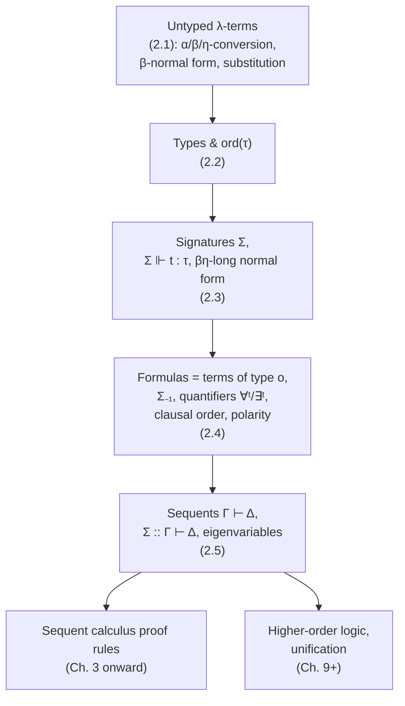

# Terms, Types, and Formulas in the Simple Theory of Types

[[book-guidelines|↩ Back to guidelines]]

## Why a logic book starts with a syntax chapter

Before Miller writes a single inference rule, he has to answer a boring-sounding but load-bearing question: what, syntactically, *is* a formula? Most logic textbooks answer this in two stages — first define first-order terms (variables, function applications), then bolt on a separate grammar for formulas (predicates, connectives, quantifiers) as a distinct kind of object. That's the classical Tarski-style split, and it works, but it means terms and formulas live in different worlds with different rules for substitution, different notions of "variable capture," and — worst of all for anyone trying to do proof search or unification — two separate machineries you have to keep synchronized.

Church's move, back in 1940, was to collapse that split. In the Simple Theory of Types (STT), there is exactly one syntactic category: the simply-typed $\lambda$-term. A "term" and a "formula" are the same kind of thing; a formula is just a term that happens to have a particular type, called $o$ (omicron). Quantifiers aren't a separate binding construct bolted onto the logic — they're ordinary constants of higher-order function type, and the "binding" in $\forall x. B$ is literally $\lambda$-abstraction in disguise. This is the design decision this whole chapter sets up, and it's what makes the rest of the book possible: every later proof system, every sequent calculus rule, every substitution operation is *one* piece of machinery reused for both terms and formulas, not two.

If you're building a type-checker or an elaborator, this should already feel familiar — it's exactly what Lean, Coq, and every other dependently-typed proof assistant do. `Prop` (or here, type $o$) is just another type; propositions are just terms of that type. Miller is building the untyped-then-typed foundation that those systems formalize a version of.

## Untyped $\lambda$-terms: the substrate before the type discipline

Miller starts with the *untyped* $\lambda$-calculus, even though the book will almost exclusively use the *typed* version afterward. Why bother? Because the untyped calculus and the simply-typed calculus share the exact same **equality theory** ($\alpha$, $\beta$, $\eta$-conversion) — it's cleaner to define that theory once, on the simpler untyped syntax, and then note that typing is an extra discipline layered on top that doesn't change how equality works.

**Building terms.** Fix a fixed, denumerably infinite set of *tokens* (identifiers) — for now "token" and "variable" mean the same thing; the distinction between variables and constants only shows up once we introduce signatures. There are exactly three ways to build a $\lambda$-term:

1. A token, used as a variable, is a term.
2. Given terms $M$ and $N$, their **application** is $(M\ N)$ — juxtaposition, associating to the left.
3. Given a term $M$ and a token $x$, the **abstraction** of $x$ over $M$ is $(\lambda x. M)$, where $x$ is bound with scope $M$.

That's the entire grammar. Every term you'll ever see in this book — including every formula, every quantified statement, every proof-theoretic gadget — is built from just these three constructors.

```rust
// A direct transliteration of the book's three-clause grammar.
enum Term {
    Var(Token),
    App(Box<Term>, Box<Term>),
    Abs(Token, Box<Term>),
}
```

**Conversion, three flavors.** Two terms are **$\alpha$-convertible** if they differ only in bound-variable names — the book identifies $\alpha$-convertible terms outright (so `Term` above really wants de Bruijn indices or a similar scheme if you're implementing it — bound-variable *names* are not semantically part of the term). Then:

- A subterm of the shape $(\lambda x. M)N$ is a **$\beta$-redex**. Rewriting it to $M[N/x]$ (the capture-avoiding substitution of $N$ for $x$ in $M$) is **$\beta$-reduction**; the reverse is $\beta$-expansion. Two terms are **$\beta$-convertible** if a (possibly empty) chain of reductions/expansions connects them.
- A subterm of the shape $\lambda x.(M\ x)$, where $x$ does **not** occur free in $M$, is an **$\eta$-redex** — rewriting it to $M$ is **$\eta$-reduction** (reverse: $\eta$-expansion). This captures "a function that just applies its argument and does nothing else *is* that argument" — extensional identity of functions.
- **$\beta\eta$-convertible** means connected by a chain of both kinds of steps. ($\alpha$-conversion is always silently available too.)

**What breaks without $\eta$:** if you only had $\beta$-equality, $\lambda x. (f\ x)$ and $f$ would count as *different* terms even though they behave identically applied to anything. For a proof system that needs to recognize when two formulas (or two proof terms) are "the same," under-identifying terms means missing valid proofs or duplicating work. $\eta$ closes that gap.

**Normal form.** A term is **$\beta$-normal** if it contains no $\beta$-redex. Positively stated, every $\beta$-normal term has the shape

$$\lambda x_1 \cdots \lambda x_n. (h\ t_1 \cdots t_m), \quad n, m \ge 0$$

where $h, x_1, \ldots, x_n$ are tokens and each $t_i$ is itself $\beta$-normal. The book gives this shape three names you'll see constantly from here on: the sequence $x_1, \ldots, x_n$ is the term's **binder**, the token $h$ is its **head**, and $t_1, \ldots, t_m$ are its **arguments**. This binder/head/arguments decomposition is *the* canonical way higher-order terms get pattern-matched throughout the rest of the book (and, not coincidentally, throughout higher-order unification literature).

**Substitution notation.** Let $\theta$ be a list of pairs $\langle x_1, t_1\rangle, \ldots, \langle x_n, t_n\rangle$. Applying $\theta$ to a term $s$, written postfix as $s\theta$, denotes the $\beta$-normal form of $[\lambda x_1 \cdots \lambda x_n. s]\, t_1 \cdots t_n$ — i.e., "substitute all the $t_i$ for their $x_i$ in $s$, simultaneously, then normalize." Writing substitution as a $\beta$-redex being fired is elegant: it means substitution isn't a *separate* primitive operation you have to define and prove correct independently — it's just an instance of the reduction relation you already have.

**Why the untyped calculus needs a leash.** Curry [1942] showed that mixing untyped $\lambda$-terms with logical connectives is inconsistent — you can build a term (via the fixed-point combinator $Y$) that proves its own negation. That's the concrete "what breaks" moment motivating the entire next section: the untyped calculus is Turing-complete and self-referential enough that if you also give it enough logical vocabulary to talk about truth, it collapses into triviality. Types are the fix.

## Types: separating syntactic categories

**The problem types solve** is exactly the Curry inconsistency above, but there's a second, quieter motivation: types let you use $\lambda$-terms to encode syntax for *other* formal systems (Miller's example: encoding the $\pi$-calculus using primitive types $n$ for names and $p$ for processes) without every name accidentally being applicable to every process, or vice versa. Types are a fence around "which expressions are even syntactically meaningful," independent of whether the logic assigns any denotational semantics to that fence.

**The grammar.** Fix a nonempty set $S$ of tokens used as **primitive types** (also called **sorts**). The set of types is the smallest set containing the primitive types and closed under the binary infix **arrow type** constructor $\to$, which associates to the *right*: $\tau_1 \to \tau_2 \to \tau_3$ reads as $\tau_1 \to (\tau_2 \to \tau_3)$. These are called **simple types** — no binders, no type variables, no polymorphism. (Miller flags this restriction explicitly; richer type systems — polymorphic in $\lambda$Prolog, dependent in Elf/LF — show up in later chapters and other systems, but the base STT here is deliberately simple.)

An important subtlety the book stresses: a syntactic type like $n \to p$ does *not* denote the full set-theoretic function space from names to processes. Every syntactic term of type $n \to p$ *does* denote such a function (apply it, $\beta$-normalize, get a process), but not every function from names to processes corresponds to a syntactic term of that type — e.g., a function defined by an infinite case split on names has no finite $\lambda$-term representation. Types here classify *expressions*, not the full semantic function space.

**Order of a type.** Write $\tau$ as $\tau_1 \to \cdots \to \tau_n \to \tau_0$ with $\tau_0 \in S$ (a primitive target type) — the $\tau_i$ are $\tau$'s **argument types**, $\tau_0$ its **target type**. The **order** of a type, $\mathrm{ord}(\tau)$, is defined recursively:

$$\mathrm{ord}(\tau) = 0 \text{ if } \tau \in S, \qquad \mathrm{ord}(\tau_1 \to \tau_2) = \max(\mathrm{ord}(\tau_1) + 1,\ \mathrm{ord}(\tau_2))$$

So $\tau$ has order $\le 1$ exactly when all its argument types are primitive — that's the boundary between "first-order-shaped" and "genuinely higher-order" types (a function that takes a *function* as an argument bumps the order). This single integer is going to matter a lot later: it's how the book later distinguishes first-order logic (quantifiers restricted to order-2 types) from genuinely higher-order logic, and it's a standard proxy in the unification literature for "how hard is unification here" — order 0/1 unification problems are comparatively tame; higher orders are where Miller (pattern) unification and general higher-order unification undecidability live.

```rust
enum Ty {
    Sort(String),                 // primitive type / sort
    Arrow(Box<Ty>, Box<Ty>),      // right-associative
}

fn order(t: &Ty) -> u32 {
    match t {
        Ty::Sort(_) => 0,
        Ty::Arrow(a, b) => (order(a) + 1).max(order(b)),
    }
}
```

## Signatures and typed terms: the typing judgment $\Sigma \Vdash t : \tau$

**Signatures** formally declare which tokens have which types. A signature (over $S$) is a set $\Sigma$ of pairs $x : \tau$; signatures must be **determinate** — a token can't be declared with two different types in the same signature. A signature has **order $n$** if every type it assigns has order $\le n$; in particular a **first-order signature** only assigns types of order $\le 1$.

The **typing judgment**, written $\Sigma \Vdash t : \tau$, relates a signature, a term, and a type — variables in $\Sigma$ are treated as bound over the whole judgment. The book first gives the "obvious" three rules (variable, application, abstraction) that work over arbitrary terms, but then makes a deliberate restriction: **only $\beta$-normal terms are given types** in this book. The official rules (Figure 2.1 in the source) are:

$$\dfrac{\Sigma, x_1:\tau_1, \ldots, x_n:\tau_n \Vdash t : \tau_0}{\Sigma \Vdash \lambda x_1 \cdots \lambda x_n. t : \tau_1 \to \cdots \to \tau_n \to \tau_0}$$

$$\dfrac{\Sigma \Vdash t_1 : \sigma_1 \quad \cdots \quad \Sigma \Vdash t_n : \sigma_n \quad\quad h : \sigma_1 \to \cdots \to \sigma_n \to \tau_0 \in \Sigma}{\Sigma \Vdash (h\ t_1 \cdots t_n) : \tau_0}$$

both restricted so the target type $\tau_0$ is primitive, $n \ge 0$, and the bound variables $x_1, \ldots, x_n$ don't already occur in $\Sigma$. Notice the shape: this is *exactly* the binder/head/arguments decomposition from the $\beta$-normal form definition, now wearing typing-rule clothes. A well-typed term, by construction, is always in $\beta$-normal form.

**$\beta\eta$-long normal form.** Here's a subtlety worth sitting with. Even though a well-typed term is $\beta$-normal, the *typing judgment itself* can force you to $\eta$-expand. The book's example: if $i \in S$, then $\Sigma \Vdash \lambda x. x : (i \to i) \to i \to i$ is **not provable** — even though $\lambda x.x$ is perfectly $\beta$-normal — but $\Sigma \Vdash \lambda x.\lambda y. (x\ y) : (i \to i) \to i \to i$ *is* provable, and it's the $\eta$-expanded version of the same term. Any term that receives a type is, by this convention, in what's called **$\beta\eta$-long normal form**: first compute the $\beta$-normal form, then $\eta$-expand until every subterm's arity matches what its type demands.

**This is the direct ancestor of Lean's definitional-equality check.** In Lean's kernel, two terms are *defeq* (interchangeable during type checking) when they normalize to the same term under $\beta\eta$(and $\delta,\iota,\zeta$)-reduction — Lean's elaborator routinely $\eta$-expands functions to compare them at the same "arity shape" before checking syntactic equality, exactly as Miller does here to make $\lambda x.x$ and $\lambda x.\lambda y.(xy)$ comparable at the same type. If you're modeling an elaborator on Lean's, $\beta\eta$-long normal form *is* the target representation you normalize terms to before running unification — this is not an analogy, it's the same mechanism under a different name.

```lean
-- Lean example: these two terms are defeq (β η-equal), mirroring the book's
-- λx.x  vs.  λx.λy.(x y)  example at type (i → i) → i → i.
example (f : (Nat → Nat) → Nat → Nat) :
    f (fun x => x) = f (fun x => fun y => x y) := by rfl
```

**What breaks without restricting to $\beta$-normal terms:** if you allowed typing rules over arbitrary (non-normal) terms, the same term could be assigned a type via multiple different reduction paths, and "does this term have this type" would need to quantify over an unbounded search through the reduction relation rather than being a syntax-directed check on the term's head/binder/argument shape. Restricting typing to normal forms is what makes $\Sigma \Vdash t : \tau$ syntax-directed and (for simple types) decidable by structural recursion — precisely the property a type-checker needs.

```rust
// The two typing rules, syntax-directed over β-normal terms.
// (Sketch — a real implementation needs de Bruijn indices or a context stack.)
fn type_check(sig: &Signature, ctx: &Context, t: &NormalTerm, expected: &Ty) -> Result<(), TypeError> {
    match t {
        NormalTerm::Abs(xs, body) => {
            // peel argument types off `expected`, extend ctx, recurse on body
            todo!()
        }
        NormalTerm::App(head, args) => {
            let head_ty = ctx.lookup(head).or_else(|| sig.lookup(head))?;
            // check args against head_ty's argument types, target must be primitive
            todo!()
        }
    }
}
```

## Formulas: just terms of type $o$

This is Church's collapsing move made precise. Rather than a separate grammar, **formulas are terms of the particular type $o$** (omicron). To get a specific logic off the ground, you first fix a signature of logical constants, denoted $\Sigma_{-1}$ (the "signature of the foundations" — the $-1$ suggests it's more fundamental than the ordinary non-logical signature $\Sigma_0$ that comes after it).

**Two kinds of logical constants.**

1. **Propositional constants** — types built only from $o$, order $\le 1$. The book's running example for classical/intuitionistic first-order logic (used starting in Chapter 4):
$$\{\, t : o,\ f : o,\ \wedge : o \to o \to o,\ \vee : o \to o \to o,\ \supset : o \to o \to o \,\}$$
   $\wedge$, $\vee$, $\supset$ are written infix; $(( \wedge\ P)\ Q)$ prints as $P \wedge Q$. Precedence: $\wedge$ binds tighter than $\vee$, which binds tighter than $\supset$; $\wedge,\vee$ associate left, $\supset$ associates right.

2. **Quantifiers** — $\forall^\tau$ and $\exists^\tau$, one pair *for every type* $\tau$ (countably many quantifier constants total), each of type $(\tau \to o) \to o$. This is the payoff of collapsing terms and formulas into one syntax: **quantification is just application of a higher-order constant to a $\lambda$-abstraction.** $\forall^\tau(\lambda x. B)$ is abbreviated $\forall^\tau x. B$ (or just $\forall x. B$ when $\tau$ is inferable). The "binding" you see in $\forall x. B$ is not a separate binding mechanism the logic had to invent — it's literally the pre-existing $\lambda$-binder, reused.

**Why this is elegant, not just economical:** every fact you already proved about $\lambda$-term substitution, $\alpha$-renaming, and capture-avoidance carries over to quantifier instantiation *for free*. Instantiating $\forall x. B$ with witness $N$ is exactly $\beta$-reducing $(\forall^\tau (\lambda x.B))$ applied appropriately — the substitution machinery from Section 2.1 is not duplicated, it's reused verbatim.

**Non-logical signature $\Sigma_0$.** After fixing $\Sigma_{-1}$, you separately declare the domain-specific vocabulary. For $c : \tau_1 \to \cdots \to \tau_n \to \tau_0 \in \Sigma_0$ with $\tau_0$ primitive: if $\tau_0 = o$, $c$ is a **predicate symbol** of arity $n$; if $\tau_0 \in S \setminus \{o\}$, $c$ is a **function symbol** of arity $n$. A $(\Sigma_{-1} \cup \Sigma_0)$-term of type $o$ is a **formula**.

**Propositional vs. first-order vs. higher-order.** A logic is *propositional* if it has no quantifiers. It's *first-order* if its only quantifiers come from
$$\{\forall^\tau : (\tau \to o) \to o \mid \tau \in S \setminus \{o\}\} \cup \{\exists^\tau : (\tau \to o) \to o \mid \tau \in S \setminus \{o\}\}$$
— note these quantifier types are all order 2, and crucially $\tau$ ranges only over *non-formula* primitive types, so first-order quantification never quantifies over formulas or functions-to-formulas. Drop that restriction and you get higher-order logic (Chapter 9 onward). This order-based classification is exactly why $\mathrm{ord}(\tau)$ from Section 2.2 was worth defining carefully — it's the technical knob that separates "first-order" from "higher-order" throughout the book.

**Clausal order.** For a formula, `order(B)` counts nested left-of-$\supset$ implications:
$$\mathrm{order}(A)=0 \text{ (}A\text{ atomic, } t, \text{ or } f\text{)}, \quad \mathrm{order}(B_1 \wedge B_2)=\mathrm{order}(B_1 \vee B_2)=\max(\mathrm{order}(B_1),\mathrm{order}(B_2))$$
$$\mathrm{order}(B_1 \supset B_2) = \max(\mathrm{order}(B_1)+1,\ \mathrm{order}(B_2)), \qquad \mathrm{order}(\forall x.B)=\mathrm{order}(\exists x.B)=\mathrm{order}(B)$$
so negation $\neg B := B \supset f$ satisfies $\mathrm{order}(\neg B) = \mathrm{order}(B) + 1$. The **clausal order of a set/multiset of formulas** is the max clausal order among them. This measure resurfaces later as a complexity/expressivity classification for logic-programming fragments (Horn clauses, Hereditary Harrop formulas, etc.) — how deeply implication nests is exactly what controls how expressive a fragment of clauses is as a programming language.

**Positive/negative subformula occurrence.** Polarity tracks which "side" of an even/odd number of implications a subformula sits on:

1. $B$ is a positive occurrence of itself.
2. If $C$ is positive in $B$, then $C$ is positive in $B \wedge B'$, $B' \wedge B$, $B \vee B'$, $B' \vee B$, $B' \supset B$, $\forall^\tau x.B$, $\exists^\tau x.B$ — and $C$ is **negative** in $B \supset B'$ (going to the left of an implication flips polarity).
3. Symmetrically for negative $C$ (flips back to positive on the left of $\supset$).

If $B$ has no implications, everything in it is positive. **This is not cosmetic bookkeeping** — polarity is what later chapters use to decide which inference rules apply invertibly (positive vs. negative connectives behave differently in focused/goal-directed proof search), so this section is quietly laying groundwork for the sequent calculus's proof-search behavior, not just classical proof theory.

## Sequents: bundling formulas for provability claims

**The problem sequents solve:** provability is rarely about a single isolated formula — you usually want to state "assuming $B$, prove $C$," a *hypothetical* judgment. Gentzen's [1935] answer was the **sequent**, a structured pair $\Gamma \vdash \Delta$ of two collections of formulas. Read informally in classical/intuitionistic logic: $\Gamma \vdash \Delta$ is provable when some formula in $\Delta$ follows from the assumptions in $\Gamma$.

Miller flags several axes along which sequents vary through the book, each a deliberate design choice:

- **Collection kind**: lists, multisets, or sets — "almost always multisets" in this book. This matters operationally: lists remember order (so matching $B, \Gamma'$ against a collection has exactly one way to peel off the first element), multisets forget order but remember multiplicity ($n$-element multiset has up to $2^n$ ways to split into $\Gamma', \Gamma''$), and sets forget both order and multiplicity (up to $3^n$ ways to split, since an element can go in either side or both). Choosing multisets is a real semantic commitment: it says "the sequence in which you wrote your hypotheses down doesn't matter, but if you have two copies of a hypothesis, that multiplicity is meaningful" (this becomes essential later for linear logic, where multiplicity is everything).
- **One-sided vs. two-sided**: $\vdash \Delta$ (one-sided, common in classical-logic presentations that push everything to the right via negation) vs. $\Gamma \vdash \Delta$ (two-sided — $\Gamma$ is the *left-hand side*, $\Delta$ the *right-hand side*). Contexts can be further split into **zones** separated by semicolons, e.g. $\Gamma; \Gamma' \vdash \Delta; \Delta'$ — a device later chapters use to track different *kinds* of hypotheses/goals (e.g., linear vs. unrestricted resources) within one sequent.
- **Eigenvariables and signature prefixes.** Quantifier rules in the sequent calculus introduce fresh variables — **eigenvariables** — that must be well-scoped and correctly typed. To make that precise, a sequent gets **prefixed with a signature**: $\Sigma :: \vdash \Delta$ or $\Sigma :: \Gamma \vdash \Delta$. Every formula in $\Gamma$ or $\Delta$ must then type at $o$ under the union $\Sigma_{-1} \cup \Sigma_0 \cup \Sigma$.

**This eigenvariable-scoping device is exactly the "context" plumbing you already know from type-checkers and elaborators.** $\Sigma :: \Gamma \vdash \Delta$ is structurally the same move as a typing context threaded through a Rust borrow-checker pass or a Lean `MetaM` local context: a signature (context) that scopes which fresh names are legal to mention, carried alongside the actual judgment. The book explicitly frames eigenvariables as *locally bound over the sequent* rather than governed by Gentzen's original global side-conditions — which is closer to how modern proof assistants manage local contexts than to Gentzen's original presentation.

## Where this leads

Every later chapter's inference rules operate on the syntax defined here: sequent-calculus rules for classical, intuitionistic, and linear logic (Ch. 3–8) are rules that rewrite $\Sigma :: \Gamma \vdash \Delta$-shaped sequents whose $\Gamma, \Delta$ are formulas in the sense of this chapter, and rule soundness leans on the $\beta\eta$-equality theory established here. Higher-order quantification (Ch. 9 onward) is the same $\forall^\tau, \exists^\tau$ machinery with the order-2 restriction lifted. The polarity notion from Section 2.4 resurfaces as the backbone of focused/goal-directed proof search.



**Connection to the standing projects.** This chapter is the shared ancestor of both a type-checker/verifier and a proof-checker, which is exactly the overlap the "Rust verifier + logic-clause specs" project needs: the typing judgment $\Sigma \Vdash t : \tau$ *is* the type-checking pass, and the same judgment (extended with $\Sigma_{-1}$'s logical constants) is what checks that something claiming to be a formula actually is one — one syntax-directed recursive function serves both roles. Substitution ($s\theta$, defined via $\beta$-reduction) and eigenvariable scoping ($\Sigma :: \Gamma \vdash \Delta$) are the recurring plumbing that will show up again, structurally unchanged, under Hoare-triple soundness arguments (substituting witnesses into preconditions/postconditions) and under an elaborator's context management.

For the meta-programming elaborator project specifically: **$\beta\eta$-long normal form is directly relevant to unification.** Higher-order term syntax — binder/head/arguments decomposition, the requirement to $\eta$-expand before comparing terms — is precisely the representation Miller-pattern unification and general higher-order unification operate over. When you get to designing the elaborator's metavariable-unification routine, the normal form defined in this chapter (not the raw $\beta$-normal form) is the representation you want terms in before you start comparing or unifying them, exactly as Lean's kernel does at each defeq check.
