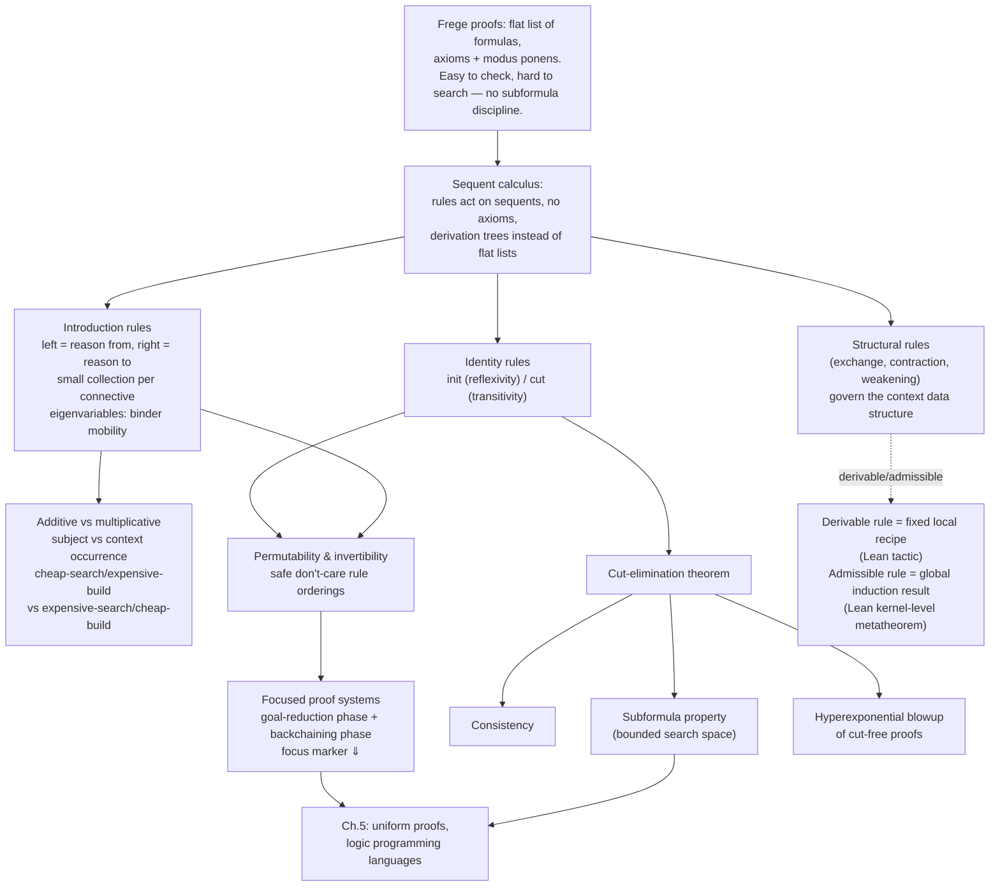

# The Sequent Calculus

[[book-guidelines|↩ Back to guidelines]]

## Why not just chain formulas together?

The oldest, most familiar notion of a "formal proof" is a Frege/Hilbert-style proof: pick some axiom schemas, pick one inference rule (modus ponens), and a proof is just a flat list of formulas where each one is either an axiom instance or follows from two earlier ones by modus ponens. It's the proof style you'd get if you tried to make "and therefore..." completely mechanical. Here's a genuine specimen from the book — a seven-line proof of $f \supset w$ (from false, anything follows) using three axiom schemas and modus ponens:

$$
\begin{aligned}
&(1)\ ((w \supset f) \supset f) \supset w &&\text{by (Ax3)}\\
&(2)\ (((w \supset f) \supset f) \supset w) \supset (f \supset (((w \supset f) \supset f) \supset w)) &&\text{by (Ax1)}\\
&(3)\ f \supset (((w \supset f) \supset f) \supset w) &&\text{by mp } (1),(2)\\
&(4)\ (f \supset (((w \supset f) \supset f) \supset w)) \supset ((f \supset ((w \supset f) \supset f)) \supset (f \supset w)) &&\text{by (Ax2)}\\
&(5)\ (f \supset ((w \supset f) \supset f)) \supset (f \supset w) &&\text{by mp } (3),(4)\\
&(6)\ f \supset ((w \supset f) \supset f) &&\text{by (Ax1)}\\
&(7)\ f \supset w &&\text{by mp } (6),(5)
\end{aligned}
$$

Notice the disease: almost none of lines (1)–(6) is a subformula of the goal, $f \supset w$. The proof detours through formulas that have nothing syntactically to do with what you're trying to prove. It's *checkable* — you can verify each step locally — but it gives you almost no guidance for *finding* it. If you were writing a program to search for Frege proofs, you'd have no principled way to decide which axiom instance to try next; the search space is genuinely undirected.

Gentzen's sequent calculus is Miller's answer to "how do we replace this with something a machine can search efficiently." The two changes it makes are structural, not cosmetic:

1. **Inference rules act on sequents, not formulas.** A sequent is a snapshot of a proof-in-progress — assumptions on the left, goal(s) on the right — not a single asserted fact.
2. **There are no axioms.** Every rule has zero or more sequent premises; the entire burden of proof lives in the rules, and the "base case" is a specific structural pattern (the initial sequent), not a chosen list of formula schemas.

This is exactly the shift from "a proof is a list of true things" to "a proof is a *tree* that reduces a goal to sub-goals, bottoming out in trivial cases." That should sound familiar if you've ever written a recursive-descent parser or a tactic-based proof script — it's the same shape.

## What a sequent actually represents

Before the formal rules, Miller motivates two-sided sequents with an ordinary mathematical argument: proving that $n(n+1)$ is always even. You'd normally write this as an informal case split (even $n$ vs. odd $n$), using previously-established lemmas. The book tracks the *state of that argument* — literally, "picture a sheet of paper with your assumptions written at the top and your goal at the bottom" — as a sequent:

$$
T_1 \;=\; \cdot\,; L_1, L_2, L_3 \vdash \forall n.\forall p.(\mathsf{times}\ n\ (\mathsf{s}\ n)\ p) \supset (\mathsf{even}\ p)
$$

Read left to right: a signature prefix ($\cdot$, meaning no eigenvariables bound yet — more on those below), then a collection of assumption formulas, then $\vdash$ ("entails" or "yields"), then a collection of goal formulas. As the proof develops — introducing eigenvariables $n, p$, unfolding a disjunctive lemma into two cases — you get a whole family of sequents $T_2, \dots, T_5$, and the case-split step turns one sequent into two:

$$
\frac{T_4 \qquad T_5}{T_3} \qquad \frac{}{T_2} \qquad \frac{}{T_1}
$$

That's a **derivation tree**: nodes are sequents, each horizontal line is one inference-rule application, read bottom-up as "this sequent's provability reduces to its premises' provability." This tree-of-goals structure is the whole point — it's a search tree, not a flat certificate.

One more generalization Gentzen introduces that's easy to under-appreciate: sequents don't need exactly one formula on the right. A **multiple-conclusion sequent** like

$$
x, y : B_1, B_2, B_3 \vdash C_1, C_2
$$

reads with the left-hand comma as conjunction and the right-hand comma as *disjunction*: semantically, $\forall x.\forall y.[(B_1 \wedge B_2 \wedge B_3) \supset (C_1 \vee C_2)]$. This is what lets classical logic's excluded-middle reasoning live comfortably in the calculus (Chapter 4); intuitionistic logic will later be carved out precisely by *restricting* the right-hand side back to at most one formula.

**Rust framing.** Think of a sequent as a typed judgment your prover's search state carries around: `struct Sequent { sig: Signature, ctx: Vec<Formula>, goals: Vec<Formula> }`, and a derivation tree is the call tree of a recursive `fn prove(seq: &Sequent) -> Option<ProofTree>` where each successful call is annotated with which rule fired. This is *precisely* the shape you want for the embedded theorem prover in the standing project: the sequent is your proof-search state, not a mathematical curiosity.

## The three families of inference rules

Miller partitions every rule in his sequent calculi into three kinds. This partition is worth internalizing because it will recur, unchanged in spirit, through classical, intuitionistic, and linear logic later in the book.

### 1. Structural rules — rules about the *container*, not the content

Three of them, each with a left and right version:

$$
\frac{\Sigma :: \Gamma, B, C, \Gamma' \vdash \Delta}{\Sigma :: \Gamma, C, B, \Gamma' \vdash \Delta}\ xL
\qquad
\frac{\Sigma :: \Gamma, B, B \vdash \Delta}{\Sigma :: \Gamma, B \vdash \Delta}\ cL
\qquad
\frac{\Sigma :: \Gamma \vdash \Delta}{\Sigma :: \Gamma, B \vdash \Delta}\ wL
$$

(and symmetric right-hand versions $xR, cR, wR$). **Exchange** ($xL/xR$) reorders context; **contraction** ($cL/cR$) collapses two copies of the same assumption into one; **weakening** ($wL/wR$) inserts an unused formula. Whether you need these at all is a choice about your data structure for contexts: lists need all three, multisets need only contraction and weakening (order doesn't matter), sets need only weakening (duplicates can't exist). Miller commits early: contexts will almost always be multisets, so exchange never appears again in the book, and any set you want to reason about gets coerced into a multiset first.

*What breaks without contraction/weakening:* if you can never duplicate or discard an assumption, every hypothesis must be used exactly once — that's not classical/intuitionistic logic anymore, that's *linear logic* (Chapter 6). The presence or absence of these two structural rules is literally the axis that separates "ordinary" logic from resource-sensitive logic. Keep that in your pocket; it's the seed of the whole second half of the book.

### 2. Identity rules — what $\vdash$ *means*

$$
\frac{}{\Sigma :: B \vdash B}\ \mathsf{init}
\qquad\qquad
\frac{\Sigma :: \Gamma \vdash \Delta, B \qquad \Sigma :: B, \Gamma' \vdash \Delta'}{\Sigma :: \Gamma, \Gamma' \vdash \Delta, \Delta'}\ \mathsf{cut}
$$

**init** says a formula proves itself — reflexivity of $\vdash$. **cut** says if $B$ follows from $\Gamma$, and $\Delta'$ follows from $B$ plus $\Gamma'$, then $\Delta, \Delta'$ follows from $\Gamma, \Gamma'$ without mentioning $B$ at all — transitivity of $\vdash$, and exactly the operation of "proving and then using a lemma." Miller stresses a small but important terminological point: since sequents aren't formulas, the zero-premise leaves of a sequent-calculus proof tree are called **initial sequents**, not "axioms" — the word "axiom" is reserved for the Frege-style formula axioms from the opening section. Don't conflate the two; they play different roles.

### 3. Introduction rules — how connectives get proof-theoretic meaning

Every logical connective gets a **small collection** (0, 1, or 2 rules) of left- and right-introduction rules. A left-introduction rule tells you how to *reason from* a connective (it's an assumption); a right-introduction rule tells you how to *reason to* one (it's the goal). For conjunction, implication, universal quantification, and the trivially-true constant $\mathsf{t}$:

$$
\frac{\Sigma :: B, \Gamma \vdash \Delta}{\Sigma :: B \wedge C, \Gamma \vdash \Delta}\ \wedge L
\quad
\frac{\Sigma :: C, \Gamma \vdash \Delta}{\Sigma :: B \wedge C, \Gamma \vdash \Delta}\ \wedge L
\quad
\frac{\Sigma :: \Gamma \vdash \Delta, B \quad \Sigma :: \Gamma \vdash \Delta, C}{\Sigma :: \Gamma \vdash \Delta, B \wedge C}\ \wedge R
\quad
\frac{}{\Sigma :: \Gamma \vdash \Delta, \mathsf{t}}\ tR
$$

$$
\frac{\Sigma :: \Gamma_1 \vdash \Delta_1, B \qquad \Sigma :: C, \Gamma_2 \vdash \Delta_2}{\Sigma :: B \supset C, \Gamma_1, \Gamma_2 \vdash \Delta_1, \Delta_2}\ {\supset}L
\qquad
\frac{\Sigma :: B, \Gamma \vdash \Delta, C}{\Sigma :: \Gamma \vdash \Delta, B \supset C}\ {\supset}R
$$

$$
\frac{\Sigma \Vdash t : \tau \qquad \Sigma :: \Gamma, B[t/x] \vdash \Delta}{\Sigma :: \Gamma, \forall^\tau x.B \vdash \Delta}\ \forall L
\qquad
\frac{\Sigma, y{:}\tau :: \Gamma \vdash \Delta, B[y/x]}{\Sigma :: \Gamma \vdash \Delta, \forall^\tau x.B}\ \forall R
$$

Two things worth pausing on. First, "small collection" is doing real work: it's a design constraint, not a coincidence — connectives get *at most two* rules per side, which is what keeps proof search from exploding combinatorially on the connective structure alone (contrast with the unbounded choice of axiom instance in a Frege proof).

Second — **eigenvariables and binder mobility**, arguably the most subtle idea in this section. Look at $\forall R$: the signature $\Sigma$ grows by $y{:}\tau$ above the line and shrinks back to $\Sigma$ below the line, while the formula gains a $\forall^\tau x$ binder. Nothing is substituted for anything; the *binder itself relocates* — from binding a variable at the level of the sequent's signature, to binding it at the level of the formula. Read Miller's own reformulation, which makes the mobility more visually obvious:

$$
\frac{\Sigma, x{:}\tau :: \Gamma \vdash \Delta, B}{\Sigma :: \Gamma \vdash \Delta, \forall^\tau x.B}\ \forall R
$$

The side condition that makes this sound is exactly what you'd guess: $y$ (or $x$) must not occur free anywhere else in the conclusion. Gentzen's own name for such a sequent-bound variable is **eigenvariable**. In $\forall L$, by contrast, you *do* substitute — the premise needs $\Sigma \Vdash t:\tau$ (some term $t$ of the right type is available in scope) and instantiates the bound variable with it.

**Lean framing (primary here — this is core proof theory).** This eigenvariable discipline is *exactly* what Lean's kernel does when it checks a `fun (y : τ) => ...` term against a `∀ y : τ, P y` goal, or what `intro y` does in tactic mode: it introduces a genuinely fresh local constant into the local context and discharges the goal for that fresh name, never letting it escape. The side condition "$y$ not free below the line" is the proof-theoretic ancestor of Lean's scope discipline for local hypotheses — get it wrong (let a variable escape its scope, or accidentally unify it with something outside its binding site) and you've built an unsound rule, the same failure mode as a broken `intro`/`revert` pairing or a metavariable that leaks out of its telescope. If your meta-programming elaborator resolves implicit arguments via metavariable unification, this is the same freshness discipline you need for the metavariables you generate for implicit binders — an eigenvariable *is* a metavariable that's promised never to be instantiated, only ever named.

## Additive vs. multiplicative: the same rule, two shapes

This is a distinction that looks like bookkeeping at first and turns out to be a genuine algorithmic tradeoff. When a rule has two premises, there are two ways the context can relate across premises and conclusion:

- **Multiplicative**: the premises' contexts are *merged* (concatenated) to form the conclusion's context. `cut` and $\supset L$ are multiplicative — look again: $\Gamma_1, \Gamma_2$ in the conclusion, $\Gamma_1$ in one premise and $\Gamma_2$ in the other.
- **Additive**: every premise carries the *same* context as the conclusion. $\wedge R$ is additive — $\Gamma \vdash \Delta$ in both premises, unchanged in the conclusion.

Miller then generalizes this beyond two-premise rules with a sharper definition, worth stating precisely because it's reused throughout the book: classify each formula occurrence in a rule's conclusion as a **subject occurrence** (the one thing the rule is actually about — the introduced connective in an introduction rule, both repeated occurrences in `init`, nothing at all in `cut`) or a **context occurrence** (everything else). A rule is **additive** if every context occurrence in the conclusion appears in *every* premise; **multiplicative** if every context occurrence appears in *exactly one* premise.

Conjunction can be given multiplicative introduction rules too:

$$
\frac{\Sigma :: B, C, \Gamma \vdash \Delta}{\Sigma :: B \wedge C, \Gamma \vdash \Delta}\ {\wedge}L_m
\qquad
\frac{\Sigma :: \Gamma_1 \vdash \Delta_1, B \qquad \Sigma :: \Gamma_2 \vdash \Delta_2, C}{\Sigma :: \Gamma_1, \Gamma_2 \vdash \Delta_1, \Delta_2, B \wedge C}\ {\wedge}R_m
$$

and Exercise 3.2 in the book makes precise something that's intuitively clear: with weakening and contraction on hand, the additive and multiplicative versions of $\wedge$'s rules are *interderivable* — you can build one style of rule out of the other plus structural rules, and vice versa. The book even runs this construction explicitly: chaining `init`, `∧R`, `∧Lm`, and `cut` derives an instance of `cL` (contraction), and a symmetric chain derives an instance of `wL`. That's your first live example of a **derivable rule**: a rule isn't primitive, but a fixed recipe of primitive rules simulates every instance of it. (The book formalizes the derivable-vs-**admissible** distinction later, in §4.4 — admissible is the weaker, "true for every provable instance but not by a fixed local recipe" cousin — but the mechanism is already on the page here.)

Why does this partition matter operationally, not just aesthetically? Because it maps directly onto a build-vs-search cost tradeoff:

- **Additive rules** are *cheap to search* (both premises share pointers to the same context — no bookkeeping about who gets which formula) but *expensive to build* (checking that two large contexts are actually equal, which can mean comparing thousands of formulas).
- **Multiplicative rules** are *cheap to build* (just splice two premise-contexts together) but *expensive to search* (you must guess how to split the conclusion's context across two premises — exponentially many ways to partition a multiset).

**Rust framing.** This is the difference between an enum variant that clones/shares a `Rc<Context>` unchanged across both recursive calls (additive: cheap to dispatch, but equality-checking two giant contexts before merging results is where the cost hides) versus one that must partition a `Vec<Formula>` into two disjoint sub-vectors before recursing (multiplicative: trivial to recombine results, but the partition itself is a combinatorial search — literally the "how do I split this multiset of resources between two subgoals" problem that a naive linear-logic solver chokes on). If you're building a theorem prover that has to choose which connective-handling strategy to implement for performance, this section is telling you exactly where the cost is hiding in each choice, and it's the direct reason linear logic (which needs multiplicative $\otimes$) requires more careful context-splitting machinery than everyday $\wedge$.

## Derivations, proofs, and the endsequent

With rules in hand, the book nails down the vocabulary precisely, because "proof" gets used loosely elsewhere and shouldn't be here:

- A **derivation** for a sequent $S$ is a tree of inference rule applications rooted at $S$ (the **endsequent**), where every rule's conclusion is either the root or the premise of another rule application in the tree. Leaves may be *open* (unjustified, no line drawn over them) — a derivation can be a work-in-progress.
- A **proof** is a derivation where every leaf is justified — i.e., is the conclusion of a zero-premise rule (`init`, `tR`, ...). No open leaves.
- Given a fixed proof system $\mathcal{X}$ (a chosen set of rules), we write $\Sigma :: \Gamma \vdash_{\mathcal{X}} \Delta$ to say the sequent has a proof in $\mathcal{X}$, with the obvious shorthands dropping empty $\Sigma$ or $\Gamma$.

This "derivation = possibly-incomplete search tree, proof = complete one" distinction is exactly the difference between a partially-elaborated tactic proof state in Lean (open goals still visible) and a finished term the kernel accepts.

## Permutation and invertibility — why order-of-rules matters for search

Two introduction rules can sometimes be applied in either order and land on the same set of leaf sequents — just with the tree restructured. The book's example: proving $\Sigma :: \Gamma, p \vee q \vdash r \supset s, \Delta$, you can do $\supset R$ first then $\vee L$, or $\vee L$ first then $\supset R$ (twice). Both derivations bottom out at the same two premises, $\Gamma, p, r \vdash s, \Delta$ and $\Gamma, q, r \vdash s, \Delta$.

This isn't just a curiosity — it's a pruning strategy for search. If a naive search tries the first order, fails because $\Gamma, p, r \vdash s, \Delta$ has no proof, and then — not recognizing the permutation — retries with the rules in the other order, it wastes work re-deriving a premise it already knows is unprovable. Knowing *which* rules permute over each other tells a search procedure which orderings are redundant to explore.

Some permutations require extra structural rules to witness (Figure 3.6's example needs a weakening on each side plus a contraction to reassemble); if your proof system doesn't admit those structural rules — as intuitionistic logic won't, later — the permutation may simply not hold.

This leads to the sharper, load-bearing concept: an inference rule is **invertible** if the converse of "premises provable $\Rightarrow$ conclusion provable" also holds — i.e. "conclusion provable $\Rightarrow$ premises provable." Practically: if you're searching for a proof of a sequent and an invertible rule applies, you can *always* apply it, in any order relative to other invertible rules, with zero risk of accidentally making the goal unprovable. It's a don't-care choice — a step you can commit to without keeping a backtracking record.

*What breaks without invertibility knowledge:* a search procedure that treats every rule choice as equally risky has to backtrack over every rule application, including the ones that were actually safe. Recognizing invertible rules is precisely what shrinks the branching factor of proof search from "every rule is a gamble" down to "only a genuinely small set of choices are gambles" — which is the whole setup for focusing, next.

## Focused vs. unfocused: taming the choice explosion

Here's the problem in concrete numbers. Suppose $\Gamma$ has 1000 non-atomic formulas and you're trying to prove $\Gamma, B_1 \vee B_2, C_1 \wedge C_2 \vdash A$ for atomic $A$. An *unfocused* rule application has to pick which of the 1002 non-atomic occurrences gets its connective introduced next — "one of about a million choices," as the book puts it, most of which don't matter because of permutability (the order between $\wedge L_m$ and $\vee L$ in the example derivation doesn't affect the resulting premises).

**Focusing** is the fix: organize the search into two alternating, disciplined phases.

1. **Goal-reduction phase**: apply only right-introduction rules, chasing a non-atomic goal down to something atomic. (These are exactly the invertible steps you just earned the right to apply freely.)
2. **Backchaining phase**: pick — this is the one genuine choice point — a single formula from the left context to focus on, and apply left-introduction rules to *it specifically*, without revisiting the choice mid-way.

The notation for "this formula is under focus" is the **down-arrow / focus marker** $\Downarrow$: sequents of the shape $\Sigma :: \Gamma \Downarrow D \vdash A$ (Chapter 5) or the two-zone version $\Sigma :: \Psi; \Delta \Downarrow D \vdash \Gamma; \Upsilon$ (Chapter 6) mark $D$ as the formula currently being decomposed under focus, as opposed to the whole undifferentiated context being fair game. Historically, Miller notes, this two-phase idea was first formalized via **uniform proofs** (Miller, Nadathur, et al., 1987/1991) organized around the left/right distinction, and then Andreoli (1992) reworked it for linear logic around the more fundamental invertible/non-invertible distinction — the version that generalizes better.

*What breaks without focusing:* nothing is unsound — unfocused (Gentzen-style) sequent calculus is complete. What breaks is *tractability of search*. Unfocused proof search has to consider redundant permutations of essentially-equivalent rule orderings as if they were distinct branches. Focusing collapses all of that redundancy into a small number of canonical, "synthetic" steps — which is exactly the mechanism a logic-programming interpreter needs to run efficiently instead of drowning in permutation-equivalent dead ends.

**This is the single most load-bearing idea in the chapter for the standing project.** A Rust-embedded theorem prover organized around backward proof search is, structurally, exactly this two-phase focused discipline: goal-reduction is your "decompose the current goal by its head connective, no choices to make" pass, and backchaining/focus is your "pick a clause from the program and commit to unifying against it" pass — the same shape as an SLD-resolution step in Prolog, formalized as a proof rule instead of a resolution step. The book will make this precise for $\lambda$Prolog-style languages in Chapter 5, but the proof-theoretic *justification* for why that search discipline is complete — not just a convenient heuristic — is minted right here.

## Cut-elimination: the theorem the whole book leans on

Return to the natural-number example. Once lemmas $L_1, L_2, L_3$ have their own proofs $\Xi_1, \Xi_2, \Xi_3$, the `cut` rule is exactly the mechanism for splicing "prove the lemma" and "use the lemma" into one proof of the goal $G$:

$$
\cfrac{
\cfrac{}{{\cdot} :: {\cdot} \vdash L_1}\;\Xi_1
\qquad
\cfrac{
\cfrac{}{{\cdot} :: {\cdot} \vdash L_2}\;\Xi_2
\qquad
\cfrac{
\cfrac{}{{\cdot} :: {\cdot} \vdash L_3}\;\Xi_3
\qquad
{\cdot} :: L_1, L_2, L_3 \vdash G
}{{\cdot} :: L_1, L_2 \vdash G}\;\mathsf{cut}
}{{\cdot} :: L_1 \vdash G}\;\mathsf{cut}
}{{\cdot} :: {\cdot} \vdash G}\;\mathsf{cut}
$$

Now the theorem: **for every sequent-calculus proof system considered in this book, cut-elimination holds** — a sequent is provable if and only if it is provable *without any use of the cut rule*. (Miller proves versions of this for intuitionistic logic in §5.5 and for linear logic in Chapter 7 — this chapter states it and draws out the consequences.)

Three consequences, each genuinely important, not decorative:

**1. Consistency falls out almost for free.** If both $B$ and $B \supset \mathsf{f}$ ("not $B$") were provable, invertibility of $\supset R$ lets you get $B \vdash \mathsf{f}$ provable, then `cut` glues the two proofs of $\vdash B$ and $B \vdash \mathsf{f}$ into a proof of $\vdash \mathsf{f}$. Cut-elimination says this has a *cut-free* proof — but there's no introduction rule that can conclude $\mathsf{f}$ on the right, and no structural rule helps either. So $\vdash \mathsf{f}$ has no proof at all, which means $B$ and $\neg B$ cannot both be provable. The whole argument only works because cut-elimination guarantees you can always fall back to a cut-free proof to run this "what could the last rule possibly have been" case analysis.

**2. The two halves of a connective are proven to be one connective.** Left- and right-introduction rules give a connective two separate "senses" — arguing *from* it and arguing *to* it — which have no reason a priori to agree with each other or with the connective's model-theoretic truth condition. Cut-elimination succeeding is the proof-theoretic certificate that these senses cohere: you can always eliminate the detour through the cut formula, meaning the "from" and "to" readings of a connective genuinely compose into a single, well-behaved logical operator rather than two accidentally-adjacent syntactic conventions.

**3. The subformula property, and its price: hyperexponential blowup.** In a cut-free proof (first-order, no higher-order quantification), every formula occurring anywhere in the proof is a subformula of some formula in the endsequent — search never has to invent formulas from nowhere; it only ever rearranges pieces of what's already on the page. Contrast this explicitly with the opening Frege proof, where line (1), $((w \supset f) \supset f) \supset w$, is *not* a subformula of the goal $f \supset w$ — that's precisely the "detour through irrelevant formulas" problem cut-elimination's cut-free proofs structurally cannot have. But this guarantee is not free: cut-free proofs can be **hyperexponentially** larger than proofs that use cut (Statman's result, cited in the bibliographic notes: a sequence of theorems $H_n$ with cut-proofs linear in $n$ but whose shortest cut-free proof grows like $h(n)$ where $h(0)=1, h(n+1) = 2^{h(n)}$ — towers of exponentials). Eliminating cuts is, in effect, inlining and re-proving every lemma at every point of use.

*What breaks without cut-elimination — and why the book still wants cut-free proofs anyway.* You'd lose the subformula property, and with it the guarantee that proof search never needs to invent an unbounded formula out of nowhere — which is what makes proof search *decidable-shaped* rather than merely semi-decidable. This is precisely why the book cares: it wants to read a cut-free proof of $P \vdash G$ as a **computation trace** of running logic program $P$ on goal $G$ — the low-level, mundane, machine-checkable structure that Miller compares to Turing-machine configurations rather than to a mathematician's elegant argument (which is exactly what you *want* out of a computation trace, and exactly what you don't want out of a human-readable proof). The size explosion is a feature for this purpose, not a bug: you're not trying to store the cut-free proof for a human to read, you're using cut-elimination as a metatheoretic *license* — "if $P' \vdash^+ P$ in some induction-strengthened system that still has cut-elimination, then goals provable from $P$ are provable from $P'$ in the plain cut-free system too" — reasoning directly about programs via their proof-theoretic behavior, without ever materializing the giant cut-free proof.

**Lean framing.** This is the cleanest analogy in the whole chapter. Lean's kernel *never performs anything like a cut step* — it works with fully elaborated, already-normalized terms, and type-checking is essentially subformula-bounded: checking `e : T` only ever inspects subterms of `e` and subtypes reachable from `T`, never conjures an arbitrary intermediate lemma mid-check. The kernel's tractability *is* the subformula property in action. Meanwhile, `have`/`suffices` in tactic mode — "prove this intermediate lemma, then use it" — is exactly a `cut`: convenient, human-scale, lemma-oriented reasoning, elaborated away before the kernel ever sees it, precisely because the kernel wants the cut-free (fully inlined) version. Cut-elimination is the theorem that guarantees this elaboration-away step is always *possible in principle*, even though (as the hyperexponential-blowup result shows) you'd never actually want to force it to completion and hand the kernel the fully-inlined term for anything but small examples — which is exactly why Lean's kernel checks a proof *term* with embedded `let`s and shared subterms (closer to a "proof with cut," reusing subderivations) rather than ever demanding a fully unfolded cut-free tree.

For the Rust-embedded theorem prover: cut-elimination plus the subformula property is the theorem that licenses *bounding your search space to subformulas of the goal and program clauses* — without it, "search for a proof" has no principled stopping/pruning criterion at all.

## Derivable vs. admissible rules — a distinction worth having a name for

The chapter's $\wedge L_m/\wedge R \to cL$ and $\wedge L/\wedge R_m \to wL$ derivations (§3.3, shown above) are the concrete seed of a distinction the book formalizes later (§4.4) but that's worth naming here since it's already on the page: a rule is **derivable** in a system if there's a *fixed local recipe* — a specific combination of the system's own other rules, reusable schematically — that produces it, the way `cL` above falls out of `init`, `∧R`, `∧Lm`, and `cut` chained together once and for all. A rule is **admissible** if it's merely true that *whenever its premises happen to be provable, so is its conclusion* — but there might be no single uniform derivation witnessing every instance; you may have to re-argue it proof-by-proof (often by induction on proof structure).

**Lean framing.** This maps directly onto something you already reach for daily: a **derivable rule is a Lean tactic** — a fixed, reusable combinator built once from primitive tactics/kernel rules, applicable schematically to every matching goal (think `simp` lemmas compiled into a rewrite combinator, or a custom tactic built from `intro`/`apply`/`exact`). An **admissible rule is closer to a theorem proved by induction on derivations** — true of every provable instance, but not something you get "for free" by gluing primitives together; you had to do real metatheoretic work (usually an induction on proof height or structure) to establish it holds universally. Cut-elimination itself is the flagship admissible-rule result of the book: `cut` is admissible for the cut-free fragment of each system (whenever the premises are cut-free-provable, so is the conclusion, cut-free) — but that's proved by a global induction over derivations, not by a local three-line rule-chaining trick.

## How the pieces fit together

## Where this leads

Everything downstream in the book is built directly on this chapter's two big theorems. Cut-elimination and the subformula property are what let Chapter 5's logic-programming languages (Horn clauses, hereditary Harrop formulas) treat proof search as a bounded, terminating-shaped process instead of an open-ended search over arbitrary lemmas — and focusing is the mechanism, formalized here only informally via the $\Downarrow$ marker, that Chapter 5 turns into the actual backchaining discipline of $\lambda$Prolog-style execution. The additive/multiplicative distinction resurfaces as the defining fork between linear logic's two conjunctions ($\&$ vs. $\otimes$) in Chapter 6. If you're building a theorem prover or a logic-clause verifier, this chapter is where its two core guarantees — "search terminates within a bounded space" and "search can be organized into disciplined phases instead of raw backtracking" — first get their proof-theoretic justification.
