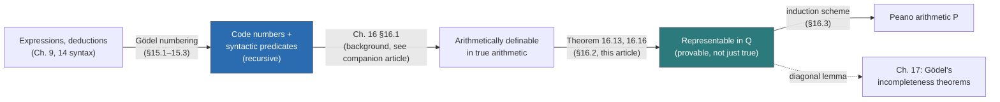
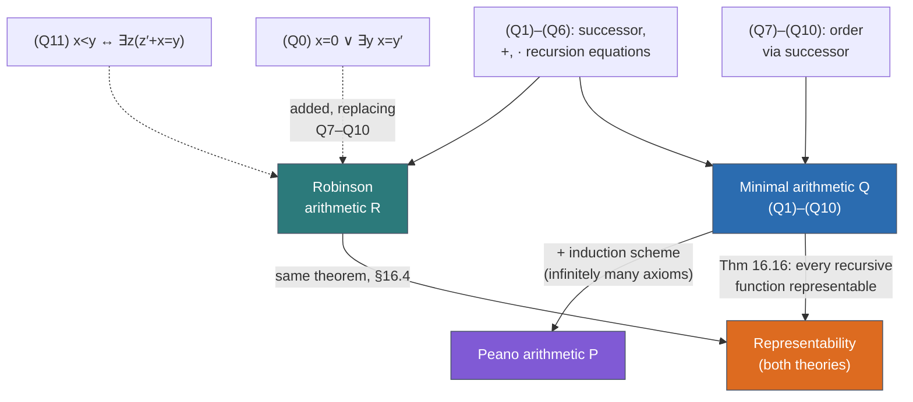

# Arithmetization of Syntax and Representability

[[book-guidelines|↩ Back to guidelines]] · background: [[Recursive-Semirecursive-and-Arithmetical-Sets-and-Relations]]

## Why logic needs to become a number

Everything up through Chapter 14 treats syntax and semantics as one kind of object — sentences, deductions, interpretations — and computability as a completely different kind of object — natural numbers and functions on them. The two theories have been running in parallel, sharing methods (induction on complexity, closure arguments) but never sharing a domain. Chapter 15 closes that gap by brute force: assign every symbol, expression, and deduction a natural number, its **Gödel number**, so that "is this a well-formed formula?" and "is this a valid deduction?" stop being questions about strings and become questions about numbers — exactly the kind of question the recursive-function machinery from Chapters 6–7 already knows how to answer.

**What breaks without arithmetization:** the entire program of the rest of the book — Chapter 16's representability results, Chapter 17's diagonal lemma and Gödel's first incompleteness theorem, Chapter 18's second incompleteness theorem — depends on a formula of arithmetic being able to talk about *proofs*. A formula of the language of arithmetic can only quantify over numbers. If "D is provable from Γ" isn't *reducible to* a numerical fact, there is no way to write a sentence that says "I am not provable" — Gödel's whole trick evaporates. Arithmetization is the unglamorous plumbing that makes self-reference about provability syntactically possible at all.

Chapter 16 then runs the construction in the opposite direction: having shown syntax collapses into number theory, it shows number theory (a specific weak theory of it, $Q$) can talk *back* — can prove, not just state, facts about every recursive function. That two-way bridge — syntax-to-numbers in Ch. 15, numbers-proving-facts-about-functions in Ch. 16 — is what "arithmetization of syntax and representability" names.



The companion article [[Recursive-Semirecursive-and-Arithmetical-Sets-and-Relations]] already covers §16.1's core content — arithmetical definability, the β-function lemma, rudimentary/∃-rudimentary formulas — in depth, since it's the natural continuation of Chapter 7's recursive/semirecursive machinery. This article presupposes that background and concentrates on the two things unique to this topic: how Chapter 15 actually builds the Gödel numbering and shows syntactic operations recursive, and how §§16.2–16.4 sharpen "true in arithmetic" into "provable in a specific, deliberately minimal theory" — first $Q$, then Peano arithmetic $P$, then the alternative minimal theory $R$.

## Gödel numbering: two schemes, and why the second one wins

The book gives two coding schemes, and the contrast between them is itself instructive.

**Scheme 1 (concatenation coding, Table 15-1).** Each symbol gets a decimal-digit code (parenthesis $=1$, tilde $=2$, ..., $n$-place predicates and function symbols get codes built from digit patterns like $6,8,8,\ldots$ and $7,8,8,\ldots$). An expression's code is built by literal decimal concatenation: if $E$ has code $e$ and $D$ has code $d$, the code for $ED$ is
$$e * d = e \cdot 10^{\mathrm{lg}(d,10)+1} + d,$$
where $\mathrm{lg}(d,10)+1$ is the number of digits in $d$. So $(0=0\vee\sim 0=0)$, whose ten symbols have codes $1,7,4,7,29,2,7,4,7,19$, gets the code number $174\,729\,274\,719$ — the digit string is, quite literally, the symbol-code digit strings glued end to end. This is transparent, but Table 15-1's own footnote gives away the problem: functions like "the length (number of symbols) of the expression with this code" are awkward to prove primitive recursive on this scheme, because nothing about a decimal numeral's *value* directly exposes how many symbol-codes were concatenated to build it.

**Scheme 2 (prime-power coding, Table 15-2).** Symbols get codes via a scheme keyed to *arity and category*: parentheses/logical symbols get small odd numbers ($1,3,5,7,9,11,13$), the $i$th variable gets $2\cdot 5^i$, the $n$-place predicate $A^n_i$ gets $2^2\cdot 3^n\cdot 5^i$, the $n$-place function symbol $f^n_i$ gets $2^3\cdot 3^n\cdot 5^i$. An expression $S_1S_2\cdots S_n$ (with symbol-codes $|S_1|,\ldots,|S_n|$) gets the **sequence code** $\#(E)$ for the tuple $(|S_1|,\ldots,|S_n|)$ under the by-now-familiar prime-power scheme from Chapter 7 ($2^n\cdot 3^{a_0}\cdot 5^{a_1}\cdots$). The sentence $0=0$ — officially $=(0,0)$ — gets code $2^6\cdot 3^{13}\cdot 5\cdot 7^{36}\cdot 11^5\cdot 13^{36}\cdot 17^3$, a number of 89 digits.

**What breaks without the second scheme:** everything downstream needs the length function $\mathrm{lh}$, the entry-extraction function $\mathrm{ent}$, and friends to be *primitive* recursive, not just recursive, so that formation-sequence checking terminates on a computable bound. On Scheme 2 this is nearly free: $\mathrm{lh}(e) = \mathrm{lo}(e,2)$, the exponent of $2$ in $e$'s factorization — literally read off the code. Scheme 1's decimal-concatenation coding never gives you that for free. The book uses Scheme 1 only to make Proposition 15.1 vivid, then switches to Scheme 2 the moment it needs to prove things rigorously in §15.2. This mirrors a design decision every serializer/verifier author eventually makes: a human-readable encoding (concatenated bytes, like Scheme 1) and a machine-cheap-to-decode encoding (a format with an explicit length prefix or tag, like Scheme 2's prime-power scheme) are almost never the same format, and picking the wrong one first costs you a rewrite once you need the decoder to be provably total and fast.

```rust
// Scheme 1's concatenation function, made literal: glue decimal digit strings.
fn concat_code(e: u64, d: u64) -> u64 {
    let digits_d = (d as f64).log10().floor() as u32 + 1; // lg(d,10) + 1
    e * 10u64.pow(digits_d) + d
}

// Scheme 2's length function: the exponent of 2 in the prime factorization.
// This IS the "read the length off the code number directly" property Scheme 1 lacks.
fn seq_length(mut code: u64) -> u32 {
    let mut n = 0;
    while code % 2 == 0 { code /= 2; n += 1; }
    n
}
```

A "cryptographic function" table (the book's own name for it, Table 15-3) collects the primitive recursive decoding toolkit built on Scheme 2, all inherited straight from Chapter 7's sequence-coding results:

| Function | Meaning |
|---|---|
| $\mathrm{lh}(s)$ | length of the sequence coded by $s$ |
| $\mathrm{ent}(s,i)$ | the $i$th entry |
| $\mathrm{last}(s)$ | the last entry |
| $\mathrm{ext}(s,a)$ | code with $a$ appended |
| $\mathrm{pre}(a,s)$ | code with $a$ prepended |
| $\mathrm{sub}(s,c,d)$ | code with every occurrence of $c$ replaced by $d$ |

Finite *sets* of expressions get coded too — as the sequence listing their elements in increasing code-number order — which is exactly what makes "$i$ belongs to the set coded by $s$" and "the set coded by $t$ is a subset of the set coded by $s$" fall out as simple definitions over $\mathrm{ent}$, hence recursive with no extra work.

## Proposition 15.1: syntax operations are recursive functions on codes

The payoff starts immediately. Let $n$ be the code for tilde, $l,d,r$ the codes for `(`, `∨`, `)`, and $e$ the code for `∃`. Then:

$$\mathrm{neg}(x) = n * x, \qquad \mathrm{disj}(x,y) = l*x*d*y*r, \qquad \mathrm{exquant}(v,x) = e*v*x.$$

If $x$ is the code of a formula, $\mathrm{neg}(x)$ is the code of its negation — full stop, by construction, since concatenation of codes just *is* concatenation of expressions under this coding. Conjunction, defined as an abbreviation ($X\ \&\ Y \equiv \sim(\sim X \vee \sim Y)$), inherits recursiveness for free by composition: $\mathrm{conj}(x,y) = \mathrm{neg}(\mathrm{disj}(\mathrm{neg}(x), \mathrm{neg}(y)))$. This is **Proposition 15.1**: negation, disjunction, existential quantification, and (with more work, deferred to §15.2) substitution are all recursive — indeed *primitive* recursive — functions of code numbers.

This is the moment the two halves of the book actually touch: a syntactic transformation (negate this formula) and a number-theoretic function (compute $n * x$) are now *the same thing*, differently described. [[Recursive-Function-Theory#Church's thesis|Church's thesis]] then licenses the informal step from "obviously there's an effective procedure that decides whether a sequence of symbols is a formula" to **Proposition 15.2** (the sets of formulas and of sentences are recursive) and **Proposition 15.3** (for recursive $\Gamma$, "$s$ is a deduction of $D$ from $\Gamma$" is a recursive relation). The book is candid that these two propositions are asserted on Church's-thesis grounds first, and only *proved* rigorously — by grinding through the Gödel-numbering machinery — in the optional §§15.2–15.3.

```rust
// Proposition 15.1 made concrete: syntax transformations ARE code-number functions.
// (Toy encoding: a "code" is just the AST itself, standing in for the numeral.)
#[derive(Clone)]
enum Formula {
    Atomic(String),
    Neg(Box<Formula>),
    Disj(Box<Formula>, Box<Formula>),
    ExQuant(String, Box<Formula>),
}

fn neg(f: Formula) -> Formula { Formula::Neg(Box::new(f)) }
fn disj(f: Formula, g: Formula) -> Formula { Formula::Disj(Box::new(f), Box::new(g)) }
// conj is a composition, exactly as the book derives it:
fn conj(f: Formula, g: Formula) -> Formula { neg(disj(neg(f), neg(g))) }
```

The Rust signatures are total functions on a finite inductive type — that totality *is* Proposition 15.1's recursiveness claim, just expressed in a language whose type system enforces termination structurally rather than by an appeal to Church's thesis.

## From "recursive" to "semirecursive" to "decidable theory"

Four corollaries chain off Propositions 15.1–15.3, and each is a small, sharp result worth holding onto individually because Chapter 17 reuses every one of them.

**Corollary 15.4.** If $\Gamma$ is recursive, the set of sentences deducible from $\Gamma$ is *semirecursive*: $Sd \leftrightarrow \exists s\, R(s,d)$ where $R(s,d)$ ("$s$ is a deduction of the sentence coded by $d$ from $\Gamma$") is recursive by Prop. 15.3. This is the formula-theoretic mirror of Chapter 7's "domain of a partial computable function is semidecidable": *searching* for a proof is a one-sided procedure — find one and halt with "yes," never certifiably halt with "no."

**Corollary 15.5 (Gödel completeness theorem, abstract form).** Since demonstrable = valid (by the completeness theorem of Ch. 14) and $\emptyset$ is trivially recursive, **the set of valid sentences is semirecursive.** The book stresses this is the strongest thing statable about completeness *without invoking any particular proof procedure* — it is a pure computability-theoretic fact riding on top of the syntactic one.

**Corollary 15.6** sharpens this to *parametrized* families: for a formula $D(x)$ of arithmetic, the set of $n$ such that $D(n)$ is deducible from a recursive $\Gamma$ is semirecursive (part a), likewise for $\sim D(n)$ (part b), and — this is the one that matters most for what follows — **if for every $n$ either $D(n)$ or $\sim D(n)$ is deducible, the set of $n$ for which $D(n)$ is deducible is fully *recursive*** (part c), by an appeal to **Kleene's complementation principle (Prop. 7.16)**: two complementary semirecursive sets are each recursive. Part (a)'s own proof is a small gem: rather than deal directly with substitution (the one operation from Prop. 15.1 whose recursiveness was deferred), it rewrites $D(n)$ as the logically equivalent $\exists x(x=n\ \&\ D(x))$ and shows the code-number function producing *that* sentence from $D(x)$'s code and $n$ is recursive by composition out of $\mathrm{exquant}$, $\mathrm{conj}$, and a new primitive recursive numeral function $\mathrm{num}(n)$ (with $\mathrm{num}(0)=z$, $\mathrm{num}(n')=a*b*\mathrm{num}(n)*c$ — literally "prepend an accent symbol," recursively). It's a case study in dodging a hard proof (substitution) by routing around it through operations already known safe.

**Corollary 15.7.** A **complete, axiomatizable theory is decidable.** ("Axiomatizable" = the theorem set of *some* recursive $\Gamma$; "decidable" = the theorem set is recursive, not merely semirecursive; "complete" = for every sentence $D$ of the language, $T$ proves $D$ or $\sim D$.) The proof is Corollary 15.6(c) at theory scale: $T^*$ (code numbers of theorems) is semirecursive by 15.4; completeness plus consistency (only one of $D,\sim D$ ever provable, else $T^*$ is trivially everything and hence recursive) makes $T^*$'s complement exactly "$\mathrm{neg}$ of a theorem" — also semirecursive by substituting the recursive function $\mathrm{neg}$ into $T^*$ — so Kleene's principle again finishes the job.

**What breaks without Kleene's complementation principle here:** without it, completeness alone would only buy you semidecidability of $T$'s theorem set (you can always search for a proof of $D$ *or* of $\sim D$ and one of the two searches must eventually succeed, but knowing *in advance* which will succeed is what turns a two-sided race into a genuine decision procedure). This is precisely the dovetailing trick from the companion article's treatment of Proposition 7.16, redeployed one level up — at the level of an entire theory's provability relation rather than a single relation on numbers.

```rust
// Corollary 15.7's dovetailing decision procedure, made concrete: given a complete,
// axiomatizable theory, race proof-search for D against proof-search for ¬D.
fn decide_theorem(gamma: &[Sentence], target: &Sentence) -> bool {
    let mut depth = 0;
    loop {
        if exists_deduction_of_depth(gamma, target, depth) { return true; }
        if exists_deduction_of_depth(gamma, &neg_of(target), depth) { return false; }
        depth += 1; // completeness guarantees one branch eventually fires
    }
}
```

This is *exactly* the shape a proof assistant's decision procedure for a decidable fragment takes: run two semidecision procedures (search for a proof, search for a disproof) in lockstep, and completeness — not decidability of the individual search — is what guarantees the race terminates.

## §§15.2–15.3: making it rigorous — coding formulas, sentences, and deductions

The main-text propositions are stated on trust in Church's thesis; the starred sections earn them properly, and the construction is worth walking through once because it's the direct ancestor of what a parser/type-checker's grammar predicate looks like.

**"$s$ codes an atomic formula"** turns out to be primitive recursive by unpacking the shape of atomic formulas directly in terms of $\mathrm{lh}$, $\mathrm{ent}$, and $\mathrm{last}$: there is an $n < \mathrm{lh}(s)$ with $\mathrm{lh}(s) = 2n+2$, $\mathrm{ent}(s,0)$ an $n$-place predicate code, $\mathrm{ent}(s,1)$ the code for `(`, alternating comma/term codes in between, and $\mathrm{last}(s)$ the code for `)`. Every clause here is a bounded check against a fixed pattern — this is precisely the shape of a rudimentary formula (bounded quantifiers only) from the companion article's §16.1 material, now applied at the meta-level to the coding of formulas themselves rather than to number-theoretic content.

**"$s$ codes a formula"** needs an existential witness — a **formation sequence** $r$, i.e. a sequence of code numbers each of which is either an atomic-formula code or built from *earlier* entries by $\mathrm{neg}$, $\mathrm{disj}$, or $\mathrm{exquant}$, ending at $s$. "$r$ codes a formation sequence for $s$" is primitive recursive by the same bounded-quantifier pattern (Chapter 9's problems supply a syntactic fact — every formula has a formation sequence no longer than the formula itself, with every line a substring — that gives an explicit primitive recursive bound $g(s) = \pi(\mathrm{lh}(s))^{s[\mathrm{lh}(s)+1]}$ on how big $r$ can need to be). So "$s$ codes a formula" is $\exists r < g(s)\, (\ldots)$ — bounded existential quantification over an already-primitive-recursive relation, hence itself primitive recursive.

**Sentencehood** needs one more ingredient: distinguishing free from bound variable occurrences, so as to check "no free variables remain." The relation "$s$ codes a formula and its $e$th symbol is a free occurrence of the $d$th variable" is defined by: $\mathrm{ent}(s,e)$ is the code for that variable, *and* there is no subsequence of $s$ that both contains position $e$ and is itself a formula beginning with a quantification of that variable. Again, primitive recursive by the same bounded-search pattern.

**§15.3** extends the same recipe to *deductions* in the sequent calculus of Chapter 14: code a sequence of sequents $\Gamma_1\Rightarrow\Delta_1, \Gamma_2\Rightarrow\Delta_2,\ldots$ as a code for $(c_1,d_1,c_2,d_2,\ldots)$; "codes a derivation" reduces, rule by rule, to a primitive recursive check that each sequent either starts the derivation or follows from earlier ones by one of (R0)–(R9). The book works one rule in full — the negation-introduction rule
$$\frac{\Gamma\cup\{A\}\Rightarrow\Delta}{\Gamma\Rightarrow\{\sim A\}\cup\Delta}\ \text{(R2a)}$$
— and shows "$e,f$ code a sequent following from $c,d$ by (R2a)" is a primitive recursive relation built entirely from $\mathrm{lh}$, $\mathrm{ent}$, and $\mathrm{neg}$: the two sequents differ by exactly one formula each, and that formula on the conclusion side is the negation (via $\mathrm{neg}$) of the one removed on the premiss side. Every other rule follows the identical template, differing only in which primitive recursive relationship connects the "exiting" and "entering" formulas — which is exactly why the book is confident asserting the general result (Proposition 15.3) without belaboring all nine remaining rules.

```rust
// The §15.3 pattern, generalized: a proof checker's core loop IS this
// primitive-recursive "each step is justified by earlier steps" predicate.
enum Justification { Axiom, Rule { rule_id: RuleId, premises: Vec<usize> } }

struct DeductionStep { sequent: Sequent, justification: Justification }

fn is_valid_deduction(steps: &[DeductionStep]) -> bool {
    steps.iter().enumerate().all(|(i, step)| match &step.justification {
        Justification::Axiom => is_axiom(&step.sequent),
        Justification::Rule { rule_id, premises } =>
            premises.iter().all(|&p| p < i)                     // only cite earlier lines
            && rule_id.conclusion_follows(&step.sequent,
                   premises.iter().map(|&p| &steps[p].sequent))  // check the rule's shape
    })
}
```

This `is_valid_deduction` — bounded, total, always terminates — is the exact software-engineering shadow of Proposition 15.3. A recursive relation on code numbers *is* "a proof checker whose loop is guaranteed to halt"; nothing more mysterious than that.

## Representability: making arithmetic *prove* what it can *say*

The companion article covers §16.1's construction of arithmetical definability in detail — every recursive function is definable by a formula true of it in the standard interpretation $N^*$, ultimately by an $\exists$-rudimentary formula (Lemma 16.11), via the β-function lemma's elimination of exponentiation from sequence coding (Lemma 16.5). Recall only the one distinction that everything below depends on:

> $F(x,y)$ **defines** $f$ in a theory $T$ if, for each particular $a,b$ with $f(a)=b$, the *instance* $F(a,b)$ is a theorem of $T$ (and $\sim F(a,c)$ for each wrong $c$).
> $F(x,y)$ **represents** $f$ in $T$ if the single *universally quantified* statement $\forall y\,(F(a,y)\leftrightarrow y=b)$ is a theorem of $T$, for each such $a,b$.

In true arithmetic these coincide, because every correct instance is automatically a theorem (truth = provability there, trivially). The entire content of §16.2 is that they can be pried apart in a genuinely weaker, honestly axiomatized theory — and that despite this, every recursive function is *still* representable in one particular, deliberately weak such theory.

### Minimal arithmetic $Q$

$Q$ consists of the universal closures of ten open formulas:

$$
\begin{aligned}
(Q1)\quad & 0 \ne x' \\
(Q2)\quad & x' = y' \to x = y \\
(Q3)\quad & x + 0 = x \\
(Q4)\quad & x + y' = (x+y)' \\
(Q5)\quad & x \cdot 0 = 0 \\
(Q6)\quad & x \cdot y' = (x\cdot y) + x \\
(Q7)\quad & \sim x < 0 \\
(Q8)\quad & x < y' \leftrightarrow (x < y \vee x = y) \\
(Q9)\quad & 0 < y \leftrightarrow y \ne 0 \\
(Q10)\quad & x' < y \leftrightarrow (x < y\ \&\ y \ne x')
\end{aligned}
$$

(Q1)–(Q2) pin down that successor is injective and never hits zero; (Q3)–(Q6) are literally the recursion equations for $+$ and $\cdot$ turned into axioms; (Q7)–(Q10) pin down $<$ recursively in terms of successor. That's it — ten sentences, no schema, finitely axiomatizable. $Q$ is famously "too weak" to prove even $0+x=x+0$ as a *universal* statement (there are nonstandard models of $Q$ — the system of ordinal numbers, per the book — where laws that simple fail), yet:

**Theorem 16.13.** *An $\exists$-rudimentary sentence is correct if and only if it is a theorem of $Q$.*

The forward direction (correct $\Rightarrow$ theorem of $Q$) is the substantial half, and it's a beautiful bottom-up induction that is worth internalizing because it's the template for every subsequent representability proof:

1. **Every particular numeral fact is provable.** $\overline{m}=\overline{m}$ by pure logic; $0\ne\overline 1, 0\ne\overline 2,\ldots$ by (Q1); then $\overline m \ne \overline n$ for $m<n$ chains out of (Q2) one successor at a time.
2. **Order facts follow the same way**, from (Q7)–(Q8): $x<\overline 1 \leftrightarrow x=0$, then $x<\overline 2\leftrightarrow(x=0\vee x=1)$, and inductively
$$x < \overline m \leftrightarrow (x=\overline 0 \vee x = \overline 1 \vee \cdots \vee x = \overline{m-1}). \tag{1}$$
3. **Every closed arithmetic term evaluates provably**: $+$ and $\cdot$'s recursion axioms (Q3)–(Q6) let you literally replay the schoolbook long-form calculation ($0''+0'''=0''''' $, worked digit by digit in the book — this is the very same chain the companion article's Rust-verifier framing would call "evaluating the AST") — so for any closed term $t$ with correct value $m$, $t=\overline m$ is provable.
4. **All quantifier-free closed sentences follow**, by pure propositional logic over provable atomic and negated-atomic facts.
5. **Bounded quantifiers reduce to finite conjunctions/disjunctions** via (1) — $\forall x{<}\overline m\, A(x)$ is provably equivalent to $A(0)\ \&\ \cdots\ \&\ A(\overline{m-1})$ — so any correct *rudimentary* sentence is provable.
6. **One unbounded $\exists$ costs nothing**: if $\exists x\,A(x)$ is correct, some particular $A(\overline a)$ is correct and (being rudimentary) provable, so $\exists x\,A(x)$ follows by existential generalization.

**What breaks without Theorem 16.13:** every downstream representability result for individual functions (Lemma 16.14, 16.15, Theorem 16.16) is a direct corollary of it. If $Q$ couldn't be shown to prove *every* correct $\exists$-rudimentary sentence, "every recursive function is representable in $Q$" would collapse back into the weaker (and useless, for Chapter 17's purposes) claim that recursive functions are merely *definable* in true arithmetic.

### From definability to representability, function by function

Two lemmas carry Theorem 16.13's power over to actual functions:

**Lemma 16.14.** Every *rudimentary* function is representable in $Q$, and by a rudimentary formula. The construction is a small but essential patch: if $\varphi(x,y)$ merely *defines* $f$ (true exactly at the right pairs, but nothing forbids other formulas from also being provably true at wrong $y$ for a given $x$ — wait, more precisely: $\varphi$ being rudimentary and correct only gets you *that instance* provable by Thm. 16.13, not the universal negative half), take instead
$$\psi(x,y) \;\equiv\; \varphi(x,y)\ \&\ \forall z{<}y\, \sim\varphi(x,z)$$
— "$y$ is a $\varphi$-witness, and it's the *first* one." Now $\psi(a,b)$ is provable when $f(a)=b$ (immediate from Thm. 16.13, since $\psi$ stays rudimentary), and *critically* the universal negative half $\forall y(y\ne b\to\sim\psi(a,y))$ also becomes provable, because (Q9)/(Q10)'s trichotomy $z<m\ \vee\ z=m\ \vee\ m<z$ (derived analogously to (1) above) plus the already-proved $\forall y{<}b\,\sim\varphi(a,y)$ pins down that no $y\ne b$ can be a "first witness."

**Lemma 16.15.** Composition of representable functions is representable: if $\varphi_f, \varphi_g$ represent $f,g$ in $Q$, then $\exists y(\varphi_f(x,y)\ \&\ \varphi_g(y,z))$ represents $h=g\circ f$ — the universal biconditional $\forall z(\ldots \leftrightarrow z=c)$ follows *purely logically* from the two component biconditionals, no further appeal to $Q$'s axioms needed.

**Theorem 16.16.** Chaining Lemma 16.12 (every recursive function is a composition of rudimentary functions — proved in the companion article's discussion of §16.1) through 16.14 and 16.15: **every recursive function is representable in $Q$**, and every recursive relation is definable in $Q$, both by $\exists$-rudimentary formulas. This is the theorem the entire remaining book depends on.

```rust
// The representability contract, made explicit as a verifier's postcondition.
// "Defines" is a spot-check per input; "represents" is the universal guarantee
// a caller can actually build other proofs on top of.
trait Defines<T>  { fn holds_for(&self, a: T, b: T) -> bool; }        // per-instance truth
trait Represents<T> { fn provable_biconditional(&self, a: T) -> Proof; } // ∀y(F(a,y) ↔ y=b), as a theorem

// Lemma 16.15's composition law is exactly function composition of verified components:
// if f and g each come with a `Represents` proof, h = g ∘ f gets one for free,
// by pure logical composition — no new axioms, no new proof search.
```

### The proof-theoretic argument for why Lean's kernel gets this "for free"

Here is the sharpest way to see what $Q$ is buying, and where its cost sits. In Lean 4 (or any type theory with a computation rule), `Nat` is defined inductively with `zero` and `succ`, and `+`/`*` are defined by *structural recursion whose equations hold definitionally*:

```lean
-- Lean's Nat.add is defined so that these hold by unfolding, not by proof search.
-- Compare directly to Q3/Q4: Q has to state these as non-logical axioms
-- because a first-order theory has no built-in notion of "compute the definition."
theorem two_plus_three : 2 + 3 = 5 := rfl
```

`rfl` succeeds because the kernel's *definitional* equality already reduces `2 + 3` to `5` by unfolding `Nat.add`'s recursive definition — no derivation chain, no axioms cited, no theorem to state. Section 16.2's laborious "$0''+0'''=(0''+0'')'$, ..., therefore $0''+0'''=0'''''$" derivation, worked out step by step from (Q3)–(Q4), is exactly what you're forced to do when your logic has *no* computation rule of its own and every numerical fact has to be won by explicit deduction from axioms. **This is the sharpest "what breaks without representability" story in the whole topic:** a first-order theory like $Q$ has no notion of definitional equality — everything provable has to be *proved*, one universally-quantified biconditional at a time, function by function, via Lemmas 16.14–16.15's explicit construction. Representability in $Q$ is the first-order surrogate for what a type theory's kernel gets structurally, for free, via reduction.

## §16.3: Peano arithmetic and the induction scheme

$Q$'s weakness has one specific, nameable cause: it makes no provision for **mathematical induction** — prove $P(0)$, prove $P(x)\to P(x')$, conclude $\forall x\,P(x)$. The book runs through the familiar interderivability triangle informally first:

- **Mathematical induction** $\Rightarrow$ **complete induction** (assume $P$ holds of every number $\le x$, not just of $x$) by applying ordinary induction to the derived property "every number $\le x$ has $P$," using (Q7)–(Q8) to unpack "$\le x'$" as "$\le x$ or $=x'$."
- **Complete induction** + **dichotomy** (Example 16.17: every $x$ is $0$ or a successor, itself a one-line induction) $\Rightarrow$ the **least-number principle**: if any number has $P$, some *least* number does. Proved by induction on the auxiliary property "no number $<x$ has $P$."
- **Least-number principle** $\Rightarrow$ **mathematical induction**, closing the loop: if $0$ has $P$ and successors of $P$-havers have $P$, neither $0$ nor any successor can be the least $P$-lacker, so nothing lacks $P$.

**Peano arithmetic $P$** formalizes this by adding, to $Q$'s ten fixed axioms, the **induction axiom scheme** — infinitely many axioms, one for each formula $A(x)$ (possibly with extra free variables $y_1,\ldots,y_n$, universally closed):
$$\bigl(A(0)\ \&\ \forall x(A(x)\to A(x'))\bigr) \to \forall x\, A(x).$$
$P$ is finitely axiomatized *plus one scheme* — still primitive recursive as a set of code numbers (deciding "is this the induction instance for formula $A$?" is a mechanical syntactic check), which is exactly what keeps Proposition 15.2/15.3's machinery applicable to $P$ too. With induction available, $0+x=x+0$ and $1+x=x+1$ (Examples 16.18–16.19) become provable by literally formalizing the two-line basis/induction-step arguments — and from there, the ordinary elementary number theory needed for results like Lagrange's four-square theorem becomes reachable.

The book closes the section with a sly, important observation: **induction on formula complexity — the proof technique used throughout Chapters 9–15 — is itself a disguised instance of mathematical induction**, at the meta-level, over a property of the object language rather than a property of numbers. And Theorem 16.13's own proof, described loosely with phrases like "continuing in the same way," is *literally* an induction in the metalanguage establishing something about a theory ($Q$) that lacks induction as an axiom in the object language. The gap between "used in the proof about the theory" and "provable inside the theory" is precisely the gap $P$'s induction scheme exists to close.

## §16.4*: Robinson arithmetic $R$ — the same job, different minimal kernel

The literature sometimes uses "$Q$" for a *different* system, which the book relabels $R$ to avoid confusion. $R$ replaces (Q0 is added, Q7–Q10 are dropped) with two different primitives:

$$
(Q0)\quad x = 0 \vee \exists y\, x=y' \qquad\qquad (Q11)\quad x<y \leftrightarrow \exists z\,(z'+x=y)
$$

$R$ has its own natural nonstandard model (the "system of cardinal numbers," where (Q10) fails), just as $Q$ has one (the "system of ordinal numbers," where (Q0) fails) — so **$Q$ and $R$ are strictly incomparable**: each proves theorems the other doesn't. But the book verifies (and leaves the rest as problems) that the five order-facts Theorem 16.16's proof actually needs — $\overline a<\overline b$ when $a<b$; $\sim x<0$; $0<y\leftrightarrow y\ne 0$; $x<b'\to(x<b\vee x=b)$; $b<y\ \&\ y=b'\to b'<y$ — are *all* derivable in $R$ too, from (Q0)–(Q6) and (Q11) alone. Consequently **every recursive function is representable in $R$ as well.**

The book's own verdict, stated flatly, is the point worth carrying forward: *"Robinson arithmetic would really have done no worse and no better"* — the choice of $Q$ over $R$ (or vice versa) for the incompleteness program in Chapter 17 is not about representability power, which both have in full; it's about which one happens to make the *proof* of Theorem 16.13 easiest to write down. What actually matters for the diagonal lemma and Gödel's theorems is only that *some* correct, finitely axiomatizable theory represents every recursive function — the specific minimal axiom list is an implementation detail, not part of the theorem's content.



## Where this leads

Within the book: Chapter 17's diagonal lemma takes Theorem 16.16's representability of recursive functions and Chapter 15's Gödel numbering of expressions and combines them into a formula $B(y)$ built from a *representable* substitution function, then diagonalizes it against its own Gödel number to produce a sentence $G$ with $\vdash_T G\leftrightarrow B(\ulcorner G\urcorner)$ — the technical engine behind Tarski's theorem, Church's theorem redux, essential undecidability, and Gödel's first incompleteness theorem. None of that construction is available without both halves of this article: Chapter 15 supplies the numbers that let a formula talk about *any* expression including itself; §16.2's Theorem 16.16 supplies the guarantee that talking about a recursive function (in particular, the substitution function the diagonal lemma needs) can be turned into an actual *proof*, not merely a true statement. Chapter 18's second incompleteness theorem and the modal logic of provability (Chapter 27) build directly on the *provability predicate* this chapter makes rigorous.

For the standing project — a Rust verifier plus a Lean-style elaborator — this topic is close to as load-bearing as material in this book gets:

- **Gödel numbering is precisely the mechanism any verifier needs to reason about its own proof objects.** The moment your Rust verifier needs to state and check a property *of a proof term itself* (not just run the term as a checker), you need some encoding of proof terms as first-class data the checker's own logic can quantify over — that's Chapter 15's entire content, transposed. The prime-power coding scheme's design lesson — pick an encoding where the decoder's key operations (length, entry extraction) are cheap and structurally total, even at the cost of readability — is a direct, actionable design constraint for any serialization format feeding a trusted kernel.
- **$Q$'s deliberate minimality is a template for designing a minimal trusted kernel theory.** $Q$ was chosen not because it's the strongest available theory but because it's the *smallest* one that still represents every recursive function — exactly the trade-off a small, auditable trusted computing base (TCB) makes: minimize what must be trusted, while still being complete enough for everything built on top to work. Robinson arithmetic $R$'s existence as an equally-good alternative kernel — different primitives, same representability power — is worth remembering the next time a kernel design choice feels forced: often more than one minimal axiom set gets you to the same guarantees, and the choice comes down to which one makes your own correctness proofs easiest, not which one is "more fundamental."
- **The definability/representability distinction is the formal name for "passes some tests" versus "the elaborator can build other proofs on top of it."** A `Defines`-shaped guarantee (each individual input/output pair separately checked) is a test suite; a `Represents`-shaped guarantee (the single universally quantified biconditional, provable) is what a type checker's kernel actually needs before it can treat a function's behavior as a fact usable inside other proofs — and Lean's `rfl`-provable definitional equalities are the frictionless, built-in analogue of what $Q$ has to buy the hard way, one composition lemma at a time.
