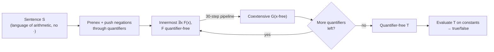
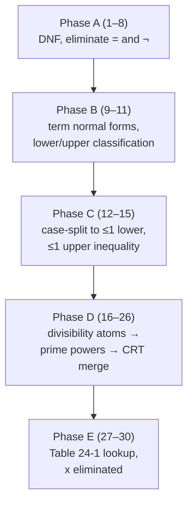

[[book-guidelines|↩ Back to guidelines]]

## Why this chapter exists: a crack in an otherwise sealed wall

Two chapters earlier, the book proved something total: the set of true sentences
of arithmetic — the full language $L = \{0, <, {}', +, \cdot\}$ interpreted over
$\mathcal{N}$ — is not recursive, and not even arithmetical (Ch. 17, via the
diagonal lemma and Tarski's theorem). Every consistent, axiomatizable extension
of $Q$ is undecidable. That result reads like a wall: arithmetic, as a whole,
admits no algorithm.

But undecidability is a property of a *set of sentences*, and the set changes
if you change the language. Delete one symbol from $L$, and you might delete
just enough expressive power to fall back below the threshold where
self-reference and coding become possible — without falling so far that the
fragment becomes trivial. That's exactly what happens twice in this chapter:

- **Presburger arithmetic** — drop $\cdot$ (multiplication), keep $0, <, {}', +$.
  Decidable.
- **Skolem's dual fragment** — drop $<, {}', +$ (order, successor, addition),
  keep $0, \cdot$. Also decidable.

Both are genuine subsets of true arithmetic — every sentence in them is either
provably true or provably false by some finite computation — even though the
union of the two languages, full $L$, is exactly the undecidable theory from
Chapter 17. The chapter's real content is a full constructive proof of the
first result (Presburger's theorem), via an explicit algorithm you could
actually implement. Skolem's theorem is stated, motivated, and left unproved
in the source — this article does the same, but explains *why* it's true and
why its language has to be exactly what it is.

**What breaks without this distinction:** if you don't track *which* symbols
generate undecidability, you can't reason about which fragments of a
first-order theory a decision procedure can safely handle. This is not
academic — it's the difference between "my SMT solver's linear-arithmetic
theory is decidable" and "my SMT solver silently times out because someone
snuck a `*` between two variables into a clause." More on that at the end.

## Quantifier elimination: decidability by construction

Both theorems are instances of one method: **quantifier elimination (QE)**.
The idea, stated at the top of the chapter, is disarmingly simple:

> Given any closed term, we can effectively calculate its denotation. Given
> any atomic sentence, we can effectively determine its truth value; and we
> can therefore do the same for any quantifier-free sentence.

So if you can find, for *every* sentence $S$ of the language, a
**quantifier-free** sentence $T$ that is provably equivalent to it, deciding
$S$ reduces to evaluating $T$ — pure arithmetic on constants, no search. QE is
the transformation that manufactures $T$.

The book is careful about what "equivalent" means here. Two formulas $F(x)$
and $G(x)$ are **coextensive** if their biconditional, universally closed over
every free variable, is true:
$$\forall v_1 \ldots \forall v_n\,(F \leftrightarrow G).$$

This is stronger than "equivalent for this particular $x$" — it has to hold
uniformly, for every assignment to every free variable, because the whole
point is to strip a quantifier and leave the *surrounding* formula (which
still mentions those free variables) unaffected in truth value, no matter
what values get plugged in later. **What breaks without this:** if a rewrite
rule only preserved truth for *some* values of the other free variables, the
QE pipeline would be unsound the moment that sub-formula sits inside a larger
formula with an outer quantifier ranging over exactly those values — which,
after the very first quantifier is eliminated, is exactly the situation you're
in for every step that follows.

Concretely, the algorithm is: put $S$ in prenex form, rewrite $\forall x$ as
$\sim\!\exists x\!\sim$, and eliminate the innermost existential first, working
outward, each time replacing $\exists x\, F(x)$ (with $F$ already
quantifier-free) by a coextensive quantifier-free $G$ with no new free
variables. Repeat until every quantifier is gone.

This is a genuinely general technique, not a one-off trick for this book — it's
the same idea behind Cooper's algorithm and the Omega test for Presburger
arithmetic, and Tarski's QE for real closed fields. Any SMT solver's
`QF_LIA`/`QF_LRA` linear-arithmetic theories, and the *quantified* fragments
above them, ultimately rest on a decision procedure of this shape.



## Setting up the machine: why arithmetic gets rerouted through integers

Here's a subtlety the book handles up front, and it's worth pausing on because
it looks like an odd detour. Presburger's theorem is a claim about sentences
of $L$ (language $\{0,<,{}',+\}$, since $\cdot$ is banned) true in
$\mathcal{N}$ — the *natural numbers*. But the actual elimination procedure
runs in a different, auxiliary language $K$, interpreted over a different
domain: **the integers**.

$K$ has constants $0, 1$; infinitely many one-place divisibility predicates
$D_2, D_3, D_4, \ldots$ (where $D_m(t)$ means "$m$ divides $t$"); the relation
$<$; and function symbols $+$ and $\mathbin{\dot-}$ (truncated integer
subtraction, total on all integers unlike natural-number subtraction). The
interpretation $M$ has domain $\mathbb{Z}$, with the obvious denotations.

The translation from $L$-over-$\mathbb{N}$ to $K$-over-$\mathbb{Z}$ is two
substitutions: replace $x'$ by $x+1$ everywhere, and *relativize* every
quantifier to the nonnegative integers,
$$\forall x(\cdots) \rightsquigarrow \forall x\big((x=0 \lor 0<x) \to \cdots\big), \qquad
\exists x(\cdots) \rightsquigarrow \exists x\big((x=0 \lor 0<x)\ \&\ \cdots\big).$$
Call the result $S^*$. The book states, without belaboring it, that $S$ is
true in $\mathcal{N}$ iff $S^*$ is true in $M$ — which just says the
relativization correctly restricts $\mathbb{Z}$ back down to the copy of
$\mathbb{N}$ sitting inside it. From here on, "term," "formula," "truth" all
mean *in $K$, over $\mathbb{Z}$*.

**What breaks without this move:** the whole elimination pipeline leans
constantly on subtraction — normal forms like $kx + t$ get rearranged into
$0 < s \mathbin{\dot-} r$ almost immediately (step 8), and several of the
later divisibility steps subtract remainders from bound terms. Truncated
subtraction on $\mathbb{N}$ (where $a \mathbin{\dot-} b = 0$ whenever $b > a$)
would force constant case-splitting on sign throughout the algorithm. Working
in $\mathbb{Z}$, where $\mathbin{\dot-}$ is a genuine total inverse of $+$,
lets every algebraic step below be a clean rewrite instead of a three-way
branch. This is exactly the "reduce to a better-behaved domain, then project
back" move a compiler makes constantly — e.g. lowering unsigned subtraction to
signed arithmetic with a wraparound check, rather than special-casing borrow
logic inline everywhere it occurs.

## The 30-step pipeline as a compiler pass

This is the part worth modeling explicitly if you're building a verifier:
the elimination of $\exists x\, F(x)$ is not one clever insight, it's a
**sequence of 30 local, semantics-preserving rewrites**, each one small enough
to verify in isolation, composed into one algorithm — precisely the shape of
an optimizing compiler's pass pipeline (constant folding, then CSE, then
strength reduction, each pass individually sound, soundness of the whole
following by composition). Grouping the 30 operations by what they accomplish:

| Phase | Steps | Purpose |
|---|---|---|
| **A — Normalize boolean structure** | (1)–(8) | DNF; eliminate `=`; eliminate negated `<` and negated $D_m$; re-DNF; flip `<` into `0 < (s − r)` form |
| **B — Normalize terms around $x$** | (9)–(11) | Every term containing $x$ becomes one of five canonical shapes; classify atoms as *lower* ($t < kx$) or *upper* ($kx < t$) inequalities |
| **C — Collapse multiple inequalities** | (12)–(15) | Case-split away extra lower/upper inequalities until at most one of each remains per disjunct |
| **D — Collapse divisibility atoms** | (16)–(26) | Reduce every $D_m$ atom to canonical form, factor $m$ into prime powers, merge same-prime atoms, then recombine via the Chinese Remainder Theorem into a single $D_m(x-i)$ |
| **E — Eliminate $x$** | (27)–(30) | Split the disjunction; each disjunct now has at most one lower inequality, one upper inequality, one divisibility atom involving $x$ — look it up in a fixed table of seven cases |



### Representing the pipeline in Rust

The natural Rust shape for this is exactly what you'd reach for writing an
optimizer pass over an AST: an enum for terms, an enum for formulas, and a
sequence of `Formula -> Formula` transformations, each documented with the
invariant it establishes.

```rust
#[derive(Clone, Debug, PartialEq)]
enum Term {
    Var(String),
    Const(i64),
    Add(Box<Term>, Box<Term>),
    Sub(Box<Term>, Box<Term>),   // truncated subtraction, over ℤ here it's total
}

#[derive(Clone, Debug, PartialEq)]
enum Atom {
    Lt(Term, Term),              // r < s
    Eq(Term, Term),              // r = s
    Divides(u64, Term),          // D_m(t) : m | t
}

#[derive(Clone, Debug, PartialEq)]
enum Formula {
    Atomic(Atom),
    Not(Box<Formula>),
    And(Box<Formula>, Box<Formula>),
    Or(Box<Formula>, Box<Formula>),
}

/// Step (9): every term mentioning `x` is rewritten into one of five
/// canonical shapes: kx, -kx, kx+t, -kx+t, t  (t free of x).
/// This is the arithmetic analogue of putting an expression into a
/// normal form a peephole optimizer can pattern-match on directly.
enum NormalTerm {
    KX(i64, Term),      //  k*x  (k != 0), t below is dead-code, kept for symmetry
    NegKX(i64, Term),   // -k*x
    KXPlusT(i64, Term), //  k*x + t
    NegKXPlusT(i64, Term),
    Ground(Term),       //  t, no x at all
}

fn to_normal_form(t: &Term, x: &str) -> NormalTerm {
    // Regroup / reorder summands so all x-coefficients combine into one k.
    // Mechanically: walk the Add/Sub tree, accumulate the coefficient of x
    // and the x-free remainder t separately, then reassemble.
    todo!("algebraic regrouping, same shape as constant-folding a linear expr")
}
```

The two most instructive individual steps to actually implement are (12) and
(21)–(26), because they show the two *kinds* of move the pipeline makes:
**case-splitting on a disjunction of exhaustive possibilities**, and
**factoring + recombination via the Chinese Remainder Theorem**.

**Step (12), collapsing two lower inequalities.** Given
$t_1 < k_1 x \;\&\; t_2 < k_2 x$ in one disjunct, replace it by the
disjunction of

$$
\text{(i)}\ t_1 < k_1x \,\&\, k_1t_2 < k_2t_1 \qquad
\text{(ii)}\ t_1 < k_1x \,\&\, k_1t_2 = k_2t_1 \qquad
\text{(iii)}\ t_2 < k_2x \,\&\, k_2t_1 < k_1t_2.
$$

The justification is a trichotomy argument: exactly one of $k_1t_2 < k_2t_1$,
$k_1t_2 = k_2t_1$, $k_2t_1 < k_1t_2$ holds (these don't mention $x$ — they're
decidable on the spot), and in each case one of the two original inequalities
is provably implied by the other, so only the stronger one needs to survive.
This is precisely the reasoning an interval-arithmetic pass uses to merge two
lower bounds into one — pick whichever bound is tighter, and the case split is
exhaustive because integer order is total.

```rust
/// Step (12): fold two lower-inequality conjuncts into one, by case-splitting
/// on the (x-free, hence decidable-in-place) comparison of the cross terms.
fn collapse_lower_pair(t1: Term, k1: i64, t2: Term, k2: i64) -> Formula {
    let cross_lt = Atom::Lt(scale(k1, t2.clone()), scale(k2, t1.clone()));
    let cross_eq = Atom::Eq(scale(k1, t2.clone()), scale(k2, t1.clone()));
    let cross_gt = Atom::Lt(scale(k2, t1.clone()), scale(k1, t2.clone()));

    let case_i   = and(Atom::Lt(t1.clone(), scale(k1, var_x())), cross_lt);
    let case_ii  = and(Atom::Lt(t1.clone(), scale(k1, var_x())), cross_eq);
    let case_iii = and(Atom::Lt(t2.clone(), scale(k2, var_x())), cross_gt);

    or3(case_i, case_ii, case_iii)
}
```

**Steps (21)–(26), the Chinese-Remainder collapse.** By this point every
divisibility atom mentioning $x$ has the shape $D_m(x-i)$. Factor
$m = p_1^{e_1}\cdots p_k^{e_k}$; since $D_m(x-i)$ is equivalent to the
conjunction $D_{p_1^{e_1}}(x-i)\ \&\ \cdots\ \&\ D_{p_k^{e_k}}(x-i)$ (coprime
factors, step 21), you can split every $D_m$ atom down to prime-power moduli,
merge same-prime atoms by keeping only the finer-grained one (step 22–23),
canonicalize the remainder (step 24), and — the key move, step (26) — combine
the whole surviving batch $D_{m_1}(x-i_1)\,\&\,\cdots\,\&\,D_{m_k}(x-i_k)$
(now pairwise-coprime moduli) back into **one** atom $D_m(x-i)$ via the
Chinese Remainder Theorem, where $m = m_1\cdots m_k$ and $i$ is the unique
CRT witness. This is literally the same CRT the book already used in Chapter 15
for Gödel-numbering finite sequences — divisibility-based encoding shows up
twice in the book for exactly the same structural reason (coprime moduli
compose losslessly into one).

```rust
/// Steps (21)-(26): factor a D_m(x-i) atom into prime-power atoms, then
/// recombine any surviving batch into a single divisibility atom via CRT.
/// This is the step where "eliminate all the divisibility constraints on x"
/// becomes tractable: instead of reasoning about k separate moduli, you
/// reason about one.
fn crt_recombine(atoms: &[(u64 /* modulus */, i64 /* remainder */)]) -> (u64, i64) {
    atoms.iter().fold((1, 0), |(m_acc, i_acc), &(m, i)| {
        // standard two-modulus CRT combine; moduli here are pairwise coprime
        // by construction (steps 21-23 already split to distinct prime powers)
        combine_congruences(m_acc, i_acc, m, i)
    })
}
```

### The payoff: Table 24-1

After phase D, every atomic formula mentioning $x$ is one of: a lower
inequality $s < jx$, an upper inequality $kx < t$, or a divisibility atom
$D_m(x-i)$ — and after phase E's disjunction-splitting and per-disjunct
regrouping, each disjunct has *at most one of each*. That leaves exactly seven
possible shapes for $\exists x\, F$, each with a known coextensive
quantifier-free answer:

| Formula | Coextensive quantifier-free form |
|---|---|
| $\exists x\, s < jx$ | $0<1$ |
| $\exists x\, kx < t$ | $0<1$ |
| $\exists x\, D_m(x-i)$ | $0<1$ |
| $\exists x\,(D_m(x-i)\ \&\ s<jx)$ | $0<1$ |
| $\exists x\,(D_m(x-i)\ \&\ kx<t)$ | $0<1$ |
| $\exists x\,(s<jx\ \&\ kx<t)$ | $\exists x\big(D_{jk}(x-0)\ \&\ ks<x\ \&\ x<jt\big)$ |
| $\exists x\,(D_m(x-i)\ \&\ s<jx\ \&\ kx<t)$ | $\exists x\big(D_{jkm}(x-jki)\ \&\ ks<x\ \&\ x<jt\big)$ |

The first five are trivially true ($0<1$) because $\mathbb{Z}$ is unbounded in
both directions and dense enough in remainders — e.g. row 3 holds because
there are always arbitrarily large integers leaving remainder $i$ mod $m$, so
a bare "some $x$ is $\equiv i \pmod m$" is a tautology; nothing is being
eliminated so much as recognized as vacuously satisfiable.

Rows 6 and 7 are where the real work is, and they're worth walking through
because the trick generalizes. Take row 7:
$$\exists x\,\big(D_m(x-i)\ \&\ s<jx\ \&\ kx<t\big).$$
This still has an existential on the left — how is that "eliminated"? The
answer: the *bound variable changes meaning*, from $x$ to $y = jkx$, which is
just as good, because $y$ is still bound. Multiply through by $jk$ (a fixed
constant, not $x$ — this is legal because multiplying an equation by a
nonzero constant is coextensive, it doesn't reintroduce $x\cdot x$):
$$\exists x\big(D_{jkm}(jkx - jki)\ \&\ ks<jkx\ \&\ jkx<jt\big)
\ \leadsto\
\exists y\big(D_{jkm}(y-jki)\ \&\ ks<y\ \&\ y<jt\big),$$
using that $y = jkx$ ranges over exactly the multiples of $jk$ satisfying
$D_{jkm}(y - jki)$ — a divisibility atom already forces $y$ into that residue
class, so relettering back to $x$ costs nothing. **This is the one place in
the entire 30 steps where you might worry multiplication has crept back in**
(the guidelines' own key question flags steps 12, 17, 19 as other candidates)
— but $j$ and $k$ are *fixed integer literals* baked in by the formula's
shape, not new bound variables, so $jk\cdot x$ is scalar multiplication by a
constant, expressible as repeated addition, never $\cdot$ between two
variables. That distinction — constant-times-variable is affine and free,
variable-times-variable is multiplication and forbidden — is the invariant
the entire algorithm is built to protect, and it's exactly the same
distinction a linear-arithmetic theory in an SMT solver enforces at parse
time.

Row 7 still has an $\exists$, but notice: the *shape* changed — no more upper
bound $x < jt$ pinning $x$ down combined with a floor from $s$, it's now
literally asking "is there an integer strictly between $ks$ and $jt$ that's
$\equiv jki \pmod{jkm}$" — a bounded search. Step (30) finishes the job by
observing this is decidable by brute enumeration over a *fixed-size* window:
replace it by the disjunction, over $j'=1,\ldots,m$, of
$D_m(s+j'-i)\ \&\ s+j'<t$ — finitely many quantifier-free disjuncts, because
any window of $m$ consecutive integers must contain a representative of every
residue class mod $m$. The "existential" is gone not because nothing exists,
but because checking existence got compiled down to checking $m$ concrete
candidates.

## Skolem's dual theorem: arithmetic without addition

Having spent the whole chapter on "drop $\cdot$," the book states — without
proof — the mirror result: **arithmetic without addition** is also decidable,
where "without addition" means dropping not just $+$ but $<$ and ${}'$ too,
keeping only $0$ and $\cdot$.

Why must all three of $<, {}', +$ be dropped together, and not just $+$? The
book gives the answer as a parenthetical, and it's worth making explicit
because it's the kind of thing that's easy to skate past: $'$ is trivially
definable from $<$ ("$y$ is $x'$" iff $x<y$ and nothing lies strictly between
them), and — less trivially — $+$ is definable from $'$ and $\cdot$ alone:
$$x + y = z \;\leftrightarrow\; (x'\cdot z'')'\cdot(y'\cdot z'')
= \big((x'\cdot y')'\cdot(z''\cdot z'')\big)'.$$
So a language with $\{0,{}',\cdot\}$ or $\{0,<,\cdot\}$ can *reconstruct* full
addition inside itself via this identity, and a language with full addition
and multiplication together is exactly $L$ — which Chapter 17 already proved
undecidable. If Skolem's fragment kept even one of $<, {}', +$ alongside
$\cdot$, it would silently smuggle back the entire undecidable theory. The
fragment has to be $\{0,\cdot\}$ *exactly*, no more, for decidability to have
a chance.

This is the same discipline Presburger's side of the chapter enforces in the
other direction — the whole 30-step machine is built around the invariant
that no rewrite step ever introduces a term multiplying two occurrences of the
bound variable together. Both theorems are really the same shape of result:
**the two-generator monoid $(\mathbb{N}, +, \cdot)$ is undecidable, but either
generator alone (plus order/successor, suitably restricted) is decidable** —
and the identity above is the formal witness for *why* you can't have both
generators and still hope for one of them to stay "free."

The book doesn't carry out an analogous quantifier-elimination proof for the
multiplicative fragment in this chapter — it's flagged as a result to take on
faith here, proved (or provable) elsewhere via different techniques
(multiplicative arithmetic's model theory is different in character; unlike
$+$, which is Presburger-decidable via a genuinely elementary QE, decidability
results for pure multiplicative structure typically go through a different
route, e.g. reducing to divisibility and prime-factorization structure rather
than linear inequalities). Treat the theorem itself, and the "why exactly
these three symbols" argument above, as the load-bearing content here; the
proof is out of scope for this source.

## What breaks without coextensiveness-preserving steps, concretely

It's worth stating the failure mode plainly, because "coextensive, not just
equivalent" can read as pedantry until you hit it: suppose step (12)'s case
split were instead phrased as "if $t_1 < t_2$ in this model, keep disjunct (i);
otherwise keep (iii)" — a decision made using knowledge of the *actual* values
of $t_1, t_2$ rather than emitting all three disjuncts and letting the
$x$-free comparison decide at evaluation time. That would produce a formula
that's correct *for this particular assignment* to the free variables, but
wrong the moment the surrounding formula is evaluated at a different
assignment (which is exactly what happens the instant this sub-formula sits
under an outer, not-yet-eliminated quantifier). The whole reason the
30 steps are phrased as formula-to-formula rewrites, never as case analyses on
*models*, is that quantifier elimination has to produce one syntactic formula
that works uniformly — a static, compile-time transformation, not a
runtime/evaluation-time shortcut. A verifier built around "decide validity of
this quantified formula" needs precisely this property from its own
elimination or normalization passes: soundness has to survive being embedded
inside an arbitrary larger formula, not just hold when checked in isolation.

## Where this leads

Inside the book, this chapter is a self-contained positive result sitting
between two negative ones (Ch. 17's undecidability of full arithmetic, and
Ch. 21's undecidability of dyadic predicate logic) and one more positive one
just ahead (Ch. 25's classification of nonstandard models, which needs to know
which arithmetic facts *are* decidable/definable to make sense of what such
models can and can't diverge on). It also leans on machinery built earlier:
disjunctive normal form (Ch. 19.1), and the Chinese Remainder Theorem
(Lemma 15.5, originally used for Gödel-numbering sequences) — a nice
illustration that the same combinatorial tool (coprime moduli compose without
loss) does double duty across completely different parts of the book.

For the standing project: this chapter *is*, essentially, the theoretical
foundation of `QF_LIA`/`LIA` — linear integer arithmetic — as it appears in
every SMT-based verifier. Presburger arithmetic is precisely "linear
arithmetic over the integers, with quantifiers allowed," and a Rust verifier
checking Hoare-triple or contract specifications that include integer
arithmetic constraints is, whether it says so or not, relying on some decision
procedure for exactly this fragment (whether it calls out to Z3/CVC5, or
implements Cooper's algorithm or the Omega test directly). The 30-step
pipeline here is the textbook ancestor of those algorithms, and the
discipline it enforces — every rewrite step is a small, individually-provable,
coextensiveness-preserving transformation, composed into a total decision
procedure — is exactly the shape you want an in-toolchain arithmetic solver's
normalization/simplification passes to have: each pass auditable on its own,
soundness of the whole a consequence of composition, not of trusting the
pipeline as a monolith. The affine-vs-multiplicative line this chapter polices
so carefully (constant-times-variable: fine; variable-times-variable: the line
where decidability is lost) is the exact same line `QF_LIA` vs. `QF_NIA`
(nonlinear integer arithmetic, generally undecidable) draws in every SMT
solver's theory taxonomy today.

In Lean terms, if you were to state this chapter's central claim as a
theorem, it would look like a `Decidable` instance with a *constructive*
witness — not just "there exists an algorithm" but "here is the
quantifier-free formula, and it was built by this specific sequence of
rewrites, each individually provably sound":
```lean
theorem presburger_decidable (S : PresburgerSentence) :
    Decidable (True_in_N S) :=
  -- witness: the quantifier-free T obtained by iterating eliminate_exists
  -- (the 30-step pipeline) over S's prenex form, then evaluating T on
  -- constants.
  decEqOfEval (eliminate_all_quantifiers S)
```
That constructive flavor — decidability proved by exhibiting the actual
elimination procedure rather than by a nonconstructive appeal — is worth
carrying forward: it's the same posture a real verifier needs, where "this
formula is valid" has to come with a checkable certificate, not just a
solver's say-so.
