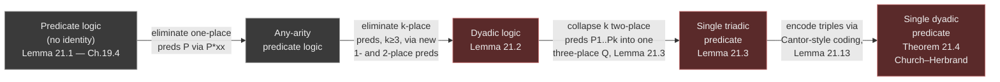
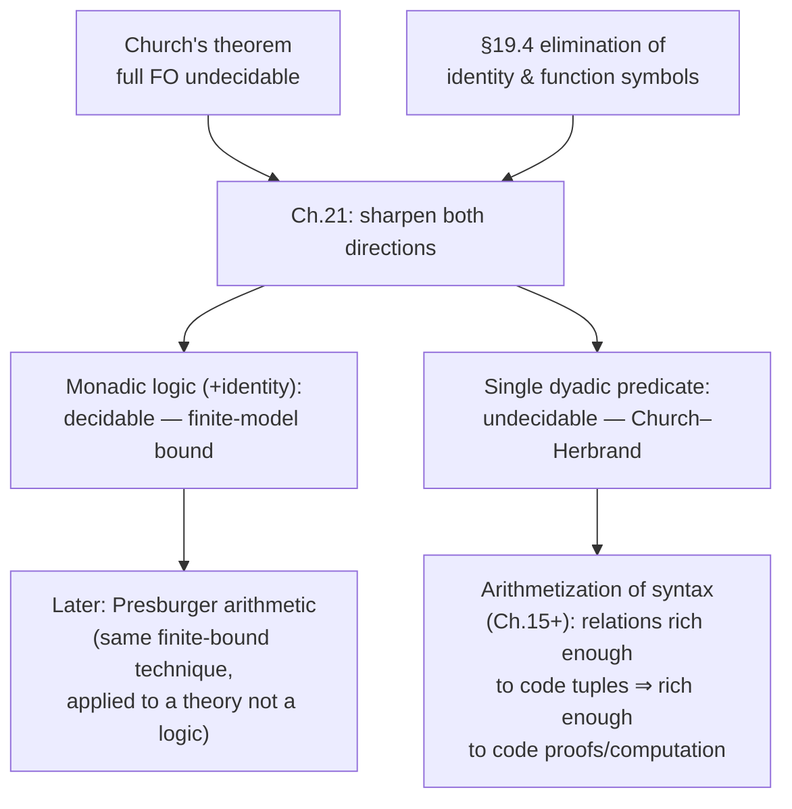

[[book-guidelines|↩ Back to guidelines]]

## Where exactly does undecidability start?

Church's theorem (covered in [[The-Undecidability-of-First-Order-Logic]]) tells you first-order validity, in general, has no decision procedure. That's a blunt instrument: it says "the whole hammer is broken," but it doesn't say *which part* of the hammer is broken. Is it quantifiers? Is it having more than one predicate? Is it multi-place predicates specifically? A working engineer's instinct at this point is the right one: find the smallest fragment where the problem reappears, and the largest fragment where it doesn't. That's exactly what Chapter 21 does, and the line it draws is startlingly sharp.

**One-place predicates (monadic logic) are decidable — even with identity thrown in.** **Two-place predicates (dyadic logic) are already undecidable — even with only a single predicate of that arity.** Nothing about three-place, four-place, or higher arities matters once you're past one: undecidability sets in at exactly the second argument place and never lets go. Aristotle's syllogistic logic (all monadic) was tractable; Frege's polyadic extension, needed to formalize real mathematics, bought expressive power at the price of an unsolvable decision problem. This chapter proves both halves of that trade rigorously.

What breaks without this chapter: without a precise boundary, "first-order logic is undecidable" reads as a vague warning rather than an engineering constraint. Once you know the boundary is monadic-vs-dyadic, you know exactly which restrictions to reach for when you need decidability (bounded relational schemas, taxonomies, type hierarchies without relations between elements) and exactly why adding one more argument place to a predicate — turning "is-a-Cat" into "is-a-Parent-of" — is enough to blow the whole thing open.

## 21.1 Two symmetric problems, and a strategy that avoids re-proving Church's theorem

The chapter's first move is bookkeeping, but bookkeeping that pays off later. The **decision problem** for a syntactic class $K$ of sentences asks for an effective procedure that, given $S \in K$, decides whether $S$ is *valid*. Since $S$ is valid iff $\sim S$ is unsatisfiable, and $K$ is always closed under negation in this chapter, the decision problem is equivalent to the **satisfiability problem** for $K$ — and the book works with satisfiability throughout, because it composes better with the reduction technique it's about to use.

That technique is worth naming explicitly, because it's the same move used twice, once in each direction:

> To show a *narrower* class $K$ is still undecidable, don't touch the proof of Church's theorem. Instead, exhibit an effective, satisfiability-preserving translation from arbitrary sentences into $K$. If $K$'s satisfiability problem were solvable, so would full first-order satisfiability be — contradicting Church's theorem.
>
> To show a class is decidable, exhibit an effective bound $n$ such that: if a sentence in the class has a model at all, it has one of size $\le n$. Then satisfiability reduces to a *finite* search.

Both directions are reductions to results you already have (Church's theorem, and finite-model checking) rather than fresh independent proofs — a good instinct whenever you're trying to sharpen a known limitative result.

**The undecidable side, set up first.** [[Normal-Forms-and-Elimination-Techniques|§19.4's elimination of function symbols and identity]] already proved a sharpening of Church's theorem:

> **Lemma 21.1.** The satisfiability problem for *predicate logic without identity* is unsolvable.

Section 21.3 sharpens this three more times, chasing the arity down:

- **Lemma 21.2** — dyadic logic (only two-place predicates, no identity) is unsolvable.
- **Lemma 21.3** — the logic of a single triadic (three-place) predicate is unsolvable.
- **Theorem 21.4 (Church–Herbrand theorem)** — the logic of a single *dyadic* predicate is unsolvable.

**The decidable side, set up first.** Call a sentence **$n$-satisfiable** if it has a model of size $\le n$. Three easy observations combine into a genuine decision procedure for a bounded search:

1. By the canonical-domains theorem (§12.2), if a sentence is true in *some* model of size $m$, it's true in a model whose domain is literally $\{1, \ldots, m\}$.
2. For a fixed finite language, there are only finitely many interpretations with domain $\{1, \ldots, m\}$.
3. Truth of a given sentence in a given finite interpretation is effectively checkable (quantifiers over a finite domain unfold into finite conjunctions/disjunctions via added constants $\underline{1}, \ldots, \underline{m}$).

> **Lemma 21.5.** For each $n$, the $n$-satisfiability problem for first-order logic is solvable.

This is the hinge the whole positive half of the chapter turns on: *to decide a class $K$, it suffices to compute, effectively, from any $S \in K$, a bound $n$ such that $S$'s satisfiability is equivalent to its $n$-satisfiability.* Then the decision problem for $K$ reduces to Lemma 21.5's brute-force finite search. Monadic logic gets exactly such a bound (Lemmas 21.8–21.9, proved in §21.2), giving:

> **Theorem 21.6.** The decision problem for monadic logic is solvable.
> **Theorem 21.7.** The decision problem for monadic logic *with identity* is solvable.

## 21.2 Monadic logic: turning a bound into an actual algorithm

This is the part worth implementing, not just reading, because "decidable" here isn't an existence claim — the book hands you an *explicit, computable bound* on model size, and that bound plus Lemma 21.5's finite search *is* a decision procedure you could ship.

### Signatures: what a domain element "looks like" to the sentence

Let $S$ be a sentence of monadic logic with identity, using $k$ one-place predicates $P_1, \ldots, P_k$ and $r$ variables $v_1, \ldots, v_r$, and suppose $M \models S$. For a domain element $d \in |M|$, its **signature** $\sigma(d)$ is the bit-vector $(j_1, \ldots, j_k)$ where $j_i = 1$ iff $P_i^M$ holds of $d$. There are at most $2^k$ possible signatures — that's the entire vocabulary $S$ has for describing an element, since there are no relations *between* elements to distinguish otherwise-identical-looking ones. Two elements with the same signature are **similar**; similarity is an equivalence relation with at most $2^k$ classes.

This is the crux of *why* monadic logic is decidable and dyadic logic isn't: with only one-place predicates, an element's entire "type" as far as the language is concerned is a $k$-bit tag. The moment you add a two-place predicate, an element also carries information about its *relations to every other specific element*, and that information doesn't collapse into a bounded tag — the domain's internal structure becomes part of what the language can see, and that's precisely the room in which encodings of arithmetic (and hence undecidability) live.

### The finite-model bound (Lemma 21.9)

Build a sub-model $N \subseteq M$ by keeping, from each similarity class: every element if the class has $\le r$ elements, otherwise exactly $r$ elements. Then $|N| \le 2^k \cdot r$. The book proves $N \models S$ by an induction on subformula complexity using a notion of **matching sequences** ($a_1,\ldots,a_s$ in $M$ matches $b_1,\ldots,b_s$ in $N$ when corresponding elements are similar and have the same identity pattern) — the key step being existential: for any witness $a_{s+1}$ chosen in $M$, because each similarity class was truncated to size $r$ but never to fewer elements than any bounded quantifier prefix could need, a matching witness $b_{s+1}$ can always be found already inside $N$. The full inductive argument is the "least model" instance of a **finite-model-bound decidability argument** — the exact pattern of proof this book uses repeatedly (compare Presburger arithmetic's decidability in a later chapter): shrink infinite or unboundedly-large models down to a size computable from the syntax alone, then brute-force check the shrunk model.

Two corollaries fall out as special cases ($k=0$ and $r=1$ respectively): pure identity theory has models bounded by variable count alone, and monadic logic *without* identity, restricted to one variable, is bounded by $2^k$. That second corollary combines with a normal-form result — **Lemma 21.12**: every identity-free monadic sentence is logically equivalent to a *clear* one (no quantifier's bound variable name reused meaningfully inside another quantifier's scope) using only a single variable, by pushing quantifiers in via disjunctive normal form — to give Theorem 21.6 directly. Identity blocks this variable-collapsing trick outright: there is no clear, single-variable equivalent of $\forall x \exists y\, x = y$, since that sentence's whole content is a relation *between* two occurrences of a bound variable.

### Implementing the decision procedure

The bound $2^k \cdot r$ is small enough to be a real search space for realistic $k, r$, and the model-checking step (item 3 above) is exactly the kind of finite, total, structurally-recursive function that's pleasant to write in Rust. Here's the shape of a real decision procedure for monadic logic with identity — not a toy, an implementation of Theorem 21.7 as stated:

```rust
use std::collections::HashSet;

/// A monadic formula over predicates P0..P(k-1) and variables represented
/// de Bruijn-style as small integers (bound by quantifier depth).
#[derive(Clone)]
enum Formula {
    Pred(usize, usize),        // Pi(v)  -- predicate index, variable index
    Eq(usize, usize),          // v1 = v2
    Not(Box<Formula>),
    And(Box<Formula>, Box<Formula>),
    Or(Box<Formula>, Box<Formula>),
    ForAll(Box<Formula>),      // binds a fresh variable, shifting indices
    Exists(Box<Formula>),
}

/// A finite interpretation: domain {0..size-1}, each predicate as a bitset.
struct Model {
    size: usize,
    preds: Vec<u64>, // preds[i] bit d set  <=>  P_i holds of element d
}

/// Evaluate a closed-under-`assignment` formula in `model`.
/// `assignment` maps de Bruijn variable index -> domain element.
fn satisfies(f: &Formula, model: &Model, assignment: &[usize]) -> bool {
    match f {
        Formula::Pred(p, v) => (model.preds[*p] >> assignment[*v]) & 1 == 1,
        Formula::Eq(v1, v2) => assignment[*v1] == assignment[*v2],
        Formula::Not(g) => !satisfies(g, model, assignment),
        Formula::And(a, b) => satisfies(a, model, assignment) && satisfies(b, model, assignment),
        Formula::Or(a, b) => satisfies(a, model, assignment) || satisfies(b, model, assignment),
        Formula::ForAll(g) => (0..model.size).all(|d| {
            let mut a2 = assignment.to_vec();
            a2.insert(0, d);
            satisfies(g, model, &a2)
        }),
        Formula::Exists(g) => (0..model.size).any(|d| {
            let mut a2 = assignment.to_vec();
            a2.insert(0, d);
            satisfies(g, model, &a2)
        }),
    }
}

/// Theorem 21.7's decision procedure: bounded model search.
/// `k` = number of monadic predicates, `r` = number of variables in `sentence`.
fn decide_monadic_satisfiable(sentence: &Formula, k: usize, r: usize) -> bool {
    let bound = (1usize << k) * r.max(1); // Lemma 21.9's bound: 2^k * r
    for size in 1..=bound {
        // Enumerate every k-tuple of subsets of a `size`-element domain.
        let per_pred_masks = 1u64 << size;
        let total_assignments = per_pred_masks.pow(k as u32);
        for combo in 0..total_assignments {
            let mut preds = Vec::with_capacity(k);
            let mut rem = combo;
            for _ in 0..k {
                preds.push(rem % per_pred_masks);
                rem /= per_pred_masks;
            }
            let model = Model { size, preds };
            if satisfies(sentence, &model, &[]) {
                return true; // found a model within the guaranteed bound
            }
        }
    }
    false // exhausted every model up to the bound with none satisfying
}
```

Two things are worth noticing about this code, because they're the parts that carry the theorem's content rather than just its slogan:

- **The loop terminates because the bound is *proved*, not guessed.** `bound` isn't a heuristic cutoff — it's $2^k \cdot r$ straight out of Lemma 21.9. If the sentence is satisfiable at all, the proof guarantees a witnessing model of size $\le$ `bound` exists, so exhausting sizes `1..=bound` without success is a *sound* refutation, not an approximation. That's what makes this a decision procedure and not a semi-decision procedure — contrast with general first-order satisfiability search (resolution, tableaux), which finds models when they exist but can run forever on unsatisfiable sentences because there's no such bound to fall back on.
- **This is literally a bounded model checker**, of the same shape used by SAT/SMT-based bounded verification: search all models up to size $N$, and if $N$ is provably an upper bound for any witness, "no model found by $N$" becomes a real UNSAT proof rather than an inconclusive timeout. If you're building a Rust verifier around logic-clause specifications, the honest lesson from this chapter is that this trick — an a priori, syntax-computed size bound turning brute-force search into completeness — is rare, and it dies exactly where relational structure (two-place predicates) enters. Anything your verifier needs to reason about beyond flat, relation-free tagging (types-as-predicates without cross-references) will not get this kind of finite-bound decidability for free; you'll need restricted fragments, quantifier instantiation heuristics, or the incompleteness your prover has to live with (see below).

## 21.3 Dyadic logic: chasing undecidability down to a single predicate

Where §21.2 built one clean argument, §21.3 is three successive *reductions*, each stripping predicates down to fewer symbols by encoding the eliminated structure into new, lower-arity predicates plus existentially-quantified auxiliary variables. The overall path:



Each arrow is a satisfiability-preserving translation, proved in both directions by the same recipe used for Lemma 21.1's identity/function-symbol elimination: "if $S$ is unsatisfiable then $\sim S$ is valid, and substitution preserves validity, so the translated $\sim S^*$ is valid too" handles the easy direction; the hard direction builds an explicit interpretation of the translated sentence out of a model of the original, invoking the **canonical domains theorem** (§12.2) to fix every domain to be $\mathbb{N}$ so the constructions can be given concretely rather than abstractly.

**Eliminating a $k$-place predicate ($k \ge 3$), Lemma 21.2.** Given $P$ of arity 3 (the pattern generalizes to any $k \ge 3$), introduce a fresh one-place predicate $P^*$ and three fresh two-place predicates $Q_1, Q_2, Q_3$. Replace each atomic $Px_1x_2x_3$ by
$$\exists w\,(Q_1wx_1 \mathbin{\&} Q_2wx_2 \mathbin{\&} Q_3wx_3 \mathbin{\&} P^*w).$$
Intuitively: $w$ is a fresh "witness object" standing in for the whole triple $(x_1,x_2,x_3)$; $P^*$ marks which witnesses correspond to triples actually in $P$; and $Q_1,Q_2,Q_3$ recover each component of the triple from its witness. Given a model of the original sentence over $\mathbb{N}$, fix any surjection $f: \mathbb{N} \twoheadrightarrow \mathbb{N}^3$ (exactly the kind of triple-coding function from [[Enumerability-and-the-Infinite|Chapter 1]]) and let $P^*$ hold of $b$ iff $f(b)$ is a $P$-triple; let $Q_i$ hold of $(b,a)$ iff $a$ is the $i$th component of $f(b)$. One-place predicates get folded in the same way trivially: replace $Px$ by $P^*xx$ using a fresh two-place $P^*$.

**Collapsing many two-place predicates into one three-place predicate, Lemma 21.3.** Given $P_1,\ldots,P_k$, introduce one fresh three-place $Q$ and fresh variables $v_1,\ldots,v_k$; replace each $P_ix_1x_2$ by $Qv_ix_1x_2$ and existentially quantify the $v_i$ at the front. The intuition: $Q$'s first argument is now a *tag* selecting which of the original $k$ predicates is meant, and the existential witnesses fix consistent tags for the whole sentence. Given a model of the original, interpret $Q(a, b_1, b_2)$ to hold when $1 \le a \le k$ and $P_a(b_1,b_2)$ held originally.

**Collapsing one triadic predicate into one dyadic predicate, Theorem 21.4 (Church–Herbrand).** This is the sharp, surprising step: three-place structure squeezed into two-place structure using nothing but existentially-quantified helper variables. Given $S$ with a three-place $P$, define $P^*(x_1,x_2,x_3)$ as
$$\exists u_1u_2u_3u_4\,\big(\sim Qu_1u_1 \mathbin{\&} Qu_1u_2 \mathbin{\&} Qu_2u_3 \mathbin{\&} Qu_3u_4 \mathbin{\&} Qu_4u_1$$
$$\mathbin{\&} Qu_1x_1 \mathbin{\&} Qu_2x_2 \mathbin{\&} Qu_3x_3 \mathbin{\&} \sim Qx_1u_2 \mathbin{\&} \sim Qx_2u_3 \mathbin{\&} \sim Qx_3u_4 \mathbin{\&} Qu_4x_1\big),$$
and replace each atomic $Px_1x_2x_3$ by $P^*(x_1,x_2,x_3)$. The $Q$-conjuncts describe a 4-cycle $u_1 \to u_2 \to u_3 \to u_4 \to u_1$ under $Q$, with $u_1$ marked as the *only* self-looped-free start; $x_1, x_2, x_3$ hang off $u_1, u_2, u_3$ respectively via $Q$, and the negative conjuncts pin their positions precisely (ruling out $x_i$ collapsing onto the wrong cycle node). **Lemma 21.13** does the real combinatorial work of proving this actually encodes an arbitrary three-place relation $R$ into a two-place $S$: enumerate all triples of naturals by an explicit dovetailing order (by sum, then first, then second, then third component — the same style of coding as Cantor's zig-zag from Chapter 1), and for the $n$th triple $(a,b,c)$, wire up $S$ on the four "gadget" points $4n{+}1,\ldots,4n{+}4$ so that the cycle-plus-hooks pattern above holds *exactly when* $R(a,b,c)$ did.

**Why this matters for the incompleteness story, not just the syllable count.** Once undecidability survives collapsing all the way down to one two-place predicate, it's clear the culprit was never "how many predicates" or "how many arguments" in some naive counting sense — it's that a single relation on an infinite domain is already rich enough to *simulate arbitrary combinatorial structure* (triples, tuples, whatever you like) via existentially-quantified coding gadgets, exactly the way Gödel numbering later simulates syntax inside arithmetic. The Church–Herbrand theorem is the model-theoretic cousin of the arithmetization argument that drives Gödel's incompleteness theorems: both show that "just enough relational structure" (one binary relation here; $+$ and $\times$ there) is already sufficient to encode unboundedly rich combinatorics, and once you can encode that much, no algorithm and no complete proof procedure can keep up. If you ever wondered why a general-purpose automated theorem prover *has* to live with incompleteness or undecidability rather than being "just an engineering problem" — this chapter is the precise point where that necessity becomes a theorem instead of a slogan: it happens the instant your logic's relations are rich enough to code up pairing/tripling, which is a strictly lower bar than encoding all of arithmetic.

## Where this leads



This chapter is the book's clearest demonstration that "undecidable" is not a monolith — it has a precise boundary, provable in both directions with tools already on hand (Church's theorem plus §19.4's elimination results) rather than fresh machinery. For the standing project: the monadic decision procedure above is a genuine, implementable algorithm — a finite-model bound turning brute-force search into a *complete* decision procedure — worth keeping as a mental template for any fragment of your Rust verifier's specification language that turns out to be relation-free (pure tagging/classification constraints). The dyadic-undecidability half is the reason that template can't be stretched to cover general relational specifications: the moment your Hoare-triple or dependent-subtyping constraints can talk about a relation between two program values (aliasing, ordering, points-to), you've crossed into Church–Herbrand territory, and your prover's completeness has to be given up somewhere — bounded search, restricted fragments, or accepting incompleteness the way a full-strength verifier eventually must.
