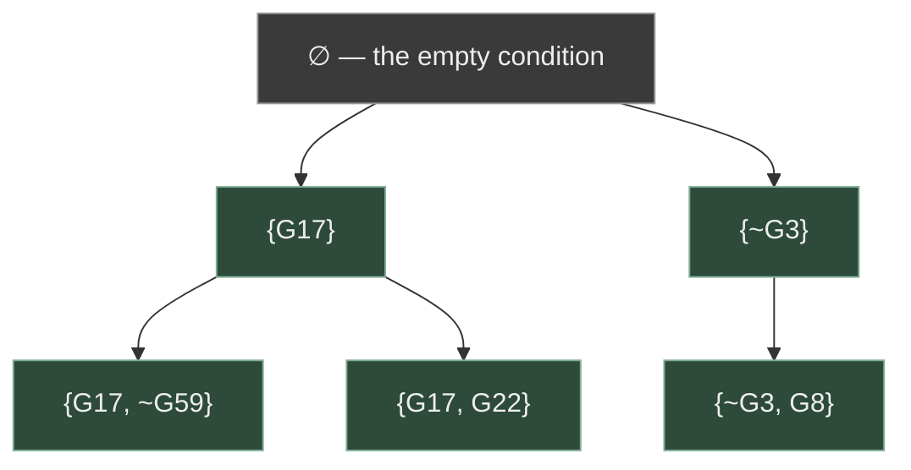
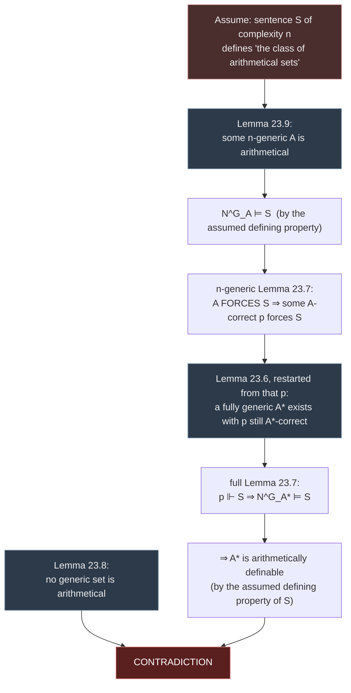

# Definability in Arithmetic and Forcing

[[book-guidelines|↩ Back to guidelines]]

## Why this chapter exists: Tarski's theorem isn't the end of the story

The [[The-Diagonal-Lemma-and-the-Limitative-Theorems|companion article on the diagonal lemma]] ended on a hard negative: **Tarski's theorem** says the set $V$ of (Gödel numbers of) sentences of the language of arithmetic $L$ that are true in the standard interpretation $N$ is not itself arithmetically definable — there is no formula $\mathrm{True}(x)$ of $L$ such that $\mathrm{True}(\overline n)$ holds exactly when $n$ codes a true sentence. That result can read as a dead end: "truth escapes arithmetic, full stop." This chapter's whole point is that it isn't a dead end — it's a *boundary*, and boundaries have a shape worth mapping.

Two questions immediately suggest themselves once you've absorbed Tarski's theorem:

1. If the *whole* truth set $V$ isn't definable, what about *pieces* of it — the true sentences of bounded syntactic complexity? Maybe the trouble only arises in the limit.
2. Even though no *formula* defines $V$, could there be some formula that at least picks $V$ out uniquely as *the* set with certain properties — i.e., is $V$ definable one level up, as a single member of the space of sets?

The book answers both questions **yes** — §23.1 shows each bounded-complexity fragment $V_n$ is definable, and separately that the singleton class $\{V\}$ is definable as a class. Then it asks a natural third question: is the whole *collection* of arithmetically definable sets itself an arithmetically definable object? Here the answer flips back to **no** — this is **Addison's theorem** (§23.2), and its proof imports a tool from set theory that will feel completely foreign coming from a computability textbook: **forcing**, the method Cohen invented to prove the independence of the continuum hypothesis. Boolos, Burgess & Jeffrey give a scaled-down, purely arithmetic version of it. That's the header material: Tarski's theorem is real but narrow, and mapping exactly how narrow requires both a positive definability result (the $V_n$'s) and a second negative result one level up (Addison's theorem), the latter needing genuinely new machinery to prove.

**What breaks without this chapter:** without it, "truth is undefinable in arithmetic" looks like an isolated, almost accidental fact about one particular set $V$. This chapter reveals it as an instance of a *pattern* — every level of a definability hierarchy has things exactly at its own level that escape it, and one level down or sideways things become definable again. That pattern (which resurfaces constantly in descriptive set theory, complexity theory, and type theory alike, wherever you stratify objects by "how much quantification" they cost to build) is the real payoff.

This article presupposes the arithmetization-of-syntax and representability machinery from Chapters 15–16 (see [[Arithmetization-of-Syntax-and-Representability]]) and Tarski's undefinability theorem from Chapter 17 (see [[The-Diagonal-Lemma-and-the-Limitative-Theorems]]) as background, rather than re-deriving them.

## Setting up the vocabulary: what "arithmetically definable" means, precisely

Before anything else, the chapter nails down what "definable" is going to mean at two different levels — for *sets* of numbers and for *classes* of sets of numbers. This distinction matters enormously for everything that follows, so it's worth being pedantic about it upfront, the way the book is.

- We write $L$ for the language of arithmetic and $N$ for its standard interpretation.
- $L_c$ is $L$ expanded with a new constant symbol $c$; $N^c_a$ is $N$ expanded to interpret $c$ as the number $a$.
- A **set of numbers** $S$ is **arithmetically definable** if there's a sentence $F(c)$ of $L_c$ such that $S$ is exactly the set of $a$ for which $F(c)$ is true in $N^c_a$. (This is ordinary first-order definability with a parameter — nothing new yet.)
- $L_G$ is $L$ expanded with a new one-place *predicate* $G$; $N^G_A$ is $N$ expanded to interpret $G$ as the set $A$.
- A **class** $\mathcal{C}$ **of sets of numbers** is **arithmetically definable** if there's a sentence $F(G)$ of $L_G$ such that $\mathcal{C}$ is exactly the set of $A$ for which $F(G)$ is true in $N^G_A$.

If you think in types: a set of numbers has type $\mathbb{N} \to \mathrm{Bool}$ (or `Set<u64>`); a class of sets of numbers has type $(\mathbb{N} \to \mathrm{Bool}) \to \mathrm{Bool}$ (or `Set<Set<u64>>`, equivalently a predicate on sets). The book is deliberately keeping straight which universe you're quantifying into — "numbers, sets, classes" is its own three-level type discipline, flagged explicitly: *"To keep the levels straight, we generally use numbers for the natural numbers, sets for the sets of natural numbers, and classes for the sets of sets of natural numbers."* This is exactly the kind of universe-stratification a dependently typed system enforces syntactically (Lean's `Type 0`, `Type 1`, …) — here it's enforced only by discipline of prose, but the content is the same: you cannot legally ask "is the set of all sets a set" without picking a level, and the whole chapter's interesting content lives in *comparing definability across* these levels.

**What breaks without this distinction:** conflating "a formula defining a set of numbers" with "a formula defining a class of sets" is exactly the trap that would make Tarski's theorem and Theorem 23.2 look contradictory. They're not in tension — one is a claim about level-1 definability (of $V$ as a *set*), the other about level-2 definability (of $\{V\}$ as a *class*, i.e. definability of $V$ considered as a single "point" one level up). Keeping the levels straight is what makes the chapter's positive and negative results compatible instead of paradoxical.

## §23.1, first result: the bounded-complexity fragments $V_n$ are all definable

### The idea before the induction

Tarski's proof (via the diagonal lemma) shows you can't define $V$ *all at once*. But truth of a sentence is built up compositionally — a sentence's truth value is computed from its immediate subformulas' truth values by a handful of fixed rules (negate, disjoin, existentially generalize). If each rule only ever needs to look at strictly *simpler* sentences to determine a sentence's truth, then defining "true sentences of complexity $\le n$" for a fixed $n$ should be tractable by ordinary induction — the quantifier nesting needed to unwind the recursion is finite and fixed in advance, once $n$ is fixed. It's exactly the reason a recursive-descent evaluator that only recurses to bounded depth is easy to implement (and easy to prove correct), while unbounded recursion (or a genuinely circular definition, which is what $V$ as a whole would need) is where things get hard.

To make this rigorous, the book restricts official logical vocabulary to $\sim$ (negation), $\vee$ (disjunction), and $\exists$ (existential quantification) — treating $\&$ and $\forall$ as unofficial abbreviations, so that every sentence's shape falls into exactly one of three cases. **Complexity** of a sentence is defined as the number of occurrences of $\sim, \vee, \exists$ in it, and $V_n$ is the set of code numbers of sentences of complexity $\le n$ true in $N$.

### The arithmetization toolkit this reuses

The proof leans entirely on facts already established in Chapter 15 (arithmetization of syntax) — this section adds no new representability technology, it just *applies* it:

- $S$, the set of code numbers of sentences of $L$, is recursive; so is $S_n$ (sentences with $\le n$ logical-operator occurrences).
- Recursive functions $\nu$ (code of $\sim B$ from code of $B$), $\delta$ (code of $B\vee C$ from codes of $B,C$), $\eta$ (code of $\exists v\,F(v)$ from codes of $v$ and $F(v)$), and $\sigma$ (code of the instance $F(m)$ from the codes of $F(v)$, $v$, and $m$) — these are exactly the "AST constructor/destructor" functions for the three connectives, made computable via Gödel numbering.
- $V_0$, the set of true *atomic* sentences, is recursive (proved via a clean trick: $V_0$ is the intersection of the recursive set $S_0$ with the theorems of $Q$, and $Q$ decides every atomic sentence correctly, so $V_0$ is both semirecursive and co-semirecursive, hence recursive by Kleene's complementation principle).

Since all of these are recursive, they're representable by formulas $S(x)$, $S_n(x)$, $\mathrm{Nu}(x,y)$, $\mathrm{Delta}(x,y,z)$, $\mathrm{Eta}(x,y,z)$, $\mathrm{Sigma}(x,y,z,w)$, $V_0(x)$ in $Q$ — this is the representability machinery from Ch. 16 doing exactly the job it was built for.

### The inductive step: Theorem 23.1

> **23.1 Theorem.** For each $n$, $V_n$ is arithmetically definable.

**Proof idea.** A sentence $A$ of complexity $n+1$ is (exactly) one of: $\sim B$ for $B$ of complexity $n$; $B \vee C$ for $B, C$ each of complexity $\le n$; or $\exists v\, F(v)$ for $F(v)$ of complexity $n$ (so every instance $F(m)$ also has complexity $n$). And truth propagates by the obvious clauses: $\sim B$ is true iff $B$ isn't; $B\vee C$ is true iff $B$ or $C$ is; $\exists v\,F(v)$ is true iff $F(m)$ is true for some $m$. So if $V_n(x)$ already defines $V_n$, the formula

$$
S_{n+1}(x) \;\&\; \Big\{V_n(x) \;\vee\; \exists y\big[\mathrm{Nu}(y,x)\;\&\;\sim V_n(y)\big] \;\vee\; \exists y\,\exists z\big[\mathrm{Delta}(y,z,x)\;\&\;(V_n(y)\vee V_n(z))\big] \;\vee\; \exists y\,\exists z\big[\mathrm{Eta}(y,z,x)\;\&\;\exists u\,\exists w\big(\mathrm{Sigma}(y,z,u,w)\;\&\;V_n(w)\big)\big]\Big\}
$$

defines $V_{n+1}$. Since $V_0$ is definable (base case), induction on $n$ finishes the proof — every $V_n$ is arithmetically definable.

Notice what makes this legal where defining all of $V$ at once wasn't: $V_{n+1}(x)$'s definition is allowed to *mention* $V_n(x)$ as a syntactic ingredient because $n$ is fixed in advance. There is no single formula in this family that refers to itself — each $V_n(x)$ is a genuinely new, longer formula, built from the previous one. What Tarski's theorem rules out is a *single* formula $V(x)$, quantifier-count fixed once and for all, that would have to encode this entire unbounded recursion internally. That's the crux of the "coexistence" the guidelines flag: $V_n$ definable-for-every-$n$ is not the same claim as "$V(x) := \bigvee_n V_n(x)$ is a formula" — that disjunction is infinite, and infinite disjunctions aren't formulas of first-order logic. You cannot stitch the $V_n$'s together into one $V$ because stitching would require quantifying over $n$ itself *inside* the object language in a way that reproduces exactly the diagonal-lemma fixed point Tarski's theorem forbids.

**Rust/Python grounding.** This is structurally an interpreter written by structural recursion on an AST, where the interpreter for depth-$(n{+}1)$ terms is defined in terms of the depth-$n$ interpreter:

```rust
// Sketch: each V_n is a *new*, syntactically bigger predicate — this is NOT
// a single recursive function; unrolling it n times is exactly what makes
// each V_n legally definable while no fixed-size V works for all n at once.
enum Formula {
    Atomic(u64),                 // code number of an atomic sentence
    Not(Box<Formula>),
    Or(Box<Formula>, Box<Formula>),
    Exists(VarId, Box<Formula>), // F(v)
}

// v_n_is_true(f, n) corresponds to "does V_n(code_of(f)) hold" —
// but note: for it to be a genuine *arithmetic formula* V_n(x) rather than
// a Rust function, n has to be baked in as a fixed unrolled depth, not a
// runtime parameter reused by self-reference.
fn v_n_is_true(f: &Formula, n: usize) -> bool {
    match f {
        Formula::Atomic(code) => is_true_atomic(*code),      // V_0, decidable
        Formula::Not(b) if n >= 1 => !v_n_is_true(b, n - 1),
        Formula::Or(b, c) if n >= 1 =>
            v_n_is_true(b, n - 1) || v_n_is_true(c, n - 1),
        Formula::Exists(_, body) if n >= 1 =>
            (0..).any(|m| v_n_is_true(&instantiate(body, m), n - 1)),
        _ => panic!("complexity budget exceeded"),
    }
}
```

The `(0..).any(...)` line is exactly why this is only a *sketch*, not a real decision procedure — in the actual formula $V_n(x)$, that unbounded search over $m$ is legal because it's existential *quantification inside a formula* (which representability turns into a legitimate arithmetic statement, true or false, not something you have to run), whereas as literal Rust code it would only terminate on true instances. The formula $V_n(x)$ doesn't "compute" truth by search; it *states* a fact that provably coincides with truth, via the representing formulas $\mathrm{Nu}, \mathrm{Delta}, \mathrm{Eta}, \mathrm{Sigma}$ standing in for the AST constructors. This is the recurring gap between "recursive" (there's an algorithm) and "arithmetically definable" (there's a formula whose extension matches) that the whole book trades on — they coincide for *decidable* facts (Ch. 16), but a definable $V_n(x)$ needn't itself be decidable as a search procedure the way this Rust sketch implies; it only needs its *truth value* to match.

**What breaks without Theorem 23.1:** if not even bounded fragments of $V$ were definable, Tarski's theorem would look less like "truth resists a single formula" and more like "truth resists formulas entirely" — a much stronger and, as it happens, false claim. Theorem 23.1 is what proves the trouble really is about unbounded self-reference specifically, not about defining truth-facts in general.

## §23.1, second result: the class $\{V\}$ is definable — pinning $V$ down as a fixed point

Theorem 23.1 defined *pieces* of $V$. Theorem 23.2 takes a different tack: instead of leveling up complexity, level up the *kind of object* being defined. We can't write a formula $F(c)$ that picks out $V$ as a set. But we *can* write a formula $F(G)$ — quantifying over the predicate $G$ itself — such that the only set $A$ making $F(G)$ true (under $N^G_A$) is $A = V$. That's what "$\{V\}$ is an arithmetically definable class" means: the singleton containing $V$ is picked out at the class level, even though $V$ itself isn't picked out at the set level.

### The characterization: truth as the unique fixed point

The proof observes that "the set of sentences true in $N$" can be characterized *uniquely*, without circularity, as: the unique set $\mathcal{W}$ such that

- $\mathcal{W}$ contains only sentences of $L$;
- for atomic $A$: $A \in \mathcal{W}$ iff $A$ is a true atomic sentence;
- for any $B$: $\sim B \in \mathcal{W}$ iff $B \notin \mathcal{W}$;
- for any $B, C$: $(B \vee C) \in \mathcal{W}$ iff $B \in \mathcal{W}$ or $C \in \mathcal{W}$;
- for any $v, F(v)$: $\exists v\,F(v) \in \mathcal{W}$ iff $F(m) \in \mathcal{W}$ for some $m$.

This is Tarski's recursive definition of truth, restated as a *fixed-point equation*: $V$ is the unique set satisfying these closure conditions simultaneously. Translating "contains only sentences of $L$," "code $a$ in $S_0$," etc. into the arithmetized versions with $S$, $S_0$, $\nu$, $\delta$, $\eta$, $\sigma$, $V_0$ representing formulas, the whole characterization becomes a single sentence $F(G)$ (a conjunction of the biconditionals above, each properly relativized by the syntactic-membership guards $S(x)$, $S_0(x)$, etc.). The claim is: **the only way to expand $N$ to a model of $F(G)$ is to interpret $G$ as $V$.**

If you've worked with denotational semantics or abstract interpretation, this is precisely the shape of a **Knaster–Tarski fixed point**: a monotone truth-recursion operator on sets of sentences, and $V$ is its unique fixed point (in fact its least and greatest fixed point coincide here, since the recursion is well-founded by syntactic complexity — there's no genuine circularity, just a *description* of $V$ that mentions $V$ on both sides of an equation the way `fn eval(&self) -> bool { match self { ... self.sub.eval() ... } }` mentions `eval` recursively). Uniqueness is what makes this legitimate as a *definition* rather than a mere self-referential-sounding assertion: $F(G)$ doesn't compute $V$ by unrolling (that's what §23.1's first result did, one $n$ at a time) — it *characterizes* $V$ implicitly, the way "the unique $x$ such that $x^2 = 2, x > 0$" characterizes $\sqrt 2$ without giving a decimal expansion.

**What breaks without this:** without Theorem 23.2, you might conclude Tarski's theorem means $V$ is invisible to arithmetic at *every* level of description, not just as a first-order-definable *set*. Theorem 23.2 shows that's too strong — $V$ is perfectly describable, just not by a formula with a free first-order variable ranging over numbers; it needs a formula with a free *second-order* variable ranging over sets. This is the same move as saying "there's no elementary closed-form for this recursive function, but there is a well-posed least-fixed-point characterization of it" — familiar from denotational semantics of recursive programs.

## §23.2: is the class of *all* arithmetically definable sets itself definable? Addison's theorem

This is where the chapter turns a corner. Having shown two positive results nearby Tarski's negative one, it now asks the natural next question: forget any *one* particular set like $V$ — consider the whole **class of arithmetically definable sets of numbers**. Is *that* class arithmetically definable (as a class, in the §23.1 sense)?

> **23.3 Theorem (Addison's theorem).** The class of arithmetically definable sets of numbers is not an arithmetically definable class of sets.

This has the same shape as Tarski's theorem but one level up the type hierarchy: Tarski says the *set* $V$ (a set of numbers) isn't definable as a set; Addison says the *class* of definable sets (a class of sets of numbers) isn't definable as a class. It's a diagonal-flavored result at the next universe up — and true to form, the proof again needs a genuinely self-referential construction. But this time the book reaches for a different tool than the diagonal lemma: **forcing**.

### Why forcing, and what problem it's solving

The obstacle Addison's theorem proof runs into is this: to derive a contradiction from "suppose formula $S$ defines the class of arithmetically definable sets," you need to exhibit *some* set $A$ where you can independently pin down both (a) whether $A$ is arithmetically definable, and (b) whether $N^G_A \models S$ — and get those two answers to disagree. The set $A$ you need for this doesn't already exist among the "easy" arithmetically definable sets — those are exactly the sets you're trying to reason *about*, not construct with. What you need is a way to *build a set from scratch*, one fact at a time, controlling exactly what ends up true of it, while proving in advance strong general facts about *any* set built this way (regardless of the specific choices made along the way).

That's precisely what forcing was invented for in set theory: Cohen needed to build models of ZFC where the continuum hypothesis fails, without knowing in advance exactly what the resulting model looks like — he built it incrementally via **conditions** (finite pieces of information) and proved general theorems about what any sufficiently "generic" (unbiased, information-complete) object built this way must satisfy. Boolos, Burgess & Jeffrey borrow exactly this pattern, scaled down to arithmetic — no large cardinals, no complicated posets, just finite sets of sentences about a single new predicate $G$.

### Conditions: finite, provisional descriptions of a set

A **condition** is a finite, consistent set of sentences of $L_G$, each of the form $Gm$ or $\sim Gm$ — i.e. a finite list of "commitments" about which numbers are, or aren't, in the set $G$ will eventually denote. $\emptyset$ is a condition (no commitments yet); $\{G17\}$ says "17 is in"; $\{G17, \sim G59\}$ says "17 is in, 59 is out." A condition $q$ **extends** $p$ if $p \subseteq q$ — $q$ makes every commitment $p$ makes, plus possibly more.

Think of a condition as a **partial specification of a `Set<u64>`** — like a `HashMap<u64, bool>` that's only been populated at finitely many keys so far, with the promise that it will never be contradicted by later entries. Building a set via an increasing chain of conditions is exactly the pattern of incrementally refining a partial function into a total one while never overwriting an earlier commitment — a build-up discipline familiar from constraint propagation or incremental unification (assign a metavariable's value once, then only ever extend, never retract, the substitution).

### Forcing: what a finite condition can pin down about arbitrarily complex sentences

The genuinely new machinery is the **forcing relation** $p \Vdash S$ — read "$p$ forces $S$" — a relation between conditions and sentences of $L_G$, inductively defined by five clauses:

1. **Atomic sentence of $L$** (no $G$): $p \Vdash S$ iff $N \models S$ — plain truth, since $p$ has nothing to say about ordinary arithmetic facts.
2. **Atomic $Gt$**: with $m$ the denotation of term $t$, $p \Vdash Gt$ iff $Gm \in p$ — $p$ forces membership only if it *literally says so*.
3. **Disjunction** $B \vee C$: $p \Vdash S$ iff $p \Vdash B$ or $p \Vdash C$.
4. **Existential** $\exists x\,B(x)$: $p \Vdash S$ iff $p \Vdash B(n)$ for some $n$.
5. **Negation** $\sim B$: $p \Vdash S$ iff **no extension of $p$** forces $B$.

Clause (5) is the one clause that isn't a direct structural mirror of truth, and it's the whole engine of the construction: forcing a negation isn't "the atomic base case fails now" — it's "nothing you could ever add later will make $B$ true." This is a strong, *stable* commitment, deliberately more cautious than ordinary truth. It immediately gives you: no condition forces both $S$ and $\sim S$, and either $p$ forces $\sim S$ or *some extension* of $p$ forces $S$ — nothing is left permanently undetermined once you're willing to extend.

This clause-5 asymmetry is exactly what makes forcing behave like a *conservative, monotone approximation* to truth rather than truth itself computed early. It's the same discipline as a type checker that reports "definitely rejects" only when it can show *no* future extension of the context could possibly typecheck the term — as opposed to merely "doesn't currently have enough information." A condition may *imply* a sentence classically without *forcing* it: $\{G3\}$ implies nothing about $G11$, so it forces neither $G11$ nor $\sim G11$, and hence doesn't force $(G11 \vee \sim G11)$ either — even though $(G11 \vee \sim G11)$ is a tautology! Forcing is deliberately not closed under classical validity; it only certifies what's *already locked in* by explicit commitments (plus finitary consequences of clause 5). Conversely, some sentences get forced by conditions that don't classically imply them: $\emptyset \Vdash \sim\sim\exists x\,Gx$ (worked below), even though $\emptyset$ implies nothing about $G$ at all.

**Worked example: $\emptyset \Vdash \sim\sim\exists x\,Gx$.** Suppose some $p$ forced $\sim\exists x\,Gx$. Let $n$ be least such that $\sim Gn \notin p$ (such $n$ exists since $p$ is finite). Let $q = p \cup \{Gn\}$ — a condition, extending $p$, and $q \Vdash Gn$, hence $q \Vdash \exists x\,Gx$. But $p \Vdash \sim\exists x\,Gx$ requires *no* extension of $p$ to force $\exists x\,Gx$ — contradiction. So no $p$ forces $\sim\exists x\,Gx$, meaning no extension of $\emptyset$ forces it, meaning (by clause 5, applied to $\sim\exists x\,Gx$ as the "$B$") $\emptyset \Vdash \sim\sim\exists x\,Gx$. Notice the double-negation didn't collapse: $\emptyset$ still doesn't force $\exists x\,Gx$ outright (no specific witness is committed to), only its double negation — a genuinely intuitionistic-flavored gap opened up by clause 5's "no extension ever" reading of negation. **This is worth pausing on if you have any Lean/constructive-logic background**: forcing's negation clause behaves exactly like intuitionistic negation in a Kripke model (a condition is a Kripke world; extension is the accessibility/refinement order; $\Vdash$ is Kripke forcing) — $\sim\sim\varphi$ not implying $\varphi$ is *the* signature phenomenon of non-classical forcing semantics, even though the sentences being forced here are ordinary classical arithmetic sentences. The book is quietly running a Kripke-semantics-style construction underneath classical logic to build a genuinely new mathematical object.

**Lemma 23.4 (persistence): if $p \Vdash S$ and $q$ extends $p$, then $q \Vdash S$.** Straightforward induction on the complexity of $S$ — every clause of the forcing definition is monotone in the condition. This is the property that makes "force" behave like accumulating, never-retracted evidence — once locked in, always locked in, exactly the persistence property you want from a Kripke forcing relation or from a substitution that only ever gets extended, never revised.

**Lemma 23.5: for $L$-sentences (no $G$), every condition forces exactly the arithmetic truths — $p \Vdash S$ iff $N \models S$, for *every* $p$.** This says the whole apparatus is conservative over plain arithmetic: forcing only adds new content about the *new* predicate $G$; it changes nothing about ordinary truth. Reassuring, and needed later.


*The extension order on conditions: a tree of finite, ever-more-specific partial descriptions of a set. A generic set is (roughly) an "infinitely deep, maximally decisive" branch through this tree.*

### $A$-correctness, FORCING, and genericity

Two more layers of vocabulary connect conditions back to actual sets $A$ of numbers:

- A condition $p$ is **$A$-correct** if every commitment $p$ makes agrees with $A$: $Gm \in p \Rightarrow m \in A$, and $\sim Gm \in p \Rightarrow m \notin A$. Equivalently, $N^G_A$ (the standard model with $G$ interpreted as $A$) is a model of $p$.
- $A$ **FORCES** $S$ (capitalized, distinguishing it from a single condition's lowercase $\Vdash$) if *some* $A$-correct condition forces $S$. Since the union of two $A$-correct conditions is still $A$-correct, and no condition forces both $S$ and $\sim S$, no set $A$ can FORCE both $S$ and $\sim S$ either.
- $A$ is **generic** if for *every* sentence $S$ of $L_G$, $A$ FORCES $S$ or $A$ FORCES $\sim S$ — genericity is *totality* of decision, forced (not merely true) one way or the other, for literally every sentence about $G$. $A$ is **$n$-generic** if this holds only for sentences of complexity $\le n$; generic is exactly "$n$-generic for every $n$."

This is the crux definition of the whole method: genericity says $A$ carries *no accidental, undecided facts* relative to the forcing relation — everything about $A$ that can in principle be pinned down by finite information *is* pinned down, with a finite witness. It's the arithmetic analogue of a "sufficiently random" or "sufficiently generic" object in the set-theoretic original — not random in a probabilistic sense, but generic in the sense of avoiding every avoidable coincidence a finite condition could rule out.

### Lemma 23.6: generic sets exist

The construction is a priority-style diagonalization over an enumeration $S_0, S_1, S_2, \ldots$ of all sentences of $L_G$ and an enumeration $p_0, p_1, p_2, \ldots$ of all conditions. Starting from any $p$ (as $q_0$), at stage $i$: if $q_i$ already forces $\sim S_i$, do nothing ($q_{i+1} := q_i$); otherwise, some extension of $q_i$ forces $S_i$ (this is exactly the "either forces the negation or some extension forces it" fact noted after clause 5), and $q_{i+1}$ is taken to be the *first* such extension in the fixed enumeration of conditions. Let $A = \{m : Gm \in q_i \text{ for some } i\}$.

This is a textbook **fairness/priority construction** — the kind of thing that shows up in operating-systems scheduling proofs or in building a maximal consistent set in a Henkin-style completeness proof (the very construction from Chapter 13's model-existence lemma, which this chapter's proof structure closely echoes): march through every requirement in turn, and *satisfy each one, permanently, the first time you get to it*, using an explicit fixed enumeration to make "the first such extension" well-defined rather than an unbounded search. The proof that $p$ remains $A$-correct is a one-line contradiction: if $\sim Gm \in q_i$ but $m \in A$ (so $Gm \in q_j$ for some $j$), then at stage $k = \max(i,j)$ both $Gm$ and $\sim Gm$ would sit in $q_k$, violating consistency.

**What breaks without this lemma:** genericity would be a vacuous definition — a property that no set actually has. The whole strategy of "derive a contradiction by producing a generic set with property X" (used twice more below) needs generic sets to be a real, nonempty, and — crucially — *controllable* class (Lemma 23.6 lets you additionally demand any starting condition $p$ be honored), not merely a hypothetical one.

### Lemma 23.7: for generic sets, FORCING coincides with actual truth

> If $A$ is generic, then $A$ FORCES $S$ iff $N^G_A \models S$.

This is the payoff that justifies the whole apparatus: for *generic* sets specifically, the syntactic, finitary, monotone-approximation relation FORCING becomes **provably equivalent to genuine semantic truth** in the expanded model $N^G_A$. The proof is a five-case induction exactly mirroring forcing's five clauses; the only case doing real work is negation, and it works precisely because genericity guarantees $A$ FORCES $B$ or $A$ FORCES $\sim B$ — one of the two is guaranteed, so "not FORCES $B$" and "FORCES $\sim B$" become the same statement, which is exactly what lets the induction hypothesis flip cleanly across a negation. This is the reason genericity is defined as *totality* of decision rather than just consistency: totality is precisely the ingredient the induction needs at the negation case.

**What breaks without this:** without Lemma 23.7, FORCING would remain a purely syntactic proxy with no guaranteed connection to actual truth in any real model — you could reason about which conditions force what, but never conclude anything about what's *actually true* of the resulting set. This lemma is what turns "I built something by finite approximation" into "and therefore I know exactly what's true of it."

### Lemma 23.8: no generic set is arithmetical

This is the crucial *negative* half needed for Addison's theorem, and it's a genuinely new diagonal-style argument (not a repackaging of the diagonal lemma from Ch. 17, but the same "assume a defining formula exists, derive a contradiction by constructing a counterexample witness" shape).

**Proof sketch.** Suppose some generic $A$ were arithmetically definable by $B(x)$: $n \in A \Leftrightarrow N \models B(n)$ for all $n$. Then $N^G_A \models \forall x(Gx \leftrightarrow B(x))$, i.e. $N^G_A \models \sim\exists x\,F(x)$ where $F(x)$ is a logical rendering of $\sim(Gx \leftrightarrow B(x))$. By genericity + Lemma 23.7, $A$ FORCES $\sim\exists x F(x)$, so some $A$-correct $p$ forces it, meaning **no extension of $p$, and no $n$, has $q \Vdash F(n)$.** But now pick $k$ least such that $p$ makes *no* commitment about $k$ (neither $Gk$ nor $\sim Gk \in p$ — such $k$ must exist, $p$ being finite). Extend $p$ by adding $Gk$ if $N \models \sim B(k)$, or $\sim Gk$ if $N\models B(k)$ — i.e., **deliberately extend $p$ to disagree with what $B$ predicts about $k$.** This new condition forces $F(k)$ — contradicting the "no extension forces any $F(n)$" fact above.

The trick is worth naming explicitly: because $p$ is *finite*, it necessarily leaves *some* number $k$ totally undecided, and genericity's negation clause gives you the freedom to extend $p$ in whichever direction actively *contradicts* the candidate defining formula $B$ at exactly that $k$. No finite condition can ever pin down enough of $A$ to make a would-be defining formula $B$ correct at *every* number simultaneously — there's always a free coordinate left to sabotage. This is a diagonalization over *finite information* rather than over a fixed enumeration of formulas, but it's playing the identical role a Cantor-style "differ from the $n$-th thing in the list at position $n$" argument plays elsewhere in the book.

**What breaks without this lemma:** without it, generic sets might turn out to be perfectly ordinary, definable objects — which would make them useless as counterexamples in Addison's theorem. Lemma 23.8 is what makes generic sets exotic enough to matter: they exist (23.6), truth about them is well-behaved (23.7), and yet — the whole point — **they are provably outside arithmetic's reach**.

### Lemma 23.9: but bounded genericity *is* arithmetical

The sharpest contrast in the chapter: weaken "generic" to "$n$-generic" for a *fixed* $n$, and the conclusion of Lemma 23.8 **completely reverses** — there's always some $n$-generic set that *is* arithmetical. The construction is the Lemma 23.6 recipe again, but now started from $p = \emptyset$ and run only over the *finitely many* (up to logical content) sentences of complexity $\le n$. Because that starting data and the enumeration of relevant sentences/conditions are all recursive (hence arithmetical — reusing exactly the §23.1 toolkit: code numbers, the recursive relation "condition $q$ extends $p$," and "$p$ forces $S$ for $S$ of complexity $\le n$," which the book notes is arithmetical by essentially the same induction as Theorem 23.1), the whole finite-stage-by-finite-stage construction can be re-expressed as "there exists a code number for a sequence of conditions satisfying such-and-such recursive constraints, and $Gm$ is in the last one" — a first-order arithmetic statement.

This is the load-bearing asymmetry the whole theorem rides on: **bounding complexity by a fixed $n$ turns an unbounded, un-arithmetizable existential search (over all of $L_G$) into a single, finite, recursively-checkable search** — the exact same "fixed depth budget makes recursion into a formula" phenomenon from Theorem 23.1, now applied to a *construction* rather than to *truth* directly.

### Assembling Addison's theorem

> **23.3 Theorem.** The class of arithmetically definable sets of numbers is not an arithmetically definable class of sets.

**Proof.** Suppose it were, via sentence $S$ of complexity $n$: for every $A$, $N^G_A \models S$ iff $A$ is arithmetically definable. By Lemma 23.9, there's an $n$-generic $A$ that *is* arithmetical, so (by hypothesis) $N^G_A \models S$; by the $n$-generic version of Lemma 23.7, $A$ FORCES $S$, so some $A$-correct $p$ forces $S$. Now invoke Lemma 23.6 starting from *that same* $p$: there's a **fully generic** set $A^*$ for which $p$ is still $A^*$-correct. Since $p \Vdash S$, Lemma 23.7 (full version) gives $N^{G}_{A^*} \models S$ — so by the defining property of $S$, **$A^*$ is arithmetically definable.** But $A^*$ is generic, and Lemma 23.8 says no generic set is arithmetical. Contradiction. $\blacksquare$



The proof's shape is exactly what the guidelines flag as worth understanding: it needs **both** halves of the contrast between Lemma 23.8 and Lemma 23.9 in a single argument. Lemma 23.9 supplies an *arithmetical, bounded-genericity* witness to get the construction started inside arithmetic (so that "$S$ defines the class" can even be invoked in the forward direction). Lemma 23.6 then re-runs the *same* construction one level further — from the same starting condition $p$, but demanding full (unbounded) genericity — to produce a set that Lemma 23.7 certifies satisfies $S$, yet Lemma 23.8 certifies cannot possibly be arithmetical. The single condition $p$ is the hinge connecting the two: it's $A$-correct for the arithmetical witness *and* $A^*$-correct for the non-arithmetical one, and forcing $S$ is a fact about $p$ alone, indifferent to which generic set built on top of it you ultimately pick. That indifference — forcing depends only on the finite condition, not on which infinite generic extension realizes it — is the entire reason the contradiction goes through.

**What breaks without this two-sided structure:** if you only had Lemma 23.8 (no generic set arithmetical), you could show individual generic sets escape any *specific* candidate formula, but you'd have no way to get the argument *started* — you need an arithmetical object to plug into the forward direction of "$S$ defines the class" in the first place, and full genericity can never supply one. Conversely Lemma 23.9 alone proves nothing negative at all. Addison's theorem is a genuine synthesis of a positive existence result (arithmetical bounded-generic sets) and a negative one (no arithmetical full-generic sets), bridged by forcing's persistence under extension.

## Where this leads

**Backward dependency.** This chapter draws on the arithmetization/representability toolkit from Chapters 15–16 (the recursive functions $\nu, \delta, \eta, \sigma$ and the representability apparatus) and directly refines Tarski's undefinability theorem from Chapter 17 — everything here presupposes those results rather than re-deriving them.

**Forward dependency and larger pattern.** The chapter closes a loop the book opened with Tarski's theorem: definability in arithmetic is not a monolithic yes/no property but a *stratified* one, with genuine positive results (bounded-complexity fragments, singleton-class characterizations) sitting right next to genuine negative ones (the full truth set, the full class of definable sets), and the negative results at each level require successively more sophisticated tools to prove — the diagonal lemma for Tarski's theorem, forcing for Addison's theorem. This stratification-by-complexity pattern is the direct ancestor of the **arithmetical hierarchy** ($\Sigma_n, \Pi_n$ classifications) that shows up throughout descriptive set theory and computability theory, and the forcing technique introduced here in miniature is the same one (scaled up enormously) used throughout modern set theory for independence results.

**On the connection to the reader's Rust verifier / Lean elaborator project.** Per this workbench's stated learning goals, this topic — forcing, genericity, and set-theoretic independence-style arguments — sits mostly *outside* the two stated targets (a Hoare-logic-style Rust verifier, a Miller-pattern-unification Lean elaborator), and the goals file is explicit that topics like this shouldn't have a connection manufactured for them. Being honest about that: forcing conditions and Kripke-style persistence (Lemma 23.4, and the negation clause's "no extension ever" reading) are the one piece of *mechanism* here that genuinely rhymes with something load-bearing elsewhere in this workbench — the monotone, never-retracted extension of a partial substitution or partial typing context is a recurring shape in both elaboration (metavariable assignment only ever gets more specific) and incremental proof search. But the actual content of Addison's theorem — a definability result one universe up, proved by constructing generic sets — doesn't feed either project directly, and this article isn't going to stretch it into one. What *does* transfer cleanly is the general pattern: whenever you stratify objects by "how much information/quantifier depth it costs to pin them down," expect exactly this shape of result — clean definability at each bounded level, genuine escape at the unbounded limit, and (if you need to prove the escape) a forcing-flavored argument building a witness by finite approximation plus a density/genericity argument that no finite stage of construction can be sabotaged by any single candidate formula.
