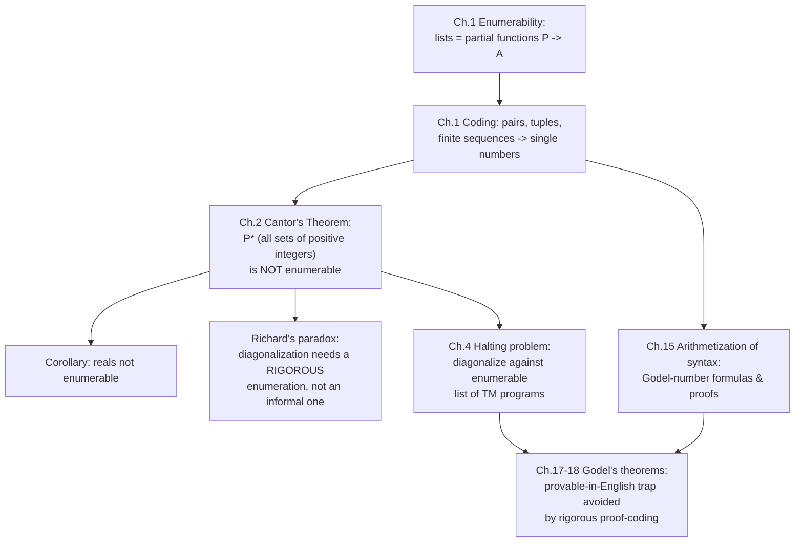

# Enumerability and the Infinite

[[book-guidelines|↩ Back to guidelines]]

## Why the book starts here

*Computability and Logic* opens not with Turing machines, not with proofs, but with a chapter about lists. That's a deliberate choice. Everything downstream — "this function is computable," "this set of theorems is provable," "this problem is undecidable" — is secretly a claim about whether some infinite collection can be lined up and walked through one item at a time. Before you can say a machine *can't* solve something, you need a precise notion of what it would mean for a list of things to be exhaustively producible at all. That precise notion is **enumerability**, and its negation — the existence of infinite collections that provably resist any such listing — is what Chapter 2 delivers via **diagonalization**, the single proof technique that will resurface, essentially unchanged, as the engine behind the halting problem, Gödel's incompleteness theorems, and Tarski's undefinability theorem later in the book.

So this topic is table stakes. Everything else in the book assumes you've internalized: what it means for an infinite set to be listable, how to compress compound objects (pairs, tuples, strings) down into single numbers so that *they* can be listed too, and why some sets — famously, the real numbers and the power set of the integers — cannot be listed no matter how clever you are.

## Enumerable sets: lists as functions

The book's definition (§1.1) is deliberately informal at first: a set is **enumerable** (or *countable*) if its members can be arranged in a single list with a first entry, a second entry, and so on, such that every member shows up sooner or later at some *finite* position. The empty set is counted as enumerable "by courtesy." An infinite enumerable set is called **denumerable** (enumerably infinite).

The sharpening the book immediately makes — and the one that actually matters for everything that follows — is this: a list is just notation for a **function** $f$ from the positive integers $P = \{1, 2, 3, \ldots\}$ to the set being enumerated, where $f(n)$ is the $n$-th entry. Conversely, a set is enumerable **iff it is the range of some function of positive integers**, where "function of positive integers" is allowed to mean a *partial* function — one that may be undefined on some inputs. This partiality is not a technicality the book tolerates reluctantly; it's load-bearing. The set $E$ of even integers is most naturally enumerated by the partial function
$$
j(n) = \begin{cases} n & \text{if } n \text{ is even} \\ \text{undefined} & \text{otherwise} \end{cases}
$$
which corresponds to the gappy list $-, 2, -, 4, -, 6, \ldots$. Gaps and redundancy in a list are both harmless — the only rule that matters is that *every* member of the set eventually appears at *some* finite index. What is **not** allowed is the list $1, 3, 5, 7, \ldots, 2, 4, 6, \ldots$ (all odds, then all evens): the even numbers never get a finite index in that arrangement — they sit at positions "$\infty+1, \infty+2, \ldots$," which isn't a position at all. This is the one wrinkle a software engineer's intuition about "just iterate over it" tends to miss, and it's worth sitting with: **enumerability is a claim about a single unbroken walk through finite indices, not about eventually mentioning everything.**

**What breaks without the finite-index requirement:** if you allowed indices "past infinity," you could trivially "enumerate" the reals by first listing all rationals (finite indices) and then somehow appending the irrationals afterward — and the entire distinction this chapter exists to draw would collapse. The finite-index rule is precisely what makes enumerability a *nontrivial*, falsifiable property of a set, which is exactly why Chapter 2 can prove some sets don't have it.

### Grounding: an enumerator as a (possibly partial) function, not an iterator you just run

A Rust programmer's first instinct is "an enumerable set is just something with an `Iterator` impl." That's close but subtly wrong in a way worth making precise, because the book's partial-function framing is stricter and more useful. Model it as a function from `n: u64` (standing in for a positive integer) to `Option<T>`:

```rust
/// An enumeration of a set of `T`s: a possibly-partial function from
/// positive integers (1, 2, 3, ...) to members of the set.
/// `f(n) = None` means "gap at this index," not "the set is exhausted" —
/// the list can have gaps forever and still be a valid enumeration.
trait Enumeration<T> {
    fn at(&self, n: u64) -> Option<T>;
}

/// Example 1.2's partial function j: enumerates the even positive integers,
/// undefined (a gap) at odd indices.
struct Evens;
impl Enumeration<u64> for Evens {
    fn at(&self, n: u64) -> Option<u64> {
        if n % 2 == 0 { Some(n) } else { None }
    }
}
```

The crucial difference from `impl Iterator<Item = T>` is that a Rust iterator's `next()` is stateful and sequential — it can't jump to index 4,000,017 without producing everything before it, and it can't skip a hole and keep going without the caller noticing a `None` that *terminates* the iterator (unless you specifically model it as `Iterator<Item = Option<T>>`, which is exactly the `Enumeration` trait above, made explicit). The book's definition needs random-access-style total-or-partial functions because several of the coding arguments below (Cantor pairing, prime-power decoding) are defined by *direct formulas* on the index $n$, not by any notion of "the next one after the last one."

In Lean, the correspondence is even more direct, because Lean already distinguishes total functions from partial ones at the type level:

```lean
-- A total enumeration of α by ℕ (using 0-indexing, unlike the book's 1-indexing)
def IsEnumerable (S : Set α) : Prop := ∃ f : ℕ → α, Set.range f = S

-- The book's "partial function of positive integers" is Lean's `ℕ → Option α`,
-- or equivalently a `PFun ℕ α`. Enumerability with gaps allowed:
def IsEnumerablePartial (S : Set α) : Prop :=
  ∃ f : ℕ → Option α, S = {a | ∃ n, f n = some a}
```

This is exactly `Set.Countable` in Mathlib, defined as "the range of some function `ℕ → α`" (Mathlib actually builds it on injections into `ℕ`, but the range-of-a-function characterization is the one the book proves equivalent, Problem 1.4).

## Coding pairs, tuples, and finite sequences by numbers

Section 1.2 is where the chapter earns its keep: a long sequence of examples showing that surprisingly complex objects — pairs, $k$-tuples, finite sequences of *unbounded* length, finite sets, finite strings over an alphabet — are all enumerable, by exhibiting an explicit **coding** (a way to assign each object a positive-integer *code number*) together with a **decoding** (recovering the object from its code). This machinery isn't a side quest; it's the toolkit the rest of the book uses to talk about "computation over sequences of symbols" as if it were "computation over numbers" — which is exactly what makes arithmetization of syntax (much later, Chapter 15) possible at all.

### Cantor pairing (Example 1.2)

The book gives two decoding functions for pairs of positive integers, both worth knowing because they trade off differently.

**Zig-zag ($G$):** arrange pairs in a grid and traverse by antidiagonals — first the pair summing to 2, then the two pairs summing to 3, and so on. Inverting this (finding the *position* of $(m,n)$) gives a closed-form encoding:
$$
J(m, n) = \frac{(m+n-2)(m+n-1)}{2} + m
$$
This is the classical **Cantor pairing function** (the book derives it from the triangular-number formula $1+2+\cdots+k = k(k+1)/2$).

**Doubling ($g$):** interleave using powers of 2 — $(m, n)$ lands at position $j(m,n) = 2^{m-1}(2n-1)$. This is really just the Fundamental Theorem of Arithmetic in disguise: every positive integer factors uniquely as (power of 2) $\times$ (odd number), and that factorization *is* the pair.

```rust
/// Cantor's zig-zag pairing (1-indexed, matching the book).
fn pair_zigzag(m: u64, n: u64) -> u64 {
    (m + n - 2) * (m + n - 1) / 2 + m
}

/// Doubling encoding: place value = power-of-two * odd part.
fn pair_doubling(m: u64, n: u64) -> u64 {
    2u64.pow((m - 1) as u32) * (2 * n - 1)
}

fn unpair_doubling(code: u64) -> (u64, u64) {
    let m = code.trailing_zeros() as u64 + 1;   // power of 2 present
    let odd_part = code >> (m - 1);              // the surviving odd number
    let n = (odd_part + 1) / 2;
    (m, n)
}
```

The doubling encoding is the one worth internalizing as an engineer, because `trailing_zeros()` is a single CPU instruction — decoding is $O(1)$ in practice, not just in principle. This is the same move as Gödel numbering by prime powers, just specialized to the primes $\{2\}$ vs. "everything," and it foreshadows the general prime-decomposition coding below.

### From pairs to $k$-tuples to unbounded sequences (Examples 1.5–1.9)

The book builds up in layers, and each layer is a genuine "what problem does this solve" moment:

1. **Triples from pairs** (Example 1.5): given the pairing function $G$ with $G(n) = (K(n), L(n))$ (i.e., $K, L$ are the two projection/decoding functions), code a triple $(p,q,r)$ by finding $m = J(q,r)$ then $n = J(p,m)$ — nesting pairs inside pairs. This generalizes to any *fixed* $k$ by iterating.
2. **Unbounded-length sequences from fixed-length ones** (Example 1.9) is the genuinely new idea, and it's the one that matters most: you can't just "iterate pairing forever" because a sequence's length $k$ isn't known in advance. The fix is to code the *pair* $(k, a)$ where $a$ is the position of the sequence within the enumeration of all $k$-tuples — i.e., **first encode the length, then encode the contents at that length**, then pair those two numbers together. This is precisely the shape of a length-prefixed encoding in any real serialization format.
3. **Positional (base-$b$) coding** (Examples 1.7–1.8): a sequence $(a_0, a_1, \ldots, a_k)$ of digits each less than $b$ codes as
   $$
   a_0 + b\,a_1 + b^2 a_2 + \cdots + b^k a_k,
   $$
   with the $i$-th entry recovered as $\mathrm{rem}(\mathrm{quo}(n, b^i), b)$ — exactly reading off "digit $i$" of a base-$b$ numeral. This only works when there's a known bound $b$ on every entry.
4. **Prime-power coding** (Example 1.9, third method): to code a sequence of arbitrary, *unbounded* numbers $(a_0, a_1, \ldots, a_k)$, use
   $$
   2^{a_0} \, 3^{a_1} \, 5^{a_2} \, 7^{a_3} \, 11^{a_4} \cdots
   $$
   i.e., the $i$-th prime raised to the $i$-th entry. The Fundamental Theorem of Arithmetic (unique factorization) guarantees this is invertible and, crucially, places **no bound on the individual entries** the way base-$b$ coding does — which is exactly why the book prefers this method for sequences whose entries can be arbitrarily large numbers themselves (as they will be, once numbers start coding *other* sequences).

```rust
/// Gödel-style prime-power coding of a finite sequence (Example 1.9, method 3).
/// Only practical for small illustrative sequences — the numbers explode fast,
/// which is the whole point: it trades a huge number for total flexibility.
fn primes(n: usize) -> Vec<u64> {
    let mut ps = vec![];
    let mut c = 2u64;
    while ps.len() < n {
        if (2..c).all(|d| c % d != 0) { ps.push(c); }
        c += 1;
    }
    ps
}

fn encode_sequence(seq: &[u64]) -> u64 {
    primes(seq.len()).iter().zip(seq)
        .map(|(&p, &a)| p.pow(a as u32))
        .product()
}

fn decode_entry(code: u64, i: usize, prime_i: u64) -> u32 {
    // the exponent of prime_i in code's factorization
    let mut n = code;
    let mut exp = 0;
    while n % prime_i == 0 { n /= prime_i; exp += 1; }
    exp
}
```

```python
# Quick tertiary sketch of the same idea, useful for eyeballing small examples
# without Rust's ceremony:
def encode(seq):
    from sympy import prime
    code = 1
    for i, a in enumerate(seq):
        code *= prime(i + 1) ** a
    return code

encode([3, 1, 2])   # -> 2**3 * 3**1 * 5**2 == 600, matching the book's worked example
```

The book's worked example — coding $(3,1,2)$ as $2^3 3^1 5^2 = 8 \cdot 3 \cdot 25 = 600$ — checks out exactly against this.

Once finite sequences are enumerable, three more results fall out almost for free (Examples 1.10–1.13, and Problems 1.6–1.7): finite *sets* are enumerable (code the sorted sequence of elements); any *subset* of an enumerable set is enumerable (thin the list, leaving gaps — this is where partial functions earn their keep again); the *union* of two enumerable sets is enumerable (interleave their lists); and finite *strings* over any finite or enumerable alphabet are enumerable (code the string as the sequence of the positions, in the alphabet, of its symbols). That last one is the fact the whole rest of the book about formal proof depends on: **the set of syntactically well-formed strings over a logical language's alphabet is enumerable**, because it's a subset of the enumerable set of all finite strings.

**Why an engineer should care beyond the puzzle value:** this whole apparatus — pair, then tuple, then length-prefixed unbounded sequence, all folded down to a single integer — is *structurally identical* to what an interner or a hash-consing scheme does when it represents an AST node as a single `NodeId`: pack a discriminant/length with child pointers into one addressable unit. Gödel numbering is "serialize the syntax tree to an integer" instead of "serialize it to bytes"; the reasoning about totality and invertibility is the same reasoning you'd want before trusting a `NodeId -> AstNode` decode step never panics.

## Cantor's diagonalization method

Chapter 2 opens by showing not every set is enumerable — "some are too big." The candidate is $P^*$, the set of *all* sets of positive integers.

> **Theorem 2.1 (Cantor's Theorem).** The set of all sets of positive integers is not enumerable.

The proof is worth reproducing in the book's own two-pass structure, because both passes matter pedagogically.

**Pass 1 — the direct argument.** Given *any* list $L = S_1, S_2, S_3, \ldots$ of sets of positive integers, define a new set $\Delta(L)$ by:
$$
(\ast)\qquad n \in \Delta(L) \iff n \notin S_n.
$$
This is well-defined — to decide membership of $n$ in $\Delta(L)$ you just check membership of $n$ in the $n$-th listed set. Now suppose (for contradiction) $\Delta(L)$ *does* appear in the list, say $S_m = \Delta(L)$ for some $m$. Instantiate $(\ast)$ at $n = m$:
$$
m \in \Delta(L) \iff m \notin S_m.
$$
But $S_m = \Delta(L)$, so also $m \in \Delta(L) \iff m \in S_m$. Combining: $m \in S_m \iff m \notin S_m$ — a flat contradiction. So no such $m$ exists: $\Delta(L)$ is provably absent from *every* list $L$ you could name, which means no list enumerates $P^*$.

**Pass 2 — the visual/diagonal picture.** Represent each $S_n$ by its characteristic function $s_n$ (i.e., $s_n(p) = 1$ if $p \in S_n$, else $0$), and lay these out as an infinite grid of 0/1 rows. Reading the entries $s_1(1), s_2(2), s_3(3), \ldots$ down the **diagonal** gives the *diagonal sequence*; flipping every bit ($1 - s_n(n)$) gives the **antidiagonal sequence** — and the antidiagonal set is exactly $\Delta(L)$. It differs from row $n$ at position $n$ by construction, for every $n$, so it cannot equal any row. This is where the technique's name comes from, and it's the picture you should keep in your head for every later use of the same trick (the halting function's diagonal argument in Chapter 4 is *the exact same construction*, with "is $n$ in $S_n$" replaced by "does machine $n$ halt on input $n$").

<svg viewBox="0 0 480 260" xmlns="http://www.w3.org/2000/svg" font-family="monospace" font-size="14">
  <text x="10" y="20" fill="#888888">List L as a grid of characteristic functions s_n(p):</text>
  <!-- column headers -->
  <text x="120" y="45" fill="#888888">p=1</text>
  <text x="180" y="45" fill="#888888">p=2</text>
  <text x="240" y="45" fill="#888888">p=3</text>
  <text x="300" y="45" fill="#888888">p=4</text>
  <!-- rows -->
  <g fill="#888888">
    <text x="20" y="75">S1</text>
    <text x="20" y="105">S2</text>
    <text x="20" y="135">S3</text>
    <text x="20" y="165">S4</text>
  </g>
  <g font-weight="bold">
    <text x="120" y="75" fill="#c47d1a">1</text><text x="180" y="75" fill="#666666">0</text><text x="240" y="75" fill="#666666">1</text><text x="300" y="75" fill="#666666">0</text>
    <text x="120" y="105" fill="#666666">0</text><text x="180" y="105" fill="#c47d1a">0</text><text x="240" y="105" fill="#666666">1</text><text x="300" y="105" fill="#666666">1</text>
    <text x="120" y="135" fill="#666666">1</text><text x="180" y="135" fill="#666666">1</text><text x="240" y="135" fill="#c47d1a">1</text><text x="300" y="135" fill="#666666">0</text>
    <text x="120" y="165" fill="#666666">0</text><text x="180" y="165" fill="#666666">0</text><text x="240" y="165" fill="#666666">1</text><text x="300" y="165" fill="#c47d1a">0</text>
  </g>
  <!-- diagonal box -->
  <rect x="112" y="60" width="26" height="24" fill="none" stroke="#c47d1a" stroke-width="1.5"/>
  <rect x="172" y="90" width="26" height="24" fill="none" stroke="#c47d1a" stroke-width="1.5"/>
  <rect x="232" y="120" width="26" height="24" fill="none" stroke="#c47d1a" stroke-width="1.5"/>
  <rect x="292" y="150" width="26" height="24" fill="none" stroke="#c47d1a" stroke-width="1.5"/>
  <text x="360" y="105" fill="#c47d1a">diagonal: 1,0,1,0,...</text>
  <text x="360" y="130" fill="#3a7bd5">antidiag: 0,1,0,1,...</text>
  <text x="20" y="210" fill="#3a7bd5">Antidiagonal set Δ(L) disagrees with row n at column n, for every n —</text>
  <text x="20" y="230" fill="#3a7bd5">so it cannot equal S1, S2, S3, S4, ... no matter how the grid continues.</text>
</svg>

**What breaks without the antidiagonal specifically:** you might think the *diagonal* sequence itself (not flipped) is already the "new" set. It isn't reliably new — the diagonal sequence could happen to equal some row of $L$ (there's no guarantee against it, since it's just read off existing rows). Only the antidiagonal is *guaranteed* to disagree with every row, because it's constructed to disagree with row $n$ specifically at column $n$, for every $n$ simultaneously. The flip is not decoration; it's the entire mechanism.

The book also addresses a natural objection head-on: "arranged in a list" sounds like it requires an infinite amount of time or paper. It reframes enumerability purely in terms of the existence of a function (no enumerator, human or divine, actually required), then indulges the vivid picture anyway with "Zeus," who writes list entries in geometrically shrinking time (1/2 second, 1/4 second, ...) to finish an infinite list in one second flat. The point of the thought experiment: **even an idealized, infinitely fast enumerator cannot enumerate $P^*$.** The obstruction is not a resource limit — it is provable, absolute impossibility, "as much an impossibility as a round square." This is worth dwelling on because it's the template for every later unsolvability/undecidability result in the book: those, too, will be *proved* impossible, not merely "not yet found."

### Grounding: diagonalization is a program, not a metaphor

```rust
/// A finite illustration of Δ(L): given N rows of bools (finitely many finite
/// sets, for concreteness), compute the antidiagonal and confirm it disagrees
/// with row n at column n, for every n.
fn antidiagonal(rows: &[Vec<bool>]) -> Vec<bool> {
    (0..rows.len()).map(|n| !rows[n][n]).collect()
}

fn demo() {
    let rows = vec![
        vec![true, false, true, false],
        vec![false, false, true, true],
        vec![true, true, true, false],
        vec![false, false, true, false],
    ];
    let anti = antidiagonal(&rows);
    for (n, row) in rows.iter().enumerate() {
        assert_ne!(row[n], anti[n], "row {n} agrees with antidiagonal at its own index");
    }
    // anti disagrees with every row at its "own" column — it cannot equal any row,
    // even though nothing here rules out its being equal to some *other* structurally
    // similar row outside the finite sample.
}
```

Lean's Mathlib carries this exact theorem, `Function.cantor_surjective` (no surjection `α → Set α` exists), proved by essentially the book's own contradiction:

```lean
theorem cantor_surjective {f : α → Set α} : ¬ Function.Surjective f := by
  intro h
  -- Δ(L): the "diagonal" set, membership defined by negated self-membership
  set Δ : Set α := {a | a ∉ f a} with hΔ
  obtain ⟨m, hm⟩ := h Δ            -- suppose f m = Δ for some m
  have : m ∈ Δ ↔ m ∉ f m := Iff.rfl
  rw [hm] at this                   -- f m = Δ, so: m ∈ Δ ↔ m ∉ Δ
  exact (iff_not_self this).elim    -- flat contradiction, exactly as in the book
```

This is worth pausing on precisely *because* it's a one-to-one translation: the book's `(∗)` clause `n ∈ Δ(L) ↔ n ∉ Sₙ` **is** the Lean `set` comprehension `{a | a ∉ f a}`, and `iff_not_self` **is** the book's "flat self-contradiction" observation, formalized. Diagonalization isn't a proof technique that happens to be expressible in a proof assistant — it's already, in the book's own hands, a piece of pure syntax manipulation over a self-referential predicate, which is exactly what a kernel's `Iff.rfl`/`rfl`-checking machinery is built to chase down.

## Nonenumerability of the reals and of power sets

Once you have one nonenumerable set, more fall out for free by transporting the argument along an encoding. **Corollary 2.2**: the real numbers are not enumerable. The proof reduces reals to sets of positive integers: every $\xi \in (0,1)$ has a decimal expansion $.x_1x_2x_3\ldots$ (choosing the expansion ending in 0s rather than 9s when there's a choice, e.g. $.2999\ldots = .3000\ldots$); associate to $\xi$ the set of positions $n$ where $x_n = 1$. Every set of positive integers arises this way (as the set of positions bearing a 1, summing $10^{-n}$ over the set). So **an enumeration of the reals would immediately yield an enumeration of $P^*$** — contradicting Theorem 2.1. This is the book's first example of the technique that will recur constantly: don't diagonalize directly against a new class, *reduce* it to a class you've already shown nonenumerable.

The problems at the end of Chapter 2 chase the same equivalence further and are worth citing because they're the load-bearing facts a reader should walk away holding, even though the book leaves them as exercises rather than worked proofs: the set of *all subsets* of any infinite enumerable set is nonenumerable (Problem 2.1 — this is the general **power-set** version of Cantor's theorem, of which $P^*$ is the special case for the positive integers themselves); the reals in $(0,1)$ are equinumerous with the full set of reals, with the points on a line, a semicircle, a plane, and even all of space (Problems 2.3–2.5, 2.11–2.12) — a first taste of the fact that "cardinality" collapses a lot of geometric intuition about dimension; and the set of all sets of positive integers is equinumerous with the reals themselves (Problem 2.9), tying the two nonenumerability results together as *the same* infinite cardinality, not merely two separately-large sets.

The general shape worth internalizing: **Cantor's theorem is really a theorem about power sets**, $|A| < |\mathcal{P}(A)|$ for any set $A$, and "the set of sets of positive integers" is just $\mathcal{P}(P)$. The specific argument with $0$s and $1$s in Theorem 2.1's proof is literally the special case of the general power-set diagonalization where $A = P$: a subset of $P$ *is* a function $P \to \{0,1\}$, i.e., an element of $\{0,1\}^P \cong \mathcal{P}(P)$.

## Richard's paradox: where the same-looking argument breaks

The chapter ends (Problem 2.13) with **Richard's paradox**, presented as a "what's wrong with this?" exercise rather than a result — deliberately, because the whole pedagogical point is to force you to locate the flaw yourself by contrasting it against the legitimate proof you just read. The argument runs:

1. The set of all finite strings over an ordinary alphabet (letters, space, punctuation) is enumerable — use the prime-decomposition coding from §1.2.
2. Some of those strings happen to be English-language definitions of sets of positive integers; strike out the ones that aren't, and (after also removing redundant strings defining the same set) you have an *irredundant enumeration* of "all sets of positive integers that have definitions in English."
3. Diagonalize against it: let $R$ be the set of $n$ such that $n$ does **not** belong to the $n$-th set in this enumeration.
4. By construction $R$ cannot appear in the enumeration at any position (exactly Theorem 2.1's argument). So $R$ has no English definition.
5. **But we just gave $R$ an English definition** — the sentence in step 3. Contradiction.

The book flags this explicitly as an object lesson in "the danger of conflating a rigorously defined enumeration ... with an informal notion like 'definitions in English.'" The flaw is not in the diagonalization step — that step is exactly as valid as it was in Theorem 2.1. The flaw is upstream, in step 2: "the set of strings that are English definitions of sets of positive integers" is not a well-defined, rigorously specified enumeration the way "the set of all finite strings, coded by prime decomposition" is. Whether a given English sentence "defines a set of positive integers" is not decidable, or even well-defined, by any fixed rule — and step 3's own definition of $R$ is itself a candidate string being fed back into the very sieve that's supposed to have already been completed in step 2, i.e., the construction is **impredicative**: it defines $R$ by quantifying over "all English definitions," and then turns around and offers $R$'s own definition as one more member of that same totality. Cantor's genuine proof never does this — $\Delta(L)$ is defined relative to a *fixed, already-completed* list $L$ that is handed to the proof as data, not relative to "all lists" or "all definitions" including the one being written down in the act of defining $\Delta(L)$ itself.

This distinction — a legitimate diagonalization against a rigorously fixed enumeration, versus an illegitimate one smuggled through an ill-defined or self-referential "enumeration" of informal definitions — is exactly the fault line the book will need again, seriously, when it proves the real undecidability and incompleteness results later on: Chapter 4's halting problem diagonalizes against the enumeration of Turing-machine *programs* (rigorously enumerable, by Chapter 1's machinery, because programs are finite strings), and Gödel's theorem will need the arithmetization apparatus from Chapter 1 (coding strings as numbers) precisely so that "provability" can be pinned to a rigorously enumerable set of proof-strings rather than an informal notion like "provable by some argument in English." Richard's paradox is the chapter's warning shot: the coding machinery from §1.2 is not just a convenience, it's what keeps the diagonalization in Chapter 4 from collapsing into this same trap.

## Where this leads



- **The coding machinery (§1.2)** is not a warm-up exercise — it's the literal mechanism by which "syntax" (Turing-machine programs, logical formulas, proofs) gets turned into "numbers," which is what lets later chapters apply arithmetic reasoning to questions about provability and computability at all.
- **Cantor's Theorem** is the template for every later negative result in the book. The halting problem's proof (Ch. 4) is diagonalization against the enumeration of TM-programs-on-inputs; it differs from Theorem 2.1 only in which enumerable set is being diagonalized against.
- **Richard's paradox** is the standing warning that makes the rest of the book's rigor non-optional: every later diagonalization argument (halting problem, Gödel's first and second incompleteness theorems, Tarski's theorem on the undefinability of truth) works *because* it diagonalizes against a genuinely, rigorously enumerable set (built from Chapter 1's coding functions), never against an informally-gestured-at collection like "all English definitions."

*A brief note for the standing project:* this topic is mostly pure groundwork rather than something that maps onto Hoare-triple checking or implicit-argument elaboration directly. The one piece worth carrying forward explicitly is the coding discipline in §1.2 — packing a discriminant/length with contents into a single addressable value is the same shape of problem as interning or hash-consing an AST, and the totality/invertibility care the book takes with each coding function (does every code decode back to exactly one object? does every object have a code?) is the same care a `NodeId -> AstNode` decoder in a verifier needs, just with numbers standing in for pointers.
