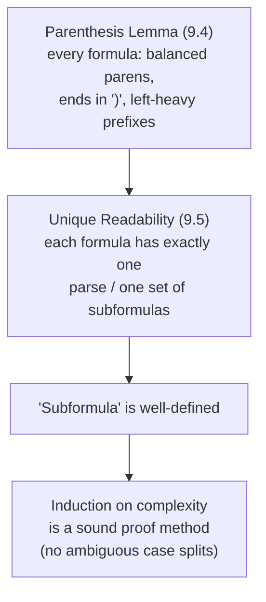
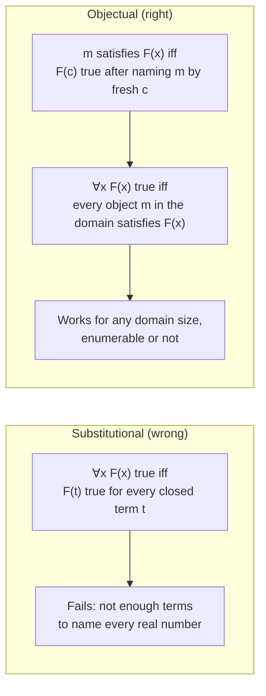
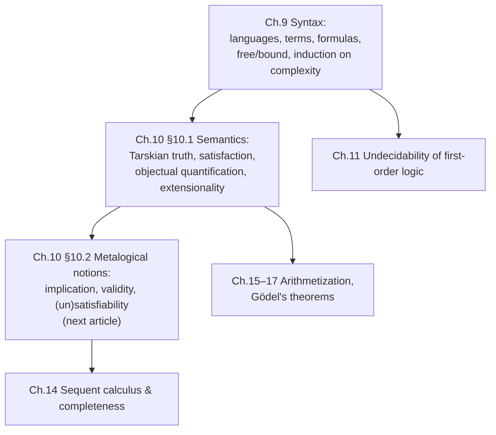

# First-Order Syntax and Semantics

[[book-guidelines|↩ Back to guidelines]]

## Why bother formalizing any of this?

You already know what a first-order sentence "means" — you can read $\forall x\, \exists y\, (x < y)$ and know it says "there's no biggest number." So why does Boolos, Burgess & Jeffrey spend two dense chapters re-deriving what every intro logic course already told you, in a far more rigid notation?

The book gives two reasons, and both should sound familiar if you've ever built a compiler or a proof checker:

1. **You want a notion of "sentence" precise enough that a machine could decide, syntactically, whether an arbitrary string qualifies.** This book's whole second half is about computability meeting logic; that meeting point requires "formula" to be a decidable property of strings, not a fuzzy grammatical judgment call the way "grammatical English sentence" is.
2. **You want a notion of "truth" that doesn't collapse into paradox.** The Epimenides/liar paradox ("this sentence is false") shows that an *unrestricted*, self-referential notion of truth is inconsistent. Tarski's fix — build truth *compositionally*, by recursion on syntactic structure, with the object language kept separate from the metalanguage doing the defining — is what makes "true" a respectable mathematical predicate rather than a philosophical minefield.

Both of these are exactly the concerns you have when you write an AST and an evaluator/type-checker: you need parsing (well-formedness) to be a decidable, structural property, and you need your semantics (evaluation, typing judgments) to be defined by structural recursion over that AST, not by some circular hand-wave. First-order syntax and semantics is, in a real sense, the ancestor of both.

What breaks without this rigor: without an official, rigid grammar, you can't even *state* theorems about "all formulas" — you have no induction principle to prove them by, and no guarantee that a given string parses only one way (imagine two different parse trees assigning different meanings to the same program text — that's exactly what the book's unique readability lemma rules out for formulas).

---

## 1. Languages, terms, and formulas

### Logical vs. nonlogical symbols

The book's first move is to partition every symbol that can appear in a formula into two disjoint classes:

- **Logical symbols** — fixed once and for all, the same across every language: the connectives $\sim, \&, \vee, \to, \leftrightarrow$, the quantifiers $\forall, \exists$, the variables $v_0, v_1, v_2, \ldots$, parentheses and commas, and — by special exception — the identity sign $=$ (it's a two-place predicate, but its meaning is pinned down, so it's grouped with the logical symbols, not left to vary by interpretation).
- **Nonlogical symbols** — the vocabulary that varies from one subject matter to the next: **constants** (individual symbols), **predicates**/relation symbols (each with a fixed arity $n > 0$), and **function symbols** (also fixed-arity).

A **language** $L$ is officially just *an enumerable set of nonlogical symbols* — nothing more. The empty language $L_\emptyset$ (no nonlogical symbols at all) is a legitimate degenerate case. The book's running example is the **language of arithmetic** $L^*$: the constant $0$, the predicate $<$, the function symbol $'$ (successor, one-place), and $+, \cdot$ (two-place). Note that $L^*$ is *just a vocabulary* — it says nothing yet about what these symbols denote. That's semantics' job (Section 3 below).

This separation — grammar-defining symbols fixed, domain vocabulary pluggable — is precisely the separation a compiler front-end draws between its fixed keyword/operator set and a user's identifiers. A "language" here is structurally a *signature*.

**If you already know type theory:** this is a first-order analogue of a signature $\Sigma$ in the sense used throughout the type-theory literature — a set of typed constant and operator symbols against which terms are built, prior to and independent of any particular model.

### Terms and formulas, officially

The book insists on a **rigid official grammar**, deliberately more awkward than the "colloquial" notation you'd actually write examples in, because *theorems are proved about the official grammar, and only later transferred (by a promise that abbreviations are eliminable) to the colloquial one*. This mirrors exactly the compiler distinction between a desugared core IR (small, rigid, is what your type checker actually sees) and surface syntax (rich, ergonomic, exists purely for the human).

**Terms** (when function symbols are present):
- Every variable and every constant is an atomic term.
- If $f$ is an $n$-place function symbol and $t_1,\ldots,t_n$ are terms, then $f(t_1,\ldots,t_n)$ is a term.
- Nothing else is a term.

A term is **closed** if it contains no variables (e.g. $0''$), **open** otherwise (e.g. $x''$). Terms correspond to English "singular noun phrases."

**Formulas:**
- **Atomic formula:** a predicate $R$ of arity $n$ applied to $n$ terms, written officially $R(t_1,\ldots,t_n)$ — with $=(t_1,t_2)$ as the identity-flavored special case.
- **Negation:** if $F$ is a formula, so is $\sim F$.
- **Conjunction/disjunction:** if $F, G$ are formulas, so are $(F \& G)$ and $(F \vee G)$.
- **Quantification:** if $F$ is a formula and $x$ a variable, then $\forall x F$ and $\exists x F$ are formulas.
- Nothing else is a formula.

Every formula thus comes with a **formation sequence** — a finite, explicit sequence of construction steps witnessing how it was built from atomic formulas. This is exactly a derivation tree / parse tree, made explicit as data rather than left implicit.

The book is careful to note that $\to$ and $\leftrightarrow$, and the bounded quantifiers $\forall y {<} x$, $\exists y {<} x$, are **not official symbols at all** — they're sugar: $(F \to G) :\equiv (\sim F \vee G)$, $(F \leftrightarrow G) :\equiv ((\sim F \vee G)\&(\sim G \vee F))$. You could even drop $\vee$ or $\exists$ from the official grammar entirely and treat them as further sugar, since $(F \vee G) \leftrightarrow \sim(\sim F \& \sim G)$ and $\exists x F \leftrightarrow \sim \forall x \sim F$ (this second fact only becomes available once semantics is defined — see §4). A minimal official core plus a rich elaborated surface language is the load-bearing idea here, not a stylistic footnote.

**Lean grounding (primary for this topic).** This grammar is a textbook inductive family. In Lean:

```lean
-- Fixed stock of variables, as natural-number indices (Boolos's v0, v1, v2, ...)
abbrev Var := Nat

-- Terms, parametrized by a signature of function symbols with their arities
inductive Term (Func : Nat → Type) : Type where
  | var   : Var → Term Func
  | const : Func 0 → Term Func            -- a "constant" is a 0-ary function symbol
  | app   : {n : Nat} → Func n → (Fin n → Term Func) → Term Func

-- Formulas, parametrized by a signature of predicates
inductive Formula (Func : Nat → Type) (Pred : Nat → Type) : Type where
  | atom : {n : Nat} → Pred n → (Fin n → Term Func) → Formula Func Pred
  | eq   : Term Func → Term Func → Formula Func Pred
  | not  : Formula Func Pred → Formula Func Pred
  | and  : Formula Func Pred → Formula Func Pred → Formula Func Pred
  | or   : Formula Func Pred → Formula Func Pred → Formula Func Pred
  | all  : Var → Formula Func Pred → Formula Func Pred
  | ex   : Var → Formula Func Pred → Formula Func Pred
```

The point of showing this in Lean rather than Rust first: an `inductive` declaration in Lean's kernel *is* the book's "and that is all" closure clause, made completely literal — Lean generates the induction/recursion principle for you automatically, which is exactly the "induction on complexity" principle Boolos-Burgess-Jeffrey state by hand in §9.2 (see §3 below). There is no gap between "official definition of formula" and "Lean `inductive`" — they're the same mathematical object, one stated in prose-with-italicized-metavariables, the other as a kernel declaration.

**Rust grounding (secondary).** The same shape, without a dependently-typed kernel to lean on — this is what your verifier's actual AST would look like:

```rust
enum Term {
    Var(usize),
    Const(Symbol),
    App(Symbol, Vec<Term>),   // arity implicit in Vec length; checked separately
}

enum Formula {
    Atom(Symbol, Vec<Term>),
    Eq(Term, Term),
    Not(Box<Formula>),
    And(Box<Formula>, Box<Formula>),
    Or(Box<Formula>, Box<Formula>),
    Forall(usize, Box<Formula>),
    Exists(usize, Box<Formula>),
}
```

Note what Rust's `enum` does *not* give you for free that Lean's `inductive` does: arity-correctness (`App(Symbol, Vec<Term>)` will happily typecheck an `App` whose `Vec` has the wrong length for the symbol's declared arity) and the automatically-derived structural recursion principle. In Rust you'd hand-write a `fn induction_step(&self) -> ...` recursive match and trust yourself to cover every case; in Lean, the `match` is checked exhaustive by the kernel and the recursion principle is a theorem, not a convention.

**What breaks without a rigid grammar:** if "formula" were defined loosely (as in ordinary language, where "A and B or C" is genuinely ambiguous between two readings), you couldn't even *state* "every formula has property $P$" as a well-founded induction, because you wouldn't have a well-founded notion of "simpler formula" to recurse on. The rigidity is not pedantry; it's the precondition for induction to make sense at all.

---

## 2. Free and bound variables, and sentences

Given a formula, an occurrence of a variable $x$ is **bound** if it lies inside a subformula beginning $\forall x \ldots$ or $\exists x \ldots$ (that quantifier is said to *bind* the occurrence); otherwise it's **free**. Boolos-Burgess-Jeffrey's own example:

$$Fx \to \forall x\, Fx$$

— the first occurrence of $x$ is free, the other two are bound (by the $\forall x$). Nothing stops the *same* variable name from occurring both free and bound in one formula (that's literally Problem 9.8 in the book: how would you have to change the definition to *prevent* this?). This is the formal-logic analogue of shadowing: `x` used both as a free reference and as a lambda-bound parameter name in the same expression.

A **sentence** is a formula with no free variable occurrences at all — a *closed formula*. A **subsentence** is a subformula that happens to be a sentence. The book's convention `F(x)` — "let $F(x)$ be a formula" — means "let $F$ be a formula whose only free variable is $x$"; then `F(t)` denotes substituting the closed term $t$ for every free occurrence of $x$. This is exactly the notation you'd use to talk about "the body of a lambda with hole $x$, instantiated at $t$" — and it quietly presupposes **capture-avoiding substitution**: you only ever substitute *closed* terms $t$ for *free* occurrences, so no variable in $t$ can accidentally get captured by a binder inside $F$. The book sidesteps the general capture problem entirely by restricting attention to closed-term instantiation; a fuller treatment (which you'll need for a real implementation) has to confront capture directly.

**What breaks without the free/bound distinction:** without it, "instance of a formula" (substituting $t$ for $x$ in $F(x)$) is ill-defined — you wouldn't know *which* occurrences of $x$ to replace. Get this wrong in an implementation and you get the classic variable-capture bug: substituting a term containing $y$ into $\forall y\, F(x,y)$ naively would let the substituted $y$ get silently captured by the $\forall y$, changing the formula's meaning. Real implementations dodge this with de Bruijn indices (bound variables become numeric offsets, so there's no *name* to accidentally capture) or explicit freshening — both are direct engineering responses to exactly the phenomenon this section defines.

---

## 3. Induction on complexity — the book's main proof method

This is the single most load-bearing technique in the two chapters, and the one the "what breaks without this" framing applies to most directly: **without it, you cannot prove any general fact about "all formulas" or "all terms" at all**, because those are infinite, recursively-generated sets with no other handle on them.

**The schema**, as the book states it for formulas:

- **Base step:** atomic formulas have the property $P$.
- **Induction step:** if a formula is formed by applying a connective/quantifier to simpler formula(s), and those simpler formula(s) have $P$ (induction hypothesis), then the composite formula has $P$ too — checked separately for each of $\sim, \&, \vee, \forall, \exists$.

And the exactly analogous schema for terms (atomic terms have $P$; if $t_1,\ldots,t_n$ have $P$, so does $f(t_1,\ldots,t_n)$) is needed as a *preliminary lemma* whenever function symbols are in play, since formulas are then built on top of a term layer.

This is structural induction over an inductively-defined datatype, full stop — the same principle that justifies `match`-based recursive functions terminating over a recursive `enum`/`inductive` type. In Lean this isn't even a technique you invoke by name — it's *automatically generated* the moment you write the `inductive Formula ...` declaration above, as `Formula.rec`. Boolos-Burgess-Jeffrey are, in 1970s-logic-textbook prose, hand-deriving exactly what a modern proof assistant's kernel synthesizes mechanically from the datatype declaration. That correspondence is worth sitting with: **"induction on complexity" is what "structural recursion is well-founded" looks like before someone builds a kernel to check it for you.**

### Worked example 1: the parenthesis lemma (9.4)

Three claims, all proved by this schema:
(a) every formula ends in a right parenthesis;
(b) every formula has equally many left and right parentheses;
(c) if a formula is split into a nonempty left part and nonempty right part, the left part never has *more* right than left parentheses (and strictly more left, if it has any parentheses at all).

The proofs are genuinely mechanical once you trust the schema: e.g. for (b), an atomic formula has one of each parenthesis; $\sim F$ adds none; $(F \& G)$ adds exactly the outer pair, so if $F$ has $m$ of each and $G$ has $n$ of each, $(F\&G)$ has $m+n+1$ of each. Nothing clever — just bookkeeping propagated through the recursive structure.

### Worked example 2: unique readability (9.5)

This is the theorem that makes "subformula" *well-defined* in the first place: for each formula shape (atomic, $\sim F$, $(F\&G)/(F\vee G)$, $\forall xF/\exists xF$), the book proves the *only* subformulas are the "obvious" ones (itself, plus recursively the subformulas of its immediate parts) — no accidental extra parse. Crucially, the proof of unique readability **depends on** the parenthesis lemma: e.g. if the connectives had no parentheses at all, $F \& G \vee H$ would ambiguously contain the "spurious" subformula $G \vee H$, which is neither the whole thing nor a genuine subformula of either conjunct — an actual, structural parsing ambiguity, not just an aesthetic one.



**What breaks without unique readability:** if a string could parse two different ways, "the induction hypothesis holds for the immediate subformulas of $F$" would be ambiguous — *which* subformulas? You'd have no guarantee that a recursive function defined by cases on formula shape is even a *function* (well-defined, single output per input). This is precisely why a real parser must produce an unambiguous grammar before a type checker can recurse over its output with any confidence.

**Rust grounding.** Structural induction over the `Formula` enum above is just: write a function that recurses via `match`, handle every variant, and trust the Rust compiler's exhaustiveness check to play the role of "and that is all" — though note Rust's exhaustiveness check only proves you *covered every syntactic case*, not that your recursive calls terminate (Lean's termination checker enforces the latter too, since `Formula.rec` only lets you recurse on structurally smaller subterms).

```rust
fn count_parens(f: &Formula) -> (usize, usize) { // (left, right)
    match f {
        Formula::Atom(_, _) | Formula::Eq(_, _) => (1, 1),
        Formula::Not(inner) => count_parens(inner),
        Formula::And(l, r) | Formula::Or(l, r) => {
            let (lm, ln) = count_parens(l);
            let (rm, rn) = count_parens(r);
            (lm + rm + 1, ln + rn + 1)
        }
        Formula::Forall(_, inner) | Formula::Exists(_, inner) => count_parens(inner),
    }
}
```

---

## 4. The Tarskian definition of truth

Now semantics (Chapter 10, §10.1). An **interpretation** $M$ for a language $L$ consists of a nonempty **domain** $|M|$ (the universe of discourse) plus, for each nonlogical symbol, a **denotation**: a constant $c$ gets an individual $c^M \in |M|$; an $n$-place predicate $R$ gets an $n$-ary relation $R^M$ on $|M|$; an $n$-place function symbol $f$ gets an $n$-ary function $f^M : |M|^n \to |M|$. (Identity is exempt from arbitrary assignment — its denotation is always forced to be the genuine identity relation.)

Truth of a sentence $F$ in interpretation $M$, written $M \models F$ ("$M$ makes $F$ true"), is defined by **recursion on the structure of $F$** — Tarski's move, and the direct payoff of §9's rigid grammar:

**Denotation of closed terms** (needed first, since atomic sentences quote terms):
$$(f(t_1,\ldots,t_n))^M = f^M\!\left(t_1^M,\ldots,t_n^M\right)$$

**Atomic sentences:**
$$M \models R(t_1,\ldots,t_n) \iff R^M\!\left(t_1^M,\ldots,t_n^M\right)$$
$$M \models {=}(t_1,t_2) \iff t_1^M = t_2^M$$

**Connectives** (no surprises, and only one sensible choice each):
$$M \models {\sim}F \iff \text{not } M \models F$$
$$M \models (F \& G) \iff M \models F \text{ and } M \models G$$
$$M \models (F \vee G) \iff M \models F \text{ or } M \models G$$

Every one of these clauses reduces the truth of a compound sentence to the truth of *strictly simpler* sentences (or the denotation of strictly simpler terms) — which is exactly why induction on complexity (§3) is the tool that lets you prove general facts about $\models$, not just compute it on examples. **Truth is not defined all at once; it's defined compositionally, the same way an evaluator for an expression language is defined by recursion on the AST, not by a single global rule.**

**What breaks without compositionality:** an unrestricted, non-recursive notion of "true" — one that could quantify over "all true sentences" including sentences that talk about their own truth — is exactly the mechanism behind the liar paradox the book flags in its motivation. Tying truth to recursion on syntactic complexity, with the metalanguage (English/set theory, defining $\models$) kept separate from the object language ($L$, the language $\models$ is defined *over*), is precisely what blocks the paradox from arising here. (This object-language/metalanguage separation resurfaces much later in the book, in Chapter 16, as Tarski's actual *theorem* on the indefinability of truth — a topic for a different article, but worth flagging: the discipline imposed here is not incidental, it's load-bearing for results twenty chapters later.)

---

## 5. Satisfaction and the objectual account of quantification

Connectives were easy — "only one candidate" for the right clause. Quantifiers are the one genuinely subtle spot in the whole definition, and the book earns that subtlety honestly by first showing you the *wrong* answer.

### The tempting, wrong answer: the substitutional approach

$$M \models \forall x\, F(x) \iff \text{for every closed term } t,\ M \models F(t)$$
$$M \models \exists x\, F(x) \iff \text{for some closed term } t,\ M \models F(t)$$

i.e. "universal = true for every substitution instance you can write down; existential = true for some instance you can write down." This is tempting because it reduces quantification to something you've already defined (truth of sentences) via literal term substitution — no new machinery needed.

**Why it's wrong (Example 10.1):** a language is only allowed to have an *enumerable* (countably infinite, at most) stock of symbols, so it has only enumerably many closed terms. But the real numbers $\mathbb{R}$ are *not* enumerable (Cantor's theorem — the subject of an earlier chapter in this book). So on the real-number interpretation of the language of arithmetic, $\exists x(x \cdot x = 2)$ is intuitively **true** (witness: $\sqrt2$), but under the substitutional reading it comes out **false**, because no closed term of $L^*$ — built only from $0, ', +, \cdot$ — denotes $\sqrt2$; every closed term denotes a natural number, and no natural number squares to $2$. You can't patch this by adding more constants, because you'd need uncountably many (one per real number), which would violate the enumerability requirement on languages outright.

**What breaks without fixing this:** the substitutional approach silently conflates "true of every nameable thing" with "true of everything" — invisible whenever the domain happens to be countable and every element happens to be named (it works fine for $L^*$ on the standard interpretation $N^*$!), and catastrophically wrong the moment the domain outgrows the language's naming capacity. This is a sharp, concrete instance of a very general trap: definitions that quietly rely on syntactic accessibility (only quantifying over what you can *write down*) diverge from definitions that quantify over the actual semantic domain.

### The right answer: the objectual approach, via satisfaction

Instead of asking "is there a *term* that witnesses this," the book asks "is there an *object in the domain* that witnesses this" — directly, without routing through the language's naming capacity. To make that precise it needs an auxiliary notion, **satisfaction**: for a formula $F(x)$ with one free variable and an object $m \in |M|$, say $m$ **satisfies** $F(x)$ in $M$, written $M \models F[m]$, meaning: extend the language by one brand-new constant $c$, extend the interpretation $M$ to $M^m_c$ by letting $c$ denote $m$ specifically, and check whether the now-*closed* sentence $F(c)$ is true in $M^m_c$:

$$M \models F[m] \iff M^m_c \models F(c) \tag{3*}$$

This is the trick: satisfaction lets you talk about "the truth of $F$ at object $m$" *without* needing $m$ to already have a name in $L$ — you manufacture the name on the fly, one object at a time, rather than needing all of them named in advance. Quantification is then defined over the *domain*, not over the *term stock*:

$$M \models \forall x\, F(x) \iff \text{for every } m \in |M|,\ M \models F[m]$$
$$M \models \exists x\, F(x) \iff \text{for some } m \in |M|,\ M \models F[m]$$

On the reals, $\sqrt2$ satisfies $x \cdot x = 2$ — full stop, no term required — so $\exists x(x\cdot x = 2)$ correctly comes out true, exactly matching intuition, with no cardinality obstruction at all: this works whether $|M|$ is countable or not.



**Connection to the objective you're building toward (elaboration/unification):** satisfaction's "extend the language with a fresh constant, then check" move is structurally the same trick a bidirectional type-checker/elaborator uses when it introduces a fresh metavariable to stand for a not-yet-determined value and later solves it by unification — both are ways of reasoning about "some object with property $P$" without committing to *which* syntactic term denotes it up front. It's also the same idea underlying Skolemization (a topic elsewhere in this book): trade a quantifier for a fresh symbol.

---

## 6. Extensionality

**Proposition 10.2 (Extensionality lemma).** Roughly: the truth value of a sentence (or the satisfaction of a formula by an object) depends *only* on the domain and the denotations of the nonlogical symbols actually occurring in it — never on which symbols happen to spell those denotations, and never on symbols not occurring in it at all. More formally: if you swap every nonlogical symbol in a sentence $A$ for a *different* symbol of the same arity/kind, and correspondingly swap the interpretation so the new symbols get exactly the old denotations, the truth value is unchanged.

The proof is by — unsurprisingly — induction on complexity, and it's genuinely short: at the atomic level, truth only mentions the denotations of the predicate/constants actually present; at each connective, truth only mentions the truth values of the immediate parts; at the quantifier level, truth (via satisfaction) only mentions the domain and which elements satisfy the sub-formula. Nothing in any clause of the Tarski definition ever reaches outside the symbols textually present in the (sub)formula being evaluated. The book remarks the proof is "hardly longer than its formal statement" — and that brevity is itself the point: it's a direct readout of how tightly compositional the definition of truth is. If truth weren't purely compositional, this proof would need real content; that it doesn't is evidence the definition was built correctly.

Extensionality is what retroactively justifies an earlier claim: the substitutional approach to quantification (§5) *does* coincide with the objectual one whenever every domain element happens to be denoted by some closed term (e.g. the standard interpretation $N^*$ of arithmetic, where every natural number $m$ is denoted by its numeral $\underline m = 0''\cdots'$). It's also the lemma every one of the "implication principle" examples in §10.2 leans on (e.g. $s = t$ and $B(s)$ jointly imply $B(t)$ — precisely because swapping in an equally-denoting term can't change a truth value).

**What breaks without extensionality:** if truth *could* depend on symbols not occurring in a sentence, "the truth value of $A$ in $M$" wouldn't even be a well-defined function of "$A$ and the relevant part of $M$" — you'd need the *entire* interpretation (arbitrarily large, possibly involving symbols with nothing to do with $A$) to evaluate anything, which is both intuitively wrong and would make truth computationally intractable, since you could never localize what you need to check. This is the semantic mirror of a compiler wanting *referential transparency*: an expression's value should depend only on the free variables/symbols actually occurring in it.

**Where extensionality famously fails outside formal languages** (the book flags this too, and it's worth carrying forward as a caution): "Scott was the author of *Waverley*" is true, and "Scott" and "the author of *Waverley*" denote the same person — yet substituting one for the other inside an opaque context like "King George wondered whether Scott was the author of *Waverley*" can change the sentence's truth value (George didn't wonder about *himself*, tautologically). Formal first-order semantics simply has no opaque/intensional contexts (no "believes that," "wonders whether") — extensionality is bought by that absence, not by cleverness. If you ever add modal or epistemic operators to a formal language, extensionality is exactly the property you'd need to give up or carefully restrict.

---

## Where this leads

Structurally, this topic is the hinge of the whole book:



Everything downstream needs both halves working together: soundness/completeness (Ch. 14) is a theorem *relating* the syntactic notion of derivability to the semantic notion of security/consequence built directly on $\models$; the undecidability results (Ch. 11) reduce the halting problem to a question about $\Gamma$ *implies* $D$, which only makes sense once implication is pinned to this Tarski semantics; and Tarski's theorem on the indefinability of truth (Ch. 16) is a direct descendant of the same object-language/metalanguage discipline this chapter insists on from the start.

**For the projects this vault is tracking:** this topic is about as load-bearing as source material gets.

- The `Term`/`Formula` inductive definitions (§1) are the direct ancestor of any AST your Rust verifier or Lean-style elaborator will define — arity-checked constructors, a closure clause ("and that is all"), nothing more.
- **Induction on complexity (§3) is structural recursion, stated by hand.** Every judgment form your type checker or proof checker will define — "this term has this type," "this proof step is valid" — will be defined the same way BBJ define $\models$: by cases on the syntactic shape of the thing being judged, with a base case and one case per constructor. The parenthesis and unique-readability lemmas are what makes that case analysis *sound* (no formula parses two ways, so no judgment rule is stated over an ambiguous case).
- **Satisfaction's fresh-constant trick (§5)** — "extend the language with a fresh name, check truth there, project back" — is the same shape of move a bidirectional elaborator makes when it introduces a metavariable for an unknown value and later resolves it by unification. If you build the pattern-unification fragment mentioned in the workbench's standing goals, expect to recognize this exact structure again.
- **Extensionality (§6)** is the semantic-truth analogue of substitution lemmas you'll need to prove for any typed calculus (e.g. "if $\Gamma \vdash t : \tau$ and $s$ has the same value/type as $t$'s substituend, substitution preserves the judgment") — the proof techniques transfer almost verbatim, because both are induction-on-complexity arguments about compositional definitions.

The next article (Chapter 10 §10.2, "[[Metalogical-Notions|Metalogical Notions]]") builds directly on top of $\models$ defined here: implication, validity, and satisfiability are all just different quantificational patterns over the same truth relation.
