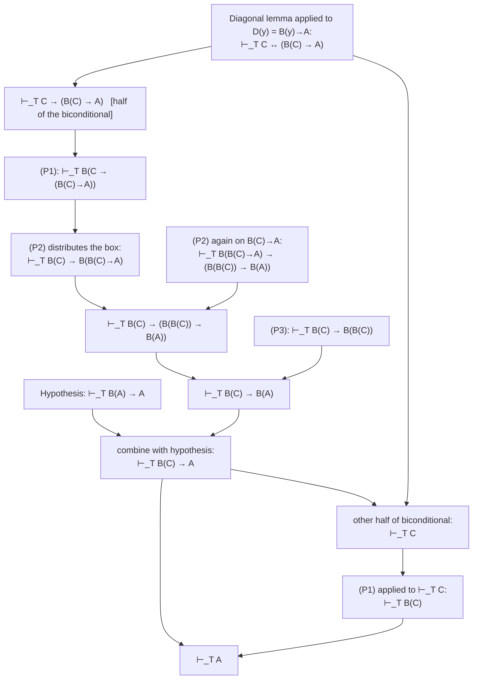
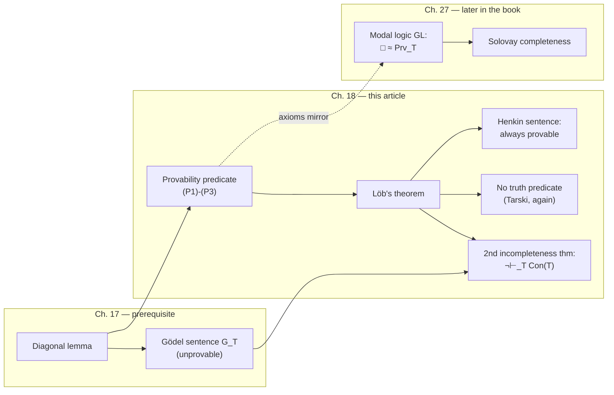

# Gödel's Second Incompleteness Theorem and the Logic of Provability

[[book-guidelines|↩ Back to guidelines]]

## Why this chapter exists: from "unprovable" to "unprovable *that it's consistent*"

Chapter 17 (see the companion article, [[The-Diagonal-Lemma-and-the-Limitative-Theorems]]) built [[The-Diagonal-Lemma-and-the-Limitative-Theorems#The Gödel sentence|the Gödel sentence]] $G_T$ — a sentence that, via the diagonal lemma, says of itself "I am not provable in $T$" — and showed that if $T$ is consistent, $G_T$ is genuinely undecidable. That's the **first** incompleteness theorem: some particular arithmetic sentence slips through $T$'s net.

This chapter asks a sharper, more unsettling question: can $T$ at least prove that it *itself is consistent*? Intuitively you'd hope so — consistency seems like a modest, almost bookkeeping fact compared to deep arithmetic content. The answer, Gödel's **second incompleteness theorem**, is no: no consistent, sufficiently strong, axiomatizable theory can prove its own consistency sentence. A theory that could verify its own consistency would, in a precise sense, be lying to you about how much it trusts itself — and this chapter is where you can finally see, with an actual proof, why that trust is structurally impossible to formalize from the inside.

**What breaks without this result:** if it *were* possible, you could always add "I am consistent" as an axiom and get a strictly stronger theory that still proves its own consistency — an infinite regress that would let you bootstrap certainty about a formal system using nothing but the system itself. No external argument would ever be needed to trust a theory. The second incompleteness theorem is precisely the theorem that forecloses this bootstrap, and — as the chapter's closing pages spell out — it is the theorem that ended a specific, concrete mathematical research program (Hilbert's) built on the hope that the bootstrap would work.

The proof strategy the chapter uses is the book's central methodological move for this material, and it's worth stating up front because everything below is organized around it: instead of directly formalizing "$T$ can prove its own consistency" (which requires grinding through a full formalized copy of Chapter 17's proof inside $T$ — technically true but tedious beyond the book's scope), the book **isolates three abstract properties** that any reasonable notion of "provable in $T$" ought to have, proves one clean theorem (**Löb's theorem**) from just those three properties, and then gets the second incompleteness theorem, the resolution of a question about self-provability (the Henkin sentence), and the nonexistence of a truth predicate for $T$ — three seemingly different results — as three corollaries of the *same* three-line argument.

## The consistency sentence, and the theorem in its concrete form

A theory $T$ (extending $Q$, Robinson arithmetic) is inconsistent exactly when it proves $0 = 1$ — this is because $0=1$ follows from any contradiction by pure logic, and conversely $0=1$ is already false enough that once you have it, everything follows. So "$T$ is consistent" and "$T$ does not prove $0=1$" are equivalent, and the book defines:

$$\text{consistency sentence for } T \;:=\; \sim \mathrm{Prv}_T(\overline{0=1})$$

where $\mathrm{Prv}_T(x)$ is the **traditional provability predicate** — the formula (built via [[Arithmetization-of-Syntax-and-Representability|arithmetization of syntax and representability]], Chapters 15–16) that says "$x$ is the Gödel number of a sentence provable from $T$," and $\overline{0=1}$ is the Gödel numeral for the sentence $0=1$.

> **18.1 Theorem\* (Gödel's second incompleteness theorem, concrete form).** Let $T$ be a consistent, axiomatizable extension of $P$. Then the consistency sentence for $T$ is not provable in $T$.

The book gives the proof *idea* (starred, not fully proved, because fully formalizing it is out of scope) and it's worth walking through because it previews the whole chapter's trick. Chapter 17 already showed: if $0=1$ is not provable in $T$, then $G_T$ is not provable in $T$ either — that's just the unprovability half of Theorem 17.9, restated as a conditional:

$$\sim\mathrm{Prv}_T(\overline{0=1}) \to \sim\mathrm{Prv}_T(\overline{G_T})$$

The key move — and the part that's asserted rather than proved here — is that $P$ (and hence any extension $T$) is strong enough to **formalize the proof of Theorem 17.9 itself**, so this isn't just a *true* conditional, it's actually a *theorem of $T$*:

$$\vdash_T \sim\mathrm{Prv}_T(\overline{0=1}) \to \sim\mathrm{Prv}_T(\overline{G_T})$$

But $G_T$ *is* the sentence "I am unprovable," i.e. $\vdash_T G_T \leftrightarrow \sim\mathrm{Prv}_T(\overline{G_T})$, by construction. Substituting:

$$\vdash_T \sim\mathrm{Prv}_T(\overline{0=1}) \to G_T$$

So if $T$ could prove its own consistency sentence, it could prove $G_T$ — which Theorem 17.9 already ruled out. Contradiction; hence $T$ cannot prove its consistency sentence.

**What breaks without formalizability:** the entire argument hinges on that one asserted step — that $T$ can internally reproduce the *proof*, not just the *statement*, of the first incompleteness theorem. This is exactly the kind of "formalize this metatheorem inside the object theory" move that's easy to state and brutally tedious to carry out symbol-by-symbol (it's the reason the book stars the theorem). Bernays' insight, which the rest of the chapter runs with, is that you don't actually need to formalize *all* of that proof — only three specific facts about $\mathrm{Prv}_T$ that the proof happens to use as lemmas.

## Provability predicates: the abstract interface

This is the chapter's central abstraction, and it's worth pausing on it before the symbols, because it is doing something you'll recognize if you've ever designed an interface: instead of asking "what does $\mathrm{Prv}_T$ specifically look like," the book asks "what's the *minimal contract* any formula would need to satisfy for the second-incompleteness argument to go through" — and then proves everything downstream against that contract alone, never touching the concrete implementation again.

> **18.2 Lemma\*.** Let $T$ be a consistent, axiomatizable extension of $P$, and let $B(x)$ be the formula $\mathrm{Prv}_T(x)$. Then for all sentences $A, A_1, A_2$:
>
> $$\textbf{(P1)}\quad \vdash_T A \implies \vdash_T B(\overline{A})$$
> $$\textbf{(P2)}\quad \vdash_T B(\overline{A_1 \to A_2}) \to \big(B(\overline{A_1}) \to B(\overline{A_2})\big)$$
> $$\textbf{(P3)}\quad \vdash_T B(\overline{A}) \to B(\overline{B(\overline{A})})$$

A formula $B(x)$ satisfying (P1)–(P3) is called, by definition, a **provability predicate for $T$** — a genuinely *technical* term the book coins here, deliberately weaker than "actually means provability." (P1) is **necessitation**: whatever $T$ actually proves, $T$ also proves is provable. (P2) is a **distribution law**: provability of an implication, plus provability of the antecedent, yields provability of the consequent — the internalized version of modus ponens. (P3) is **provable $\Sigma_1$-completeness**, sometimes called *positive introspection*: if $T$ proves $A$, $T$ can prove *that it proved* $A$ — the theory can certify its own certificates.

If you know modal logic, or have seen the modal system $\mathrm{K}$ plus the axiom $\Box A \to \Box\Box A$ (the "4" axiom), (P2) and (P3) should look exactly like $\Box$ distributing over $\to$ and $\Box$'s positive-introspection axiom, with $B(\overline{A})$ playing the role of $\Box A$. This is not a coincidence — it's precisely the correspondence the book develops fully in its later chapter on the provability logic $\mathrm{GL}$ (Ch. 27, "Modal Logic and Provability"), where $\mathrm{Prv}_T$ literally becomes the interpretation of $\Box$.

**Why (P0) isn't on the list.** The book first notes a *zeroth* property, ordinary modus ponens at the meta level:

$$\textbf{(P0)}\quad \vdash_T A_1 \to A_2 \text{ and } \vdash_T A_1 \implies \vdash_T A_2$$

This is not a property of $B$ at all — it's a soundness/completeness fact about $T$'s proof system itself (guaranteed by the completeness theorem, or just built into the proof rules directly), so it doesn't belong on a list of properties *of a formula*.

### Grounding: a provability predicate as a trait contract

This is exactly the shape of a **type-theoretic kernel's internal notion of provability**, and it's worth building the correspondence explicitly because it's the load-bearing idea for a self-referential proof checker.

The single most important, and most easily missed, point: $B(x)$ is **not** a boolean-returning meta-level function like `fn is_provable(&self, stmt: &Formula) -> bool`. It is a *formula in the object language itself* — a piece of syntax the theory can quantify over, negate, and embed inside other formulas. That's what makes (P1)–(P3) *internal* facts (`⊢_T B(...)`) rather than external facts about the checker. Lean's kernel makes this distinction concretely: `Expr.isDefEq` (or the type-checking judgment `Γ ⊢ e : τ`) is a *meta-level* Bool/decision procedure written in the implementation language — it is not itself a term you can write down and quantify over *inside* the object theory Lean is checking. A provability predicate in Boolos–Burgess–Jeffrey's sense would instead be something like an internal `Provable : Expr → Prop` *defined within* the object theory (say, arithmetic coding a proof-search relation as a $\Sigma_1$ formula), such that the theory can state and reason about sentences like `Provable(⌜φ⌝) → Provable(⌜Provable(⌜φ⌝)⌝)` as theorems, not just observe them as facts about the implementation.

```lean
-- The abstract interface, not tied to any particular concrete `B`.
-- `T ⊢ A` stands for "A is a theorem of T"; `⌜A⌝` for A's Gödel numeral.
structure ProvabilityPredicate (T : Theory) (B : Formula → Formula) where
  p1 : ∀ A,        T ⊢ A → T ⊢ B ⌜A⌝
  p2 : ∀ A1 A2,    T ⊢ (B ⌜A1.impl A2⌝).impl ((B ⌜A1⌝).impl (B ⌜A2⌝))
  p3 : ∀ A,        T ⊢ (B ⌜A⌝).impl (B ⌜B ⌜A⌝⌝)
```

Anything proved generically against `ProvabilityPredicate` — Löb's theorem below is exactly such a proof — automatically applies to *any* `B` satisfying the three fields, including future, differently-implemented provability predicates you might design for a different proof search strategy, exactly the way a generic Rust function bounded by a trait works for any type implementing it, not just one hardcoded struct.

```rust
// The concrete side: a Rust verifier's own "is provable" notion, external to the object theory.
// This is NOT the same thing as `B` above — flagging this gap is the point.
trait ProofSearch {
    /// External, meta-level, decidable-or-semidecidable judgment:
    /// does a certificate exist? This is what your verifier actually runs.
    fn is_provable(&self, goal: &Formula) -> SearchResult;
}

// If you wanted an INTERNAL provability predicate — one your own object
// theory could quote and reason about — you'd need to encode `is_provable`
// itself as a formula (e.g. an arithmetized proof-search relation), and
// then verify P1–P3 hold of *that* encoding as theorems, not as facts
// about the Rust code. That extra step is exactly Bernays' "formalizability"
// burden the book stars and skips.
```

**What breaks without keeping this distinction:** if you conflate "my verifier's `is_provable` function returns `true`" with "my object theory has an internal formula asserting provability," you'll be tempted to think a theory can just *look at its own proof search terminating* and conclude consistency — but that's exactly the illicit move Gödel's theorem rules out. The gap between "the metatheory (you, reading the code) knows the checker is sound" and "the object theory can prove a formula asserting its own soundness" is the entire content of this chapter. A Rust verifier can absolutely be *externally* known to be sound (you proved that once, outside the system, by hand or in a stronger metatheory) — what it cannot do is produce that soundness certificate as output of its own proof search over its own axioms.

### The properties *not* required — and why that matters

The book deliberately excludes two further properties you might expect, and the exclusions are as instructive as the inclusions.

**(P4), the converse of (P1):** $\vdash_T B(\overline{A}) \implies \vdash_T A$. This *does* hold for the traditional $\mathrm{Prv}_T$ when $T$ is $\omega$-consistent (the same hypothesis Chapter 17 needed for the *undisprovability* half of the first incompleteness theorem) — but it is not part of the official definition, because without it a "provability predicate" in the technical sense can be almost content-free. The book gives a deliberately silly witness: the formula $x = x$ trivially satisfies (P1)–(P3) (everything trivially "proves" $x=x$'s provability, vacuously), so the bare definition doesn't by itself guarantee $B$ has anything to do with actual provability.

The book also gives a more instructive non-example, $\mathrm{Prv}^*_T(x) := \mathrm{Prv}_T(x) \;\&\; \sim\mathrm{Prv}_T(\overline{0=1})$ — "$x$ codes a theorem, *and* $T$ is consistent." This formula defines the *same set* of Gödel numbers as $\mathrm{Prv}_T$ (assuming $T$ actually is consistent, the second conjunct is just true), yet $\sim\mathrm{Prv}^*_T(\overline{0=1})$ **is** provable in $T$ — trivially, it's just $\sim(\mathrm{Prv}_T(\overline{0=1}) \;\&\; \sim\mathrm{Prv}_T(\overline{0=1}))$, a tautology. This looks like it violates Theorem 18.1! It doesn't, because $\mathrm{Prv}^*_T$ **fails (P1)**: it is never the case that $\vdash_T \mathrm{Prv}^*_T(\overline{A})$ for *any* $A$, since that would require $\vdash_T \sim\mathrm{Prv}_T(\overline{0=1})$, which Theorem 18.1 already rules out. **What breaks without (P1) specifically:** you can smuggle a "free" consistency proof past the *statement* of the theorem by picking a predicate that extensionally agrees with real provability but isn't actually a provability predicate in the technical sense — this is the sharpest illustration in the chapter of why the axiomatic characterization, not just "defines the right set," is what does the work.

**(P5), a truth-preservation axiom:** $\vdash_T B(\overline{A}) \to A$ — "whatever $B$ certifies as provable really is true/holds." You might expect this to be *required* of any sensible provability predicate; instead the book proves (via Löb's theorem, next section) that **no provability predicate satisfies (P5) unless $T$ is inconsistent.** This is one of the chapter's most counterintuitive punchlines: soundness of the provability predicate, stated *internally*, is incompatible with consistency.

## Löb's theorem: the engine behind everything else

### The warm-up: proving Santa Claus exists

Before the formal proof, the book poses a deliberately absurd argument, and it's worth reconstructing because Löb's theorem is literally this argument made rigorous. Let $S$ be the (self-referential) sentence "if $S$ is true, then Santa Claus exists." Assume $S$ is true; substituting $S$ for itself inside its own claim gives "if $S$ is true, then Santa Claus exists" is true — but that's just $S$ restated — so by the truth-schema you get "if $S$ is true, then Santa Claus exists" as a plain conditional, and combined with the assumption "$S$ is true," you derive Santa Claus exists. Having derived Santa Claus exists *from* the assumption "$S$ is true," you can discharge the assumption and conclude the *conditional* "if $S$ is true, then Santa Claus exists" **unconditionally** — but that conditional is just $S$ itself, so $S$ is true outright, and now applying the conditional to itself gives Santa Claus exists, full stop, no assumptions.

**What breaks without noticing the flaw:** the argument is not actually valid as stated in English because natural language quietly conflates "$S$ is true" (a semantic, truth-predicate notion) with formal provability, and equivocates on what "discharging an assumption" is licensed to do at the level of truth versus at the level of a formal deduction system. Löb's theorem is the *correct*, restricted version of exactly this reasoning pattern, replacing "is true" with a provability predicate $B(x)$ satisfying only (P1)–(P3), and showing precisely which conclusion the pattern *does* legitimately establish.

### The theorem and its proof

> **18.4 Theorem (Löb's theorem).** If $B(x)$ is a provability predicate for $T$, then for any sentence $A$: if $\vdash_T B(\overline{A}) \to A$, then $\vdash_T A$.

In words: the *only* way $T$ can prove a conditional of the shape "if $B$ certifies $A$, then $A$" is if $T$ can already prove $A$ outright — you cannot get $A$ "for free" just by wrapping the assumption in a provability claim. This is exactly the disciplined version of the Santa Claus fallacy: you cannot bootstrap truth from a mere conditional-on-its-own-provability.

The proof applies the diagonal lemma to $D(y) := (B(y) \to A)$, producing a sentence $C$ with $\vdash_T C \leftrightarrow (B(\overline{C}) \to A)$ — i.e. $C$ "says of itself" that *if it is provable, then $A$ holds*. From there the proof is a chain of applications of (P1)–(P3) and propositional logic:



Notice how sparingly the proof spends its resources: it uses (P1) *twice* (once on the conditional $C \to (B(\overline{C})\to A)$, once on $C$ itself once derived), (P2) *twice* (distributing over two nested implications), and (P3) *exactly once*, at the single point where the argument needs "provable that it's provable," which is precisely where positive introspection is indispensable — nothing else in the chapter's arsenal could supply that step.

Since the converse of Löb's theorem is trivial ($\vdash_T A$ always gives $\vdash_T F \to A$ for any $F$, in particular $F = B(\overline{A})$), the theorem sharpens into a genuine **if-and-only-if**: $A$ is a theorem of $T$ exactly when $B(\overline{A}) \to A$ is a theorem of $T$. This single characterization is what makes the three corollaries below fall out almost for free.

### Grounding: Löb's theorem as "no cheating on your own soundness certificate"

In the elaborator/kernel setting, Löb's theorem is the formal reason a type checker's own internal *reflection* mechanism (a kernel proving facts about its own typing judgment, the way some dependently-typed systems support internalized reflection or "meta" tactics that reason about proof terms as data) can never let you derive a proposition $A$ merely by proving "if the kernel would accept a proof of $A$, then $A$ holds." That conditional looks harmless — it looks like exactly the *soundness statement* you'd want your checker to satisfy — but Löb's theorem says proving it internally is exactly as hard as proving $A$ itself. There's no shortcut through self-referential soundness talk.

```lean
-- The general (P1)-(P3)-only proof, stated once, applies to ANY provability
-- predicate satisfying the interface — this genericity is the whole point
-- of isolating the abstract properties.
theorem lob {T : Theory} {B : Formula → Formula} (hB : ProvabilityPredicate T B)
    (A : Formula) (h : T ⊢ (B ⌜A⌝).impl A) : T ⊢ A := by
  -- 1. diagonal lemma on D(y) := B(y).impl A  gives a fixed point C
  -- 2. chain (P1),(P2),(P2),(P3) exactly as in the book's twelve-step proof
  -- 3. conclude T ⊢ A
  sorry -- the mechanical bookkeeping the book's 14 numbered steps carry out
```

**What breaks without Löb's theorem:** without this result, (P1)–(P3) alone would look like a fairly weak, unremarkable list of closure properties. Löb's theorem is what reveals they are *exactly* strong enough to prove something as sharp as "no consistent theory proves its own soundness axiom" — it's the load-bearing wall the rest of the chapter's results stand on, not a side remark.

## Three corollaries, one proof pattern

With Löb's theorem in hand, the book harvests three results, each a near-immediate corollary, answering the three questions it posed just before the Santa Claus digression.

### 1. The Henkin sentence is provable (Corollary 18.5)

Just as the diagonal lemma builds the Gödel sentence $G_T$ ("I am unprovable"), it can equally build a **Henkin sentence** $H_T$ — a sentence "saying of itself that it *is* provable": $\vdash_T H_T \leftrightarrow B(\overline{H_T})$. Henkin's question (posed as an open problem, answered here) was: is $H_T$ actually provable?

> **18.5 Corollary.** If $B(x)$ is a provability predicate for $T$ and $\vdash_T H \leftrightarrow B(\overline{H})$, then $\vdash_T H$.

The proof is immediate: $H \leftrightarrow B(\overline{H})$ gives (in particular) $\vdash_T B(\overline{H}) \to H$, and Löb's theorem converts that directly into $\vdash_T H$. The asymmetry with $G_T$ is striking and worth sitting with: "I am unprovable" is *genuinely* unprovable (assuming consistency), but "I am provable" **is** provable — self-assertions of provability are always vindicated, while self-denials of provability are never refuted. This isn't a coincidence of two similar-sounding sentences behaving oppositely; it's a direct structural consequence of which direction of the biconditional Löb's theorem needs.

### 2. No consistent theory has a truth predicate (Corollary 18.6)

Call $\mathrm{Tr}(x)$ a **truth predicate for $T$** if, for every sentence $A$, $\vdash_T A \leftrightarrow \mathrm{Tr}(\overline{A})$ — an internal formula that provably agrees with $T$ on every single sentence's truth value.

> **18.6 Corollary.** If $T$ is consistent, then $T$ has no truth predicate.

The proof: any truth predicate is automatically a provability predicate (a moment's reflection on (P1)–(P3) shows $\mathrm{Tr}$ satisfies them, since provable biconditionals with each $A$ let you derive them), and moreover a truth predicate satisfies the *extra* property $\vdash_T \mathrm{Tr}(\overline{A}) \to A$ for every $A$ — that's (P5) from before! Löb's theorem then forces $\vdash_T A$ for **every** $A$, i.e. $T$ is inconsistent. Contrapositive: if $T$ is consistent, no such $\mathrm{Tr}$ exists.

This is a second, independent route to essentially **Tarski's undefinability of truth** — the companion article on Chapter 17 derives the same conclusion directly from the diagonal lemma via a Liar-sentence construction; here it falls out as a corollary of the *same* three-step machine that gives the second incompleteness theorem. That two ostensibly different limitative results (unprovability of consistency, undefinability of truth) share one underlying engine is exactly the kind of unifying insight the abstract-properties approach is designed to expose.

### 3. Gödel's second incompleteness theorem, abstract form (Theorem 18.3)

> **18.3 Theorem.** Let $T$ be a consistent, axiomatizable extension of $P$, and let $B(x)$ be a formula having properties (P1)–(P3). Then $\not\vdash_T \sim B(\overline{0=1})$.

Proof: suppose for contradiction $\vdash_T \sim B(\overline{0=1})$. From a false antecedent anything follows propositionally, so in particular $\vdash_T B(\overline{0=1}) \to 0=1$. Applying Löb's theorem to $A := (0=1)$ immediately gives $\vdash_T 0=1$ — but $T$ extends $Q$, so this means $T$ is inconsistent, contradicting the hypothesis. $\blacksquare$

Compare this three-line proof to the sketch of the *concrete* Theorem 18.1 from earlier, which had to gesture at fully formalizing Chapter 17's proof inside $T$. Once (P1)–(P3) and Löb's theorem are in hand, the *abstract* form drops out almost trivially — all the hard work has been front-loaded into establishing that $\mathrm{Prv}_T$ actually satisfies (P1)–(P3) (which the book explicitly does *not* prove, flagging it as the genuinely laborious part) and into Löb's theorem itself.

## Hilbert's program and its fate

The chapter closes with the historical frame that gives the whole result its stakes. In the late 19th and early 20th centuries, **finitists** rejected nonconstructive proof-by-contradiction reasoning and, in the most extreme form, rejected the *meaningfulness* of any mathematical statement beyond what could be checked by direct computation on every instance — essentially, anything beyond $\forall$-rudimentary sentences.

**Hilbert's program** (1920s) was David Hilbert's proposed reconciliation. Philosophically, he conceded that "infinitistic" mathematics (quantifying over infinite domains, nonconstructive existence proofs) was an *ideal* addition to *contentful*, finitistically meaningful mathematics — comparable to adding imaginary numbers to the reals: useful, even indispensable in practice, but needing independent justification. His proposed justification was to prove, **using only finitistic means**, that every $\forall$-rudimentary (concretely checkable) theorem provable by infinitistic methods is in fact correct.

The book reconstructs the key reduction: if a theory $T$ proved an *incorrect* $\forall$-rudimentary sentence $\forall x\, F(x)$, some specific instance $F(n)$ would be false, hence $\sim F(n)$ would be a true rudimentary sentence — and true rudimentary sentences are provable in any sufficiently strong $T$. So $T$ would prove both $F(n)$ (an instance of the universal it already proves) and $\sim F(n)$: an outright contradiction. Hence: **$T$ proves only correct $\forall$-rudimentary theorems, provided $T$ is consistent.** The whole grand epistemological project collapses to a single technical question: *can you prove, finitistically, that $T$ is consistent?*

This is exactly where the second incompleteness theorem lands its blow. Finitistic mathematics, whatever its precise boundary, was understood to be *weaker* than $P$ (Peano/inductive arithmetic); infinitistic mathematics was *stronger* than $P$. Hilbert's program needed a **weaker** theory to certify the consistency of a **stronger** one. Gödel's theorem shows that even the **full strength of $P$ itself** cannot certify $P$'s own consistency — so a fortiori nothing weaker can, and certainly nothing weaker can certify something *stronger*. The program wasn't just difficult; it targeted a mathematically impossible destination.

Three further threads the book flags as consequences of this episode, worth knowing even briefly: (1) **primitive recursive functions** were introduced by Gödel purely as machinery for this proof, and only afterward did logicians (Church, then Turing, with his idealized machines and the universal machine) ask how far beyond primitive recursion "effectively computable" actually extends — the historical seed of everything in the book's Part A. (2) Gödel and Cohen later showed the **continuum hypothesis** independent of standard set theory by essentially the same limitative-theorem lineage, a second, arguably even more consequential instance of "this question cannot be settled from these axioms." (3) The chapter is explicit that isolating (P1)–(P3) itself opens a *new* research question — how far can you go working purely abstractly with a provability predicate, without ever touching the concrete $\mathrm{Prv}_T$ — which the book answers in its final chapter on the modal provability logic $\mathrm{GL}$.

## Where this leads



Structurally, this chapter is the hinge between the raw diagonal-lemma machinery of Chapter 17 and the fully algebraic treatment of self-reference in Chapter 27's modal logic $\mathrm{GL}$, where (P1)–(P3) literally *become* the axioms $\mathrm{K}$ and the axiom $\Box A \to \Box\Box A$, Löb's theorem becomes the modal axiom scheme $\Box(\Box A \to A) \to \Box A$, and the whole chapter's results get "cashed out" as decision procedures over modal formulas.

For the standing goals this workbench is built around — a Rust proof/spec verifier and a Lean-style elaborator — this chapter is directly load-bearing, not background color:

- **The provability-predicate abstraction *is* the contract your kernel's internal `isProvable`/typing-judgment machinery has to satisfy if you ever want it to reason about its own proof terms.** (P1)–(P3) are exactly the closure properties any internalized notion of "the kernel accepted this" needs — necessitation, distribution over implication, and provable positive introspection — and Löb's theorem is the hard limit on what such a predicate can ever be used to bootstrap.
- **The Rust-verifier consequence is concrete and permanent:** your Rust verifier can be *externally, metatheoretically* known sound (you prove that once, by hand, outside the system) — but it can never derive its own soundness or consistency as an output of its own internal proof search over its own axioms, no matter how cleverly you design the internal representation of provability. If a future version of the verifier ever seems to prove "I am consistent" internally, that is Gödel's theorem's cue that either the internal predicate isn't really a faithful provability predicate (compare the $\mathrm{Prv}^*_T$ cautionary example above) or the system is silently inconsistent.
- **Löb's theorem is the precise reason "trust but verify" can't be collapsed to just "verify."** Any internal soundness-flavored conditional ("if the kernel would accept a proof of $A$, then $A$") is, by Löb's theorem, exactly as hard to prove internally as $A$ itself — so internal reflection can never be used as a shortcut around doing the actual proof search.
