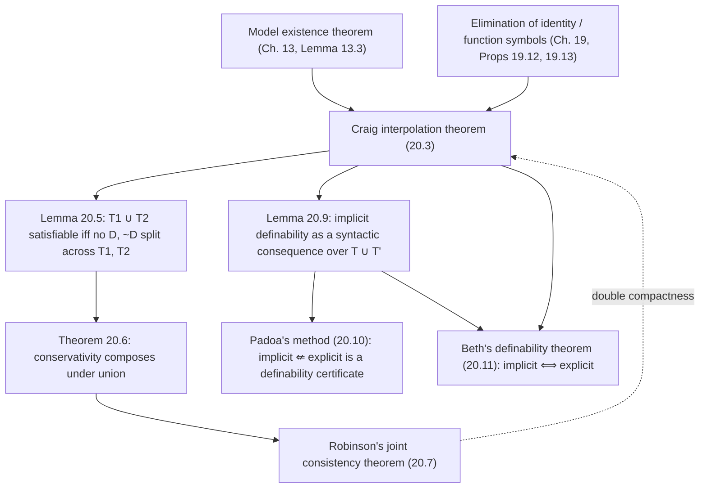

# Interpolation and Definability

[[book-guidelines|↩ Back to guidelines]]

## Why this chapter exists

Every result so far in the book has been about a single theory or a single implication: does $A$ imply $C$? Is $T$ satisfiable? Chapter 20 asks a sharper question, one about the *interface* between two languages: if $A$ (written in some vocabulary) implies $C$ (written in some other, possibly overlapping vocabulary), does the *reason* $A$ implies $C$ have to mention anything outside what $A$ and $C$ already share? Or can the proof always be laundered so it only talks about common ground?

This sounds like a curiosity, but it's really a question about modularity. If you've ever composed two components with a shared interface — two microservices, two Rust crates linked through a trait, two type-checked modules — you've implicitly assumed something like this: that whatever guarantee module $A$ hands to module $C$ can be phrased *purely in terms of the shared interface*, without smuggling in private implementation details from either side. The **Craig interpolation theorem** says this assumption is not just convenient but *provably always available* in first-order logic. That's a remarkable fact about the proof theory of first-order logic — most logics do not have it (interpolation famously fails or is much harder to establish for many extensions), and its presence is one of first-order logic's structural virtues, on a par with compactness.

**What breaks without it:** without interpolation, "shared vocabulary" reasoning has no guaranteed bridge — you could have $A \Rightarrow C$ true, yet be structurally unable to explain *why* without invoking symbols private to one side, which would make compositional reasoning about theories (can I combine this axiom set with that one? does my module's public contract actually pin down its private implementation?) something you'd have to check case by case rather than something logic hands you for free.

## 20.1 The interpolation theorem itself

### The easy warm-up: interpolating on constants

Boolos, Burgess & Jeffrey start with a genuinely easy case (Proposition 20.1) to build intuition before the hard theorem: if $A$ implies $C$, there's a sentence $B$ that $A$ implies, that implies $C$, and that uses only *constants* shared by $A$ and $C$.

The proof is a clean piece of quantifier bookkeeping. Suppose $A$ has constants $a_1, \dots, a_n$ not appearing in $C$. Replace each $a_i$ in $A$ by a fresh variable $v_i$, giving $A^*$. Since $A \to C$ is valid and the $a_i$ don't occur in $C$, so is $\forall v_1 \cdots \forall v_n (A^* \to C)$ — and from that, $\exists v_1 \cdots \exists v_n A^* \to C$. Take $B = \exists v_1 \cdots \exists v_n A^*$: $A$ implies it (it's a weaker existential generalization of $A$), and it implies $C$. All the "private" constants of $A$ have been existentially quantified away.

**What breaks without this step:** this proof is genuinely constructive — you can *compute* $B$ from $A$ and $C$. That constructiveness disappears the moment you ask the same question about predicates and function symbols, which is exactly why the book flags a natural but false generalization next.

### Where the easy argument fails

You might hope the same trick extends to predicates and function symbols — existentially generalize away anything private, done. Example 20.2 kills this hope: let $A$ be $\exists x\, Fx \mathbin{\&} \exists x\, {\sim}Fx$ (the domain has at least two elements) and $C$ be $\exists x \exists y\, x = y$ (the domain is nonempty). $A$ implies $C$, but $A$ and $C$ share *no* nonlogical predicates at all — so there is no candidate interpolant built only from shared nonlogical symbols, full stop. The obstruction is identity: $C$'s content is really about cardinality, expressible only via $=$, and $=$ isn't a "nonlogical" symbol in the relevant sense — it's part of the logical vocabulary every language is allowed for free.

This is why the theorem's official statement (20.3) is phrased carefully: *no nonlogical symbols except those common to $A$ and $C$* — identity is exempted, always available to the interpolant even if it appears in neither $A$ nor $C$. Example 20.4 shows this exemption is load-bearing, not cosmetic: if $A$ is unsatisfiable (e.g. $\exists x(Fx \mathbin{\&} {\sim}Fx)$), then $\exists x\, x{=}x$ (a tautology) is always a valid interpolant for *any* $C$ — but if $A$ and $C$ share no predicates, that's the *only* kind of sentence available, and it has to be built from identity, not from nonlogical symbols the two don't share.

### The theorem and its two-stage proof

> **20.3 Craig interpolation theorem.** If $A$ implies $C$, there is a sentence $B$ — an *interpolant* — such that $A$ implies $B$, $B$ implies $C$, and $B$ contains no nonlogical symbols except ones common to $A$ and $C$.

The proof runs in two stages, mirroring a pattern the book has used before (most visibly in Chapter 19's elimination results): prove the clean case first, then reduce the messy case to it.

**Stage 1 — no identity, no function symbols.** This is where the real work happens, and it's a direct descendant of the model existence theorem (Lemma 13.3) used to prove compactness in Chapter 13. The proof is by contradiction: assume $A$ implies $C$ but *no* interpolant exists, and derive that $\{A, {\sim}C\}$ is nonetheless satisfiable — contradicting $A \Rightarrow C$.

To do this, the book builds a custom "witness set" $S$ tailored to interpolation, in the same shape as the sets used for the model existence theorem, but keyed to a notion of **left formulas** (built only from predicates in $A$) and **right formulas** (built only from predicates in $C$). A sentence $B$ **bars** a satisfiable pair $\Gamma_L, \Gamma_R$ if $B$ is both a left and a right sentence, $\Gamma_L$ implies $B$, and $\Gamma_R$ implies $\sim B$ — i.e. $B$ is exactly the kind of sentence that *would* serve as a local interpolant between those two sets, if only it existed. "No interpolant for $A, {\sim}C$" becomes "no sentence bars $\{A\}, \{{\sim}C\}$." $S$ is then defined as the collection of sets $\Gamma$ that admit an **unbarred division** $\Gamma = \Gamma_L \cup \Gamma_R$: a split into a satisfiable left part and a satisfiable right part with no sentence barring the two. Checking properties (S0)–(S6) for $S$ (the same closure conditions the model existence theorem needs — closure under subsets, no simultaneous $D$/$\sim D$, and clauses for double negation, disjunction, and the quantifiers) is mostly routine, with the disjunction clause (S3) doing the interesting case-split: if a disjunction $(D_1 \lor D_2)$ sits in the left part and *both* disjuncts, added individually, would be barred by sentences $B_1, B_2$, then $B_1 \lor B_2$ itself bars the original pair — contradiction. Since $\{A, {\sim}C\}$ trivially admits the unbarred division $\{A\}, \{{\sim}C\}$ (there's no interpolant to bar them, by assumption), $\{A, {\sim}C\} \in S$, so by the model existence theorem it's satisfiable — contradicting $A \Rightarrow C$. That contradiction forces an interpolant to exist after all.

**Stage 2 — reducing identity and function symbols to Stage 1.** This is where Chapter 19's elimination machinery pays off directly. Introduce a fresh predicate $\equiv$ standing in for identity, and let $A^*, C^*$ be $A, C$ with every $=$ replaced by $\equiv$. Let $E_L, E_R$ be the equality and congruence axioms (for $\equiv$) restricted to the predicates of $A$ and $C$ respectively. Proposition 19.13 tells you $E_L \mathbin{\&} E_R \mathbin{\&} A^* \mathbin{\&} {\sim}C^*$ is unsatisfiable whenever $A \Rightarrow C$ is — i.e., $E_L \mathbin{\&} A^*$ implies $E_R \to C^*$, a claim entirely free of identity, to which Stage 1 applies. That gives an identity-free interpolant $B^*$, and replacing $\equiv$ back by $=$ turns $B^*$ into a genuine interpolant $B$ for $A$ and $C$. Function symbols get the same treatment via Proposition 19.12's elimination results. The pattern — prove it in a stripped-down fragment, then use a translation to recover the full result — is the same one you saw powering Chapter 19, now reused rather than re-derived.

**Grounding — interpolation as an interface contract (Rust).** The cleanest software analogue is a module boundary. Think of $A$ as the invariants a producer module guarantees and $C$ as what a consumer module needs; the *shared vocabulary* is the public trait/interface between them:

```rust
// A: what the producer establishes (private state included)
// C: what the consumer requires (its own private state included)
// The interpolant B is the minimal *public* contract — expressible
// purely in terms of the shared trait — that mediates between them.

trait Ordered {
    fn cmp(&self, other: &Self) -> std::cmp::Ordering;
}

// Producer's private guarantee A (mentions internal invariant `sorted_by_key`)
struct SortedVec<T: Ordered> { data: Vec<T> /* invariant: data is sorted */ }

// Consumer's private requirement C (mentions internal invariant `binary_search_ok`)
fn lookup<T: Ordered>(v: &SortedVec<T>, key: &T) -> Option<usize> {
    // requires: v.data is sorted, in order to binary-search correctly
    todo!()
}

// The interpolant B is exactly: "data is sorted according to Ordered::cmp" —
// stated only in terms of the shared trait `Ordered`, nothing about how
// SortedVec constructs its invariant or how lookup implements search.
```

Interpolation is the *theorem* that such a purely-interface-level $B$ always exists whenever the implication holds at all — you never *need* to leak private details across the boundary to make the proof go through. A type checker relying on trait bounds is implicitly relying on interpolation-shaped reasoning every time it lets two independently-compiled crates interoperate through a shared trait without either seeing the other's internals.

## 20.2 Robinson's joint consistency theorem and conservative extensions

### From sentences to theories

Sections 20.2 and 20.3 both apply Craig's theorem to *theories* rather than single sentences — recall the book's broad sense of "theory": a deductively closed set of sentences (closed under logical consequence), with "theorem of $T$" just meaning "member of $T$."

**Lemma 20.5** is the pivot: $T_1 \cup T_2$ is satisfiable iff there's no sentence in $T_1$ whose negation is in $T_2$. The "only if" direction is immediate (a sentence and its negation can't both be true in one model). The "if" direction is where interpolation earns its keep: suppose $T_1 \cup T_2$ is unsatisfiable. By compactness, some finite subset is unsatisfiable; split it into its $T_1$-members $F_1, \dots, F_m$ and $T_2$-members $G_1, \dots, G_n$. Let $A = F_1 \mathbin{\&} \cdots \mathbin{\&} F_m$ and $C = {\sim}(G_1 \mathbin{\&} \cdots \mathbin{\&} G_n)$; since $A \Rightarrow C$, Craig's theorem hands you an interpolant $B$ built only from symbols common to $T_1$'s and $T_2$'s languages. $B \in T_1$ (since $T_1 \Rightarrow B$ and $T_1$ is deductively closed) and $\sim B \in T_2$ (symmetric argument) — exactly the "sentence in $T_1$ whose negation is in $T_2$" the lemma needed.

### Conservative extensions

A theory $T'$ **extends** $T$ if $T' \supseteq T$; the extension is **conservative** if every theorem of $T'$ that's stated purely in $T$'s language is already a theorem of $T$ — i.e. $T'$ proves nothing new about $T$'s own vocabulary, even though it may prove plenty about the extended vocabulary. This is precisely the "no spooky action at a distance" property you want when adding new machinery to a theory: extending your axioms with new symbols and facts shouldn't retroactively let you prove new things purely about the old symbols.

**Theorem 20.6** shows conservativity composes: if $L_0 = L_1 \cap L_2$, and $T_1, T_2$ are conservative extensions of a common base $T_0$ (each in its own language $L_1$, $L_2$), then their union's deductive closure $T_3$ (in $L_1 \cup L_2$) is *also* a conservative extension of $T_0$. The proof is another Craig-interpolation argument: given $B \in L_0$ a theorem of $T_3$, use compactness to reduce to a finite unsatisfiability fact, interpolate to extract a sentence $D$ in $L_0$ mediating between $T_1$'s and $T_2$'s roles, and use conservativity of each $T_i$ over $T_0$ to pull $D$ and $({\sim}B \to {\sim}D)$ both back into $T_0$ — from which $B \in T_0$ follows by ordinary propositional reasoning.

### Robinson's joint consistency theorem

> **20.7 Corollary (Robinson's joint consistency theorem).** If $T_0$ is *complete*, and $T_1, T_2$ are satisfiable extensions of $T_0$ (with $L_0 = L_1 \cap L_2$), then $T_1 \cup T_2$ is satisfiable.

The proof chains the two previous results: a satisfiable extension of a *complete* theory is automatically conservative (completeness means $T_0$ already decides every sentence of $L_0$, so $T_1$ can't consistently prove anything new about $L_0$ without contradicting $T_0$), and a conservative extension of a satisfiable theory is satisfiable. Feed that into Theorem 20.6 and Lemma 20.5 and $T_1 \cup T_2$'s satisfiability falls out.

**Why completeness of $T_0$ is essential (Example 20.8):** let $L_0 = L_1 = L_2 = \{P, Q\}$, $T_1$ the consequences of $\{\forall x\, Px, \forall x\, Qx\}$, $T_2$ the consequences of $\{\forall x\, Px, \forall x\, {\sim}Qx\}$, and $T_0$ the consequences of $\forall x\, Px$ alone. Both $T_1$ and $T_2$ are satisfiable extensions of $T_0$, but $T_1 \cup T_2$ is not (it entails both $\forall x\, Qx$ and $\forall x\, {\sim}Qx$) — because $T_0$ doesn't decide $\forall x\, Qx$ either way, so nothing stops $T_1$ and $T_2$ from disagreeing about it while each individually staying consistent with $T_0$. This is exactly the failure mode joint consistency is designed to rule out, and it's why the theorem needs $T_0$ complete rather than merely satisfiable.

**A nice reversal — deriving Craig from Robinson.** The book closes 20.2 by sketching a "double compactness" argument that runs the dependency the *other* way: given Robinson's theorem as a black box, you can reconstruct Craig interpolation from it, by building a complete theory $T_0$ from a hypothetical countermodel to interpolation and deriving a contradiction. This is a useful sanity check that the two results really are equivalent in strength, not just that one happens to imply the other.

**Grounding — conservative extensions as backward-compatible API growth (Rust / Lean).** "Conservative extension" is precisely what a well-behaved library upgrade should be: adding new public symbols and new axioms/impls about them without *changing the provable facts* about the old, already-shipped interface.

```rust
// v1.0 of a crate: T0, language L0 = {area, perimeter}
trait Shape {
    fn area(&self) -> f64;
    fn perimeter(&self) -> f64;
}

// v1.1 conservatively extends it: T1, language L1 = L0 ∪ {centroid}
// Adding `centroid` must prove nothing NEW about area/perimeter alone —
// old client code reasoning purely about area/perimeter still sees
// exactly the same provable facts as before.
trait ShapeWithCentroid: Shape {
    fn centroid(&self) -> (f64, f64);
}
```

In Lean terms, this is the difference between a `def`/`theorem` addition that's a genuinely new, independent declaration (conservative — it can't be used to `rfl`-prove something new about pre-existing definitions unless you explicitly unfold into it) versus one that changes an *existing* definition's reducibility behavior, which can silently break `isDefEq` checks and proofs that used to close by unfolding the old definition. Kernel-level conservativity — "adding this axiom/definition doesn't let old goals get proved in new ways" — is exactly the property a trustworthy incremental elaborator needs when you add new declarations to a context without invalidating previously-checked terms.

## 20.3 Beth's definability theorem: implicit vs. explicit definability

### Two ways a theory can "define" a symbol

Section 20.3 is about a genuinely conceptual question: given a theory $T$ in language $L$, and a symbol $\alpha \in L$ that you want to think of as "defined in terms of" other symbols $\beta_1, \dots, \beta_n \in L$, what does that even mean, precisely? The book gives two competing explications and then proves — this is Beth's theorem — that they coincide.

**Explicit definability** is syntactic: $\alpha$ is explicitly definable from the $\beta_i$ in $T$ if $T$ *contains, as a theorem*, a biconditional definition. For a $(k{+}1)$-place predicate $\alpha$, that's
$$\forall x_0 \cdots \forall x_k\, \big(\alpha(x_0,\dots,x_k) \leftrightarrow B(x_0,\dots,x_k)\big),$$
where $B$'s only nonlogical symbols are among the $\beta_i$ (for a function symbol, the analogous form uses $x_0 = \alpha(x_1,\dots,x_k) \leftrightarrow B(\dots)$). This is exactly "you can write down $\alpha$'s meaning as a formula purely in the other symbols, and the theory proves that formula is equivalent to $\alpha$."

**Implicit definability** is semantic, and considerably subtler: $\alpha$ is implicitly definable from the $\beta_i$ in $T$ if *any two models of $T$ that agree on the domain and on the $\beta_i$ must also agree on $\alpha$*. Nothing here says you can write down a formula for $\alpha$ — only that once the domain and the $\beta_i$ are pinned down, $\alpha$'s interpretation is *forced*, with no remaining freedom, for any model satisfying $T$.

Explicit definability obviously implies implicit definability (if $\alpha$'s value is literally computed from the $\beta_i$ by a fixed formula, any two models agreeing on the $\beta_i$ will compute the same $\alpha$). The nontrivial direction is the converse — and it's not obvious *at all* that "no residual freedom in $\alpha$'s value" should imply "there's an explicit formula for it." This is the implicit-vs-explicit gap the theorem bridges, and it's genuinely surprising that it closes.

### A syntactic handle on implicit definability

To make implicit definability provable-with, the book introduces a "primed copy" trick: form a new language $L'$ by replacing every nonlogical symbol $\gamma \ne \beta_i$ with a fresh symbol $\gamma'$ of the same arity/kind (crucially, the $\beta_i$ themselves are *not* primed — they're the shared, pinned-down part). Given two models $M, N$ of $T$ agreeing on domain and the $\beta_i$, glue them into $M^+N$: a model of $L \cup L'$ that interprets $L$-symbols the way $M$ does and $L'$-symbols (via the priming correspondence) the way $N$ does. $M^+N \models T \cup T'$ automatically. Conversely, any model of $T \cup T'$ decomposes back into such a pair $M, N$.

**Lemma 20.9** cashes this out: $\alpha$ is implicitly definable from the $\beta_i$ in $T$ iff
$$\forall x_0 \cdots \forall x_k\, \big(\text{—}\alpha, x_0,\dots,x_k\text{—} \leftrightarrow \text{—}\alpha', x_0,\dots,x_k\text{—}\big) \tag{1}$$
is a consequence of $T \cup T'$. Intuitively: "$\alpha$ is forced" becomes "the theory, doubled with a primed copy of everything except the shared $\beta_i$, proves that the two copies of $\alpha$ coincide." This turns a quantify-over-all-models semantic claim into a single provability claim — a move you'll recognize as the same style as the security-theorem correspondences elsewhere in the book (turning "true in every model" into "provable"), except now applied one level up, to a claim about a *relationship between models* rather than a claim about a single sentence's truth.

### Padoa's method and the theorem

One direction is now easy: **Padoa's method (20.10)** says if $\alpha$ is *not* implicitly definable, it's *not* explicitly definable either — proved by contraposition, essentially unwinding the "explicit $\Rightarrow$ implicit" observation above via Lemma 20.9's syntactic form. (This is historically useful as a technique for *proving non-definability*: exhibit two models agreeing on the $\beta_i$ but disagreeing on $\alpha$, and you've shown $\alpha$ can't be explicitly defined from the $\beta_i$, full stop — no need to search over all possible defining formulas.)

> **20.11 Theorem (Beth's definability theorem).** $\alpha$ is implicitly definable from the $\beta_i$ in $T$ iff $\alpha$ is explicitly definable from the $\beta_i$ in $T$.

The "only if" direction is where Craig interpolation gets its second major application in this chapter. Sketch of the argument: implicit definability gives you (1) as a consequence of $T \cup T'$; compactness shrinks this to a *finite* subset $T_0 \cup T_0'$; instantiate the universally quantified variables with fresh constants $c_0, \dots, c_k$ to get, from $A = \bigwedge T_0$ and $A' = \bigwedge T_0'$, that
$$A \mathbin{\&} \text{—}\alpha, \vec c\text{—} \quad \text{implies} \quad A' \to \text{—}\alpha', \vec c\text{—}.$$
Apply Craig interpolation to *this* implication: the interpolant $B(\vec c)$ can only mention symbols common to both sides — which, by construction, means only the fresh constants $\vec c$ and the shared $\beta_i$ (nothing primed, nothing $\alpha$-specific survives, because $\alpha$ and $\alpha'$ sit on opposite sides and share no other private vocabulary). Unwinding the two implications $A \mathbin{\&} \text{—}\alpha,\vec c\text{—} \Rightarrow B(\vec c)$ and $B(\vec c) \Rightarrow A' \to \text{—}\alpha',\vec c\text{—}$ back through $T$ and $T'$ (replacing $c_i$ back with universally quantified $x_i$, and folding the primed sentence back into an unprimed one) produces exactly
$$\forall x_0 \cdots \forall x_k\, \big(\text{—}\alpha,\vec x\text{—} \to B(\vec x)\big) \quad\text{and}\quad \forall x_0 \cdots \forall x_k\, \big(B(\vec x) \to \text{—}\alpha,\vec x\text{—}\big)$$
as theorems of $T$ — which conjoin into the explicit definition of $\alpha$ from the $\beta_i$ that was wanted. The interpolant $B$, built purely from symbols shared across the split, *is* the explicit definition — Craig interpolation doesn't just help prove Beth's theorem, it hands you the defining formula's vocabulary constraint directly.

**Grounding — implicit vs. explicit definability as spec vs. algorithm (Rust / Lean).** This distinction maps almost exactly onto a distinction every verification-minded engineer already has: a *specification* that pins down a unique value implicitly (e.g. "return value is the least $y$ such that $y^2 \ge x$") versus an *explicit, closed-form implementation* of it.

```rust
// Implicit definition: any two implementations satisfying the same
// contract (agreeing on the "shared" primitives: `<=`, `*`) must agree
// on the result — but this alone does not hand you code.
trait IntSqrt {
    // spec (implicit): result*result <= self < (result+1)*(result+1)
    fn isqrt(&self) -> Self;
}

// Explicit definition: a formula/algorithm computed purely from the
// shared vocabulary (arithmetic operations), provably equivalent to
// the implicit spec.
fn isqrt_explicit(n: u64) -> u64 {
    (n as f64).sqrt() as u64 // (modulo rounding-correctness proof obligations)
}
```

Beth's theorem is the (perhaps startling) claim that *whenever* a first-order theory's axioms implicitly pin down a symbol uniquely, there is *guaranteed* to be an explicit formula for it — a "spec implies algorithm exists" theorem, though notably a non-constructive one: the proof (via compactness + interpolation) proves existence without exhibiting the formula. In Lean's world, this is the gap between an implicit characterization via `Classical.choice`/`Exists.elim` over a uniquely-satisfying witness, and an actual computable `def`. Beth's theorem says that gap always *can* be closed in principle for first-order-axiomatizable properties — but, just like the book's proof, it doesn't tell you how to close it; Padoa's method, by contrast, gives you a fully constructive *negative* certificate (two witnessing models) whenever the gap can't be closed at all.

## Structural summary



Everything in this chapter is downstream of one theorem (Craig interpolation) and two earlier results it leans on: the model existence theorem that drove compactness in Chapter 13, and the elimination-of-identity/function-symbols machinery from Chapter 19. From Craig's theorem, two independent corollaries fan out — one about when theories can be safely unioned (Robinson), one about when semantic uniqueness forces syntactic definability (Beth) — and the chapter notes, almost as an aside, that the dependency could run backward: Robinson's theorem is strong enough to reconstruct Craig's.

**[[Arithmetization-of-Syntax-and-Representability#Where this leads|Where this leads]]:** the elimination results this chapter reuses (Ch. 19) and the interpolation theorem itself set up the next chapter's finer-grained fragment analysis (monadic and dyadic logic), and the general theme — what can be said using only a restricted vocabulary — recurs whenever the book later asks what a limited fragment of a language can or cannot express. This topic is fairly self-contained model theory and doesn't bear directly on the Rust verifier or Lean-style elaborator projects beyond the conceptual echoes noted inline above (interface contracts, conservative extension, spec-vs-algorithm); it's worth knowing this result exists rather than expecting to build on it directly.
