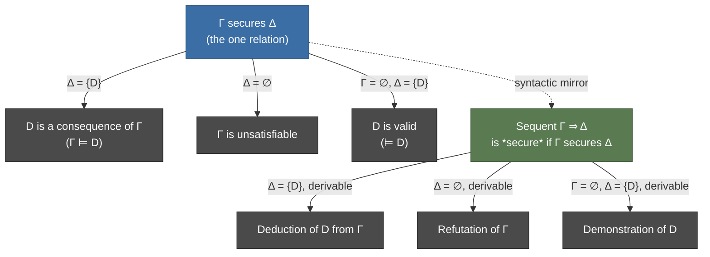

# Metalogical Notions

[[book-guidelines|↩ Back to guidelines]]

## Why this layer exists

Chapter 10 §10.1 gave you a recursive definition of truth: $M \models F$, a relation between an interpretation $M$ and a sentence $F$, built up clause by clause from atomic sentences through negation, conjunction, disjunction, and the objectual account of the quantifiers. That machinery answers a question about *one* sentence in *one* interpretation: is this true, here?

But almost nothing you actually want to know about a logical system is a question about one sentence in one interpretation. "Does this set of axioms entail this theorem?" "Is this formula a tautology?" "Is this specification even satisfiable, or did I write down a contradiction by accident?" Every one of these questions ranges *over all interpretations at once*. That's a different kind of claim — not "$F$ is true here" but "there is no way to make this go wrong, no matter which model you plug in."

This is exactly the gap between a type checker's two questions. A checker can ask "does this term have this type, in this context?" — a local, single-derivation question, analogous to $M \models F$. But "is this specification satisfiable at all" or "does this set of typing assumptions entail this conclusion under every consistent extension" is a universally-quantified claim over the whole space of models/contexts. §10.2 is where Boolos, Burgess & Jeffrey name that second kind of question and give it vocabulary: **implication (consequence)**, **validity**, **(un)satisfiability**, and **logical equivalence**. Chapter 14 §14.1 then shows — and this is the article's payoff — that these four notions aren't four independent things to memorize. They're one relation, **security**, in four different disguises.

**What breaks without this vocabulary:** without a crisp definition of "consequence," you can't state soundness or completeness precisely — both are theorems *about* the relationship between a syntactic notion (derivability, which Ch. 14 defines) and a semantic notion (which is what this chapter defines). If "implies" stays a fuzzy intuition, "every derivable sequent is secure" (soundness) and "every secure sequent is derivable" (completeness) are unstatable. This chapter is the semantic half of that pairing — the half a proof checker's *specification* is written against, even though the checker itself only ever manipulates syntax.

## Implication and logical consequence

The book's definition (p. 119), verbatim in spirit:

> A set of sentences $\Gamma$ **implies** or has as a **consequence** the sentence $D$ if there is no interpretation that makes every sentence in $\Gamma$ true but makes $D$ false.

Equivalently: every interpretation that makes $\Gamma$ true makes $D$ true. When $\Gamma = \{C\}$ is a singleton, the book uses "$C$ implies $D$" interchangeably with "$\Gamma$ implies $D$."

Two things worth flagging that the book itself flags:

1. **This is a claim about the absence of counterexamples, not a claim about a search finding a proof.** It's stated purely semantically, with no syntax, no rules, no "steps." That's deliberate — Chapter 14 will later ask you to *earn* the right to search for proofs, by proving soundness and completeness connect this semantic definition to a syntactic one.
2. **The parenthetical fine print about undefined denotations** (p. 119): if $D$ mentions a nonlogical symbol not in $\Gamma$, an interpretation might make $\Gamma$ true while leaving that symbol's denotation (and hence $D$'s truth value) unassigned. The book's fix is a standing convention: "every interpretation" tacitly means "every interpretation that assigns denotations to all the nonlogical symbols in whatever sentences we're considering." This is the same housekeeping problem a type checker has with free variables not in scope — you don't get to ask "is this true" about a symbol nobody bound.

**What breaks without this:** if you drop the "no interpretation" universal quantifier and instead define implication as "the interpretations I happen to have tried all agree," you've built a notion that depends on which test cases you ran — exactly the unsoundness a property-based tester lives with and a proof system cannot.

### Worked implication principles (Example 10.3)

The book gives a batch of concrete implications, each following in one line from a single truth clause:

- $\sim\!\sim B$ implies $B$ (double negation, from the negation clause)
- $B$ implies $(B \lor C)$, and $C$ implies $(B \lor C)$ (from the disjunction clause)
- $\sim(B \lor C)$ implies $\sim B$ and implies $\sim C$ (De Morgan, contrapositive of the above)
- $B(t)$ implies $\exists x\, B(x)$ (from the extensionality lemma plus the objectual quantifier clause: if $B(t)$ is true, the element $t$ denotes satisfies $B(x)$, so something does)
- $\sim\exists x\, B(x)$ implies $\sim B(t)$ (contrapositive of the previous)
- $s = t$ and $B(s)$ jointly imply $B(t)$ (substitution of identicals, from the extensionality lemma)

Each proof is literally "unfold the relevant truth clause and observe the implication is forced." That's worth noticing as a pattern in its own right: **consequence facts about the connectives are, at this level, just consequences of the recursive truth definition** — nothing more exotic is happening yet. The interesting machinery (Chapter 14's sequent calculus) is what turns these one-line semantic observations into a *generative, syntactic* proof system.

### Grounding: consequence as "no counterexample," in Lean

Since this is proof-theoretic material, Lean is the primary grounding language here (promoted per the style guide's own rule for proof-theoretic content). The book's semantic consequence $\Gamma \models D$ is, in Lean, almost literally the statement of a lemma whose *type* is universally quantified over all models:

```lean
-- A model assigns meaning to the nonlogical symbols of a fixed language.
structure Interpretation (L : Language) where
  domain   : Type
  denote   : L.Sym → domain  -- schematic; real version dispatches on symbol arity/kind

-- Truth-in-a-model, from §10.1 — the recursively defined M ⊨ F.
def satisfies (M : Interpretation L) (F : Formula L) : Prop := ... -- Ch. 10 §10.1's clauses

-- Consequence: Γ implies D iff every model making Γ true makes D true.
def Implies (Γ : Set (Formula L)) (D : Formula L) : Prop :=
  ∀ M : Interpretation L, (∀ C ∈ Γ, satisfies M C) → satisfies M D

-- 10.3(a): ¬¬B implies B, as an actual theorem about ALL interpretations.
theorem double_neg_implies (B : Formula L) :
    Implies {Formula.not (Formula.not B)} B := by
  intro M h
  -- unfold `satisfies` on the negation clause twice, exactly as the book's proof does
  simp_all [satisfies]
```

The point of writing it this way: `Implies` is a `Prop` universally quantified over the *entire type* `Interpretation L` — an infinite, generally uncountable space (recall Example 10.1's warning about nonenumerable domains). You cannot decide this by enumeration; you can only prove it, the same way Lean's `Implies` above can only be discharged by a genuine proof term, never by testing finitely many `M`s. This is precisely why Chapter 14 needs a *syntactic* stand-in (derivability) that a machine can actually search for — semantic consequence, as defined here, is not itself a decision procedure.

## Validity and satisfiability

Two more definitions, immediate specializations of the consequence idea (p. 120):

> A sentence $D$ is **valid** if no interpretation makes $D$ false.
>
> A set of sentences $\Gamma$ is **unsatisfiable** if no interpretation makes $\Gamma$ true (and **satisfiable** if some interpretation does).

The book proves these aren't new primitives but degenerate cases of consequence, by chasing the quantifiers:

- If $D$ is valid, then *a fortiori* no interpretation makes $\Gamma$ true and $D$ false, for *any* $\Gamma$ — so $\Gamma$ implies $D$ for every $\Gamma$, in particular the empty set. Conversely, if every $\Gamma$ implies $D$, then since every interpretation makes *some* set of sentences true, no interpretation can falsify $D$ — so $D$ is valid. **Validity is "implied by the empty set of premises."**
- Symmetrically, if $\Gamma$ is unsatisfiable, no interpretation makes $\Gamma$ true and $D$ false for *any* $D$ — so $\Gamma$ implies every $D$. Conversely if $\Gamma$ implies every $D$, no interpretation can make $\Gamma$ true (else it would have to make some false $D$ true too). **Unsatisfiability is "implying everything."** This is exactly the classical *ex falso quodlibet* / explosion principle, arrived at semantically rather than as an inference rule.

**What breaks without distinguishing validity from mere truth:** "true in the standard model of arithmetic" and "valid" are wildly different claims — $0 = 0$ is valid (true in *every* interpretation, because it follows from the identity clause alone, no domain facts needed), while "there are infinitely many primes" is true in the standard interpretation but not valid (it's not even expressible as valid/invalid without fixing what "prime" and "successor" denote — validity only makes sense for sentences whose truth doesn't depend on a chosen domain). Conflating "valid" with "true of the model I have in mind" is the single most common category error a newcomer to logic makes, and it's exactly the error a type-checker analog would make by confusing "well-typed under this particular environment" with "well-typed under every possible instantiation of its type parameters" — i.e., confusing a monomorphic fact with a parametricity/genericity guarantee.

### Grounding: validity and satisfiability as decision problems, in Rust

Where Lean is the right tool for *stating* these as universally-quantified propositions, Rust is the right tool for the part of the story that's actually decidable in restricted settings — e.g., propositional (not first-order) validity checking, which is what a SAT/SMT-adjacent verifier front-end actually runs:

```rust
/// A finite propositional model: which atoms are true.
type Model = std::collections::HashSet<String>;

fn eval(formula: &Formula, model: &Model) -> bool {
    match formula {
        Formula::Atom(name) => model.contains(name),
        Formula::Not(f) => !eval(f, model),
        Formula::And(f, g) => eval(f, model) && eval(g, model),
        Formula::Or(f, g) => eval(f, model) || eval(g, model),
    }
}

/// D is valid (propositional case) iff no model makes it false.
/// Only decidable because the propositional case has finitely many
/// atoms and hence finitely many models to enumerate exhaustively —
/// first-order validity over an infinite domain has no such luxury.
fn is_valid(formula: &Formula, atoms: &[String]) -> bool {
    all_models(atoms).iter().all(|m| eval(formula, m))
}

/// Gamma is unsatisfiable iff no model makes every sentence in it true.
fn is_unsatisfiable(gamma: &[Formula], atoms: &[String]) -> bool {
    all_models(atoms).iter().all(|m| gamma.iter().any(|f| !eval(f, m)))
}
```

The `all_models` enumeration is exactly what makes propositional validity checking decidable and first-order validity checking (Chapter 10's actual subject) merely *semidecidable* — Chapter 14 makes this precise: there's a sound and complete proof procedure, so if $\Gamma$ implies $D$ you'll eventually find a derivation, but if it doesn't, exhaustive search never terminates and tells you so. Your Rust verifier's constraint solver lives on the "propositional/decidable fragment" side of this line; the moment you add unbounded quantification over an infinite domain (dependent types, universally quantified preconditions), you're back on the semidecidable side, and "no interpretation makes $D$ false" stops being something `all_models` can check by brute force.

## Security as a unifying notion

This is the payoff the book has been setting up, and it doesn't arrive until Chapter 14 §14.1 — after the sequent calculus's motivation, but conceptually it belongs right here, cleaning up loose threads from §10.2.

The book's observation (p. 167): consequence, unsatisfiability, and validity all *look* different — one relates a set to a sentence, one is a property of a single set, one is a property of a single sentence — but they're the same shape with degenerate boundary cases. Define:

> One set of sentences $\Gamma$ **secures** another set of sentences $\Delta$ if every interpretation that makes all sentences in $\Gamma$ true makes some sentence in $\Delta$ true.

Read $\Gamma$ as premises taken **jointly** (conjunctively) and $\Delta$ as conclusions taken **alternatively** (disjunctively) — for finite sets $\Gamma = \{C_1,\ldots,C_m\}$, $\Delta = \{D_1,\ldots,D_n\}$, security of $\Gamma$ over $\Delta$ says exactly that every interpretation making $C_1 \land \cdots \land C_m$ true makes $D_1 \lor \cdots \lor D_n$ true. Two boundary conventions make the unification work:

- A singleton set $\{D\}$ being "made true" collapses to $D$ being made true — no surprise there.
- An **empty** set of sentences being "made true" (as a $\Gamma$) is *vacuously* true (there's no sentence to falsify the claim); an empty set being made true (as a $\Delta$'s target) is *never* satisfied (there's no disjunct available to be true). This asymmetry between "$\emptyset$ on the left" and "$\emptyset$ on the right" is exactly what makes the unification below click into place — it's the same left/right asymmetry a sequent calculus's $\Gamma \Rightarrow \Delta$ notation is built around.

With those conventions, Table 14-1 (p. 168) collapses all three §10.2 notions into one:

| Notion | Restated as security |
|---|---|
| $D$ is a consequence of $\Gamma$ | $\Gamma$ secures $\{D\}$ |
| $\Gamma$ is unsatisfiable | $\Gamma$ secures $\emptyset$ |
| $D$ is valid | $\emptyset$ secures $\{D\}$ |

Check each against the definitions you already have: "$\Gamma$ secures $\{D\}$" unfolds to "every interpretation making $\Gamma$ true makes some sentence of $\{D\}$ true," i.e. makes $D$ true — that's just consequence. "$\Gamma$ secures $\emptyset$" unfolds to "every interpretation making $\Gamma$ true makes some sentence of $\emptyset$ true" — impossible unless no interpretation makes $\Gamma$ true at all, i.e. $\Gamma$ is unsatisfiable. "$\emptyset$ secures $\{D\}$" unfolds to "every interpretation (vacuously making $\emptyset$ true) makes $D$ true" — validity.

This is the entire reason Chapter 14 introduces the **sequent** $\Gamma \Rightarrow \Delta$ as its basic syntactic object (a pair of finite sets of sentences either side of $\Rightarrow$), and calls a sequent **secure** exactly when its left side secures its right side. Once you have one relation, you get one soundness theorem and one completeness theorem instead of three separate pairs of theorems:

- **Soundness** (Thm 14.1): every *derivable* sequent is *secure*.
- **Completeness** (Thm 14.2, Gödel): every *secure* sequent is *derivable*.

...and each of deduction, refutation, and demonstration (Table 14-2) is recovered as a special-case *derivation* of a security instance:

| Syntactic object | Is a derivation of |
|---|---|
| Deduction of $D$ from $\Gamma$ | $\Gamma \Rightarrow \{D\}$ |
| Refutation of $\Gamma$ | $\Gamma \Rightarrow \emptyset$ |
| Demonstration of $D$ | $\emptyset \Rightarrow \{D\}$ |

**What breaks without unification:** without security, you'd need to define derivability three separate times — once for "proof of a theorem from premises," once for "proof that a set is contradictory," once for "proof that a formula is a tautology" — and then prove soundness and completeness three separate times, with three separate inductions on derivation structure that are secretly the same induction wearing different hats. Naming the general relation and specializing it is a straightforwardly good engineering move, and it should look familiar: it's the same move as replacing three ad hoc type-checking judgments (`typeof`, `is-well-formed-context`, `is-consistent-signature`) with one general judgment form and boundary cases, or replacing three special-cased evaluators with a single interpreter parameterized over an environment that happens to be empty in the base case.



### Grounding: security as a single Rust trait/enum, one relation instead of three

This is the cleanest place in the whole topic to show the "unify special cases into one judgment" move as code, because the book's own move *is* a data-modeling decision:

```rust
/// A sequent: finite left and right sets of sentences.
/// Security and derivability are both properties of this ONE type —
/// no separate Deduction/Refutation/Demonstration structs needed.
struct Sequent {
    lhs: Vec<Formula>, // Γ — taken conjunctively
    rhs: Vec<Formula>, // Δ — taken disjunctively
}

impl Sequent {
    /// Convenience constructors recovering the three special cases,
    /// mirroring Table 14-2 exactly.
    fn deduction(gamma: Vec<Formula>, d: Formula) -> Sequent {
        Sequent { lhs: gamma, rhs: vec![d] }
    }
    fn refutation(gamma: Vec<Formula>) -> Sequent {
        Sequent { lhs: gamma, rhs: vec![] }
    }
    fn demonstration(d: Formula) -> Sequent {
        Sequent { lhs: vec![], rhs: vec![d] }
    }
}

/// One soundness check, one completeness search — not three.
/// A real verifier's proof-search core is a function of THIS type,
/// and every user-facing "prove this theorem" / "check this is
/// unsatisfiable" / "confirm this is a tautology" request compiles
/// down to constructing the right Sequent and calling the same solver.
fn derive(goal: &Sequent) -> Option<Derivation> { /* Ch. 14's (R0)-(R9) rules */ todo!() }
```

If you're building a Hoare-triple checker, this is not a metaphor — it's the literal shape you want. A verification condition is naturally a sequent: your accumulated context/assumptions on the left, your proof obligation(s) on the right. "Is this program correct" (a deduction), "is this precondition contradictory" (a refutation, and hence a sign of dead/vacuous code worth warning about), and "is this postcondition a tautology regardless of the precondition" (a demonstration) are three UI-level questions that should all funnel into one `derive(sequent)` core, exactly as the book collapses them into one theorem pair.

## Logical equivalence

The last notion (p. 122), built directly on top of truth:

> Two sentences are **equivalent over an interpretation $M$** if they have the same truth value [in $M$]. Two sentences are **(logically) equivalent** if they are equivalent over *all* interpretations.

For formulas with a free variable, the book routes through the same satisfaction trick §10.1 used to define the quantifiers: $F(x)$ and $G(x)$ are equivalent over $M$ if, extending the language with a fresh constant $c$, the sentences $F(c)$ and $G(c)$ are equivalent over every extension $M^m_c$ of $M$ assigning $c$ some denotation $m$. (The book notes, without belaboring it, that this is equivalent to just checking $F(c)$ and $G(c)$ are equivalent over *every* interpretation directly.)

Two things worth being precise about, both flagged explicitly in the text:

- **Equivalence is strictly finer than "same set of consequences," and it's an equivalence relation** — reflexive, symmetric, transitive (Problem 10.10 asks you to check this, plus that it's a congruence: preserved under $\sim$, under $\&/\lor$, and under substitution into a quantifier). This is exactly what lets you *replace equals with equals* inside a larger formula (Problem 10.11, "substitution of equivalents") — the semantic analogue of a compiler's peephole/equational rewrite pass being sound because the rewrite preserves meaning at every occurrence, not just at top level.
- **The dropped connectives trick relies on this notion.** Recall from §10.1: $(F \& G)$ is true iff $\sim(\sim F \lor \sim G)$ is true, and $\forall xF$ is true iff $\sim\exists x \sim F$ is true. Those *are* logical equivalences — which is precisely why the book can, and later chapters do, treat $\&$ and $\forall$ (or $\lor$ and $\exists$) as unofficial abbreviations without losing anything: nothing expressible with the full connective set becomes inexpressible with the reduced one, because equivalence preserves truth value in every context you could embed the formula in.

**What breaks without distinguishing equivalence from mere co-extensiveness (same truth value here and there, coincidentally):** the book's own closing example (p. 124) is the classic one — "Scott" and "the author of *Waverley*" denote the same person, so $s = t$ holds, and the theory's extensionality lemma (Prop. 10.2) guarantees $B(s)$ and $B(t)$ always agree in truth value for any *extensional* $B$. But "it is known that Scott is Scott" was true while "it is known that the author of *Waverley* is Scott" was false (the pen name concealed the identity) — because "it is known that" is an *intensional*, non-extensional operator, and first-order logic as defined here has no such operator. The book is candid about this being a genuine expressive limitation, not a bug to patch: modal/epistemic operators like "it is known that" live in a separate branch (modal logic, glimpsed only in the book's last chapter) precisely because they violate extensionality, and extensionality is baked into the truth definition from §10.1 onward. If your verifier's specification language ever needs to reason about knowledge, belief, or provability-as-an-operator (rather than provability-as-a-relation, which first-order logic handles fine), you've left the world this chapter builds and need a genuinely different semantics.

### Grounding: equivalence as `iff`-provable, in Lean

```lean
-- Two formulas are logically equivalent iff they agree in every model.
def LogicallyEquivalent (F G : Formula L) : Prop :=
  ∀ M : Interpretation L, satisfies M F ↔ satisfies M G

-- Problem 10.12's characterization: F and G are equivalent iff ∀x(F ↔ G) is valid.
-- This is the bridge from a *relation between two formulas* to a
-- *validity claim about one formula* — exactly the move a checker
-- makes when it reduces "are these two types defeq" to "does this
-- single equality goal typecheck as `rfl` (or close to it)."
theorem equiv_iff_valid (F G : Formula L) :
    LogicallyEquivalent F G ↔ Valid (Formula.iff F G) := by
  constructor
  · intro h M; exact (h M)
  · intro h M; exact h M
```

This is the precise sense in which Boolos–Burgess–Jeffrey's "logical equivalence" *is* what Lean's kernel calls **definitional equality** doing semantic work rather than syntactic work: two terms are `rfl`-equal when the kernel can reduce them to the same normal form (a syntactic/computational notion), while two *sentences* here are logically equivalent when every model agrees on their truth value (a semantic notion) — but Problem 10.12 shows the semantic notion collapses to a single validity check, `⊨ F ↔ G`, the same way `isDefEq` collapses "are these two types the same" to a single decidable(-ish) reduction check. The book is handing you, in embryo, the semantic justification for why a checker is allowed to treat two syntactically different expressions as interchangeable: because no model can tell them apart.

## Where this leads

Everything in this chapter is stated **semantically** — quantifying over all interpretations, with no mention of proof steps, inference rules, or syntax. That's the whole point: it's the *specification* that a proof system has to be checked against, not a proof system itself. Chapter 11 uses these definitions to show the consequence relation is **undecidable** (no algorithm settles "does $\Gamma$ imply $D$" in general) — which is precisely why Chapter 14 doesn't try to build a decision procedure, only a sound-and-complete *search* procedure (semidecidable: it terminates with an answer when $\Gamma$ does imply $D$, and may search forever otherwise).

Chapter 14's sequent calculus is the syntactic mirror of everything defined here: the security relation of this chapter becomes the derivability relation of that one, and soundness/completeness (Theorems 14.1–14.2) are the theorems asserting the mirror is faithful — that "provable" and "true in every model" pick out exactly the same sequents. That's the theorem that licenses treating a proof checker's syntactic verdict ("this derivation is well-formed") as settling a semantic question ("this specification actually holds in every model") — which is the entire reason building a proof checker is a meaningful way to establish truth, rather than an elaborate syntax game. For the standing projects: this chapter is where "well-typed" (a checkable, syntactic, local judgment) and "actually correct with respect to every model of the spec" (a semantic, global, generally undecidable claim) get pulled apart and precisely related — the gap your Rust verifier's soundness argument will need to close, and the gap Lean's own soundness theorem (kernel typechecking implies the term inhabits its type in every model of the theory) closes for you already.
