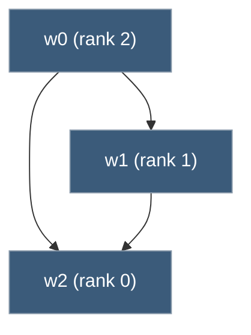

# Modal Logic and the Logic of Provability

[[book-guidelines|↩ Back to guidelines]]

## Why this chapter exists: turning (P1)–(P3) into a calculus you can compute with

[[Gödel's-Second-Incompleteness-Theorem-and-the-Logic-of-Provability|Chapter 18]] isolated three abstract properties — (P1) necessitation, (P2) distribution, (P3) provable $\Sigma_1$-completeness — that any reasonable provability predicate $\mathrm{Prv}_T(x)$ satisfies, and squeezed the second incompleteness theorem, the Henkin sentence, and the nonexistence of a truth predicate out of one proof (Löb's theorem) that only ever touches those three properties. That chapter ends with an open question, which this closing chapter of the book answers explicitly: if (P1)–(P3) are *all* the proof of Löb's theorem needs, what if you stopped writing arithmetic sentences altogether and just reasoned about a symbol $\Box$ satisfying those three properties as *axioms of a logic*, the way you'd reason about $\forall$ or $\to$?

That's modal logic's box $\Box$: an abstract "necessity" operator whose axioms you choose to fit the phenomenon you want it to model. Read as "necessarily," $\Box$ satisfies a fairly weak base system. Read as "provable in $P$," it satisfies a specific, stronger system called $\mathrm{GL}$ (Gödel–Löb) — literally: (P1)–(P3) *are* three of $\mathrm{GL}$'s defining ingredients, and Löb's theorem *is* $\mathrm{GL}$'s characteristic axiom. The payoff for making this abstraction is enormous: once you prove a fact inside $\mathrm{GL}$ — a purely syntactic, finite, decidable calculus with no arithmetic in it at all — you get, for free, via a soundness theorem, a corresponding fact about actual provability in Peano arithmetic $P$. The chapter's centerpiece results (the fixed point theorem, the normal form theorem) are proved *inside* $\mathrm{GL}$ and then "cashed out" as brand-new facts about $P$ — including the previously unknown fact that [[The-Diagonal-Lemma-and-the-Limitative-Theorems#The Gödel sentence|the Gödel sentence]] and the consistency sentence are provably equivalent in $P$.

**What breaks without this abstraction step:** every fact you'd want about self-referential arithmetic sentences would have to be proved from scratch, directly in the arithmetized syntax of $P$, redoing diagonal-lemma bookkeeping every time. $\mathrm{GL}$ is what lets you do that bookkeeping *once*, generically, in a small decidable propositional calculus, and then translate results back mechanically.

## Sentential modal logic: syntax, semantics, and why you need both

### The base language

Modal sentential logic starts from ordinary (nonmodal) sentential logic — sentence letters $p, q, \ldots$, the constant false $\bot$, and the conditional $\to$, with $\sim A$ abbreviating $A \to \bot$, $(A \& B)$ abbreviating $\sim(A \to \sim B)$, and $(A \lor B)$ abbreviating $\sim A \to B$ — and adds exactly one new operator: the box $\Box$, read "necessarily" or "it must be the case that." If $A$ is a sentence, so is $\Box A$. The diamond $\Diamond$ ("possibly") is just notation, not a new primitive: $\Diamond A$ abbreviates $\sim\Box\sim A$ — "not necessarily not $A$."

A modal sentence is a **tautology** if it's a substitution instance (modal sentences for sentence letters) of a valid nonmodal sentence — so $A \lor \sim A$ is a tautology for any modal $A$, exactly as you'd expect. **Tautological consequence** is defined the same way, relative to ordinary sentential implication.

### The system K and its axioms

There's no single "correct" choice of which $\Box$-sentences count as valid — that depends on what you want $\Box$ to *mean*. So the chapter builds a family of systems, starting from the weakest reasonable one. The **minimal system K** has:

- **Axioms**: all tautologies, plus every instance of $\Box(A \to B) \to (\Box A \to \Box B)$ — the **distribution axiom**.
- **Rules**: pass to any tautologous consequence of earlier lines, and **necessitation**: from $A$, infer $\Box A$.

Compare this directly against Chapter 18's contract: K's distribution axiom is exactly (P2), and necessitation is exactly (P1). K is the *minimum you'd need* for a provability predicate to make any sense at all. Four further candidate axioms extend K:

$$
\begin{aligned}
(A1)\quad &\Box A \to A \\
(A2)\quad &A \to \Diamond A \\
(A3)\quad &\Box A \to \Box\Box A \\
(A4)\quad &\Box(\Box A \to A) \to \Box A
\end{aligned}
$$

$(A3)$ is (P3) — positive introspection — read as an axiom rather than a lemma about a specific $\mathrm{Prv}_T$. $(A1)$ says whatever's necessary is actually true — the "factivity" reading of $\Box$, appropriate for *alethic* necessity but, as you'll see, catastrophic if you add it to a system meant to model provability (Chapter 18 already proved (P5), the arithmetical version of $(A1)$, forces inconsistency). $(A4)$ is Löb's axiom in its purely modal form — you'll see in a moment that this is not a coincidence.

**What breaks without choosing among these:** without picking a specific subset of axioms, "modal logic" isn't one system, it's an open-ended design space — the entire point of the soundness/completeness machinery below is to pin down, for each *choice* of axioms, exactly which class of structures that choice is describing.

### Kripke semantics: possible worlds as a graph

A **model** for K is a triple $\mathcal{W} = (W, >, \omega)$: a finite nonempty set $W$ of "worlds," a relation $>$ on $W$ ("accessibility" — read $w > v$ as "$v$ is accessible from $w$," or informally "$v$ is a possible continuation of $w$"), and a valuation $\omega$ assigning truth values to (world, sentence-letter) pairs. Truth at a world is defined by induction on complexity, with the box clause doing all the interesting work:

$$
\mathcal{W}, w \models \Box A \quad\text{iff}\quad \mathcal{W}, v \models A \text{ for all } v < w
$$

("$v < w$" is just $w > v$ written the other way.) $\Box A$ holds at $w$ exactly when $A$ holds at *every world accessible from $w$* — this is the entire content of "necessarily": true in every world you could reach. $\Diamond A$, unwound through the abbreviation, means "true in at least one accessible world."

Stronger systems correspond to stronger *frame conditions* on $>$:

| Frame condition | Statement | Corresponding axiom |
|---|---|---|
| $(W1)$ Reflexivity | $\forall w,\ w > w$ | $(A1)$ |
| $(W2)$ Symmetry | $\forall w,v,\ w>v \implies v>w$ | $(A2)$ |
| $(W3)$ Transitivity | $\forall w,v,u,\ w>v>u \implies w>u$ | $(A3)$ |
| $(W4)$ Irreflexivity | $\forall w,\ \text{not } w>w$ | (no single axiom — see $\mathrm{GL}$ below) |


*A transitive, irreflexive frame: arrows are the accessibility relation `>`, drawn from a world to worlds it can "see." No cycles are possible — this is exactly what irreflexivity plus transitivity buys you, and it's the geometric picture behind "rank" below.*

**Theorem 27.1 (Kripke soundness and completeness).** For $S$ obtained by adding to K any subset of $\{(A1),(A2),(A3)\}$, and $\Sigma$ the class of models satisfying the corresponding subset of $\{(W1),(W2),(W3)\}$, $S$ is sound and complete for $\Sigma$.

Soundness (every $S$-theorem is valid in every model in $\Sigma$) is a routine induction on the length of a proof: check each axiom holds at every world of every frame satisfying the matching condition, and check the rules preserve "holds at every world." Completeness is the interesting direction, and the book proves it by the **canonical model construction**: given a non-theorem $A$, build $W$ out of all *maximal consistent sets of subsentences of $A$* (finitely many, since $A$ has finitely many subsentences), let $w > v$ hold when everything boxed in $w$ is unboxed and present in $v$, and prove by induction on complexity that truth-at-a-world in this model coincides exactly with membership-in-the-set. The world containing $\sim A$ then witnesses that $A$ isn't valid. This construction is worth internalizing because $\mathrm{GL}$'s completeness proof below is the *same construction*, filtered by an extra condition (irreflexivity) to keep it acyclic.

**What breaks without completeness specifically:** soundness alone only tells you $S$'s theorems are a subset of what's frame-valid; without the converse you couldn't use "check all finite models" as a *decision procedure* for $\vdash_S A$ — and that decidability is exactly what later powers the "cashing out" mechanism in §27.2.

### Grounding: a Kripke model as a graph you can actually evaluate

Kripke semantics is a model-checking problem over a finite directed graph — extremely natural to implement directly.

```rust
use std::collections::HashMap;

#[derive(Clone, Debug)]
enum Formula {
    Bot,
    Letter(String),
    Imp(Box<Formula>, Box<Formula>),
    Box(Box<Formula>),
}

struct KripkeModel {
    worlds: Vec<usize>,
    accessible: HashMap<usize, Vec<usize>>, // w -> worlds v with w > v
    valuation: HashMap<(usize, String), bool>,
}

impl KripkeModel {
    fn holds(&self, w: usize, f: &Formula) -> bool {
        match f {
            Formula::Bot => false,
            Formula::Letter(p) => *self.valuation.get(&(w, p.clone())).unwrap_or(&false),
            Formula::Imp(a, b) => !self.holds(w, a) || self.holds(w, b),
            // Box A holds at w iff A holds at every world v accessible from w.
            Formula::Box(a) => self.accessible[&w].iter().all(|&v| self.holds(v, a)),
        }
    }
}
```

This `holds` function *is* the completeness theorem's payoff turned into code: because K (and its extensions) are complete for their frame classes, "is $A$ a theorem of $S$" reduces to "does `holds` return `true` at every world of every finite $\Sigma$-model with worlds bounded by $A$'s subsentence count" — a brute-force but genuinely terminating check. Lean's kernel, by contrast, is the right place to state the *theorems* (soundness, completeness, the fixed point theorem) as propositions to be proved once and for all, rather than checked instance-by-instance:

```lean
-- The semantic clause for Box, exactly as in the book — a Prop over
-- an abstract (possibly infinite) accessibility relation, not the
-- finite-model instance the Rust checker above hard-codes.
def holds (W : Type) (acc : W → W → Prop) (val : W → String → Prop) :
    W → Formula → Prop
  | w, .bot        => False
  | w, .letter p   => val w p
  | w, .imp a b    => holds W acc val w a → holds W acc val w b
  | w, .box a      => ∀ v, acc w v → holds W acc val v a
```

This split — Lean for the *statement and proof* that soundness/completeness hold in general, Rust for a *concrete decision procedure* that exploits them on a specific formula — mirrors the chapter's own two-register style: Theorem 27.1 is proved once, abstractly, and then reused as the engine behind an executable decidability claim.

## The system GL: provability's own modal logic

$\mathrm{GL} = \mathrm{K} + (A3) + (A4)$. Note what's conspicuously absent: $(A1)$, $\Box A \to A$. That's deliberate — Chapter 18 already showed the arithmetic analogue of $(A1)$ (property (P5), "whatever's provable is true," stated internally) forces $T$ inconsistent. $\mathrm{GL}$ is built to model provability, not truth, so it must *not* validate $(A1)$.

Segerberg's soundness/completeness theorem for $\mathrm{GL}$ needs one more structural notion, **rank**. In a transitive, irreflexive frame, transitivity plus irreflexivity together rule out any cycle $w_0 > w_1 > \cdots > w_n > w_0$ (irreflexivity forbids the length-0 case $w_i = w_j$ that transitivity would otherwise produce), so every world has a well-defined finite **rank** $\mathrm{rk}(w)$: the length of the longest descending chain starting at $w$. If $v < w$ then $\mathrm{rk}(v) < \mathrm{rk}(w)$ — rank is exactly what lets you induct *downward* through the frame, the same way you'd induct on proof length.

**Theorem 27.8 (Segerberg soundness and completeness).** $\mathrm{GL}$ is sound and complete for transitive, irreflexive models.

The soundness half is where rank earns its keep: to show $w \models \Box(\Box B \to B) \to \Box B$ (axiom $(A4)$), suppose $w \models \Box(\Box B \to B)$ but some $v < w$ fails $B$; take the *lowest-rank* such $v$. Everything below $v$ (lower rank still) satisfies $B$ by minimality, so $v \models \Box B$; but $v \models \Box B \to B$ (inherited from $w$), forcing $v \models B$ — contradiction. This is Löb's theorem's proof pattern, geometrized: "assume the worst counterexample is minimal, derive that its own hypothesis defeats it." Completeness modifies the canonical-model construction by restricting to non-reflexive maximal sets and reproving the key lemma with the extra irreflexivity bookkeeping (Lemma 27.7, needed to fold both $\Box B$-copies used in the argument back into one).

**What breaks without irreflexivity:** a reflexive world $w$ with $w > w$ would let you take $B$ = the sentence $\Box\bot$ ("necessarily false") and produce a fixed point where $w \models \Box\bot \leftrightarrow \bot$ trivially collapses — irreflexivity is precisely what makes "provably provable implies provable" (Löb's axiom) non-trivial and finite induction on rank possible at all. This is the frame-level shadow of why arithmetic's provability relation, unwound through nested "$P$ proves that $P$ proves...", never bottoms out at a fixed provable sentence except via genuine proof.

## The Logic of Provability: translating GL into arithmetic

Fix an assignment $\varphi$ of arithmetic sentences to sentence letters, and translate every modal sentence $A$ into an arithmetic sentence $A^\varphi$:

$$
p^\varphi = \varphi(p) \qquad \bot^\varphi = (0{=}1) \qquad (B \to C)^\varphi = B^\varphi \to C^\varphi \qquad (\Box B)^\varphi = \mathrm{Prv}(\overline{B^\varphi})
$$

$\Box$ becomes $\mathrm{Prv}$, literally — this translation is the bridge the whole chapter has been building toward.

**Theorem 27.9 (Arithmetical soundness theorem).** If $\vdash_{\mathrm{GL}} A$, then for every $\varphi$, $\vdash_P A^\varphi$.

The proof checks each ingredient of a $\mathrm{GL}$-proof translates to a valid step in $P$, and this is where Chapter 18's abstraction pays off directly: necessitation translates via (P1), the distribution axiom via (P2), $(A3)$ via (P3) — three of $\mathrm{GL}$'s four non-tautologous ingredients are *literally* (P1)–(P3) read backward. The one genuinely new step is $(A4)$: to show $\vdash_P \mathrm{Prv}(\overline{\mathrm{Prv}(\overline{S})\to S}) \to \mathrm{Prv}(\overline{S})$ for $S = B^\varphi$, the book invokes **Löb's theorem directly** — it suffices to show $\vdash_P \mathrm{Prv}(\overline{A^\varphi}) \to A^\varphi$, i.e. $\vdash_P \mathrm{Prv}(\overline{[\mathrm{Prv}(\overline{S})\to S]\to \mathrm{Prv}(\overline{S})}) \to [\mathrm{Prv}(\overline{\mathrm{Prv}(\overline{S})\to S})\to\mathrm{Prv}(\overline{S})]$ — which unwinds via (P2) and (P3) into a tautological consequence. This is precisely why $(A4)$ was chosen as $\mathrm{GL}$'s extra axiom in the first place: it's the modal shadow of the one lemma (Löb's theorem) Chapter 18 needed beyond bare (P1)–(P3).

**What breaks without Löb's theorem here:** the other three axioms of $\mathrm{GL}$ translate by a *simple* induction — each one directly restates a (P1)–(P3) property. $(A4)$ cannot, because "provably, if provable-then-true, then true" isn't a syntactic restatement of any single (P1)–(P3) clause; it's a genuinely new fact that only Löb's theorem (itself derived *from* (P1)–(P3), via the diagonal lemma) supplies.

The **Solovay completeness theorem** is the converse: if $\vdash_P A^\varphi$ for *every* $\varphi$, then $\vdash_{\mathrm{GL}} A$. Boolos–Burgess–Jeffrey state it but do not prove it ("beyond the scope of a book such as this" — it's a substantially harder 1976 result of Robert Solovay). Together, soundness and Solovay completeness say $\mathrm{GL}$ is *exactly* the modal logic of provability in $P$: no more, no less. A $\mathrm{GL}$-theorem is guaranteed true of $P$ under every possible reading of the sentence letters; a non-$\mathrm{GL}$-theorem has *some* reading under which it fails in $P$.

## The fixed point and normal form theorems

Call $A$ **modalized in $p$** if every occurrence of $p$ is inside the scope of a $\Box$ — so $A$ is (up to truth-functional structure) built from $\Box$-sentences and letters other than $p$. Call $A$ a **$p$-sentence** if $p$ is its only letter, and **letterless** if it has none. $H$ is a **fixed point** of $A$ (relative to $p$) if $H$ contains only letters already in $A$, no $p$, and

$$
\vdash_{\mathrm{GL}} \Box(p \leftrightarrow A) \to \Box(p \leftrightarrow H)
$$

— informally, $H$ is a $p$-free sentence that $\mathrm{GL}$ certifies as *provably interchangeable* with whatever $p$ would have to denote if $p$ satisfied "$p \leftrightarrow A$" necessarily.

**Theorem 27.10 (De Jongh–Sambin fixed point theorem).** Every $A$ modalized in $p$ has a fixed point $H$, computed effectively via a transform $A^{\S}$.

**Theorem 27.11 (Normal form theorem).** Every letterless sentence is $\mathrm{GL}$-equivalent to a truth-functional compound of iterated boxes $\Box^n\bot$ ($\Box^0 A = A$, $\Box^{n+1}A = \Box\Box^nA$), computed effectively via a transform $B^\#$.

The proof of 27.11 works by putting a letterless sentence into conjunctive normal form and collapsing each disjunct of $\Box^i\bot$'s and $\sim\Box^j\bot$'s to a single $\Box^n\bot$, using the monotonicity fact $\vdash_{\mathrm{GL}} \Box^iB \to \Box^jB$ for $i \le j$ (itself built from axiom $(A3)$). The proof of 27.10 defines $A^\S$ by strong induction on the **grade** of $A$ — the number of distinct maximal $\Box$-headed subsentences $C_1(p),\ldots,C_n(p)$ substituted into a $p$-free skeleton $B$ — replacing each $C_i(p)$ in turn by its "already known" fixed point.

**Corollary 27.12** stitches the two together: every $p$-sentence modalized in $p$ has a *letterless normal-form* fixed point $H = A^{\S\#}$. A few worked entries from the book's table:

| $A$ | $\Box p$ | $\sim\Box p$ | $\Box\sim p$ | $\sim\Box\sim p$ | $\sim\Box p$ | $p \to \sim\Box p$ |
|---|---|---|---|---|---|---|
| $H$ | $\sim\Box\bot$ | $\sim\Box\bot$ | $\Box\bot$ | $\Box\bot$ | $\sim\Box\bot$ | $\Box\bot \to \Box\bot$ |

**What breaks without modalization:** the theorem explicitly requires $A$ modalized in $p$ — every $p$ trapped under a $\Box$. Drop that and uniqueness (and often existence) fails: an unmodalized occurrence of $p$, like plain $\sim p$, lets "$p \leftrightarrow A$" pin $p$ down semantically rather than only up to provable-equivalence-under-$\Box$, and the fixed-point machinery (which works by substituting provisional fixed points *inside boxes* and inducting on how deeply nested the boxes are) has no base case to grab onto.

### Grounding: the fixed-point transform as a structural recursion

The $A^\S$ construction is a textbook structural recursion on a well-founded measure (grade), exactly the shape of a compiler pass that eliminates nested constructs one layer at a time:

```rust
// Grade-n formula: skeleton B(q1..qn) with distinct boxed subsentences
// C1(p)..Cn(p) plugged in for the qi. `dagger` (A§) recurses on grade.
fn dagger(skeleton: &Formula, plugs: &[Formula]) -> Formula {
    if plugs.is_empty() {
        return skeleton.clone(); // grade 0: no p left, A is its own fixed point
    }
    // Replace plug i with TOP (⊤), recurse to get a grade-(n-1) fixed point
    // for each "one hole poked out" variant, then re-substitute.
    let fixed_points: Vec<Formula> = (0..plugs.len())
        .map(|i| {
            let mut with_top = plugs.to_vec();
            with_top[i] = Formula::top();
            dagger(skeleton, &with_top[..with_top.len() - 1]) // shrinks grade
        })
        .collect();
    substitute_all(skeleton, &fixed_points)
}
```

This is the same recursive-elimination shape a Rust verifier would need for, say, eliminating nested `let`-bindings or resolving mutually-defined metavariables one occurrence at a time — a fixed point computed by peeling off one self-reference, solving the simpler residual problem, and splicing the answer back in. In Lean, the more natural artifact isn't the *computation* but the *proof obligation* it discharges — `A^§` is witness data for an existential, and the fixed point theorem is a `Prop` you'd actually want proved once and reused:

```lean
theorem fixed_point_exists (A : Formula) (p : String)
    (h : modalizedIn p A) :
    ∃ H : Formula, ¬ occurs p H ∧ lettersSubset H A ∧
      Provable (Formula.box (iff (Formula.letter p) A) ⟹
                 Formula.box (iff (Formula.letter p) H)) := by
  induction A using grade_induction with
  | zero => exact ⟨A, ...⟩  -- A itself, grade 0 case
  | succ n ih => ...          -- splice in the (n-1)-grade fixed points
```

The `grade_induction` custom eliminator is exactly what the book's grade-based recursion is asking for — a well-founded induction principle keyed to a *semantic* complexity measure (number of distinct boxed subformulas) rather than syntactic size, the same kind of custom termination measure Lean's kernel needs whenever plain structural recursion on the AST won't terminate but a smaller derived quantity will.

## Sentences of Gödel type: cashing GL facts out as arithmetic facts

Take any formula $\alpha(x)$ of arithmetic built from $\mathrm{Prv}$ using truth functions, and apply the diagonal lemma to get a **sentence of Gödel type** $\pi_\alpha$ with $\vdash_P \pi_\alpha \leftrightarrow \alpha(\overline{\pi_\alpha})$ — a sentence that asserts, of itself, whatever $\alpha$ says about it. The correspondence goes: $\alpha(x)$ corresponds to a $p$-sentence $A(p)$ (replace $\mathrm{Prv}(x)$-shaped subformulas with $\Box p$), apply Corollary 27.12 to get a letterless normal-form fixed point $H$, which translates back to a truth-functional compound $\eta$ of $0{=}1, \mathrm{Prv}(\overline{0{=}1}), \mathrm{Prv}(\overline{\mathrm{Prv}(\overline{0{=}1})}), \ldots$ — and $\vdash_P \pi_\alpha \leftrightarrow \eta$. Since every sentence in that displayed sequence is actually false, $\eta$'s truth value is *effectively computable* by plain propositional evaluation — giving a **decision procedure for sentences of Gödel type**, and the whole chain (from $\alpha$ to $A$ to $H$ to $\eta$) is effective at every step.

**Example 27.13 (cashing out).** Two instances make this concrete:

- $\alpha(x) = \mathrm{Prv}(x)$: $\pi_\alpha$ is the **Henkin sentence** ("I am provable"), $A(p) = \Box p$, $H = \sim\Box\bot$ (from the table above), $\eta = (0{=}1) \to \bot$-shaped falsity-compound that comes out **true** — recovering Chapter 18's Corollary 18.5 (the Henkin sentence is a theorem of $P$) as a special case, mechanically, with no bespoke argument.
- $\alpha(x) = \sim\mathrm{Prv}(x)$: $\pi_\alpha$ is the **Gödel sentence** $G_P$, $A(p) = \sim\Box p$, $H = \sim\Box\bot$ again, so $\eta = \sim\mathrm{Prv}(\overline{0{=}1})$ — the **consistency sentence**. The chapter gets $\vdash_P G_P \leftrightarrow \sim\mathrm{Prv}(\overline{0{=}1})$: **the Gödel sentence is provably equivalent, in $P$ itself, to the consistency sentence.** That specific equivalence is new information the two incompleteness theorems separately never told you — the first says $G_P$ is unprovable, the second says $\mathrm{Con}(P)$ is unprovable, but neither, on its own, says $P$ can *prove they're the same sentence up to [[Metalogical-Notions#Logical equivalence|logical equivalence]]*.

This is the payoff the whole chapter has been building toward: a purely syntactic fact about a four-line propositional calculus ($\mathrm{GL}$'s fixed-point machinery) mechanically generates a substantive, previously-unknown arithmetic theorem, with the translation doing all the labor that a direct arithmetic argument would have had to redo from scratch.

## Where this leads

$\mathrm{GL}$ closes the loop the book opened with arithmetization back in Part C: Chapters 14–16 built $\mathrm{Prv}_T$ out of raw representability machinery; Chapter 17 used it concretely for the first incompleteness theorem; Chapter 18 extracted its abstract interface (P1)–(P3) and Löb's theorem; this chapter shows that interface *is* a complete axiomatization of a genuine modal logic, decidable and effectively computable in its own right, whose theorems translate — soundly, and by Solovay's (unproved-here) theorem, completely — into theorems about $P$. Nothing later in the book depends on this chapter (it's the last one), but everything *in* it depends on Chapters 15–18, and it's the natural place the book's whole "arithmetization of syntax" program was always heading: from concrete Gödel numbers, to an abstract provability predicate, to a full decidable calculus that reasons about provability without mentioning arithmetic at all.

For the standing projects this vault is built around: $\mathrm{GL}$ is a working example of exactly the kind of **abstract calculus for self-referential reasoning** a kernel needs to get right if it ever supports internal reflection — a Rust verifier's proof-search layer that reasons about its own "provable" predicate, or a Lean-style elaborator's metavariable-resolution machinery reasoning about what it can and cannot yet decide, is implicitly working in a system that had better *not* validate $(A1)$ ($\Box A \to A$, "whatever the checker accepts is true," stated *internally*) on pain of the same Löb-theorem collapse into triviality that ruled out arithmetic truth predicates in Chapter 18. The fixed-point theorem's grade-based structural recursion is, mechanism-for-mechanism, the same shape as resolving a system of mutually self-referential metavariable constraints one layer at a time — which is precisely the elaborator project's core technique, here proved correct in miniature, in a setting simple enough to see exactly why it terminates and exactly what it's allowed to conclude.
